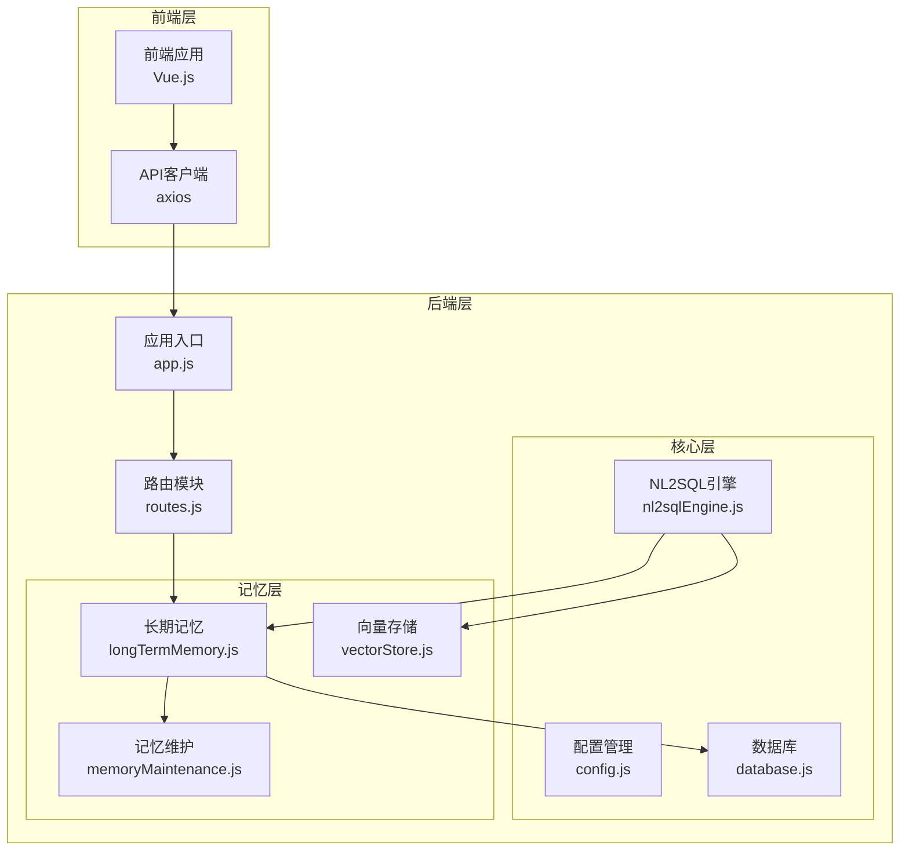
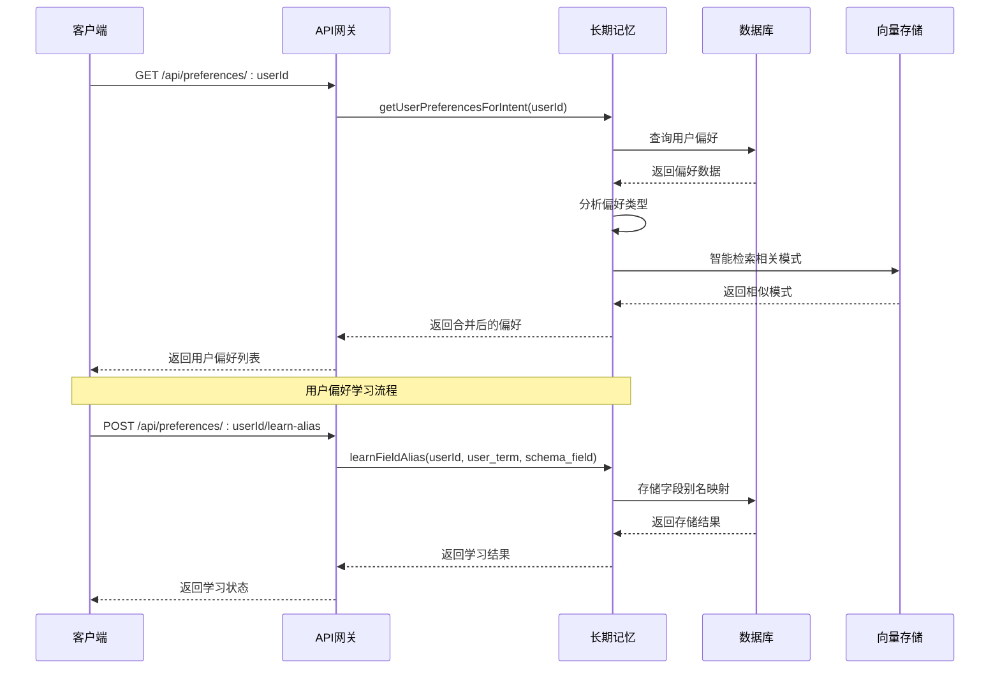
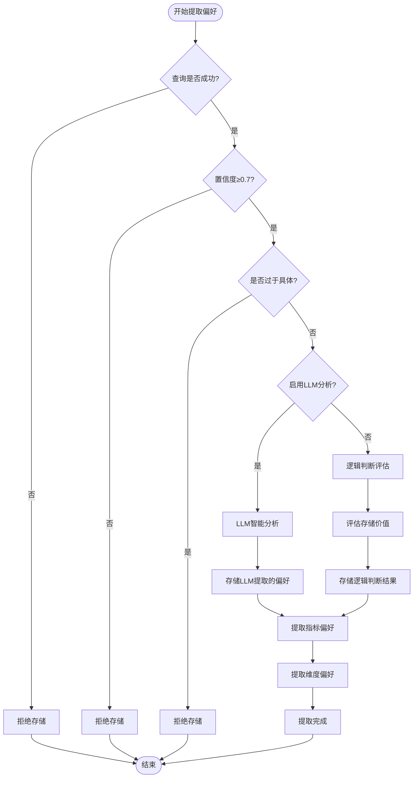
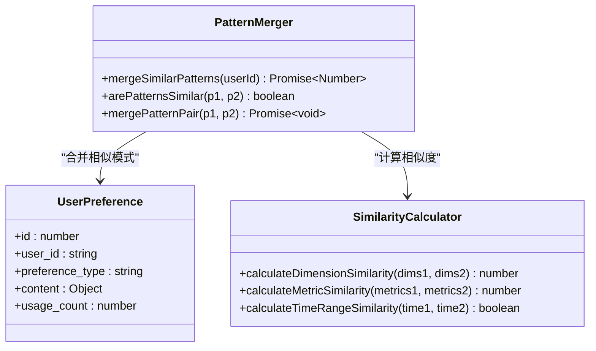
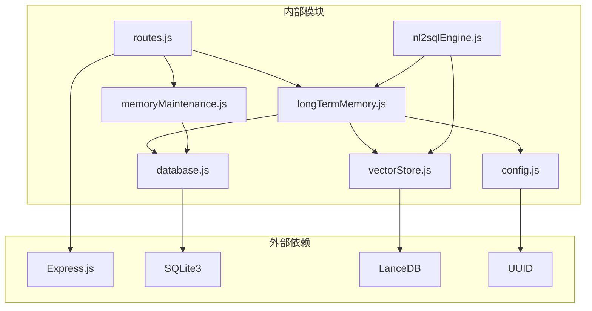

# 用户偏好接口

<cite>
**本文档引用的文件**
- [routes.js](file://backend/src/core/routes.js)
- [longTermMemory.js](file://backend/src/memory/longTermMemory.js)
- [memoryMaintenance.js](file://backend/src/memory/memoryMaintenance.js)
- [database.js](file://backend/src/core/database.js)
- [config.js](file://backend/src/core/config.js)
- [vectorStore.js](file://backend/src/memory/vectorStore.js)
- [nl2sqlEngine.js](file://backend/src/core/nl2sqlEngine.js)
- [app.js](file://backend/src/app.js)
- [api.js](file://frontend/src/utils/api.js)
</cite>

## 目录
1. [简介](#简介)
2. [项目结构](#项目结构)
3. [核心组件](#核心组件)
4. [架构概览](#架构概览)
5. [详细组件分析](#详细组件分析)
6. [依赖关系分析](#依赖关系分析)
7. [性能考虑](#性能考虑)
8. [故障排除指南](#故障排除指南)
9. [结论](#结论)

## 简介

用户偏好接口是NL2SQL系统中长期记忆系统的核心组成部分，负责管理用户的查询偏好、学习模式和个性化设置。该系统通过机器学习和人工规则相结合的方式，自动提取和存储用户的查询习惯，为后续的自然语言到SQL转换提供智能化支持。

系统支持四种主要的偏好类型：
- **查询模式 (query_pattern)**：用户常用的查询模板和模式
- **字段别名 (field_alias)**：用户对数据库字段的个性化称呼
- **指标偏好 (metric_preference)**：用户常用的业务指标
- **维度偏好 (dimension_preference)**：用户常用的分析维度

## 项目结构

NL2SQL项目的整体架构采用分层设计，用户偏好系统位于第三层（长期记忆层），与核心引擎和向量存储系统协同工作。



**图表来源**
- [app.js:1-238](file://backend/src/app.js#L1-L238)
- [routes.js:1-1037](file://backend/src/core/routes.js#L1-L1037)
- [longTermMemory.js:1-1141](file://backend/src/memory/longTermMemory.js#L1-L1141)

**章节来源**
- [app.js:1-238](file://backend/src/app.js#L1-L238)
- [routes.js:1-1037](file://backend/src/core/routes.js#L1-L1037)

## 核心组件

### 用户偏好API端点

系统提供以下用户偏好相关的API端点：

#### 获取用户偏好列表
- **端点**: `GET /api/preferences/:userId`
- **功能**: 获取指定用户的偏好列表
- **查询参数**:
  - `type`: 偏好类型筛选 (query_pattern|field_alias|metric_preference|dimension_preference)
  - `limit`: 返回数量限制 (默认50)

#### 获取用户偏好原始数据
- **端点**: `GET /api/preferences/:userId/raw`
- **功能**: 获取用户长期记忆原始数据（用于调试）
- **查询参数**:
  - `type`: 偏好类型筛选

#### 获取用户记忆统计
- **端点**: `GET /api/preferences/:userId/stats`
- **功能**: 获取用户记忆统计信息

#### 手动添加查询模板
- **端点**: `POST /api/preferences/:userId/templates`
- **功能**: 手动添加查询模板
- **请求体**: 
  ```javascript
  {
    name: "模板名称",
    dimensions: ["维度1", "维度2"],
    metrics: ["指标1"],
    default_time_range: { type: "relative", value: "最近7天" }
  }
  ```

#### 删除用户偏好
- **端点**: `DELETE /api/preferences/:preferenceId`
- **功能**: 删除指定的用户偏好

#### 手动学习字段别名
- **端点**: `POST /api/preferences/:userId/learn-alias`
- **功能**: 手动学习字段别名
- **请求体**:
  ```javascript
  {
    user_term: "用户的说法",
    schema_field: "对应的Schema字段",
    field_type: "metric|dimension|filter"
  }
  ```

**章节来源**
- [routes.js:453-716](file://backend/src/core/routes.js#L453-L716)

### 数据结构定义

#### 用户偏好表结构
用户偏好存储在SQLite数据库的`user_preferences`表中：

| 字段名 | 类型 | 描述 |
|--------|------|------|
| id | INTEGER | 记录唯一标识 |
| user_id | TEXT | 用户标识 |
| preference_type | TEXT | 偏好类型 |
| content | TEXT | 偏好内容（JSON格式） |
| usage_count | INTEGER | 使用次数 |
| last_used_at | DATETIME | 最后使用时间 |
| created_at | DATETIME | 创建时间 |
| updated_at | DATETIME | 更新时间 |

#### 偏好类型枚举
系统支持四种偏好类型：

1. **query_pattern**: 查询模式
   - 存储格式：包含name、dimensions、metrics、default_time_range等字段
   - 示例用途：存储用户常用的查询模板

2. **field_alias**: 字段别名
   - 存储格式：包含user_term、schema_field、field_type等字段
   - 示例用途：存储用户对数据库字段的个性化称呼

3. **metric_preference**: 指标偏好
   - 存储格式：包含field_name、last_query等字段
   - 示例用途：记录用户常用的业务指标

4. **dimension_preference**: 维度偏好
   - 存储格式：包含field_name、last_query等字段
   - 示例用途：记录用户常用的分析维度

**章节来源**
- [database.js:137-189](file://backend/src/core/database.js#L137-L189)
- [longTermMemory.js:36-42](file://backend/src/memory/longTermMemory.js#L36-L42)

## 架构概览

用户偏好系统采用三层架构设计，实现了从数据存储到智能学习的完整流程。



**图表来源**
- [routes.js:546-716](file://backend/src/core/routes.js#L546-L716)
- [longTermMemory.js:772-806](file://backend/src/memory/longTermMemory.js#L772-L806)
- [database.js:609-618](file://backend/src/core/database.js#L609-L618)

## 详细组件分析

### 长期记忆管理系统

长期记忆管理系统是用户偏好接口的核心实现，负责偏好数据的提取、存储和维护。

#### 核心功能模块

##### 偏好提取与存储
系统通过智能分析用户查询，自动提取有价值的偏好信息：



**图表来源**
- [longTermMemory.js:312-485](file://backend/src/memory/longTermMemory.js#L312-L485)

##### 存储筛选策略
系统采用多层次的筛选策略来决定是否存储用户偏好：

1. **前置过滤**：
   - 查询必须成功执行
   - 意图置信度必须≥0.7
   - 排除过于具体的查询（一次性查询）

2. **价值评估**：
   - 高价值模板：维度≥2且指标≥1
   - 高频模式：7天内相似查询≥2次
   - 简单查询：需要更高频率才存储

3. **LLM智能分析**（可选）：
   - 识别字段别名映射
   - 提取分析习惯
   - 判断通用知识vs个人偏好

**章节来源**
- [longTermMemory.js:252-296](file://backend/src/memory/longTermMemory.js#L252-L296)
- [longTermMemory.js:57-189](file://backend/src/memory/longTermMemory.js#L57-L189)

### 记忆维护系统

记忆维护系统负责长期记忆的清理、压缩和优化，确保系统性能和存储效率。

#### 清理策略
系统采用分级保留策略：

| 使用频率 | 保留策略 | 清理条件 |
|----------|----------|----------|
| 高频(≥10次) | 永久保留 | 不清理 |
| 中频(3-9次) | 90天未用清理 | 90天未使用 |
| 低频(<3次) | 30天未用清理 | 30天未使用 |
| 字段别名 | 365天未用清理 | 365天未使用 |

#### 相似模式合并
系统能够自动识别和合并相似的查询模式，减少重复存储：



**图表来源**
- [memoryMaintenance.js:201-309](file://backend/src/memory/memoryMaintenance.js#L201-L309)

**章节来源**
- [memoryMaintenance.js:24-46](file://backend/src/memory/memoryMaintenance.js#L24-L46)
- [memoryMaintenance.js:69-189](file://backend/src/memory/memoryMaintenance.js#L69-L189)

### 数据库交互层

数据库交互层提供了完整的CRUD操作和查询优化功能。

#### 核心数据库操作

##### 添加用户偏好
```javascript
async function addUserPreference(userId, type, content) {
    const sql = `
        INSERT INTO user_preferences (user_id, preference_type, content, last_used_at)
        VALUES (?, ?, ?, CURRENT_TIMESTAMP)
    `;
    const contentStr = JSON.stringify(content);
    const result = await run(sql, [userId, type, contentStr]);
    return { id: result.lastID, user_id: userId, preference_type: type, content };
}
```

##### 获取用户偏好列表
```javascript
async function getUserPreferences(userId, type = null, limit = 50) {
    let sql = `
        SELECT * FROM user_preferences 
        WHERE user_id = ?
    `;
    const params = [userId];
    
    if (type) {
        sql += ' AND preference_type = ?';
        params.push(type);
    }
    
    sql += ' ORDER BY usage_count DESC, last_used_at DESC LIMIT ?';
    params.push(limit);
    
    const preferences = await query(sql, params);
    return preferences.map(pref => ({
        ...pref,
        content: pref.content ? JSON.parse(pref.content) : null
    }));
}
```

##### 查找已存在偏好
```javascript
async function findExistingPreference(userId, type, contentKey) {
    let sql;
    let params = [userId, type];
    
    if (type === 'query_pattern') {
        sql = `
            SELECT * FROM user_preferences 
            WHERE user_id = ? AND preference_type = ?
            AND json_extract(content, "$.name") = ?
        `;
        params.push(contentKey);
    } else if (type === 'field_alias') {
        sql = `
            SELECT * FROM user_preferences 
            WHERE user_id = ? AND preference_type = ?
            AND json_extract(content, "$.user_term") = ?
        `;
        params.push(contentKey);
    }
    
    const result = await queryOne(sql, params);
    if (result) {
        result.content = result.content ? JSON.parse(result.content) : null;
    }
    return result;
}
```

**章节来源**
- [database.js:609-781](file://backend/src/core/database.js#L609-L781)

## 依赖关系分析

用户偏好系统与其他组件的依赖关系如下：



**图表来源**
- [routes.js:16-30](file://backend/src/core/routes.js#L16-L30)
- [longTermMemory.js:17-22](file://backend/src/memory/longTermMemory.js#L17-L22)
- [memoryMaintenance.js:16-18](file://backend/src/memory/memoryMaintenance.js#L16-L18)

### 配置管理

系统通过集中配置管理所有相关设置：

#### 长期记忆配置
- `LTM_ENABLED`: 是否启用长期记忆功能
- `LTM_USE_LLM`: 是否使用LLM进行智能提炼
- `minConfidence`: 最小置信度阈值
- `minDimensionsForTemplate`: 高价值模板最小维度数
- `minMetricsForTemplate`: 高价值模板最小指标数

#### 记忆保留策略
- `highUsage`: 高频偏好保留天数（null表示永久）
- `mediumUsage`: 中频偏好保留天数（默认90天）
- `lowUsage`: 低频偏好保留天数（默认30天）
- `fieldAlias`: 字段别名保留天数（默认365天）

**章节来源**
- [config.js:259-293](file://backend/src/core/config.js#L259-L293)

## 性能考虑

### 查询优化
系统通过多种方式优化查询性能：

1. **索引优化**：
   - 为`user_id`和`preference_type`建立复合索引
   - 为`created_at`和`updated_at`建立索引
   - 为`usage_count`建立索引

2. **查询缓存**：
   - 使用SQLite内存缓存提高查询速度
   - 实现查询结果缓存机制

3. **批量操作**：
   - 支持批量插入和更新操作
   - 事务处理确保数据一致性

### 内存管理
- 向量存储使用LanceDB进行高效管理
- 实现内存使用监控和限制
- 支持大数据集的分页查询

## 故障排除指南

### 常见问题及解决方案

#### API端点访问失败
**症状**：调用用户偏好API返回404或500错误
**原因**：
- 路由定义顺序问题
- 用户ID格式不正确
- 数据库连接异常

**解决方案**：
1. 检查路由定义顺序，确保`/preferences/:userId/raw`在`/preferences/:userId`之前
2. 验证用户ID格式和存在性
3. 检查数据库连接状态

#### 偏好数据存储失败
**症状**：学习字段别名或添加查询模板失败
**原因**：
- JSON格式错误
- 数据库约束冲突
- 权限不足

**解决方案**：
1. 验证请求体JSON格式
2. 检查数据库约束和索引
3. 确认用户权限

#### 性能问题
**症状**：API响应缓慢或内存占用过高
**原因**：
- 查询未使用索引
- 大量未使用的偏好数据
- 向量存储性能瓶颈

**解决方案**：
1. 优化查询语句和索引
2. 定期执行记忆维护清理
3. 调整向量存储配置

**章节来源**
- [routes.js:461-516](file://backend/src/core/routes.js#L461-L516)
- [database.js:361-424](file://backend/src/core/database.js#L361-L424)

## 结论

用户偏好接口为NL2SQL系统提供了强大的个性化能力，通过智能学习和记忆维护机制，能够有效提升用户体验和查询准确性。系统的设计充分考虑了可扩展性、性能和可靠性，在保证功能完整性的同时，也为未来的功能扩展奠定了坚实基础。

通过合理的配置管理和定期维护，用户偏好系统能够在实际生产环境中稳定运行，为用户提供持续优化的自然语言查询体验。