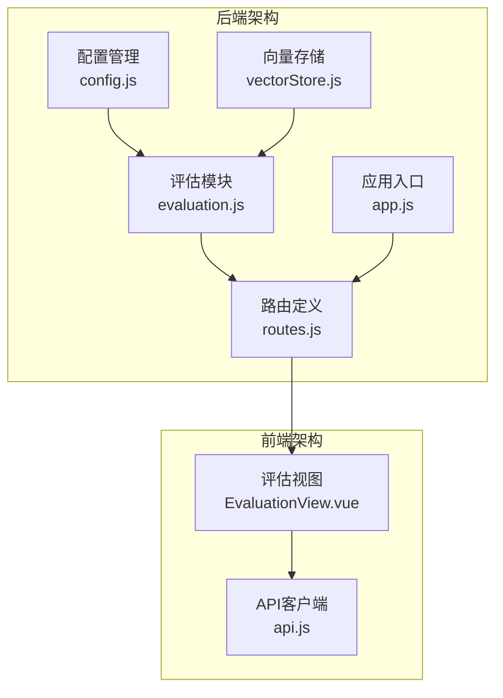
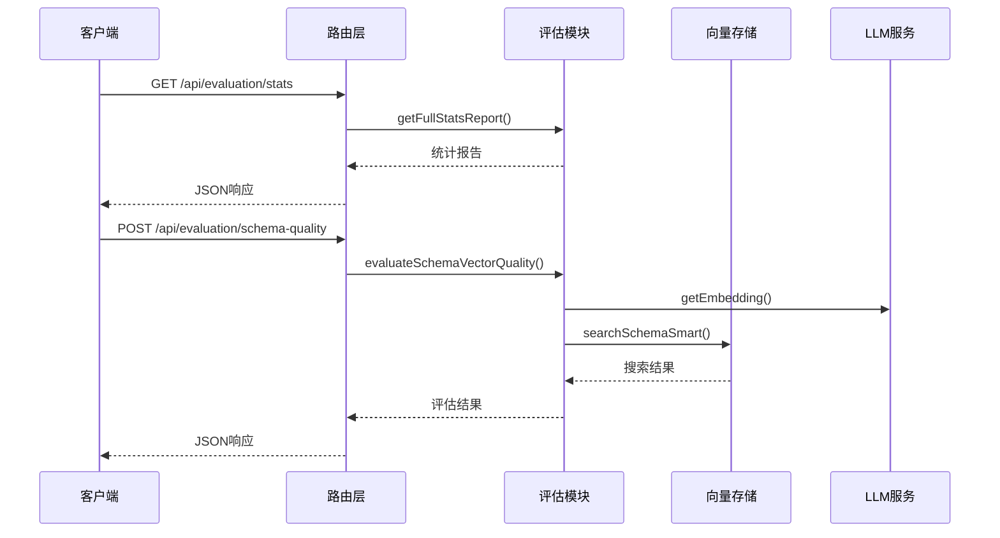
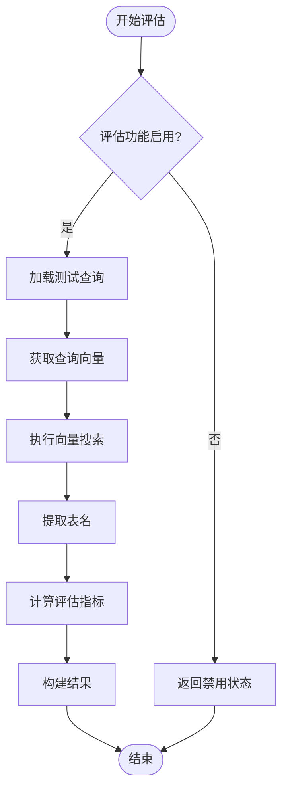
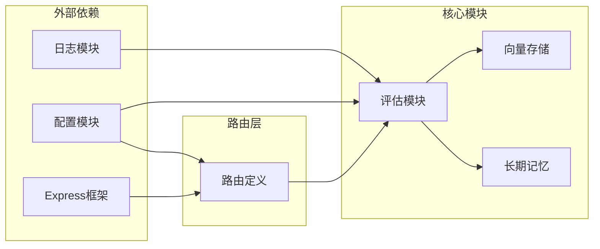

# 评估统计接口

<cite>
**本文档引用的文件**
- [evaluation.js](file://backend/src/utils/evaluation.js)
- [routes.js](file://backend/src/core/routes.js)
- [config.js](file://backend/src/core/config.js)
- [vectorStore.js](file://backend/src/memory/vectorStore.js)
- [EvaluationView.vue](file://frontend/src/views/EvaluationView.vue)
- [api.js](file://frontend/src/utils/api.js)
- [app.js](file://backend/src/app.js)
</cite>

## 目录
1. [简介](#简介)
2. [项目结构](#项目结构)
3. [核心组件](#核心组件)
4. [架构概览](#架构概览)
5. [详细组件分析](#详细组件分析)
6. [依赖关系分析](#依赖关系分析)
7. [性能考虑](#性能考虑)
8. [故障排除指南](#故障排除指南)
9. [结论](#结论)

## 简介

评估统计接口是 NL2SQL 系统中的重要监控和质量保证组件，提供了全面的向量化质量和记忆系统评估功能。该接口能够：

- **实时统计监控**：跟踪向量检索命中率、长期记忆命中率等关键指标
- **质量评估**：执行 Schema 向量化质量评估和查询历史相似度评估
- **配置管理**：灵活的评估功能开关和阈值配置
- **可视化展示**：通过前端界面直观展示评估结果

评估统计接口采用非侵入式设计，不会影响主业务流程的正常运行，同时提供了丰富的调试和监控能力。

## 项目结构

评估统计功能分布在后端和前端两个层面，形成了完整的监控体系：

**图表来源**
- [config.js:335-355](file://backend/src/core/config.js#L335-L355)
- [evaluation.js:1-488](file://backend/src/utils/evaluation.js#L1-L488)
- [routes.js:718-852](file://backend/src/core/routes.js#L718-L852)

**章节来源**
- [evaluation.js:1-488](file://backend/src/utils/evaluation.js#L1-L488)
- [routes.js:1-852](file://backend/src/core/routes.js#L1-L852)
- [config.js:335-355](file://backend/src/core/config.js#L335-L355)

## 核心组件

### 评估配置系统

评估系统采用集中式配置管理，支持灵活的功能开关和阈值调整：

| 配置项 | 类型 | 默认值 | 描述 |
|--------|------|--------|------|
| `evaluation.enabled` | boolean | false | 是否启用评估功能 |
| `evaluation.trackStats` | boolean | false | 是否记录运行时统计 |
| `evaluation.thresholds.highSimilarity` | number | 0.8 | 高相似度阈值 |
| `evaluation.thresholds.mediumSimilarity` | number | 0.5 | 中相似度阈值 |
| `evaluation.thresholds.highQuality` | number | 0.8 | 高质量阈值 |
| `evaluation.thresholds.mediumQuality` | number | 0.5 | 中质量阈值 |

### 运行时统计系统

评估系统维护两套核心统计指标：

#### 向量检索统计
- **Schema 检索**：跟踪表级向量检索的命中情况
- **查询历史检索**：跟踪历史查询向量的命中情况
- **距离分布**：记录检索结果的距离分布情况

#### 长期记忆统计
- **总体命中率**：所有记忆查询的命中情况
- **类型细分**：按记忆类型（字段别名、查询模式等）分类统计

**章节来源**
- [evaluation.js:19-60](file://backend/src/utils/evaluation.js#L19-L60)
- [evaluation.js:344-391](file://backend/src/utils/evaluation.js#L344-L391)

## 架构概览

评估统计接口采用分层架构设计，确保功能的模块化和可维护性：

**图表来源**
- [routes.js:722-803](file://backend/src/core/routes.js#L722-L803)
- [evaluation.js:158-266](file://backend/src/utils/evaluation.js#L158-L266)
- [vectorStore.js:450-536](file://backend/src/memory/vectorStore.js#L450-L536)

## 详细组件分析

### API 端点详解

#### 获取运行时统计报告
- **端点**：`GET /api/evaluation/stats`
- **功能**：返回当前内存中的统计报告
- **响应**：包含向量检索统计、记忆统计和配置信息

#### 重置统计数据
- **端点**：`POST /api/evaluation/stats/reset`
- **功能**：清空所有运行时统计数据
- **用途**：重新开始统计周期或清理历史数据

#### 获取评估配置
- **端点**：`GET /api/evaluation/config`
- **功能**：返回评估系统的配置状态
- **用途**：前端界面根据配置状态显示相应功能

#### 执行 Schema 向量化质量评估
- **端点**：`POST /api/evaluation/schema-quality`
- **功能**：评估向量化的 Schema 检索质量
- **输入**：测试查询列表（可选）
- **输出**：准确率、精确率、召回率、F1 分数等指标

#### 执行查询历史向量化质量评估
- **端点**：`POST /api/evaluation/query-quality`
- **功能**：评估查询历史的相似度计算质量
- **输入**：查询对列表（可选）
- **输出**：平均误差、相似度分布等指标

### 统计指标详解

#### 向量检索命中率
- **计算公式**：`命中次数 / 搜索总次数 × 100%`
- **意义**：反映向量检索系统的有效性
- **阈值参考**：
  - 优秀：≥ 80%
  - 良好：60-79%
  - 一般：40-59%
  - 较差：< 40%

#### 记忆命中率
- **计算公式**：`记忆命中次数 / 总查询次数 × 100%`
- **意义**：衡量长期记忆系统的实用性
- **类型细分**：
  - 字段别名：用户习惯的字段命名
  - 查询模式：常用的查询表达方式
  - 指标偏好：用户偏好的指标类型
  - 维度偏好：用户偏好的维度类型

#### 距离分布统计
- **极近 (<0.3)**：高度相似的匹配
- **较近 (0.3-0.5)**：中等相似度
- **中等 (0.5-0.7)**：较低相似度
- **较远 (>0.7)**：不相似的匹配

**章节来源**
- [evaluation.js:344-407](file://backend/src/utils/evaluation.js#L344-L407)
- [evaluation.js:71-122](file://backend/src/utils/evaluation.js#L71-L122)

### 评估算法实现

#### Schema 向量化质量评估
评估过程包含以下关键步骤：

**图表来源**
- [evaluation.js:158-266](file://backend/src/utils/evaluation.js#L158-L266)

#### 查询相似度评估
使用余弦相似度计算查询对之间的相似程度：

**章节来源**
- [evaluation.js:276-334](file://backend/src/utils/evaluation.js#L276-L334)
- [evaluation.js:134-147](file://backend/src/utils/evaluation.js#L134-L147)

## 依赖关系分析

评估统计接口的依赖关系体现了清晰的模块化设计：

**图表来源**
- [evaluation.js:12-13](file://backend/src/utils/evaluation.js#L12-L13)
- [routes.js:16-29](file://backend/src/core/routes.js#L16-L29)

### 关键依赖关系

1. **配置依赖**：评估功能完全依赖配置模块的状态
2. **统计依赖**：向量存储模块提供运行时统计数据
3. **路由依赖**：路由层负责 API 端点的暴露和请求处理
4. **前端依赖**：前端组件通过 API 客户端调用后端接口

**章节来源**
- [evaluation.js:12-13](file://backend/src/utils/evaluation.js#L12-L13)
- [routes.js:16-29](file://backend/src/core/routes.js#L16-L29)

## 性能考虑

### 非侵入式设计
评估系统采用非侵入式设计原则：
- **静默失败**：统计记录失败不影响主业务流程
- **异步处理**：评估操作不阻塞主线程
- **内存存储**：统计数据存储在内存中，避免磁盘 I/O

### 性能优化建议

#### 配置优化
1. **按需启用**：仅在需要时启用评估功能
2. **阈值调整**：根据实际需求调整评估阈值
3. **统计开关**：生产环境中可关闭统计记录以提升性能

#### 数据优化
1. **批量处理**：评估时使用批量向量生成
2. **结果缓存**：对频繁访问的评估结果进行缓存
3. **内存管理**：定期清理过期的统计数据

#### 监控建议
1. **定期检查**：建立定期的评估报告检查机制
2. **阈值监控**：设置关键指标的预警阈值
3. **趋势分析**：关注指标的变化趋势而非单一数值

## 故障排除指南

### 常见问题及解决方案

#### 评估功能未启用
**症状**：调用评估接口返回错误
**原因**：`EVALUATION_ENABLED=false`
**解决**：在 `.env` 文件中设置 `EVALUATION_ENABLED=true`

#### 向量数据库初始化失败
**症状**：向量检索统计为 0
**原因**：向量数据库未正确初始化
**解决**：检查向量数据库路径配置和初始化状态

#### LLM 服务不可用
**症状**：评估过程中出现超时或错误
**原因**：LLM API 密钥配置错误或网络问题
**解决**：验证 LLM 配置和网络连接

#### 权限不足
**症状**：某些 API 端点返回 403 错误
**原因**：评估功能被禁用或权限配置错误
**解决**：检查评估配置和路由权限设置

### 调试技巧

1. **启用详细日志**：在开发环境中提高日志级别
2. **检查配置**：验证所有相关配置项的正确性
3. **单元测试**：编写针对评估功能的单元测试
4. **性能监控**：监控评估操作对系统性能的影响

**章节来源**
- [routes.js:773-778](file://backend/src/core/routes.js#L773-L778)
- [config.js:366-388](file://backend/src/core/config.js#L366-L388)

## 结论

评估统计接口为 NL2SQL 系统提供了全面的质量监控和性能评估能力。通过非侵入式的设计和灵活的配置选项，该接口能够在不影响主业务流程的前提下，提供准确的统计信息和深入的分析结果。

### 主要优势

1. **非侵入式设计**：确保评估功能不影响系统性能
2. **灵活配置**：支持动态开关和阈值调整
3. **全面监控**：涵盖向量检索和记忆系统的各个方面
4. **易于使用**：提供直观的 API 接口和前端界面

### 最佳实践

1. **按需启用**：仅在开发和测试环境中启用评估功能
2. **定期评估**：建立定期的评估和分析机制
3. **阈值监控**：设置合理的预警阈值
4. **持续优化**：根据评估结果持续改进系统性能

通过合理使用评估统计接口，开发者可以更好地理解和优化 NL2SQL 系统的性能表现，确保系统在各种场景下都能提供高质量的服务。