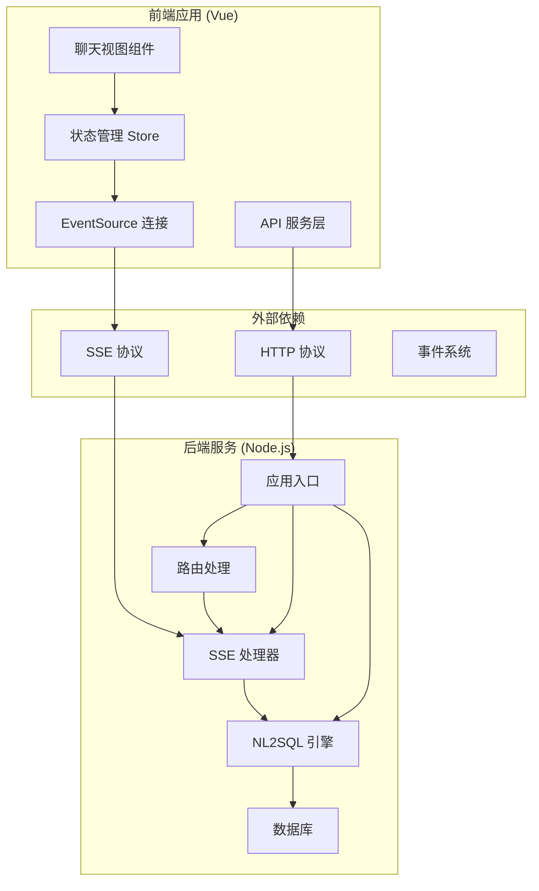
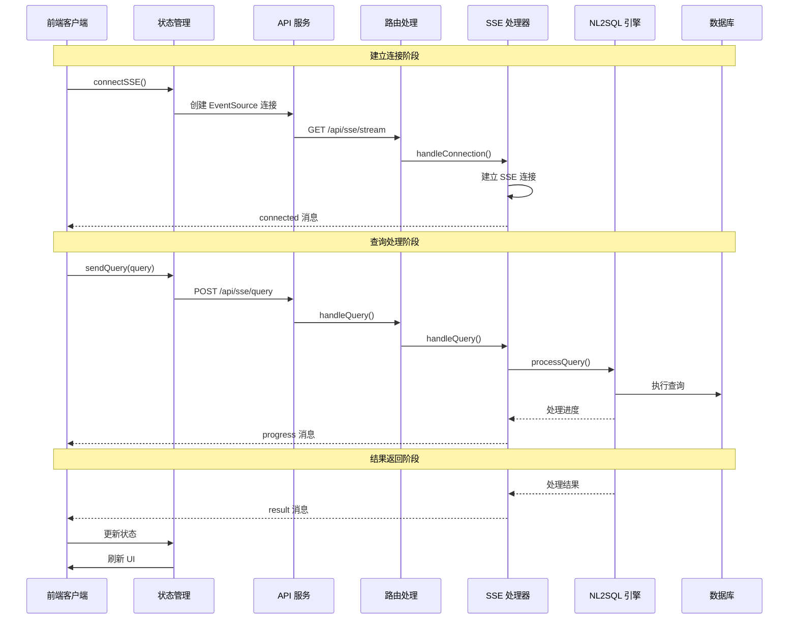
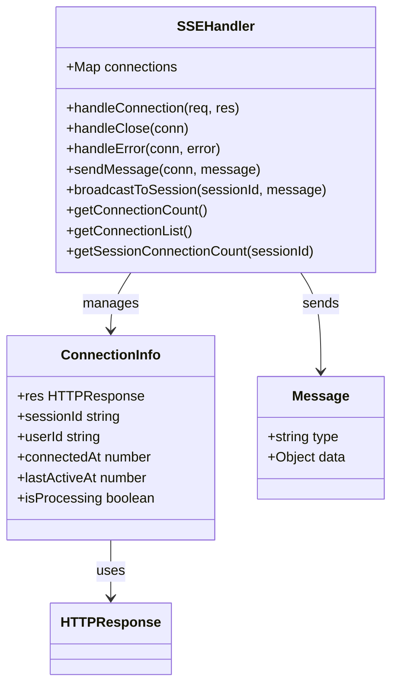
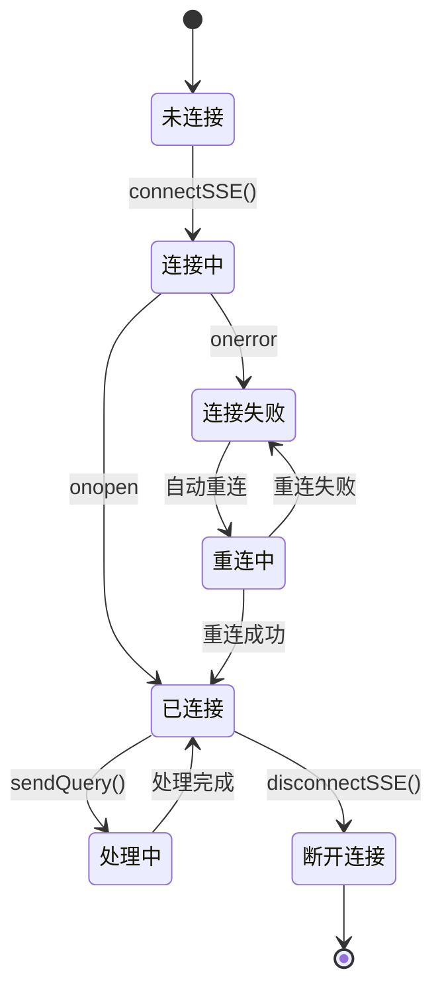
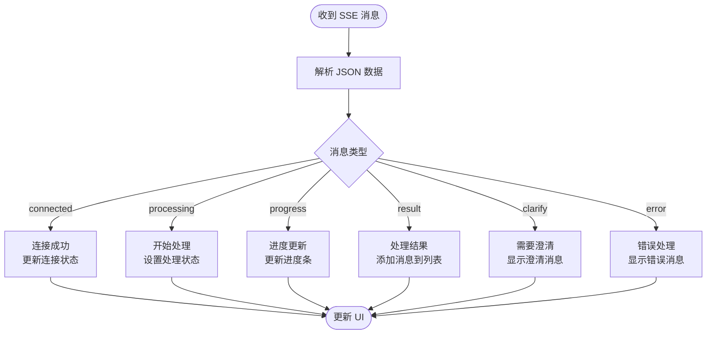
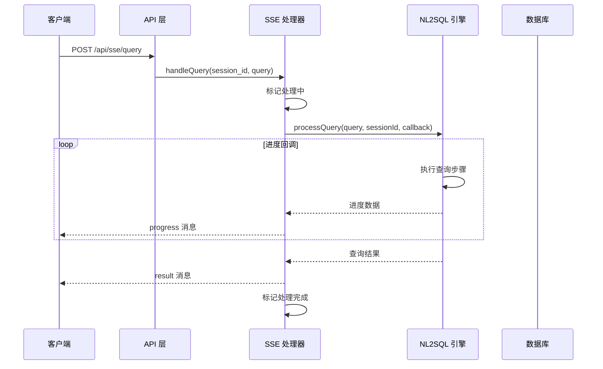
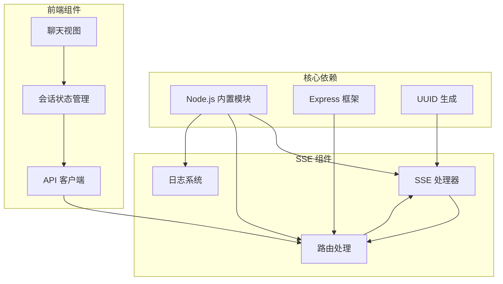

# SSE 实时通信

<cite>
**本文档引用的文件**
- [backend/src/core/sseHandler.js](file://backend/src/core/sseHandler.js)
- [backend/src/core/routes.js](file://backend/src/core/routes.js)
- [backend/src/app.js](file://backend/src/app.js)
- [backend/src/utils/logger.js](file://backend/src/utils/logger.js)
- [backend/src/core/nl2sqlEngine.js](file://backend/src/core/nl2sqlEngine.js)
- [frontend/src/stores/session.js](file://frontend/src/stores/session.js)
- [frontend/src/utils/api.js](file://frontend/src/utils/api.js)
- [frontend/src/views/ChatView.vue](file://frontend/src/views/ChatView.vue)
- [backend/package.json](file://backend/package.json)
</cite>

## 目录
1. [简介](#简介)
2. [项目结构](#项目结构)
3. [核心组件](#核心组件)
4. [架构概览](#架构概览)
5. [详细组件分析](#详细组件分析)
6. [依赖关系分析](#依赖关系分析)
7. [性能考虑](#性能考虑)
8. [故障排除指南](#故障排除指南)
9. [结论](#结论)

## 简介

NL2SQL 系统中的 Server-Sent Events (SSE) 实时通信系统是一个基于 HTTP 的双向流式通信解决方案，专门用于实现实时的自然语言到 SQL 查询处理反馈。该系统支持实时进度更新、错误处理和断线重连，为用户提供流畅的查询体验。

SSE 系统的核心特点包括：
- **实时流式消息推送**：支持渐进式查询处理进度反馈
- **多连接管理**：支持同一会话的多标签页连接
- **断线重连**：自动处理网络中断和连接丢失
- **错误处理**：完善的错误传播和恢复机制
- **性能优化**：连接池管理和资源清理

## 项目结构

NL2SQL 项目采用前后端分离的架构设计，SSE 功能主要集中在后端 Node.js 服务中实现，前端 Vue 应用通过 EventSource API 进行连接管理。

**图表来源**
- [backend/src/app.js:151-158](file://backend/src/app.js#L151-L158)
- [backend/src/core/routes.js:948-1002](file://backend/src/core/routes.js#L948-L1002)

**章节来源**
- [backend/src/app.js:56-87](file://backend/src/app.js#L56-L87)
- [backend/src/core/routes.js:1-54](file://backend/src/core/routes.js#L1-L54)

## 核心组件

### 后端 SSE 处理器

SSE 处理器是整个实时通信系统的核心，负责连接管理、消息发送和状态跟踪。

**主要功能**：
- **连接管理**：维护活跃连接映射，支持多标签页连接
- **消息发送**：将结构化消息转换为 SSE 格式推送
- **状态跟踪**：监控连接状态和处理进度
- **资源清理**：自动清理断开的连接和过期资源

### 路由层

路由层提供了两个核心 API 端点：
- **GET /api/sse/stream**：建立 SSE 连接
- **POST /api/sse/query**：提交查询请求

### 前端连接管理

前端使用 Vue Pinia 状态管理来处理 SSE 连接，包括：
- **连接建立**：通过 EventSource API 建立持久连接
- **消息处理**：解析和处理不同类型的消息
- **状态同步**：保持 UI 状态与服务器状态一致

**章节来源**
- [backend/src/core/sseHandler.js:26-349](file://backend/src/core/sseHandler.js#L26-L349)
- [backend/src/core/routes.js:948-1002](file://backend/src/core/routes.js#L948-L1002)
- [frontend/src/stores/session.js:185-341](file://frontend/src/stores/session.js#L185-L341)

## 架构概览

SSE 实时通信系统采用事件驱动的架构模式，实现了高效的异步消息传递。

**图表来源**
- [frontend/src/stores/session.js:185-330](file://frontend/src/stores/session.js#L185-L330)
- [backend/src/core/routes.js:957-1002](file://backend/src/core/routes.js#L957-L1002)
- [backend/src/core/sseHandler.js:218-280](file://backend/src/core/sseHandler.js#L218-L280)

## 详细组件分析

### SSE 连接处理器

SSE 连接处理器是系统的核心组件，负责管理所有实时连接。

#### 连接管理机制

**图表来源**
- [backend/src/core/sseHandler.js:26-349](file://backend/src/core/sseHandler.js#L26-L349)

#### 连接生命周期管理

连接生命周期包括四个主要阶段：

1. **连接建立**：验证会话有效性，设置响应头，存储连接信息
2. **消息处理**：接收客户端消息，处理业务逻辑
3. **状态监控**：监控连接状态，处理超时和错误
4. **资源清理**：断开连接时清理相关资源

#### 消息格式规范

系统支持多种消息类型，每种都有特定的数据结构：

| 消息类型 | 数据结构 | 用途 |
|---------|----------|------|
| `connected` | `{ session_id, message }` | 连接成功通知 |
| `processing` | `{ message }` | 开始处理通知 |
| `progress` | `{ message, stage, progress }` | 处理进度更新 |
| `result` | `{ message, type, sql, data }` | 查询结果 |
| `clarify` | `{ message }` | 需要澄清的信息 |
| `error` | `{ message }` | 错误通知 |

**章节来源**
- [backend/src/core/sseHandler.js:43-153](file://backend/src/core/sseHandler.js#L43-L153)
- [backend/src/core/sseHandler.js:165-204](file://backend/src/core/sseHandler.js#L165-L204)

### 前端连接管理

前端使用 Vue Pinia 管理 SSE 连接状态，实现了完整的连接生命周期管理。

#### 连接状态管理

**图表来源**
- [frontend/src/stores/session.js:185-341](file://frontend/src/stores/session.js#L185-L341)

#### 消息处理流程

前端通过 `handleSSEMessage` 方法处理不同类型的消息：

**图表来源**
- [frontend/src/stores/session.js:227-295](file://frontend/src/stores/session.js#L227-L295)

**章节来源**
- [frontend/src/stores/session.js:185-341](file://frontend/src/stores/session.js#L185-L341)
- [frontend/src/stores/session.js:227-295](file://frontend/src/stores/session.js#L227-L295)

### NL2SQL 引擎集成

SSE 系统与 NL2SQL 引擎深度集成，实现了查询处理的实时反馈。

#### 查询处理流程

**图表来源**
- [backend/src/core/sseHandler.js:218-280](file://backend/src/core/sseHandler.js#L218-L280)
- [backend/src/core/nl2sqlEngine.js:741-800](file://backend/src/core/nl2sqlEngine.js#L741-L800)

**章节来源**
- [backend/src/core/sseHandler.js:218-280](file://backend/src/core/sseHandler.js#L218-L280)
- [backend/src/core/nl2sqlEngine.js:741-800](file://backend/src/core/nl2sqlEngine.js#L741-L800)

## 依赖关系分析

SSE 系统的依赖关系相对简单，主要依赖于 Node.js 内置模块和 Express 框架。

**图表来源**
- [backend/src/core/sseHandler.js:15-20](file://backend/src/core/sseHandler.js#L15-L20)
- [backend/src/core/routes.js:16-29](file://backend/src/core/routes.js#L16-L29)
- [frontend/src/stores/session.js:16-22](file://frontend/src/stores/session.js#L16-L22)

**章节来源**
- [backend/package.json:10-26](file://backend/package.json#L10-L26)
- [backend/src/core/sseHandler.js:15-20](file://backend/src/core/sseHandler.js#L15-L20)

## 性能考虑

### 连接池管理

SSE 系统实现了高效的连接池管理机制：

1. **内存映射存储**：使用 Map 数据结构存储连接信息
2. **多标签页支持**：同一会话可支持多个并发连接
3. **资源清理**：自动清理断开的连接和过期资源
4. **连接统计**：提供连接状态监控和统计功能

### 并发控制

系统通过以下机制控制并发连接：

- **会话级连接限制**：每个会话可有多个连接，但共享处理状态
- **处理状态标记**：防止同时处理多个查询
- **进度回调机制**：渐进式处理避免长时间阻塞

### 性能优化建议

1. **连接复用**：建议前端复用现有连接而非频繁重建
2. **批量处理**：对于大量小查询，考虑合并处理
3. **缓存策略**：对重复查询结果进行缓存
4. **超时配置**：合理设置连接超时和心跳间隔

## 故障排除指南

### 常见问题及解决方案

#### 连接建立失败

**症状**：前端无法建立 SSE 连接
**原因**：
- 缺少 `session_id` 参数
- 会话不存在
- 服务器配置问题

**解决方案**：
1. 确保会话 ID 有效且存在
2. 检查服务器日志获取详细错误信息
3. 验证网络连接和防火墙设置

#### 消息接收异常

**症状**：连接建立但无法接收消息
**原因**：
- JSON 解析错误
- 消息格式不正确
- 前端事件处理异常

**解决方案**：
1. 检查后端日志中的消息格式
2. 验证前端消息处理逻辑
3. 确认消息类型和数据结构

#### 连接断开

**症状**：连接意外断开
**原因**：
- 网络不稳定
- 服务器重启
- 超时设置过短

**解决方案**：
1. 实现自动重连机制
2. 检查服务器稳定性
3. 调整超时和重连参数

**章节来源**
- [backend/src/core/sseHandler.js:48-62](file://backend/src/core/sseHandler.js#L48-L62)
- [frontend/src/stores/session.js:198-221](file://frontend/src/stores/session.js#L198-L221)

### 调试工具使用

#### 后端调试

1. **日志分析**：查看 `logs` 目录中的日志文件
2. **健康检查**：访问 `/api/health` 和 `/api/health/detail`
3. **连接状态**：使用 `/api/sse/stream` 端点检查连接状态

#### 前端调试

1. **浏览器开发者工具**：监控 Network 面板中的 SSE 连接
2. **控制台日志**：查看 SSE 相关的 JavaScript 日志
3. **状态监控**：使用 Vue DevTools 监控 Pinia 状态变化

**章节来源**
- [backend/src/app.js:98-166](file://backend/src/app.js#L98-L166)
- [backend/src/core/routes.js:100-137](file://backend/src/core/routes.js#L100-L137)

## 结论

NL2SQL 系统的 SSE 实时通信系统是一个设计精良的实时消息传递解决方案。它通过以下关键特性实现了高效、可靠的实时通信：

### 核心优势

1. **实时性**：支持渐进式查询处理反馈，提供流畅的用户体验
2. **可靠性**：完善的错误处理和断线重连机制
3. **可扩展性**：支持多连接和并发处理
4. **易用性**：简洁的 API 接口和清晰的状态管理

### 技术亮点

- **事件驱动架构**：基于 Node.js 事件系统实现高效的异步处理
- **状态管理**：前后端协同的状态管理确保数据一致性
- **错误处理**：全面的错误捕获和恢复机制
- **性能优化**：连接池管理和资源清理机制

### 应用场景

该 SSE 系统适用于需要实时反馈的各种应用场景：
- 自然语言查询处理
- 实时数据分析
- 流式数据处理
- 实时监控和告警

通过合理的配置和优化，该系统能够满足大多数实时通信需求，并为未来的功能扩展提供了良好的基础。