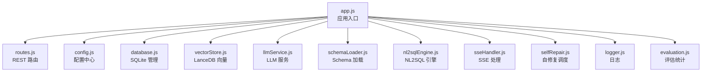
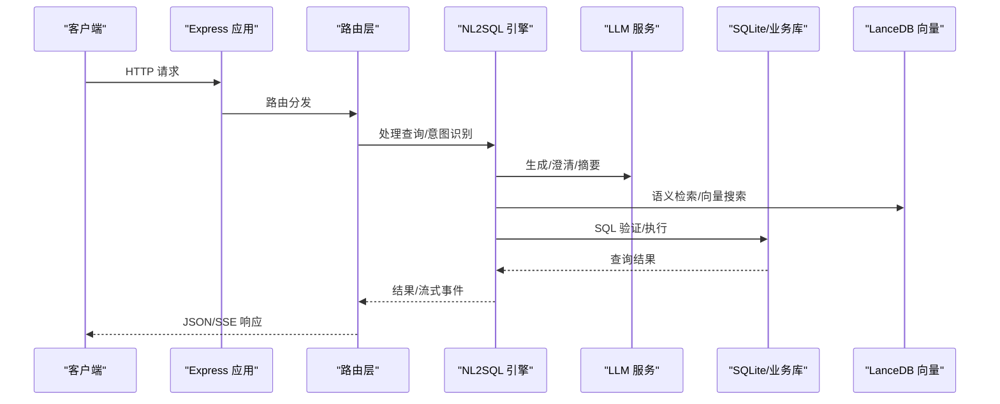
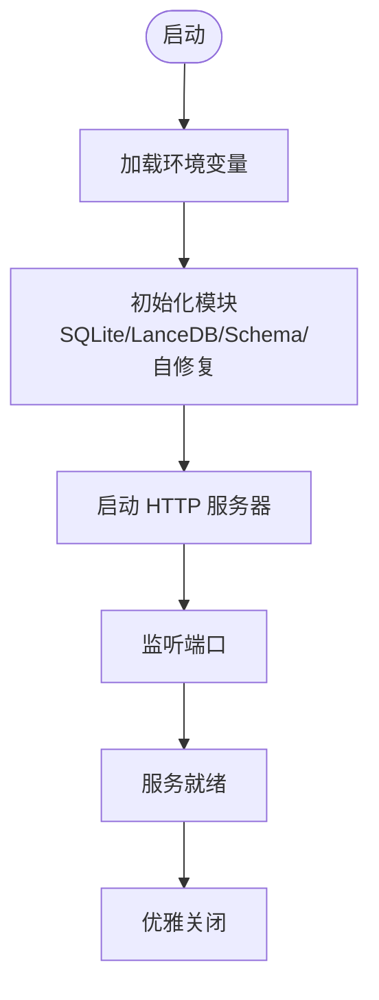
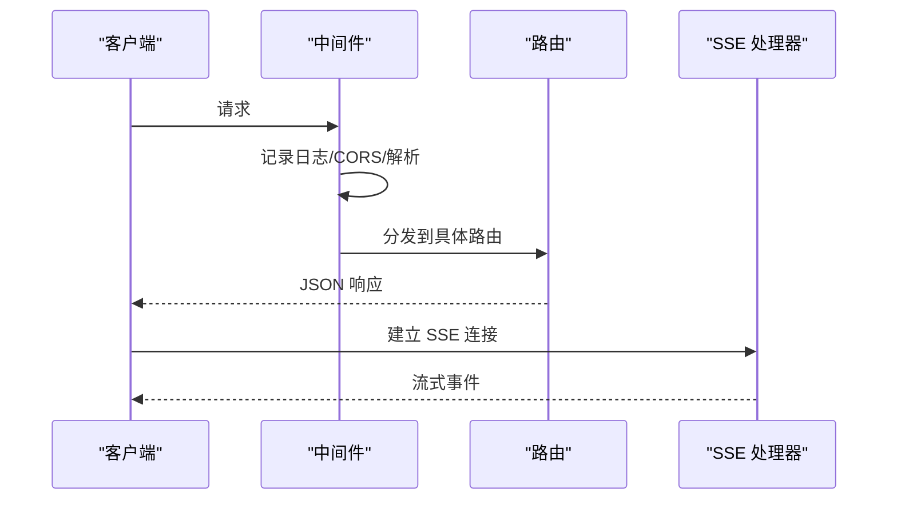
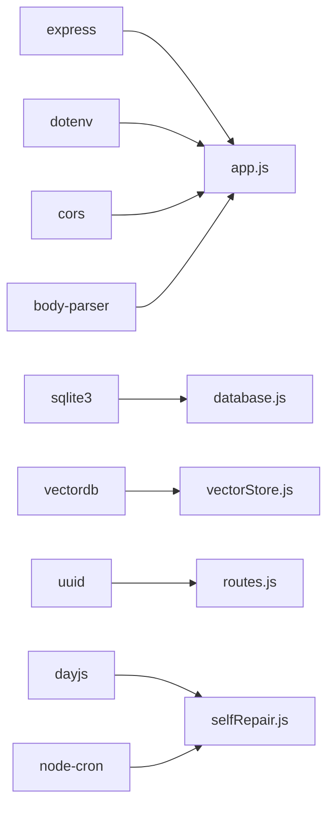

# 后端服务

<cite>
**本文引用的文件**
- [app.js](file://backend/src/app.js)
- [routes.js](file://backend/src/core/routes.js)
- [config.js](file://backend/src/core/config.js)
- [database.js](file://backend/src/core/database.js)
- [llmService.js](file://backend/src/core/llmService.js)
- [schemaLoader.js](file://backend/src/core/schemaLoader.js)
- [nl2sqlEngine.js](file://backend/src/core/nl2sqlEngine.js)
- [vectorStore.js](file://backend/src/memory/vectorStore.js)
- [longTermMemory.js](file://backend/src/memory/longTermMemory.js)
- [evaluation.js](file://backend/src/utils/evaluation.js)
- [logger.js](file://backend/src/utils/logger.js)
- [sseHandler.js](file://backend/src/core/sseHandler.js)
- [selfRepair.js](file://backend/src/core/selfRepair.js)
- [package.json](file://backend/package.json)
</cite>

## 目录
1. [简介](#简介)
2. [项目结构](#项目结构)
3. [核心组件](#核心组件)
4. [架构总览](#架构总览)
5. [详细组件分析](#详细组件分析)
6. [依赖分析](#依赖分析)
7. [性能考虑](#性能考虑)
8. [故障排查指南](#故障排查指南)
9. [结论](#结论)
10. [附录](#附录)

## 简介
本文件面向 NL2SQL 后端服务，系统基于 Express.js 构建 REST API，提供自然语言到 SQL 的转换能力，集成 LLM 服务、SQLite 会话存储、LanceDB 向量数据库与长期记忆系统。文档覆盖架构设计、路由与中间件、请求处理流程、核心业务模块、API 接口参考、错误处理与安全策略、性能优化、监控与调试等内容。

## 项目结构
后端采用模块化分层组织：
- 入口与启动：app.js
- 核心服务：config、database、llmService、schemaLoader、nl2sqlEngine、sseHandler、selfRepair
- 记忆与向量：vectorStore、longTermMemory、memoryMaintenance、summarizer
- 工具与评估：logger、evaluation、tokenBudget
- 路由与控制器：routes.js
- 依赖与脚本：package.json

图表来源
- [app.js:1-238](file://backend/src/app.js#L1-L238)
- [routes.js:1-1037](file://backend/src/core/routes.js#L1-L1037)
- [config.js:1-398](file://backend/src/core/config.js#L1-L398)
- [database.js:1-850](file://backend/src/core/database.js#L1-L850)
- [vectorStore.js:1-759](file://backend/src/memory/vectorStore.js#L1-L759)
- [llmService.js:1-468](file://backend/src/core/llmService.js#L1-L468)
- [schemaLoader.js:1-1071](file://backend/src/core/schemaLoader.js#L1-L1071)
- [nl2sqlEngine.js:1-2492](file://backend/src/core/nl2sqlEngine.js#L1-L2492)
- [sseHandler.js:1-349](file://backend/src/core/sseHandler.js#L1-L349)
- [selfRepair.js:1-489](file://backend/src/core/selfRepair.js#L1-L489)
- [logger.js:1-442](file://backend/src/utils/logger.js#L1-L442)
- [evaluation.js:1-488](file://backend/src/utils/evaluation.js#L1-L488)

章节来源
- [app.js:1-238](file://backend/src/app.js#L1-L238)
- [package.json:1-28](file://backend/package.json#L1-L28)

## 核心组件
- Express 应用与中间件：CORS、BodyParser、路由挂载
- 配置中心：集中管理 LLM、Embedding、数据库、安全、会话、日志、评估等配置
- 数据库：SQLite 会话与历史存储，支持事务与迁移
- LLM 服务：HTTP 请求封装、重试、流式响应、Embedding
- Schema 管理：Schema 加载、校验、向量化、语义检索
- NL2SQL 引擎：意图识别、实体解析、SQL 生成与验证、澄清与学习
- 向量存储：LanceDB 表管理、向量搜索、智能重排序
- 长期记忆：偏好提取与存储（查询模式、字段别名、指标/维度偏好）
- SSE 处理：连接管理、进度回调、流式消息
- 自修复：定时任务、会话清理、健康检查、统计收集
- 日志与评估：统一日志、运行时统计、向量化质量评估

章节来源
- [config.js:1-398](file://backend/src/core/config.js#L1-L398)
- [database.js:1-850](file://backend/src/core/database.js#L1-L850)
- [llmService.js:1-468](file://backend/src/core/llmService.js#L1-L468)
- [schemaLoader.js:1-1071](file://backend/src/core/schemaLoader.js#L1-L1071)
- [nl2sqlEngine.js:1-2492](file://backend/src/core/nl2sqlEngine.js#L1-L2492)
- [vectorStore.js:1-759](file://backend/src/memory/vectorStore.js#L1-L759)
- [longTermMemory.js:1-1141](file://backend/src/memory/longTermMemory.js#L1-L1141)
- [sseHandler.js:1-349](file://backend/src/core/sseHandler.js#L1-L349)
- [selfRepair.js:1-489](file://backend/src/core/selfRepair.js#L1-L489)
- [logger.js:1-442](file://backend/src/utils/logger.js#L1-L442)
- [evaluation.js:1-488](file://backend/src/utils/evaluation.js#L1-L488)

## 架构总览
后端服务启动时初始化数据目录、SQLite、LanceDB、Schema 元数据，随后启动 HTTP 服务器与 SSE 服务。路由层提供健康检查、Schema 查询、会话与消息管理、查询历史、用户偏好、评估接口等 REST API。核心业务由 NL2SQL 引擎驱动，结合 LLM 服务与向量存储实现语义检索与 SQL 生成。

图表来源
- [app.js:93-166](file://backend/src/app.js#L93-L166)
- [routes.js:1-1037](file://backend/src/core/routes.js#L1-L1037)
- [nl2sqlEngine.js:1-2492](file://backend/src/core/nl2sqlEngine.js#L1-L2492)
- [llmService.js:1-468](file://backend/src/core/llmService.js#L1-L468)
- [database.js:1-850](file://backend/src/core/database.js#L1-L850)
- [vectorStore.js:1-759](file://backend/src/memory/vectorStore.js#L1-L759)

## 详细组件分析

### Express 应用与启动流程
- 加载环境变量、初始化日志、数据库、向量库、Schema、自修复调度器
- 启动 HTTP 服务器，监听端口，输出健康与 SSE 地址
- 优雅关闭：关闭服务器、SSE、定时任务、数据库连接

图表来源
- [app.js:93-166](file://backend/src/app.js#L93-L166)

章节来源
- [app.js:1-238](file://backend/src/app.js#L1-L238)

### 路由与中间件
- 中间件：请求日志中间件、CORS、BodyParser(JSON/URL 编码)
- 路由分层：健康检查、Schema、会话与消息、查询历史、用户偏好、评估
- SSE：/api/sse/stream，支持连接、进度回调、结果推送

图表来源
- [routes.js:46-54](file://backend/src/core/routes.js#L46-L54)
- [sseHandler.js:43-112](file://backend/src/core/sseHandler.js#L43-L112)

章节来源
- [routes.js:1-1037](file://backend/src/core/routes.js#L1-L1037)
- [sseHandler.js:1-349](file://backend/src/core/sseHandler.js#L1-L349)

### 配置管理
- 集中配置：LLM/Embedding、数据库、向量库、安全白名单、会话、日志、自修复、Schema、长期记忆、上下文管理、评估
- 配置验证：启动时校验必要项（LLM API Key、SR 数据库 URL）

章节来源
- [config.js:1-398](file://backend/src/core/config.js#L1-L398)

### 数据库与会话管理
- SQLite：sessions、messages、query_history、user_preferences、system_logs
- 事务：批量操作、一致性保障
- 会话：创建、查询、删除、消息历史、标题更新、最近使用时间
- 偏好：查询模式、字段别名、指标/维度偏好、使用统计

章节来源
- [database.js:1-850](file://backend/src/core/database.js#L1-L850)

### LLM 服务与 Embedding
- HTTP 请求封装：支持流式响应、超时、重试
- 工具定义辅助：函数式工具
- Embedding：向量维度、批量获取、错误处理

章节来源
- [llmService.js:1-468](file://backend/src/core/llmService.js#L1-L468)

### Schema 管理与向量化
- Schema 加载：JSON 配置、校验、映射构建
- 向量化：表级表征、元数据标签、批量 Embedding、存储到 LanceDB
- 智能搜索：基于查询意图的重排序与过滤

章节来源
- [schemaLoader.js:1-1071](file://backend/src/core/schemaLoader.js#L1-L1071)
- [vectorStore.js:1-759](file://backend/src/memory/vectorStore.js#L1-L759)

### NL2SQL 引擎
- 意图识别：上下文摘要、用户偏好、字段别名、时间范围、维度/指标/筛选
- 实体解析：游戏/渠道 ID、平台标识、模糊匹配
- SQL 生成与验证：白名单、禁止关键字、行数限制、超时
- 澄清与学习：默认选项解析、别名学习、对话摘要

章节来源
- [nl2sqlEngine.js:1-2492](file://backend/src/core/nl2sqlEngine.js#L1-L2492)

### 长期记忆与偏好
- LLM 智能提炼：区分个人偏好与通用知识
- 存储策略：高价值模板、高频模式、字段别名、指标/维度偏好
- 学习与更新：去重、使用统计、冲突检测

章节来源
- [longTermMemory.js:1-1141](file://backend/src/memory/longTermMemory.js#L1-L1141)

### SSE 与流式处理
- 连接管理：多标签页支持、连接统计
- 查询处理：进度回调、错误广播、结果推送
- 广播：同一会话多连接同步

章节来源
- [sseHandler.js:1-349](file://backend/src/core/sseHandler.js#L1-L349)

### 自修复与定时任务
- 每日自检：数据库、向量库、查询统计、连接数、系统资源
- 会话清理：过期会话归档
- 统计收集：连接数、内存使用
- 记忆维护：压缩与健康报告

章节来源
- [selfRepair.js:1-489](file://backend/src/core/selfRepair.js#L1-L489)

### 日志与评估
- 日志：级别、文件轮转、结构化、追踪会话
- 评估：向量检索命中率、长期记忆命中率、质量评估指标

章节来源
- [logger.js:1-442](file://backend/src/utils/logger.js#L1-L442)
- [evaluation.js:1-488](file://backend/src/utils/evaluation.js#L1-L488)

## 依赖分析
- Express：Web 框架
- SQLite3：本地数据库
- vectordb/lancedb：向量数据库
- dotenv/cors/body-parser：环境变量、跨域、请求体解析
- uuid/dayjs/node-cron：ID、时间、定时任务

图表来源
- [package.json:10-27](file://backend/package.json#L10-L27)
- [app.js:22-33](file://backend/src/app.js#L22-L33)
- [routes.js:16-29](file://backend/src/core/routes.js#L16-L29)
- [database.js:12-19](file://backend/src/core/database.js#L12-L19)
- [vectorStore.js:14-21](file://backend/src/memory/vectorStore.js#L14-L21)
- [selfRepair.js:15-26](file://backend/src/core/selfRepair.js#L15-L26)

章节来源
- [package.json:1-28](file://backend/package.json#L1-L28)

## 性能考虑
- 连接与资源
  - SQLite：外键约束启用、事务批量写入、索引优化
  - LanceDB：表级向量、批量 Embedding、智能搜索重排序
- LLM 与网络
  - 超时与重试、流式响应、批量 Embedding
- 安全与限流
  - 白名单表、禁止关键字、最大行数、查询超时
- 日志与监控
  - 统一日志、运行时统计、健康检查、慢查询阈值

章节来源
- [config.js:140-170](file://backend/src/core/config.js#L140-L170)
- [database.js:228-235](file://backend/src/core/database.js#L228-L235)
- [vectorStore.js:450-535](file://backend/src/memory/vectorStore.js#L450-L535)
- [llmService.js:167-195](file://backend/src/core/llmService.js#L167-L195)
- [selfRepair.js:243-246](file://backend/src/core/selfRepair.js#L243-L246)

## 故障排查指南
- 启动失败
  - 检查 .env 必填项（LLM API Key、SR 数据库 URL）
  - 查看日志文件与级别
- 数据库问题
  - SQLite 初始化失败、迁移异常、外键约束
- 向量库问题
  - LanceDB 未初始化、表不存在、向量数量为 0
- LLM 问题
  - API Key/URL 错误、超时、响应解析失败
- SSE 问题
  - 连接参数缺失、会话不存在、并发处理冲突
- 评估与统计
  - 评估开关、统计重置、阈值配置

章节来源
- [config.js:366-388](file://backend/src/core/config.js#L366-L388)
- [logger.js:1-442](file://backend/src/utils/logger.js#L1-L442)
- [database.js:200-261](file://backend/src/core/database.js#L200-L261)
- [vectorStore.js:231-261](file://backend/src/memory/vectorStore.js#L231-L261)
- [llmService.js:135-151](file://backend/src/core/llmService.js#L135-L151)
- [sseHandler.js:43-112](file://backend/src/core/sseHandler.js#L43-L112)
- [evaluation.js:1-488](file://backend/src/utils/evaluation.js#L1-L488)

## 结论
本后端服务以模块化与分层设计为核心，结合 LLM 与向量检索实现自然语言到 SQL 的智能转换，配合 SQLite 与 LanceDB 提供会话与语义能力，通过自修复与评估体系保障稳定性与可运维性。建议在生产环境中启用白名单、限制行数与超时、开启评估统计，并定期执行自修复任务。

## 附录

### API 接口参考

- 健康检查
  - GET /api/health
  - GET /api/health/detail

- Schema
  - GET /api/schema?type={tables|metrics|dimensions}
  - GET /api/schema/tables/:tableName
  - GET /api/schema/search?q=&limit=

- 会话管理
  - POST /api/sessions
  - GET /api/sessions/:sessionId
  - DELETE /api/sessions/:sessionId
  - GET /api/sessions/:sessionId/messages?limit=
  - GET /api/users/:userId/sessions?limit=

- 查询历史
  - GET /api/queries/history?user_id=&session_id=&limit=

- 用户偏好（长期记忆）
  - GET /api/preferences/:userId/raw?type=
  - GET /api/preferences/:userId/stats
  - GET /api/preferences/:userId?type=&limit=
  - POST /api/preferences/:userId/templates
  - DELETE /api/preferences/:preferenceId
  - POST /api/preferences/:userId/learn-alias

- 评估
  - GET /api/evaluation/stats
  - POST /api/evaluation/stats/reset
  - POST /api/evaluation/schema-quality

- SSE
  - GET /api/sse/stream?session_id=&user_id=

章节来源
- [routes.js:60-800](file://backend/src/core/routes.js#L60-L800)

### 错误处理与安全策略
- 统一错误：路由层捕获异常并返回 JSON 错误
- 安全：白名单表、禁止关键字、最大行数、查询超时、敏感字段脱敏
- CORS：允许跨域（开发环境）
- 优雅关闭：SIGTERM/SIGINT、未处理异常与拒绝

章节来源
- [routes.js:284-344](file://backend/src/core/routes.js#L284-L344)
- [config.js:140-170](file://backend/src/core/config.js#L140-L170)
- [app.js:176-230](file://backend/src/app.js#L176-L230)

### 监控与调试
- 日志：级别、文件轮转、结构化、追踪会话
- 评估：向量检索命中率、长期记忆命中率、质量评估
- 自修复：每日自检、会话清理、统计收集、记忆维护
- 调试：traceStep/endTrace、SSE 进度回调

章节来源
- [logger.js:263-408](file://backend/src/utils/logger.js#L263-L408)
- [evaluation.js:397-429](file://backend/src/utils/evaluation.js#L397-L429)
- [selfRepair.js:169-310](file://backend/src/core/selfRepair.js#L169-L310)
- [sseHandler.js:218-280](file://backend/src/core/sseHandler.js#L218-L280)