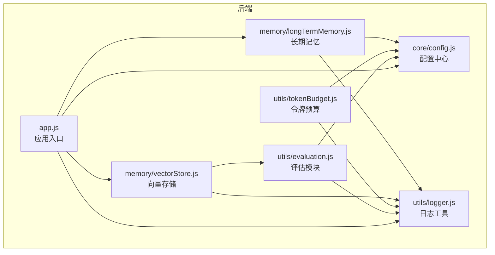
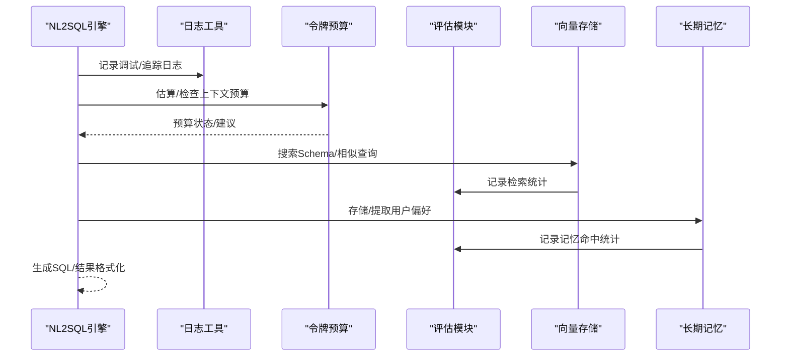
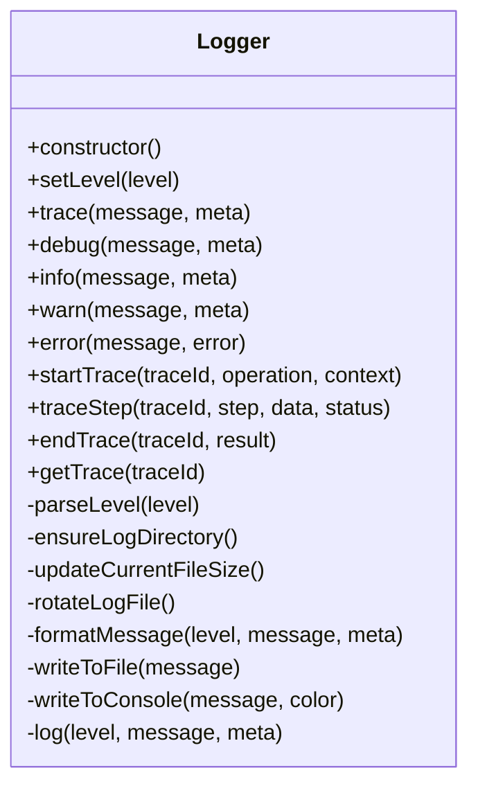
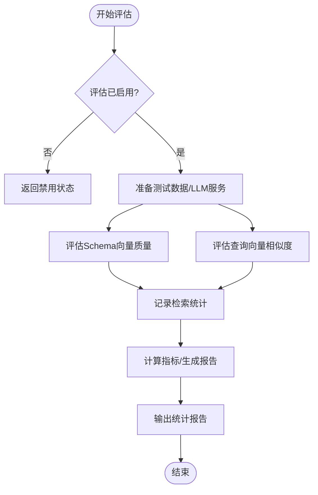
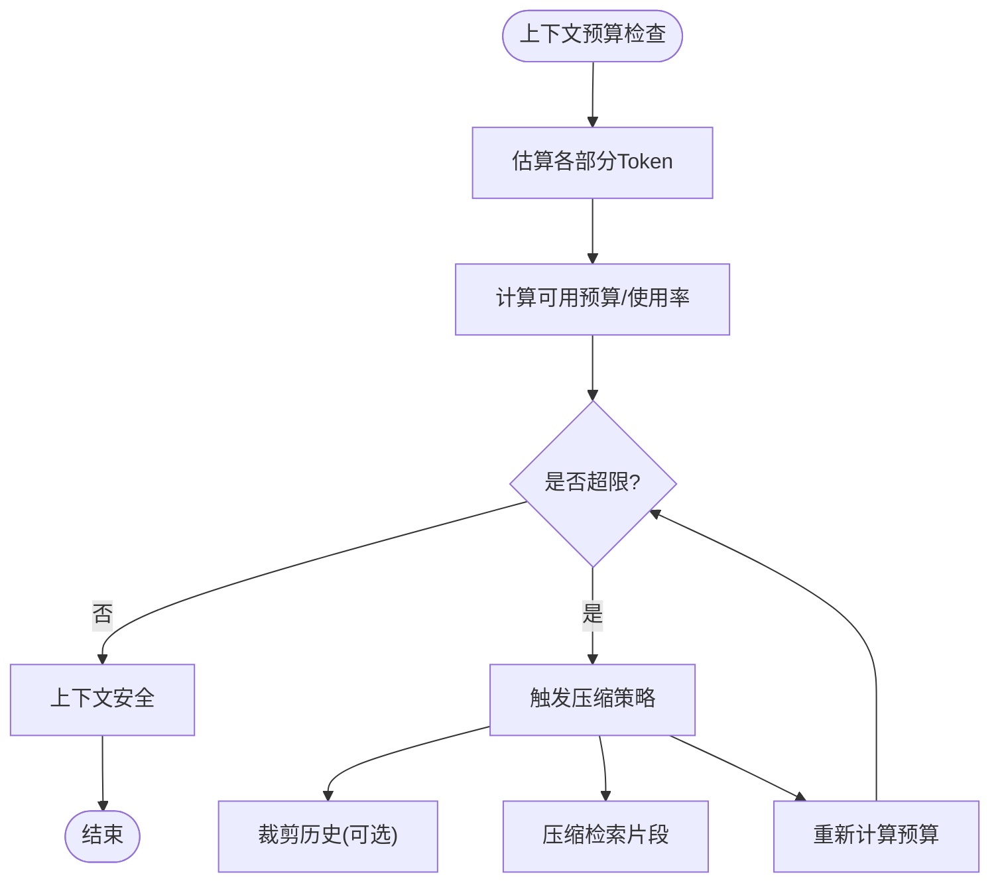
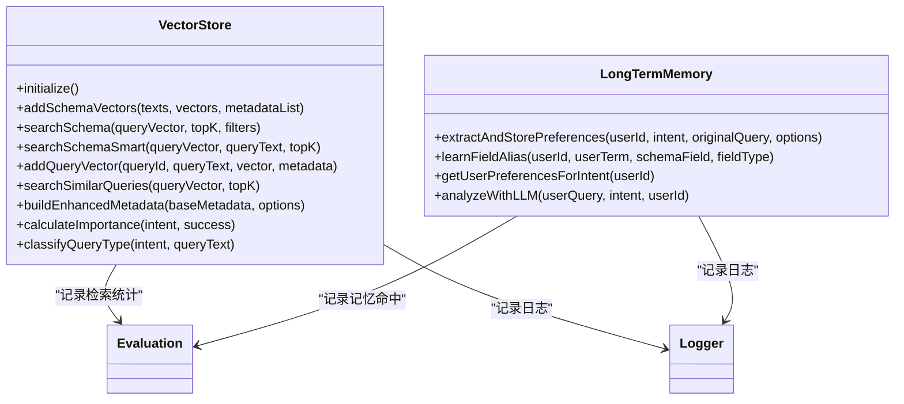
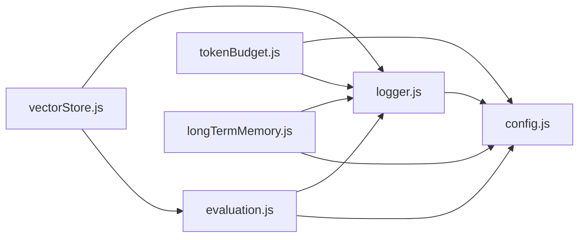

# 工具函数与辅助模块

<cite>
**本文档引用的文件**
- [logger.js](file://backend/src/utils/logger.js)
- [evaluation.js](file://backend/src/utils/evaluation.js)
- [tokenBudget.js](file://backend/src/utils/tokenBudget.js)
- [config.js](file://backend/src/core/config.js)
- [vectorStore.js](file://backend/src/memory/vectorStore.js)
- [longTermMemory.js](file://backend/src/memory/longTermMemory.js)
- [app.js](file://backend/src/app.js)
- [context-management.test.js](file://backend/test/context-management.test.js)
- [package.json](file://backend/package.json)
</cite>

## 目录
1. [简介](#简介)
2. [项目结构](#项目结构)
3. [核心组件](#核心组件)
4. [架构概览](#架构概览)
5. [详细组件分析](#详细组件分析)
6. [依赖分析](#依赖分析)
7. [性能考量](#性能考量)
8. [故障排查指南](#故障排查指南)
9. [结论](#结论)
10. [附录](#附录)

## 简介
本文件聚焦 NL2SQL 工具函数与辅助模块，涵盖日志记录系统、评估模块与令牌预算管理机制。文档详细说明：
- 日志系统的配置与使用：日志级别、格式化选项、输出目标与追踪能力
- 评估模块的功能：查询质量评估、性能指标收集与统计分析
- 令牌预算管理：成本控制、使用限制与超限处理策略
- 使用示例与最佳实践：如何在 NL2SQL 引擎中集成这些工具
- 模块间的协作关系与依赖关系

## 项目结构
NL2SQL 后端采用模块化组织，工具与辅助模块位于 `backend/src/utils`，核心配置位于 `backend/src/core`，向量存储与长期记忆位于 `backend/src/memory`，入口文件位于 `backend/src/app.js`。

图表来源
- [app.js:97-166](file://backend/src/app.js#L97-L166)
- [config.js:16-355](file://backend/src/core/config.js#L16-L355)
- [logger.js:54-442](file://backend/src/utils/logger.js#L54-L442)
- [evaluation.js:12-488](file://backend/src/utils/evaluation.js#L12-L488)
- [tokenBudget.js:12-435](file://backend/src/utils/tokenBudget.js#L12-L435)
- [vectorStore.js:14-759](file://backend/src/memory/vectorStore.js#L14-L759)
- [longTermMemory.js:17-800](file://backend/src/memory/longTermMemory.js#L17-L800)

章节来源
- [app.js:97-166](file://backend/src/app.js#L97-L166)
- [package.json:10-27](file://backend/package.json#L10-L27)

## 核心组件
- 日志工具模块：统一日志记录、级别控制、文件轮转、结构化输出与执行流程追踪
- 评估模块：向量化质量评估、历史记忆命中率统计、运行时统计与报告
- 令牌预算管理：上下文 Token 估算、预算计算、压缩与裁剪策略
- 向量存储与长期记忆：语义检索、元数据增强、偏好学习与存储

章节来源
- [logger.js:54-442](file://backend/src/utils/logger.js#L54-L442)
- [evaluation.js:12-488](file://backend/src/utils/evaluation.js#L12-L488)
- [tokenBudget.js:12-435](file://backend/src/utils/tokenBudget.js#L12-L435)
- [vectorStore.js:14-759](file://backend/src/memory/vectorStore.js#L14-L759)
- [longTermMemory.js:17-800](file://backend/src/memory/longTermMemory.js#L17-L800)

## 架构概览
工具模块与核心引擎的交互关系如下：

图表来源
- [logger.js:233-310](file://backend/src/utils/logger.js#L233-L310)
- [tokenBudget.js:115-181](file://backend/src/utils/tokenBudget.js#L115-L181)
- [vectorStore.js:427-435](file://backend/src/memory/vectorStore.js#L427-L435)
- [evaluation.js:71-122](file://backend/src/utils/evaluation.js#L71-L122)
- [longTermMemory.js:312-485](file://backend/src/memory/longTermMemory.js#L312-L485)

## 详细组件分析

### 日志记录系统
- 功能概述
  - 控制台彩色输出与文件输出
  - 多级别日志（TRACE/DEBUG/INFO/WARN/ERROR）
  - 结构化日志格式与时间戳
  - 执行流程追踪（trace）：开始/步骤/结束，支持上下文与耗时统计
  - 日志轮转：按大小轮转与文件数量上限
- 配置项
  - 日志级别：从配置读取，默认 info
  - 输出目标：控制台开关、文件开关
  - 文件轮转：最大文件大小、保留文件数
- 使用方式
  - 直接调用便捷方法：trace/debug/info/warn/error
  - 追踪接口：startTrace/traceStep/endTrace/getTrace/setLevel
- 最佳实践
  - 开发环境使用较低级别（debug/trace）以便调试
  - 生产环境使用 info/warn/error，避免过度日志
  - 使用追踪接口串联关键流程，便于定位问题

图表来源
- [logger.js:54-442](file://backend/src/utils/logger.js#L54-L442)

章节来源
- [logger.js:29-44](file://backend/src/utils/logger.js#L29-L44)
- [logger.js:59-85](file://backend/src/utils/logger.js#L59-L85)
- [logger.js:103-128](file://backend/src/utils/logger.js#L103-L128)
- [logger.js:134-166](file://backend/src/utils/logger.js#L134-L166)
- [logger.js:175-187](file://backend/src/utils/logger.js#L175-L187)
- [logger.js:193-210](file://backend/src/utils/logger.js#L193-L210)
- [logger.js:217-225](file://backend/src/utils/logger.js#L217-L225)
- [logger.js:233-251](file://backend/src/utils/logger.js#L233-L251)
- [logger.js:263-309](file://backend/src/utils/logger.js#L263-L309)
- [logger.js:322-408](file://backend/src/utils/logger.js#L322-L408)
- [logger.js:423-426](file://backend/src/utils/logger.js#L423-L426)

### 评估模块
- 功能概述
  - 向量化质量评估：Schema向量与查询向量相似度评估
  - 运行时统计：向量检索命中率、距离分布、长期记忆命中率
  - 报告生成：整体准确率、平均精度/召回/F1、命中率统计
  - 配置开关：是否启用评估、是否记录运行时统计
- 评估指标
  - Schema向量：命中率、Top1正确率、精度/召回/F1
  - 查询向量：相似度阈值划分、平均误差
  - 长期记忆：总体命中率、按类型命中率
- 使用方式
  - 手动触发评估：evaluateSchemaVectorQuality/evaluateQueryVectorQuality
  - 运行时统计：recordVectorSearch/recordMemoryHit
  - 查询统计：getVectorSearchStats/getLongTermMemoryStats/getFullStatsReport/resetStats
- 最佳实践
  - 开启评估开关后定期导出统计报告
  - 使用阈值配置平衡质量与性能
  - 将评估结果纳入持续改进流程

图表来源
- [evaluation.js:158-266](file://backend/src/utils/evaluation.js#L158-L266)
- [evaluation.js:276-334](file://backend/src/utils/evaluation.js#L276-L334)
- [evaluation.js:344-407](file://backend/src/utils/evaluation.js#L344-L407)

章节来源
- [evaluation.js:19-31](file://backend/src/utils/evaluation.js#L19-L31)
- [evaluation.js:37-60](file://backend/src/utils/evaluation.js#L37-L60)
- [evaluation.js:71-122](file://backend/src/utils/evaluation.js#L71-L122)
- [evaluation.js:158-266](file://backend/src/utils/evaluation.js#L158-L266)
- [evaluation.js:276-334](file://backend/src/utils/evaluation.js#L276-L334)
- [evaluation.js:344-407](file://backend/src/utils/evaluation.js#L344-L407)
- [evaluation.js:412-429](file://backend/src/utils/evaluation.js#L412-L429)

### 令牌预算管理
- 功能概述
  - Token 估算：字符数估算、批量估算、对象估算
  - 预算计算：系统提示词、历史、检索片段的Token分解与使用率
  - 压缩策略：历史裁剪、检索片段压缩、智能压缩
  - 快捷检查：上下文是否安全、状态摘要
- 配置项
  - 最大上下文Token、预留输出Token、警告/压缩阈值
  - 保留最近对话轮数、系统提示词/检索片段最大Token
- 使用方式
  - 估算：estimateTokens/estimateTokensBatch/estimateObjectTokens
  - 预算：calculateContextBudget
  - 压缩：trimHistory/compressRetrievedChunks/triggerCompression
  - 快捷：isContextSafe/getContextStatusSummary
- 最佳实践
  - 在生成上下文前先估算并检查预算
  - 超限时优先压缩检索片段，其次裁剪历史
  - 结合配置阈值动态调整保留轮数

图表来源
- [tokenBudget.js:115-181](file://backend/src/utils/tokenBudget.js#L115-L181)
- [tokenBudget.js:315-372](file://backend/src/utils/tokenBudget.js#L315-L372)

章节来源
- [tokenBudget.js:57-69](file://backend/src/utils/tokenBudget.js#L57-L69)
- [tokenBudget.js:77-83](file://backend/src/utils/tokenBudget.js#L77-L83)
- [tokenBudget.js:91-99](file://backend/src/utils/tokenBudget.js#L91-L99)
- [tokenBudget.js:115-181](file://backend/src/utils/tokenBudget.js#L115-L181)
- [tokenBudget.js:190-214](file://backend/src/utils/tokenBudget.js#L190-L214)
- [tokenBudget.js:227-253](file://backend/src/utils/tokenBudget.js#L227-L253)
- [tokenBudget.js:263-305](file://backend/src/utils/tokenBudget.js#L263-L305)
- [tokenBudget.js:315-372](file://backend/src/utils/tokenBudget.js#L315-L372)
- [tokenBudget.js:384-408](file://backend/src/utils/tokenBudget.js#L384-L408)

### 向量存储与长期记忆（协作关系）
- 向量存储
  - 初始化：连接LanceDB，创建/打开表
  - Schema检索：普通搜索与智能搜索（基于查询意图重排序）
  - 查询历史：相似查询检索
  - 元数据增强：重要性评分、查询类型分类、复杂度与执行信息
- 长期记忆
  - 偏好提取：查询模式、字段别名、指标/维度偏好
  - 存储策略：置信度阈值、高频模式、高价值模板
  - LLM智能分析：区分个人偏好与通用知识
- 协作点
  - 评估模块记录检索命中与记忆命中统计
  - 日志模块贯穿记录关键操作与错误

图表来源
- [vectorStore.js:231-322](file://backend/src/memory/vectorStore.js#L231-L322)
- [vectorStore.js:336-435](file://backend/src/memory/vectorStore.js#L336-L435)
- [vectorStore.js:450-536](file://backend/src/memory/vectorStore.js#L450-L536)
- [vectorStore.js:551-618](file://backend/src/memory/vectorStore.js#L551-L618)
- [vectorStore.js:737-759](file://backend/src/memory/vectorStore.js#L737-L759)
- [longTermMemory.js:312-485](file://backend/src/memory/longTermMemory.js#L312-L485)
- [longTermMemory.js:772-800](file://backend/src/memory/longTermMemory.js#L772-L800)

章节来源
- [vectorStore.js:14-759](file://backend/src/memory/vectorStore.js#L14-L759)
- [longTermMemory.js:17-800](file://backend/src/memory/longTermMemory.js#L17-L800)

## 依赖分析
- 模块耦合
  - 日志模块被广泛使用，作为事件发射器供其他模块监听
  - 评估模块依赖日志与配置，向量存储与长期记忆提供统计数据
  - 令牌预算模块依赖配置与日志，为引擎提供上下文安全检查
- 外部依赖
  - Express、vectordb、sqlite3、dotenv、cors、body-parser、uuid、dayjs、node-cron
- 潜在循环依赖
  - 工具模块之间无直接循环依赖，通过配置与日志间接协作

图表来源
- [logger.js:22-23](file://backend/src/utils/logger.js#L22-L23)
- [evaluation.js:12-13](file://backend/src/utils/evaluation.js#L12-L13)
- [tokenBudget.js:12-13](file://backend/src/utils/tokenBudget.js#L12-L13)
- [vectorStore.js:17-21](file://backend/src/memory/vectorStore.js#L17-L21)
- [longTermMemory.js:17-21](file://backend/src/memory/longTermMemory.js#L17-L21)

章节来源
- [package.json:10-27](file://backend/package.json#L10-L27)

## 性能考量
- 日志性能
  - 文件轮转与IO开销：合理设置最大文件大小与保留数量
  - 结构化日志与颜色输出：生产环境建议关闭控制台颜色以减少ANSI转义开销
- 评估模块
  - 评估过程涉及LLM调用与向量检索，建议在非高峰时段运行或异步执行
  - 统计内存占用：运行时统计对象需定期重置以避免内存增长
- 令牌预算
  - 估算为O(n)复杂度，批量估算可提升效率
  - 压缩策略应结合阈值动态调整，避免频繁压缩造成延迟

## 故障排查指南
- 日志问题
  - 日志文件无法写入：检查文件路径权限与磁盘空间
  - 日志级别过高导致性能下降：调整配置中的日志级别
  - 追踪上下文丢失：确认traceId一致性与生命周期管理
- 评估问题
  - 评估未启用：检查环境变量开关与配置项
  - 统计异常：确认record函数调用与异常捕获
- 令牌预算问题
  - 预算总是超限：检查阈值配置与上下文组成
  - 压缩无效：确认历史与检索片段是否被正确裁剪

章节来源
- [logger.js:193-210](file://backend/src/utils/logger.js#L193-L210)
- [evaluation.js:71-96](file://backend/src/utils/evaluation.js#L71-L96)
- [tokenBudget.js:315-372](file://backend/src/utils/tokenBudget.js#L315-L372)

## 结论
NL2SQL 的工具函数与辅助模块通过统一的日志、严谨的评估与精细的令牌预算管理，为系统稳定性与可维护性提供了坚实保障。建议在生产环境中：
- 合理配置日志级别与输出目标
- 定期运行评估并导出报告
- 在关键路径前执行预算检查与压缩
- 将长期记忆与向量存储的统计纳入监控

## 附录
- 配置项参考
  - 日志：级别、文件路径、控制台/文件开关、轮转参数
  - 评估：开关、阈值、统计开关
  - 令牌预算：最大上下文、预留输出、阈值、保留轮数
- 使用示例与最佳实践
  - 在 NL2SQL 引擎中，先估算上下文预算，再进行检索与生成，最后记录评估统计
  - 使用日志追踪关键流程，便于问题定位与性能分析

章节来源
- [config.js:195-213](file://backend/src/core/config.js#L195-L213)
- [config.js:342-354](file://backend/src/core/config.js#L342-L354)
- [config.js:310-333](file://backend/src/core/config.js#L310-L333)