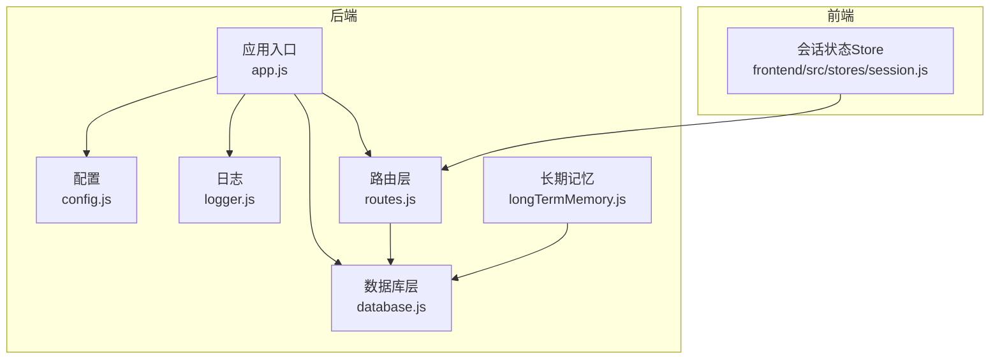
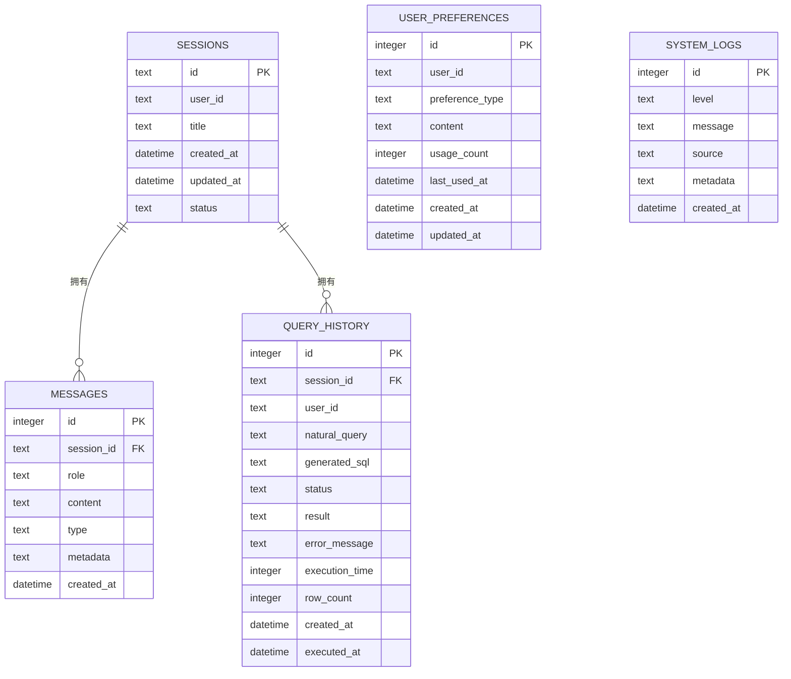
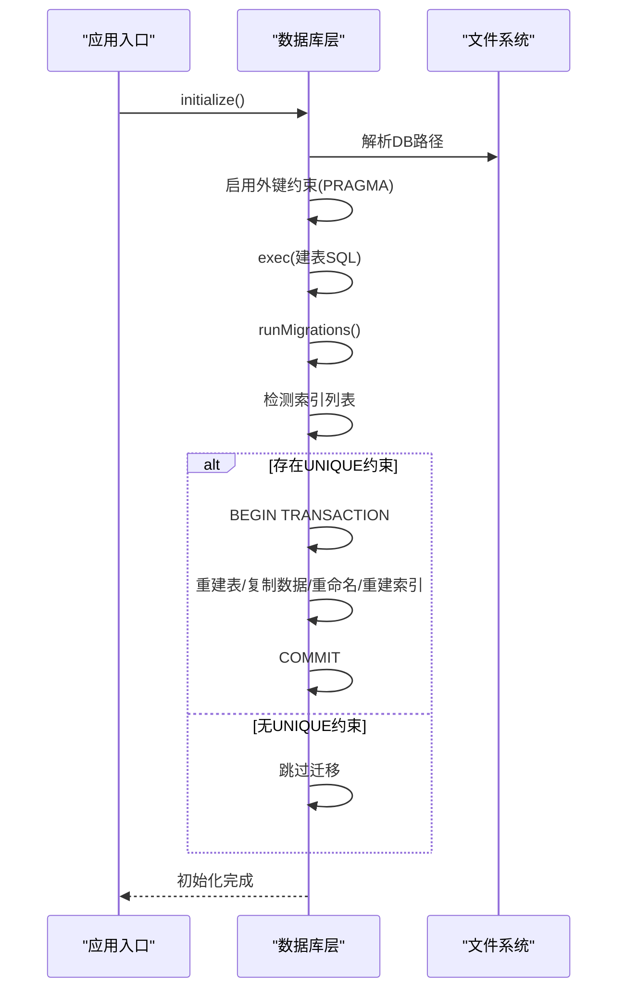
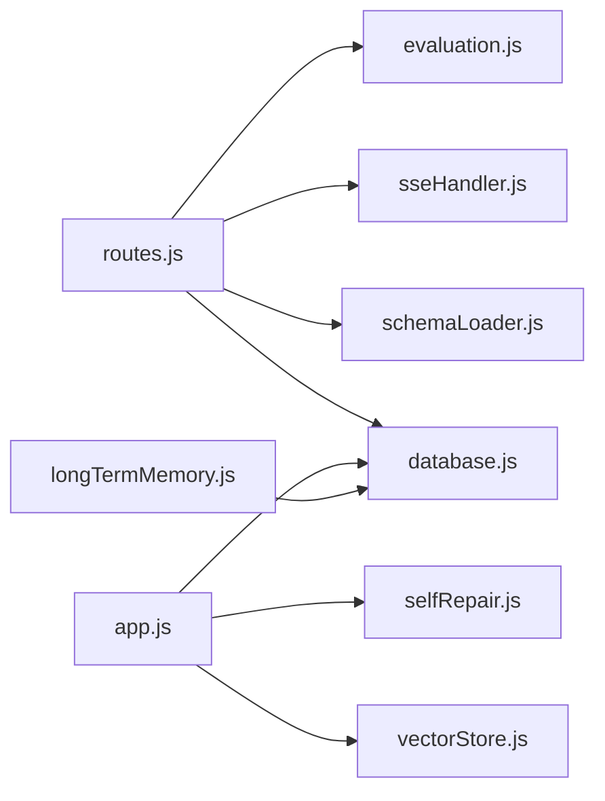
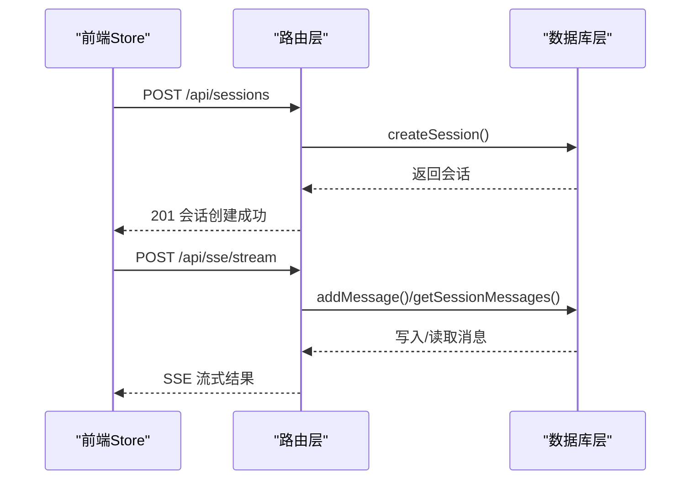
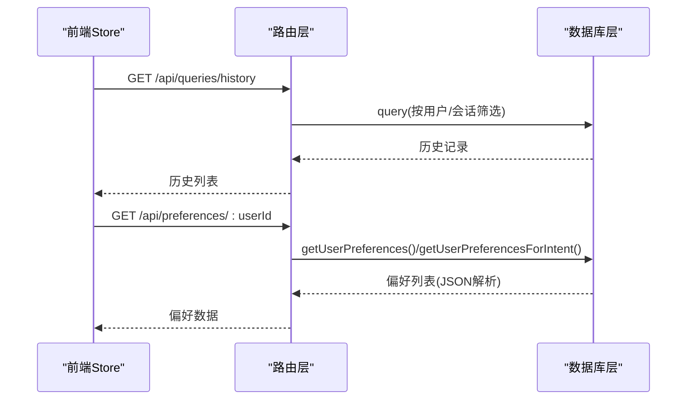

# SQLite 会话存储

<cite>
**本文引用的文件**
- [database.js](file://backend/src/core/database.js)
- [routes.js](file://backend/src/core/routes.js)
- [config.js](file://backend/src/core/config.js)
- [logger.js](file://backend/src/utils/logger.js)
- [app.js](file://backend/src/app.js)
- [session.js](file://backend/src/memory/longTermMemory.js)
- [session.js](file://frontend/src/stores/session.js)
</cite>

## 目录
1. [简介](#简介)
2. [项目结构](#项目结构)
3. [核心组件](#核心组件)
4. [架构总览](#架构总览)
5. [详细组件分析](#详细组件分析)
6. [依赖关系分析](#依赖关系分析)
7. [性能考量](#性能考量)
8. [故障排查指南](#故障排查指南)
9. [结论](#结论)
10. [附录](#附录)

## 简介
本文件系统性阐述基于 SQLite 的会话存储设计与实现，涵盖 sessions、messages、query_history、user_preferences、system_logs 五张核心表的结构定义、字段语义、约束与索引策略，以及外键关系与级联行为。文档还提供数据库初始化流程（建表、索引、迁移）、事务与并发控制机制、性能优化策略，并给出常见查询示例与最佳实践。

## 项目结构
后端采用 Node.js + Express 架构，SQLite 作为会话与长期记忆的持久化存储。核心模块包括：
- 数据库层：负责 SQLite 连接、建表、索引、迁移、事务与 CRUD 操作
- 路由层：提供会话、消息、查询历史、偏好等 REST 接口
- 配置层：集中管理数据库路径、日志级别、会话过期等配置
- 日志层：统一日志输出与轮转
- 前端会话 Store：管理当前会话、消息、SSE 连接状态

图表来源
- [app.js:97-166](file://backend/src/app.js#L97-L166)
- [config.js:97-100](file://backend/src/core/config.js#L97-L100)
- [logger.js:54-85](file://backend/src/utils/logger.js#L54-L85)
- [database.js:200-261](file://backend/src/core/database.js#L200-L261)
- [routes.js:256-398](file://backend/src/core/routes.js#L256-L398)
- [session.js:103-138](file://backend/src/memory/longTermMemory.js#L103-L138)
- [session.js:33-399](file://frontend/src/stores/session.js#L33-L399)

章节来源
- [app.js:97-166](file://backend/src/app.js#L97-L166)
- [config.js:97-100](file://backend/src/core/config.js#L97-L100)
- [logger.js:54-85](file://backend/src/utils/logger.js#L54-L85)
- [database.js:200-261](file://backend/src/core/database.js#L200-L261)
- [routes.js:256-398](file://backend/src/core/routes.js#L256-L398)
- [session.js:33-399](file://frontend/src/stores/session.js#L33-L399)

## 核心组件
- SQLite 数据库层：封装连接、建表、索引、迁移、事务与 CRUD 方法
- 路由层：提供会话、消息、查询历史、偏好等 API
- 配置层：数据库路径、日志、会话过期等配置
- 日志层：统一日志输出与轮转
- 长期记忆模块：基于 user_preferences 表的偏好抽取与存储
- 前端会话 Store：管理当前会话、消息、SSE 连接

章节来源
- [database.js:200-261](file://backend/src/core/database.js#L200-L261)
- [routes.js:256-398](file://backend/src/core/routes.js#L256-L398)
- [config.js:97-100](file://backend/src/core/config.js#L97-L100)
- [logger.js:54-85](file://backend/src/utils/logger.js#L54-L85)
- [session.js:103-138](file://backend/src/memory/longTermMemory.js#L103-L138)
- [session.js:33-399](file://frontend/src/stores/session.js#L33-L399)

## 架构总览
SQLite 会话存储围绕“会话-消息-查询历史-偏好-日志”五张表展开，通过外键与索引保障一致性与查询效率。应用启动时初始化数据库，创建表与索引，并执行迁移修复旧结构；路由层暴露 REST 接口，数据库层提供事务与参数化查询，前端通过 SSE 流式接收结果。

图表来源
- [database.js:39-189](file://backend/src/core/database.js#L39-L189)

章节来源
- [database.js:39-189](file://backend/src/core/database.js#L39-L189)

## 详细组件分析

### sessions 表
- 字段与约束
  - id：TEXT 主键，UUID
  - user_id：NOT NULL
  - title：可选
  - created_at：DATETIME DEFAULT CURRENT_TIMESTAMP
  - updated_at：DATETIME DEFAULT CURRENT_TIMESTAMP
  - status：TEXT DEFAULT 'active'
- 索引策略
  - idx_sessions_user_id(user_id)
  - idx_sessions_status(status)
  - idx_sessions_updated_at(updated_at)
- 外键与级联
  - 无外键，独立表
- 用途
  - 存储用户会话元信息，支持按用户、状态、时间排序查询

章节来源
- [database.js:44-64](file://backend/src/core/database.js#L44-L64)

### messages 表
- 字段与约束
  - id：INTEGER 主键，自增
  - session_id：NOT NULL，外键 references sessions(id) ON DELETE CASCADE
  - role：NOT NULL，枚举值：user、assistant、system、tool
  - content：NOT NULL
  - type：TEXT DEFAULT 'text'，枚举值：text、sql、result、error、clarify
  - metadata：TEXT（JSON 字符串）
  - created_at：DATETIME DEFAULT CURRENT_TIMESTAMP
- 索引策略
  - idx_messages_session_id(session_id)
  - idx_messages_created_at(created_at)
- 外键与级联
  - 删除会话时，级联删除消息
- 用途
  - 存储会话内的消息历史，支持按会话与时间排序

章节来源
- [database.js:70-92](file://backend/src/core/database.js#L70-L92)

### query_history 表
- 字段与约束
  - id：INTEGER 主键，自增
  - session_id：外键 references sessions(id) ON DELETE SET NULL
  - user_id：NOT NULL
  - natural_query：NOT NULL
  - generated_sql：TEXT
  - status：TEXT DEFAULT 'pending'，枚举值：pending、success、failed
  - result：TEXT（JSON）
  - error_message：TEXT
  - execution_time：INTEGER（毫秒）
  - row_count：INTEGER
  - created_at：DATETIME DEFAULT CURRENT_TIMESTAMP
  - executed_at：DATETIME
- 索引策略
  - idx_query_history_user_id(user_id)
  - idx_query_history_session_id(session_id)
  - idx_query_history_created_at(created_at)
  - idx_query_history_status(status)
- 外键与级联
  - 删除会话时，将关联记录的 session_id 置空（SET NULL）
- 用途
  - 记录用户查询的自然语言、生成 SQL、执行结果与统计信息

章节来源
- [database.js:98-134](file://backend/src/core/database.js#L98-L134)

### user_preferences 表
- 字段与约束
  - id：INTEGER 主键，自增
  - user_id：NOT NULL
  - preference_type：NOT NULL，枚举值：field_alias、query_pattern、metric_preference、dimension_preference
  - content：NOT NULL（JSON 字符串）
  - usage_count：INTEGER DEFAULT 1
  - last_used_at：DATETIME
  - created_at：DATETIME DEFAULT CURRENT_TIMESTAMP
  - updated_at：DATETIME DEFAULT CURRENT_TIMESTAMP
- 索引策略
  - idx_user_preferences_user_id(user_id)
  - idx_user_preferences_type(preference_type)
  - idx_user_prefs_user_type(user_id, preference_type)
- 外键与级联
  - 无外键
- 迁移说明
  - 旧版本可能存在 UNIQUE 约束，迁移会重建表并移除 UNIQUE 约束，保留索引
- 用途
  - 存储用户长期记忆（字段别名、查询模式、指标/维度偏好）

章节来源
- [database.js:140-164](file://backend/src/core/database.js#L140-L164)
- [database.js:271-336](file://backend/src/core/database.js#L271-L336)

### system_logs 表
- 字段与约束
  - id：INTEGER 主键，自增
  - level：NOT NULL，枚举值：debug、info、warn、error
  - message：NOT NULL
  - source：TEXT
  - metadata：TEXT（JSON）
  - created_at：DATETIME DEFAULT CURRENT_TIMESTAMP
- 索引策略
  - idx_system_logs_level(level)
  - idx_system_logs_created_at(created_at)
- 外键与级联
  - 无外键
- 用途
  - 记录系统运行日志，支持按级别与时间查询

章节来源
- [database.js:170-188](file://backend/src/core/database.js#L170-L188)

### 外键关系与级联机制
- sessions 与 messages：一对多，删除会话时级联删除消息
- sessions 与 query_history：一对多，删除会话时将关联记录的 session_id 置空
- 无循环外键，关系清晰

章节来源
- [database.js:86](file://backend/src/core/database.js#L86)
- [database.js:124](file://backend/src/core/database.js#L124)

### 数据库初始化流程
- 初始化步骤
  - 解析数据库路径（来自配置）
  - 建立连接并启用外键约束 PRAGMA foreign_keys = ON
  - 执行建表 SQL（包含表与索引）
  - 执行迁移（检测并修复 user_preferences 的 UNIQUE 约束）
- 并发与事务
  - 迁移过程使用 BEGIN/COMMIT/ROLLBACK 包裹，保证原子性
  - 提供 transaction(cb) 封装，便于批量操作

图表来源
- [database.js:200-261](file://backend/src/core/database.js#L200-L261)
- [database.js:271-336](file://backend/src/core/database.js#L271-L336)

章节来源
- [database.js:200-261](file://backend/src/core/database.js#L200-L261)
- [database.js:271-336](file://backend/src/core/database.js#L271-L336)

### 事务处理机制
- transaction(cb)：自动包裹 BEGIN/COMMIT/ROLLBACK，异常时回滚
- 适用于多条写入的原子性保证（如删除会话时先删消息再删会话）

章节来源
- [database.js:431-445](file://backend/src/core/database.js#L431-L445)

### 并发控制与性能优化
- 并发控制
  - SQLite 默认 WAL 模式下允许多读，但写入受锁影响
  - 通过事务减少锁竞争
- 索引优化
  - 按用户查询：sessions(user_id)、query_history(user_id)
  - 按状态筛选：sessions(status)、query_history(status)
  - 按时间排序：sessions(updated_at)、messages(created_at)、query_history(created_at)、system_logs(created_at)
  - 复合索引：user_preferences(user_id, preference_type)
- 迁移修复
  - 修复旧版 UNIQUE 约束，避免重复插入阻塞

章节来源
- [database.js:59-64](file://backend/src/core/database.js#L59-L64)
- [database.js:89-92](file://backend/src/core/database.js#L89-L92)
- [database.js:127-134](file://backend/src/core/database.js#L127-L134)
- [database.js:159-164](file://backend/src/core/database.js#L159-L164)
- [database.js:185-188](file://backend/src/core/database.js#L185-L188)
- [database.js:271-336](file://backend/src/core/database.js#L271-L336)

### API 与使用示例
- 会话管理
  - POST /api/sessions：创建会话
  - GET /api/sessions/:sessionId：获取会话
  - DELETE /api/sessions/:sessionId：删除会话（级联删除消息）
  - GET /api/users/:userId/sessions：获取用户会话列表
  - GET /api/sessions/:sessionId/messages：获取消息历史
- 查询历史
  - GET /api/queries/history：按用户/会话筛选查询历史
- 用户偏好（长期记忆）
  - GET /api/preferences/:userId：获取偏好列表
  - GET /api/preferences/:userId/raw：获取原始偏好数据（调试）
  - GET /api/preferences/:userId/stats：获取记忆统计
  - POST /api/preferences/:userId/templates：手动添加查询模板
  - POST /api/preferences/:userId/learn-alias：手动学习字段别名
  - DELETE /api/preferences/:preferenceId：删除偏好

章节来源
- [routes.js:256-398](file://backend/src/core/routes.js#L256-L398)
- [routes.js:404-450](file://backend/src/core/routes.js#L404-L450)
- [routes.js:456-664](file://backend/src/core/routes.js#L456-L664)

## 依赖关系分析
- database.js 依赖
  - sqlite3（原生命令）、path（路径）、config（数据库路径）、logger（日志）
- routes.js 依赖
  - database（CRUD）、schemaLoader（Schema）、sseHandler（SSE）、evaluation（评估）
- app.js 依赖
  - database.initialize（启动时初始化）、vectorStore.initialize（向量库）、selfRepair.start（定时任务）

图表来源
- [routes.js:24-29](file://backend/src/core/routes.js#L24-L29)
- [app.js:44-50](file://backend/src/app.js#L44-L50)

章节来源
- [routes.js:24-29](file://backend/src/core/routes.js#L24-L29)
- [app.js:44-50](file://backend/src/app.js#L44-L50)

## 性能考量
- 查询优化
  - 使用索引覆盖常见筛选与排序：user_id、status、created_at、updated_at、session_id
  - 复合索引减少多列过滤成本：user_preferences(user_id, preference_type)
- 写入优化
  - 使用事务批量写入，降低锁竞争
  - 避免频繁 ALTER TABLE，迁移阶段集中处理
- 存储与日志
  - system_logs 按级别与时间索引，便于快速定位问题
- 前端交互
  - SSE 流式传输，结合前端 Store 管理消息与连接状态

[本节为通用指导，无需列出具体文件来源]

## 故障排查指南
- 数据库连接失败
  - 检查 DB_PATH 配置与文件权限
  - 确认数据库文件存在且可读写
- 外键约束问题
  - 确认已启用 PRAGMA foreign_keys = ON
  - 删除会话时确认是否需要级联删除消息
- 迁移失败
  - 查看日志中“迁移失败”记录，确认事务回滚与重试
- 查询性能差
  - 检查是否命中索引，必要时添加复合索引
  - 限制返回数量（limit），避免全表扫描
- 日志定位
  - 使用 system_logs(level, created_at) 快速定位错误

章节来源
- [database.js:200-261](file://backend/src/core/database.js#L200-L261)
- [database.js:271-336](file://backend/src/core/database.js#L271-L336)
- [logger.js:299-309](file://backend/src/utils/logger.js#L299-L309)

## 结论
该 SQLite 会话存储系统以简洁的五表结构支撑会话、消息、查询历史、长期记忆与系统日志的完整生命周期。通过外键与索引策略、事务封装与迁移修复，系统在易用性与性能之间取得平衡。配合路由层与前端 Store，实现了从创建会话到流式结果接收的完整链路。

[本节为总结性内容，无需列出具体文件来源]

## 附录

### 表结构与索引一览
- sessions：主键 id，索引 user_id、status、updated_at
- messages：主键 id，外键 session_id，索引 session_id、created_at
- query_history：主键 id，外键 session_id，索引 user_id、session_id、created_at、status
- user_preferences：主键 id，索引 user_id、preference_type、(user_id, preference_type)
- system_logs：主键 id，索引 level、created_at

章节来源
- [database.js:44-64](file://backend/src/core/database.js#L44-L64)
- [database.js:70-92](file://backend/src/core/database.js#L70-L92)
- [database.js:98-134](file://backend/src/core/database.js#L98-L134)
- [database.js:140-164](file://backend/src/core/database.js#L140-L164)
- [database.js:170-188](file://backend/src/core/database.js#L170-L188)

### 关键流程时序图

#### 会话创建与消息写入

图表来源
- [routes.js:266-290](file://backend/src/core/routes.js#L266-L290)
- [routes.js:348-373](file://backend/src/core/routes.js#L348-L373)
- [session.js:118-138](file://backend/src/memory/longTermMemory.js#L118-L138)

#### 查询历史与偏好读取

图表来源
- [routes.js:413-450](file://backend/src/core/routes.js#L413-L450)
- [routes.js:553-592](file://backend/src/core/routes.js#L553-L592)