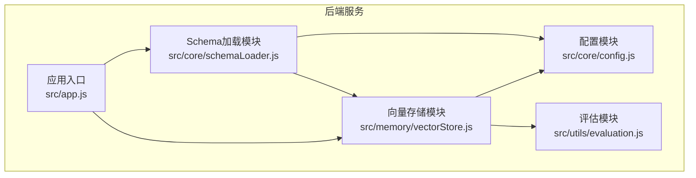
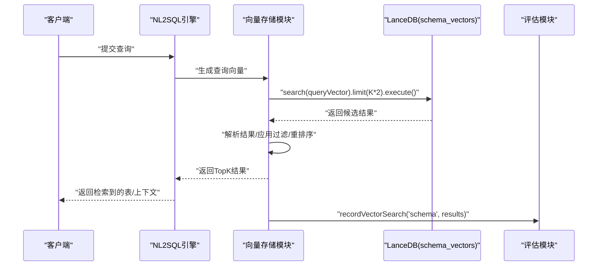
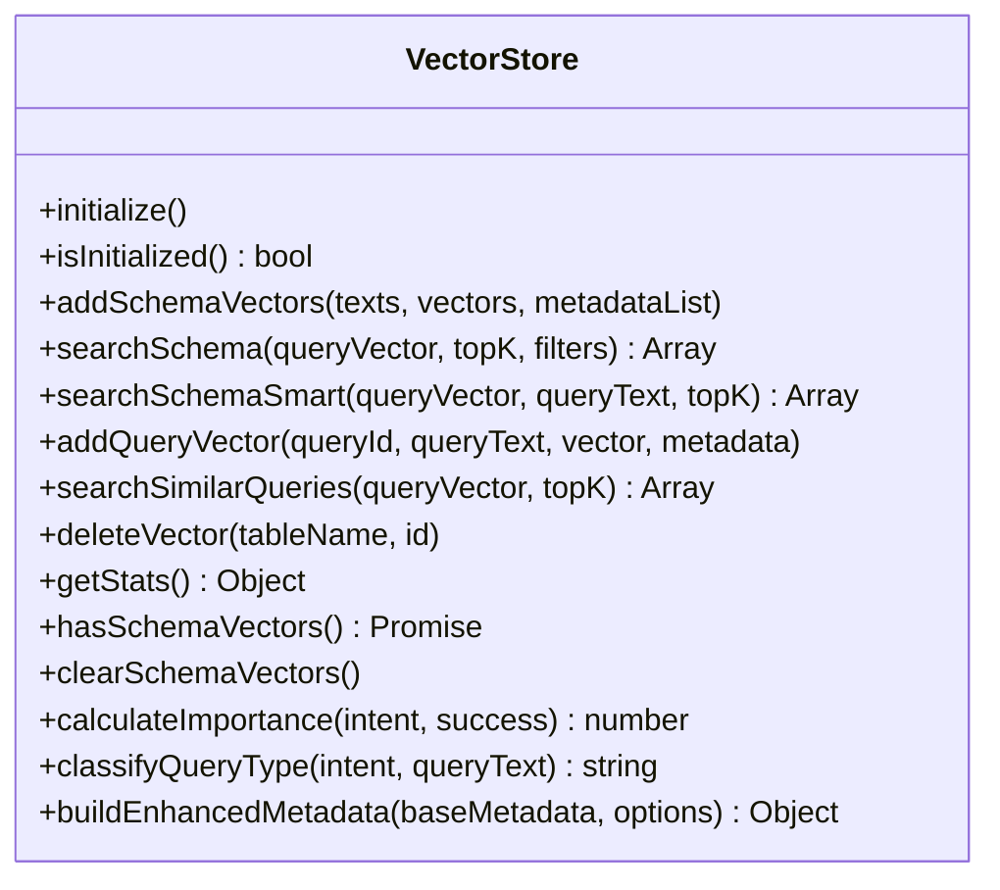
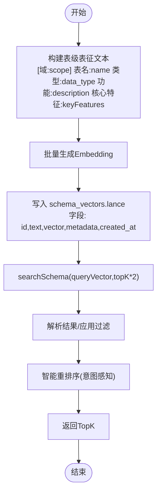
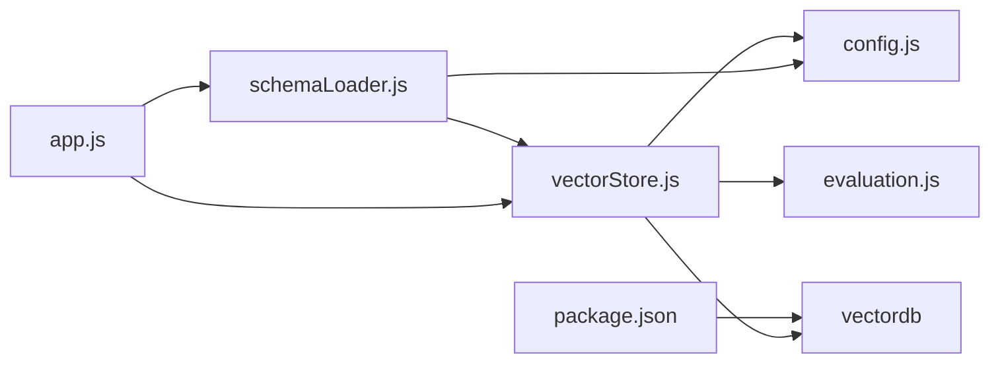

# 向量数据库

<cite>
**本文引用的文件**
- [backend/src/memory/vectorStore.js](file://backend/src/memory/vectorStore.js)
- [backend/src/core/config.js](file://backend/src/core/config.js)
- [backend/src/utils/evaluation.js](file://backend/src/utils/evaluation.js)
- [backend/src/core/schemaLoader.js](file://backend/src/core/schemaLoader.js)
- [backend/src/app.js](file://backend/src/app.js)
- [backend/package.json](file://backend/package.json)
</cite>

## 目录
1. [简介](#简介)
2. [项目结构](#项目结构)
3. [核心组件](#核心组件)
4. [架构总览](#架构总览)
5. [详细组件分析](#详细组件分析)
6. [依赖分析](#依赖分析)
7. [性能考虑](#性能考虑)
8. [故障排除指南](#故障排除指南)
9. [结论](#结论)
10. [附录](#附录)

## 简介
本文件面向 NL2SQL 系统中的向量数据库子系统，围绕基于 LanceDB 的 schema_vectors.lance 与 query_vectors.lance 两个向量存储，系统性阐述如下主题：
- 向量嵌入的生成、存储与检索流程
- 相似度检索算法与索引策略
- 查询意图驱动的智能重排序与过滤
- 性能调优、监控指标与容量规划
- 实战查询示例与评估方法

## 项目结构
向量数据库相关代码集中在后端模块中，核心文件与职责如下：
- 向量存储模块：负责 LanceDB 连接、表初始化、向量增删改查、统计与状态查询
- 配置模块：集中管理向量数据库路径、嵌入维度、阈值等配置
- 评估模块：提供向量化质量评估、相似度计算与运行时统计
- Schema 加载模块：负责将表级描述向量化并写入 schema_vectors.lance
- 应用入口：服务启动时初始化向量数据库与 Schema 向量化

图表来源
- [backend/src/app.js:97-166](file://backend/src/app.js#L97-L166)
- [backend/src/memory/vectorStore.js:231-261](file://backend/src/memory/vectorStore.js#L231-L261)
- [backend/src/core/schemaLoader.js:69-122](file://backend/src/core/schemaLoader.js#L69-L122)
- [backend/src/core/config.js:106-109](file://backend/src/core/config.js#L106-L109)

章节来源
- [backend/src/app.js:97-166](file://backend/src/app.js#L97-L166)
- [backend/src/core/config.js:106-109](file://backend/src/core/config.js#L106-L109)

## 核心组件
- 向量存储模块（vectorStore）
  - 初始化 LanceDB 连接，打开/创建 schema_vectors 与 query_vectors 两张表
  - 提供添加与检索接口：addSchemaVectors、searchSchema、searchSchemaSmart、addQueryVector、searchSimilarQueries
  - 提供统计与状态查询：getStats、hasSchemaVectors、clearSchemaVectors
  - 内置元数据增强工具：calculateImportance、classifyQueryType、buildEnhancedMetadata
- 配置模块（config）
  - 定义 vectorDb.path、embedding.dimension 等关键配置
  - 控制 Schema 向量化开关与阈值
- 评估模块（evaluation）
  - 记录向量检索命中统计、距离分布
  - 提供 evaluateSchemaVectorQuality、evaluateQueryVectorQuality、calculateCosineSimilarity
- Schema 加载模块（schemaLoader）
  - 将表级描述文本向量化并写入 schema_vectors.lance
  - 提供 searchRelevantTables 语义检索与关键词回退
- 应用入口（app）
  - 启动时顺序初始化 SQLite、LanceDB、Schema、自修复调度器

章节来源
- [backend/src/memory/vectorStore.js:231-758](file://backend/src/memory/vectorStore.js#L231-L758)
- [backend/src/core/config.js:80-87](file://backend/src/core/config.js#L80-L87)
- [backend/src/utils/evaluation.js:66-487](file://backend/src/utils/evaluation.js#L66-L487)
- [backend/src/core/schemaLoader.js:201-281](file://backend/src/core/schemaLoader.js#L201-L281)
- [backend/src/app.js:97-166](file://backend/src/app.js#L97-L166)

## 架构总览
LanceDB 作为本地嵌入式向量数据库，提供：
- schema_vectors.lance：存储表级向量，元数据包含 scope、data_type 等标签，支持按域与数据源类型过滤
- query_vectors.lance：存储用户查询历史向量，支持相似查询检索

检索流程（以表级向量为例）：
- 生成查询向量
- 在 schema_vectors.lance 中执行向量检索
- 应用层解析结果并进行意图感知重排序与过滤
- 记录运行时统计

图表来源
- [backend/src/memory/vectorStore.js:378-435](file://backend/src/memory/vectorStore.js#L378-L435)
- [backend/src/memory/vectorStore.js:450-536](file://backend/src/memory/vectorStore.js#L450-L536)
- [backend/src/utils/evaluation.js:71-96](file://backend/src/utils/evaluation.js#L71-L96)

## 详细组件分析

### 向量存储模块（vectorStore）
- 初始化与表管理
  - connect(config.vectorDb.path) 连接数据库目录
  - openTable/createTable(schema_vectors, query_vectors)，初始化时写入占位记录
- Schema 向量操作
  - addSchemaVectors：批量写入文本、向量与元数据
  - searchSchema：执行向量检索，支持应用层过滤（scope、data_type、exclude_data_type）
  - searchSchemaSmart：基于查询意图的智能重排序（游戏提及、平台优先、原始日志优先、距离归一化）
- 查询历史向量操作
  - addQueryVector：写入用户查询向量与元数据
  - searchSimilarQueries：相似查询检索
- 统计与状态
  - getStats：返回 schema_count、query_count（排除初始化记录）
  - hasSchemaVectors/clearSchemaVectors：存在性检查与清空标记（通过重新向量化覆盖）

图表来源
- [backend/src/memory/vectorStore.js:231-758](file://backend/src/memory/vectorStore.js#L231-L758)

章节来源
- [backend/src/memory/vectorStore.js:231-758](file://backend/src/memory/vectorStore.js#L231-L758)

### Schema 向量化与检索（schemaLoader + vectorStore）
- 表级向量化
  - 将每个表生成“表级表征文本”，包含域标签(scope)、数据源类型(data_type)、核心特征词(key_features)
  - 写入 schema_vectors.lance，元数据包含 name、name_cn、scope、data_type、key_features
- 检索与过滤
  - searchSchema 支持按 scope、data_type 过滤（应用层二次过滤）
  - searchSchemaSmart 基于查询意图进行优先级重排（游戏表优先、平台通用表次之、原始日志优先、距离得分）

图表来源
- [backend/src/core/schemaLoader.js:201-281](file://backend/src/core/schemaLoader.js#L201-L281)
- [backend/src/memory/vectorStore.js:378-435](file://backend/src/memory/vectorStore.js#L378-L435)
- [backend/src/memory/vectorStore.js:450-536](file://backend/src/memory/vectorStore.js#L450-L536)

章节来源
- [backend/src/core/schemaLoader.js:201-281](file://backend/src/core/schemaLoader.js#L201-L281)
- [backend/src/memory/vectorStore.js:378-536](file://backend/src/memory/vectorStore.js#L378-L536)

### 查询历史向量（query_vectors.lance）
- 写入
  - addQueryVector：将用户查询文本与向量写入 query_vectors.lance
- 检索
  - searchSimilarQueries：基于向量相似度检索历史相似查询
- 应用场景
  - 历史上下文召回、澄清引导、查询模式学习

章节来源
- [backend/src/memory/vectorStore.js:551-618](file://backend/src/memory/vectorStore.js#L551-L618)

### 相似度检索算法与索引
- 相似度计算
  - 向量检索采用余弦相似度（由底层 LanceDB 执行），评估模块提供独立实现用于质量评估
- 索引与查询
  - 通过 LanceDB 的向量检索接口执行，返回候选结果后在应用层进行过滤与重排序
- 过滤与重排序
  - 元数据过滤：scope、data_type、exclude_data_type
  - 智能重排序：基于查询意图（游戏提及、平台类型、数据源类型、向量距离）

章节来源
- [backend/src/utils/evaluation.js:134-147](file://backend/src/utils/evaluation.js#L134-L147)
- [backend/src/memory/vectorStore.js:378-435](file://backend/src/memory/vectorStore.js#L378-L435)
- [backend/src/memory/vectorStore.js:450-536](file://backend/src/memory/vectorStore.js#L450-L536)

## 依赖分析
- 外部依赖
  - vectordb：LanceDB 客户端，提供 connect、openTable、createTable、search 等能力
- 内部依赖
  - vectorStore 依赖 config（路径、维度）、evaluation（统计）、logger（日志）
  - schemaLoader 依赖 vectorStore（写入向量）、llmService（生成 Embedding）、config（开关与阈值）
  - app 启动时顺序初始化 database、vectorStore、schemaLoader

图表来源
- [backend/package.json:12](file://backend/package.json#L12)
- [backend/src/memory/vectorStore.js:14-21](file://backend/src/memory/vectorStore.js#L14-L21)
- [backend/src/core/schemaLoader.js:24-26](file://backend/src/core/schemaLoader.js#L24-L26)
- [backend/src/app.js:45-46](file://backend/src/app.js#L45-L46)

章节来源
- [backend/package.json:12](file://backend/package.json#L12)
- [backend/src/memory/vectorStore.js:14-21](file://backend/src/memory/vectorStore.js#L14-L21)
- [backend/src/core/schemaLoader.js:24-26](file://backend/src/core/schemaLoader.js#L24-L26)
- [backend/src/app.js:45-46](file://backend/src/app.js#L45-L46)

## 性能考虑
- 向量维度与存储
  - embedding.dimension 由配置决定，影响向量长度与存储体积
- 批量写入与分批 Embedding
  - schemaLoader 对 Embedding 采用批次处理，减少单次请求压力
- 检索效率
  - searchSchema 默认 limit(topK*2) 以提升后过滤与重排序效果
  - 智能重排序在应用层完成，避免复杂数据库过滤
- 过滤策略
  - 元数据过滤在应用层进行，避免对底层检索施加复杂 where 条件
- 监控与评估
  - 通过 evaluation.recordVectorSearch 记录检索命中与距离分布
  - 评估模块提供 evaluateSchemaVectorQuality、evaluateQueryVectorQuality 用于质量评估

章节来源
- [backend/src/core/config.js:80-87](file://backend/src/core/config.js#L80-L87)
- [backend/src/core/schemaLoader.js:245-261](file://backend/src/core/schemaLoader.js#L245-L261)
- [backend/src/memory/vectorStore.js:403](file://backend/src/memory/vectorStore.js#L403)
- [backend/src/utils/evaluation.js:71-96](file://backend/src/utils/evaluation.js#L71-L96)
- [backend/src/utils/evaluation.js:158-266](file://backend/src/utils/evaluation.js#L158-L266)

## 故障排除指南
- 向量数据库未初始化
  - 现象：返回空结果或警告
  - 处理：确认 vectorStore.initialize 已在启动流程中执行；检查 vectorDb.path 是否可写
- 表不存在或损坏
  - 现象：openTable 抛错
  - 处理：模块会自动创建初始表；如需重建，可通过重新向量化覆盖
- 向量维度不匹配
  - 现象：写入/检索报错
  - 处理：核对 embedding.dimension 与 Embedding 输出维度一致
- 检索结果为空
  - 现象：searchSchema/searchSimilarQueries 返回空
  - 处理：确认已写入向量；检查 filters 参数；尝试增大 topK；确认 query_vectors 与 schema_vectors 是否存在有效数据
- 评估功能未生效
  - 现象：评估统计为 0 或报“评估功能未启用”
  - 处理：设置 EVALUATION_ENABLED/EVALUATION_TRACK_STATS；确保调用 evaluateSchemaVectorQuality/evaluateQueryVectorQuality

章节来源
- [backend/src/memory/vectorStore.js:231-261](file://backend/src/memory/vectorStore.js#L231-L261)
- [backend/src/memory/vectorStore.js:267-322](file://backend/src/memory/vectorStore.js#L267-L322)
- [backend/src/core/config.js:80-87](file://backend/src/core/config.js#L80-L87)
- [backend/src/utils/evaluation.js:158-266](file://backend/src/utils/evaluation.js#L158-L266)

## 结论
本系统以 LanceDB 为核心，构建了两套向量存储：
- schema_vectors.lance：表级语义向量，支撑表级检索与意图感知重排序
- query_vectors.lance：查询历史向量，支撑相似查询召回

通过合理的元数据设计、应用层过滤与重排序策略，系统在保证检索质量的同时兼顾性能与可维护性。配合评估模块与运行时统计，可持续优化向量质量与检索效果。

## 附录

### schema_vectors.lance 与 query_vectors.lance 数据结构与用途
- schema_vectors.lance
  - 字段：id、text、vector、metadata、created_at
  - 元数据：name、name_cn、scope（域：platform/game_xxx/report）、data_type（raw_log/aggregated_report/dimension_table）、key_features
  - 用途：表级语义检索、意图感知重排序、过滤（scope/data_type）
- query_vectors.lance
  - 字段：id、text、vector、metadata、created_at
  - 用途：查询历史相似召回、澄清引导、模式学习

章节来源
- [backend/src/memory/vectorStore.js:277-321](file://backend/src/memory/vectorStore.js#L277-L321)
- [backend/src/memory/vectorStore.js:560-576](file://backend/src/memory/vectorStore.js#L560-L576)
- [backend/src/core/schemaLoader.js:231-241](file://backend/src/core/schemaLoader.js#L231-L241)

### 向量嵌入生成流程与存储格式
- 生成流程
  - schemaLoader 将每个表生成表级表征文本，调用 Embedding 接口生成向量
  - 分批写入 schema_vectors.lance
- 存储格式
  - vector：数值数组（维度由 embedding.dimension 决定）
  - metadata：JSON 字符串（包含 name/name_cn/scope/data_type/key_features 等）

章节来源
- [backend/src/core/schemaLoader.js:201-281](file://backend/src/core/schemaLoader.js#L201-L281)
- [backend/src/core/config.js:80-87](file://backend/src/core/config.js#L80-L87)

### 相似度检索接口与示例
- 接口
  - searchSchema(queryVector, topK, filters)
  - searchSchemaSmart(queryVector, queryText, topK)
  - searchSimilarQueries(queryVector, topK)
- 示例（路径参考）
  - [示例：表级检索:378-435](file://backend/src/memory/vectorStore.js#L378-L435)
  - [示例：智能重排序:450-536](file://backend/src/memory/vectorStore.js#L450-L536)
  - [示例：相似查询检索:587-618](file://backend/src/memory/vectorStore.js#L587-L618)

章节来源
- [backend/src/memory/vectorStore.js:378-618](file://backend/src/memory/vectorStore.js#L378-L618)

### 监控指标与评估
- 运行时统计
  - 向量检索：schema/query 搜索次数、命中次数、距离分布
  - 长期记忆：总体命中率、按类型命中率
- 评估方法
  - evaluateSchemaVectorQuality：基于测试查询评估召回与 F1
  - evaluateQueryVectorQuality：计算查询对的余弦相似度与误差
  - calculateCosineSimilarity：独立相似度计算

章节来源
- [backend/src/utils/evaluation.js:37-122](file://backend/src/utils/evaluation.js#L37-L122)
- [backend/src/utils/evaluation.js:158-334](file://backend/src/utils/evaluation.js#L158-L334)

### 容量规划与运维建议
- 存储容量
  - schema_vectors：表数量 × 向量维度 × 向量大小（float32）+ 元数据 JSON
  - query_vectors：查询历史条数 × 向量维度 × 向量大小 + 元数据 JSON
- 维护策略
  - 定期清理无效/重复向量（通过重新向量化覆盖）
  - 监控检索命中率与距离分布，及时调整 filters 与重排序策略
- 性能优化
  - 合理设置 topK 与过滤条件，避免过度扫描
  - 批量写入 Embedding，减少网络往返
  - 使用智能重排序减少下游处理成本

章节来源
- [backend/src/memory/vectorStore.js:403](file://backend/src/memory/vectorStore.js#L403)
- [backend/src/core/schemaLoader.js:245-261](file://backend/src/core/schemaLoader.js#L245-L261)
- [backend/src/utils/evaluation.js:344-407](file://backend/src/utils/evaluation.js#L344-L407)