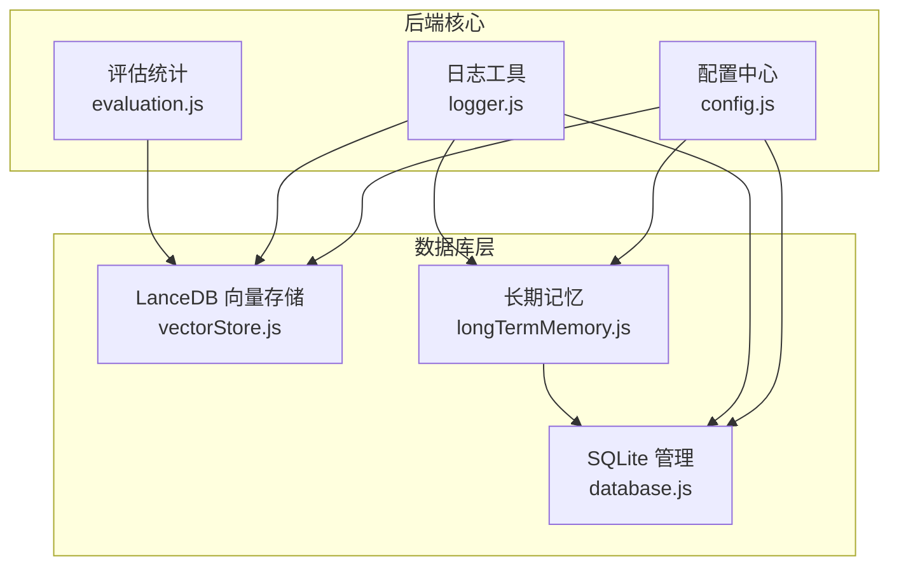
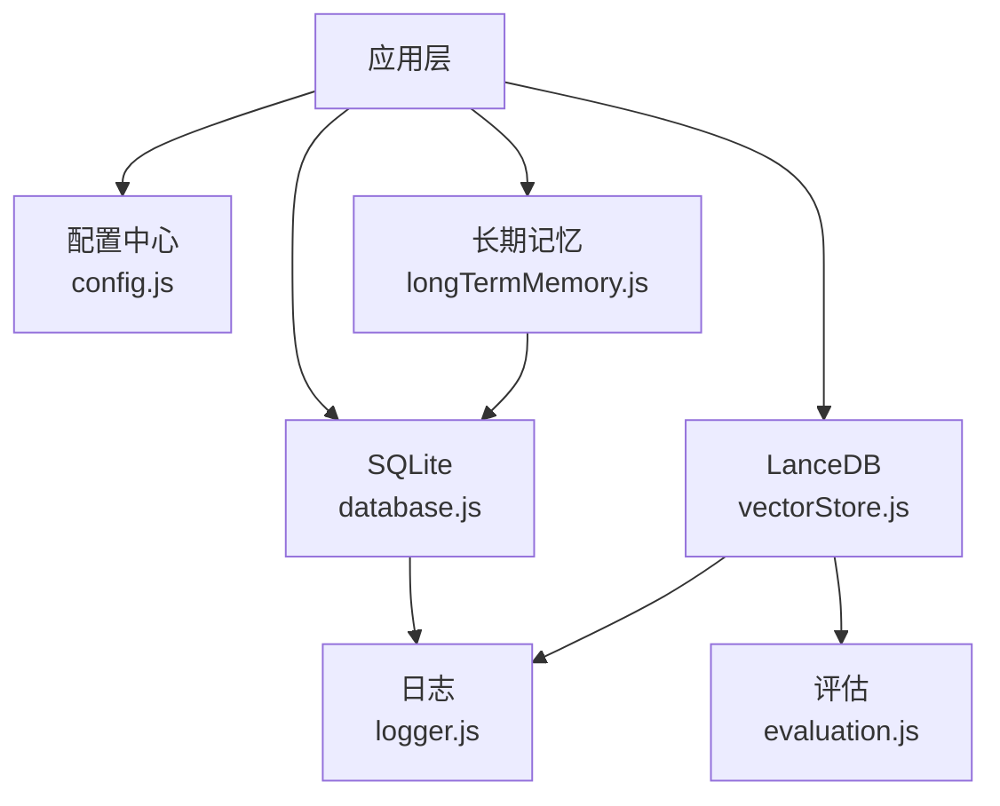
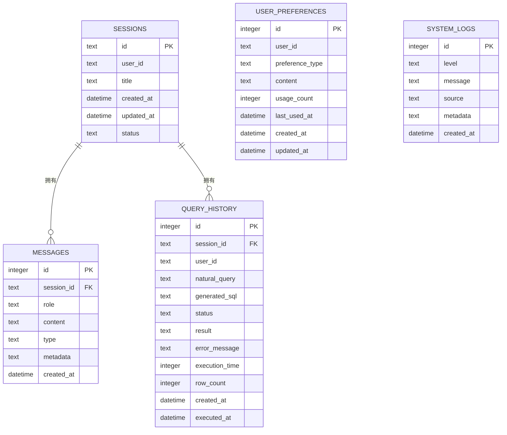
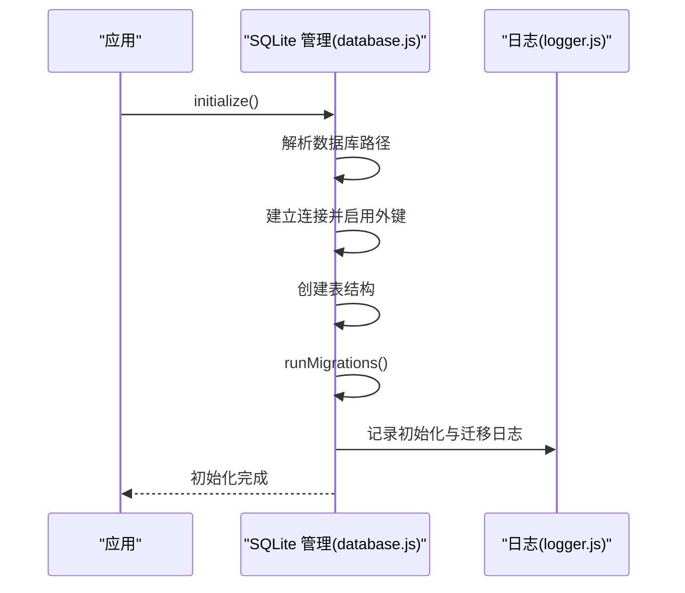
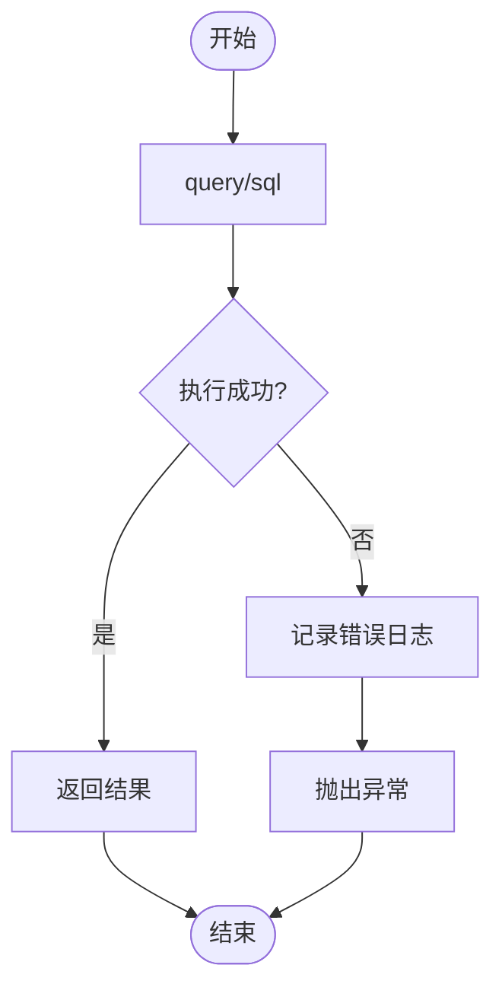
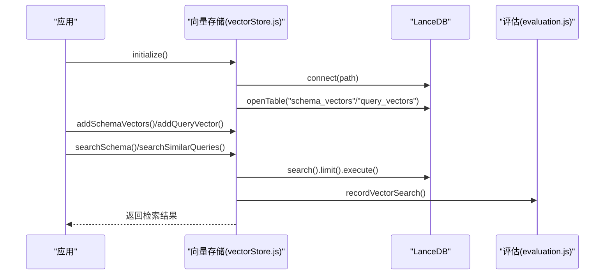
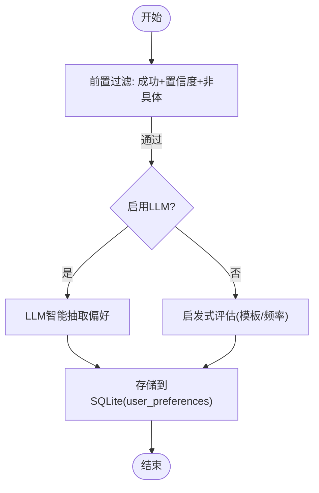
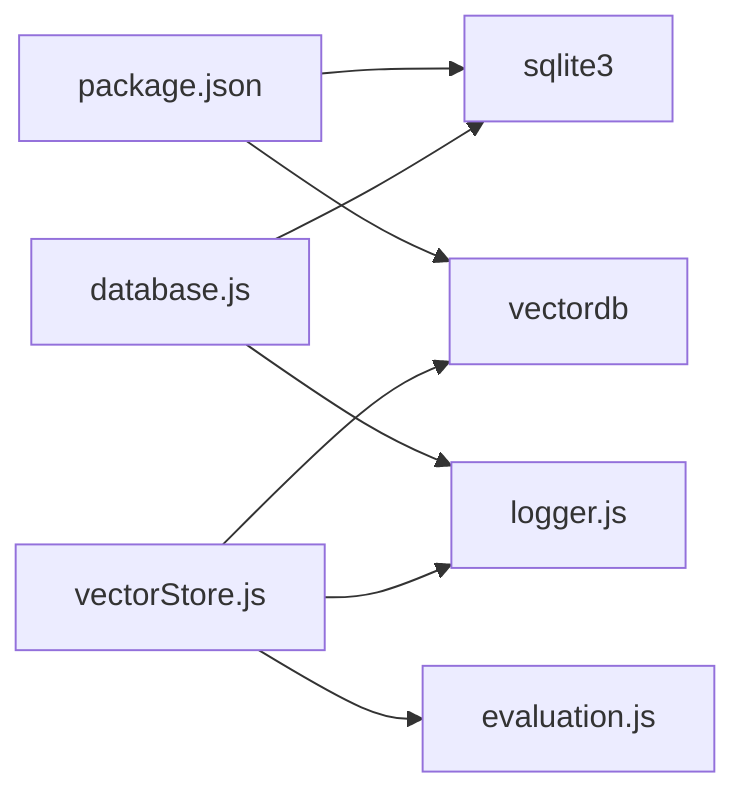

# 数据库层

<cite>
**本文引用的文件**
- [database.js](file://backend/src/core/database.js)
- [vectorStore.js](file://backend/src/memory/vectorStore.js)
- [longTermMemory.js](file://backend/src/memory/longTermMemory.js)
- [config.js](file://backend/src/core/config.js)
- [logger.js](file://backend/src/utils/logger.js)
- [evaluation.js](file://backend/src/utils/evaluation.js)
- [schema-metadata.json](file://backend/config/schema-metadata.json)
- [package.json](file://backend/package.json)
</cite>

## 目录
1. [简介](#简介)
2. [项目结构](#项目结构)
3. [核心组件](#核心组件)
4. [架构总览](#架构总览)
5. [详细组件分析](#详细组件分析)
6. [依赖分析](#依赖分析)
7. [性能考虑](#性能考虑)
8. [故障排除指南](#故障排除指南)
9. [结论](#结论)
10. [附录](#附录)

## 简介
本文件面向 NL2SQL 项目的数据库层，系统性梳理基于 SQLite 的会话存储设计与基于 LanceDB 的向量数据库配置与使用。内容涵盖：
- SQLite 表结构定义、索引策略与查询优化
- LanceDB 向量嵌入存储、相似度检索与性能调优
- 数据库连接池管理、事务处理与并发控制
- 完整数据库模式设计（表关系图与约束）
- 数据迁移策略、备份恢复方案与监控指标
- 性能优化建议与故障排除指南

## 项目结构
数据库层相关文件主要分布在 backend/src/core、backend/src/memory、backend/src/utils 与 backend/config 目录：
- 核心数据库管理：backend/src/core/database.js
- 向量数据库封装：backend/src/memory/vectorStore.js
- 长期记忆与偏好抽取：backend/src/memory/longTermMemory.js
- 配置中心：backend/src/core/config.js
- 日志工具：backend/src/utils/logger.js
- 评估与统计：backend/src/utils/evaluation.js
- Schema 元数据：backend/config/schema-metadata.json
- 依赖清单：backend/package.json

图表来源
- [config.js:97-130](file://backend/src/core/config.js#L97-L130)
- [database.js:12-19](file://backend/src/core/database.js#L12-L19)
- [vectorStore.js:14-21](file://backend/src/memory/vectorStore.js#L14-L21)
- [longTermMemory.js:17-21](file://backend/src/memory/longTermMemory.js#L17-L21)
- [logger.js:23-23](file://backend/src/utils/logger.js#L23-L23)
- [evaluation.js:13-13](file://backend/src/utils/evaluation.js#L13-L13)

章节来源
- [config.js:97-130](file://backend/src/core/config.js#L97-L130)
- [database.js:12-19](file://backend/src/core/database.js#L12-L19)
- [vectorStore.js:14-21](file://backend/src/memory/vectorStore.js#L14-L21)
- [longTermMemory.js:17-21](file://backend/src/memory/longTermMemory.js#L17-L21)
- [logger.js:23-23](file://backend/src/utils/logger.js#L23-L23)
- [evaluation.js:13-13](file://backend/src/utils/evaluation.js#L13-L13)

## 核心组件
- SQLite 数据库管理模块：负责会话、消息、查询历史、用户偏好、系统日志等表的创建、迁移、事务与查询封装。
- LanceDB 向量存储模块：负责 schema 向量与查询历史向量的增删改查、相似度检索、智能搜索与统计记录。
- 长期记忆模块：基于 SQLite 的用户偏好存储，结合 LLM 与启发式规则进行偏好抽取与存储。
- 配置中心：集中管理数据库路径、向量维度、连接池、安全阈值、日志级别等。
- 日志与评估：统一日志输出与向量化质量、记忆命中率统计。

章节来源
- [database.js:39-189](file://backend/src/core/database.js#L39-L189)
- [vectorStore.js:231-322](file://backend/src/memory/vectorStore.js#L231-L322)
- [longTermMemory.js:27-42](file://backend/src/memory/longTermMemory.js#L27-L42)
- [config.js:97-130](file://backend/src/core/config.js#L97-L130)
- [logger.js:54-85](file://backend/src/utils/logger.js#L54-L85)
- [evaluation.js:19-61](file://backend/src/utils/evaluation.js#L19-L61)

## 架构总览
数据库层采用“轻量 SQLite + 向量数据库”的混合架构：
- SQLite：存储会话、消息、查询历史、用户偏好、系统日志等结构化数据，具备外键约束与索引优化。
- LanceDB：存储向量化后的 Schema 与查询历史，提供向量检索与智能重排序，支撑语义搜索。
- 长期记忆：在 SQLite 中持久化用户偏好，结合向量检索与 LLM 抽取提升个性化体验。
- 配置驱动：通过 config.js 统一管理路径、维度、连接池、阈值等，便于部署与运维。

图表来源
- [config.js:97-130](file://backend/src/core/config.js#L97-L130)
- [database.js:200-261](file://backend/src/core/database.js#L200-L261)
- [vectorStore.js:231-261](file://backend/src/memory/vectorStore.js#L231-L261)
- [longTermMemory.js:312-485](file://backend/src/memory/longTermMemory.js#L312-L485)
- [logger.js:54-85](file://backend/src/utils/logger.js#L54-L85)
- [evaluation.js:66-96](file://backend/src/utils/evaluation.js#L66-L96)

## 详细组件分析

### SQLite 表结构与索引策略
- 会话表 sessions：存储用户会话信息，包含用户标识、标题、状态与时间戳；为 user_id、status、updated_at 建立索引，加速按用户筛选、状态过滤与时间排序。
- 消息表 messages：存储会话中的消息历史，包含角色、类型、元数据与时间戳；为 session_id、created_at 建立索引，加速按会话查询与时间排序。
- 查询历史表 query_history：存储用户自然语言查询与生成的 SQL、执行状态、耗时、行数等；为 user_id、session_id、created_at、status 建立索引，支撑按用户、按会话、按时间与状态的高效查询。
- 用户偏好表 user_preferences：存储用户偏好（查询模式、字段别名、指标/维度偏好等），为 user_id、preference_type、复合索引加速查询；迁移逻辑移除了旧的 UNIQUE 约束，允许同一用户多条偏好记录。
- 系统日志表 system_logs：记录系统运行日志，为 level、created_at 建立索引，便于按级别与时间查询。

图表来源
- [database.js:44-188](file://backend/src/core/database.js#L44-L188)

章节来源
- [database.js:39-189](file://backend/src/core/database.js#L39-L189)

### 数据库初始化与迁移
- 初始化流程：解析数据库路径、建立连接、启用外键约束、创建表结构、执行迁移、记录日志。
- 迁移策略：检测 user_preferences 表是否存在 UNIQUE 约束，若存在则重建表以移除约束，复制数据、重建索引后提交事务，失败回滚。
- 事务封装：提供 transaction 方法，统一 BEGIN/COMMIT/ROLLBACK，保证批量操作原子性。

图表来源
- [database.js:200-261](file://backend/src/core/database.js#L200-L261)
- [database.js:271-336](file://backend/src/core/database.js#L271-L336)
- [logger.js:281-283](file://backend/src/utils/logger.js#L281-L283)

章节来源
- [database.js:200-261](file://backend/src/core/database.js#L200-L261)
- [database.js:271-336](file://backend/src/core/database.js#L271-L336)

### 查询封装与并发控制
- 查询封装：query（多行）、queryOne（单行）、run（DML）均返回 Promise 并记录错误日志，避免阻塞。
- 事务控制：transaction 封装 BEGIN/COMMIT/ROLLBACK，回调中可执行多条 DML，异常自动回滚。
- 并发控制：SQLite 为单文件数据库，未使用连接池；通过事务与串行化 DML 保障一致性。

图表来源
- [database.js:361-424](file://backend/src/core/database.js#L361-L424)

章节来源
- [database.js:361-424](file://backend/src/core/database.js#L361-L424)

### 索引策略与查询优化
- sessions：user_id、status、updated_at 索引，支持按用户筛选、状态过滤与时间排序。
- messages：session_id、created_at 索引，支持按会话查询与时间排序。
- query_history：user_id、session_id、created_at、status 索引，支持多维查询。
- user_preferences：user_id、preference_type、复合索引，支持按用户与类型快速定位。
- system_logs：level、created_at 索引，支持按级别与时间查询。
- 优化建议：定期分析表统计、监控慢查询、避免全表扫描；对高频过滤列保持索引；合理使用 LIMIT 与排序字段索引。

章节来源
- [database.js:59-188](file://backend/src/core/database.js#L59-L188)

### LanceDB 向量数据库配置与使用
- 初始化：连接 LanceDB 目录，打开或创建 schema_vectors 与 query_vectors 表。
- Schema 向量：addSchemaVectors 批量添加，searchSchema 支持元数据过滤与应用层后过滤，searchSchemaSmart 基于查询意图进行智能重排序。
- 查询历史向量：addQueryVector 添加，searchSimilarQueries 执行相似度检索。
- 统计与监控：getStats 获取表统计，recordVectorSearch 记录检索命中与距离分布，评估模块提供质量评估接口。

图表来源
- [vectorStore.js:231-261](file://backend/src/memory/vectorStore.js#L231-L261)
- [vectorStore.js:267-322](file://backend/src/memory/vectorStore.js#L267-L322)
- [vectorStore.js:336-435](file://backend/src/memory/vectorStore.js#L336-L435)
- [vectorStore.js:551-618](file://backend/src/memory/vectorStore.js#L551-L618)
- [evaluation.js:71-96](file://backend/src/utils/evaluation.js#L71-L96)

章节来源
- [vectorStore.js:231-322](file://backend/src/memory/vectorStore.js#L231-L322)
- [vectorStore.js:336-435](file://backend/src/memory/vectorStore.js#L336-L435)
- [vectorStore.js:551-618](file://backend/src/memory/vectorStore.js#L551-L618)
- [evaluation.js:71-96](file://backend/src/utils/evaluation.js#L71-L96)

### 长期记忆与偏好抽取
- 存储筛选：成功且置信度达标、不过于具体（绝对时间+简单查询）的查询才考虑存储。
- LLM 抽取：可启用 LLM 智能分析，区分个人偏好与通用知识，提取字段别名、维度习惯、指标偏好、过滤逻辑等。
- SQLite 持久化：通过 findExistingPreference、addUserPreference、updatePreferenceUsage 等接口管理偏好。
- 智能重排序：searchSchemaSmart 基于查询意图对检索结果进行优先级重排，提升用户体验。

图表来源
- [longTermMemory.js:312-485](file://backend/src/memory/longTermMemory.js#L312-L485)
- [database.js:724-751](file://backend/src/core/database.js#L724-L751)

章节来源
- [longTermMemory.js:27-42](file://backend/src/memory/longTermMemory.js#L27-L42)
- [longTermMemory.js:252-296](file://backend/src/memory/longTermMemory.js#L252-L296)
- [longTermMemory.js:312-485](file://backend/src/memory/longTermMemory.js#L312-L485)
- [database.js:724-751](file://backend/src/core/database.js#L724-L751)

### 数据库模式设计与约束
- 主键与外键：sessions.id、messages.session_id、query_history.session_id、user_preferences.id、system_logs.id。
- 约束与索引：外键约束启用；多列索引覆盖常见查询场景；迁移移除 user_preferences 的 UNIQUE 约束。
- 元数据：messages.metadata、user_preferences.content、system_logs.metadata 以 JSON 字符串存储，便于扩展。

章节来源
- [database.js:44-188](file://backend/src/core/database.js#L44-L188)
- [database.js:275-336](file://backend/src/core/database.js#L275-L336)

## 依赖分析
- SQLite：sqlite3 模块用于数据库连接、事务与查询封装。
- LanceDB：vectordb 模块用于向量表的创建、查询与统计。
- 日志：统一日志输出，支持文件轮转与级别控制。
- 评估：非侵入式统计，记录向量检索命中与距离分布，支持质量评估。

图表来源
- [package.json:10-20](file://backend/package.json#L10-L20)
- [database.js:13-13](file://backend/src/core/database.js#L13-L13)
- [vectorStore.js:15-15](file://backend/src/memory/vectorStore.js#L15-L15)
- [logger.js:17-23](file://backend/src/utils/logger.js#L17-L23)
- [evaluation.js:12-13](file://backend/src/utils/evaluation.js#L12-L13)

章节来源
- [package.json:10-20](file://backend/package.json#L10-L20)

## 性能考虑
- SQLite
  - 索引覆盖：确保高频过滤与排序字段建立索引，避免全表扫描。
  - 事务批处理：使用 transaction 将多条 DML 组合，减少磁盘写入次数。
  - LIMIT 与分页：对长列表查询使用 LIMIT，避免一次性加载过多数据。
  - 外键约束：启用 PRAGMA foreign_keys = ON，确保参照完整性。
- LanceDB
  - 向量维度：embedding.dimension 需与模型一致，避免维度不匹配导致检索异常。
  - 检索参数：合理设置 topK 与过滤条件，避免返回过多候选导致后续重排序成本上升。
  - 智能搜索：searchSchemaSmart 在应用层进行重排序，需平衡检索数量与重排序开销。
- 评估与监控
  - 启用 EVALUATION_ENABLED 与 EVALUATION_TRACK_STATS，记录检索命中率与距离分布，持续优化检索策略。
  - 通过 evaluation.getFullStatsReport 获取实时统计，指导模型与检索参数调优。

章节来源
- [config.js:80-87](file://backend/src/core/config.js#L80-L87)
- [vectorStore.js:378-435](file://backend/src/memory/vectorStore.js#L378-L435)
- [evaluation.js:19-31](file://backend/src/utils/evaluation.js#L19-L31)
- [evaluation.js:344-407](file://backend/src/utils/evaluation.js#L344-L407)

## 故障排除指南
- SQLite 初始化失败
  - 检查数据库路径权限与可写性；确认 config.database.path 配置正确。
  - 查看日志中“数据库连接失败”与“创建数据表失败”记录，定位具体错误。
- 迁移异常
  - 若 user_preferences 存在 UNIQUE 约束，迁移会重建表；若失败会回滚，需检查磁盘空间与权限。
- 向量数据库未初始化
  - 初始化失败会记录警告，语义搜索功能降级为返回空结果；检查 config.vectorDb.path 与 LanceDB 文件权限。
- 检索结果异常
  - 检查 embedding.dimension 与模型维度是否一致；确认向量维度与表结构匹配。
  - 使用 evaluation.getVectorSearchStats 查看命中率与距离分布，定位检索质量下降原因。
- 日志与监控
  - 调整日志级别与输出目标，启用 trace/traceStep 进行流程追踪；关注 ERROR/WARN 级别日志。

章节来源
- [database.js:200-261](file://backend/src/core/database.js#L200-L261)
- [database.js:271-336](file://backend/src/core/database.js#L271-L336)
- [vectorStore.js:231-261](file://backend/src/memory/vectorStore.js#L231-L261)
- [evaluation.js:344-407](file://backend/src/utils/evaluation.js#L344-L407)
- [logger.js:263-309](file://backend/src/utils/logger.js#L263-L309)

## 结论
NL2SQL 的数据库层采用 SQLite 与 LanceDB 的混合架构，既保证了结构化数据的可靠性与易维护性，又提供了强大的语义检索能力。通过完善的索引策略、事务封装与非侵入式评估体系，系统在可用性与性能之间取得良好平衡。建议在生产环境中：
- 明确配置项与路径，确保权限与容量充足；
- 持续监控检索命中率与距离分布，迭代优化检索策略；
- 严格控制迁移与变更，确保数据一致性；
- 合理设置日志级别与轮转策略，便于问题定位。

## 附录
- 配置项概览
  - SQLite 路径：config.database.path
  - LanceDB 路径：config.vectorDb.path
  - 向量维度：config.embedding.dimension
  - 连接池：config.srDatabase.pool（业务数据库连接池）
  - 安全阈值：config.security（最大行数、超时、禁止关键字、敏感字段）
  - 日志级别与文件：config.log.level、config.log.file
  - 长期记忆开关与阈值：config.longTermMemory.*
  - 评估开关：config.evaluation.*

章节来源
- [config.js:97-130](file://backend/src/core/config.js#L97-L130)
- [config.js:80-87](file://backend/src/core/config.js#L80-L87)
- [config.js:115-130](file://backend/src/core/config.js#L115-L130)
- [config.js:195-213](file://backend/src/core/config.js#L195-L213)
- [config.js:259-293](file://backend/src/core/config.js#L259-L293)
- [config.js:342-354](file://backend/src/core/config.js#L342-L354)