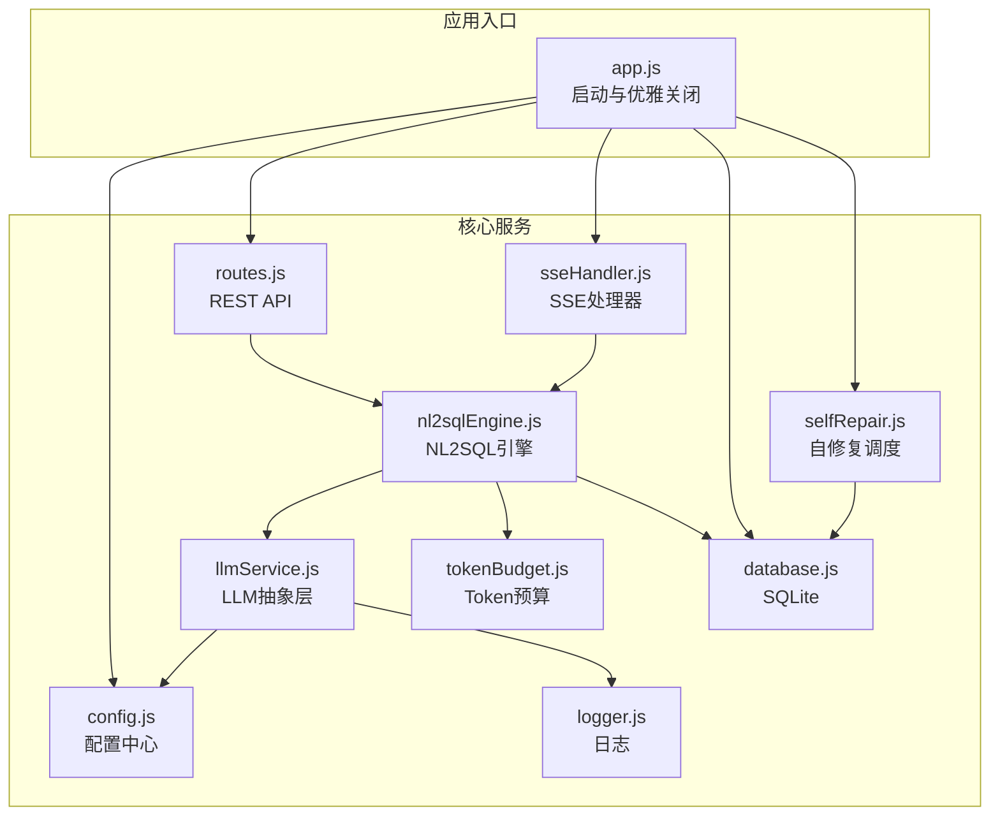
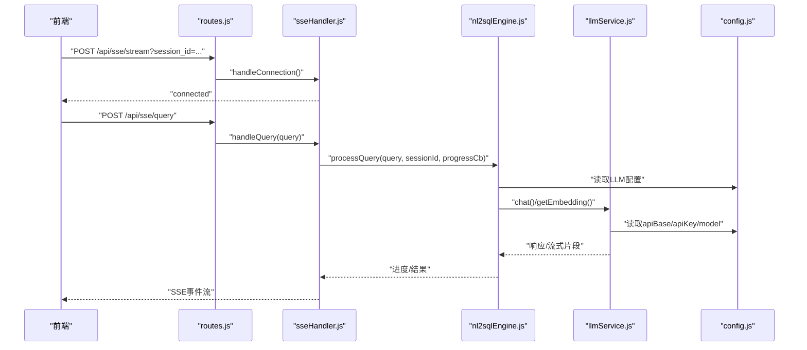
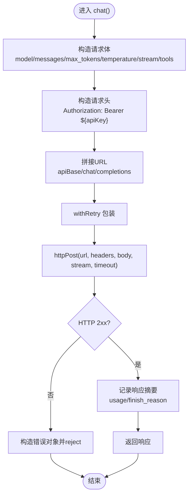
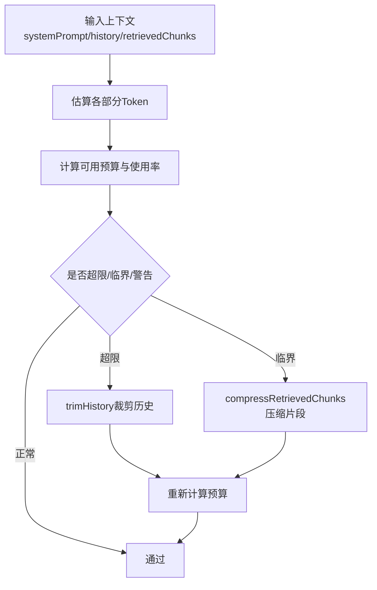
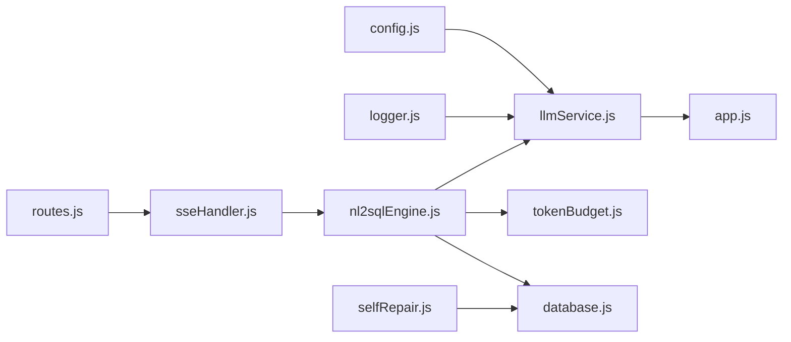

# LLM 服务集成

<cite>
**本文引用的文件**
- [llmService.js](file://backend/src/core/llmService.js)
- [config.js](file://backend/src/core/config.js)
- [tokenBudget.js](file://backend/src/utils/tokenBudget.js)
- [logger.js](file://backend/src/utils/logger.js)
- [routes.js](file://backend/src/core/routes.js)
- [app.js](file://backend/src/app.js)
- [nl2sqlEngine.js](file://backend/src/core/nl2sqlEngine.js)
- [selfRepair.js](file://backend/src/core/selfRepair.js)
- [sseHandler.js](file://backend/src/core/sseHandler.js)
- [database.js](file://backend/src/core/database.js)
- [package.json](file://backend/package.json)
</cite>

## 目录
1. [简介](#简介)
2. [项目结构](#项目结构)
3. [核心组件](#核心组件)
4. [架构总览](#架构总览)
5. [详细组件分析](#详细组件分析)
6. [依赖关系分析](#依赖关系分析)
7. [性能考量](#性能考量)
8. [故障排查指南](#故障排查指南)
9. [结论](#结论)
10. [附录](#附录)

## 简介
本文件面向 NL2SQL 项目的 LLM 服务集成模块，系统性阐述其抽象层设计、统一接口、配置管理、请求处理、响应解析与错误处理机制。文档覆盖 OpenAI、DeepSeek 等兼容 OpenAI API 格式的 LLM 提供商的接入方式与配置要点，提供模型选择、参数配置与结果处理的实践路径，并解释 Token 预算管理、并发控制与性能优化策略，以及故障转移、重试与监控告警的实现方案。

## 项目结构
后端采用 Node.js + Express 架构，核心模块围绕“配置中心”“LLM 抽象层”“日志与监控”“路由与 SSE”“数据库与向量库”展开。LLM 服务集成位于 core 层，通过配置模块集中管理 API Base、模型、超时、重试等参数；日志模块提供统一的结构化日志；路由模块提供 REST API 与 SSE；NL2SQL 引擎在推理链路中调用 LLM 服务。

图表来源
- [app.js:97-166](file://backend/src/app.js#L97-L166)
- [routes.js:35-80](file://backend/src/core/routes.js#L35-L80)
- [llmService.js:222-299](file://backend/src/core/llmService.js#L222-L299)
- [nl2sqlEngine.js:16-33](file://backend/src/core/nl2sqlEngine.js#L16-L33)

章节来源
- [app.js:97-166](file://backend/src/app.js#L97-L166)
- [package.json:10-27](file://backend/package.json#L10-L27)

## 核心组件
- 配置中心：集中管理 LLM API Base、模型、超时、重试、Embedding 维度、日志级别、安全策略、上下文预算等。
- LLM 抽象层：封装 HTTP 请求、流式响应、重试、错误解析与日志记录，统一 chat 与 embeddings 接口。
- 日志模块：统一日志级别、文件轮转、结构化输出与追踪能力。
- NL2SQL 引擎：意图识别、澄清、SQL 生成、校验与结果格式化，调用 LLM 服务与 Token 预算。
- SSE 处理器：连接管理、进度回调、结果广播。
- 自修复调度：定时健康检查、会话清理、统计收集、记忆维护。
- 数据库：会话、消息、查询历史、偏好等持久化。

章节来源
- [config.js:16-398](file://backend/src/core/config.js#L16-L398)
- [llmService.js:41-152](file://backend/src/core/llmService.js#L41-L152)
- [logger.js:54-442](file://backend/src/utils/logger.js#L54-L442)
- [nl2sqlEngine.js:16-33](file://backend/src/core/nl2sqlEngine.js#L16-L33)
- [sseHandler.js:43-112](file://backend/src/core/sseHandler.js#L43-L112)
- [selfRepair.js:60-125](file://backend/src/core/selfRepair.js#L60-L125)
- [database.js:200-261](file://backend/src/core/database.js#L200-L261)

## 架构总览
LLM 服务集成采用“配置驱动 + 统一抽象 + 结构化日志 + 可插拔提供商”的设计。LLM 抽象层通过配置中心读取 API Base 与密钥，支持任意兼容 OpenAI API 的提供商（如 OpenAI、DeepSeek、Azure OpenAI 等）。请求封装了超时、重试、错误解析与响应日志；NL2SQL 引擎在推理链路中调用 LLM，结合 Token 预算与对话摘要控制上下文规模。

图表来源
- [routes.js:891-948](file://backend/src/core/routes.js#L891-L948)
- [sseHandler.js:218-280](file://backend/src/core/sseHandler.js#L218-L280)
- [nl2sqlEngine.js:741-743](file://backend/src/core/nl2sqlEngine.js#L741-L743)
- [llmService.js:222-299](file://backend/src/core/llmService.js#L222-L299)
- [config.js:60-86](file://backend/src/core/config.js#L60-L86)

## 详细组件分析

### LLM 抽象层设计与实现
- 统一接口
  - chat(messages, tools?, stream?, onStream?): 支持普通与流式响应，自动携带 Authorization 头与模型参数。
  - simpleChat(prompt, systemPrompt?): 快速单轮对话封装。
  - getEmbedding(input): 统一 Embedding 接口，支持单个或批量输入。
  - createToolDefinition(...): 工具定义辅助函数。
- 请求封装
  - httpPost(url, headers, body, stream, timeout): 基于 Node.js http/https 模块，支持超时、错误与 JSON 解析。
  - withRetry(fn, maxRetries, delay): 带指数退避的重试包装器。
  - sleep(ms): 简单延时工具。
- 错误处理
  - HTTP 状态码非 2xx 时构造错误对象，包含 statusCode 与响应体。
  - JSON 解析失败时记录原始响应片段、截断标记与多对象迹象，便于定位代理截断或流式格式问题。
  - 超时与请求错误分别处理，统一 reject。
- 日志与追踪
  - 调用前后记录 trace/debug 日志，包含消息数量、流式标志、响应长度、usage、finish_reason 等。

图表来源
- [llmService.js:222-299](file://backend/src/core/llmService.js#L222-L299)
- [llmService.js:41-152](file://backend/src/core/llmService.js#L41-L152)
- [llmService.js:167-195](file://backend/src/core/llmService.js#L167-L195)

章节来源
- [llmService.js:222-299](file://backend/src/core/llmService.js#L222-L299)
- [llmService.js:313-347](file://backend/src/core/llmService.js#L313-L347)
- [llmService.js:360-415](file://backend/src/core/llmService.js#L360-L415)
- [llmService.js:431-451](file://backend/src/core/llmService.js#L431-L451)

### 配置管理与提供商适配
- LLM 配置
  - apiBase: 默认指向 OpenAI v1，可替换为 DeepSeek、Azure OpenAI 等兼容 OpenAI API 的地址。
  - apiKey: 用于 Authorization: Bearer。
  - model: 默认 gpt-4，可按提供商能力调整。
  - timeout: 请求超时，大模型建议增大。
  - maxRetries/retryDelay: 重试策略。
- Embedding 配置
  - model/dimension/timeout: Embedding 模型与维度，不同提供商可能差异较大。
- 安全与上下文
  - 安全策略：白名单、dryRun、行数限制、查询超时、禁止关键字、敏感字段脱敏。
  - 上下文预算：最大上下文 Token、输出预留、警告/压缩阈值、摘要策略等。
- 配置验证
  - 启动时校验 LLM API Key 与 SR 数据库 URL，缺失时报错。

章节来源
- [config.js:60-86](file://backend/src/core/config.js#L60-L86)
- [config.js:140-170](file://backend/src/core/config.js#L140-L170)
- [config.js:303-333](file://backend/src/core/config.js#L303-L333)
- [config.js:366-388](file://backend/src/core/config.js#L366-L388)

### 请求处理与响应解析
- chat 流式与非流式
  - stream=false: 返回完整 JSON 响应，解析 choices[0].message.content。
  - stream=true: 由 httpPost 的 data 事件累积片段，最终返回完整响应（抽象层未实现逐段解析回调，但底层具备流式能力）。
- Embedding
  - 输入支持单个或数组；返回 data[0].embedding 或数组。
- 错误解析
  - 非 2xx 状态码构造错误，包含 statusCode 与响应体。
  - JSON 解析失败时记录响应片段、截断标记与多对象迹象，便于定位代理截断或流式格式问题。

章节来源
- [llmService.js:222-299](file://backend/src/core/llmService.js#L222-L299)
- [llmService.js:360-415](file://backend/src/core/llmService.js#L360-L415)
- [llmService.js:78-133](file://backend/src/core/llmService.js#L78-L133)

### 错误处理与重试机制
- withRetry(fn, maxRetries, delay)
  - 重试次数与间隔可配置；每次失败记录警告日志并等待。
- httpPost
  - error 事件：请求失败。
  - timeout 事件：销毁请求并 reject 超时。
  - end 事件：尝试 JSON 解析，失败时记录详细上下文。
- 配置层面
  - LLM 与 Embedding 的 timeout、maxRetries、retryDelay 可独立配置。

章节来源
- [llmService.js:167-195](file://backend/src/core/llmService.js#L167-L195)
- [llmService.js:135-151](file://backend/src/core/llmService.js#L135-L151)
- [config.js:60-86](file://backend/src/core/config.js#L60-L86)

### Token 预算管理与上下文控制
- 估算与预算
  - estimateTokens/estimateTokensBatch/estimateObjectTokens：基于字符数估算 Token。
  - calculateContextBudget：分解系统提示、历史、检索片段，计算可用预算与使用率，给出警告/临界/超限状态与建议。
- 压缩策略
  - trimHistory：裁剪历史对话，保留最近 N 轮。
  - compressRetrievedChunks：按相关性保留检索片段，限制最大 Token 数。
  - triggerCompression：综合策略自动压缩，二次校验预算。
- 配置
  - maxContextTokens/reservedOutputTokens/warningThreshold/compressionThreshold/recentHistoryRounds 等。

图表来源
- [tokenBudget.js:115-181](file://backend/src/utils/tokenBudget.js#L115-L181)
- [tokenBudget.js:227-253](file://backend/src/utils/tokenBudget.js#L227-L253)
- [tokenBudget.js:263-305](file://backend/src/utils/tokenBudget.js#L263-L305)
- [tokenBudget.js:315-372](file://backend/src/utils/tokenBudget.js#L315-L372)

章节来源
- [tokenBudget.js:57-83](file://backend/src/utils/tokenBudget.js#L57-L83)
- [tokenBudget.js:115-181](file://backend/src/utils/tokenBudget.js#L115-L181)
- [tokenBudget.js:227-372](file://backend/src/utils/tokenBudget.js#L227-L372)
- [config.js:303-333](file://backend/src/core/config.js#L303-L333)

### 并发控制与性能优化
- SSE 并发
  - handleConnection 支持多标签页连接；handleQuery 检查 isProcessing，避免并发处理。
  - broadcastToSession 广播进度与结果。
- NL2SQL 引擎
  - 通过 Token 预算与摘要策略控制上下文规模，降低模型调用成本。
  - 与向量检索结合，减少无关上下文。
- 日志与监控
  - Logger 提供 trace/debug/info/warn/error 级别与文件轮转。
  - selfRepair 定时任务收集统计、检查数据库/向量库/查询性能、清理过期会话。

章节来源
- [sseHandler.js:218-280](file://backend/src/core/sseHandler.js#L218-L280)
- [selfRepair.js:60-125](file://backend/src/core/selfRepair.js#L60-L125)
- [logger.js:54-442](file://backend/src/utils/logger.js#L54-L442)

### 故障转移、重试与监控告警
- 重试
  - withRetry 提供统一重试包装，结合 LLM/Embedding 超时配置。
- 健康检查
  - selfRepair.performDailyCheck：数据库、向量库、查询统计、连接数、系统资源。
  - routes.health/detail：对外暴露健康状态。
- 告警与记录
  - 日志模块记录错误堆栈；自修复报告写入 system_logs 表。
  - routes.config 暴露公开配置，便于前端感知能力开关。

章节来源
- [llmService.js:167-195](file://backend/src/core/llmService.js#L167-L195)
- [selfRepair.js:169-310](file://backend/src/core/selfRepair.js#L169-L310)
- [routes.js:72-137](file://backend/src/core/routes.js#L72-L137)
- [routes.js:924-942](file://backend/src/core/routes.js#L924-L942)

### API 调用示例与最佳实践
- 模型选择与参数
  - 在配置中设置 LLM_MODEL 与 LLM_API_BASE，即可无缝切换 OpenAI、DeepSeek、Azure OpenAI 等。
  - 调整 LLM_TIMEOUT 以适应大模型推理时延。
- 请求处理
  - chat(messages, tools?, stream?, onStream?)
  - simpleChat(prompt, systemPrompt?)
  - getEmbedding(input)
- 结果处理
  - chat 返回 choices[0].message.content；Embedding 返回向量或向量数组。
- 上下文控制
  - 使用 Token 预算模块在 NL2SQL 引擎中进行预算计算与压缩，避免超限。
- 安全与合规
  - 配置 ALLOWED_TABLES、MAX_QUERY_ROWS、QUERY_TIMEOUT、禁止关键字与敏感字段脱敏。

章节来源
- [llmService.js:222-299](file://backend/src/core/llmService.js#L222-L299)
- [llmService.js:313-347](file://backend/src/core/llmService.js#L313-L347)
- [llmService.js:360-415](file://backend/src/core/llmService.js#L360-L415)
- [config.js:140-170](file://backend/src/core/config.js#L140-L170)
- [tokenBudget.js:115-181](file://backend/src/utils/tokenBudget.js#L115-L181)

## 依赖关系分析

图表来源
- [llmService.js:22-24](file://backend/src/core/llmService.js#L22-L24)
- [logger.js:22-23](file://backend/src/utils/logger.js#L22-L23)
- [routes.js:21-29](file://backend/src/core/routes.js#L21-L29)
- [sseHandler.js:17-20](file://backend/src/core/sseHandler.js#L17-L20)
- [nl2sqlEngine.js:16-33](file://backend/src/core/nl2sqlEngine.js#L16-L33)
- [tokenBudget.js:12-13](file://backend/src/utils/tokenBudget.js#L12-L13)
- [database.js:16-19](file://backend/src/core/database.js#L16-L19)
- [selfRepair.js:17-26](file://backend/src/core/selfRepair.js#L17-L26)

章节来源
- [llmService.js:22-24](file://backend/src/core/llmService.js#L22-L24)
- [routes.js:21-29](file://backend/src/core/routes.js#L21-L29)
- [nl2sqlEngine.js:16-33](file://backend/src/core/nl2sqlEngine.js#L16-L33)

## 性能考量
- 模型与超时
  - 大模型（如 Qwen3.5-397B）建议提高 LLM_TIMEOUT，避免早期超时。
- 上下文控制
  - 合理设置 maxContextTokens 与 reservedOutputTokens，结合摘要与压缩策略。
- 并发与连接
  - SSE 连接按会话管理，避免并发处理；数据库连接池参数可按负载调整。
- 日志与监控
  - 适当降低日志级别以减少 I/O；利用 selfRepair 收集统计，识别慢查询与异常。

[本节为通用指导，无需特定文件引用]

## 故障排查指南
- 常见错误
  - HTTP 非 2xx：检查 apiBase、apiKey、网络连通性与配额。
  - JSON 解析失败：检查代理截断、响应格式与流式边界。
  - 超时：提高 LLM_TIMEOUT 或降低上下文规模。
- 日志定位
  - 使用 Logger 的 trace/debug/info/warn/error 级别，结合 SSE 进度事件定位瓶颈。
- 健康检查
  - 访问 /api/health 与 /api/health/detail，查看数据库、向量库、连接数与查询统计。
- 自修复
  - 触发每日自检与统计收集，关注内存使用率与慢查询阈值。

章节来源
- [llmService.js:78-133](file://backend/src/core/llmService.js#L78-L133)
- [logger.js:263-309](file://backend/src/utils/logger.js#L263-L309)
- [routes.js:72-137](file://backend/src/core/routes.js#L72-L137)
- [selfRepair.js:169-310](file://backend/src/core/selfRepair.js#L169-L310)

## 结论
本 LLM 服务集成模块通过“配置驱动 + 统一抽象 + 结构化日志 + 可插拔提供商”的设计，实现了对 OpenAI、DeepSeek 等兼容 OpenAI API 的统一接入；结合 Token 预算、并发控制与自修复机制，提供了稳健的推理链路支撑。建议在生产环境中：
- 明确 apiBase 与 apiKey 的来源与权限；
- 合理设置超时与重试；
- 使用 Token 预算与摘要策略控制上下文；
- 启用健康检查与日志轮转；
- 通过 routes.config 与 /api/health 对外暴露能力状态。

[本节为总结，无需特定文件引用]

## 附录

### OpenAI 与 DeepSeek 集成要点
- OpenAI
  - apiBase: https://api.openai.com/v1
  - model: 如 gpt-4、gpt-4o、gpt-4o-mini 等
- DeepSeek
  - apiBase: https://api.deepseek.com/v1
  - model: 如 deepseek-chat、deepseek-coder 等
- Azure OpenAI
  - apiBase: https://{resource}.openai.azure.com/openai/deployments/{deployment}/chat/completions?api-version={api_version}
  - 注意：Azure 通常使用部署名而非模型名，且认证方式可能不同（需参考 Azure 文档）

章节来源
- [config.js:60-74](file://backend/src/core/config.js#L60-L74)

### 配置清单与环境变量
- LLM 相关
  - LLM_API_BASE: LLM API 基础地址（默认 OpenAI）
  - LLM_API_KEY: API 密钥
  - LLM_MODEL: 默认模型名称
  - LLM_TIMEOUT: 请求超时（毫秒）
  - EMBEDDING_MODEL: Embedding 模型
  - EMBEDDING_TIMEOUT: Embedding 超时
- 安全与上下文
  - ALLOWED_TABLES: 白名单（逗号分隔）
  - DRY_RUN: 仅生成 SQL 不执行
  - MAX_QUERY_ROWS: 返回行数上限
  - QUERY_TIMEOUT: 查询超时
  - ENABLE_TOKEN_BUDGET: 启用 Token 预算
  - ENABLE_SUMMARIZER: 启用摘要
  - MAX_CONTEXT_TOKENS: 上下文最大 Token
  - RESERVED_OUTPUT_TOKENS: 输出预留
  - SUMMARIZER_*: 摘要相关阈值与间隔

章节来源
- [config.js:60-86](file://backend/src/core/config.js#L60-L86)
- [config.js:140-170](file://backend/src/core/config.js#L140-L170)
- [config.js:303-333](file://backend/src/core/config.js#L303-L333)