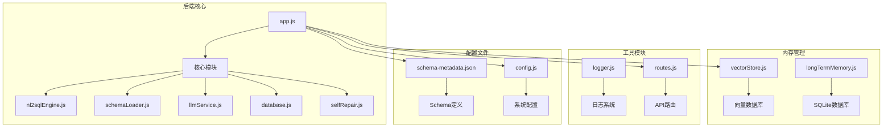
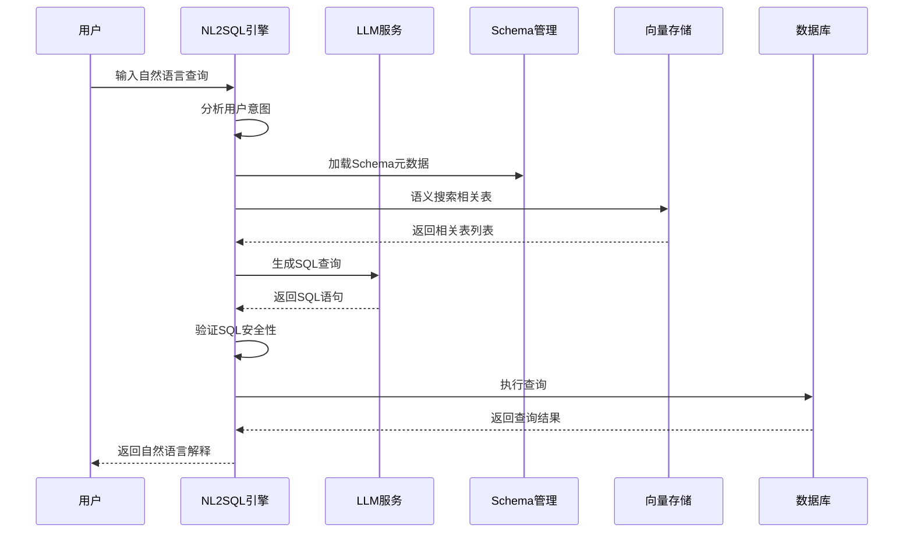
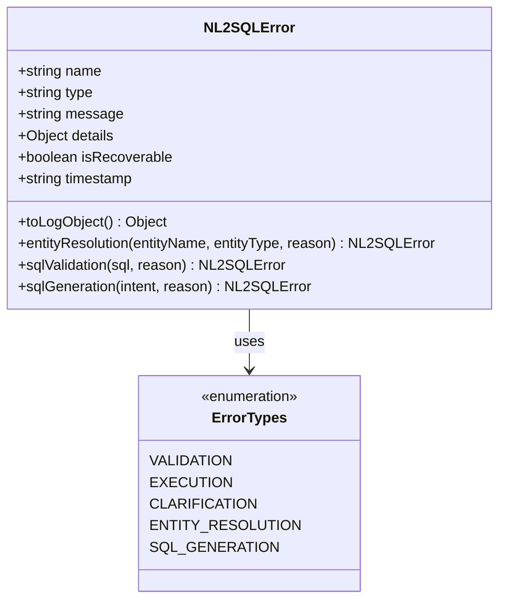
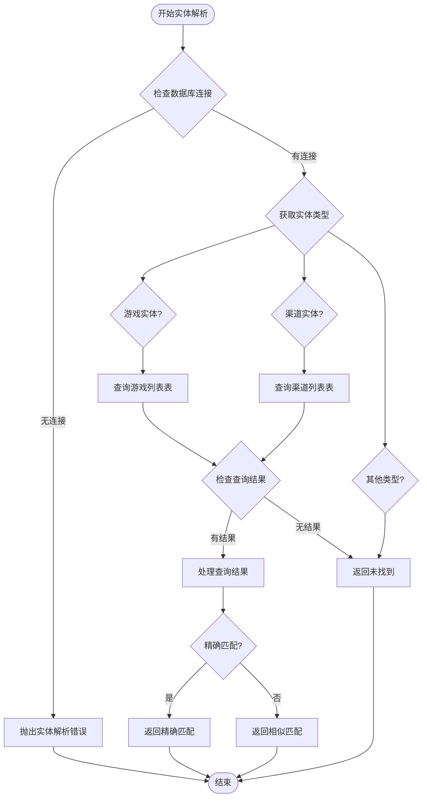
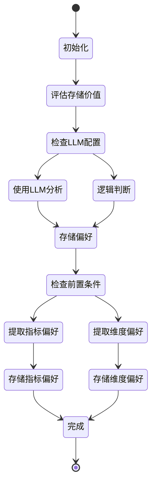
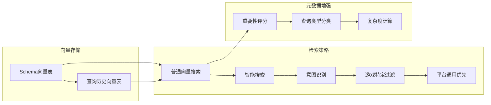
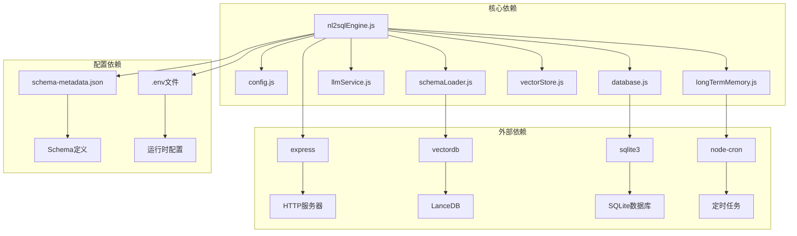

# NL2SQL 转换引擎

<cite>
**本文档引用的文件**
- [nl2sqlEngine.js](file://backend/src/core/nl2sqlEngine.js)
- [config.js](file://backend/src/core/config.js)
- [schemaLoader.js](file://backend/src/core/schemaLoader.js)
- [llmService.js](file://backend/src/core/llmService.js)
- [database.js](file://backend/src/core/database.js)
- [selfRepair.js](file://backend/src/core/selfRepair.js)
- [routes.js](file://backend/src/core/routes.js)
- [vectorStore.js](file://backend/src/memory/vectorStore.js)
- [longTermMemory.js](file://backend/src/memory/longTermMemory.js)
- [logger.js](file://backend/src/utils/logger.js)
- [app.js](file://backend/src/app.js)
- [schema-metadata.json](file://backend/config/schema-metadata.json)
- [package.json](file://backend/package.json)
</cite>

## 目录
1. [简介](#简介)
2. [项目结构](#项目结构)
3. [核心组件](#核心组件)
4. [架构概览](#架构概览)
5. [详细组件分析](#详细组件分析)
6. [依赖关系分析](#依赖关系分析)
7. [性能考虑](#性能考虑)
8. [故障排除指南](#故障排除指南)
9. [结论](#结论)
10. [附录](#附录)

## 简介

NL2SQL 转换引擎是一个基于人工智能的自然语言到 SQL 查询转换系统。该引擎能够理解用户的自然语言查询，将其转换为准确的 SQL 语句，支持复杂的业务场景和多维度分析。

### 主要特性

- **意图识别**：智能理解用户查询的业务意图和需求
- **实体解析**：将模糊的业务术语映射到具体的数据库实体
- **Schema 管理**：动态加载和管理数据库 Schema 元数据
- **向量检索**：基于语义相似度的 Schema 和查询检索
- **长期记忆**：学习和存储用户偏好和查询模式
- **安全验证**：SQL 语句的安全性和完整性验证
- **自修复机制**：自动监控和维护系统健康状态

## 项目结构

**图表来源**
- [app.js:1-238](file://backend/src/app.js#L1-L238)
- [nl2sqlEngine.js:1-800](file://backend/src/core/nl2sqlEngine.js#L1-L800)
- [schemaLoader.js:1-800](file://backend/src/core/schemaLoader.js#L1-L800)

**章节来源**
- [app.js:1-238](file://backend/src/app.js#L1-L238)
- [package.json:1-28](file://backend/package.json#L1-L28)

## 核心组件

### NL2SQL 引擎核心模块

NL2SQL 引擎的核心模块负责整个转换流程的协调和管理：

#### 业务关键词映射
- **功能**：根据用户查询中的关键词智能推断可能需要的表
- **实现**：动态构建关键词到表的映射关系
- **特点**：支持热更新和实时映射

#### 实体解析机制
- **功能**：将模糊描述（如游戏名称）映射到具体 ID
- **实现**：支持游戏实体和渠道实体的解析
- **特点**：具备容错能力和替代方案

#### 平台术语解析
- **功能**：识别"新平台"/"老平台"等术语并映射到数据库标识
- **实现**：支持长期记忆学习和硬编码兜底
- **特点**：灵活的映射策略

**章节来源**
- [nl2sqlEngine.js:35-95](file://backend/src/core/nl2sqlEngine.js#L35-L95)
- [nl2sqlEngine.js:229-283](file://backend/src/core/nl2sqlEngine.js#L229-L283)
- [nl2sqlEngine.js:533-605](file://backend/src/core/nl2sqlEngine.js#L533-L605)

### Schema 管理模块

Schema 管理模块负责数据库结构的加载和管理：

#### Schema 加载
- **功能**：从 JSON 配置文件加载表结构定义
- **实现**：支持缓存机制和向量化存储
- **特点**：完整的数据验证和映射构建

#### 智能搜索
- **功能**：基于语义相似度的表搜索
- **实现**：表级向量表示和智能重排序
- **特点**：支持游戏特定和平台通用的搜索策略

**章节来源**
- [schemaLoader.js:69-122](file://backend/src/core/schemaLoader.js#L69-L122)
- [schemaLoader.js:567-657](file://backend/src/core/schemaLoader.js#L567-L657)

### LLM 服务模块

LLM 服务模块提供大语言模型的集成能力：

#### API 通信
- **功能**：与 LLM API 进行 HTTP 通信
- **实现**：支持流式响应和重试机制
- **特点**：完整的错误处理和超时控制

#### Embedding 向量
- **功能**：获取文本的向量表示
- **实现**：批量处理和错误恢复
- **特点**：支持多种嵌入模型

**章节来源**
- [llmService.js:41-152](file://backend/src/core/llmService.js#L41-L152)
- [llmService.js:360-415](file://backend/src/core/llmService.js#L360-L415)

## 架构概览

**图表来源**
- [nl2sqlEngine.js:741-744](file://backend/src/core/nl2sqlEngine.js#L741-L744)
- [schemaLoader.js:567-657](file://backend/src/core/schemaLoader.js#L567-L657)
- [llmService.js:222-299](file://backend/src/core/llmService.js#L222-L299)

## 详细组件分析

### NL2SQL 统一错误类设计

系统采用统一的错误处理机制，提供结构化的错误信息：

**图表来源**
- [nl2sqlEngine.js:145-215](file://backend/src/core/nl2sqlEngine.js#L145-L215)

#### 错误类型分类

| 错误类型 | 描述 | 可恢复性 | 处理策略 |
|---------|------|---------|----------|
| VALIDATION | SQL 验证失败 | 否 | 直接返回错误信息 |
| EXECUTION | 查询执行异常 | 否 | 记录详细错误日志 |
| CLARIFICATION | 需要澄清的信息 | 是 | 引导用户提供更多信息 |
| ENTITY_RESOLUTION | 实体解析失败 | 是 | 提供替代方案或重新解析 |
| SQL_GENERATION | SQL 生成失败 | 是 | 重新生成或使用默认模板 |

**章节来源**
- [nl2sqlEngine.js:145-215](file://backend/src/core/nl2sqlEngine.js#L145-L215)

### 实体解析算法

实体解析是 NL2SQL 引擎的核心功能之一，支持多种实体类型的解析：

**图表来源**
- [nl2sqlEngine.js:229-283](file://backend/src/core/nl2sqlEngine.js#L229-L283)

#### 实体解析流程

1. **数据库连接检查**：确保数据库连接可用
2. **实体类型识别**：根据实体类型选择相应的查询策略
3. **模糊匹配查询**：使用 LIKE 查询进行模糊匹配
4. **结果处理**：优先返回精确匹配，否则返回相似匹配
5. **替代方案**：提供多个候选结果供用户选择

**章节来源**
- [nl2sqlEngine.js:229-283](file://backend/src/core/nl2sqlEngine.js#L229-L283)

### 长期记忆管理系统

长期记忆系统能够学习和存储用户的偏好和查询模式：

**图表来源**
- [longTermMemory.js:312-485](file://backend/src/memory/longTermMemory.js#L312-L485)

#### 存储策略

1. **前置条件检查**：查询必须成功且置信度足够
2. **价值评估**：高价值模板和高频模式优先存储
3. **LLM 智能分析**：可选的 LLM 分析功能
4. **偏好提取**：指标偏好、维度偏好和查询模式
5. **冲突处理**：映射冲突的检测和处理

**章节来源**
- [longTermMemory.js:312-485](file://backend/src/memory/longTermMemory.js#L312-L485)

### 向量存储和语义检索

系统使用 LanceDB 实现高效的向量存储和语义检索：

**图表来源**
- [vectorStore.js:378-536](file://backend/src/memory/vectorStore.js#L378-L536)
- [vectorStore.js:139-195](file://backend/src/memory/vectorStore.js#L139-L195)

#### 智能搜索算法

1. **意图识别**：检测查询中是否提及具体游戏
2. **优先级排序**：游戏表 > 平台表 > 原始日志表
3. **距离归一化**：向量距离越小优先级越高
4. **动态重排序**：根据查询意图调整结果排序

**章节来源**
- [vectorStore.js:450-536](file://backend/src/memory/vectorStore.js#L450-L536)

## 依赖关系分析

**图表来源**
- [app.js:39-50](file://backend/src/app.js#L39-L50)
- [package.json:10-27](file://backend/package.json#L10-L27)

### 模块耦合分析

| 模块 | 主要依赖 | 耦合度 | 说明 |
|------|----------|--------|------|
| nl2sqlEngine.js | config, schemaLoader, llmService, database | 高 | 核心协调模块 |
| schemaLoader.js | config, llmService, vectorStore | 中等 | Schema 管理 |
| longTermMemory.js | database, llmService, config | 中等 | 记忆管理 |
| vectorStore.js | config, evaluation | 低 | 向量存储 |
| database.js | config | 低 | 数据库操作 |

**章节来源**
- [app.js:39-50](file://backend/src/app.js#L39-L50)
- [package.json:10-27](file://backend/package.json#L10-L27)

## 性能考虑

### 缓存策略

1. **Schema 缓存**：Schema 元数据缓存 1 小时
2. **向量缓存**：向量数据库持久化存储
3. **查询缓存**：频繁查询的结果缓存
4. **配置缓存**：运行时配置缓存

### 优化建议

1. **批量处理**：向量嵌入使用批量处理减少 API 调用
2. **连接池**：数据库连接池配置优化
3. **索引优化**：SQLite 和 LanceDB 索引优化
4. **内存管理**：定期清理内存和优化垃圾回收

### 监控指标

- **查询响应时间**：平均和 95 分位响应时间
- **向量检索命中率**：Schema 向量检索的准确性
- **系统资源使用**：CPU、内存、磁盘使用情况
- **错误率统计**：各类错误的发生频率

## 故障排除指南

### 常见问题及解决方案

#### LLM API 连接问题
- **症状**：LLM API 调用失败，超时或认证错误
- **原因**：API 密钥配置错误、网络连接问题
- **解决方案**：检查 `.env` 文件中的 `LLM_API_KEY` 和 `LLM_API_BASE`

#### 数据库连接问题
- **症状**：数据库连接失败，查询异常
- **原因**：数据库 URL 配置错误、SQLite 文件权限问题
- **解决方案**：检查 `SR_DATABASE_URL` 配置和数据库文件权限

#### 向量数据库问题
- **症状**：向量检索功能不可用
- **原因**：LanceDB 初始化失败、磁盘空间不足
- **解决方案**：检查 `VECTOR_DB_PATH` 配置和磁盘空间

#### Schema 加载问题
- **症状**：Schema 元数据加载失败
- **原因**：`schema-metadata.json` 文件格式错误
- **解决方案**：验证 JSON 格式和必需字段

**章节来源**
- [config.js:366-388](file://backend/src/core/config.js#L366-L388)
- [app.js:160-165](file://backend/src/app.js#L160-L165)

### 日志分析

系统提供详细的日志记录功能，支持：

1. **多级别日志**：TRACE、DEBUG、INFO、WARN、ERROR
2. **结构化日志**：包含时间戳、模块名、详细信息
3. **执行追踪**：完整的查询执行流程追踪
4. **错误堆栈**：详细的错误信息和堆栈跟踪

**章节来源**
- [logger.js:263-309](file://backend/src/utils/logger.js#L263-L309)

## 结论

NL2SQL 转换引擎是一个功能完整、架构清晰的自然语言到 SQL 查询转换系统。其主要优势包括：

1. **智能化的意图识别**：能够准确理解复杂的业务查询需求
2. **灵活的实体解析**：支持多种实体类型的智能解析
3. **强大的向量检索**：基于语义相似度的高效检索
4. **完善的错误处理**：统一的错误类设计和处理策略
5. **可扩展的架构**：模块化设计便于功能扩展和维护

该系统适用于复杂的企业级数据分析场景，能够显著提高数据查询的效率和准确性。

## 附录

### 配置选项详解

#### 核心配置
- `NODE_ENV`: 运行环境（development/production）
- `PORT`: 服务监听端口，默认 3000
- `DRY_RUN`: 开发调试模式，只生成 SQL 不执行

#### LLM 配置
- `LLM_API_BASE`: LLM API 基础 URL
- `LLM_API_KEY`: API 认证密钥
- `LLM_MODEL`: 默认使用的模型名称
- `LLM_TIMEOUT`: 请求超时时间（毫秒）

#### 数据库配置
- `DB_PATH`: SQLite 数据库文件路径
- `VECTOR_DB_PATH`: 向量数据库存储路径
- `SR_DATABASE_URL`: 主数据源连接 URL

#### 安全配置
- `ALLOWED_TABLES`: 允许查询的数据表白名单
- `MAX_QUERY_ROWS`: 单次查询返回的最大行数
- `QUERY_TIMEOUT`: 查询超时时间（毫秒）

**章节来源**
- [config.js:16-397](file://backend/src/core/config.js#L16-L397)

### API 接口参考

#### 健康检查接口
- `GET /api/health`: 基础健康状态
- `GET /api/health/detail`: 详细健康状态

#### Schema 接口
- `GET /api/schema`: 获取完整 Schema 信息
- `GET /api/schema/search`: 搜索相关表
- `GET /api/schema/tables/:tableName`: 获取指定表详情

#### 会话管理接口
- `POST /api/sessions`: 创建新会话
- `GET /api/sessions/:sessionId`: 获取会话信息
- `DELETE /api/sessions/:sessionId`: 删除会话

#### 用户偏好接口
- `GET /api/preferences/:userId`: 获取用户偏好
- `POST /api/preferences/:userId/templates`: 保存查询模板
- `POST /api/preferences/:userId/learn-alias`: 学习字段别名

**章节来源**
- [routes.js:72-800](file://backend/src/core/routes.js#L72-L800)