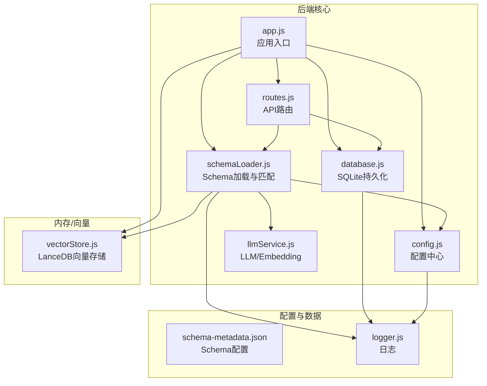
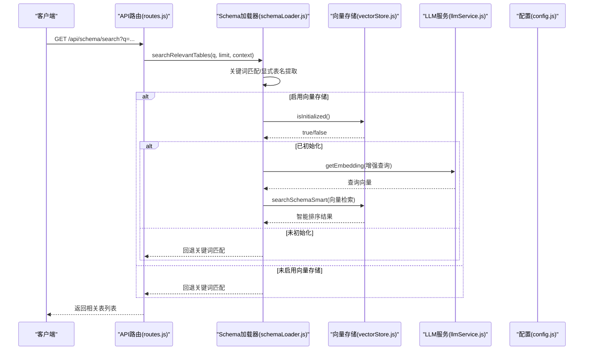
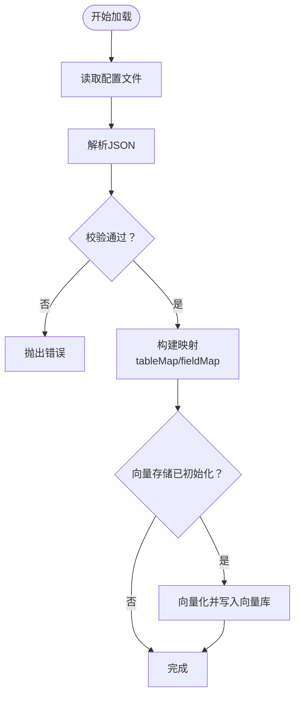
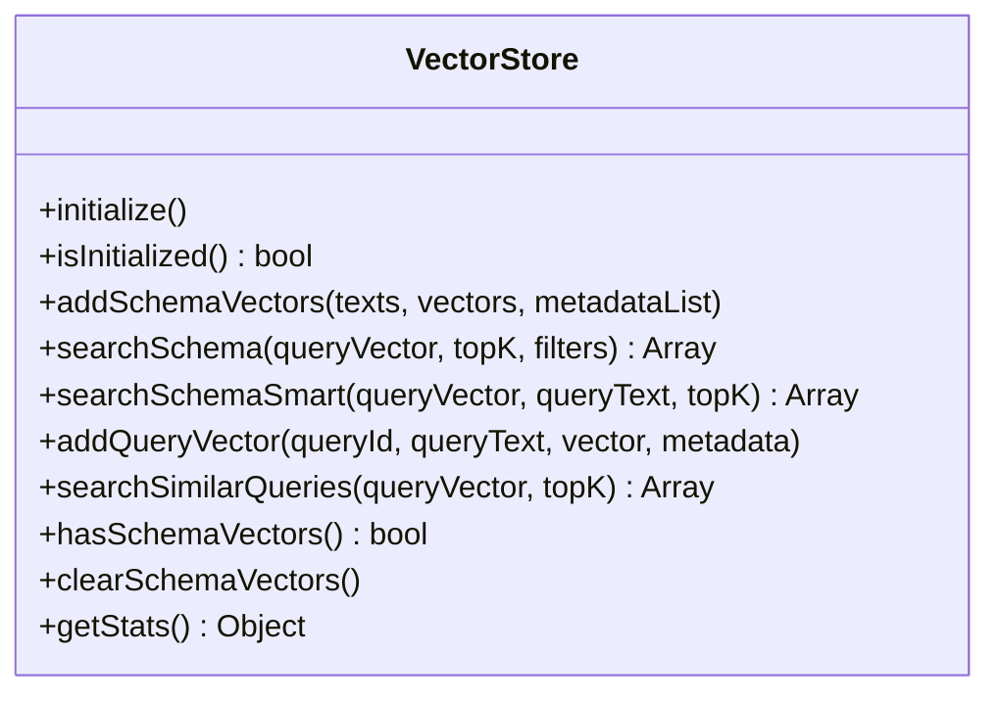
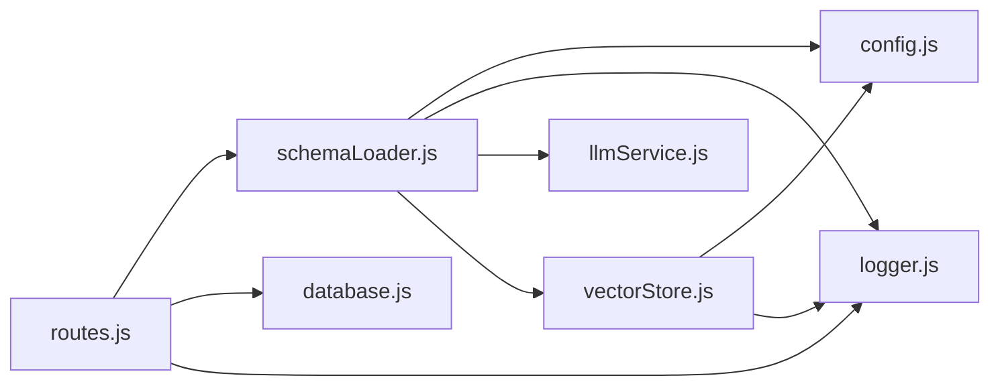

# Schema 加载与管理

<cite>
**本文引用的文件**
- [schemaLoader.js](file://backend/src/core/schemaLoader.js)
- [schema-metadata.example.json](file://backend/config/schema-metadata.example.json)
- [schema-metadata.json](file://backend/config/schema-metadata.json)
- [vectorStore.js](file://backend/src/memory/vectorStore.js)
- [config.js](file://backend/src/core/config.js)
- [app.js](file://backend/src/app.js)
- [routes.js](file://backend/src/core/routes.js)
- [database.js](file://backend/src/core/database.js)
- [llmService.js](file://backend/src/core/llmService.js)
- [logger.js](file://backend/src/utils/logger.js)
- [package.json](file://backend/package.json)
</cite>

## 目录
1. [简介](#简介)
2. [项目结构](#项目结构)
3. [核心组件](#核心组件)
4. [架构总览](#架构总览)
5. [详细组件分析](#详细组件分析)
6. [依赖关系分析](#依赖关系分析)
7. [性能考虑](#性能考虑)
8. [故障排查指南](#故障排查指南)
9. [结论](#结论)
10. [附录](#附录)

## 简介
本文件系统性阐述 NL2SQL 项目中的 Schema 加载与管理模块，涵盖：
- Schema 元数据的加载、解析与缓存机制
- schema-metadata.json 的结构与格式规范
- Schema 摘要生成、关键词映射构建与动态更新
- 配置示例与最佳实践
- Schema 验证、版本管理与热更新方案
- 与向量存储的集成与语义搜索支持

## 项目结构
Schema 加载与管理模块位于后端工程的 core 层，配合 memory 层的向量存储模块共同工作。整体结构如下：

图表来源
- [app.js:93-166](file://backend/src/app.js#L93-L166)
- [schemaLoader.js:69-122](file://backend/src/core/schemaLoader.js#L69-L122)
- [vectorStore.js:231-261](file://backend/src/memory/vectorStore.js#L231-L261)
- [config.js:240-250](file://backend/src/core/config.js#L240-L250)

章节来源
- [app.js:93-166](file://backend/src/app.js#L93-L166)
- [schemaLoader.js:69-122](file://backend/src/core/schemaLoader.js#L69-L122)
- [vectorStore.js:231-261](file://backend/src/memory/vectorStore.js#L231-L261)
- [config.js:240-250](file://backend/src/core/config.js#L240-L250)

## 核心组件
- Schema 加载器：负责从 JSON 配置文件加载、校验、构建映射、向量化与检索
- 向量存储：基于 LanceDB 的向量数据库，支持语义检索与智能重排序
- 配置中心：集中管理 Schema 路径、缓存策略、重向量化开关等
- API 路由：提供 Schema 查询、搜索、健康检查等接口
- 日志与评估：统一日志输出与运行时统计

章节来源
- [schemaLoader.js:32-51](file://backend/src/core/schemaLoader.js#L32-L51)
- [vectorStore.js:204-220](file://backend/src/memory/vectorStore.js#L204-L220)
- [config.js:240-250](file://backend/src/core/config.js#L240-L250)
- [routes.js:140-250](file://backend/src/core/routes.js#L140-L250)

## 架构总览
Schema 加载与管理的整体流程如下：

图表来源
- [routes.js:218-250](file://backend/src/core/routes.js#L218-L250)
- [schemaLoader.js:567-657](file://backend/src/core/schemaLoader.js#L567-L657)
- [vectorStore.js:450-535](file://backend/src/memory/vectorStore.js#L450-L535)
- [llmService.js:360-415](file://backend/src/core/llmService.js#L360-L415)

## 详细组件分析

### Schema 加载器（schemaLoader.js）
- 加载与校验
  - 从配置文件路径读取 JSON，校验 tables、fields 等关键字段
  - 校验通过后更新内存中的 schemaData，并构建表名/字段名映射
- 缓存与时间戳
  - 使用内存缓存 schemaData，并记录 cacheTimestamp
  - 可结合配置的缓存过期策略进行失效控制
- 向量化与存储
  - 若向量存储已初始化，将表级表征文本向量化并写入 schema_vectors 表
  - 支持强制重新向量化（SCHEMA_REVECTORIZE=true）
- 搜索与匹配
  - 显式表名提取：直接匹配查询文本中的表名
  - 关键词匹配：基于表名、中文名、描述、字段名的关键词匹配
  - 语义搜索：基于 Embedding 的向量检索，支持智能重排序与过滤
- SQL 安全验证
  - 禁止关键字检查、白名单表检查
- Schema 摘要与详情
  - 生成 Schema 概览文本，用于 Prompt 构造
  - 提供表结构详情文本

图表来源
- [schemaLoader.js:69-122](file://backend/src/core/schemaLoader.js#L69-L122)
- [schemaLoader.js:131-155](file://backend/src/core/schemaLoader.js#L131-L155)
- [schemaLoader.js:161-189](file://backend/src/core/schemaLoader.js#L161-L189)
- [schemaLoader.js:201-281](file://backend/src/core/schemaLoader.js#L201-L281)

章节来源
- [schemaLoader.js:69-122](file://backend/src/core/schemaLoader.js#L69-L122)
- [schemaLoader.js:131-155](file://backend/src/core/schemaLoader.js#L131-L155)
- [schemaLoader.js:161-189](file://backend/src/core/schemaLoader.js#L161-L189)
- [schemaLoader.js:201-281](file://backend/src/core/schemaLoader.js#L201-L281)
- [schemaLoader.js:567-657](file://backend/src/core/schemaLoader.js#L567-L657)
- [schemaLoader.js:765-785](file://backend/src/core/schemaLoader.js#L765-L785)

### 向量存储（vectorStore.js）
- 初始化与表结构
  - 连接 LanceDB，创建 schema_vectors 与 query_vectors 表
  - 提供 isInitialized、hasSchemaVectors、clearSchemaVectors 等状态检查
- Schema 向量操作
  - addSchemaVectors：批量写入表级向量与元数据
  - searchSchema：向量检索，支持过滤（scope、data_type）
  - searchSchemaSmart：智能搜索，基于查询意图进行优先级重排
- 查询历史向量
  - addQueryVector、searchSimilarQueries：历史查询的向量化与相似检索
- 元数据增强
  - calculateImportance、classifyQueryType、buildEnhancedMetadata：用于评估与记忆

图表来源
- [vectorStore.js:231-261](file://backend/src/memory/vectorStore.js#L231-L261)
- [vectorStore.js:336-367](file://backend/src/memory/vectorStore.js#L336-L367)
- [vectorStore.js:378-435](file://backend/src/memory/vectorStore.js#L378-L435)
- [vectorStore.js:450-535](file://backend/src/memory/vectorStore.js#L450-L535)

章节来源
- [vectorStore.js:231-261](file://backend/src/memory/vectorStore.js#L231-L261)
- [vectorStore.js:336-367](file://backend/src/memory/vectorStore.js#L336-L367)
- [vectorStore.js:378-435](file://backend/src/memory/vectorStore.js#L378-L435)
- [vectorStore.js:450-535](file://backend/src/memory/vectorStore.js#L450-L535)

### 配置中心（config.js）
- Schema 配置
  - configPath：Schema 配置文件路径
  - enableCache、cacheExpireTime：缓存开关与过期时间
  - revectorize：强制重新向量化开关
- 其他关键配置
  - LLM/Embedding、数据库、安全策略、日志级别等

章节来源
- [config.js:240-250](file://backend/src/core/config.js#L240-L250)

### API 路由（routes.js）
- Schema 接口
  - GET /api/schema：返回完整 Schema 或按 type 过滤
  - GET /api/schema/tables/:tableName：返回表详情与关联表
  - GET /api/schema/search：搜索相关表（关键词/语义）
- 健康检查
  - GET /api/health、GET /api/health/detail：组件状态检查

章节来源
- [routes.js:140-250](file://backend/src/core/routes.js#L140-L250)
- [routes.js:56-137](file://backend/src/core/routes.js#L56-L137)

### 应用入口（app.js）
- 初始化顺序
  - 创建数据目录 → 初始化 SQLite → 初始化 LanceDB → 加载 Schema → 启动自修复 → 启动 HTTP 服务
- 优雅关闭
  - 监听 SIGTERM/SIGINT，依次关闭 HTTP、SSE、定时任务、数据库

章节来源
- [app.js:93-166](file://backend/src/app.js#L93-L166)

## 依赖关系分析
- 模块耦合
  - schemaLoader 依赖 config、logger、llmService、vectorStore
  - routes 依赖 schemaLoader、database、sseHandler、evaluation
  - vectorStore 依赖 config、logger、evaluation
- 外部依赖
  - LanceDB（vectordb）、SQLite3、dotenv、uuid、dayjs、node-cron

图表来源
- [schemaLoader.js:15-26](file://backend/src/core/schemaLoader.js#L15-L26)
- [routes.js:21-29](file://backend/src/core/routes.js#L21-L29)
- [vectorStore.js:14-21](file://backend/src/memory/vectorStore.js#L14-L21)

章节来源
- [schemaLoader.js:15-26](file://backend/src/core/schemaLoader.js#L15-L26)
- [routes.js:21-29](file://backend/src/core/routes.js#L21-L29)
- [vectorStore.js:14-21](file://backend/src/memory/vectorStore.js#L14-L21)

## 性能考虑
- 向量化批次处理
  - 向量化采用批次（默认 20）处理，减少 Embedding API 调用次数
- 智能搜索重排序
  - searchSchemaSmart 基于意图识别与元数据标签进行优先级重排，提升检索质量
- 缓存与懒加载
  - 内存缓存 schemaData，结合配置的缓存过期策略
- 日志与评估
  - 统一日志输出，支持 trace/debug/info/warn/error 级别
  - 评估模块记录向量检索命中率与运行时统计

章节来源
- [schemaLoader.js:246-261](file://backend/src/core/schemaLoader.js#L246-L261)
- [vectorStore.js:450-535](file://backend/src/memory/vectorStore.js#L450-L535)
- [logger.js:29-44](file://backend/src/utils/logger.js#L29-L44)

## 故障排查指南
- Schema 加载失败
  - 检查配置文件路径与权限（SCHEMA_CONFIG_PATH）
  - 确认 JSON 格式正确，tables/fields 字段存在
  - 查看日志中的错误堆栈定位问题
- 向量存储未初始化
  - 确认 VECTOR_DB_PATH 可写，LanceDB 依赖已安装
  - 检查 vectorStore.initialize() 是否成功
- 语义搜索无结果
  - 确认 Embedding 模型与 API Key 配置正确
  - 检查 SCHEMA_REVECTORIZE 配置，必要时强制重新向量化
- API 返回 500
  - 查看 /api/health/detail 组件状态
  - 检查日志中的错误信息与堆栈

章节来源
- [schemaLoader.js:77-80](file://backend/src/core/schemaLoader.js#L77-L80)
- [vectorStore.js:231-261](file://backend/src/memory/vectorStore.js#L231-L261)
- [routes.js:96-137](file://backend/src/core/routes.js#L96-L137)

## 结论
Schema 加载与管理模块通过“配置驱动 + 向量化 + 智能检索”的组合，实现了高效、可扩展的 Schema 管理与查询能力。其设计兼顾性能与可维护性，支持版本化配置、缓存与热更新，并与向量存储无缝集成，为 NL2SQL 的语义搜索提供了坚实基础。

## 附录

### schema-metadata.json 结构与格式要求
- 顶层字段
  - version：版本号（建议遵循语义化版本）
  - tables：表定义数组
  - relationships：表关系数组
  - metrics：预定义指标数组
  - dimensions：维度定义数组
- 表定义（table）
  - name/name_cn/description：英文名、中文名、描述
  - fields：字段数组
- 字段定义（field）
  - name/name_cn/type/description：字段名、中文名、类型、描述
  - is_primary：是否为主键
  - foreign_key：外键引用（格式：表.字段）
  - aggregations：聚合函数列表（如 SUM、AVG、COUNT 等）
  - time_granularity：时间粒度（hour、day、week、month、year 等）
- 关系定义（relationship）
  - from/to：起止表字段（格式：表.字段）
  - type：关系类型（如 MANY_TO_ONE）
  - description：关系描述
- 指标定义（metric）
  - name/name_cn/definition/description/unit：指标名、中文名、定义、描述、单位
- 维度定义（dimension）
  - name/name_cn/fields/granularities/hierarchy：维度名、中文名、字段集合、时间粒度、层级关系

章节来源
- [schema-metadata.example.json:1-328](file://backend/config/schema-metadata.example.json#L1-L328)
- [schema-metadata.json:1-800](file://backend/config/schema-metadata.json#L1-L800)

### 配置示例与最佳实践
- Schema 配置
  - SCHEMA_CONFIG_PATH：指向 schema-metadata.json 的绝对或相对路径
  - SCHEMA_REVECTORIZE：true 时强制重新向量化，false 时若已有向量则跳过
- 向量存储
  - VECTOR_DB_PATH：LanceDB 数据目录
  - Embedding 模型与维度：EMBEDDING_MODEL、EMBEDDING_DIMENSION
- 安全与性能
  - ALLOWED_TABLES：白名单表，避免任意表访问
  - MAX_QUERY_ROWS、QUERY_TIMEOUT：限制查询规模与超时
  - DRY_RUN：仅生成 SQL 不执行，便于调试

章节来源
- [config.js:240-250](file://backend/src/core/config.js#L240-L250)
- [config.js:106-130](file://backend/src/core/config.js#L106-L130)
- [config.js:140-170](file://backend/src/core/config.js#L140-L170)

### Schema 验证、版本管理与热更新
- 验证
  - schemaLoader.validateSchema：校验 tables/fields 结构
- 版本管理
  - schemaData.version：来自配置文件的版本号
- 热更新
  - 通过重新加载配置文件与向量化流程实现热更新
  - 可结合 SCHEMA_REVECTORIZE 强制刷新向量

章节来源
- [schemaLoader.js:131-155](file://backend/src/core/schemaLoader.js#L131-L155)
- [schemaLoader.js:91-102](file://backend/src/core/schemaLoader.js#L91-L102)

### 与向量存储的集成与语义搜索
- 表级向量表征
  - buildTableRepresentation：将表的核心业务含义浓缩为文本，包含域标签、数据源类型、核心特征词
- 智能搜索
  - searchSchemaSmart：基于查询意图识别与元数据标签进行优先级重排
- 评估与统计
  - evaluation.recordVectorSearch：记录向量检索统计

章节来源
- [schemaLoader.js:296-336](file://backend/src/core/schemaLoader.js#L296-L336)
- [schemaLoader.js:450-535](file://backend/src/core/schemaLoader.js#L450-L535)
- [vectorStore.js:450-535](file://backend/src/memory/vectorStore.js#L450-L535)