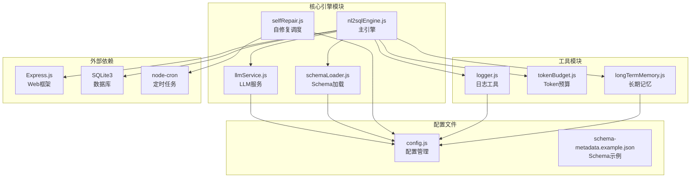
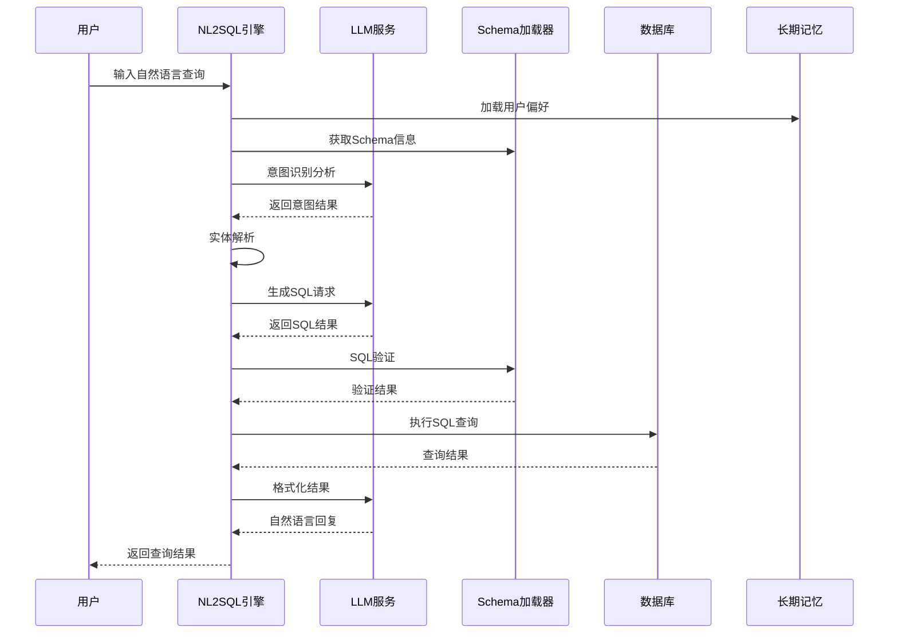
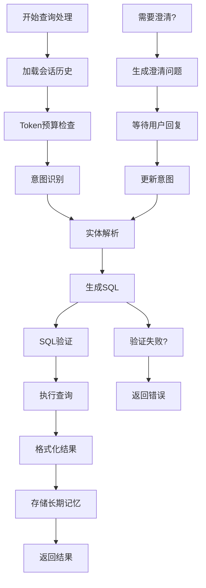
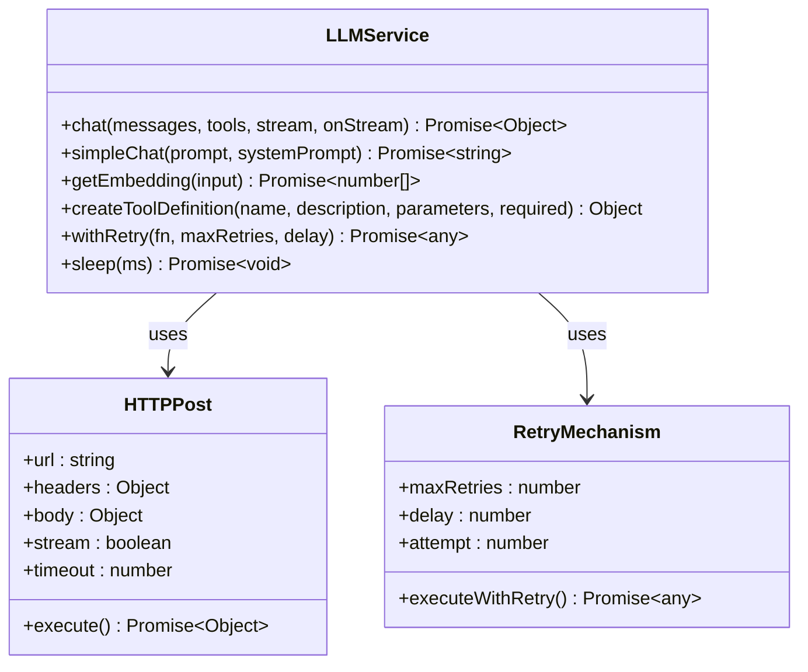
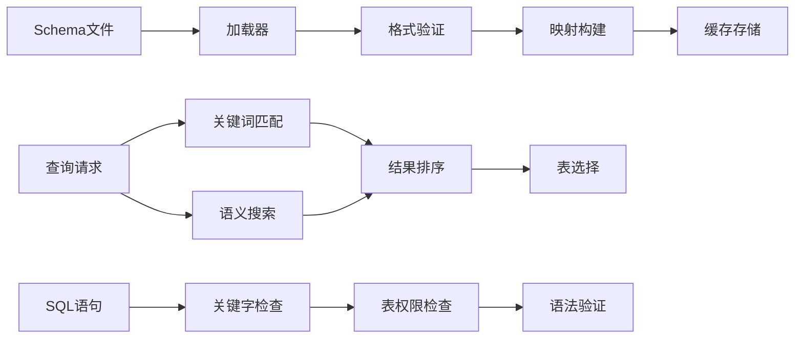
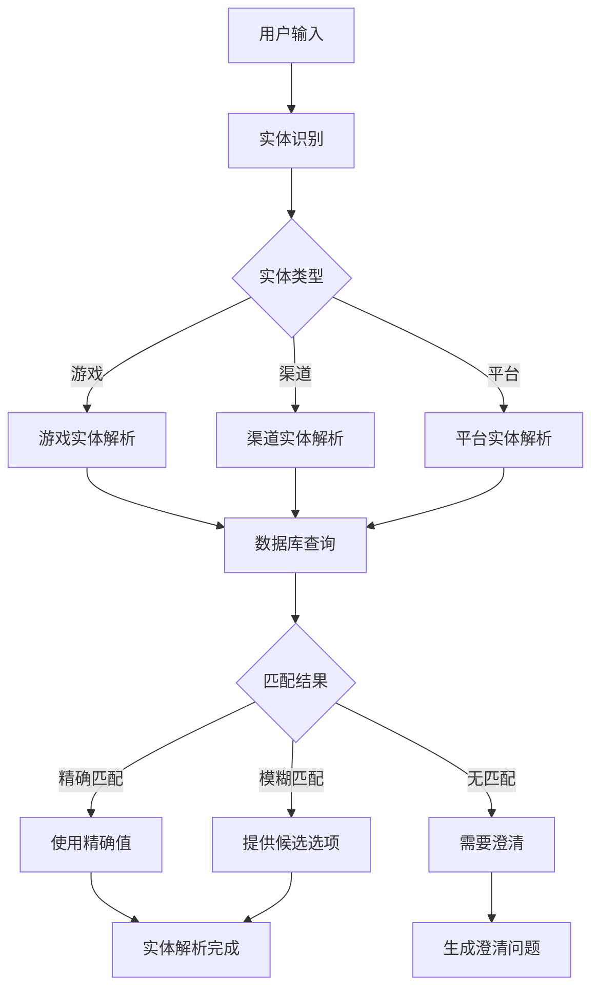
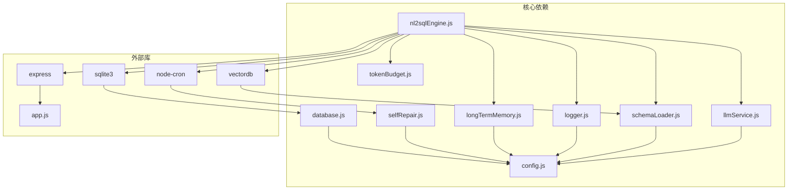

# 核心引擎模块

<cite>
**本文档引用的文件**
- [nl2sqlEngine.js](file://backend/src/core/nl2sqlEngine.js)
- [llmService.js](file://backend/src/core/llmService.js)
- [schemaLoader.js](file://backend/src/core/schemaLoader.js)
- [selfRepair.js](file://backend/src/core/selfRepair.js)
- [config.js](file://backend/src/core/config.js)
- [logger.js](file://backend/src/utils/logger.js)
- [tokenBudget.js](file://backend/src/utils/tokenBudget.js)
- [longTermMemory.js](file://backend/src/memory/longTermMemory.js)
- [package.json](file://backend/package.json)
- [schema-metadata.example.json](file://backend/config/schema-metadata.example.json)
</cite>

## 目录
1. [项目概述](#项目概述)
2. [项目结构](#项目结构)
3. [核心组件](#核心组件)
4. [架构概览](#架构概览)
5. [详细组件分析](#详细组件分析)
6. [依赖关系分析](#依赖关系分析)
7. [性能考虑](#性能考虑)
8. [故障排除指南](#故障排除指南)
9. [结论](#结论)

## 项目概述

NL2SQL 核心引擎模块是一个完整的自然语言到 SQL 转换系统，实现了从用户自然语言查询到标准 SQL 语句的自动化转换。该系统集成了先进的 LLM 服务、智能 Schema 管理、实体解析、SQL 验证和结果格式化等功能。

### 主要特性

- **意图识别算法**：基于 LLM 的智能查询理解，支持上下文融合和长期记忆
- **实体解析机制**：自动识别和解析游戏名称、渠道名称等业务实体
- **SQL 生成流程**：完整的 SQL 生成、验证和执行管道
- **LLM 服务集成**：支持多种 AI 模型，包括 OpenAI、DeepSeek 等兼容服务
- **Schema 管理**：动态 Schema 加载、验证和智能匹配
- **自修复调度器**：定时维护和健康检查功能

## 项目结构



**图表来源**
- [nl2sqlEngine.js:1-50](file://backend/src/core/nl2sqlEngine.js#L1-50)
- [llmService.js:1-50](file://backend/src/core/llmService.js#L1-50)
- [schemaLoader.js:1-50](file://backend/src/core/schemaLoader.js#L1-50)
- [selfRepair.js:1-50](file://backend/src/core/selfRepair.js#L1-50)

**章节来源**
- [package.json:1-28](file://backend/package.json#L1-28)
- [config.js:1-100](file://backend/src/core/config.js#L1-100)

## 核心组件

### NL2SQL 引擎核心模块

NL2SQL 引擎是整个系统的核心，负责协调各个组件完成自然语言到 SQL 的转换。主要功能包括：

- **查询处理流程**：完整的 NL2SQL 处理管道
- **意图识别**：基于 LLM 的智能查询理解
- **实体解析**：业务实体的自动识别和映射
- **SQL 生成**：智能 SQL 语句生成
- **错误处理**：统一的错误管理和恢复机制

### LLM 服务模块

LLM 服务模块提供了与外部 AI 模型的统一接口，支持多种模型提供商：

- **HTTP 请求封装**：底层 HTTP 通信处理
- **重试机制**：自动重试和错误恢复
- **流式响应**：支持流式 API 响应
- **工具调用**：支持函数调用能力

### Schema 加载模块

Schema 加载模块负责管理数据库表结构信息：

- **动态加载**：从 JSON 配置文件动态加载 Schema
- **智能匹配**：基于语义的表和字段匹配
- **缓存管理**：Schema 信息的缓存和失效
- **验证机制**：SQL 语句的安全性验证

### 自修复调度器

自修复调度器提供系统维护和监控功能：

- **定时任务**：多种周期性的维护任务
- **健康检查**：系统状态监控和诊断
- **会话管理**：过期会话的清理
- **统计收集**：系统运行数据的收集

**章节来源**
- [nl2sqlEngine.js:1-100](file://backend/src/core/nl2sqlEngine.js#L1-100)
- [llmService.js:1-100](file://backend/src/core/llmService.js#L1-100)
- [schemaLoader.js:1-100](file://backend/src/core/schemaLoader.js#L1-100)
- [selfRepair.js:1-100](file://backend/src/core/selfRepair.js#L1-100)

## 架构概览



**图表来源**
- [nl2sqlEngine.js:1878-2436](file://backend/src/core/nl2sqlEngine.js#L1878-2436)
- [llmService.js:222-299](file://backend/src/core/llmService.js#L222-299)
- [schemaLoader.js:727-763](file://backend/src/core/schemaLoader.js#L727-763)

## 详细组件分析

### NL2SQL 引擎主流程

NL2SQL 引擎实现了完整的查询处理管道，包含九个主要步骤：

#### 1. 会话历史加载
系统首先加载用户的会话历史，用于上下文理解。历史记录会根据长度进行智能压缩。

#### 2. Token 预算检查
使用 Token 预算模块检查上下文的 Token 使用情况，确保不会超出模型的上下文窗口限制。

#### 3. 意图识别
调用 LLM 服务进行智能查询理解，提取指标、维度、筛选条件等关键信息。

#### 4. 实体解析
自动识别和解析业务实体，如游戏名称、渠道名称等，转换为对应的数据库标识。

#### 5. SQL 生成
基于意图分析和 Schema 信息生成标准 SQL 语句。

#### 6. SQL 验证
验证生成的 SQL 语句的安全性和语法正确性。

#### 7. 查询执行
连接实际数据源执行 SQL 查询。

#### 8. 结果格式化
将查询结果转换为自然语言描述。

#### 9. 长期记忆存储
提取和存储用户的偏好信息，用于后续查询优化。



**图表来源**
- [nl2sqlEngine.js:1878-2436](file://backend/src/core/nl2sqlEngine.js#L1878-2436)
- [tokenBudget.js:115-181](file://backend/src/utils/tokenBudget.js#L115-181)

**章节来源**
- [nl2sqlEngine.js:1878-2436](file://backend/src/core/nl2sqlEngine.js#L1878-2436)

### LLM 服务集成

LLM 服务模块提供了统一的 AI 模型接口，支持多种模型提供商：

#### HTTP 请求处理
- **底层封装**：使用 Node.js 内置的 http/https 模块
- **JSON 序列化**：自动处理请求和响应的 JSON 格式
- **超时控制**：可配置的请求超时机制
- **错误处理**：完善的错误捕获和处理

#### 重试机制
- **指数退避**：支持多次重试，每次重试间隔递增
- **最大重试次数**：可配置的最大重试次数
- **错误分类**：区分可重试和不可重试错误

#### 模型配置
- **多模型支持**：支持 OpenAI、DeepSeek、Azure OpenAI 等
- **API 密钥管理**：安全的 API 密钥存储和使用
- **超时配置**：可配置的请求超时时间



**图表来源**
- [llmService.js:41-152](file://backend/src/core/llmService.js#L41-152)
- [llmService.js:167-195](file://backend/src/core/llmService.js#L167-195)

**章节来源**
- [llmService.js:1-468](file://backend/src/core/llmService.js#L1-468)

### Schema 加载和验证

Schema 加载模块负责管理数据库表结构信息，提供智能的表和字段匹配功能：

#### Schema 加载流程
- **文件读取**：从 JSON 配置文件读取 Schema 定义
- **格式验证**：验证 Schema 数据的完整性和正确性
- **映射构建**：构建表名和字段名的快速查找映射
- **缓存管理**：支持 Schema 信息的缓存和失效

#### 智能匹配算法
- **语义搜索**：使用向量嵌入进行语义层面的表匹配
- **关键词匹配**：基于关键词的简单匹配算法
- **上下文增强**：根据查询上下文增强匹配准确性
- **优先级排序**：根据匹配质量进行结果排序

#### SQL 验证机制
- **关键字过滤**：阻止危险的 SQL 关键字
- **表白名单**：限制可访问的数据库表
- **语法检查**：基本的 SQL 语法和结构验证



**图表来源**
- [schemaLoader.js:69-122](file://backend/src/core/schemaLoader.js#L69-122)
- [schemaLoader.js:567-657](file://backend/src/core/schemaLoader.js#L567-657)
- [schemaLoader.js:727-763](file://backend/src/core/schemaLoader.js#L727-763)

**章节来源**
- [schemaLoader.js:1-1071](file://backend/src/core/schemaLoader.js#L1-1071)

### 实体解析机制

实体解析模块负责将自然语言中的业务实体转换为数据库中的具体标识：

#### 实体类型识别
- **游戏实体**：游戏名称到 game_id 的映射
- **渠道实体**：渠道名称到 channel_id 的映射
- **平台实体**：平台术语到数据库标识的映射

#### 解析策略
- **数据库查询**：通过模糊匹配查询数据库中的实体
- **长期记忆**：使用用户的历史偏好和学习记录
- **业务关键词**：基于预定义的业务关键词映射

#### 学习机制
- **即时学习**：在澄清过程中学习新的实体映射
- **偏好存储**：将用户的学习结果存储到长期记忆
- **智能提取**：使用 LLM 智能分析学习内容的价值



**图表来源**
- [nl2sqlEngine.js:229-283](file://backend/src/core/nl2sqlEngine.js#L229-283)
- [nl2sqlEngine.js:368-484](file://backend/src/core/nl2sqlEngine.js#L368-484)

**章节来源**
- [nl2sqlEngine.js:229-484](file://backend/src/core/nl2sqlEngine.js#L229-484)

### 自修复调度器

自修复调度器提供系统维护和监控功能，确保系统长期稳定运行：

#### 定时任务管理
- **每日自检**：每天凌晨执行系统健康检查
- **会话清理**：每30分钟清理过期会话
- **统计收集**：每5分钟收集系统运行统计
- **记忆维护**：每天凌晨执行长期记忆压缩

#### 健康检查功能
- **数据库连接**：检查数据库连接状态
- **向量数据库**：验证向量存储的完整性
- **查询统计**：分析查询成功率和性能
- **系统资源**：监控内存使用和系统负载

#### 维护操作
- **会话归档**：将过期会话标记为归档状态
- **内存压缩**：定期压缩和清理长期记忆
- **日志清理**：管理系统日志文件的大小和数量

```mermaid
gantt
title 自修复调度器任务计划
dateFormat X
axisFormat %H:%M
section 每日任务
每日自检 :每天 02:00, 1m
记忆维护 :每天 03:00, 1m
section 周期任务
会话清理 :00:00, 30m
统计收集 :00:00, 5m
section 手动触发
手动自检 :00:00, 1m
手动清理 :00:00, 1m
手动维护 :00:00, 1m
```

**图表来源**
- [selfRepair.js:60-125](file://backend/src/core/selfRepair.js#L60-125)
- [selfRepair.js:169-310](file://backend/src/core/selfRepair.js#L169-310)

**章节来源**
- [selfRepair.js:1-489](file://backend/src/core/selfRepair.js#L1-489)

## 依赖关系分析



**图表来源**
- [nl2sqlEngine.js:16-34](file://backend/src/core/nl2sqlEngine.js#L16-34)
- [package.json:10-23](file://backend/package.json#L10-23)

### 核心依赖关系

NL2SQL 引擎模块之间的依赖关系清晰明确：

- **nl2sqlEngine.js** 作为主入口，依赖所有核心模块
- **llmService.js** 提供 AI 模型服务接口
- **schemaLoader.js** 管理数据库 Schema 信息
- **logger.js** 提供统一的日志记录功能
- **tokenBudget.js** 管理上下文 Token 预算
- **longTermMemory.js** 处理用户长期记忆

### 外部依赖

系统使用的主要外部库：

- **Express.js**：Web 应用框架
- **SQLite3**：本地数据库存储
- **node-cron**：定时任务调度
- **vectordb**：向量数据库支持

**章节来源**
- [package.json:10-23](file://backend/package.json#L10-23)

## 性能考虑

### Token 预算管理

系统实现了智能的 Token 预算管理，防止 LLM 上下文窗口溢出：

- **估算算法**：基于字符数的 Token 估算（约 3.5 字符/Token）
- **预算配置**：可配置的最大上下文 Token 数和输出预留
- **自动压缩**：当接近阈值时自动压缩历史对话和检索片段
- **紧急处理**：超限时触发紧急压缩策略

### 缓存策略

- **Schema 缓存**：Schema 信息的缓存和失效管理
- **向量缓存**：向量嵌入结果的缓存
- **会话缓存**：近期会话数据的缓存

### 异步处理

- **查询向量存储**：异步存储查询向量，不阻塞响应
- **长期记忆存储**：异步提取和存储偏好信息
- **日志记录**：异步日志写入，避免阻塞主线程

### 优化建议

1. **模型选择**：根据查询复杂度选择合适的模型
2. **批量处理**：对相似查询进行批量处理
3. **连接池**：优化数据库连接池配置
4. **索引优化**：为常用查询字段建立数据库索引

## 故障排除指南

### 常见问题诊断

#### LLM API 连接问题
- **症状**：LLM API 调用失败，返回网络错误
- **原因**：API 密钥错误、网络连接问题、API 服务不可用
- **解决方案**：检查 API 密钥配置、网络连通性、API 服务状态

#### Schema 加载失败
- **症状**：Schema 文件加载失败，系统无法识别表结构
- **原因**：JSON 格式错误、文件路径配置错误、权限问题
- **解决方案**：验证 JSON 格式、检查文件路径、确认文件权限

#### SQL 生成错误
- **症状**：SQL 生成失败，返回需要澄清的信息
- **原因**：查询意图不明确、缺少必要信息、Schema 不完整
- **解决方案**：提供更详细的查询信息、检查 Schema 配置

#### 性能问题
- **症状**：查询响应缓慢、系统负载过高
- **原因**：Token 预算超限、数据库查询性能问题、内存泄漏
- **解决方案**：优化查询、调整配置、检查内存使用

### 调试工具

#### 日志追踪
系统提供了完整的日志追踪功能，可以追踪每个查询的完整处理流程：

```javascript
// 示例：开始追踪会话
logger.startTrace(traceId, 'NL2SQL查询处理', {
    sessionId,
    userId,
    query: userQuery
});

// 示例：记录追踪步骤
logger.traceStep(traceId, '意图识别', { 
    query: userQuery, 
    historyLength: recentHistory.length 
}, 'success');

// 示例：结束追踪
logger.endTrace(traceId, {
    type: 'result',
    sql: sqlResult.sql,
    rowCount: queryResult.data?.rowCount
});
```

#### 错误处理
系统实现了统一的错误处理机制：

```javascript
class NL2SQLError extends Error {
    constructor(type, message, details = {}, isRecoverable = false) {
        super(message);
        this.name = 'NL2SQLError';
        this.type = type;
        this.details = details;
        this.isRecoverable = isRecoverable;
        this.timestamp = new Date().toISOString();
    }
}
```

**章节来源**
- [logger.js:322-408](file://backend/src/utils/logger.js#L322-408)
- [nl2sqlEngine.js:145-215](file://backend/src/core/nl2sqlEngine.js#L145-215)

## 结论

NL2SQL 核心引擎模块是一个功能完整、架构清晰的自然语言到 SQL 转换系统。通过集成先进的 LLM 技术、智能的 Schema 管理和完善的错误处理机制，该系统能够高效准确地处理各种复杂的查询需求。

### 主要优势

1. **智能化程度高**：基于 LLM 的意图识别和实体解析
2. **扩展性强**：模块化设计，易于功能扩展和定制
3. **可靠性高**：完善的错误处理和自修复机制
4. **性能优化**：智能的 Token 预算管理和缓存策略
5. **可观测性好**：完整的日志追踪和监控功能

### 未来发展方向

1. **模型优化**：持续优化 LLM 模型的使用策略
2. **性能提升**：进一步优化查询处理性能
3. **功能扩展**：支持更多业务场景和查询类型
4. **用户体验**：改善用户交互和反馈机制

该系统为构建企业级的自然语言查询平台奠定了坚实的技术基础，具有良好的应用前景和发展潜力。