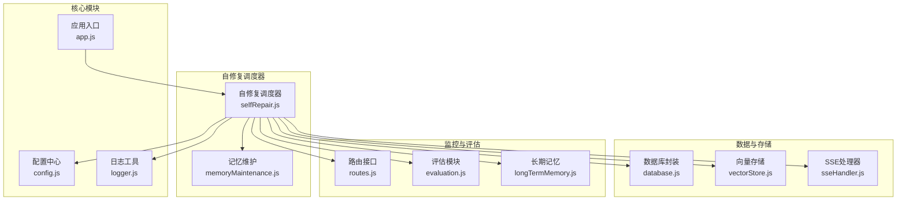
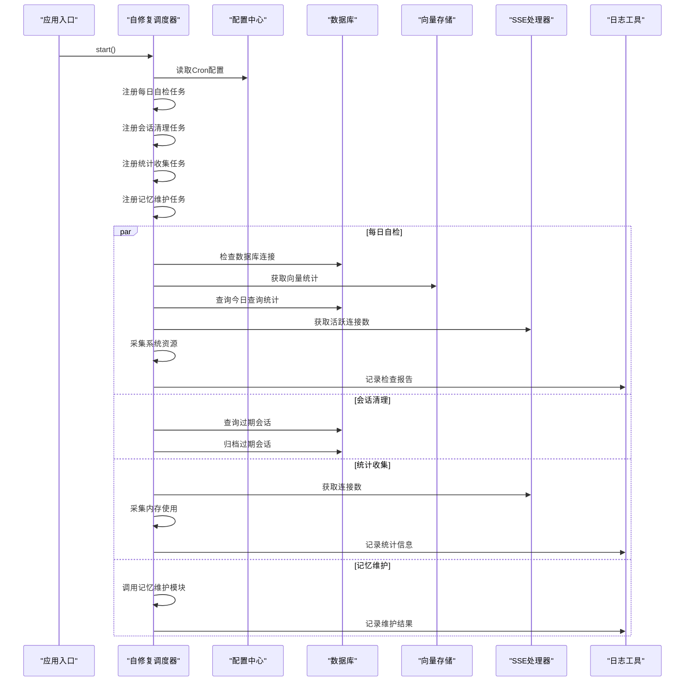
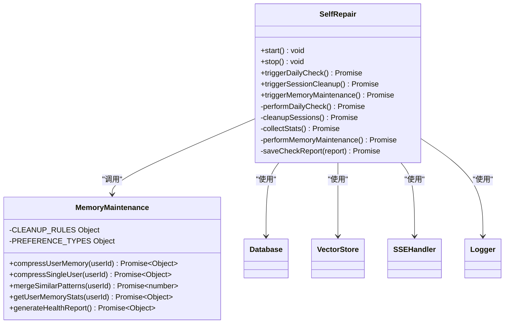
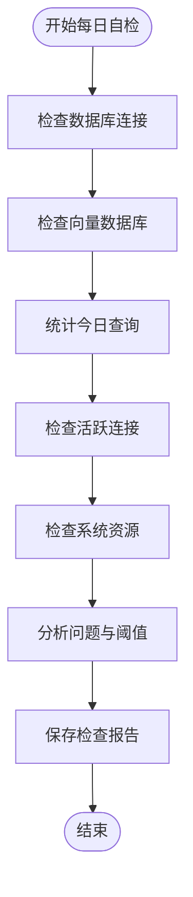
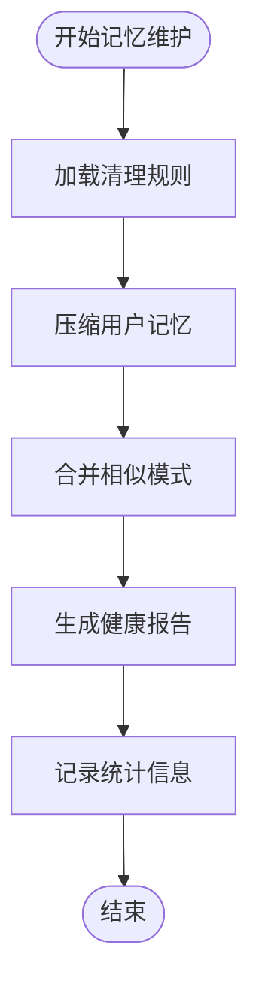
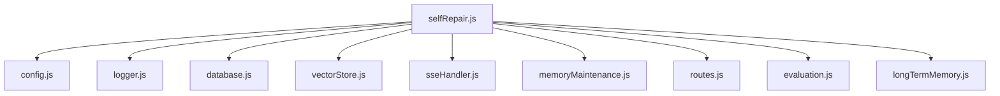

# 自修复调度器

<cite>
**本文档引用的文件**
- [selfRepair.js](file://backend/src/core/selfRepair.js)
- [memoryMaintenance.js](file://backend/src/memory/memoryMaintenance.js)
- [config.js](file://backend/src/core/config.js)
- [app.js](file://backend/src/app.js)
- [logger.js](file://backend/src/utils/logger.js)
- [database.js](file://backend/src/core/database.js)
- [vectorStore.js](file://backend/src/memory/vectorStore.js)
- [sseHandler.js](file://backend/src/core/sseHandler.js)
- [routes.js](file://backend/src/core/routes.js)
- [evaluation.js](file://backend/src/utils/evaluation.js)
- [longTermMemory.js](file://backend/src/memory/longTermMemory.js)
- [package.json](file://backend/package.json)
</cite>

## 目录
1. [简介](#简介)
2. [项目结构](#项目结构)
3. [核心组件](#核心组件)
4. [架构概览](#架构概览)
5. [详细组件分析](#详细组件分析)
6. [依赖分析](#依赖分析)
7. [性能考虑](#性能考虑)
8. [故障排查指南](#故障排查指南)
9. [结论](#结论)
10. [附录](#附录)

## 简介
本文件详细阐述NL2SQL项目中的自修复调度器设计与实现。该调度器负责系统级的定时维护任务，包括每日健康检查、会话清理、统计信息收集以及长期记忆维护。通过node-cron实现任务编排，结合配置驱动的Cron表达式、任务优先级管理和执行监控机制，确保系统在无人值守状态下仍能保持最佳运行状态。

## 项目结构
自修复调度器位于后端核心模块中，与配置管理、数据库、向量存储、SSE处理器等模块紧密协作。主要文件组织如下：
- 核心调度器：`backend/src/core/selfRepair.js`
- 记忆维护：`backend/src/memory/memoryMaintenance.js`
- 配置中心：`backend/src/core/config.js`
- 应用入口：`backend/src/app.js`
- 日志工具：`backend/src/utils/logger.js`
- 数据库封装：`backend/src/core/database.js`
- 向量存储：`backend/src/memory/vectorStore.js`
- SSE处理器：`backend/src/core/sseHandler.js`
- 路由接口：`backend/src/core/routes.js`
- 评估模块：`backend/src/utils/evaluation.js`
- 长期记忆：`backend/src/memory/longTermMemory.js`
- 依赖清单：`backend/package.json`

**图表来源**
- [app.js:1-238](file://backend/src/app.js#L1-L238)
- [selfRepair.js:1-489](file://backend/src/core/selfRepair.js#L1-L489)
- [config.js:1-398](file://backend/src/core/config.js#L1-L398)

**章节来源**
- [app.js:1-238](file://backend/src/app.js#L1-L238)
- [package.json:1-28](file://backend/package.json#L1-L28)

## 核心组件
自修复调度器由以下核心组件构成：
- **任务注册与生命周期管理**：启动/停止定时任务，管理任务引用
- **每日健康检查**：数据库连接、向量数据库、查询统计、连接数、系统资源
- **会话清理**：过期会话归档
- **统计收集**：连接数与内存使用统计
- **记忆维护**：长期记忆压缩与清理、相似模式合并、健康报告
- **配置驱动**：Cron表达式、慢查询阈值、会话过期时间等

关键实现要点：
- 使用node-cron进行任务调度，支持Cron表达式与任务名称
- 通过配置中心统一管理任务间隔与阈值
- 采用结构化日志记录，便于监控与故障排查
- 任务间解耦，支持手动触发与独立执行

**章节来源**
- [selfRepair.js:56-159](file://backend/src/core/selfRepair.js#L56-L159)
- [config.js:222-231](file://backend/src/core/config.js#L222-L231)

## 架构概览
自修复调度器采用模块化架构，通过依赖注入与事件驱动实现松耦合：
- **启动流程**：应用启动时初始化数据库、向量存储、Schema加载，随后启动自修复调度器
- **任务编排**：每个任务独立封装，通过配置中心读取Cron表达式
- **监控集成**：健康检查结果写入系统日志表，SSE连接数用于连接健康监控
- **数据一致性**：使用数据库事务保证关键操作的原子性

**图表来源**
- [selfRepair.js:60-125](file://backend/src/core/selfRepair.js#L60-L125)
- [selfRepair.js:169-310](file://backend/src/core/selfRepair.js#L169-L310)
- [selfRepair.js:341-373](file://backend/src/core/selfRepair.js#L341-L373)
- [selfRepair.js:425-445](file://backend/src/core/selfRepair.js#L425-L445)
- [selfRepair.js:383-415](file://backend/src/core/selfRepair.js#L383-L415)

**章节来源**
- [app.js:138-142](file://backend/src/app.js#L138-L142)
- [selfRepair.js:1-489](file://backend/src/core/selfRepair.js#L1-L489)

## 详细组件分析

### 自修复调度器核心功能
自修复调度器提供四个核心维护任务：
- **每日自检**：综合健康检查，生成检查报告并保存至系统日志表
- **会话清理**：定期清理过期会话，避免资源浪费
- **统计收集**：周期性收集系统运行统计，用于监控
- **记忆维护**：压缩长期记忆，清理过期偏好，生成健康报告

**图表来源**
- [selfRepair.js:480-489](file://backend/src/core/selfRepair.js#L480-L489)
- [memoryMaintenance.js:401-415](file://backend/src/memory/memoryMaintenance.js#L401-L415)

**章节来源**
- [selfRepair.js:56-159](file://backend/src/core/selfRepair.js#L56-L159)
- [memoryMaintenance.js:69-120](file://backend/src/memory/memoryMaintenance.js#L69-L120)

### 每日自检任务
每日自检涵盖五个维度的健康检查：
- **数据库连接**：执行简单查询验证连接可用性
- **向量数据库**：获取向量统计信息，检查初始化状态
- **查询统计**：统计当日查询总数、成功率、平均执行时间
- **活跃连接**：通过SSE处理器获取当前连接数
- **系统资源**：采集内存使用与进程运行时间

检查结果包含问题列表与建议操作，并将完整报告保存到系统日志表中。

**图表来源**
- [selfRepair.js:169-310](file://backend/src/core/selfRepair.js#L169-L310)

**章节来源**
- [selfRepair.js:169-310](file://backend/src/core/selfRepair.js#L169-L310)

### 会话清理任务
会话清理基于配置的过期时间阈值，定期查找并归档过期会话：
- 计算过期时间戳：当前时间减去会话过期时间
- 查询状态为active且更新时间早于过期时间的会话
- 将匹配的会话标记为archived状态
- 记录清理数量与执行结果

该任务每30分钟执行一次，避免会话数据无限增长。

**章节来源**
- [selfRepair.js:341-373](file://backend/src/core/selfRepair.js#L341-L373)
- [config.js:179-186](file://backend/src/core/config.js#L179-L186)

### 统计收集任务
统计收集任务每5分钟执行一次，记录系统运行时的关键指标：
- **活跃连接数**：通过SSE处理器获取当前连接数
- **内存使用**：采集heapUsed与heapTotal（MB）
- **日志级别**：使用debug级别避免产生过多日志

该任务主要用于监控系统负载与资源使用情况。

**章节来源**
- [selfRepair.js:425-445](file://backend/src/core/selfRepair.js#L425-L445)

### 记忆维护任务
记忆维护任务每天凌晨3点执行，负责长期记忆的压缩与清理：
- **压缩用户记忆**：按使用频率分级清理过期偏好
- **相似模式合并**：合并高度相似的查询模式
- **健康报告生成**：统计总体偏好数量、类型分布与预估清理量

记忆维护采用分级保留策略：
- 高频偏好（≥10次）：永久保留
- 中频偏好（3-9次）：90天未用清理
- 低频偏好（<3次）：30天未用清理
- 字段别名：365天未用清理

**图表来源**
- [memoryMaintenance.js:69-120](file://backend/src/memory/memoryMaintenance.js#L69-L120)
- [memoryMaintenance.js:201-245](file://backend/src/memory/memoryMaintenance.js#L201-L245)
- [memoryMaintenance.js:355-395](file://backend/src/memory/memoryMaintenance.js#L355-L395)

**章节来源**
- [memoryMaintenance.js:69-120](file://backend/src/memory/memoryMaintenance.js#L69-L120)
- [memoryMaintenance.js:201-245](file://backend/src/memory/memoryMaintenance.js#L201-L245)
- [memoryMaintenance.js:355-395](file://backend/src/memory/memoryMaintenance.js#L355-L395)

### Cron作业配置与任务优先级
自修复调度器通过配置中心统一管理Cron表达式：
- **每日自检**：默认每天凌晨2点执行，可通过配置修改
- **会话清理**：固定每30分钟执行
- **统计收集**：固定每5分钟执行
- **记忆维护**：固定每天凌晨3点执行

任务优先级管理：
- 任务按重要性分为：健康检查（高）、会话清理（中）、统计收集（低）、记忆维护（中）
- 通过配置项控制慢查询阈值、会话过期时间等关键参数

**章节来源**
- [config.js:222-231](file://backend/src/core/config.js#L222-L231)
- [selfRepair.js:73-121](file://backend/src/core/selfRepair.js#L73-L121)

### 执行监控机制
自修复调度器具备完善的监控与日志记录机制：
- **结构化日志**：使用统一的日志工具记录任务执行状态
- **检查报告**：每日自检结果保存到系统日志表，便于历史追踪
- **统计指标**：连接数、内存使用等关键指标定期记录
- **错误处理**：每个任务都有独立的try-catch处理，避免相互影响

**章节来源**
- [selfRepair.js:317-331](file://backend/src/core/selfRepair.js#L317-L331)
- [logger.js:233-310](file://backend/src/utils/logger.js#L233-L310)

## 依赖分析
自修复调度器依赖关系清晰，模块间职责明确：
- **直接依赖**：配置中心、日志工具、数据库、向量存储、SSE处理器
- **间接依赖**：长期记忆模块、评估模块、路由接口
- **外部依赖**：node-cron（任务调度）、sqlite3（数据库）、vectordb（向量存储）

**图表来源**
- [selfRepair.js:15-26](file://backend/src/core/selfRepair.js#L15-L26)
- [package.json:19](file://backend/package.json#L19)

**章节来源**
- [package.json:10-19](file://backend/package.json#L10-L19)

## 性能考虑
自修复调度器在设计时充分考虑了性能影响：
- **任务隔离**：各任务独立执行，避免相互阻塞
- **数据库优化**：使用参数化查询与索引，减少查询开销
- **内存管理**：定期清理过期会话与记忆，控制内存占用
- **日志优化**：统计收集使用较低日志级别，避免日志风暴
- **向量存储**：通过智能搜索与过滤减少不必要的计算

## 故障排查指南
常见问题与解决方案：
- **任务未执行**：检查配置中心的enabled开关与Cron表达式
- **数据库连接失败**：查看每日自检报告中的数据库检查结果
- **向量存储异常**：确认LanceDB初始化状态与数据目录权限
- **内存使用过高**：关注每日自检中的内存使用率与慢查询阈值
- **会话清理无效**：检查会话过期时间配置与清理间隔

**章节来源**
- [selfRepair.js:305-307](file://backend/src/core/selfRepair.js#L305-L307)
- [logger.js:299-309](file://backend/src/utils/logger.js#L299-L309)

## 结论
自修复调度器通过模块化设计与配置驱动实现了系统级的自动化维护。其四大核心任务覆盖了数据清理、缓存刷新、内存回收与系统健康检查等关键领域，配合完善的监控与日志机制，确保NL2SQL系统能够在无人值守状态下保持稳定高效运行。通过合理的Cron配置与优先级管理，调度器在保证系统健康的同时，最大限度地减少了对业务的影响。

## 附录

### 配置示例
自修复调度器的关键配置项：
- **selfRepair.enabled**：启用/禁用自修复功能
- **selfRepair.dailyCheckCron**：每日自检Cron表达式（默认每日凌晨2点）
- **selfRepair.sessionCheckInterval**：会话健康检查间隔（毫秒）
- **selfRepair.slowQueryThreshold**：慢查询阈值（毫秒）

**章节来源**
- [config.js:222-231](file://backend/src/core/config.js#L222-L231)

### 任务触发方式
- **自动触发**：应用启动时自动注册并按Cron计划执行
- **手动触发**：提供triggerDailyCheck、triggerSessionCleanup、triggerMemoryMaintenance三个手动触发接口
- **监控触发**：通过路由接口获取系统健康状态与统计信息

**章节来源**
- [selfRepair.js:455-474](file://backend/src/core/selfRepair.js#L455-L474)
- [routes.js:72-137](file://backend/src/core/routes.js#L72-L137)