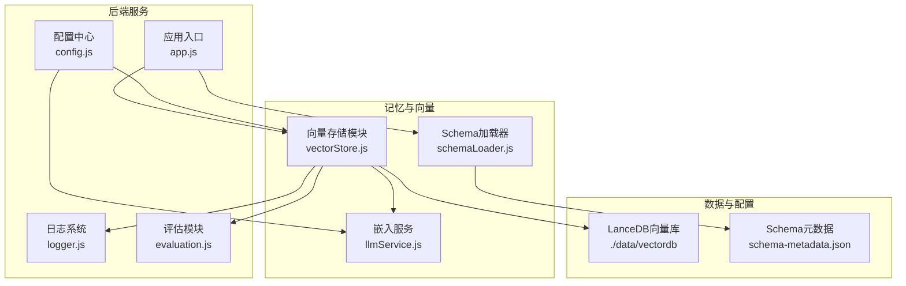
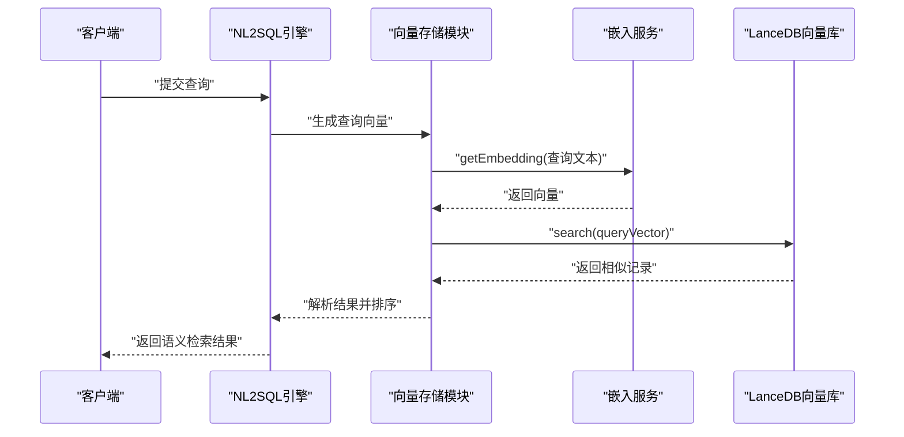
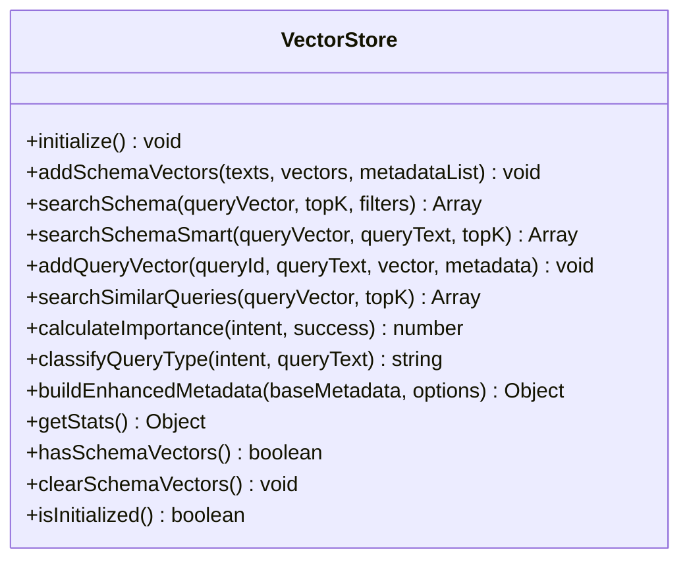
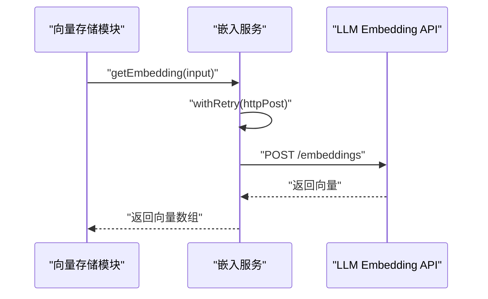
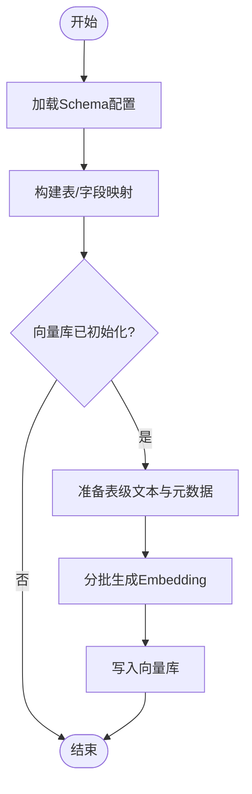
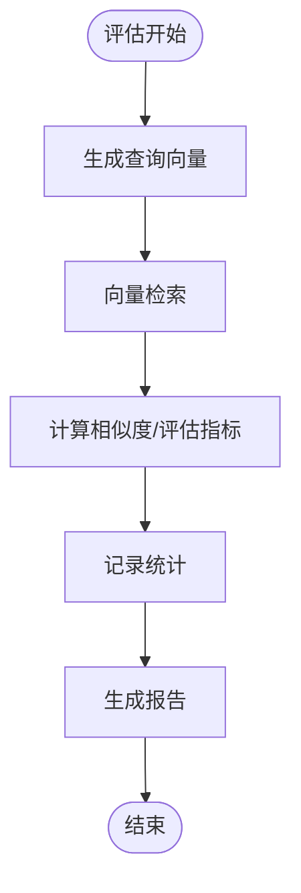
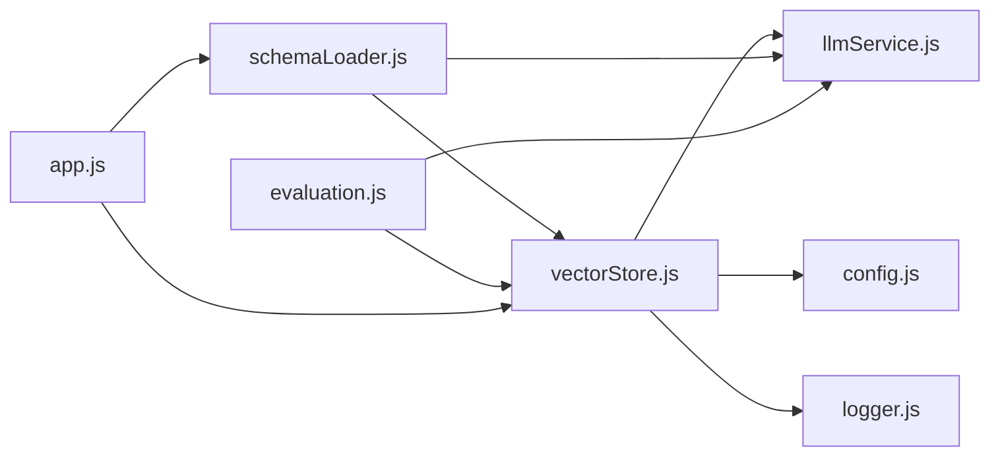

# 向量存储系统

<cite>
**本文档引用的文件**
- [vectorStore.js](file://backend/src/memory/vectorStore.js)
- [llmService.js](file://backend/src/core/llmService.js)
- [config.js](file://backend/src/core/config.js)
- [logger.js](file://backend/src/utils/logger.js)
- [evaluation.js](file://backend/src/utils/evaluation.js)
- [schemaLoader.js](file://backend/src/core/schemaLoader.js)
- [app.js](file://backend/src/app.js)
- [schema-metadata.json](file://backend/config/schema-metadata.json)
- [package.json](file://backend/package.json)
</cite>

## 目录
1. [简介](#简介)
2. [项目结构](#项目结构)
3. [核心组件](#核心组件)
4. [架构概览](#架构概览)
5. [详细组件分析](#详细组件分析)
6. [依赖分析](#依赖分析)
7. [性能考虑](#性能考虑)
8. [故障排查指南](#故障排查指南)
9. [结论](#结论)
10. [附录](#附录)

## 简介
本文件系统性阐述NL2SQL项目中的向量存储系统，重点说明基于LanceDB的向量数据库在记忆系统中的作用与实现原理。内容涵盖嵌入向量的生成、存储与检索机制，LanceDB的集成方式（数据格式、索引策略与查询优化），语义相似度计算与排序，数据模型（向量维度、元数据管理、版本控制），以及性能优化策略（批量操作、缓存与并发控制）。文档旨在帮助开发者与运维人员全面理解并高效使用该向量存储子系统。

## 项目结构
向量存储系统位于后端工程的memory模块中，围绕向量数据库（LanceDB）与嵌入服务（LLM Embedding）协同工作，支撑Schema向量与查询历史向量的存储与检索。

**图表来源**
- [app.js:97-166](file://backend/src/app.js#L97-L166)
- [vectorStore.js:231-261](file://backend/src/memory/vectorStore.js#L231-L261)
- [schemaLoader.js:69-122](file://backend/src/core/schemaLoader.js#L69-L122)
- [llmService.js:360-415](file://backend/src/core/llmService.js#L360-L415)
- [config.js:106-109](file://backend/src/core/config.js#L106-L109)

**章节来源**
- [app.js:97-166](file://backend/src/app.js#L97-L166)
- [vectorStore.js:231-261](file://backend/src/memory/vectorStore.js#L231-L261)
- [schemaLoader.js:69-122](file://backend/src/core/schemaLoader.js#L69-L122)
- [llmService.js:360-415](file://backend/src/core/llmService.js#L360-L415)
- [config.js:106-109](file://backend/src/core/config.js#L106-L109)

## 核心组件
- 向量存储模块（vectorStore.js）
  - 负责LanceDB连接、表初始化、Schema向量与查询历史向量的增删改查、智能搜索与统计。
- 嵌入服务（llmService.js）
  - 提供Embedding向量生成接口，封装HTTP请求、重试与错误处理。
- 配置中心（config.js）
  - 统一管理LLM API、Embedding模型、向量数据库路径、日志级别等。
- 评估模块（evaluation.js）
  - 提供向量化质量评估、相似度计算与运行时统计。
- Schema加载器（schemaLoader.js）
  - 负责加载Schema元数据、构建表级向量文本、调用向量存储模块写入向量。
- 应用入口（app.js）
  - 初始化数据库、向量库、Schema加载器与自修复调度器。

**章节来源**
- [vectorStore.js:231-261](file://backend/src/memory/vectorStore.js#L231-L261)
- [llmService.js:360-415](file://backend/src/core/llmService.js#L360-L415)
- [config.js:60-109](file://backend/src/core/config.js#L60-L109)
- [evaluation.js:158-266](file://backend/src/utils/evaluation.js#L158-L266)
- [schemaLoader.js:201-281](file://backend/src/core/schemaLoader.js#L201-L281)
- [app.js:118-127](file://backend/src/app.js#L118-L127)

## 架构概览
向量存储系统采用“嵌入服务 + 向量数据库”的双层架构：
- 嵌入服务：负责将文本转换为固定维度的向量。
- 向量数据库：负责持久化向量、元数据与提供语义检索能力。
- 应用层：通过向量存储模块统一调用嵌入服务与向量数据库，提供Schema向量与查询历史向量的管理与检索。

**图表来源**
- [vectorStore.js:378-435](file://backend/src/memory/vectorStore.js#L378-L435)
- [llmService.js:360-415](file://backend/src/core/llmService.js#L360-L415)
- [schemaLoader.js:592-657](file://backend/src/core/schemaLoader.js#L592-L657)

## 详细组件分析

### 向量存储模块（vectorStore.js）
- 初始化与连接
  - 通过配置中心读取向量数据库路径，连接LanceDB并创建/打开schema_vectors与query_vectors表。
- Schema向量操作
  - addSchemaVectors：批量写入表级向量，包含文本、向量、元数据与时间戳。
  - searchSchema：基于向量相似度检索，支持元数据过滤（应用层过滤）。
  - searchSchemaSmart：智能搜索，结合查询意图与业务规则进行重排序。
- 查询历史向量操作
  - addQueryVector：写入用户查询向量与元数据。
  - searchSimilarQueries：检索相似查询，用于上下文学习与复用。
- 元数据增强
  - calculateImportance：综合意图复杂度、成功状态、置信度等计算重要性评分。
  - classifyQueryType：基于查询文本与意图分类查询类型。
  - buildEnhancedMetadata：构建增强元数据，包含时间戳、重要性、复杂度、执行信息与意图摘要。
- 统计与状态
  - getStats：获取表统计信息（排除初始化记录）。
  - hasSchemaVectors/clearSchemaVectors：检查与清理Schema向量表。
- 错误处理与日志
  - 所有操作均包含错误捕获与日志记录，保证系统可观测性。

**图表来源**
- [vectorStore.js:231-759](file://backend/src/memory/vectorStore.js#L231-L759)

**章节来源**
- [vectorStore.js:231-759](file://backend/src/memory/vectorStore.js#L231-L759)

### 嵌入服务（llmService.js）
- Embedding生成
  - getEmbedding：支持单文本与批量文本，调用LLM Embedding API，自动重试与超时控制。
- HTTP请求与重试
  - withRetry：统一的重试包装，支持最大重试次数与延迟。
  - httpPost：底层HTTP POST封装，支持流式响应与错误解析。
- 配置与日志
  - 从配置中心读取模型、维度、超时等参数，记录请求耗时与响应摘要。

**图表来源**
- [llmService.js:360-415](file://backend/src/core/llmService.js#L360-L415)
- [config.js:80-87](file://backend/src/core/config.js#L80-L87)

**章节来源**
- [llmService.js:360-415](file://backend/src/core/llmService.js#L360-L415)
- [config.js:80-87](file://backend/src/core/config.js#L80-L87)

### Schema加载器（schemaLoader.js）
- Schema加载与校验
  - load：从JSON配置文件加载Schema，构建表与字段映射，记录缓存时间戳。
- 向量化流程（表级）
  - vectorizeSchema：将每个表生成一个向量，文本包含域标签、类型、功能与核心特征词，元数据包含scope与data_type。
  - buildTableRepresentation：构建表级表征文本与元数据。
  - extractKeyFeatures：提取强动作特征词，提升检索区分度。
- 智能表检索
  - searchRelevantTables：结合上下文（game_id、datasource）增强查询，优先匹配对应数据源或平台类型的表。

**图表来源**
- [schemaLoader.js:69-122](file://backend/src/core/schemaLoader.js#L69-L122)
- [schemaLoader.js:201-281](file://backend/src/core/schemaLoader.js#L201-L281)

**章节来源**
- [schemaLoader.js:69-122](file://backend/src/core/schemaLoader.js#L69-L122)
- [schemaLoader.js:201-281](file://backend/src/core/schemaLoader.js#L201-L281)
- [schema-metadata.json:1-800](file://backend/config/schema-metadata.json#L1-L800)

### 评估模块（evaluation.js）
- 向量化质量评估
  - evaluateSchemaVectorQuality：对表级向量检索进行精度、召回与F1评估。
  - evaluateQueryVectorQuality：对查询历史向量相似度进行余弦相似度计算与误差统计。
  - calculateCosineSimilarity：余弦相似度计算。
- 运行时统计
  - recordVectorSearch：记录向量检索统计与距离分布。
  - getVectorSearchStats/getLongTermMemoryStats：查询统计结果。

**图表来源**
- [evaluation.js:158-266](file://backend/src/utils/evaluation.js#L158-L266)
- [evaluation.js:276-334](file://backend/src/utils/evaluation.js#L276-L334)

**章节来源**
- [evaluation.js:158-266](file://backend/src/utils/evaluation.js#L158-L266)
- [evaluation.js:276-334](file://backend/src/utils/evaluation.js#L276-L334)

## 依赖分析
- 外部依赖
  - LanceDB（vectordb）：向量数据库客户端，提供表创建、向量插入与相似度搜索。
  - Node.js内置模块：fs、path、http/https、URL等。
- 内部模块耦合
  - vectorStore依赖llmService进行向量生成，依赖config进行路径与维度配置，依赖logger进行日志记录。
  - schemaLoader依赖vectorStore写入向量，依赖llmService生成Embedding。
  - evaluation依赖vectorStore与llmService进行质量评估。

**图表来源**
- [vectorStore.js:14-21](file://backend/src/memory/vectorStore.js#L14-L21)
- [schemaLoader.js:23-26](file://backend/src/core/schemaLoader.js#L23-L26)
- [evaluation.js:12-13](file://backend/src/utils/evaluation.js#L12-L13)
- [app.js:40-50](file://backend/src/app.js#L40-L50)

**章节来源**
- [package.json:10-20](file://backend/package.json#L10-L20)
- [vectorStore.js:14-21](file://backend/src/memory/vectorStore.js#L14-L21)
- [schemaLoader.js:23-26](file://backend/src/core/schemaLoader.js#L23-L26)
- [evaluation.js:12-13](file://backend/src/utils/evaluation.js#L12-L13)
- [app.js:40-50](file://backend/src/app.js#L40-L50)

## 性能考虑
- 向量生成与批量处理
  - 分批获取Embedding：schemaLoader按批次调用llmService.getEmbedding，避免单次请求过大。
  - 批量写入：vectorStore.addSchemaVectors与addQueryVector支持批量插入，减少I/O开销。
- 索引与查询优化
  - 智能搜索：searchSchemaSmart结合业务规则与查询意图进行重排序，提升Top-K命中质量。
  - 元数据过滤：通过元数据标签（scope、data_type）缩小搜索空间，减少无效匹配。
- 缓存与并发控制
  - 日志缓存：logger模块支持文件轮转与控制台输出，避免频繁磁盘IO。
  - 重试机制：llmService.withRetry提供指数退避与最大重试次数，提升API调用稳定性。
- 资源管理
  - 连接池：数据库连接池配置（config.js）与向量库文件系统管理（LanceDB目录结构）共同保障资源利用率。
  - 优雅关闭：app.js中对HTTP服务器、SSE连接、定时任务与数据库连接进行有序关闭。

**章节来源**
- [schemaLoader.js:246-261](file://backend/src/core/schemaLoader.js#L246-L261)
- [vectorStore.js:336-367](file://backend/src/memory/vectorStore.js#L336-L367)
- [llmService.js:167-195](file://backend/src/core/llmService.js#L167-L195)
- [config.js:97-130](file://backend/src/core/config.js#L97-L130)
- [app.js:176-212](file://backend/src/app.js#L176-L212)

## 故障排查指南
- 向量库初始化失败
  - 现象：向量数据库未初始化，语义搜索功能不可用。
  - 排查：检查vectorDb.path配置与目录权限；查看初始化日志与错误信息。
  - 参考：[vectorStore.js:231-261](file://backend/src/memory/vectorStore.js#L231-L261)
- 向量生成失败
  - 现象：Embedding API调用失败或超时。
  - 排查：检查LLM API密钥、API Base、超时设置；查看重试日志与响应解析错误。
  - 参考：[llmService.js:360-415](file://backend/src/core/llmService.js#L360-L415)
- 检索结果为空或质量差
  - 现象：searchSchema/searchSimilarQueries返回空或相关性低。
  - 排查：确认向量库中是否存在有效向量（hasSchemaVectors）、是否启用智能搜索（searchSchemaSmart）、元数据过滤条件是否合理。
  - 参考：[vectorStore.js:378-435](file://backend/src/memory/vectorStore.js#L378-L435)
- 评估指标异常
  - 现象：向量化质量评估结果不达标。
  - 排查：检查Embedding维度一致性、文本预处理质量、元数据标签完整性。
  - 参考：[evaluation.js:158-266](file://backend/src/utils/evaluation.js#L158-L266)

**章节来源**
- [vectorStore.js:231-261](file://backend/src/memory/vectorStore.js#L231-L261)
- [llmService.js:360-415](file://backend/src/core/llmService.js#L360-L415)
- [evaluation.js:158-266](file://backend/src/utils/evaluation.js#L158-L266)

## 结论
本向量存储系统通过LanceDB与LLM Embedding的有机结合，实现了Schema与查询历史的语义检索能力。系统具备完善的初始化流程、元数据增强、智能搜索与评估统计机制，并在性能与可靠性方面提供了批量处理、重试与缓存等优化策略。建议在生产环境中持续关注向量维度、元数据标签与检索策略的调优，以获得更佳的检索质量与性能表现。

## 附录

### 数据模型与配置参数
- 数据模型
  - 表结构：schema_vectors与query_vectors，包含id、text、vector、metadata、created_at等字段。
  - 元数据：包含类型、名称、中文名、域标签（scope）、数据类型（data_type）、核心特征词等。
- 配置参数
  - 向量数据库路径：vectorDb.path（默认 ./data/vectordb）
  - Embedding模型与维度：embedding.model/dimension（默认 text-embedding-3-small/1536）
  - 日志级别与文件：log.level/log.file
  - 安全与限制：security.maxQueryRows/queryTimeout等

**章节来源**
- [vectorStore.js:267-322](file://backend/src/memory/vectorStore.js#L267-L322)
- [config.js:106-109](file://backend/src/core/config.js#L106-L109)
- [config.js:80-87](file://backend/src/core/config.js#L80-L87)
- [config.js:195-213](file://backend/src/core/config.js#L195-L213)