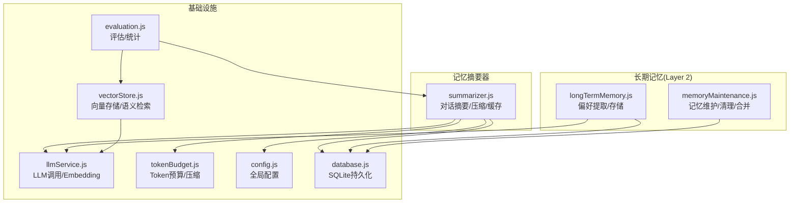
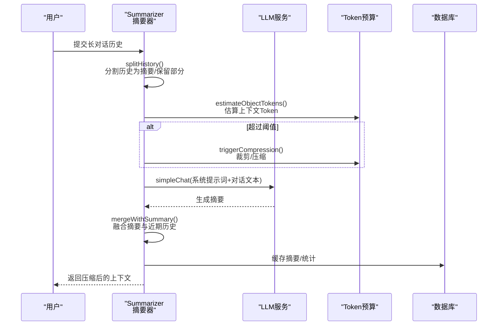
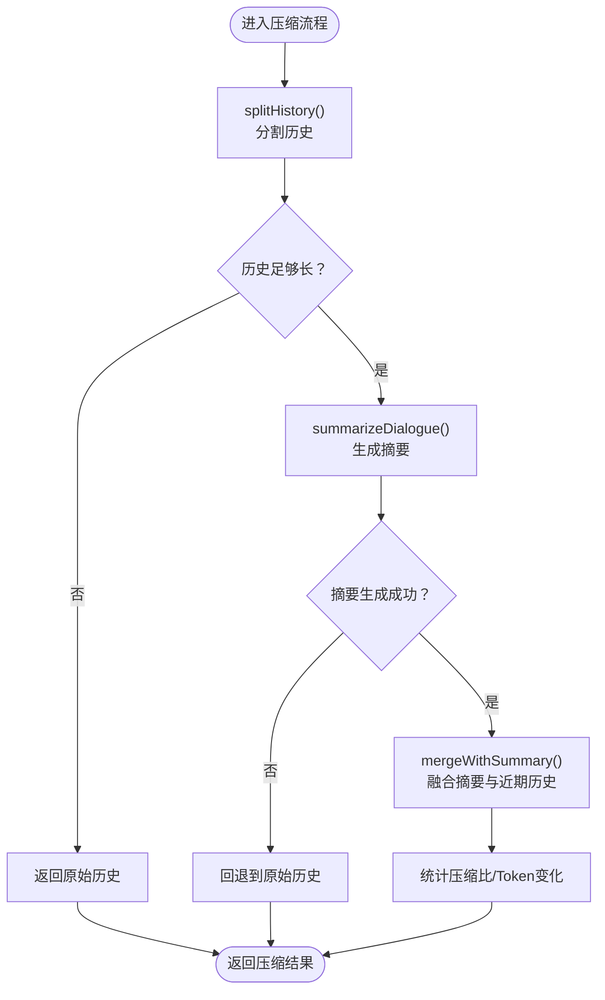
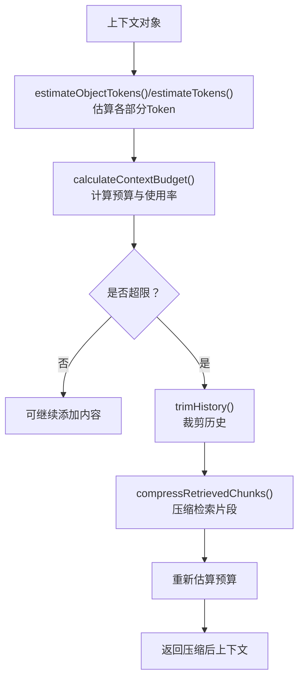
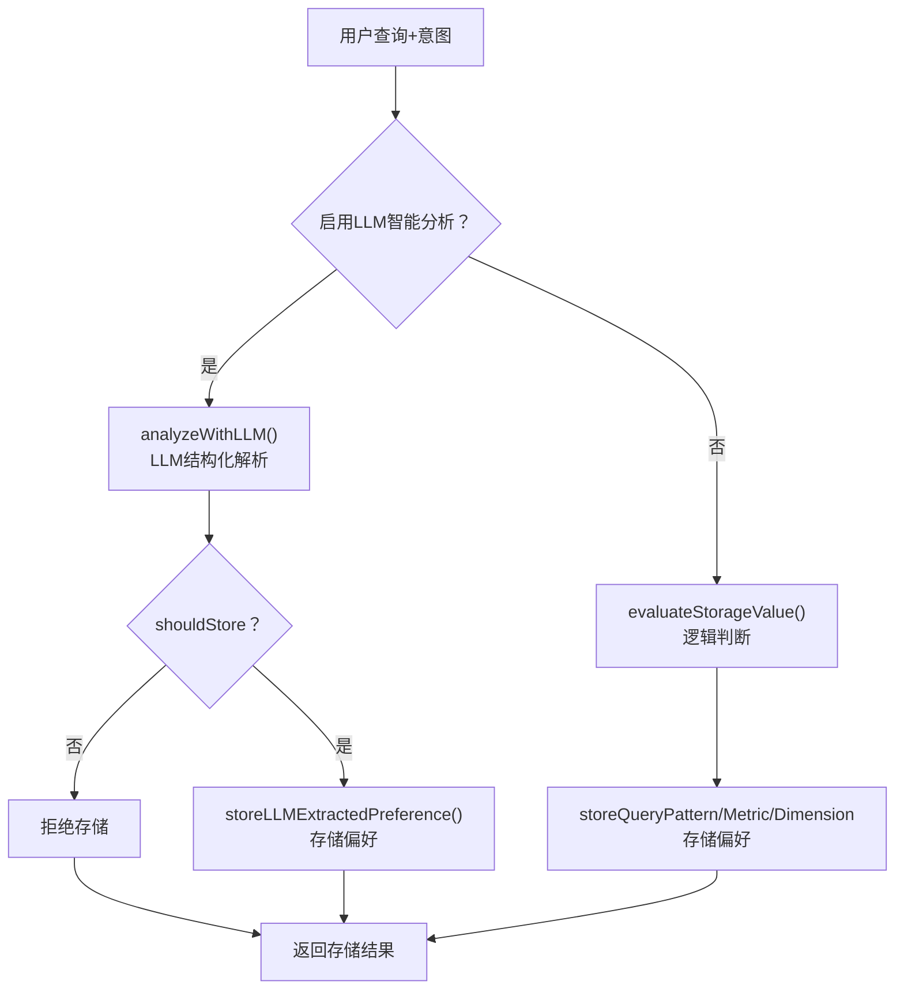
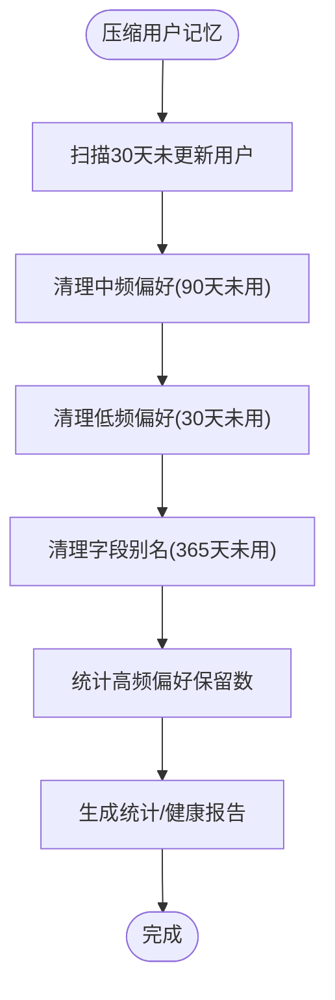
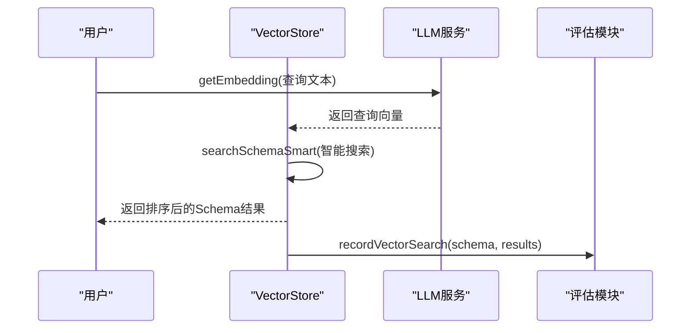
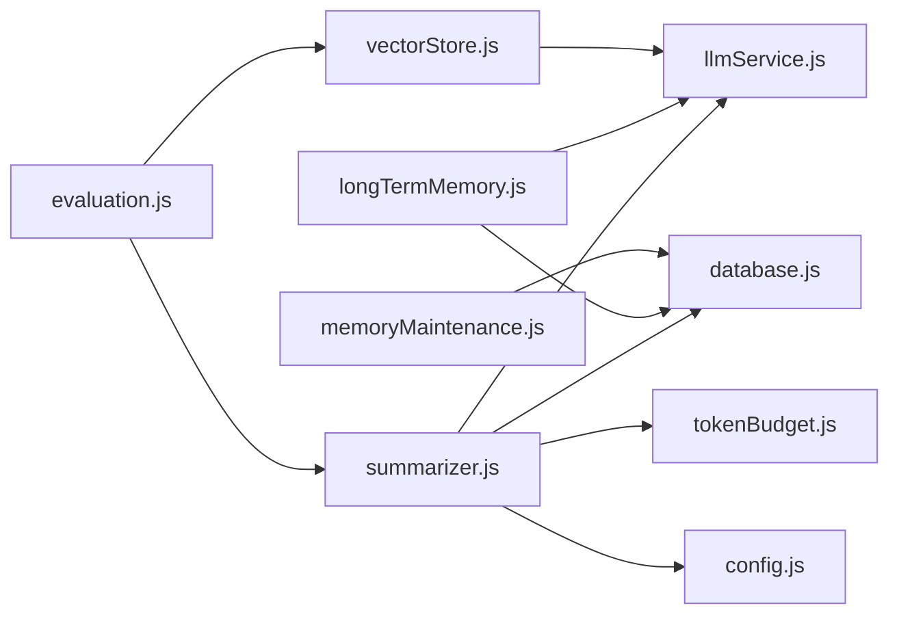
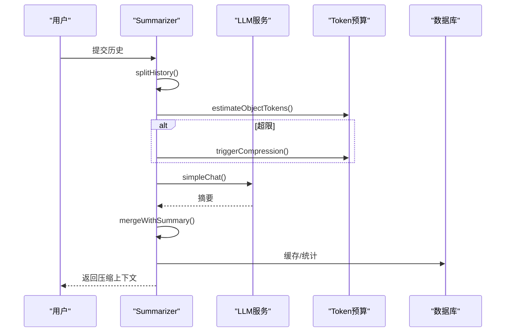

# 记忆摘要器

<cite>
**本文引用的文件**
- [summarizer.js](file://backend/src/memory/summarizer.js)
- [longTermMemory.js](file://backend/src/memory/longTermMemory.js)
- [memoryMaintenance.js](file://backend/src/memory/memoryMaintenance.js)
- [vectorStore.js](file://backend/src/memory/vectorStore.js)
- [llmService.js](file://backend/src/core/llmService.js)
- [tokenBudget.js](file://backend/src/utils/tokenBudget.js)
- [evaluation.js](file://backend/src/utils/evaluation.js)
- [config.js](file://backend/src/core/config.js)
- [database.js](file://backend/src/core/database.js)
</cite>

## 目录
1. [简介](#简介)
2. [项目结构](#项目结构)
3. [核心组件](#核心组件)
4. [架构概览](#架构概览)
5. [详细组件分析](#详细组件分析)
6. [依赖关系分析](#依赖关系分析)
7. [性能考量](#性能考量)
8. [故障排查指南](#故障排查指南)
9. [结论](#结论)
10. [附录](#附录)

## 简介
本文件聚焦“记忆摘要器”模块，系统性阐述长文本记忆的处理机制与工作流程，涵盖文本预处理、关键信息提取、摘要生成算法、缓存与压缩策略、质量评估指标与配置参数，并给出与其他记忆组件的集成方式与性能优化建议。目标读者既包括开发者也包括对系统架构感兴趣的非技术用户。

## 项目结构
记忆摘要器位于后端模块的 memory 子目录，围绕对话历史的自动压缩与融合展开，同时与长期记忆、向量存储、LLM 服务、Token 预算、评估模块形成协同关系。

图表来源
- [summarizer.js:1-518](file://backend/src/memory/summarizer.js#L1-L518)
- [longTermMemory.js:1-800](file://backend/src/memory/longTermMemory.js#L1-L800)
- [memoryMaintenance.js:1-415](file://backend/src/memory/memoryMaintenance.js#L1-L415)
- [vectorStore.js:1-759](file://backend/src/memory/vectorStore.js#L1-L759)
- [llmService.js:1-468](file://backend/src/core/llmService.js#L1-L468)
- [tokenBudget.js:1-435](file://backend/src/utils/tokenBudget.js#L1-L435)
- [evaluation.js:1-488](file://backend/src/utils/evaluation.js#L1-L488)
- [config.js:1-398](file://backend/src/core/config.js#L1-L398)
- [database.js:1-850](file://backend/src/core/database.js#L1-L850)

章节来源
- [summarizer.js:1-518](file://backend/src/memory/summarizer.js#L1-L518)
- [config.js:252-333](file://backend/src/core/config.js#L252-L333)

## 核心组件
- 对话摘要与压缩：将早期对话压缩为摘要，保留近期对话原文，支持增量更新与缓存复用。
- Token 预算与上下文压缩：估算上下文 Token 并在超限时自动裁剪历史或压缩检索片段。
- 长期记忆与偏好提取：从查询意图中提取字段别名、查询模式、指标/维度偏好，结合 LLM 智能分析与逻辑判断。
- 向量存储与语义检索：基于 LanceDB 的 Schema/查询向量存储与智能搜索，支撑检索增强与相似度评估。
- 评估与统计：记录向量检索命中率、长期记忆命中率与相似度评估，支持非侵入式运行时统计。

章节来源
- [summarizer.js:48-331](file://backend/src/memory/summarizer.js#L48-L331)
- [tokenBudget.js:104-372](file://backend/src/utils/tokenBudget.js#L104-L372)
- [longTermMemory.js:47-485](file://backend/src/memory/longTermMemory.js#L47-L485)
- [vectorStore.js:231-536](file://backend/src/memory/vectorStore.js#L231-L536)
- [evaluation.js:66-430](file://backend/src/utils/evaluation.js#L66-L430)

## 架构概览
记忆摘要器通过“分割-生成-融合-压缩”的闭环流程，将长对话历史转化为“摘要 + 近期对话”的紧凑形式，同时利用 Token 预算模块保障上下文长度安全，借助 LLM 服务实现高质量摘要生成，并与长期记忆、向量存储、评估模块协同提升系统整体表现。

图表来源
- [summarizer.js:264-331](file://backend/src/memory/summarizer.js#L264-L331)
- [summarizer.js:450-492](file://backend/src/memory/summarizer.js#L450-L492)
- [tokenBudget.js:315-372](file://backend/src/utils/tokenBudget.js#L315-L372)
- [llmService.js:309-347](file://backend/src/core/llmService.js#L309-L347)

## 详细组件分析

### 对话摘要与压缩（Summarizer）
- 分割策略：根据“保留最近对话轮数”阈值，将历史切分为“需要摘要的历史”和“保留的近期历史”，避免对短历史进行无意义压缩。
- 摘要生成：将历史对话文本化为系统提示词 + 用户/助手消息拼接，调用 LLM 生成摘要；支持长度裁剪与统计。
- 增量更新：将新增对话与现有摘要合并，生成更新后的摘要，失败时回退到原摘要。
- 历史压缩：将摘要与近期历史合并为最终上下文，统计压缩比与 Token 变化。
- 融合策略：在摘要与近期历史之间插入“摘要系统消息”和“最新对话分隔线”，便于后续 LLM 理解上下文结构。
- 缓存管理：按会话 ID 缓存摘要，支持过期清理与手动清除，避免重复生成。

图表来源
- [summarizer.js:264-331](file://backend/src/memory/summarizer.js#L264-L331)
- [summarizer.js:450-492](file://backend/src/memory/summarizer.js#L450-L492)

章节来源
- [summarizer.js:48-331](file://backend/src/memory/summarizer.js#L48-L331)
- [summarizer.js:333-492](file://backend/src/memory/summarizer.js#L333-L492)

### Token 预算与上下文压缩（TokenBudget）
- 估算策略：基于字符数与经验比率估算 Token 数，支持批量与对象估算。
- 预算计算：分解系统提示词、历史、检索片段三部分，计算使用率与剩余预算，生成压缩建议。
- 压缩策略：优先裁剪历史对话轮数，其次压缩检索片段，必要时进一步激进裁剪，最后重新计算预算。
- 快捷检查：提供上下文安全检查与状态摘要，便于快速判断是否需要压缩。

图表来源
- [tokenBudget.js:115-181](file://backend/src/utils/tokenBudget.js#L115-L181)
- [tokenBudget.js:315-372](file://backend/src/utils/tokenBudget.js#L315-L372)

章节来源
- [tokenBudget.js:50-214](file://backend/src/utils/tokenBudget.js#L50-L214)
- [tokenBudget.js:220-372](file://backend/src/utils/tokenBudget.js#L220-L372)

### 长期记忆与偏好提取（LongTermMemory）
- LLM智能分析：通过系统提示词引导 LLM 判断查询是否值得存入长期记忆，区分字段别名、分析习惯、过滤逻辑等偏好类型，输出结构化 JSON。
- 逻辑判断：若禁用 LLM 或 LLM 分析失败，回退到逻辑判断，基于置信度、模板价值、频率阈值等进行存储决策。
- 偏好存储：支持字段别名、查询模式、指标偏好、维度偏好四类偏好，自动去重与使用次数统计。
- 字段别名学习：针对用户术语与 Schema 字段/值的映射进行学习，支持伪字段与实体值映射。

图表来源
- [longTermMemory.js:57-189](file://backend/src/memory/longTermMemory.js#L57-L189)
- [longTermMemory.js:252-485](file://backend/src/memory/longTermMemory.js#L252-L485)

章节来源
- [longTermMemory.js:47-485](file://backend/src/memory/longTermMemory.js#L47-L485)

### 记忆维护与清理（MemoryMaintenance）
- 分级保留策略：高频（≥10次）、中频（3-9次）、低频（<3次）、字段别名分别设定保留天数，定期清理过期偏好。
- 相似模式合并：对维度/指标重合度高的查询模式进行合并，减少冗余偏好。
- 统计与报告：提供用户记忆统计、系统健康报告，支持维护建议。

图表来源
- [memoryMaintenance.js:69-189](file://backend/src/memory/memoryMaintenance.js#L69-L189)
- [memoryMaintenance.js:201-309](file://backend/src/memory/memoryMaintenance.js#L201-L309)

章节来源
- [memoryMaintenance.js:1-415](file://backend/src/memory/memoryMaintenance.js#L1-L415)

### 向量存储与语义检索（VectorStore）
- Schema向量：将表/字段描述向量化，支持智能搜索（根据查询文本识别游戏/平台偏好，重排序返回结果）。
- 查询历史向量：记录用户自然语言查询，支持相似查询检索，辅助上下文压缩与偏好学习。
- 元数据增强：计算重要性评分、分类查询类型、构建增强元数据，便于检索与评估。

图表来源
- [vectorStore.js:450-536](file://backend/src/memory/vectorStore.js#L450-L536)
- [evaluation.js:158-266](file://backend/src/utils/evaluation.js#L158-L266)

章节来源
- [vectorStore.js:231-536](file://backend/src/memory/vectorStore.js#L231-L536)
- [evaluation.js:158-334](file://backend/src/utils/evaluation.js#L158-L334)

### LLM 服务与 Embedding（LLMService）
- 聊天接口：支持普通与流式响应，内置重试与超时控制，记录请求/响应详情。
- Embedding 接口：统一向量维度与超时配置，支持批量向量生成。
- 工具定义辅助：提供工具定义构造函数，便于扩展工具调用。

章节来源
- [llmService.js:222-347](file://backend/src/core/llmService.js#L222-L347)
- [llmService.js:360-415](file://backend/src/core/llmService.js#L360-L415)

## 依赖关系分析
- 摘要器依赖 LLM 服务生成摘要，依赖 Token 预算进行上下文长度控制，依赖配置模块读取摘要阈值与更新间隔，依赖数据库进行摘要缓存。
- 长期记忆依赖 LLM 进行智能分析，依赖数据库进行偏好存储与查询，依赖评估模块进行命中率统计。
- 向量存储依赖 LLM 生成 Embedding，依赖评估模块记录检索命中。
- 评估模块贯穿向量检索与长期记忆，提供非侵入式统计。

图表来源
- [summarizer.js:12-14](file://backend/src/memory/summarizer.js#L12-L14)
- [longTermMemory.js:17-21](file://backend/src/memory/longTermMemory.js#L17-L21)
- [memoryMaintenance.js:16-18](file://backend/src/memory/memoryMaintenance.js#L16-L18)
- [vectorStore.js:14-21](file://backend/src/memory/vectorStore.js#L14-L21)
- [evaluation.js:12-13](file://backend/src/utils/evaluation.js#L12-L13)

章节来源
- [summarizer.js:12-14](file://backend/src/memory/summarizer.js#L12-L14)
- [longTermMemory.js:17-21](file://backend/src/memory/longTermMemory.js#L17-L21)
- [memoryMaintenance.js:16-18](file://backend/src/memory/memoryMaintenance.js#L16-L18)
- [vectorStore.js:14-21](file://backend/src/memory/vectorStore.js#L14-L21)
- [evaluation.js:12-13](file://backend/src/utils/evaluation.js#L12-L13)

## 性能考量
- 摘要生成成本：摘要生成依赖 LLM，建议通过缓存与增量更新降低调用频率；合理设置摘要阈值与更新间隔。
- Token 控制：在摘要生成前使用 Token 预算模块进行上下文估算，必要时提前裁剪历史或压缩检索片段。
- 向量检索：智能搜索在返回更多候选后再重排序，建议控制 topK 与过滤条件，避免过度计算。
- 数据库写入：长期记忆与摘要缓存均写入 SQLite，建议批量写入与索引优化，避免频繁更新导致锁竞争。
- 评估开销：评估模块默认关闭，仅在需要时启用，避免影响主流程性能。

[本节为通用指导，不直接分析具体文件]

## 故障排查指南
- 摘要生成失败：检查 LLM API 配置与网络连通性，查看错误日志；确认系统提示词长度与 Token 估算是否合理。
- 上下文超限：启用 Token 预算模块，检查历史轮数与检索片段数量，适当降低保留轮数或压缩阈值。
- 长期记忆未存储：确认置信度阈值、模板价值与频率阈值设置；若启用 LLM 分析，检查提示词格式与 JSON 解析。
- 向量检索命中率低：检查 Embedding 维度与模型配置，优化查询文本与检索过滤条件。
- 评估统计异常：确认评估开关与统计开关，检查日志输出与环境变量配置。

章节来源
- [summarizer.js:177-184](file://backend/src/memory/summarizer.js#L177-L184)
- [tokenBudget.js:315-372](file://backend/src/utils/tokenBudget.js#L315-L372)
- [longTermMemory.js:358-380](file://backend/src/memory/longTermMemory.js#L358-L380)
- [evaluation.js:158-266](file://backend/src/utils/evaluation.js#L158-L266)

## 结论
记忆摘要器通过“分割-生成-融合-压缩”的闭环流程，有效控制上下文长度并保留关键信息；结合 Token 预算、长期记忆、向量存储与评估模块，形成完整的记忆体系。合理的配置与缓存策略能够显著降低 LLM 调用成本，提升系统稳定性与可扩展性。

[本节为总结性内容，不直接分析具体文件]

## 附录

### 摘要器工作流程（序列图）

图表来源
- [summarizer.js:264-331](file://backend/src/memory/summarizer.js#L264-L331)
- [tokenBudget.js:315-372](file://backend/src/utils/tokenBudget.js#L315-L372)
- [llmService.js:309-347](file://backend/src/core/llmService.js#L309-L347)

### 摘要质量评估指标
- 信息保留率：通过“摘要 + 近期历史”的融合上下文与原始历史的 Token 对比，计算压缩比与保留信息量。
- 压缩比：原始 Token 数与压缩后 Token 数之差除以原始 Token 数，衡量压缩效率。
- 可读性评分：由 LLM 对摘要进行主观评分（可结合评估模块的相似度与召回指标间接反映）。

章节来源
- [summarizer.js:306-330](file://backend/src/memory/summarizer.js#L306-L330)
- [evaluation.js:268-334](file://backend/src/utils/evaluation.js#L268-L334)

### 摘要器配置参数
- 触发轮数阈值：超过该轮数才触发摘要。
- 保留最近轮数：摘要生成时保留的近期对话轮数。
- 摘要最大 Token 数：摘要长度上限。
- 摘要更新间隔：轮数间隔，避免频繁更新摘要。
- 缓存过期时间：摘要缓存有效期。

章节来源
- [summarizer.js:23-34](file://backend/src/memory/summarizer.js#L23-L34)
- [config.js:322-332](file://backend/src/core/config.js#L322-L332)

### 与其他记忆组件的集成方式
- 与长期记忆：长期记忆的字段别名与查询模式可作为摘要生成的上下文补充，提升摘要的领域相关性。
- 与向量存储：向量检索结果可作为摘要生成的背景知识，辅助 LLM 更准确地抽取关键信息。
- 与 Token 预算：在摘要生成前进行上下文估算与压缩，确保摘要生成过程中的上下文安全。
- 与评估模块：通过评估模块记录摘要生成与检索命中情况，持续优化摘要策略与阈值。

章节来源
- [longTermMemory.js:47-485](file://backend/src/memory/longTermMemory.js#L47-L485)
- [vectorStore.js:450-536](file://backend/src/memory/vectorStore.js#L450-L536)
- [evaluation.js:66-122](file://backend/src/utils/evaluation.js#L66-L122)