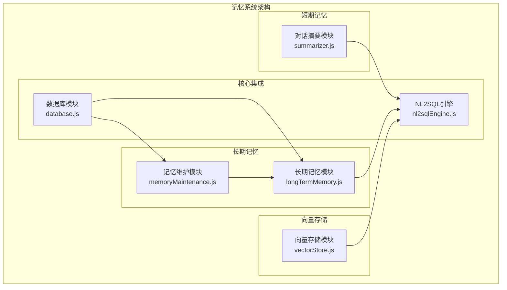
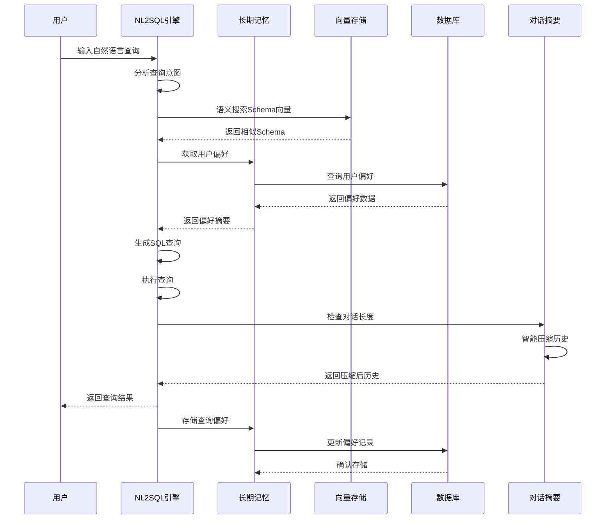
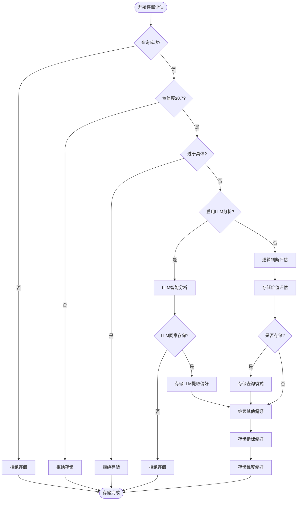
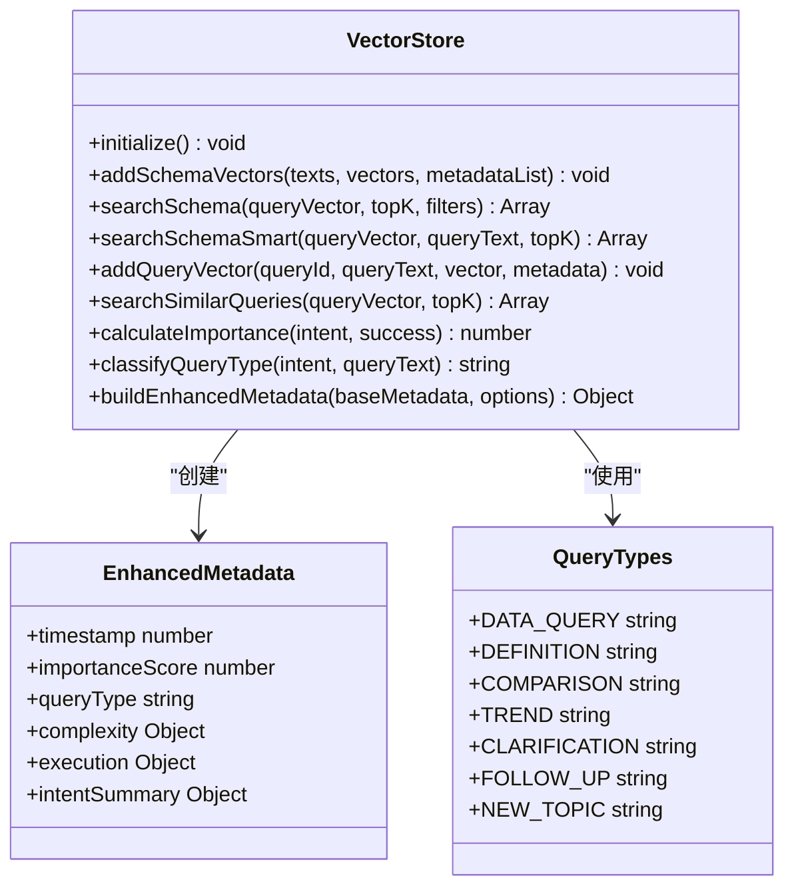
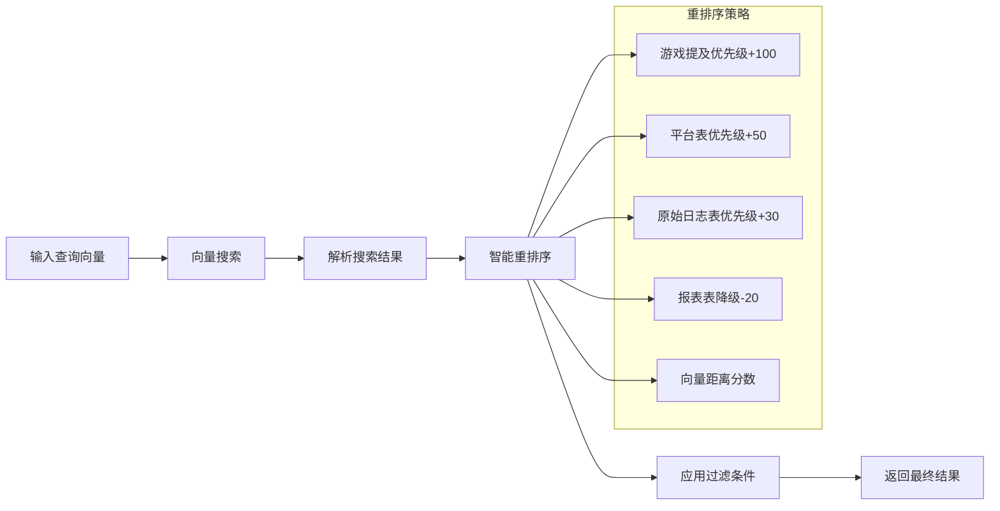
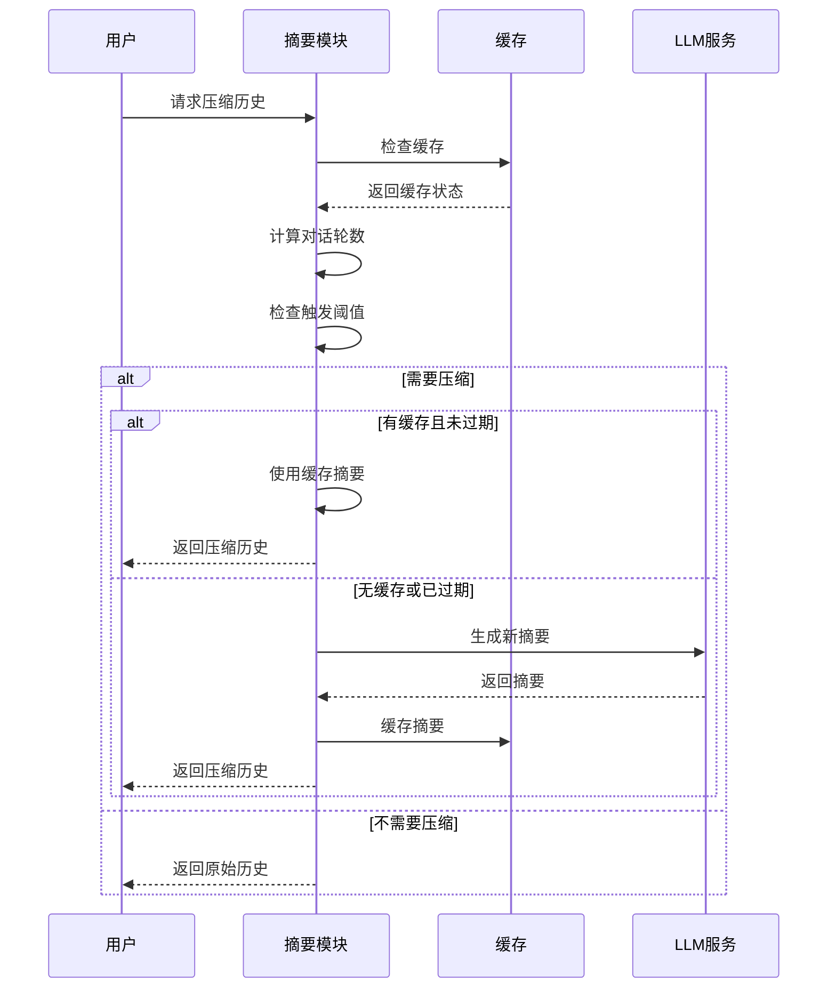
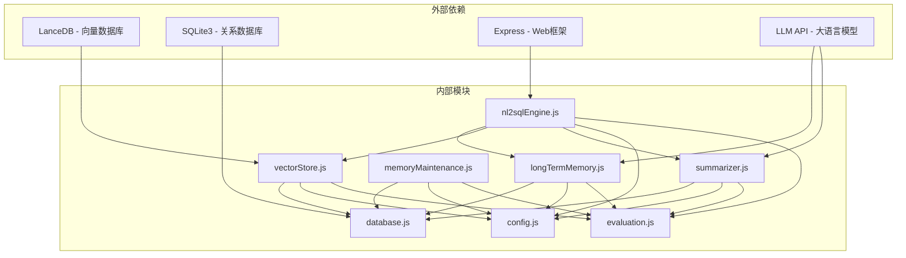
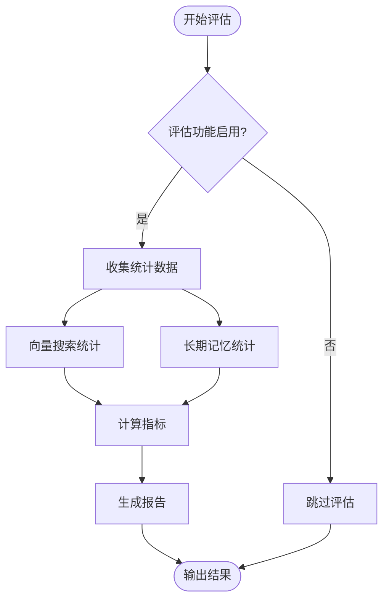

# 记忆系统

<cite>
**本文档引用的文件**
- [longTermMemory.js](file://backend/src/memory/longTermMemory.js)
- [vectorStore.js](file://backend/src/memory/vectorStore.js)
- [memoryMaintenance.js](file://backend/src/memory/memoryMaintenance.js)
- [summarizer.js](file://backend/src/memory/summarizer.js)
- [nl2sqlEngine.js](file://backend/src/core/nl2sqlEngine.js)
- [config.js](file://backend/src/core/config.js)
- [database.js](file://backend/src/core/database.js)
- [evaluation.js](file://backend/src/utils/evaluation.js)
- [context-management.test.js](file://backend/test/context-management.test.js)
</cite>

## 目录
1. [简介](#简介)
2. [项目结构](#项目结构)
3. [核心组件](#核心组件)
4. [架构概览](#架构概览)
5. [详细组件分析](#详细组件分析)
6. [依赖关系分析](#依赖关系分析)
7. [性能考虑](#性能考虑)
8. [故障排除指南](#故障排除指南)
9. [结论](#结论)

## 简介

NL2SQL 记忆系统是一个多层次的记忆架构，旨在提升自然语言到 SQL 查询的转换质量和用户体验。系统采用分层设计，包含短期记忆（对话摘要）和长期记忆（用户偏好学习）两大核心模块，通过向量存储实现语义相似度计算和记忆关联分析。

该系统的核心目标是：
- **智能记忆提取**：从成功的查询中提取有价值的用户偏好和查询模式
- **语义检索**：利用向量数据库实现 Schema 信息和查询历史的语义相似度搜索
- **记忆维护**：定期清理和压缩长期记忆，保持系统性能
- **上下文管理**：有效管理对话历史，避免 Token 预算超限

## 项目结构

NL2SQL 记忆系统位于后端项目的 `backend/src/memory` 目录下，采用模块化设计：



**图表来源**
- [longTermMemory.js:1-1141](file://backend/src/memory/longTermMemory.js#L1-L1141)
- [vectorStore.js:1-759](file://backend/src/memory/vectorStore.js#L1-L759)
- [memoryMaintenance.js:1-415](file://backend/src/memory/memoryMaintenance.js#L1-L415)
- [summarizer.js:1-518](file://backend/src/memory/summarizer.js#L1-L518)

**章节来源**
- [longTermMemory.js:1-1141](file://backend/src/memory/longTermMemory.js#L1-L1141)
- [vectorStore.js:1-759](file://backend/src/memory/vectorStore.js#L1-L759)
- [memoryMaintenance.js:1-415](file://backend/src/memory/memoryMaintenance.js#L1-L415)
- [summarizer.js:1-518](file://backend/src/memory/summarizer.js#L1-L518)

## 核心组件

### 1. 长期记忆管理模块

长期记忆模块负责用户长期记忆的提取、存储、检索和维护，包括查询模式、字段别名、常用指标/维度偏好等。

**核心功能**：
- **智能偏好提取**：基于 LLM 分析和逻辑判断相结合的方式
- **存储筛选策略**：成功率>0.7、排除一次性查询、高频模式或高价值模板
- **多类型偏好存储**：查询模式、字段别名、指标偏好、维度偏好

### 2. 向量存储模块

向量存储模块基于 LanceDB 实现，提供 Schema 信息和查询历史的向量表示和语义检索。

**核心功能**：
- **Schema 向量存储**：表和字段描述的向量化
- **查询历史向量存储**：用户自然语言查询的向量化
- **智能语义搜索**：基于向量相似度的语义检索
- **元数据增强**：重要性评分、查询类型分类、复杂度分析

### 3. 记忆维护模块

记忆维护模块负责长期记忆的定期压缩、清理和维护，实现分级保留策略。

**核心功能**：
- **分级清理策略**：高频(≥10次)永久保留，中频(3-9次)90天未用清理，低频(<3次)30天未用清理
- **相似模式合并**：合并高度相似的查询模式
- **统计报告生成**：提供系统记忆健康报告

### 4. 对话摘要模块

对话摘要模块负责长对话历史的自动摘要和压缩，将早期对话压缩为摘要，保留近期对话原文。

**核心功能**：
- **智能压缩**：基于对话轮数和 Token 预算的触发机制
- **摘要缓存**：内存中缓存摘要，避免重复生成
- **增量更新**：将新对话添加到现有摘要中

**章节来源**
- [longTermMemory.js:1-1141](file://backend/src/memory/longTermMemory.js#L1-L1141)
- [vectorStore.js:1-759](file://backend/src/memory/vectorStore.js#L1-L759)
- [memoryMaintenance.js:1-415](file://backend/src/memory/memoryMaintenance.js#L1-L415)
- [summarizer.js:1-518](file://backend/src/memory/summarizer.js#L1-L518)

## 架构概览



**图表来源**
- [nl2sqlEngine.js:741-1019](file://backend/src/core/nl2sqlEngine.js#L741-L1019)
- [longTermMemory.js:312-485](file://backend/src/memory/longTermMemory.js#L312-L485)
- [vectorStore.js:378-435](file://backend/src/memory/vectorStore.js#L378-L435)
- [summarizer.js:450-492](file://backend/src/memory/summarizer.js#L450-L492)

## 详细组件分析

### 长期记忆管理模块

#### 存储策略设计

长期记忆模块采用了多层次的存储筛选策略：



**图表来源**
- [longTermMemory.js:312-485](file://backend/src/memory/longTermMemory.js#L312-L485)
- [longTermMemory.js:252-296](file://backend/src/memory/longTermMemory.js#L252-L296)

#### 偏好类型分类

系统支持四种主要的偏好类型：

| 偏好类型 | 描述 | 示例 | 存储条件 |
|---------|------|------|----------|
| 查询模式 | 常用的查询模板和模式 | "按日期查收入" | 高价值模板或高频模式 |
| 字段别名 | 用户术语到Schema字段的映射 | "青木" → "game_id" | 个人偏好且有价值 |
| 指标偏好 | 常用指标的偏好设置 | "收入"、"订单数" | 使用频率较高 |
| 维度偏好 | 常用维度的偏好设置 | "日期"、"渠道" | 使用频率较高 |

**章节来源**
- [longTermMemory.js:36-42](file://backend/src/memory/longTermMemory.js#L36-L42)
- [longTermMemory.js:252-296](file://backend/src/memory/longTermMemory.js#L252-L296)

### 向量存储模块

#### 语义相似度计算

向量存储模块实现了完整的语义相似度计算框架：



**图表来源**
- [vectorStore.js:14-22](file://backend/src/memory/vectorStore.js#L14-L22)
- [vectorStore.js:27-38](file://backend/src/memory/vectorStore.js#L27-L38)
- [vectorStore.js:48-82](file://backend/src/memory/vectorStore.js#L48-L82)

#### 智能搜索机制

向量存储模块提供了智能搜索功能，能够根据查询文本自动识别意图并应用相应的过滤策略：



**图表来源**
- [vectorStore.js:450-536](file://backend/src/memory/vectorStore.js#L450-L536)

**章节来源**
- [vectorStore.js:1-759](file://backend/src/memory/vectorStore.js#L1-L759)

### 记忆维护模块

#### 分级保留策略

记忆维护模块实现了精细的分级保留策略：

```mermaid
flowchart TD
Start([开始记忆压缩]) --> GetUsers[获取用户列表]
GetUsers --> ProcessUser[处理单个用户]
ProcessUser --> CheckMedium{中频偏好(3-9次)?}
CheckMedium --> |是| CheckMediumTime{90天未用?}
CheckMediumTime --> |是| DeleteMedium[删除中频偏好]
CheckMediumTime --> |否| KeepMedium[保留中频偏好]
CheckMedium --> |否| CheckLow{低频偏好(<3次)?}
CheckLow --> |是| CheckLowTime{30天未用?}
CheckLowTime --> |是| DeleteLow[删除低频偏好]
CheckLowTime --> |否| KeepLow[保留低频偏好]
CheckLow --> |否| CheckAlias{字段别名?}
CheckAlias --> |是| CheckAliasTime{365天未用?}
CheckAliasTime --> |是| DeleteAlias[删除字段别名]
CheckAliasTime --> |否| KeepAlias[保留字段别名]
CheckAlias --> |否| CheckHigh{高频偏好(≥10次)?}
CheckHigh --> |是| KeepHigh[保留高频偏好]
CheckHigh --> |否| NoAction[无操作]
DeleteMedium --> Stats[统计删除数量]
KeepMedium --> Stats
DeleteLow --> Stats
KeepLow --> Stats
DeleteAlias --> Stats
KeepAlias --> Stats
KeepHigh --> Stats
NoAction --> Stats
Stats --> End([压缩完成])
```

**图表来源**
- [memoryMaintenance.js:69-189](file://backend/src/memory/memoryMaintenance.js#L69-L189)

#### 相似模式合并

系统还提供了相似模式合并功能，自动识别和合并高度相似的查询模式：

**章节来源**
- [memoryMaintenance.js:1-415](file://backend/src/memory/memoryMaintenance.js#L1-L415)

### 对话摘要模块

#### 智能压缩机制

对话摘要模块采用了智能压缩机制，能够根据对话轮数和 Token 预算自动决定是否进行压缩：



**图表来源**
- [summarizer.js:450-492](file://backend/src/memory/summarizer.js#L450-L492)

**章节来源**
- [summarizer.js:1-518](file://backend/src/memory/summarizer.js#L1-L518)

## 依赖关系分析



**图表来源**
- [package.json:10-20](file://backend/package.json#L10-L20)
- [nl2sqlEngine.js:16-34](file://backend/src/core/nl2sqlEngine.js#L16-L34)

### 核心依赖关系

1. **向量存储依赖**：依赖 LanceDB 进行向量操作
2. **数据持久化依赖**：依赖 SQLite3 进行偏好和历史数据存储
3. **LLM集成依赖**：依赖外部 LLM API 进行智能分析和摘要生成
4. **配置管理依赖**：统一从 config.js 获取所有配置参数

**章节来源**
- [package.json:10-28](file://backend/package.json#L10-L28)
- [nl2sqlEngine.js:16-34](file://backend/src/core/nl2sqlEngine.js#L16-L34)

## 性能考虑

### 向量存储性能优化

1. **索引策略**：向量存储使用 LanceDB 的内置索引机制，支持高效的向量相似度搜索
2. **批量操作**：支持批量添加和查询，减少网络往返开销
3. **智能过滤**：在应用层实现过滤逻辑，避免不必要的向量计算

### 记忆维护性能优化

1. **增量清理**：只处理最近更新的用户，避免全量扫描
2. **事务处理**：使用 SQLite 事务确保数据一致性
3. **缓存机制**：内存中缓存摘要，避免重复计算

### 上下文管理性能优化

1. **Token 预算控制**：实时监控 Token 使用量，避免超限
2. **智能压缩触发**：基于对话轮数和 Token 预算的双重阈值
3. **缓存策略**：合理设置缓存过期时间，平衡内存使用和性能

## 故障排除指南

### 常见问题诊断

#### 向量数据库初始化失败

**症状**：系统启动时报错，向量搜索功能不可用

**排查步骤**：
1. 检查向量数据库路径配置
2. 验证 LanceDB 依赖是否正确安装
3. 检查数据库文件权限

**解决方案**：
```javascript
// 检查向量数据库初始化状态
if (!vectorStore.isInitialized()) {
    console.warn('向量数据库未初始化');
    // 尝试重新初始化
    await vectorStore.initialize();
}
```

#### 长期记忆存储失败

**症状**：用户偏好无法保存到数据库

**排查步骤**：
1. 检查数据库连接状态
2. 验证 SQLite 表结构
3. 检查 JSON 数据格式

**解决方案**：
```javascript
// 检查数据库连接
const db = database.getDb();
if (!db) {
    throw new Error('数据库连接失败');
}

// 验证数据格式
try {
    const content = JSON.stringify(preference.content);
} catch (e) {
    throw new Error('偏好内容格式错误');
}
```

#### 记忆维护异常

**症状**：定期清理任务失败或数据清理不彻底

**排查步骤**：
1. 检查 Cron 任务配置
2. 验证 SQL 语句正确性
3. 检查用户数据完整性

**解决方案**：
```javascript
// 手动执行记忆维护
try {
    const stats = await memoryMaintenance.compressUserMemory();
    console.log('记忆压缩完成:', stats);
} catch (error) {
    console.error('记忆压缩失败:', error);
}
```

### 性能监控

系统提供了完整的性能监控和评估功能：



**图表来源**
- [evaluation.js:158-266](file://backend/src/utils/evaluation.js#L158-L266)

**章节来源**
- [evaluation.js:1-488](file://backend/src/utils/evaluation.js#L1-L488)

## 结论

NL2SQL 记忆系统通过分层设计实现了高效的记忆管理机制。短期记忆（对话摘要）和长期记忆（用户偏好学习）的有机结合，配合向量存储的语义检索能力，显著提升了系统的智能化水平。

### 主要优势

1. **多层次记忆架构**：短期和长期记忆分离，各有专用的存储和检索策略
2. **智能学习机制**：结合 LLM 分析和逻辑判断，提高记忆提取的准确性
3. **语义检索能力**：基于向量相似度的语义搜索，提升查询理解精度
4. **自动化维护**：定期清理和压缩机制，保持系统性能稳定
5. **全面的监控评估**：提供完整的性能监控和质量评估功能

### 扩展建议

1. **模型优化**：可以考虑使用更先进的嵌入模型提升语义理解能力
2. **增量学习**：实现增量学习机制，支持在线学习和模型更新
3. **个性化推荐**：基于用户行为数据提供个性化的查询建议
4. **多模态支持**：扩展支持图片、表格等多模态数据的记忆和检索

该系统为 NL2SQL 应用提供了强大的记忆能力，能够显著提升用户体验和查询效率。