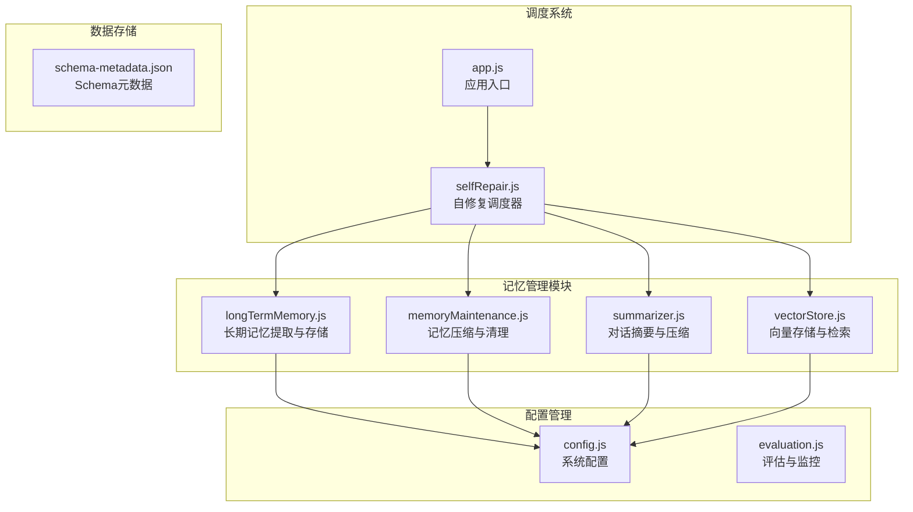
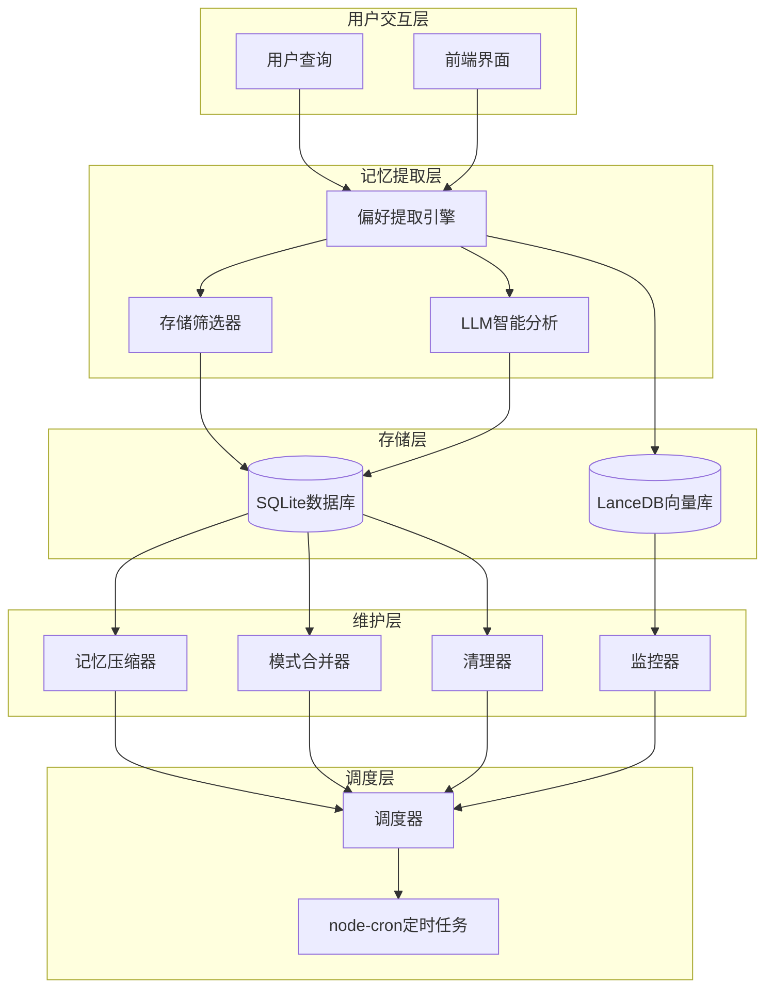
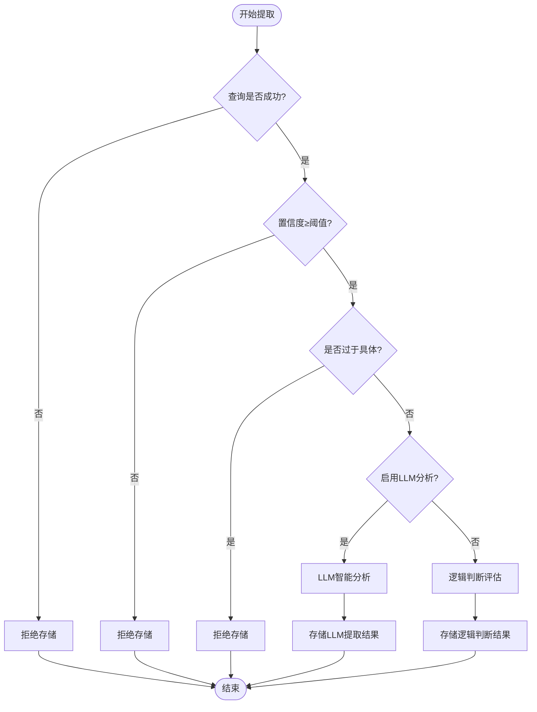
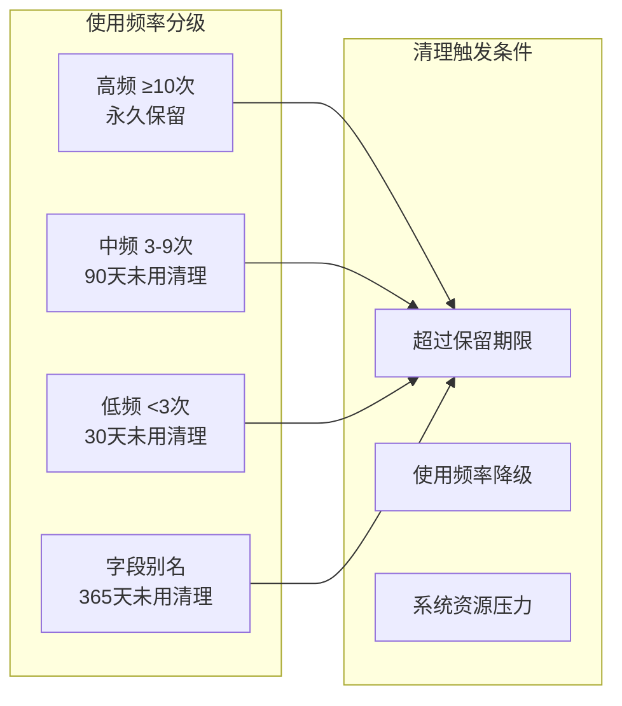
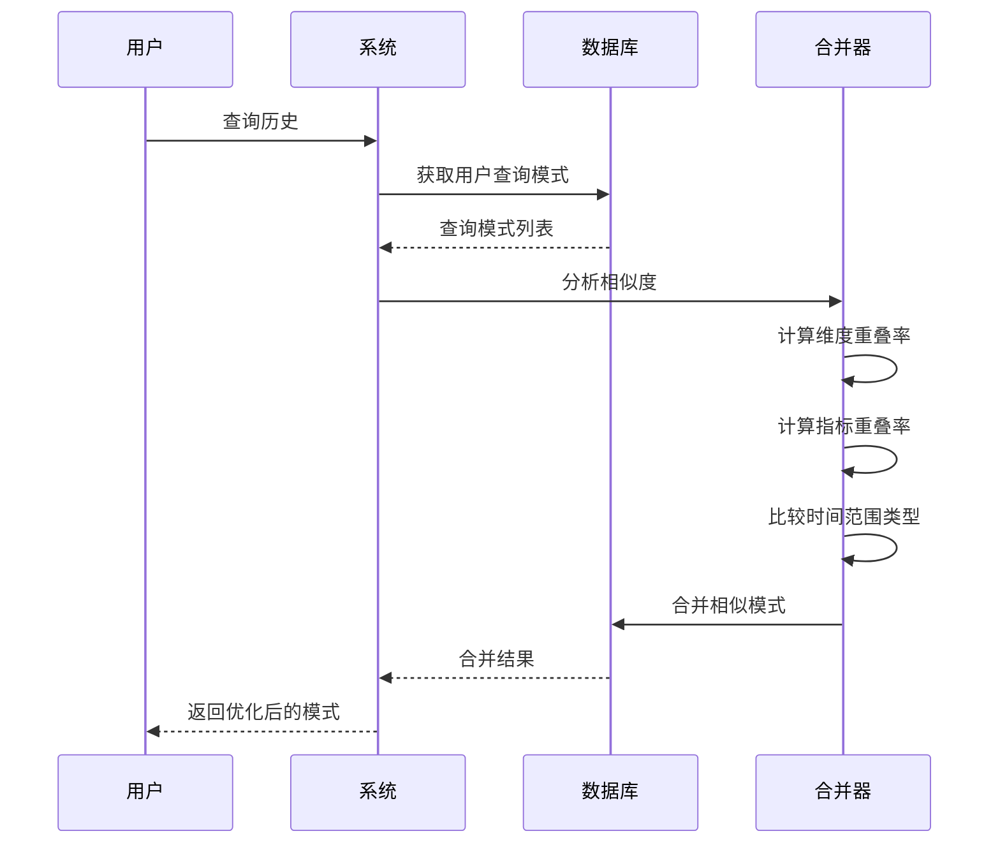
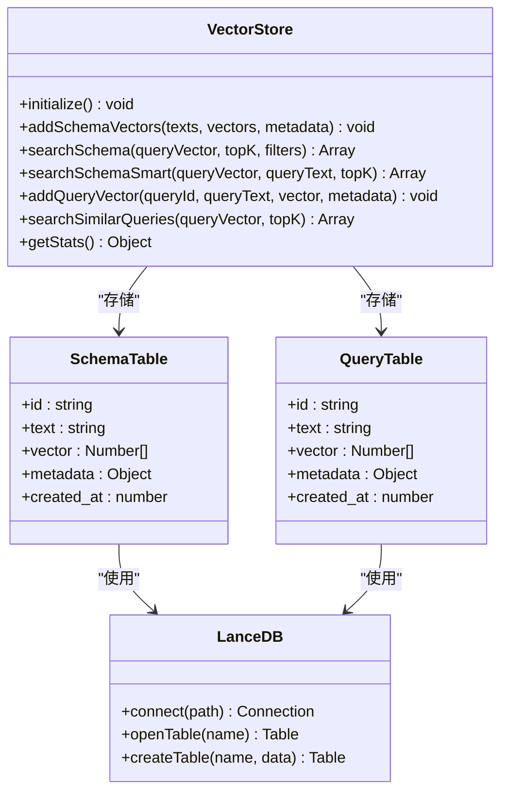
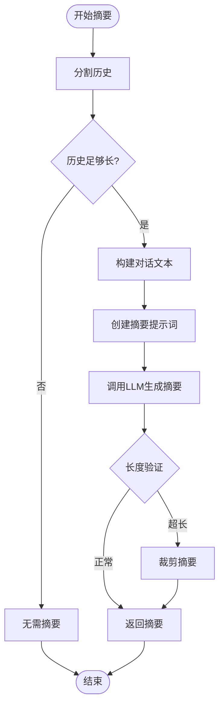
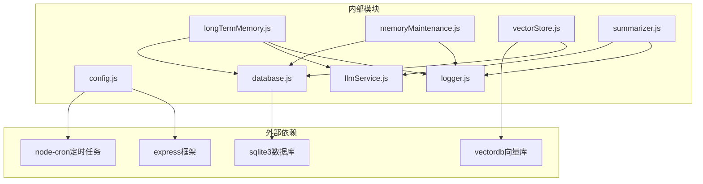
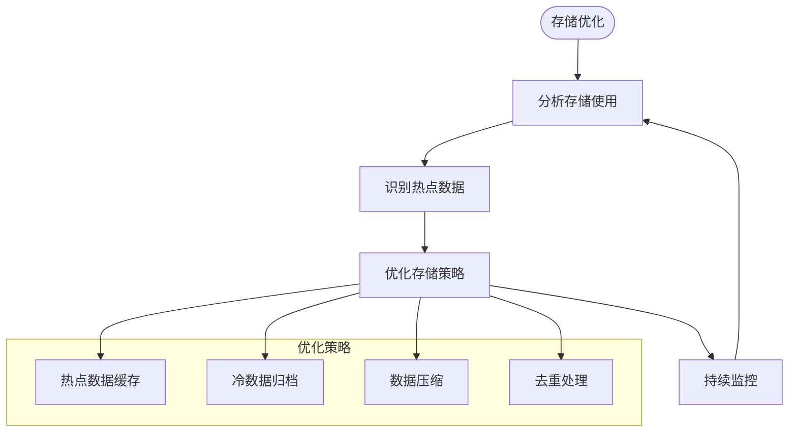

# 记忆维护机制

<cite>
**本文档引用的文件**
- [longTermMemory.js](file://backend/src/memory/longTermMemory.js)
- [memoryMaintenance.js](file://backend/src/memory/memoryMaintenance.js)
- [vectorStore.js](file://backend/src/memory/vectorStore.js)
- [evaluation.js](file://backend/src/utils/evaluation.js)
- [config.js](file://backend/src/core/config.js)
- [selfRepair.js](file://backend/src/core/selfRepair.js)
- [app.js](file://backend/src/app.js)
- [summarizer.js](file://backend/src/memory/summarizer.js)
- [schema-metadata.json](file://backend/config/schema-metadata.json)
</cite>

## 目录
1. [简介](#简介)
2. [项目结构](#项目结构)
3. [核心组件](#核心组件)
4. [架构概览](#架构概览)
5. [详细组件分析](#详细组件分析)
6. [依赖关系分析](#依赖关系分析)
7. [性能考虑](#性能考虑)
8. [故障排查指南](#故障排查指南)
9. [结论](#结论)

## 简介

记忆维护机制是NL2SQL系统中负责长期记忆生命周期管理的核心模块。该机制实现了完整的记忆生命周期管理，包括记忆提取、存储、检索、压缩、清理和优化策略。系统采用多层记忆架构，结合传统数据库存储和向量数据库技术，为用户提供智能化的记忆服务。

## 项目结构

NL2SQL项目的记忆维护机制主要分布在以下目录结构中：

**图表来源**
- [longTermMemory.js:1-1141](file://backend/src/memory/longTermMemory.js#L1-L1141)
- [memoryMaintenance.js:1-415](file://backend/src/memory/memoryMaintenance.js#L1-L415)
- [vectorStore.js:1-759](file://backend/src/memory/vectorStore.js#L1-L759)
- [config.js:1-398](file://backend/src/core/config.js#L1-L398)

**章节来源**
- [app.js:1-238](file://backend/src/app.js#L1-L238)
- [config.js:252-293](file://backend/src/core/config.js#L252-L293)

## 核心组件

### 长期记忆管理模块

长期记忆管理模块负责用户长期记忆的提取、存储和维护，包含以下核心功能：

- **智能提取与筛选**：基于查询置信度、使用频率和价值评估进行智能筛选
- **多类型偏好存储**：支持查询模式、字段别名、指标偏好和维度偏好
- **LLM智能分析**：利用大语言模型进行语义理解和偏好提取
- **去重与冲突处理**：自动处理重复存储和映射冲突

### 记忆维护模块

记忆维护模块实现定期压缩、清理和优化策略：

- **分级保留策略**：高频(≥10次)永久保留，中频(3-9次)90天未用清理，低频(<3次)30天未用清理
- **相似模式合并**：自动识别和合并相似的查询模式
- **统计与报告**：提供详细的记忆使用统计和健康报告

### 向量存储模块

向量存储模块基于LanceDB实现语义检索：

- **Schema向量存储**：存储表和字段的向量表示
- **查询历史向量**：存储用户查询的历史向量
- **智能搜索**：基于查询意图的智能重排序

**章节来源**
- [longTermMemory.js:12-42](file://backend/src/memory/longTermMemory.js#L12-L42)
- [memoryMaintenance.js:1-46](file://backend/src/memory/memoryMaintenance.js#L1-L46)
- [vectorStore.js:1-39](file://backend/src/memory/vectorStore.js#L1-L39)

## 架构概览

**图表来源**
- [longTermMemory.js:312-485](file://backend/src/memory/longTermMemory.js#L312-L485)
- [memoryMaintenance.js:69-189](file://backend/src/memory/memoryMaintenance.js#L69-L189)
- [vectorStore.js:231-322](file://backend/src/memory/vectorStore.js#L231-L322)

## 详细组件分析

### 长期记忆提取与存储

#### 智能筛选机制

长期记忆提取采用多层筛选机制：

**图表来源**
- [longTermMemory.js:320-422](file://backend/src/memory/longTermMemory.js#L320-L422)

#### 偏好类型与存储策略

系统支持四种类型的偏好存储：

| 偏好类型 | 存储内容 | 使用场景 | 保留策略 |
|---------|---------|---------|---------|
| 查询模式 | 维度+指标组合 | 常用查询模板 | 按使用频率分级 |
| 字段别名 | 用户术语↔Schema映射 | 个性化术语 | 365天未用清理 |
| 指标偏好 | 常用指标 | 指标选择习惯 | 按使用频率分级 |
| 维度偏好 | 常用维度 | 维度选择习惯 | 按使用频率分级 |

**章节来源**
- [longTermMemory.js:28-42](file://backend/src/memory/longTermMemory.js#L28-L42)
- [longTermMemory.js:494-606](file://backend/src/memory/longTermMemory.js#L494-L606)

### 记忆压缩与清理策略

#### 分级保留策略

**图表来源**
- [memoryMaintenance.js:24-46](file://backend/src/memory/memoryMaintenance.js#L24-L46)

#### 相似模式合并算法

系统实现智能的相似模式合并：

**图表来源**
- [memoryMaintenance.js:201-309](file://backend/src/memory/memoryMaintenance.js#L201-L309)

**章节来源**
- [memoryMaintenance.js:69-189](file://backend/src/memory/memoryMaintenance.js#L69-L189)
- [memoryMaintenance.js:201-309](file://backend/src/memory/memoryMaintenance.js#L201-L309)

### 向量存储与语义检索

#### 向量数据库架构

**图表来源**
- [vectorStore.js:204-322](file://backend/src/memory/vectorStore.js#L204-L322)

#### 智能搜索算法

系统实现基于查询意图的智能搜索：

| 搜索类型 | 检测特征 | 优先级策略 | 应用场景 |
|---------|---------|-----------|---------|
| 平台通用表 | 未提及具体游戏 | 优先级: 50 | 无游戏上下文查询 |
| 游戏特定表 | 提及游戏关键词 | 优先级: 100 | 游戏相关查询 |
| 原始日志表 | data_type=raw_log | 优先级: 30 | 详细数据查询 |
| 聚合报表表 | data_type=aggregated_report | 优先级: -20 | 概要数据查询 |

**章节来源**
- [vectorStore.js:450-536](file://backend/src/memory/vectorStore.js#L450-L536)
- [vectorStore.js:336-435](file://backend/src/memory/vectorStore.js#L336-L435)

### 对话摘要与压缩

#### 摘要生成策略

**图表来源**
- [summarizer.js:109-185](file://backend/src/memory/summarizer.js#L109-L185)

#### 缓存管理机制

系统实现智能的摘要缓存管理：

- **缓存键**：sessionId + 最后更新轮数
- **过期时间**：30分钟
- **更新间隔**：4轮对话
- **内存管理**：自动清理过期缓存

**章节来源**
- [summarizer.js:450-492](file://backend/src/memory/summarizer.js#L450-L492)
- [summarizer.js:375-425](file://backend/src/memory/summarizer.js#L375-L425)

## 依赖关系分析

### 核心依赖关系

**图表来源**
- [package.json:10-20](file://backend/package.json#L10-L20)
- [app.js:40-50](file://backend/src/app.js#L40-L50)

### 配置依赖

系统配置采用集中管理模式：

| 配置类别 | 关键配置项 | 默认值 | 作用域 |
|---------|-----------|-------|-------|
| 长期记忆 | enabled | true | 功能开关 |
| 长期记忆 | useLLMForExtraction | false | LLM集成 |
| 长期记忆 | thresholds.minConfidence | 0.7 | 存储阈值 |
| 长期记忆 | retention.highUsage | null | 保留策略 |
| 向量数据库 | path | ./data/vectordb | 存储路径 |
| 自修复 | dailyCheckCron | 0 2 * * * | 调度周期 |

**章节来源**
- [config.js:259-293](file://backend/src/core/config.js#L259-L293)
- [config.js:106-109](file://backend/src/core/config.js#L106-L109)

## 性能考虑

### 内存管理策略

系统采用多层次的内存管理策略：

1. **缓存管理**
   - 摘要缓存：30分钟过期，避免重复生成
   - 向量统计：内存中运行时统计，定期重置
   - 连接池：数据库连接池自动管理

2. **存储优化**
   - 分级存储：高频数据永久保留，低频数据定期清理
   - 向量压缩：相似模式合并减少存储空间
   - 异步处理：避免阻塞主线程

3. **性能监控**
   - 统计收集：每5分钟收集一次系统统计
   - 健康检查：每日自检确保系统健康
   - 资源监控：内存使用率监控和告警

### 存储优化最佳实践

**章节来源**
- [memoryMaintenance.js:383-415](file://backend/src/core/selfRepair.js#L383-L415)
- [evaluation.js:344-429](file://backend/src/utils/evaluation.js#L344-L429)

## 故障排查指南

### 常见问题诊断

#### 记忆提取失败

**症状**：查询成功但记忆未存储
**排查步骤**：
1. 检查置信度阈值设置
2. 验证LLM服务可用性
3. 查看存储筛选条件
4. 检查数据库连接状态

#### 记忆压缩异常

**症状**：定期清理任务失败
**排查步骤**：
1. 检查数据库权限
2. 验证SQL语句正确性
3. 查看日志错误信息
4. 确认定时任务配置

#### 向量搜索性能问题

**症状**：向量检索响应缓慢
**排查步骤**：
1. 检查向量维度设置
2. 验证索引建立情况
3. 分析查询向量质量
4. 监控系统资源使用

### 监控指标

系统提供全面的监控指标：

| 指标类别 | 关键指标 | 监控频率 | 告警阈值 |
|---------|---------|---------|---------|
| 记忆系统 | 存储偏好数量 | 实时 | - |
| 记忆系统 | 清理数量 | 每日 | - |
| 向量检索 | 命中率 | 每5分钟 | <80% |
| 向量检索 | 平均延迟 | 每5分钟 | >500ms |
| 系统资源 | 内存使用率 | 每5分钟 | >90% |
| 系统资源 | CPU使用率 | 每5分钟 | >95% |

**章节来源**
- [evaluation.js:344-407](file://backend/src/utils/evaluation.js#L344-L407)
- [selfRepair.js:169-310](file://backend/src/core/selfRepair.js#L169-L310)

## 结论

NL2SQL系统的记忆维护机制实现了完整的长期记忆生命周期管理，具有以下特点：

1. **智能化提取**：结合LLM智能分析和逻辑判断，实现精准的记忆提取
2. **多层存储**：采用分级存储策略，平衡存储成本和查询性能
3. **自动化维护**：通过定时任务实现自动化的压缩、清理和优化
4. **全面监控**：提供实时的性能监控和健康检查
5. **可扩展性**：模块化设计支持功能扩展和性能优化

该机制为NL2SQL系统提供了强大的记忆能力，能够有效提升用户体验和系统性能。通过合理的配置和监控，可以确保记忆系统的稳定运行和持续优化。