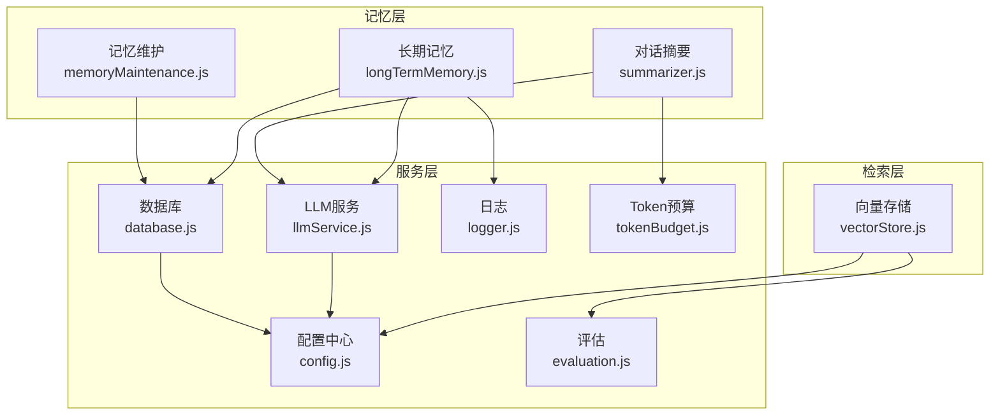
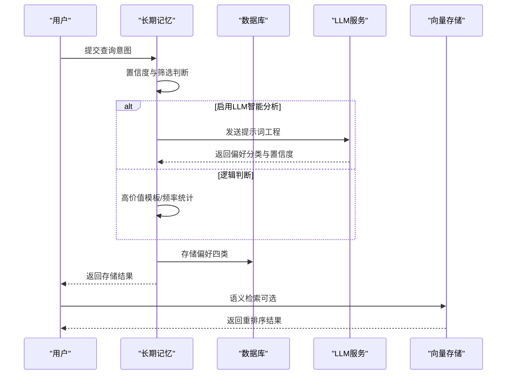
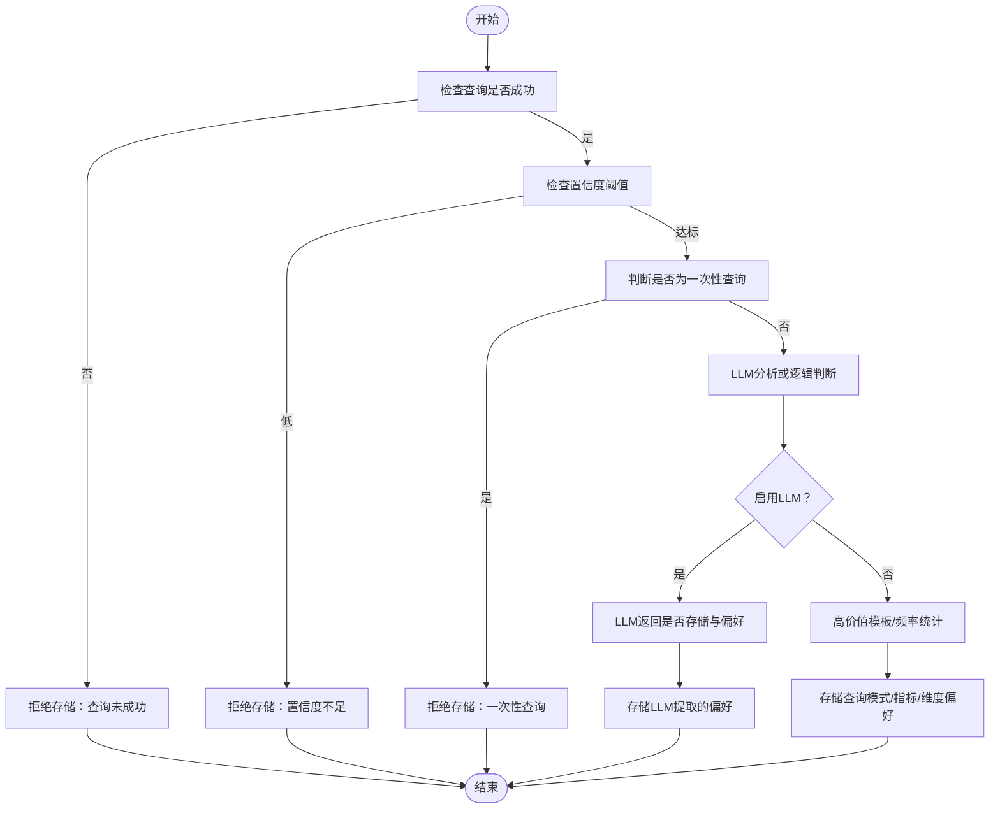
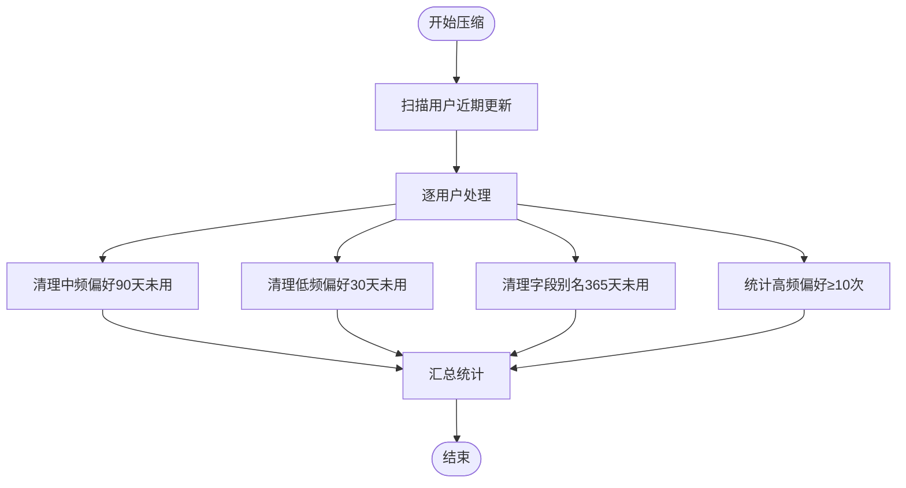
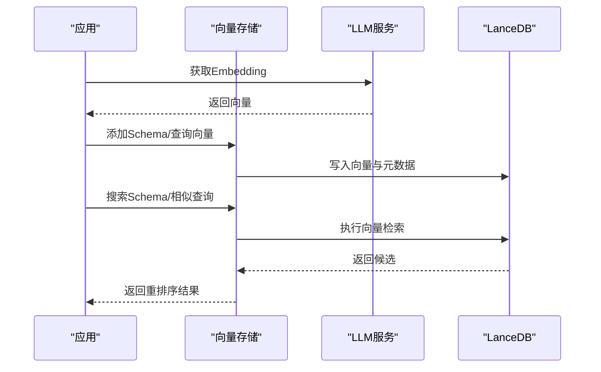
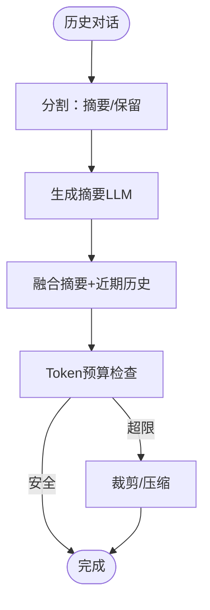
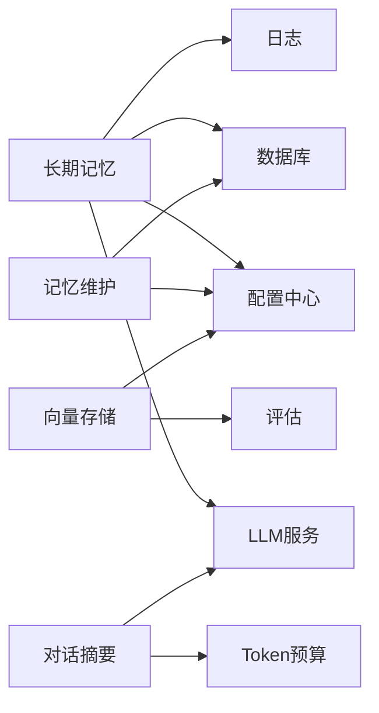

# 长期记忆管理

<cite>
**本文引用的文件**
- [longTermMemory.js](file://backend/src/memory/longTermMemory.js)
- [memoryMaintenance.js](file://backend/src/memory/memoryMaintenance.js)
- [vectorStore.js](file://backend/src/memory/vectorStore.js)
- [summarizer.js](file://backend/src/memory/summarizer.js)
- [llmService.js](file://backend/src/core/llmService.js)
- [config.js](file://backend/src/core/config.js)
- [database.js](file://backend/src/core/database.js)
- [logger.js](file://backend/src/utils/logger.js)
- [evaluation.js](file://backend/src/utils/evaluation.js)
- [tokenBudget.js](file://backend/src/utils/tokenBudget.js)
- [schema-metadata.json](file://backend/config/schema-metadata.json)
- [package.json](file://backend/package.json)
</cite>

## 目录
1. [简介](#简介)
2. [项目结构](#项目结构)
3. [核心组件](#核心组件)
4. [架构概览](#架构概览)
5. [详细组件分析](#详细组件分析)
6. [依赖分析](#依赖分析)
7. [性能考量](#性能考量)
8. [故障排查指南](#故障排查指南)
9. [结论](#结论)
10. [附录](#附录)

## 简介
本文件系统化阐述长期记忆管理模块的设计理念与实现细节，涵盖用户偏好提取、存储策略、检索机制、智能筛选与LLM智能分析。文档还提供配置选项说明、性能优化建议以及实际使用案例与最佳实践，帮助开发者与使用者高效落地与运维该模块。

## 项目结构
长期记忆管理模块位于后端工程的 memory 目录，围绕“用户偏好”这一核心数据模型，结合 SQLite 持久化与 LanceDB 向量存储，形成“结构化偏好 + 语义检索”的双轨体系。模块间通过配置中心、日志与评估工具协同工作。

图表来源
- [longTermMemory.js:1-1141](file://backend/src/memory/longTermMemory.js#L1-L1141)
- [memoryMaintenance.js:1-415](file://backend/src/memory/memoryMaintenance.js#L1-L415)
- [vectorStore.js:1-759](file://backend/src/memory/vectorStore.js#L1-L759)
- [summarizer.js:1-518](file://backend/src/memory/summarizer.js#L1-L518)
- [llmService.js:1-468](file://backend/src/core/llmService.js#L1-L468)
- [config.js:1-398](file://backend/src/core/config.js#L1-L398)
- [database.js:1-850](file://backend/src/core/database.js#L1-L850)
- [logger.js:1-442](file://backend/src/utils/logger.js#L1-L442)
- [evaluation.js:1-488](file://backend/src/utils/evaluation.js#L1-L488)
- [tokenBudget.js:1-435](file://backend/src/utils/tokenBudget.js#L1-L435)

章节来源
- [longTermMemory.js:1-1141](file://backend/src/memory/longTermMemory.js#L1-L1141)
- [memoryMaintenance.js:1-415](file://backend/src/memory/memoryMaintenance.js#L1-L415)
- [vectorStore.js:1-759](file://backend/src/memory/vectorStore.js#L1-L759)
- [summarizer.js:1-518](file://backend/src/memory/summarizer.js#L1-L518)
- [llmService.js:1-468](file://backend/src/core/llmService.js#L1-L468)
- [config.js:1-398](file://backend/src/core/config.js#L1-L398)
- [database.js:1-850](file://backend/src/core/database.js#L1-L850)
- [logger.js:1-442](file://backend/src/utils/logger.js#L1-L442)
- [evaluation.js:1-488](file://backend/src/utils/evaluation.js#L1-L488)
- [tokenBudget.js:1-435](file://backend/src/utils/tokenBudget.js#L1-L435)

## 核心组件
- 长期记忆提取与存储：负责从查询意图中提取用户偏好，进行智能筛选与存储，支持四种偏好类型。
- 记忆维护：对长期记忆进行分级保留、清理与相似模式合并，保障存储效率与质量。
- 向量存储：基于 LanceDB 的 Schema 与查询历史向量存储，提供语义检索与智能重排序。
- 对话摘要：对长对话历史进行压缩与摘要，配合 Token 预算管理，维持上下文可控。
- LLM 服务：提供聊天与 Embedding 能力，支撑智能分析与向量化。
- 配置中心：集中管理长期记忆阈值、保留策略、向量维度等关键参数。
- 数据库：SQLite 持久化用户偏好与会话历史，提供查询与统计接口。
- 日志与评估：统一日志输出与运行时统计，支持向量化质量与记忆命中率评估。

章节来源
- [longTermMemory.js:1-1141](file://backend/src/memory/longTermMemory.js#L1-L1141)
- [memoryMaintenance.js:1-415](file://backend/src/memory/memoryMaintenance.js#L1-L415)
- [vectorStore.js:1-759](file://backend/src/memory/vectorStore.js#L1-L759)
- [summarizer.js:1-518](file://backend/src/memory/summarizer.js#L1-L518)
- [llmService.js:1-468](file://backend/src/core/llmService.js#L1-L468)
- [config.js:252-293](file://backend/src/core/config.js#L252-L293)
- [database.js:137-781](file://backend/src/core/database.js#L137-L781)
- [logger.js:1-442](file://backend/src/utils/logger.js#L1-L442)
- [evaluation.js:1-488](file://backend/src/utils/evaluation.js#L1-L488)

## 架构概览
长期记忆模块采用“三层分离”设计：
- Layer 1：短期交互层（会话、消息、上下文）
- Layer 2：长期记忆层（用户偏好、存储筛选、智能分析）
- Layer 3：检索增强层（向量存储、语义搜索、智能重排序）

图表来源
- [longTermMemory.js:312-485](file://backend/src/memory/longTermMemory.js#L312-L485)
- [llmService.js:309-347](file://backend/src/core/llmService.js#L309-L347)
- [database.js:609-618](file://backend/src/core/database.js#L609-L618)
- [vectorStore.js:450-535](file://backend/src/memory/vectorStore.js#L450-L535)

## 详细组件分析

### 长期记忆提取与存储（Layer 2）
- 四种偏好类型
  - 查询模式：记录维度、指标、时间范围与过滤器组合，支持模式名称生成与去重更新。
  - 字段别名：记录用户术语到 Schema 字段或值的映射，支持伪字段与实体值映射。
  - 指标偏好：记录用户常用指标，便于默认补全。
  - 维度偏好：记录用户常用维度，便于默认补全。
- 智能筛选与阈值
  - 置信度阈值：仅存储置信度高于阈值的查询。
  - 排除一次性查询：包含具体过滤条件与绝对时间范围的简单查询不存储。
  - 高价值模板：维度≥2且指标≥1的查询模式优先存储。
  - 频繁模式：7天内出现≥2次的简单查询模式也存储。
- LLM 智能分析
  - 通过提示词工程区分“字段别名/映射”“分析习惯”“业务逻辑定义”等类别，输出置信度与理由。
  - 若启用，优先使用 LLM 判断；否则回退到逻辑判断。
- 存储决策
  - 优先存储个人偏好，通用知识不存储。
  - 相同模式/别名存在时更新使用次数，避免重复存储。

图表来源
- [longTermMemory.js:312-485](file://backend/src/memory/longTermMemory.js#L312-L485)
- [longTermMemory.js:57-189](file://backend/src/memory/longTermMemory.js#L57-L189)
- [longTermMemory.js:252-296](file://backend/src/memory/longTermMemory.js#L252-L296)

章节来源
- [longTermMemory.js:27-42](file://backend/src/memory/longTermMemory.js#L27-L42)
- [longTermMemory.js:57-189](file://backend/src/memory/longTermMemory.js#L57-L189)
- [longTermMemory.js:214-296](file://backend/src/memory/longTermMemory.js#L214-L296)
- [longTermMemory.js:312-485](file://backend/src/memory/longTermMemory.js#L312-L485)
- [longTermMemory.js:615-757](file://backend/src/memory/longTermMemory.js#L615-L757)
- [longTermMemory.js:772-807](file://backend/src/memory/longTermMemory.js#L772-L807)

### 记忆维护与清理（Layer 2）
- 分级保留策略
  - 高频（≥10次）：永久保留。
  - 中频（3-9次）：90天未用清理。
  - 低频（<3次）：30天未用清理。
  - 字段别名：365天未用清理。
- 相似模式合并
  - 基于维度/指标重合度与时间范围一致性，合并相似查询模式，提升推荐质量。
- 统计与报告
  - 提供用户记忆统计、系统健康报告，便于容量规划与优化。

图表来源
- [memoryMaintenance.js:69-189](file://backend/src/memory/memoryMaintenance.js#L69-L189)
- [memoryMaintenance.js:201-309](file://backend/src/memory/memoryMaintenance.js#L201-L309)

章节来源
- [memoryMaintenance.js:24-46](file://backend/src/memory/memoryMaintenance.js#L24-L46)
- [memoryMaintenance.js:69-189](file://backend/src/memory/memoryMaintenance.js#L69-L189)
- [memoryMaintenance.js:201-309](file://backend/src/memory/memoryMaintenance.js#L201-L309)
- [memoryMaintenance.js:320-395](file://backend/src/memory/memoryMaintenance.js#L320-L395)

### 向量存储与语义检索（Layer 3）
- Schema 向量
  - 将表/字段描述向量化，支持按元数据过滤与智能重排序。
  - 智能重排序策略：提及具体游戏时优先该游戏表；平台通用表次之；原始日志表优先于报表。
- 查询历史向量
  - 记录用户自然语言查询向量，支持相似查询检索。
- 初始化与状态
  - 延迟初始化，失败不阻断应用；提供统计与清空能力。

图表来源
- [vectorStore.js:231-322](file://backend/src/memory/vectorStore.js#L231-L322)
- [vectorStore.js:336-435](file://backend/src/memory/vectorStore.js#L336-L435)
- [vectorStore.js:542-618](file://backend/src/memory/vectorStore.js#L542-L618)
- [llmService.js:360-415](file://backend/src/core/llmService.js#L360-L415)

章节来源
- [vectorStore.js:27-82](file://backend/src/memory/vectorStore.js#L27-L82)
- [vectorStore.js:231-322](file://backend/src/memory/vectorStore.js#L231-L322)
- [vectorStore.js:336-435](file://backend/src/memory/vectorStore.js#L336-L435)
- [vectorStore.js:450-535](file://backend/src/memory/vectorStore.js#L450-L535)
- [vectorStore.js:551-618](file://backend/src/memory/vectorStore.js#L551-L618)
- [vectorStore.js:693-731](file://backend/src/memory/vectorStore.js#L693-L731)

### 对话摘要与上下文管理
- 对话摘要
  - 基于 LLM 将早期对话压缩为摘要，保留近期对话原文。
  - 支持增量更新与缓存，避免重复生成。
- Token 预算
  - 估算上下文 Token，提供预算计算、裁剪与压缩策略。
  - 超限时自动触发压缩，保证 LLM 调用稳定。

图表来源
- [summarizer.js:58-95](file://backend/src/memory/summarizer.js#L58-L95)
- [summarizer.js:109-185](file://backend/src/memory/summarizer.js#L109-L185)
- [summarizer.js:264-331](file://backend/src/memory/summarizer.js#L264-L331)
- [tokenBudget.js:115-181](file://backend/src/utils/tokenBudget.js#L115-L181)
- [tokenBudget.js:315-372](file://backend/src/utils/tokenBudget.js#L315-L372)

章节来源
- [summarizer.js:23-34](file://backend/src/memory/summarizer.js#L23-L34)
- [summarizer.js:109-185](file://backend/src/memory/summarizer.js#L109-L185)
- [summarizer.js:264-331](file://backend/src/memory/summarizer.js#L264-L331)
- [summarizer.js:450-492](file://backend/src/memory/summarizer.js#L450-L492)
- [tokenBudget.js:115-181](file://backend/src/utils/tokenBudget.js#L115-L181)
- [tokenBudget.js:315-372](file://backend/src/utils/tokenBudget.js#L315-L372)

## 依赖分析
- 外部依赖
  - LLM 服务：提供聊天与 Embedding 能力，受配置中心控制。
  - LanceDB：向量数据库，提供 Schema 与查询历史向量存储与检索。
  - SQLite：用户偏好与会话历史持久化。
- 内部依赖
  - 配置中心：集中管理长期记忆阈值、保留策略、向量维度等。
  - 日志：统一记录模块行为，便于调试与审计。
  - 评估：记录向量检索命中与长期记忆命中，支持质量评估。

图表来源
- [longTermMemory.js:17-21](file://backend/src/memory/longTermMemory.js#L17-L21)
- [memoryMaintenance.js:16-18](file://backend/src/memory/memoryMaintenance.js#L16-L18)
- [vectorStore.js:14-21](file://backend/src/memory/vectorStore.js#L14-L21)
- [summarizer.js:12-14](file://backend/src/memory/summarizer.js#L12-L14)
- [config.js:252-293](file://backend/src/core/config.js#L252-L293)
- [database.js:1-850](file://backend/src/core/database.js#L1-L850)
- [llmService.js:1-468](file://backend/src/core/llmService.js#L1-L468)
- [logger.js:1-442](file://backend/src/utils/logger.js#L1-L442)
- [evaluation.js:1-488](file://backend/src/utils/evaluation.js#L1-L488)
- [tokenBudget.js:1-435](file://backend/src/utils/tokenBudget.js#L1-L435)

章节来源
- [package.json:10-20](file://backend/package.json#L10-L20)

## 性能考量
- 存储策略
  - 使用 SQLite 索引加速偏好查询与统计，避免重复存储与冗余更新。
  - 记忆维护按使用频率分级清理，控制存储规模。
- 检索性能
  - 向量检索使用 LanceDB，支持元数据过滤与智能重排序，减少无效候选。
  - 评估模块记录距离分布与命中率，指导阈值与维度调优。
- LLM 成本控制
  - 仅在必要场景调用 LLM，避免过度使用。
  - 通过提示词工程与 JSON 解析增强鲁棒性，减少失败重试。
- 上下文控制
  - Token 预算模块提供预算计算与自动压缩，防止上下文溢出。

章节来源
- [database.js:159-164](file://backend/src/core/database.js#L159-L164)
- [memoryMaintenance.js:24-46](file://backend/src/memory/memoryMaintenance.js#L24-L46)
- [vectorStore.js:378-435](file://backend/src/memory/vectorStore.js#L378-L435)
- [evaluation.js:37-60](file://backend/src/utils/evaluation.js#L37-L60)
- [tokenBudget.js:115-181](file://backend/src/utils/tokenBudget.js#L115-L181)

## 故障排查指南
- LLM 服务异常
  - 现象：LLM 分析失败，回退到逻辑判断。
  - 排查：检查 API Key、超时与重试配置，查看日志错误堆栈。
- 向量数据库未初始化
  - 现象：向量检索返回空结果或警告。
  - 排查：确认 LanceDB 路径与权限，检查初始化状态与表存在性。
- SQLite 存储异常
  - 现象：偏好存储失败或查询超时。
  - 排查：检查表结构迁移、索引与事务，查看日志错误。
- 记忆维护未生效
  - 现象：偏好未按预期清理或合并。
  - 排查：核对保留策略配置与时间阈值，确认扫描用户范围。

章节来源
- [longTermMemory.js:185-188](file://backend/src/memory/longTermMemory.js#L185-L188)
- [vectorStore.js:231-261](file://backend/src/memory/vectorStore.js#L231-L261)
- [database.js:200-261](file://backend/src/core/database.js#L200-L261)
- [memoryMaintenance.js:84-120](file://backend/src/memory/memoryMaintenance.js#L84-L120)

## 结论
长期记忆管理模块通过“智能筛选 + 分级保留 + 语义检索”的组合，实现了对用户偏好的高效提取与利用。模块具备良好的扩展性与可观测性，可通过配置中心灵活调整阈值与策略，并借助评估与日志持续优化质量与性能。

## 附录

### 配置选项说明（长期记忆）
- 启用开关
  - LTM_ENABLED：是否启用长期记忆功能。
  - LTM_USE_LLM：是否启用 LLM 智能分析。
- 存储筛选阈值
  - minConfidence：最小置信度。
  - minDimensionsForTemplate：高价值模板最小维度数。
  - minMetricsForTemplate：高价值模板最小指标数。
  - recentDaysForFrequency：频率统计天数。
  - minFrequencyForSimple：简单查询最小频率。
- 保留策略（天）
  - highUsage：高频（≥10次）保留天数（null 表示永久）。
  - mediumUsage：中频（3-9次）保留天数。
  - lowUsage：低频（<3次）保留天数。
  - fieldAlias：字段别名保留天数。

章节来源
- [config.js:259-293](file://backend/src/core/config.js#L259-L293)

### 使用案例与最佳实践
- 案例1：字段别名学习
  - 场景：用户表达“青木是 game_id=30”，系统自动学习“青木 -> game_id=30”。
  - 建议：优先存储个人术语映射，避免通用知识入库。
- 案例2：查询模式复用
  - 场景：用户多次按“渠道+日期”查询 DAU，系统识别为高价值模板并存储。
  - 建议：合理设置阈值，避免一次性查询污染模式库。
- 案例3：智能筛选与合并
  - 场景：相似查询模式合并，减少冗余偏好。
  - 建议：定期运行记忆维护，保持模式质量。
- 案例4：向量检索重排序
  - 场景：提及具体游戏时优先返回该游戏表。
  - 建议：结合业务关键词与元数据过滤，提升检索质量。

章节来源
- [longTermMemory.js:500-568](file://backend/src/memory/longTermMemory.js#L500-L568)
- [longTermMemory.js:252-296](file://backend/src/memory/longTermMemory.js#L252-L296)
- [memoryMaintenance.js:201-309](file://backend/src/memory/memoryMaintenance.js#L201-L309)
- [vectorStore.js:450-535](file://backend/src/memory/vectorStore.js#L450-L535)