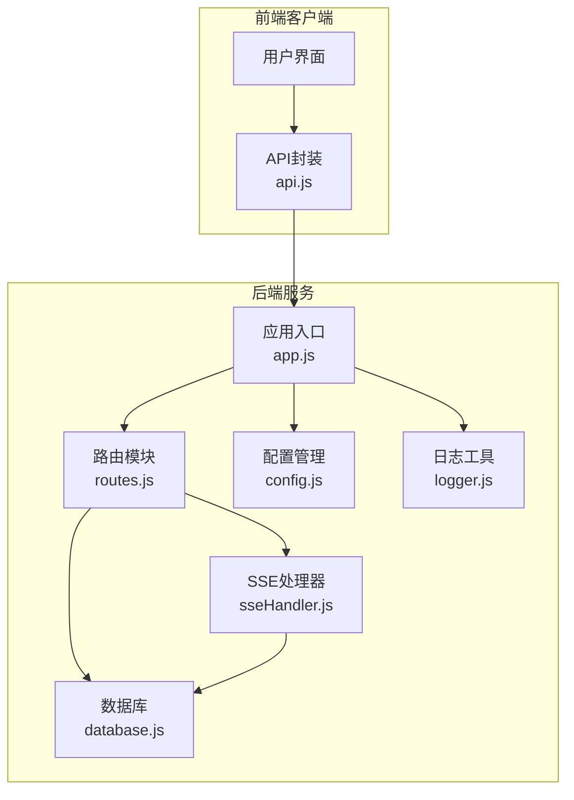
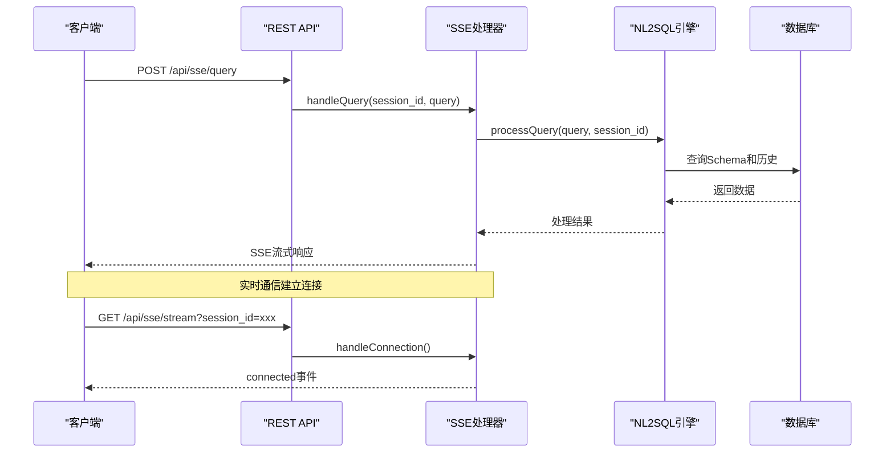
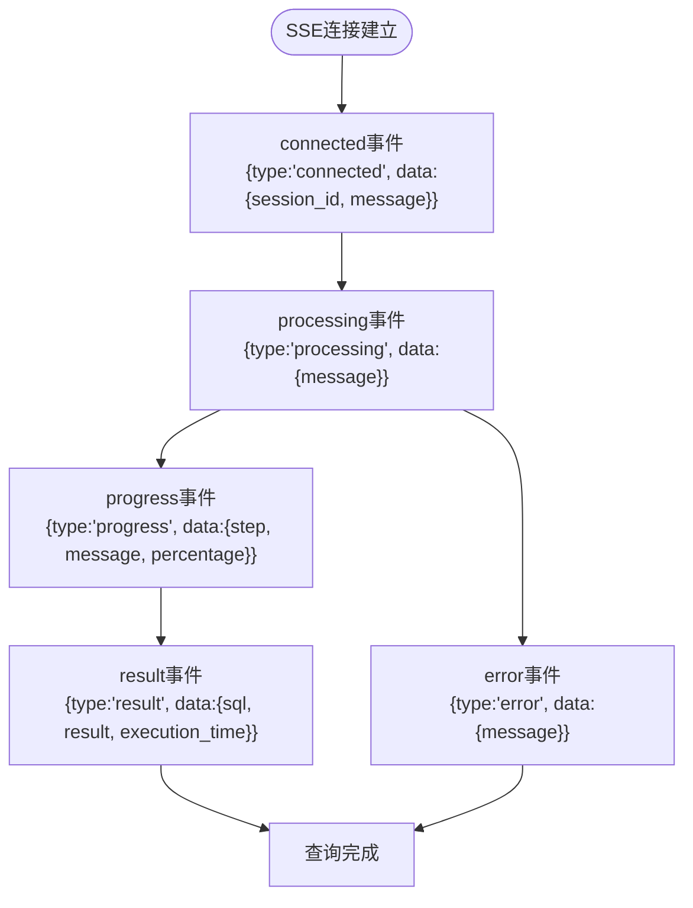
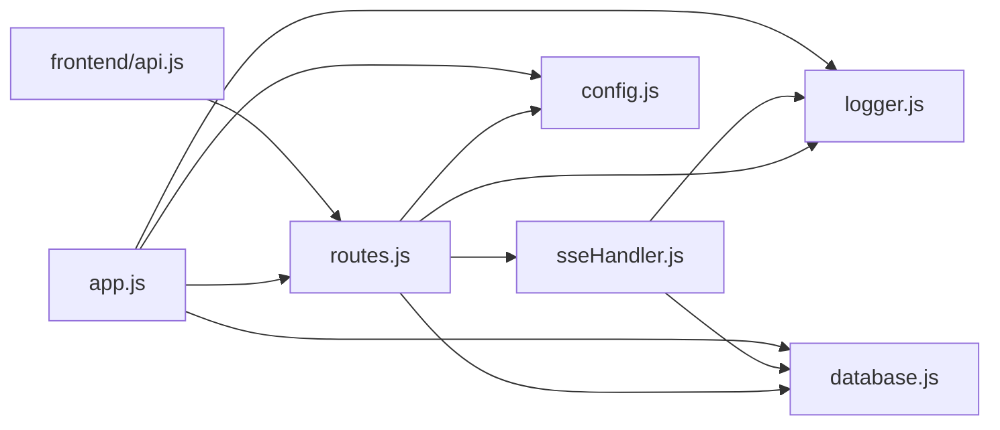

# API路由与接口

<cite>
**本文档引用的文件**
- [routes.js](file://backend/src/core/routes.js)
- [app.js](file://backend/src/app.js)
- [sseHandler.js](file://backend/src/core/sseHandler.js)
- [api.js](file://frontend/src/utils/api.js)
- [config.js](file://backend/src/core/config.js)
- [logger.js](file://backend/src/utils/logger.js)
- [database.js](file://backend/src/core/database.js)
- [schema-metadata.json](file://backend/config/schema-metadata.json)
- [business-semantic-layer.json](file://backend/config/business-semantic-layer.json)
- [package.json](file://backend/package.json)
</cite>

## 目录
1. [简介](#简介)
2. [项目结构](#项目结构)
3. [核心组件](#核心组件)
4. [架构概览](#架构概览)
5. [详细组件分析](#详细组件分析)
6. [依赖分析](#依赖分析)
7. [性能考虑](#性能考虑)
8. [故障排除指南](#故障排除指南)
9. [结论](#结论)
10. [附录](#附录)

## 简介
本文件为NL2SQL项目的API路由与接口参考文档，全面覆盖RESTful API端点、SSE实时通信接口、认证机制、请求验证、错误码定义及状态码规范，并提供完整的API使用示例和客户端集成指南。

## 项目结构
NL2SQL后端采用Express.js框架，API路由集中在`routes.js`中，SSE实时通信通过独立的`sseHandler.js`模块实现。前端通过`api.js`封装HTTP请求，统一处理错误和拦截器。



**图表来源**
- [app.js:97-194](file://backend/src/app.js#L97-L194)
- [routes.js:1-1037](file://backend/src/core/routes.js#L1-L1037)
- [sseHandler.js:1-349](file://backend/src/core/sseHandler.js#L1-L349)

**章节来源**
- [app.js:1-266](file://backend/src/app.js#L1-L266)
- [routes.js:1-1037](file://backend/src/core/routes.js#L1-L1037)

## 核心组件
- **REST API路由模块**：定义所有HTTP端点，包括健康检查、Schema查询、会话管理、查询历史、统计信息、评估接口等。
- **SSE处理器**：管理Server-Sent Events连接，实现流式消息推送和进度回调。
- **配置管理**：集中管理LLM API、数据库、安全、日志等配置项。
- **日志工具**：提供统一的日志记录功能，支持多级别日志和结构化输出。
- **数据库模块**：负责SQLite数据库的初始化和表结构管理。

**章节来源**
- [routes.js:1-1037](file://backend/src/core/routes.js#L1-L1037)
- [sseHandler.js:1-349](file://backend/src/core/sseHandler.js#L1-L349)
- [config.js:1-398](file://backend/src/core/config.js#L1-L398)
- [logger.js:1-482](file://backend/src/utils/logger.js#L1-L482)
- [database.js:1-200](file://backend/src/core/database.js#L1-L200)

## 架构概览
NL2SQL采用分层架构设计，后端通过Express中间件处理请求，路由模块定义API端点，SSE模块处理实时通信，数据库模块负责数据持久化。



**图表来源**
- [routes.js:948-1002](file://backend/src/core/routes.js#L948-L1002)
- [sseHandler.js:43-112](file://backend/src/core/sseHandler.js#L43-L112)

## 详细组件分析

### REST API端点定义

#### 健康检查接口
- **GET /api/health**：基础健康检查
  - 响应：状态、时间戳、版本、运行时间、内存使用情况
- **GET /api/health/detail**：详细健康检查，包含数据库、LLM、Schema、SSE连接状态

#### Schema接口
- **GET /api/schema**：获取完整Schema信息
  - 查询参数：type（tables/metrics/dimensions）
  - 响应：根据type返回相应数据结构
- **GET /api/schema/tables/:tableName**：获取指定表的详细信息
  - 响应：表定义和关联表信息
- **GET /api/schema/search**：搜索Schema
  - 查询参数：q（关键词）、limit（结果数量限制）

#### 会话管理接口
- **POST /api/sessions**：创建新会话
  - 请求体：user_id、title
  - 响应：创建的会话信息（201状态码）
- **GET /api/sessions/:sessionId**：获取会话信息
- **DELETE /api/sessions/:sessionId**：删除会话
- **GET /api/sessions/:sessionId/messages**：获取会话消息历史
  - 查询参数：limit（消息数量限制）
- **GET /api/users/:userId/sessions**：获取用户的所有会话

#### 查询历史接口
- **GET /api/queries/history**：获取查询历史
  - 查询参数：user_id、session_id、limit

#### 用户偏好（长期记忆）接口
- **GET /api/preferences/:userId/raw**：获取用户长期记忆原始数据
- **GET /api/preferences/:userId/stats**：获取用户记忆统计
- **GET /api/preferences/:userId**：获取用户偏好列表
  - 查询参数：type、limit
- **POST /api/preferences/:userId/templates**：手动添加查询模板
  - 请求体：模板名称、维度、指标、默认时间范围
- **DELETE /api/preferences/:preferenceId**：删除用户偏好
- **POST /api/preferences/:userId/learn-alias**：手动学习字段别名
  - 请求体：用户术语、Schema字段、字段类型

#### 评估接口
- **GET /api/evaluation/stats**：获取运行时统计报告
- **POST /api/evaluation/stats/reset**：重置统计数据
- **POST /api/evaluation/schema-quality**：执行Schema向量化质量评估
  - 请求体：testQueries（测试查询列表）
- **POST /api/evaluation/query-quality**：执行查询历史向量化质量评估
  - 请求体：testPairs（测试查询对）
- **GET /api/evaluation/config**：获取评估配置

#### 统计信息接口
- **GET /api/stats**：获取服务统计信息，包括今日查询统计、连接数、Schema统计等

#### 配置接口
- **GET /api/config**：获取公开配置信息（不含敏感信息）

**章节来源**
- [routes.js:60-137](file://backend/src/core/routes.js#L60-L137)
- [routes.js:143-250](file://backend/src/core/routes.js#L143-L250)
- [routes.js:256-398](file://backend/src/core/routes.js#L256-L398)
- [routes.js:404-450](file://backend/src/core/routes.js#L404-L450)
- [routes.js:456-664](file://backend/src/core/routes.js#L456-L664)
- [routes.js:722-841](file://backend/src/core/routes.js#L722-L841)
- [routes.js:862-942](file://backend/src/core/routes.js#L862-L942)

### SSE实时通信接口

#### 连接建立
- **GET /api/sse/stream**：建立Server-Sent Events连接
  - 查询参数：session_id（必需）、user_id（可选，默认anonymous）
  - 响应：SSE流式响应，设置适当的HTTP头部

#### 查询处理
- **POST /api/sse/query**：发送查询请求
  - 请求体：session_id、query
  - 处理流程：异步处理查询，结果通过SSE推送

#### 消息格式
SSE消息采用JSON格式，包含以下事件类型：



**图表来源**
- [sseHandler.js:95-101](file://backend/src/core/sseHandler.js#L95-L101)
- [sseHandler.js:243-265](file://backend/src/core/sseHandler.js#L243-L265)

#### 连接管理
- 支持多标签页连接（同一session_id允许多个连接）
- 自动清理断开的连接
- 连接状态监控和统计

**章节来源**
- [routes.js:948-1002](file://backend/src/core/routes.js#L948-L1002)
- [sseHandler.js:26-153](file://backend/src/core/sseHandler.js#L26-L153)

### 认证机制
- **API密钥认证**：通过环境变量配置LLM API密钥
- **CORS配置**：允许跨域访问（开发环境配置为*）
- **请求验证**：中间件自动记录请求日志和基本验证

**章节来源**
- [config.js:60-74](file://backend/src/core/config.js#L60-L74)
- [app.js:65](file://backend/src/app.js#L65)
- [routes.js:46-54](file://backend/src/core/routes.js#L46-L54)

### 请求验证与错误处理
- **参数验证**：对必需参数进行验证（如session_id、query）
- **会话验证**：检查会话是否存在
- **错误响应**：统一的错误响应格式，包含错误信息和状态码
- **全局错误处理**：捕获未处理的异常和404错误

**章节来源**
- [routes.js:46-54](file://backend/src/core/routes.js#L46-L54)
- [routes.js:976-1001](file://backend/src/core/routes.js#L976-L1001)
- [routes.js:1012-1030](file://backend/src/core/routes.js#L1012-L1030)

### 状态码规范
- **200 OK**：请求成功
- **201 Created**：资源创建成功
- **400 Bad Request**：请求参数错误
- **404 Not Found**：资源不存在
- **500 Internal Server Error**：服务器内部错误
- **503 Service Unavailable**：服务不可用（健康检查异常）

**章节来源**
- [routes.js:93-94](file://backend/src/core/routes.js#L93-L94)
- [routes.js:130-134](file://backend/src/core/routes.js#L130-L134)
- [routes.js:284-289](file://backend/src/core/routes.js#L284-L289)

## 依赖分析



**图表来源**
- [routes.js:16-29](file://backend/src/core/routes.js#L16-L29)
- [app.js:39-50](file://backend/src/app.js#L39-L50)

**章节来源**
- [routes.js:16-29](file://backend/src/core/routes.js#L16-L29)
- [app.js:39-50](file://backend/src/app.js#L39-L50)

## 性能考虑
- **连接池管理**：数据库连接池配置，支持并发连接
- **查询限制**：最大查询行数限制，防止内存溢出
- **超时控制**：查询超时设置，避免长时间阻塞
- **缓存策略**：Schema元数据缓存，减少重复加载
- **日志优化**：可配置的日志级别，平衡性能和调试需求

**章节来源**
- [config.js:115-130](file://backend/src/core/config.js#L115-L130)
- [config.js:150-170](file://backend/src/core/config.js#L150-L170)
- [config.js:240-250](file://backend/src/core/config.js#L240-L250)

## 故障排除指南

### 常见问题诊断
1. **连接失败**：检查session_id参数是否正确传递
2. **查询无响应**：确认会话状态和数据库连接
3. **SSE连接中断**：检查网络连接和服务器状态
4. **权限错误**：验证API密钥配置和白名单设置

### 日志分析
- **TRACE级别**：详细流程追踪，用于深度调试
- **DEBUG级别**：开发调试信息
- **INFO级别**：一般运行信息
- **WARN级别**：潜在问题警告
- **ERROR级别**：错误信息和异常堆栈

### 性能监控
- **健康检查**：定期检查服务状态
- **连接统计**：监控SSE连接数量
- **查询统计**：跟踪查询性能指标
- **内存使用**：监控内存使用情况

**章节来源**
- [logger.js:29-44](file://backend/src/utils/logger.js#L29-L44)
- [routes.js:100-137](file://backend/src/core/routes.js#L100-L137)
- [sseHandler.js:291-318](file://backend/src/core/sseHandler.js#L291-L318)

## 结论
NL2SQL项目提供了完整的RESTful API和SSE实时通信解决方案，具有清晰的架构设计、完善的错误处理机制和丰富的配置选项。通过本文档的接口参考和最佳实践指导，开发者可以快速集成和调试NL2SQL服务。

## 附录

### API使用示例

#### 健康检查
```javascript
// 基础健康检查
fetch('/api/health')
  .then(response => response.json())
  .then(data => console.log(data));

// 详细健康检查
fetch('/api/health/detail')
  .then(response => response.json())
  .then(data => console.log(data));
```

#### Schema查询
```javascript
// 获取完整Schema
fetch('/api/schema')
  .then(response => response.json())
  .then(data => console.log(data));

// 搜索Schema
fetch('/api/schema/search?q=销售额&limit=5')
  .then(response => response.json())
  .then(data => console.log(data));
```

#### 会话管理
```javascript
// 创建新会话
fetch('/api/sessions', {
  method: 'POST',
  headers: {'Content-Type': 'application/json'},
  body: JSON.stringify({user_id: 'user123', title: '新会话'})
})
.then(response => response.json())
.then(data => console.log(data));

// 获取会话消息
fetch('/api/sessions/{sessionId}/messages?limit=50')
  .then(response => response.json())
  .then(data => console.log(data));
```

#### SSE实时查询
```javascript
// 建立SSE连接
const eventSource = new EventSource('/api/sse/stream?session_id=xxx');

eventSource.onmessage = function(event) {
  const data = JSON.parse(event.data);
  console.log('收到消息:', data);
};

// 发送查询请求
fetch('/api/sse/query', {
  method: 'POST',
  headers: {'Content-Type': 'application/json'},
  body: JSON.stringify({
    session_id: 'xxx',
    query: '查询上个月的销售额'
  })
})
.then(response => response.json())
.then(data => console.log(data));
```

### 客户端集成指南

#### 前端集成步骤
1. **安装依赖**：确保axios库可用
2. **配置API客户端**：设置baseURL为'/api'
3. **实现错误处理**：使用响应拦截器统一处理错误
4. **集成SSE**：使用EventSource API处理实时通信
5. **状态管理**：维护会话状态和消息历史

#### 最佳实践
- **错误处理**：始终检查响应状态和错误信息
- **超时设置**：合理设置请求超时时间
- **重试机制**：实现适当的重试逻辑
- **缓存策略**：对静态数据实施缓存
- **安全考虑**：避免在客户端暴露敏感信息

**章节来源**
- [api.js:25-88](file://frontend/src/utils/api.js#L25-L88)
- [api.js:246-251](file://frontend/src/utils/api.js#L246-L251)