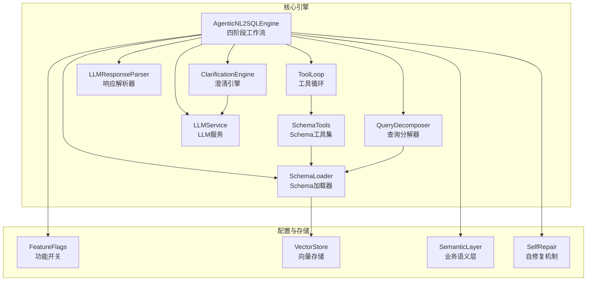
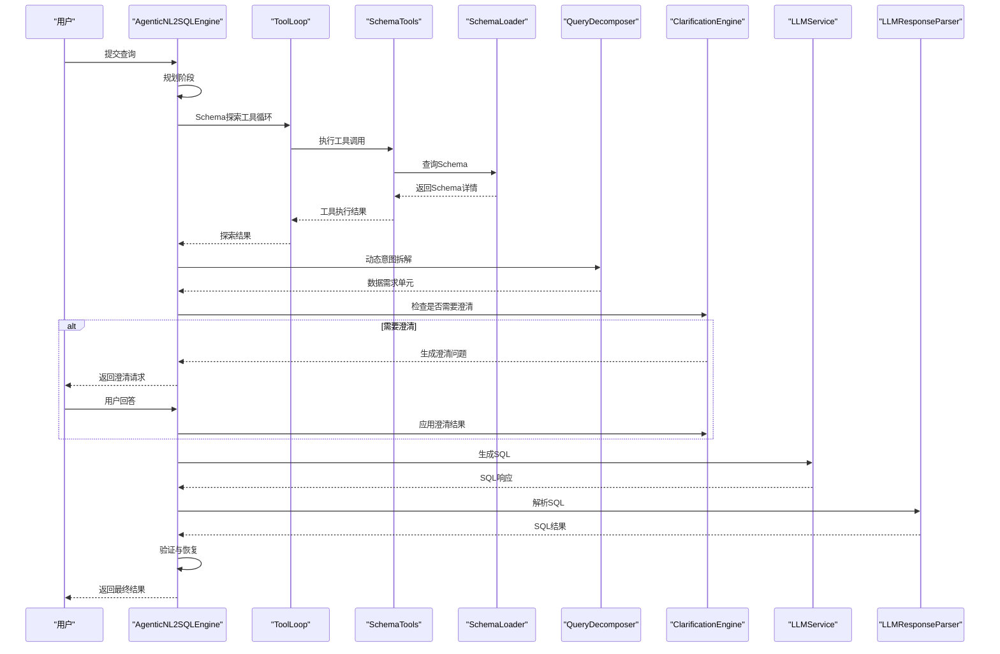
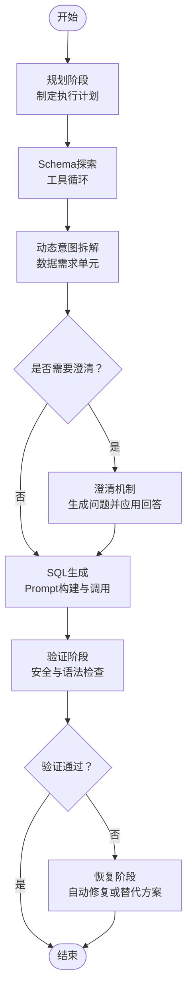
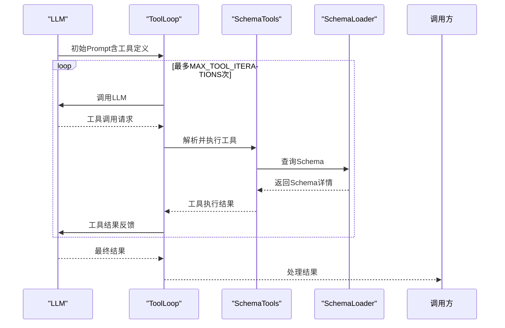
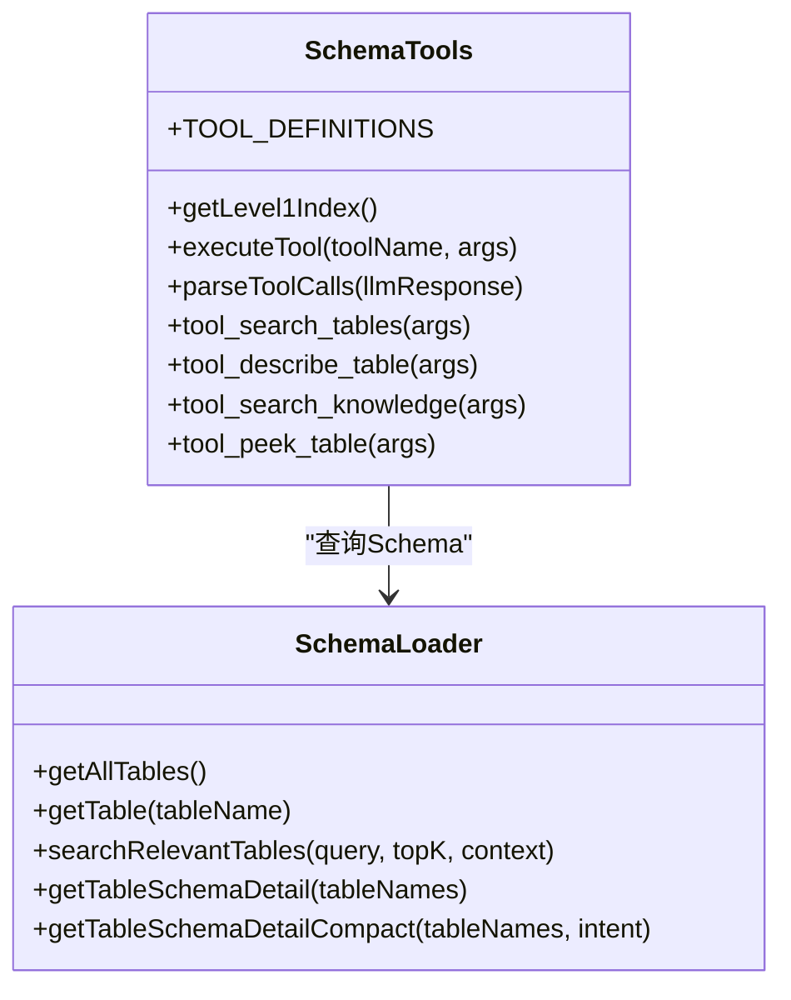
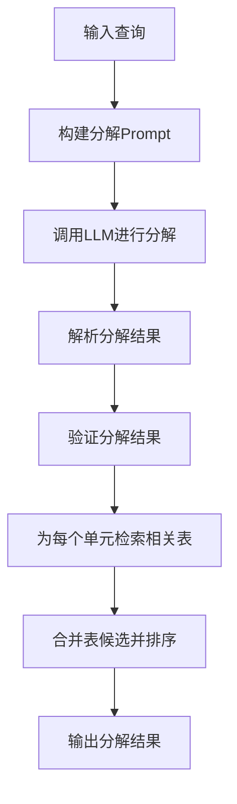
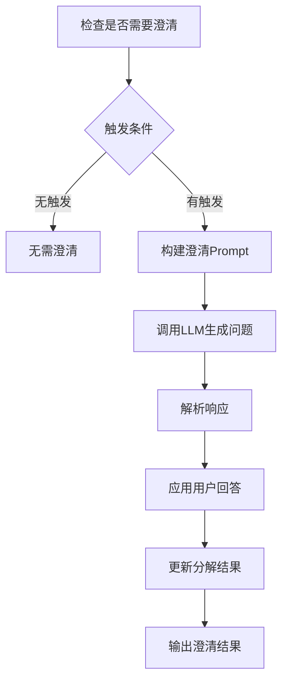
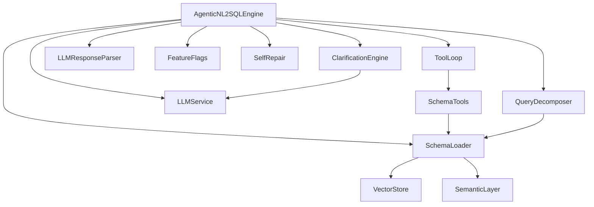

# Agent智能代理引擎

<cite>
**本文档引用的文件**
- [agenticEngine.js](file://backend/src/core/agenticEngine.js)
- [toolLoop.js](file://backend/src/core/toolLoop.js)
- [schemaTools.js](file://backend/src/core/schemaTools.js)
- [schemaLoader.js](file://backend/src/core/schemaLoader.js)
- [clarificationEngine.js](file://backend/src/core/clarificationEngine.js)
- [queryDecomposer.js](file://backend/src/core/queryDecomposer.js)
- [llmService.js](file://backend/src/core/llmService.js)
- [llmResponseParser.js](file://backend/src/utils/llmResponseParser.js)
- [feature-flags.js](file://backend/config/feature-flags.js)
- [vectorStore.js](file://backend/src/memory/vectorStore.js)
- [semanticLayer.js](file://backend/src/core/semanticLayer.js)
- [selfRepair.js](file://backend/src/core/selfRepair.js)
</cite>

## 目录
1. [简介](#简介)
2. [项目结构](#项目结构)
3. [核心组件](#核心组件)
4. [架构总览](#架构总览)
5. [详细组件分析](#详细组件分析)
6. [依赖关系分析](#依赖关系分析)
7. [性能考量](#性能考量)
8. [故障排查指南](#故障排查指南)
9. [结论](#结论)

## 简介
本项目是一个基于四阶段Agent工作流的智能代理引擎，能够将自然语言查询转化为结构化SQL。该引擎通过工具循环机制实现Schema探索、动态意图拆解、澄清机制以及多步推理与自我修正，具备高度的智能化决策能力与扩展性。

## 项目结构
后端采用模块化设计，核心模块分布如下：
- 核心引擎模块：agenticEngine.js、toolLoop.js、schemaTools.js、schemaLoader.js、clarificationEngine.js、queryDecomposer.js、llmService.js、llmResponseParser.js
- 配置与功能开关：feature-flags.js
- 记忆与向量存储：vectorStore.js、semanticLayer.js、selfRepair.js
- 前端界面：Vue组件（SchemaViewer.vue、ChatView.vue等）

**图表来源**
- [agenticEngine.js:1-651](file://backend/src/core/agenticEngine.js#L1-L651)
- [toolLoop.js:1-521](file://backend/src/core/toolLoop.js#L1-L521)
- [schemaTools.js:1-632](file://backend/src/core/schemaTools.js#L1-L632)
- [schemaLoader.js:1-1235](file://backend/src/core/schemaLoader.js#L1-L1235)
- [clarificationEngine.js:1-489](file://backend/src/core/clarificationEngine.js#L1-L489)
- [queryDecomposer.js:1-402](file://backend/src/core/queryDecomposer.js#L1-L402)
- [llmService.js:1-477](file://backend/src/core/llmService.js#L1-L477)
- [llmResponseParser.js:1-146](file://backend/src/utils/llmResponseParser.js#L1-L146)
- [feature-flags.js:1-249](file://backend/config/feature-flags.js#L1-L249)
- [vectorStore.js:1-948](file://backend/src/memory/vectorStore.js#L1-L948)
- [semanticLayer.js:1-532](file://backend/src/core/semanticLayer.js#L1-L532)
- [selfRepair.js:1-489](file://backend/src/core/selfRepair.js#L1-L489)

**章节来源**
- [agenticEngine.js:1-651](file://backend/src/core/agenticEngine.js#L1-L651)
- [feature-flags.js:1-249](file://backend/config/feature-flags.js#L1-L249)

## 核心组件
- 四阶段Agentic工作流：规划、Schema探索、动态意图拆解、澄清与生成验证恢复
- 工具循环机制：LLM通过工具调用Schema工具集进行Schema探索
- Schema工具集：search_tables、describe_table、search_knowledge、peek_table
- 澄清引擎：基于置信度触发澄清，生成友好问题并应用用户回答
- 查询分解器：将复杂查询动态拆解为数据需求单元
- LLM服务与响应解析：统一的LLM调用与JSON/SQL解析
- 功能开关：灵活控制各阶段功能启用

**章节来源**
- [agenticEngine.js:1-651](file://backend/src/core/agenticEngine.js#L1-L651)
- [toolLoop.js:1-521](file://backend/src/core/toolLoop.js#L1-L521)
- [schemaTools.js:1-632](file://backend/src/core/schemaTools.js#L1-L632)
- [clarificationEngine.js:1-489](file://backend/src/core/clarificationEngine.js#L1-L489)
- [queryDecomposer.js:1-402](file://backend/src/core/queryDecomposer.js#L1-L402)
- [llmService.js:1-477](file://backend/src/core/llmService.js#L1-L477)
- [llmResponseParser.js:1-146](file://backend/src/utils/llmResponseParser.js#L1-L146)
- [feature-flags.js:1-249](file://backend/config/feature-flags.js#L1-L249)

## 架构总览
Agent智能代理引擎采用分层架构，核心流程如下：
1. 规划阶段：分析用户查询，制定执行计划
2. Schema探索：使用工具循环探索数据库Schema
3. 动态意图拆解：将查询拆解为数据需求单元
4. 澄清机制：当置信度不足时主动询问用户
5. 生成与验证：生成SQL并进行安全与语法验证
6. 自我修正：失败时自动尝试修复或提供替代方案

**图表来源**
- [agenticEngine.js:68-178](file://backend/src/core/agenticEngine.js#L68-L178)
- [toolLoop.js:57-185](file://backend/src/core/toolLoop.js#L57-L185)
- [schemaTools.js:565-602](file://backend/src/core/schemaTools.js#L565-L602)
- [schemaLoader.js:571-653](file://backend/src/core/schemaLoader.js#L571-L653)
- [queryDecomposer.js:38-70](file://backend/src/core/queryDecomposer.js#L38-L70)
- [clarificationEngine.js:196-232](file://backend/src/core/clarificationEngine.js#L196-L232)
- [llmService.js:222-308](file://backend/src/core/llmService.js#L222-L308)
- [llmResponseParser.js:24-59](file://backend/src/utils/llmResponseParser.js#L24-L59)

## 详细组件分析

### 四阶段Agentic工作流
AgenticNL2SQLEngine实现了完整的四阶段工作流，包含Plan → Act → Observe循环与自我修正能力。

**图表来源**
- [agenticEngine.js:68-178](file://backend/src/core/agenticEngine.js#L68-L178)
- [agenticEngine.js:345-618](file://backend/src/core/agenticEngine.js#L345-L618)

**章节来源**
- [agenticEngine.js:1-651](file://backend/src/core/agenticEngine.js#L1-L651)

### 工具循环机制
工具循环机制允许LLM在多轮交互中主动探索Schema，实现"按需索取"的智能探索。

**图表来源**
- [toolLoop.js:57-185](file://backend/src/core/toolLoop.js#L57-L185)
- [schemaTools.js:585-602](file://backend/src/core/schemaTools.js#L585-L602)
- [schemaLoader.js:571-653](file://backend/src/core/schemaLoader.js#L571-L653)

**章节来源**
- [toolLoop.js:1-521](file://backend/src/core/toolLoop.js#L1-L521)
- [schemaTools.js:1-632](file://backend/src/core/schemaTools.js#L1-L632)

### Schema工具集设计与使用
Schema工具集提供了四个核心工具，支持按需探索数据库Schema。

**图表来源**
- [schemaTools.js:40-124](file://backend/src/core/schemaTools.js#L40-L124)
- [schemaTools.js:225-393](file://backend/src/core/schemaTools.js#L225-L393)
- [schemaLoader.js:441-473](file://backend/src/core/schemaLoader.js#L441-L473)
- [schemaLoader.js:571-653](file://backend/src/core/schemaLoader.js#L571-L653)
- [schemaLoader.js:790-825](file://backend/src/core/schemaLoader.js#L790-L825)
- [schemaLoader.js:838-903](file://backend/src/core/schemaLoader.js#L838-L903)

**章节来源**
- [schemaTools.js:1-632](file://backend/src/core/schemaTools.js#L1-L632)
- [schemaLoader.js:1-1235](file://backend/src/core/schemaLoader.js#L1-L1235)

### 动态意图拆解
查询分解器将复杂查询拆解为可独立检索的数据需求单元，支持任意复杂度的查询。

**图表来源**
- [queryDecomposer.js:38-70](file://backend/src/core/queryDecomposer.js#L38-L70)
- [queryDecomposer.js:255-298](file://backend/src/core/queryDecomposer.js#L255-L298)
- [queryDecomposer.js:348-382](file://backend/src/core/queryDecomposer.js#L348-L382)

**章节来源**
- [queryDecomposer.js:1-402](file://backend/src/core/queryDecomposer.js#L1-L402)

### 澄清机制
澄清引擎基于置信度触发澄清，生成友好问题并应用用户回答，提升查询准确性。

**图表来源**
- [clarificationEngine.js:196-232](file://backend/src/core/clarificationEngine.js#L196-L232)
- [clarificationEngine.js:246-272](file://backend/src/core/clarificationEngine.js#L246-L272)
- [clarificationEngine.js:388-426](file://backend/src/core/clarificationEngine.js#L388-L426)

**章节来源**
- [clarificationEngine.js:1-489](file://backend/src/core/clarificationEngine.js#L1-L489)

### LLM服务与响应解析
统一的LLM服务提供聊天、Embedding、工具定义辅助等功能，并通过响应解析器标准化JSON和SQL提取。

**章节来源**
- [llmService.js:1-477](file://backend/src/core/llmService.js#L1-L477)
- [llmResponseParser.js:1-146](file://backend/src/utils/llmResponseParser.js#L1-L146)

### 功能开关与扩展机制
通过功能开关实现渐进式启用，支持快速回滚与阶段化上线。

**章节来源**
- [feature-flags.js:1-249](file://backend/config/feature-flags.js#L1-L249)

## 依赖关系分析

**图表来源**
- [agenticEngine.js:20-29](file://backend/src/core/agenticEngine.js#L20-L29)
- [toolLoop.js:16-21](file://backend/src/core/toolLoop.js#L16-L21)
- [schemaTools.js:17-20](file://backend/src/core/schemaTools.js#L17-L20)
- [schemaLoader.js:24-27](file://backend/src/core/schemaLoader.js#L24-L27)
- [vectorStore.js:15-24](file://backend/src/memory/vectorStore.js#L15-L24)
- [semanticLayer.js:14-18](file://backend/src/core/semanticLayer.js#L14-L18)
- [selfRepair.js:22-27](file://backend/src/core/selfRepair.js#L22-L27)

**章节来源**
- [agenticEngine.js:1-651](file://backend/src/core/agenticEngine.js#L1-L651)
- [toolLoop.js:1-521](file://backend/src/core/toolLoop.js#L1-L521)
- [schemaTools.js:1-632](file://backend/src/core/schemaTools.js#L1-L632)
- [schemaLoader.js:1-1235](file://backend/src/core/schemaLoader.js#L1-L1235)
- [vectorStore.js:1-948](file://backend/src/memory/vectorStore.js#L1-L948)
- [semanticLayer.js:1-532](file://backend/src/core/semanticLayer.js#L1-L532)
- [selfRepair.js:1-489](file://backend/src/core/selfRepair.js#L1-L489)

## 性能考量
- 工具循环限制：最大迭代次数与超时控制，防止无限循环
- Schema缓存：Level 1索引缓存与Schema缓存过期控制
- 向量存储：基于LanceDB的语义搜索，支持智能重排序
- LLM调用重试：带指数退避的重试机制
- 功能开关：按需启用新功能，降低部署风险

**章节来源**
- [toolLoop.js:26-36](file://backend/src/core/toolLoop.js#L26-L36)
- [schemaLoader.js:949-959](file://backend/src/core/schemaLoader.js#L949-L959)
- [vectorStore.js:452-576](file://backend/src/memory/vectorStore.js#L452-L576)
- [llmService.js:167-195](file://backend/src/core/llmService.js#L167-L195)
- [feature-flags.js:1-249](file://backend/config/feature-flags.js#L1-L249)

## 故障排查指南
- 工具循环失败：检查LLM API配置、工具定义与SchemaLoader状态
- Schema搜索异常：验证Schema配置文件、向量存储初始化状态
- 澄清问题生成失败：检查LLM响应格式与澄清模板
- SQL验证失败：检查安全关键字过滤与表存在性验证
- 功能开关问题：确认环境变量配置与开关状态

**章节来源**
- [toolLoop.js:176-184](file://backend/src/core/toolLoop.js#L176-L184)
- [schemaLoader.js:83-131](file://backend/src/core/schemaLoader.js#L83-L131)
- [clarificationEngine.js:266-272](file://backend/src/core/clarificationEngine.js#L266-L272)
- [agenticEngine.js:438-495](file://backend/src/core/agenticEngine.js#L438-L495)
- [feature-flags.js:108-121](file://backend/config/feature-flags.js#L108-L121)

## 结论
Agent智能代理引擎通过四阶段工作流与工具循环机制，实现了智能化的Schema探索与SQL生成。其模块化设计与功能开关机制确保了系统的可扩展性与稳定性，适合在复杂业务场景中部署与演进。