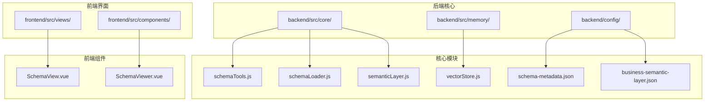
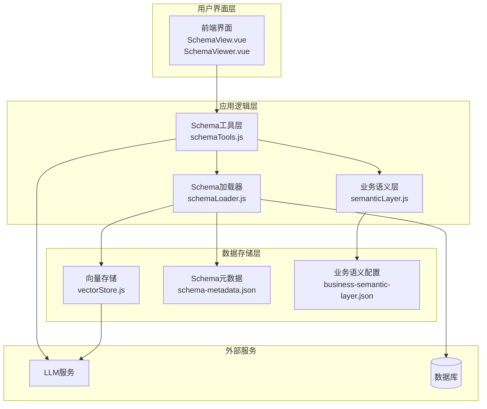
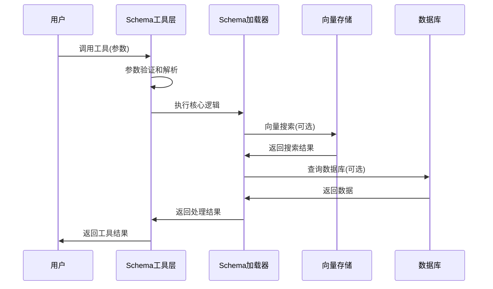
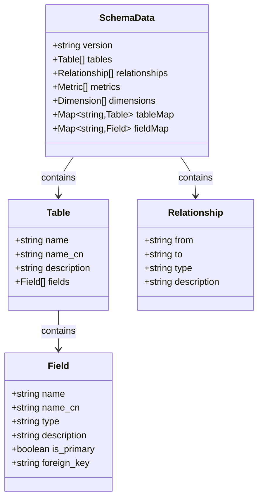
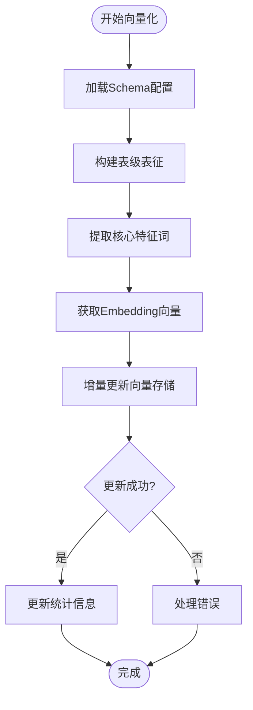
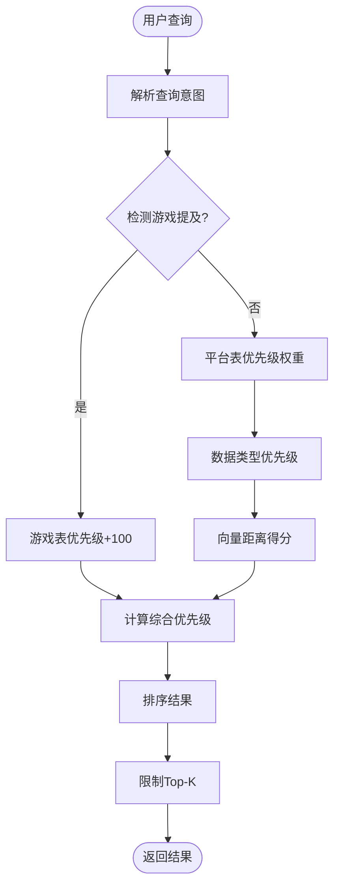
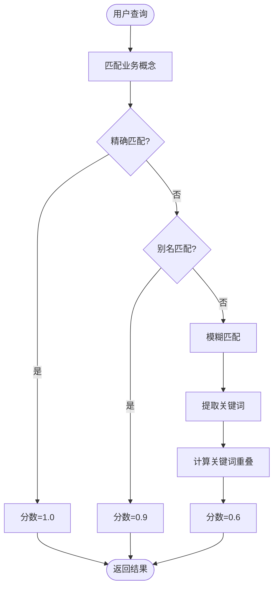
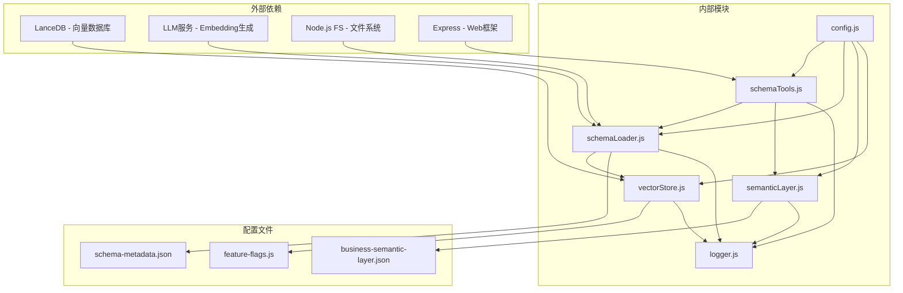

# Schema探索与发现

<cite>
**本文档引用的文件**
- [schemaTools.js](file://backend/src/core/schemaTools.js)
- [schemaLoader.js](file://backend/src/core/schemaLoader.js)
- [vectorStore.js](file://backend/src/memory/vectorStore.js)
- [schema-metadata.json](file://backend/config/schema-metadata.json)
- [semanticLayer.js](file://backend/src/core/semanticLayer.js)
- [business-semantic-layer.json](file://backend/config/business-semantic-layer.json)
- [SchemaView.vue](file://frontend/src/views/SchemaView.vue)
- [SchemaViewer.vue](file://frontend/src/components/SchemaViewer.vue)
</cite>

## 目录
1. [简介](#简介)
2. [项目结构](#项目结构)
3. [核心组件](#核心组件)
4. [架构概览](#架构概览)
5. [详细组件分析](#详细组件分析)
6. [依赖关系分析](#依赖关系分析)
7. [性能考量](#性能考量)
8. [故障排除指南](#故障排除指南)
9. [结论](#结论)

## 简介

Schema探索与发现功能是NL2SQL系统的核心组件，旨在为用户提供智能化的数据库表结构探索和推荐能力。该系统通过多层架构设计，结合向量数据库技术和业务语义层，实现了从Level 1索引到Level 2详细信息的渐进式Schema探索，以及基于用户查询的智能表推荐和字段匹配功能。

该系统的主要特点包括：
- **分层Schema加载**：Level 1索引（极简版）和Level 2详情（按需加载）
- **智能搜索**：基于向量数据库的语义搜索和相似度计算
- **业务语义理解**：将业务概念映射到物理表结构
- **LLM工具集成**：提供search_tables、describe_table、search_knowledge、peek_table四个核心工具
- **关系推理**：基于表间关系的智能推荐

## 项目结构

NL2SQL项目的Schema探索与发现功能主要分布在以下目录结构中：

**图表来源**
- [schemaTools.js:1-632](file://backend/src/core/schemaTools.js#L1-L632)
- [schemaLoader.js:1-1235](file://backend/src/core/schemaLoader.js#L1-L1235)
- [vectorStore.js:1-948](file://backend/src/memory/vectorStore.js#L1-L948)

**章节来源**
- [schemaTools.js:1-632](file://backend/src/core/schemaTools.js#L1-L632)
- [schemaLoader.js:1-1235](file://backend/src/core/schemaLoader.js#L1-L1235)
- [vectorStore.js:1-948](file://backend/src/memory/vectorStore.js#L1-L948)

## 核心组件

### Schema工具层（Phase 1）

Schema工具层提供了LLM可调用的Schema探索工具，采用"按需索取"而非"一次性灌输"的设计理念。该层包含四个核心工具：

1. **search_tables** - 根据关键词搜索相关表
2. **describe_table** - 获取指定表的详细字段信息
3. **search_knowledge** - 查询业务概念的定义和映射
4. **peek_table** - 查看表的前N行样例数据

每个工具都经过精心设计，具有以下特性：
- **安全性**：peek_table工具仅返回结构信息，不返回实际数据
- **灵活性**：支持参数化查询和结果过滤
- **可扩展性**：易于添加新的工具和功能

**章节来源**
- [schemaTools.js:36-124](file://backend/src/core/schemaTools.js#L36-L124)
- [schemaTools.js:217-393](file://backend/src/core/schemaTools.js#L217-L393)

### Schema加载器

Schema加载器负责加载和管理数据表的Schema信息，具备以下核心功能：

1. **配置文件加载**：从JSON配置文件读取表结构定义
2. **缓存管理**：提供Schema信息的缓存和失效机制
3. **查询接口**：提供多种查询和匹配接口
4. **向量化支持**：将Schema信息转换为向量表示

加载器采用分层设计：
- **Level 1索引**：仅包含表名+业务注释，用于初步筛选
- **Level 2详情**：按需加载详细的表结构信息

**章节来源**
- [schemaLoader.js:69-131](file://backend/src/core/schemaLoader.js#L69-L131)
- [schemaLoader.js:1039-1078](file://backend/src/core/schemaLoader.js#L1039-L1078)

### 向量存储模块

向量存储模块基于LanceDB实现，提供语义相似度搜索功能：

1. **表级向量化**：每个表生成一个向量表示
2. **智能搜索**：根据查询意图识别和重排序
3. **元数据过滤**：支持基于域标签和数据类型的过滤
4. **增量更新**：支持增量更新而非全量重建

**章节来源**
- [vectorStore.js:206-324](file://backend/src/memory/vectorStore.js#L206-L324)
- [vectorStore.js:440-576](file://backend/src/memory/vectorStore.js#L440-L576)

### 业务语义层

业务语义层实现了业务概念到物理表/字段的映射：

1. **概念匹配**：支持精确匹配、别名匹配和模糊匹配
2. **表推荐**：基于匹配到的概念推荐相关表
3. **数据源映射**：将业务概念映射到具体的数据源
4. **查询模式识别**：识别常见的查询模式和模板

**章节来源**
- [semanticLayer.js:48-115](file://backend/src/core/semanticLayer.js#L48-L115)
- [semanticLayer.js:238-306](file://backend/src/core/semanticLayer.js#L238-L306)

## 架构概览

Schema探索与发现系统采用分层架构设计，实现了从用户查询到SQL生成的完整流程：

**图表来源**
- [schemaTools.js:1-632](file://backend/src/core/schemaTools.js#L1-L632)
- [schemaLoader.js:1-1235](file://backend/src/core/schemaLoader.js#L1-L1235)
- [vectorStore.js:1-948](file://backend/src/memory/vectorStore.js#L1-L948)

## 详细组件分析

### Schema工具层详细分析

Schema工具层采用模块化设计，每个工具都有明确的职责和接口规范：

#### 工具定义结构

每个工具都遵循OpenAI Function Calling格式，包含：
- **工具名称**：唯一的工具标识符
- **描述**：工具的功能说明
- **参数定义**：工具所需的参数和类型
- **必需参数**：工具执行所需的参数

#### Level 1索引管理

Level 1索引是Schema探索的第一步，提供极简的表信息：
- **表名**：数据库中的实际表名
- **中文名**：表的中文描述
- **描述**：表的功能说明
- **域标签**：表所属的业务域
- **数据类型**：表的数据类型分类

索引生成和缓存机制确保了高效的数据访问：
- **缓存策略**：默认1小时缓存有效期
- **智能刷新**：支持强制刷新和自动过期
- **内存管理**：合理的内存使用和清理

**章节来源**
- [schemaTools.js:25-173](file://backend/src/core/schemaTools.js#L25-L173)
- [schemaTools.js:136-173](file://backend/src/core/schemaTools.js#L136-L173)

#### 工具执行流程

每个工具的执行都遵循统一的流程：

**图表来源**
- [schemaTools.js:565-577](file://backend/src/core/schemaTools.js#L565-L577)
- [schemaLoader.js:571-653](file://backend/src/core/schemaLoader.js#L571-L653)

**章节来源**
- [schemaTools.js:565-602](file://backend/src/core/schemaTools.js#L565-L602)
- [schemaLoader.js:571-653](file://backend/src/core/schemaLoader.js#L571-L653)

### Schema加载器详细分析

Schema加载器是系统的核心数据管理组件，负责处理所有Schema相关的操作：

#### 数据结构设计

Schema加载器维护以下核心数据结构：

**图表来源**
- [schemaLoader.js:36-51](file://backend/src/core/schemaLoader.js#L36-L51)
- [schemaLoader.js:436-473](file://backend/src/core/schemaLoader.js#L436-L473)

#### 向量化处理流程

Schema向量化是系统智能化的核心功能：

**图表来源**
- [schemaLoader.js:210-285](file://backend/src/core/schemaLoader.js#L210-L285)
- [schemaLoader.js:300-340](file://backend/src/core/schemaLoader.js#L300-L340)

**章节来源**
- [schemaLoader.js:210-285](file://backend/src/core/schemaLoader.js#L210-L285)
- [schemaLoader.js:300-431](file://backend/src/core/schemaLoader.js#L300-L431)

### 向量存储模块详细分析

向量存储模块基于LanceDB实现，提供了强大的语义搜索能力：

#### 智能搜索算法

智能搜索算法是向量存储的核心功能：

**图表来源**
- [vectorStore.js:452-576](file://backend/src/memory/vectorStore.js#L452-L576)

#### 元数据增强机制

向量存储支持丰富的元数据增强：

| 元数据类型 | 描述 | 用途 |
|-----------|------|------|
| scope | 域标签 | 平台/游戏/报表分类 |
| data_type | 数据类型 | 原始日志/聚合报表/维度表 |
| key_features | 核心特征词 | 提升检索区分度 |
| name | 表名 | 结果标识和过滤 |

**章节来源**
- [vectorStore.js:452-576](file://backend/src/memory/vectorStore.js#L452-L576)
- [vectorStore.js:141-197](file://backend/src/memory/vectorStore.js#L141-L197)

### 业务语义层详细分析

业务语义层实现了复杂的业务概念理解和映射：

#### 概念匹配算法

业务语义层支持三种匹配级别：

**图表来源**
- [semanticLayer.js:134-214](file://backend/src/core/semanticLayer.js#L134-L214)

#### 表推荐机制

基于匹配到的概念，系统会推荐相关的表：

| 概念类型 | 推荐表 | 优先级 | 说明 |
|---------|--------|--------|------|
| 主表 | primary_table | 1 | 核心业务表 |
| 平台表 | platform_table | 2 | 平台相关表 |
| 游戏表 | game_table | 3 | 游戏相关表 |
| 备选表 | fallback_table | 4 | 备选推荐表 |

**章节来源**
- [semanticLayer.js:134-214](file://backend/src/core/semanticLayer.js#L134-L214)
- [semanticLayer.js:238-306](file://backend/src/core/semanticLayer.js#L238-L306)

## 依赖关系分析

Schema探索与发现系统的依赖关系体现了清晰的分层架构：

**图表来源**
- [schemaTools.js:17-26](file://backend/src/core/schemaTools.js#L17-L26)
- [schemaLoader.js:15-26](file://backend/src/core/schemaLoader.js#L15-L26)
- [vectorStore.js:14-23](file://backend/src/memory/vectorStore.js#L14-L23)

### 模块耦合度分析

系统采用了低耦合的设计原则：

1. **工具层独立性**：schemaTools.js不直接依赖数据库，通过schemaLoader间接访问
2. **加载器中心化**：所有Schema访问都通过schemaLoader统一管理
3. **语义层可插拔**：semanticLayer.js可以独立加载和使用
4. **存储抽象化**：vectorStore.js封装了具体的存储实现细节

### 循环依赖防护

系统通过以下机制防止循环依赖：
- **接口定义分离**：工具定义和实现分离
- **延迟加载**：按需加载依赖模块
- **单一职责**：每个模块专注于特定功能

**章节来源**
- [schemaTools.js:17-26](file://backend/src/core/schemaTools.js#L17-L26)
- [schemaLoader.js:15-26](file://backend/src/core/schemaLoader.js#L15-L26)
- [vectorStore.js:14-23](file://backend/src/memory/vectorStore.js#L14-L23)

## 性能考量

Schema探索与发现系统在设计时充分考虑了性能优化：

### 缓存策略

系统采用了多层次的缓存机制：

1. **Level 1索引缓存**：默认1小时有效期
2. **Schema数据缓存**：基于配置的时间戳检查
3. **向量存储缓存**：增量更新避免全量重建
4. **查询结果缓存**：智能搜索结果的短期缓存

### 向量搜索优化

向量搜索性能优化措施：
- **预过滤**：先进行元数据过滤再进行向量搜索
- **批量处理**：支持批量向量生成和存储
- **索引优化**：利用LanceDB的向量索引能力
- **结果限制**：默认返回Top-5结果，可配置

### 内存管理

系统采用以下内存管理策略：
- **懒加载**：仅在需要时加载Schema数据
- **映射缓存**：使用Map结构提供O(1)查找性能
- **增量更新**：向量存储支持增量更新
- **资源清理**：定期清理过期缓存和临时数据

## 故障排除指南

### 常见问题及解决方案

#### 向量数据库初始化失败

**症状**：向量搜索功能不可用，返回空结果

**原因分析**：
1. LanceDB连接失败
2. 数据库文件权限问题
3. 配置路径错误

**解决步骤**：
1. 检查LanceDB安装状态
2. 验证数据库目录权限
3. 确认配置文件路径正确
4. 查看日志获取详细错误信息

#### Schema加载失败

**症状**：Schema工具无法获取表信息

**原因分析**：
1. 配置文件格式错误
2. 文件路径不存在
3. JSON解析异常

**解决步骤**：
1. 验证schema-metadata.json格式
2. 检查文件路径和权限
3. 使用JSON验证工具检查格式
4. 查看详细错误日志

#### 工具调用异常

**症状**：LLM工具调用失败

**原因分析**：
1. 工具定义不匹配
2. 参数验证失败
3. 内部逻辑异常

**解决步骤**：
1. 检查TOOL_DEFINITIONS配置
2. 验证参数格式和类型
3. 查看工具执行日志
4. 确认依赖模块正常加载

**章节来源**
- [schemaTools.js:248-255](file://backend/src/core/schemaTools.js#L248-L255)
- [schemaLoader.js:126-130](file://backend/src/core/schemaLoader.js#L126-L130)
- [vectorStore.js:258-262](file://backend/src/memory/vectorStore.js#L258-L262)

### 调试技巧

1. **启用详细日志**：设置日志级别为DEBUG获取详细信息
2. **分步调试**：逐个工具测试验证功能
3. **性能监控**：监控向量搜索的响应时间和成功率
4. **缓存检查**：验证缓存是否按预期工作

## 结论

Schema探索与发现功能通过精心设计的分层架构，成功实现了智能化的数据库Schema探索和推荐机制。系统的主要优势包括：

1. **模块化设计**：清晰的职责分离和低耦合架构
2. **智能化搜索**：基于向量数据库的语义搜索和相似度计算
3. **业务理解**：深度集成的业务语义层，支持复杂的概念匹配
4. **性能优化**：多层次缓存和优化的搜索算法
5. **可扩展性**：易于添加新的工具和功能

该系统为NL2SQL平台提供了强大的Schema探索能力，显著提升了用户理解和使用数据库的能力，为后续的SQL生成和查询优化奠定了坚实的基础。

未来可以进一步优化的方向包括：
- 增强向量搜索的准确性
- 扩展业务语义层的覆盖范围
- 优化大规模Schema的处理性能
- 增加更多的可视化和交互功能