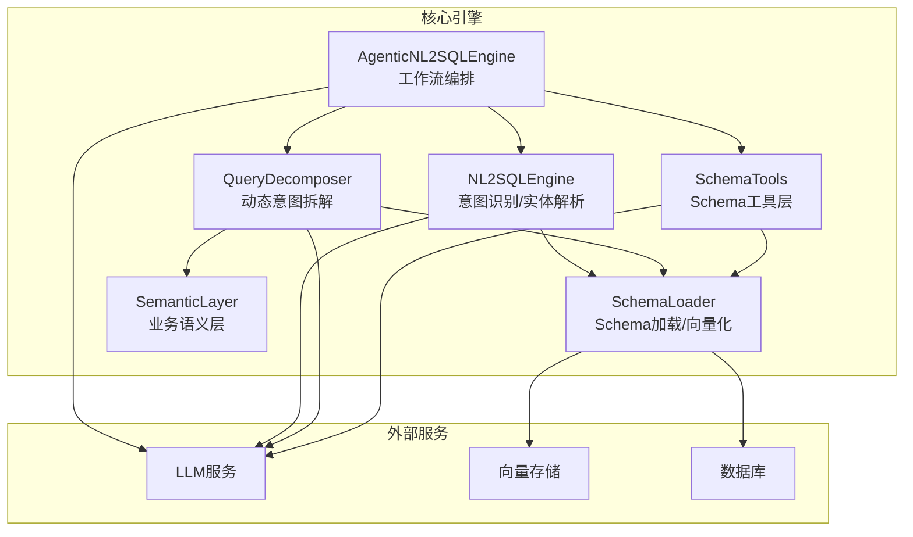
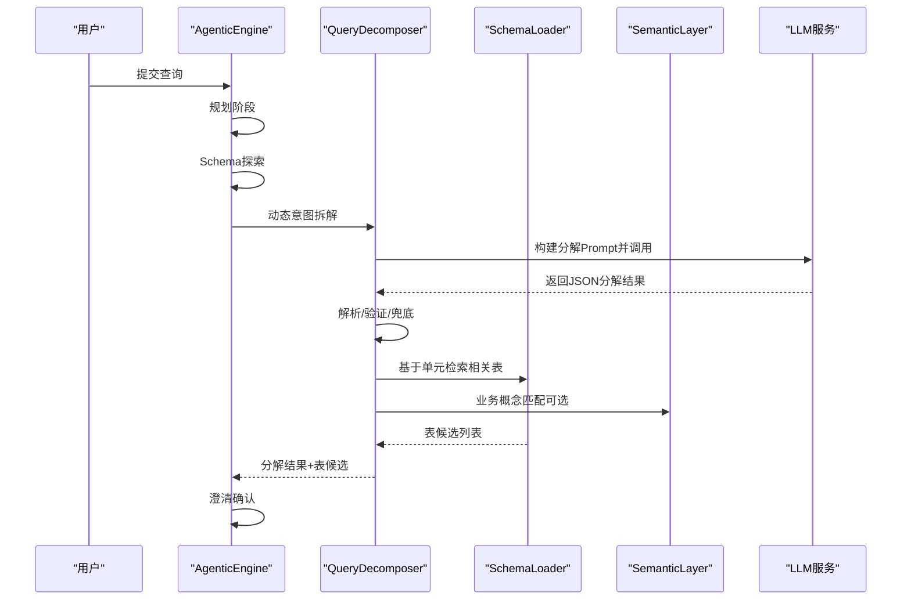
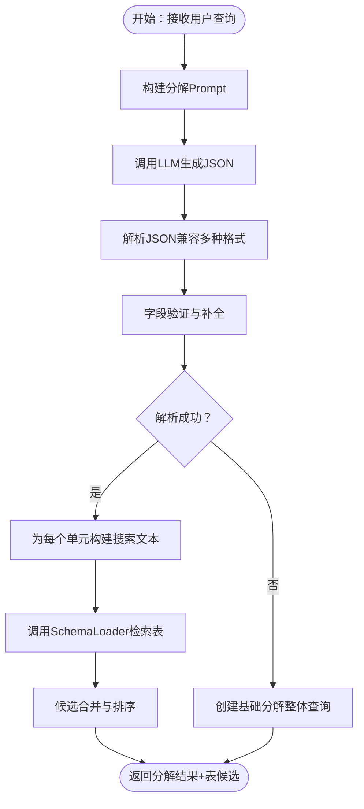
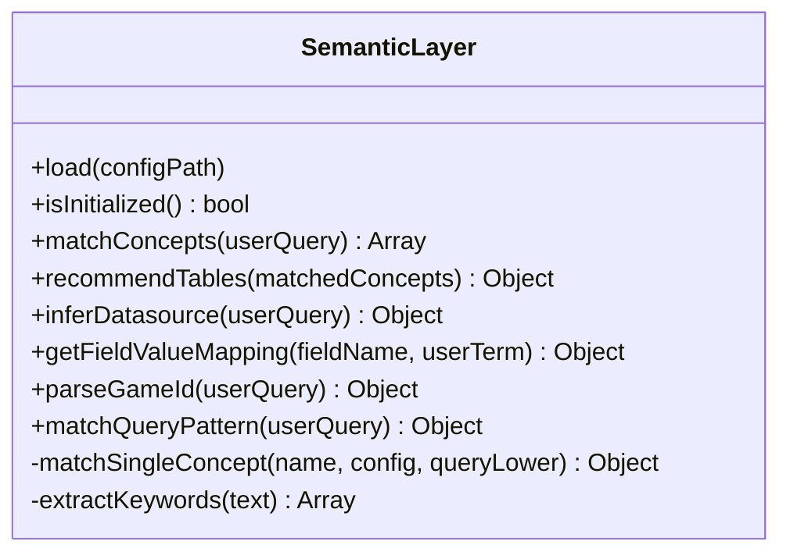
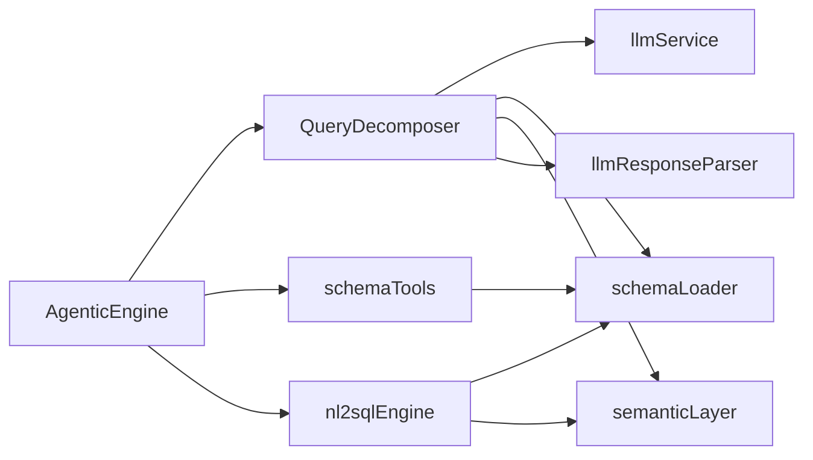
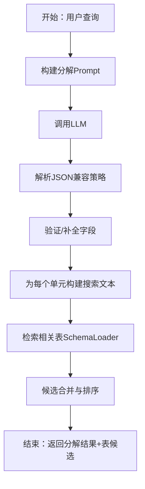

# 动态意图拆解

<cite>
**本文档引用的文件**
- [queryDecomposer.js](file://backend/src/core/queryDecomposer.js)
- [nl2sqlEngine.js](file://backend/src/core/nl2sqlEngine.js)
- [semanticLayer.js](file://backend/src/core/semanticLayer.js)
- [schemaTools.js](file://backend/src/core/schemaTools.js)
- [schemaLoader.js](file://backend/src/core/schemaLoader.js)
- [llmResponseParser.js](file://backend/src/utils/llmResponseParser.js)
- [business-semantic-layer.json](file://backend/config/business-semantic-layer.json)
- [agenticEngine.js](file://backend/src/core/agenticEngine.js)
</cite>

## 目录
1. [简介](#简介)
2. [项目结构](#项目结构)
3. [核心组件](#核心组件)
4. [架构总览](#架构总览)
5. [详细组件分析](#详细组件分析)
6. [依赖关系分析](#依赖关系分析)
7. [性能考量](#性能考量)
8. [故障排查指南](#故障排查指南)
9. [结论](#结论)
10. [附录](#附录)

## 简介
本文件聚焦“动态意图拆解”能力，系统性阐述如何将复杂自然语言查询拆解为可执行的数据需求单元（Data Units），并说明该拆解结果如何驱动后续Schema探索与SQL生成。文档涵盖：
- 数据单元识别与类型判定
- 查询分解策略与提示工程
- 复杂度评估与风险识别
- 基于分解的表检索与候选合并
- 与业务语义层、Schema工具层的协同
- 代码级流程图与数据结构示例

## 项目结构
动态意图拆解位于后端核心模块中，与意图识别、Schema探索、澄清确认、SQL生成形成四阶段工作流。关键文件如下：
- queryDecomposer.js：动态意图拆解与表检索
- nl2sqlEngine.js：NL2SQL核心引擎（意图识别、实体解析、澄清机制等）
- semanticLayer.js：业务语义层（概念匹配、表推荐、字段映射）
- schemaTools.js：Schema工具层（按需探索、表/字段/知识查询）
- schemaLoader.js：Schema元数据加载与向量化检索
- llmResponseParser.js：统一LLM响应解析器
- business-semantic-layer.json：业务语义层配置
- agenticEngine.js：Agentic工作流主控（串联各阶段）

图表来源
- [agenticEngine.js:68-178](file://backend/src/core/agenticEngine.js#L68-L178)
- [nl2sqlEngine.js:104-151](file://backend/src/core/nl2sqlEngine.js#L104-L151)
- [queryDecomposer.js:38-70](file://backend/src/core/queryDecomposer.js#L38-L70)
- [schemaTools.js:40-124](file://backend/src/core/schemaTools.js#L40-L124)
- [schemaLoader.js:75-131](file://backend/src/core/schemaLoader.js#L75-L131)
- [semanticLayer.js:48-73](file://backend/src/core/semanticLayer.js#L48-L73)

章节来源
- [agenticEngine.js:68-178](file://backend/src/core/agenticEngine.js#L68-L178)
- [nl2sqlEngine.js:104-151](file://backend/src/core/nl2sqlEngine.js#L104-L151)
- [queryDecomposer.js:38-70](file://backend/src/core/queryDecomposer.js#L38-L70)
- [schemaTools.js:40-124](file://backend/src/core/schemaTools.js#L40-L124)
- [schemaLoader.js:75-131](file://backend/src/core/schemaLoader.js#L75-L131)
- [semanticLayer.js:48-73](file://backend/src/core/semanticLayer.js#L48-L73)

## 核心组件
- 动态意图拆解器（QueryDecomposer）
  - 将复杂查询拆解为数据需求单元（Data Units）
  - 不预设子意图类型，适配任意复杂查询
  - 为每个单元独立检索相关表
- 业务语义层（SemanticLayer）
  - 建立业务概念到物理表/字段的映射
  - 支持别名识别与模糊匹配
- Schema工具层（SchemaTools）
  - 提供按需探索工具：search_tables、describe_table、search_knowledge、peek_table
- Schema加载与检索（SchemaLoader）
  - 加载Schema元数据，支持向量化检索与智能过滤
- NL2SQL核心引擎（NL2SQLEngine）
  - 意图识别、实体解析、澄清机制、SQL生成与验证
- LLM响应解析器（llmResponseParser）
  - 统一从LLM响应中提取JSON/SQL

章节来源
- [queryDecomposer.js:24-70](file://backend/src/core/queryDecomposer.js#L24-L70)
- [semanticLayer.js:128-167](file://backend/src/core/semanticLayer.js#L128-L167)
- [schemaTools.js:36-124](file://backend/src/core/schemaTools.js#L36-L124)
- [schemaLoader.js:75-131](file://backend/src/core/schemaLoader.js#L75-L131)
- [nl2sqlEngine.js:223-297](file://backend/src/core/nl2sqlEngine.js#L223-L297)
- [llmResponseParser.js:24-59](file://backend/src/utils/llmResponseParser.js#L24-L59)

## 架构总览
动态意图拆解处于四阶段工作流的第二阶段，紧接在规划与Schema探索之后，负责将用户查询转化为可执行的数据单元集合，并据此进行表检索与候选合并，为后续澄清与SQL生成提供基础。

图表来源
- [agenticEngine.js:90-108](file://backend/src/core/agenticEngine.js#L90-L108)
- [queryDecomposer.js:38-70](file://backend/src/core/queryDecomposer.js#L38-L70)
- [schemaLoader.js:571-653](file://backend/src/core/schemaLoader.js#L571-L653)
- [semanticLayer.js:134-167](file://backend/src/core/semanticLayer.js#L134-L167)

## 详细组件分析

### 动态意图拆解器（QueryDecomposer）
- 核心职责
  - 动态拆解复杂查询为数据需求单元（Data Units）
  - 构建分解Prompt，调用LLM，解析并验证结果
  - 基于单元检索相关表，合并候选并给出推荐
- 关键流程
  - 构建分解Prompt（包含业务关键词参考、输出格式约束）
  - LLM生成JSON结构化结果
  - 解析与验证（字段补齐、兜底策略）
  - 基于单元关键词/描述/指标/行为构建搜索文本
  - 调用SchemaLoader进行表检索与候选合并
- 数据单元结构要点
  - id、type、description、keywords
  - filters（字段、操作符、值）
  - timeRange（起止时间、时间字段）
  - metric、operator、value（指标比较）
  - behavior（行为类型、日期、条件）
  - outputFields（输出字段列表）
  - estimatedComplexity、requiresJoin、potentialRisks

图表来源
- [queryDecomposer.js:38-70](file://backend/src/core/queryDecomposer.js#L38-L70)
- [queryDecomposer.js:152-171](file://backend/src/core/queryDecomposer.js#L152-L171)
- [queryDecomposer.js:179-198](file://backend/src/core/queryDecomposer.js#L179-L198)
- [queryDecomposer.js:206-223](file://backend/src/core/queryDecomposer.js#L206-L223)
- [queryDecomposer.js:255-298](file://backend/src/core/queryDecomposer.js#L255-L298)
- [queryDecomposer.js:348-382](file://backend/src/core/queryDecomposer.js#L348-L382)

章节来源
- [queryDecomposer.js:24-70](file://backend/src/core/queryDecomposer.js#L24-L70)
- [queryDecomposer.js:152-171](file://backend/src/core/queryDecomposer.js#L152-L171)
- [queryDecomposer.js:179-198](file://backend/src/core/queryDecomposer.js#L179-L198)
- [queryDecomposer.js:206-223](file://backend/src/core/queryDecomposer.js#L206-L223)
- [queryDecomposer.js:255-298](file://backend/src/core/queryDecomposer.js#L255-L298)
- [queryDecomposer.js:348-382](file://backend/src/core/queryDecomposer.js#L348-L382)

### 业务语义层（SemanticLayer）
- 核心职责
  - 匹配查询中的业务概念（如“老平台”、“新平台”、“累计充值”）
  - 推荐表（primary_table/platform_table/game_table/fallback_table）
  - 字段值映射（如game_id别名）
- 关键能力
  - 精确/别名/模糊匹配
  - 基于概念映射的数据源推断
  - 查询模式匹配（结合多个概念的典型查询模板）

图表来源
- [semanticLayer.js:128-167](file://backend/src/core/semanticLayer.js#L128-L167)
- [semanticLayer.js:238-306](file://backend/src/core/semanticLayer.js#L238-L306)
- [semanticLayer.js:367-386](file://backend/src/core/semanticLayer.js#L367-L386)
- [semanticLayer.js:399-464](file://backend/src/core/semanticLayer.js#L399-L464)
- [semanticLayer.js:476-509](file://backend/src/core/semanticLayer.js#L476-L509)

章节来源
- [semanticLayer.js:128-167](file://backend/src/core/semanticLayer.js#L128-L167)
- [semanticLayer.js:238-306](file://backend/src/core/semanticLayer.js#L238-L306)
- [semanticLayer.js:367-386](file://backend/src/core/semanticLayer.js#L367-L386)
- [semanticLayer.js:399-464](file://backend/src/core/semanticLayer.js#L399-L464)
- [semanticLayer.js:476-509](file://backend/src/core/semanticLayer.js#L476-L509)

### Schema工具层（SchemaTools）
- 核心职责
  - 提供LLM可调用的Schema探索工具：search_tables、describe_table、search_knowledge、peek_table
  - Level 1索引缓存（表名+业务注释）用于初步筛选
- 与动态拆解的关系
  - 为QueryDecomposer提供按需探索能力（在工具调用链中）
  - 为后续SQL生成提供Schema详情

章节来源
- [schemaTools.js:40-124](file://backend/src/core/schemaTools.js#L40-L124)
- [schemaTools.js:136-173](file://backend/src/core/schemaTools.js#L136-L173)
- [schemaTools.js:225-393](file://backend/src/core/schemaTools.js#L225-L393)

### Schema加载与检索（SchemaLoader）
- 核心职责
  - 加载Schema元数据，构建表/字段映射
  - 表级向量化（表级表征），支持智能搜索与过滤
  - 搜索相关表（增强版：支持datasource/gameId上下文）
- 与动态拆解的关系
  - 为QueryDecomposer提供表检索能力
  - 支持基于上下文的平台类型推断与表过滤

章节来源
- [schemaLoader.js:75-131](file://backend/src/core/schemaLoader.js#L75-L131)
- [schemaLoader.js:210-285](file://backend/src/core/schemaLoader.js#L210-L285)
- [schemaLoader.js:300-431](file://backend/src/core/schemaLoader.js#L300-L431)
- [schemaLoader.js:571-653](file://backend/src/core/schemaLoader.js#L571-L653)

### NL2SQL核心引擎（NL2SQLEngine）
- 核心职责
  - 意图识别、实体解析、澄清机制、SQL生成与验证
  - 业务关键词映射、相关表推断、Schema映射提示
- 与动态拆解的关系
  - 在意图识别阶段提供相关表建议
  - 为后续澄清与SQL生成提供上下文

章节来源
- [nl2sqlEngine.js:104-151](file://backend/src/core/nl2sqlEngine.js#L104-L151)
- [nl2sqlEngine.js:186-217](file://backend/src/core/nl2sqlEngine.js#L186-L217)

### LLM响应解析器（llmResponseParser）
- 核心职责
  - 统一从LLM响应中提取JSON与SQL
  - 多策略解析（直接解析、代码块、花括号平衡提取）

章节来源
- [llmResponseParser.js:24-59](file://backend/src/utils/llmResponseParser.js#L24-L59)
- [llmResponseParser.js:119-143](file://backend/src/utils/llmResponseParser.js#L119-L143)

## 依赖关系分析
- QueryDecomposer依赖
  - llmService：调用LLM生成分解
  - schemaLoader：检索相关表
  - semanticLayer：业务概念匹配（可选）
  - llmResponseParser：解析JSON
- 与AgenticEngine协作
  - 在第二阶段调用QueryDecomposer，随后进入澄清与生成阶段
- 与SchemaTools/SemanticLayer协同
  - SchemaTools提供按需探索能力
  - SemanticLayer提供业务概念与表推荐

图表来源
- [queryDecomposer.js:14-18](file://backend/src/core/queryDecomposer.js#L14-L18)
- [agenticEngine.js:24-29](file://backend/src/core/agenticEngine.js#L24-L29)
- [schemaTools.js:17-19](file://backend/src/core/schemaTools.js#L17-L19)
- [nl2sqlEngine.js:17-31](file://backend/src/core/nl2sqlEngine.js#L17-L31)

章节来源
- [queryDecomposer.js:14-18](file://backend/src/core/queryDecomposer.js#L14-L18)
- [agenticEngine.js:24-29](file://backend/src/core/agenticEngine.js#L24-L29)
- [schemaTools.js:17-19](file://backend/src/core/schemaTools.js#L17-L19)
- [nl2sqlEngine.js:17-31](file://backend/src/core/nl2sqlEngine.js#L17-L31)

## 性能考量
- 向量化检索
  - 表级向量表征，减少字段级向量开销，提升检索效率
  - 增量更新策略，避免全量重建
- 候选合并策略
  - 覆盖率分数（单元覆盖比例）×0.6 + 频率分数（检索次数）×0.4
  - 优先覆盖多单元的表，利于后续Join友好
- 关键词提取与搜索
  - 提取中文词、英文词、数字，限制数量，兼顾召回与效率
- 缓存与回退
  - Level 1索引缓存、向量存储缓存
  - 向量检索失败时回退关键词匹配

章节来源
- [schemaLoader.js:210-285](file://backend/src/core/schemaLoader.js#L210-L285)
- [schemaLoader.js:300-431](file://backend/src/core/schemaLoader.js#L300-L431)
- [queryDecomposer.js:348-382](file://backend/src/core/queryDecomposer.js#L348-L382)
- [queryDecomposer.js:231-242](file://backend/src/core/queryDecomposer.js#L231-L242)
- [schemaTools.js:136-173](file://backend/src/core/schemaTools.js#L136-L173)

## 故障排查指南
- 分解失败
  - 现象：LLM响应无法解析JSON
  - 处理：使用兜底策略创建基础分解（整体查询）
  - 参考：[queryDecomposer.js:64-69](file://backend/src/core/queryDecomposer.js#L64-L69)、[queryDecomposer.js:206-223](file://backend/src/core/queryDecomposer.js#L206-L223)
- 表检索失败
  - 现象：向量检索异常
  - 处理：回退到关键词匹配；检查Schema加载与向量存储初始化
  - 参考：[schemaLoader.js:596-653](file://backend/src/core/schemaLoader.js#L596-L653)
- 业务概念匹配异常
  - 现象：概念未匹配或映射错误
  - 处理：检查business-semantic-layer.json配置与加载
  - 参考：[semanticLayer.js:48-73](file://backend/src/core/semanticLayer.js#L48-L73)、[business-semantic-layer.json:1-189](file://backend/config/business-semantic-layer.json#L1-L189)
- LLM响应解析失败
  - 现象：JSON/SQL提取异常
  - 处理：检查响应格式与解析策略
  - 参考：[llmResponseParser.js:24-59](file://backend/src/utils/llmResponseParser.js#L24-L59)、[llmResponseParser.js:119-143](file://backend/src/utils/llmResponseParser.js#L119-L143)

章节来源
- [queryDecomposer.js:64-69](file://backend/src/core/queryDecomposer.js#L64-L69)
- [queryDecomposer.js:206-223](file://backend/src/core/queryDecomposer.js#L206-L223)
- [schemaLoader.js:596-653](file://backend/src/core/schemaLoader.js#L596-L653)
- [semanticLayer.js:48-73](file://backend/src/core/semanticLayer.js#L48-L73)
- [business-semantic-layer.json:1-189](file://backend/config/business-semantic-layer.json#L1-L189)
- [llmResponseParser.js:24-59](file://backend/src/utils/llmResponseParser.js#L24-L59)
- [llmResponseParser.js:119-143](file://backend/src/utils/llmResponseParser.js#L119-L143)

## 结论
动态意图拆解通过“LLM结构化解析 + 表检索 + 候选合并”的闭环，将复杂查询转化为可执行的数据单元集合，显著提升了后续Schema探索与SQL生成的准确性与效率。其核心优势在于：
- 不预设子意图类型，适应性强
- 基于单元的独立检索与合并策略，兼顾召回与排序
- 与业务语义层、Schema工具层、向量化检索深度协同
- 完善的兜底与错误恢复机制，保障稳定性

## 附录

### 查询分解流程图（代码级映射）

图表来源
- [queryDecomposer.js:38-70](file://backend/src/core/queryDecomposer.js#L38-L70)
- [queryDecomposer.js:152-171](file://backend/src/core/queryDecomposer.js#L152-L171)
- [queryDecomposer.js:179-198](file://backend/src/core/queryDecomposer.js#L179-L198)
- [queryDecomposer.js:306-330](file://backend/src/core/queryDecomposer.js#L306-L330)
- [queryDecomposer.js:255-298](file://backend/src/core/queryDecomposer.js#L255-L298)
- [queryDecomposer.js:348-382](file://backend/src/core/queryDecomposer.js#L348-L382)

### 数据单元结构示例（字段说明）
- id：单元唯一标识
- type：单元类型（由LLM动态确定）
- description：单元描述
- keywords：关键词列表
- filters：筛选条件数组（字段、操作符、值）
- timeRange：时间范围（start、end、field）
- metric/operator/value：指标比较（指标名、比较操作符、比较值）
- behavior：行为模式（type、date、condition）
- outputFields：输出字段列表
- estimatedComplexity：复杂度评估（low/medium/high）
- requiresJoin：是否需要Join
- potentialRisks：潜在风险或歧义

章节来源
- [queryDecomposer.js:114-142](file://backend/src/core/queryDecomposer.js#L114-L142)

### 配置与使用示例（路径指引）
- 动态意图拆解入口
  - [agenticEngine.js:95](file://backend/src/core/agenticEngine.js#L95)
- 分解Prompt构建
  - [queryDecomposer.js:79-143](file://backend/src/core/queryDecomposer.js#L79-L143)
- JSON解析与兜底
  - [queryDecomposer.js:152-171](file://backend/src/core/queryDecomposer.js#L152-L171)
  - [queryDecomposer.js:206-223](file://backend/src/core/queryDecomposer.js#L206-L223)
- 表检索与候选合并
  - [queryDecomposer.js:255-298](file://backend/src/core/queryDecomposer.js#L255-L298)
  - [queryDecomposer.js:348-382](file://backend/src/core/queryDecomposer.js#L348-L382)
- 业务语义层配置
  - [business-semantic-layer.json:1-189](file://backend/config/business-semantic-layer.json#L1-L189)