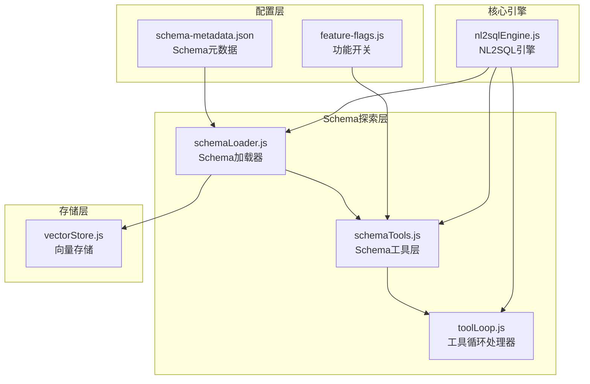
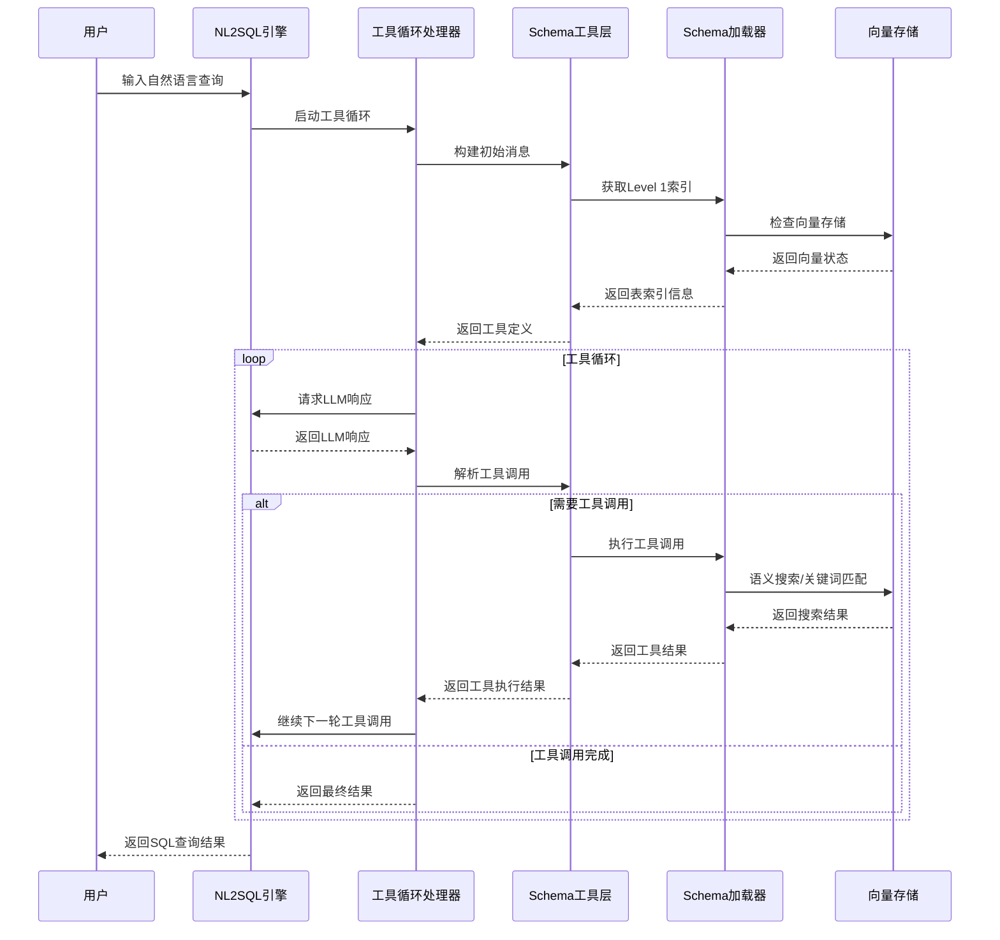
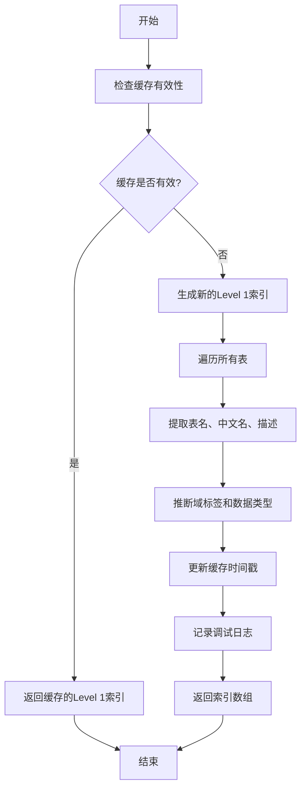
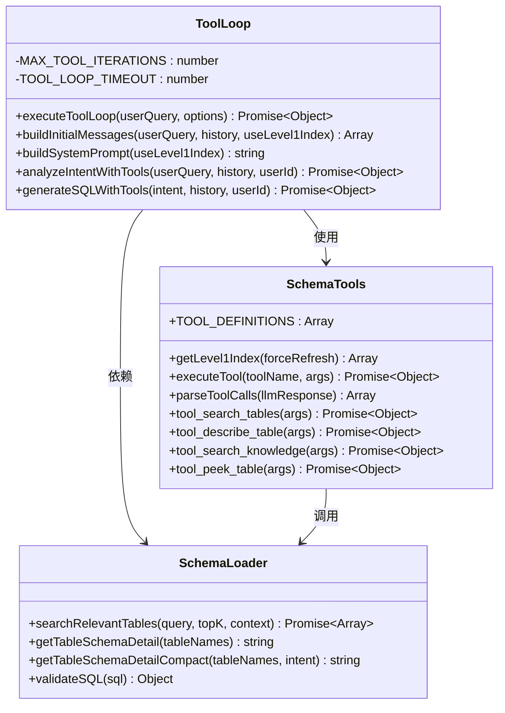
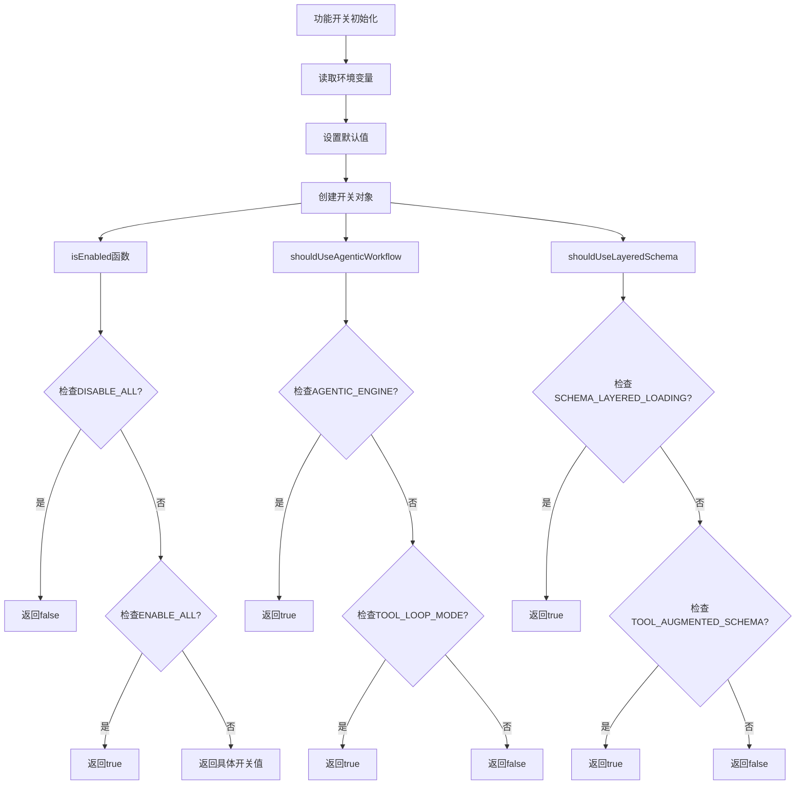
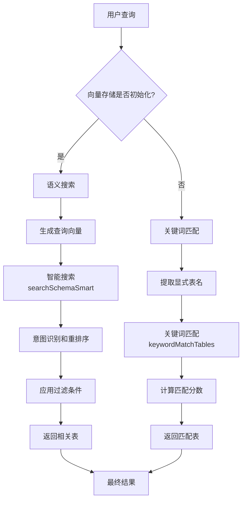
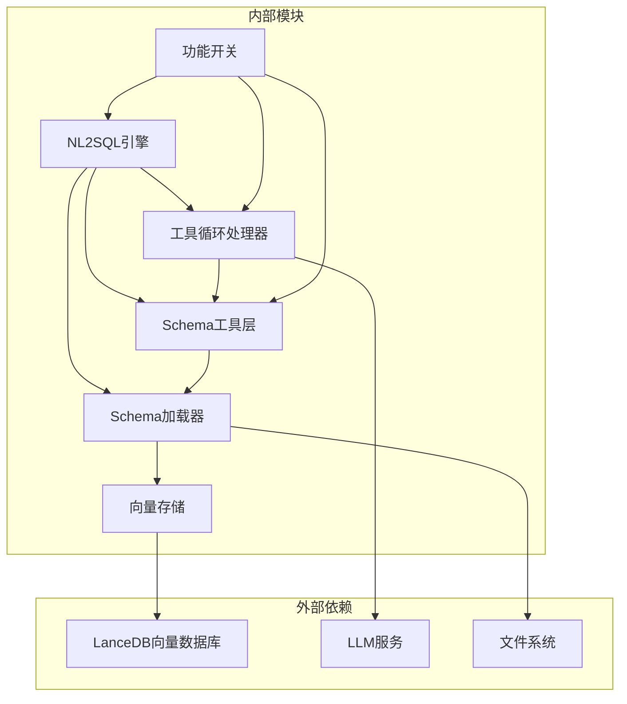

# Schema探索阶段（Schema Discovery）

<cite>
**本文档引用的文件**
- [schemaLoader.js](file://backend/src/core/schemaLoader.js)
- [schemaTools.js](file://backend/src/core/schemaTools.js)
- [toolLoop.js](file://backend/src/core/toolLoop.js)
- [feature-flags.js](file://backend/config/feature-flags.js)
- [nl2sqlEngine.js](file://backend/src/core/nl2sqlEngine.js)
- [vectorStore.js](file://backend/src/memory/vectorStore.js)
- [schema-metadata.json](file://backend/config/schema-metadata.json)
</cite>

## 目录
1. [简介](#简介)
2. [项目结构](#项目结构)
3. [核心组件](#核心组件)
4. [架构概览](#架构概览)
5. [详细组件分析](#详细组件分析)
6. [依赖关系分析](#依赖关系分析)
7. [性能考虑](#性能考虑)
8. [故障排除指南](#故障排除指南)
9. [结论](#结论)

## 简介

Schema探索阶段是NL2SQL系统中的关键环节，负责将自然语言查询转换为结构化SQL语句。该阶段实现了两种探索模式：传统模式和工具循环模式，通过分层Schema加载机制和智能工具调用来实现高效的数据库Schema发现。

本阶段的核心目标是：
- 识别用户查询相关的数据实体
- 构建工具循环探索机制
- 实现特征标志控制逻辑
- 优化索引获取和缓存策略
- 提供灵活的Schema探索解决方案

## 项目结构

NL2SQL项目的Schema探索模块采用分层架构设计，主要包含以下核心组件：

**图表来源**
- [schemaLoader.js:1-1235](file://backend/src/core/schemaLoader.js#L1-1235)
- [schemaTools.js:1-632](file://backend/src/core/schemaTools.js#L1-632)
- [toolLoop.js:1-521](file://backend/src/core/toolLoop.js#L1-521)

**章节来源**
- [schemaLoader.js:1-1235](file://backend/src/core/schemaLoader.js#L1-1235)
- [schemaTools.js:1-632](file://backend/src/core/schemaTools.js#L1-632)
- [toolLoop.js:1-521](file://backend/src/core/toolLoop.js#L1-521)

## 核心组件

### Schema加载器（SchemaLoader）

Schema加载器是Schema探索的基础组件，负责：
- 从JSON配置文件加载表结构定义
- 提供Schema查询和匹配接口
- 实现缓存机制提高性能
- 支持向量存储集成

核心功能包括：
- **Schema数据管理**：维护版本号、表定义、关系定义、指标和维度
- **查询接口**：提供获取表、字段、关系的方法
- **搜索功能**：实现语义搜索和关键词匹配
- **缓存机制**：管理Schema数据的缓存和失效

### Schema工具层（SchemaTools）

Schema工具层实现了工具增强的Schema探索功能：
- **Level 1索引缓存**：仅包含表名+业务注释的极简索引
- **工具定义**：提供search_tables、describe_table、search_knowledge、peek_table四个核心工具
- **业务知识库**：内置业务概念映射和定义
- **工具执行器**：实现工具的解析和执行逻辑

### 工具循环处理器（ToolLoop）

工具循环处理器实现了多轮工具调用机制：
- **迭代控制**：限制最大迭代次数和超时时间
- **消息管理**：构建初始消息和维护对话历史
- **工具调用解析**：解析LLM的工具调用请求
- **结果处理**：将工具结果返回给LLM

### 功能开关控制系统

功能开关系统提供了灵活的功能控制机制：
- **Phase 1开关**：TOOL_AUGMENTED_SCHEMA、SCHEMA_LAYERED_LOADING、TOOL_LOOP_MODE
- **动态配置**：支持环境变量控制和运行时切换
- **兼容性保证**：确保功能开关不影响系统稳定性

**章节来源**
- [schemaLoader.js:1-1235](file://backend/src/core/schemaLoader.js#L1-1235)
- [schemaTools.js:1-632](file://backend/src/core/schemaTools.js#L1-632)
- [toolLoop.js:1-521](file://backend/src/core/toolLoop.js#L1-521)
- [feature-flags.js:1-249](file://backend/config/feature-flags.js#L1-249)

## 架构概览

Schema探索阶段采用分层架构设计，实现了从传统模式到工具循环模式的平滑过渡：

**图表来源**
- [nl2sqlEngine.js:886-1221](file://backend/src/core/nl2sqlEngine.js#L886-1221)
- [toolLoop.js:57-185](file://backend/src/core/toolLoop.js#L57-185)
- [schemaTools.js:565-577](file://backend/src/core/schemaTools.js#L565-577)

## 详细组件分析

### Level 1索引获取机制

Level 1索引是Schema探索的第一层抽象，提供极简的表信息：

**图表来源**
- [schemaTools.js:154-173](file://backend/src/core/schemaTools.js#L154-173)
- [schemaTools.js:136-146](file://backend/src/core/schemaTools.js#L136-146)

Level 1索引的主要特点：
- **轻量级**：仅包含表名、中文名、描述、域标签和数据类型
- **缓存优化**：默认1小时缓存，支持强制刷新
- **域标签推断**：自动识别平台、游戏、报表等域类型
- **数据类型分类**：区分原始日志、聚合报表、维度表等

**章节来源**
- [schemaTools.js:136-173](file://backend/src/core/schemaTools.js#L136-173)

### 工具循环探索机制

工具循环实现了LLM驱动的Schema探索流程：

**图表来源**
- [toolLoop.js:57-185](file://backend/src/core/toolLoop.js#L57-185)
- [schemaTools.js:608-631](file://backend/src/core/schemaTools.js#L608-631)
- [schemaLoader.js:571-653](file://backend/src/core/schemaLoader.js#L571-653)

工具循环的核心流程：
1. **初始化**：构建系统提示词和初始消息
2. **LLM交互**：发送带有工具定义的消息给LLM
3. **工具解析**：解析LLM的工具调用请求
4. **工具执行**：执行解析的工具调用
5. **结果收集**：将工具结果添加到消息历史
6. **循环控制**：重复步骤2-5直到完成或达到限制

**章节来源**
- [toolLoop.js:57-185](file://backend/src/core/toolLoop.js#L57-185)
- [schemaTools.js:565-602](file://backend/src/core/schemaTools.js#L565-602)

### 特征标志控制逻辑

特征标志系统提供了灵活的功能控制机制：

**图表来源**
- [feature-flags.js:16-96](file://backend/config/feature-flags.js#L16-96)
- [feature-flags.js:149-170](file://backend/config/feature-flags.js#L149-170)

特征标志的主要作用：
- **渐进式部署**：支持新功能的渐进式启用
- **快速回滚**：提供紧急回滚机制
- **工作流控制**：影响NL2SQL引擎的整体工作流程
- **性能优化**：根据开关状态调整系统行为

**章节来源**
- [feature-flags.js:16-200](file://backend/config/feature-flags.js#L16-200)

### 智能搜索和匹配算法

Schema探索实现了多层次的搜索和匹配机制：

**图表来源**
- [schemaLoader.js:595-653](file://backend/src/core/schemaLoader.js#L595-653)
- [vectorStore.js:452-576](file://backend/src/memory/vectorStore.js#L452-576)

智能搜索的核心特性：
- **意图识别**：检测查询中提到的具体游戏名称
- **动态过滤**：根据查询意图应用相应的过滤策略
- **优先级重排序**：为不同类型的表设置不同的优先级
- **向量距离优化**：结合向量相似度和业务规则进行综合排序

**章节来源**
- [schemaLoader.js:571-653](file://backend/src/core/schemaLoader.js#L571-653)
- [vectorStore.js:452-576](file://backend/src/memory/vectorStore.js#L452-576)

## 依赖关系分析

Schema探索阶段的组件间依赖关系如下：

**图表来源**
- [nl2sqlEngine.js:16-58](file://backend/src/core/nl2sqlEngine.js#L16-58)
- [schemaLoader.js:15-26](file://backend/src/core/schemaLoader.js#L15-26)
- [schemaTools.js:17-19](file://backend/src/core/schemaTools.js#L17-19)

**章节来源**
- [nl2sqlEngine.js:16-58](file://backend/src/core/nl2sqlEngine.js#L16-58)
- [schemaLoader.js:15-26](file://backend/src/core/schemaLoader.js#L15-26)
- [schemaTools.js:17-19](file://backend/src/core/schemaTools.js#L17-19)

## 性能考虑

### 缓存策略

Schema探索实现了多层次的缓存机制：

1. **Level 1索引缓存**：默认1小时有效期，支持强制刷新
2. **Schema数据缓存**：基于时间戳的缓存失效机制
3. **向量存储缓存**：智能检查向量是否存在，避免重复计算
4. **工具调用缓存**：记录工具调用历史，避免重复执行

### 性能优化技术

- **分层加载**：先Level 1索引，再按需加载Level 2详情
- **向量搜索优化**：使用智能搜索和重排序算法
- **Token预算控制**：限制上下文大小，避免LLM超载
- **并发处理**：支持多个查询的并发处理

### 内存管理

- **增量更新**：向量存储使用增量更新而非全量重建
- **资源释放**：及时释放不再使用的资源
- **连接池**：数据库连接的高效管理

## 故障排除指南

### 常见问题和解决方案

1. **向量存储初始化失败**
   - 检查LanceDB安装和配置
   - 验证数据库路径权限
   - 确认嵌入维度配置正确

2. **工具循环超时**
   - 检查LLM服务可用性
   - 增加TOOL_LOOP_TIMEOUT配置
   - 简化查询复杂度

3. **Schema加载失败**
   - 验证schema-metadata.json格式
   - 检查文件路径和权限
   - 确认JSON格式正确

4. **功能开关配置错误**
   - 检查环境变量设置
   - 验证开关值的布尔转换
   - 确认开关状态日志

**章节来源**
- [toolLoop.js:154-174](file://backend/src/core/toolLoop.js#L154-174)
- [schemaLoader.js:82-86](file://backend/src/core/schemaLoader.js#L82-86)
- [feature-flags.js:209-229](file://backend/config/feature-flags.js#L209-229)

## 结论

Schema探索阶段通过创新的工具循环模式和分层加载机制，实现了高效、灵活的数据库Schema发现。该系统的主要优势包括：

1. **灵活性**：支持传统模式和工具循环模式的无缝切换
2. **智能化**：通过向量存储和语义搜索实现智能表推荐
3. **可扩展性**：模块化设计支持功能的渐进式部署
4. **性能优化**：多层次缓存和优化算法确保系统响应速度
5. **可靠性**：完善的错误处理和故障恢复机制

该实现为NL2SQL系统提供了强大的Schema探索能力，能够有效处理复杂的自然语言查询，并准确识别相关的数据实体。通过持续的优化和改进，该系统将继续提升用户体验和查询准确性。