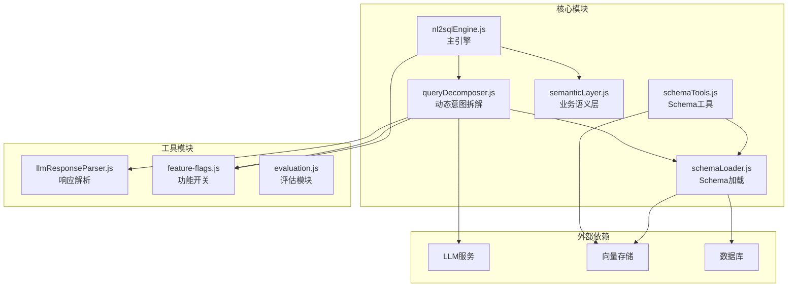
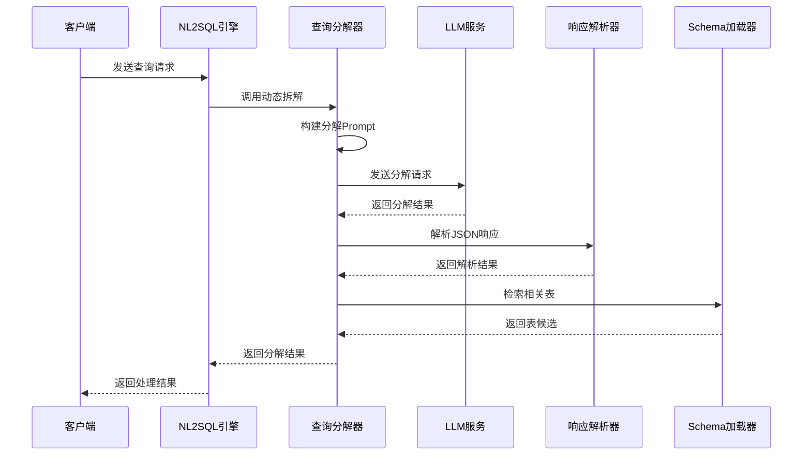
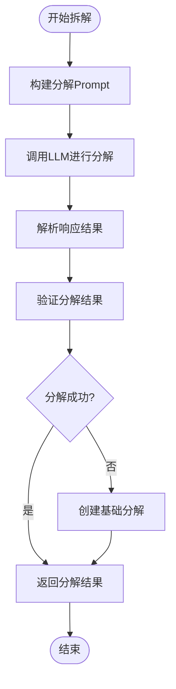
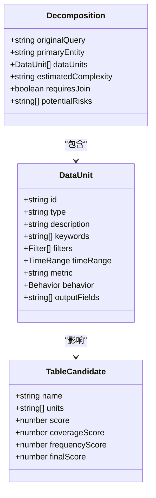
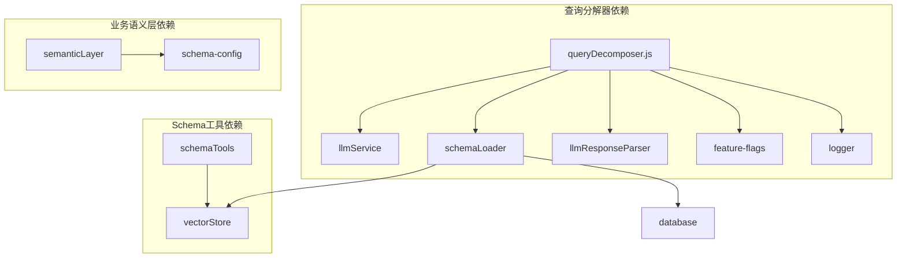

# 动态意图拆解阶段（Dynamic Intent Decomposition）

<cite>
**本文档引用的文件**
- [queryDecomposer.js](file://backend/src/core/queryDecomposer.js)
- [schemaTools.js](file://backend/src/core/schemaTools.js)
- [nl2sqlEngine.js](file://backend/src/core/nl2sqlEngine.js)
- [schemaLoader.js](file://backend/src/core/schemaLoader.js)
- [llmResponseParser.js](file://backend/src/utils/llmResponseParser.js)
- [feature-flags.js](file://backend/config/feature-flags.js)
- [semanticLayer.js](file://backend/src/core/semanticLayer.js)
- [evaluation.js](file://backend/src/utils/evaluation.js)
</cite>

## 目录
1. [简介](#简介)
2. [项目结构](#项目结构)
3. [核心组件](#核心组件)
4. [架构概览](#架构概览)
5. [详细组件分析](#详细组件分析)
6. [依赖关系分析](#依赖关系分析)
7. [性能考量](#性能考量)
8. [故障排查指南](#故障排查指南)
9. [结论](#结论)

## 简介
动态意图拆解阶段（Phase 2）是NL2SQL系统中的关键环节，负责将复杂的自然语言查询分解为可独立检索的“数据需求单元”（Data Units）。该阶段的核心目标包括：
- 查询语义分析：识别查询中的主要数据实体、筛选条件和业务概念
- 数据需求单元识别：将复杂查询拆分为多个独立的数据需求单元
- 复杂度评估与拆解策略选择：根据查询复杂度选择合适的拆解策略
- 表检索与合并：基于数据单元独立检索相关表，并进行候选表合并

该阶段采用LLM驱动的动态拆解策略，不预设固定的子意图类型，能够适应任意复杂的查询场景。

## 项目结构
NL2SQL系统采用模块化设计，动态意图拆解阶段位于核心模块中，与其他模块协同工作：

**图表来源**
- [queryDecomposer.js:1-402](file://backend/src/core/queryDecomposer.js#L1-L402)
- [schemaLoader.js:1-800](file://backend/src/core/schemaLoader.js#L1-L800)
- [schemaTools.js:1-632](file://backend/src/core/schemaTools.js#L1-L632)

**章节来源**
- [queryDecomposer.js:1-402](file://backend/src/core/queryDecomposer.js#L1-L402)
- [nl2sqlEngine.js:1-800](file://backend/src/core/nl2sqlEngine.js#L1-L800)

## 核心组件
动态意图拆解阶段由以下核心组件构成：

### 1. 查询分解器（QueryDecomposer）
负责将复杂查询拆解为数据需求单元，包含以下关键功能：
- 动态拆解算法：基于LLM的查询分解
- 数据单元构建：识别主实体、子查询和依赖关系
- 复杂度评估：评估查询复杂度并选择拆解策略
- 表检索：基于数据单元检索相关表

### 2. 业务语义层（Semantic Layer）
提供业务概念到物理表/字段的映射，解决业务术语识别问题：
- 业务概念匹配：识别"老平台"、"累计充值"等业务概念
- 表推荐：基于匹配到的概念推荐相关表
- 数据源映射：将业务概念映射到具体的数据源

### 3. Schema工具层
提供LLM可调用的Schema探索工具：
- 表搜索：根据关键词搜索相关表
- 字段描述：获取指定表的详细字段信息
- 业务知识：查询业务概念的定义和映射

**章节来源**
- [queryDecomposer.js:24-70](file://backend/src/core/queryDecomposer.js#L24-L70)
- [semanticLayer.js:128-167](file://backend/src/core/semanticLayer.js#L128-L167)
- [schemaTools.js:36-124](file://backend/src/core/schemaTools.js#L36-L124)

## 架构概览
动态意图拆解阶段采用分层架构设计，确保模块间的松耦合和高内聚：

**图表来源**
- [queryDecomposer.js:38-70](file://backend/src/core/queryDecomposer.js#L38-L70)
- [llmResponseParser.js:24-59](file://backend/src/utils/llmResponseParser.js#L24-L59)

## 详细组件分析

### 查询分解器核心算法

#### 动态拆解流程
查询分解器采用三阶段处理流程：

**图表来源**
- [queryDecomposer.js:38-70](file://backend/src/core/queryDecomposer.js#L38-L70)

#### 分解Prompt构建策略
分解Prompt包含以下关键要素：
- **任务要求**：分析用户查询并拆解为数据需求单元
- **分析要求**：识别主要数据实体、筛选条件和数据需求
- **单元类型**：基础属性筛选、时间范围筛选、聚合指标筛选等
- **业务关键词**：提供业务关键词参考
- **输出格式**：严格的JSON格式规范

#### 数据单元构建逻辑
每个数据单元包含以下结构：
- `id`: 唯一标识符
- `type`: 单元类型（如"基础属性筛选"）
- `description`: 单元描述
- `keywords`: 关键词列表
- `filters`: 筛选条件数组
- `timeRange`: 时间范围信息
- `metric`: 指标名称
- `behavior`: 行为模式信息

**章节来源**
- [queryDecomposer.js:79-143](file://backend/src/core/queryDecomposer.js#L79-L143)
- [queryDecomposer.js:152-171](file://backend/src/core/queryDecomposer.js#L152-L171)

### 复杂度评估与拆解策略

#### 复杂度评估方法
查询复杂度评估基于以下维度：
- **单元数量**：数据单元的数量
- **依赖关系**：单元间的依赖程度
- **表关联**：需要关联的表数量
- **业务概念**：业务概念的复杂程度

#### 拆解策略选择
根据复杂度评估结果选择相应的拆解策略：
- **低复杂度**：直接整体处理
- **中等复杂度**：按功能模块拆分
- **高复杂度**：按业务维度拆分并行处理

**章节来源**
- [queryDecomposer.js:179-198](file://backend/src/core/queryDecomposer.js#L179-L198)

### 表检索与合并策略

#### 基于数据单元的表检索
每个数据单元独立检索相关表：
1. 构建单元搜索查询
2. 调用Schema加载器进行表搜索
3. 合并表候选并计算得分

#### 表候选合并算法
采用多因子评分策略：
- **覆盖率分数**：覆盖的数据单元比例（权重0.6）
- **频率分数**：被检索到的次数（权重0.4）
- **综合得分**：加权求和得到最终排名

**图表来源**
- [queryDecomposer.js:348-382](file://backend/src/core/queryDecomposer.js#L348-L382)
- [queryDecomposer.js:255-298](file://backend/src/core/queryDecomposer.js#L255-L298)

**章节来源**
- [queryDecomposer.js:255-298](file://backend/src/core/queryDecomposer.js#L255-L298)
- [queryDecomposer.js:348-382](file://backend/src/core/queryDecomposer.js#L348-L382)

### 业务语义层集成

#### 业务概念匹配
业务语义层提供多层级的概念匹配：
- **精确匹配**：完全匹配业务概念
- **别名匹配**：匹配概念别名
- **模糊匹配**：基于关键词的部分匹配

#### 表推荐机制
基于匹配到的业务概念推荐表：
1. 提取概念映射信息
2. 计算推荐优先级
3. 按分数排序返回结果

**章节来源**
- [semanticLayer.js:134-167](file://backend/src/core/semanticLayer.js#L134-L167)
- [semanticLayer.js:238-306](file://backend/src/core/semanticLayer.js#L238-L306)

## 依赖关系分析

### 模块间依赖关系
动态意图拆解阶段涉及多个模块的协作：

**图表来源**
- [queryDecomposer.js:14-18](file://backend/src/core/queryDecomposer.js#L14-L18)
- [semanticLayer.js:48-73](file://backend/src/core/semanticLayer.js#L48-L73)

### 外部依赖分析
- **LLM服务**：提供查询分解和表搜索能力
- **向量存储**：支持语义搜索和表向量化
- **数据库**：提供Schema元数据存储
- **配置系统**：功能开关和参数配置

**章节来源**
- [queryDecomposer.js:14-18](file://backend/src/core/queryDecomposer.js#L14-L18)
- [schemaLoader.js:20-26](file://backend/src/core/schemaLoader.js#L20-L26)

## 性能考量

### 查询分解性能优化
1. **Prompt缓存**：缓存常用的分解Prompt模板
2. **并发处理**：并行处理多个数据单元的表检索
3. **结果缓存**：缓存LLM响应结果
4. **向量化搜索**：使用向量存储加速表检索

### 复杂度控制策略
- **单元数量限制**：限制单次查询的最大数据单元数量
- **深度限制**：限制递归拆解的深度
- **超时控制**：设置合理的超时时间
- **资源监控**：监控内存和CPU使用情况

### 错误恢复机制
- **降级策略**：LLM失败时使用基础分解
- **回退机制**：向量存储失败时使用关键词匹配
- **容错处理**：JSON解析失败时的兜底处理
- **重试机制**：网络异常时的自动重试

**章节来源**
- [queryDecomposer.js:64-69](file://backend/src/core/queryDecomposer.js#L64-L69)
- [schemaLoader.js:596-653](file://backend/src/core/schemaLoader.js#L596-L653)

## 故障排查指南

### 常见问题诊断
1. **LLM响应解析失败**
   - 检查JSON格式是否符合规范
   - 验证响应中是否包含预期字段
   - 查看日志中的错误信息

2. **表检索结果不准确**
   - 检查业务关键词映射
   - 验证向量存储是否正常
   - 确认Schema配置是否正确

3. **复杂度评估偏差**
   - 检查评估参数设置
   - 验证评分算法实现
   - 对比历史评估结果

### 调试工具和方法
- **日志分析**：查看详细的执行日志
- **性能监控**：监控关键指标和瓶颈
- **单元测试**：编写针对性的测试用例
- **A/B测试**：对比不同算法的效果

### 错误恢复策略
- **自动降级**：检测到异常时自动切换到备用方案
- **手动干预**：提供人工干预的接口
- **告警通知**：异常情况及时通知相关人员
- **数据备份**：重要数据的定期备份

**章节来源**
- [queryDecomposer.js:165-171](file://backend/src/core/queryDecomposer.js#L165-L171)
- [evaluation.js:1-488](file://backend/src/utils/evaluation.js#L1-L488)

## 结论
动态意图拆解阶段是NL2SQL系统的核心创新点，通过LLM驱动的动态拆解策略，实现了对复杂查询的灵活处理。该阶段的主要优势包括：

1. **灵活性**：不预设固定的子意图类型，能够适应各种查询场景
2. **准确性**：结合业务语义层和向量搜索，提高表检索的准确性
3. **可扩展性**：模块化设计便于功能扩展和维护
4. **鲁棒性**：完善的错误处理和恢复机制

未来的发展方向包括：
- 进一步优化LLM的提示工程
- 增强业务语义层的覆盖范围
- 提升向量搜索的精度
- 完善复杂度评估算法

通过持续的优化和改进，动态意图拆解阶段将为NL2SQL系统提供更强大的查询理解能力。