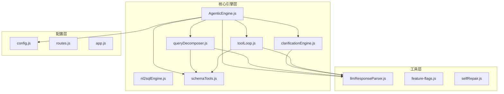
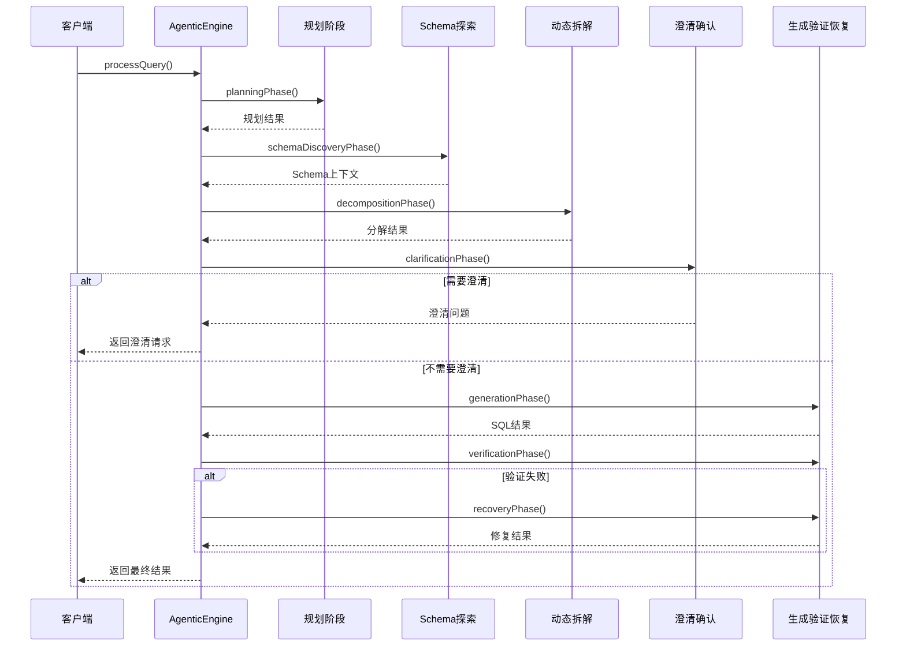
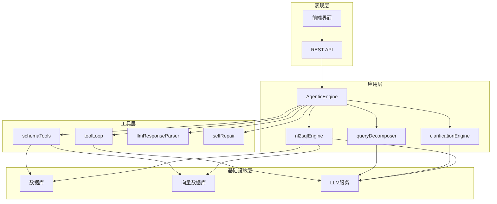
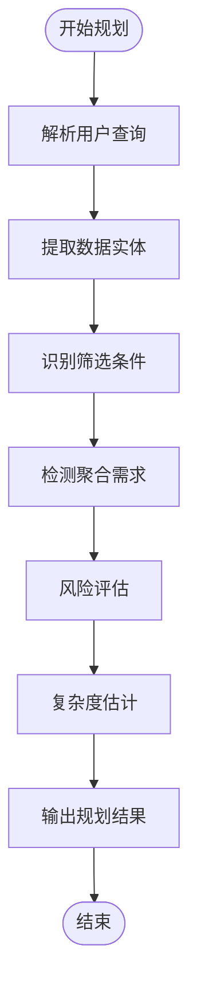
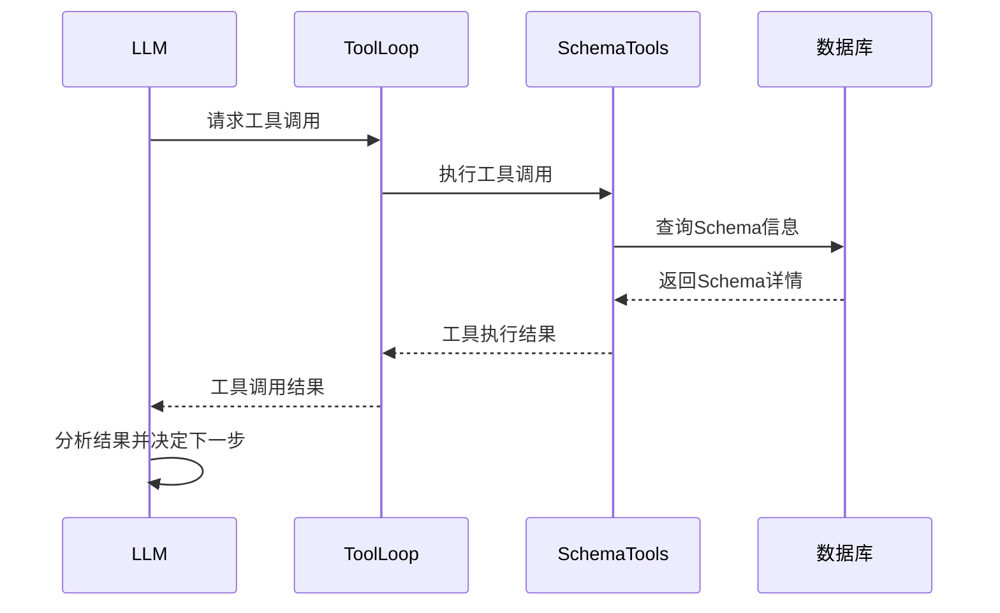
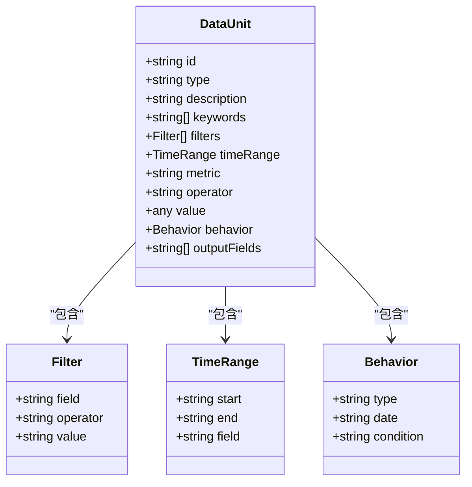
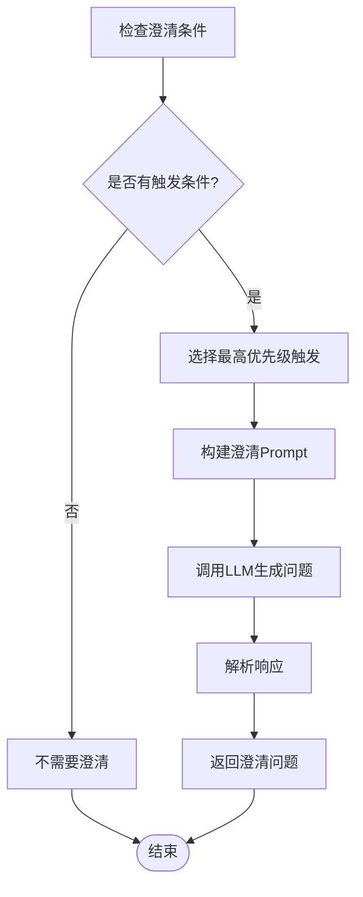
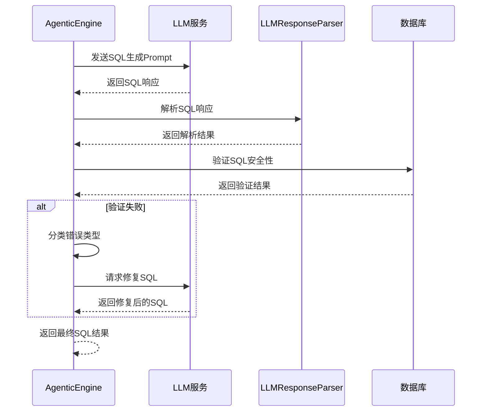
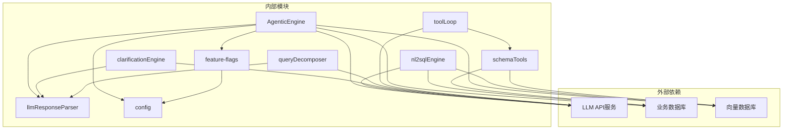

# 四阶段工作流管理

<cite>
**本文档引用的文件**
- [agenticEngine.js](file://backend/src/core/agenticEngine.js)
- [nl2sqlEngine.js](file://backend/src/core/nl2sqlEngine.js)
- [clarificationEngine.js](file://backend/src/core/clarificationEngine.js)
- [queryDecomposer.js](file://backend/src/core/queryDecomposer.js)
- [toolLoop.js](file://backend/src/core/toolLoop.js)
- [schemaTools.js](file://backend/src/core/schemaTools.js)
- [selfRepair.js](file://backend/src/core/selfRepair.js)
- [llmResponseParser.js](file://backend/src/utils/llmResponseParser.js)
- [feature-flags.js](file://backend/config/feature-flags.js)
- [routes.js](file://backend/src/core/routes.js)
- [config.js](file://backend/src/core/config.js)
- [app.js](file://backend/src/app.js)
</cite>

## 目录
1. [简介](#简介)
2. [项目结构](#项目结构)
3. [核心组件](#核心组件)
4. [架构概览](#架构概览)
5. [详细组件分析](#详细组件分析)
6. [依赖关系分析](#依赖关系分析)
7. [性能考量](#性能考量)
8. [故障排除指南](#故障排除指南)
9. [结论](#结论)

## 简介

本文档详细阐述了NL2SQL系统中四阶段工作流管理的完整技术实现。该系统采用Agentic NL2SQL引擎，将复杂的自然语言查询转换为精确的SQL语句，通过四个精心设计的阶段实现智能化的数据查询处理。

系统的核心创新在于引入了"规划-探索-拆解-澄清-生成验证恢复"的多阶段工作流，每个阶段都有明确的功能边界、输入输出规范和异常处理机制。这种分阶段的设计不仅提高了系统的可维护性和可扩展性，还显著提升了查询准确性和用户体验。

## 项目结构

NL2SQL项目采用模块化架构设计，核心功能分布在多个专门的模块中：



**图表来源**
- [agenticEngine.js:1-651](file://backend/src/core/agenticEngine.js#L1-L651)
- [nl2sqlEngine.js:1-800](file://backend/src/core/nl2sqlEngine.js#L1-L800)
- [clarificationEngine.js:1-489](file://backend/src/core/clarificationEngine.js#L1-L489)

**章节来源**
- [app.js:1-266](file://backend/src/app.js#L1-L266)
- [routes.js:1-800](file://backend/src/core/routes.js#L1-L800)

## 核心组件

### Agentic NL2SQL引擎

Agentic NL2SQL引擎是整个系统的核心，实现了四阶段工作流的协调和控制。该引擎继承了传统NL2SQL引擎的所有功能，并在此基础上增加了高级的自我修正和错误恢复能力。

#### 主要功能特性

1. **阶段化工作流管理**：严格遵循四阶段设计，每个阶段都有明确的职责边界
2. **自我修正机制**：具备自动检测和修复错误的能力
3. **进度跟踪**：提供详细的执行进度和状态反馈
4. **异常处理**：完善的错误捕获和恢复策略

#### 阶段执行流程



**图表来源**
- [agenticEngine.js:68-178](file://backend/src/core/agenticEngine.js#L68-L178)

**章节来源**
- [agenticEngine.js:52-178](file://backend/src/core/agenticEngine.js#L52-L178)

### 功能开关系统

系统采用灵活的功能开关机制，支持渐进式功能启用和快速回滚：

| 功能类别 | 开关名称 | 默认状态 | 描述 |
|---------|----------|----------|------|
| 规划阶段 | TOOL_AUGMENTED_SCHEMA | false | 工具化Schema探索 |
| 规划阶段 | SCHEMA_LAYERED_LOADING | false | 分层Schema加载 |
| 规划阶段 | TOOL_LOOP_MODE | false | 工具循环模式 |
| 拆解阶段 | DYNAMIC_INTENT_DECOMPOSITION | false | 动态意图拆解 |
| 拆解阶段 | BUSINESS_SEMANTIC_LAYER | false | 业务语义层 |
| 澄清阶段 | CLARIFICATION_ENGINE | false | 澄清机制 |
| 生成阶段 | AGENTIC_ENGINE | false | Agentic引擎 |
| 生成阶段 | AUTO_RECOVERY | false | 自我修正恢复 |

**章节来源**
- [feature-flags.js:16-96](file://backend/config/feature-flags.js#L16-L96)

## 架构概览

系统采用分层架构设计，每个层次都有明确的职责和边界：



**图表来源**
- [app.js:97-194](file://backend/src/app.js#L97-L194)
- [routes.js:1-800](file://backend/src/core/routes.js#L1-L800)

## 详细组件分析

### 规划阶段 (Planning)

规划阶段负责分析用户查询并制定执行策略，是整个工作流的起点。

#### 核心功能

1. **查询分析**：识别查询中的数据实体、筛选条件和聚合需求
2. **风险评估**：识别潜在的歧义和信息缺失
3. **复杂度估计**：评估查询的执行难度和资源需求

#### 输入输出规范

**输入**：
- 用户查询文本
- 上下文信息（历史对话、用户ID等）

**输出**：
```javascript
{
  entities: ["玩家", "充值记录"],
  filters: [{"field": "game_id", "value": "67"}],
  aggregations: ["累计充值"],
  risks: ["老平台需要确认数据源"],
  estimatedComplexity: "high"
}
```

#### 处理逻辑



**图表来源**
- [agenticEngine.js:187-228](file://backend/src/core/agenticEngine.js#L187-L228)

**章节来源**
- [agenticEngine.js:187-228](file://backend/src/core/agenticEngine.js#L187-L228)

### Schema探索阶段 (Schema Discovery)

Schema探索阶段利用工具循环机制，动态探索数据库结构，为后续查询生成提供精确的Schema信息。

#### 工具循环机制

系统实现了强大的工具循环功能，允许LLM与数据库Schema进行交互式探索：



**图表来源**
- [toolLoop.js:87-184](file://backend/src/core/toolLoop.js#L87-L184)

#### 可用工具

| 工具名称 | 参数 | 功能 | 使用场景 |
|---------|------|------|----------|
| search_tables | keyword, top_k | 搜索相关表 | 初步定位目标表 |
| describe_table | table_name, compact | 获取表详情 | 确认表结构 |
| search_knowledge | concept | 查询业务知识 | 理解业务概念 |
| peek_table | table_name, limit | 查看表预览 | 验证数据格式 |

**章节来源**
- [toolLoop.js:57-184](file://backend/src/core/toolLoop.js#L57-L184)
- [schemaTools.js:40-124](file://backend/src/core/schemaTools.js#L40-L124)

### 动态意图拆解阶段 (Dynamic Intent Decomposition)

动态意图拆解阶段将复杂的自然语言查询分解为可独立处理的数据需求单元，每个单元都有明确的类型和描述。

#### 数据单元结构



**图表来源**
- [queryDecomposer.js:114-142](file://backend/src/core/queryDecomposer.js#L114-L142)

#### 拆解策略

系统采用"按需索取"的策略，通过LLM动态识别查询中的各种数据需求：

1. **基础属性筛选**：识别维度筛选条件
2. **时间范围筛选**：提取时间相关的查询条件
3. **聚合指标筛选**：识别需要计算的指标
4. **行为序列筛选**：处理复杂的用户行为模式
5. **输出字段需求**：确定需要返回的字段列表

**章节来源**
- [queryDecomposer.js:38-70](file://backend/src/core/queryDecomposer.js#L38-L70)
- [queryDecomposer.js:255-298](file://backend/src/core/queryDecomposer.js#L255-L298)

### 澄清确认阶段 (Clarification)

澄清阶段负责检测查询理解中的不确定性，并主动向用户提供澄清问题，确保查询的准确性。

#### 澄清触发条件

系统定义了多种触发澄清的场景：

| 触发条件 | 严重程度 | 描述 | 示例 |
|---------|----------|------|------|
| UNCOVERED_DATA_UNIT | HIGH | 数据单元无匹配表 | "无法找到匹配的表" |
| TABLE_AMBIGUITY | MEDIUM | 表选择歧义 | "多个可能的数据来源" |
| AGGREGATION_SOURCE_UNCERTAIN | LOW | 聚合指标来源不明确 | "实时vs预汇总数据" |
| TIME_GRANULARITY_UNCERTAIN | LOW | 时间粒度不明确 | "按天/周/月统计" |
| LOW_CONFIDENCE | MEDIUM | 置信度过低 | "需要更多细节" |

#### 澄清问题生成



**图表来源**
- [clarificationEngine.js:196-232](file://backend/src/core/clarificationEngine.js#L196-L232)

**章节来源**
- [clarificationEngine.js:196-232](file://backend/src/core/clarificationEngine.js#L196-L232)
- [clarificationEngine.js:246-272](file://backend/src/core/clarificationEngine.js#L246-L272)

### 生成验证恢复阶段 (Generation + Verification + Recovery)

这是工作流的最后一阶段，负责SQL生成、验证和错误恢复。

#### SQL生成流程



**图表来源**
- [agenticEngine.js:345-495](file://backend/src/core/agenticEngine.js#L345-L495)

#### 验证机制

系统实施多层次的安全验证：

1. **语法验证**：检查SQL基本语法结构
2. **安全检查**：防止危险操作（DROP、DELETE等）
3. **表存在性检查**：验证引用的表是否存在
4. **字段验证**：确认引用的字段有效

#### 错误恢复策略

| 错误类型 | 恢复策略 | 实现方式 |
|---------|----------|----------|
| TABLE_NOT_FOUND | 替代表建议 | 搜索相似表并提供建议 |
| SYNTAX_ERROR | LLM自动修正 | 请求LLM修正语法错误 |
| SECURITY_VIOLATION | 安全过滤 | 移除危险操作并重新生成 |
| PERFORMANCE_ISSUE | 优化建议 | 提供性能优化建议 |

**章节来源**
- [agenticEngine.js:438-618](file://backend/src/core/agenticEngine.js#L438-L618)

## 依赖关系分析

系统采用松耦合的设计原则，通过清晰的接口定义实现模块间的协作：



**图表来源**
- [agenticEngine.js:20-29](file://backend/src/core/agenticEngine.js#L20-L29)
- [toolLoop.js:16-21](file://backend/src/core/toolLoop.js#L16-L21)

### 关键依赖关系

1. **LLM服务依赖**：所有AI驱动的功能都需要LLM服务支持
2. **数据库连接**：Schema查询和数据验证需要数据库连接
3. **向量数据库**：语义检索和Schema向量化需要向量存储
4. **配置管理**：所有模块都依赖统一的配置系统

**章节来源**
- [config.js:16-355](file://backend/src/core/config.js#L16-L355)

## 性能考量

系统在设计时充分考虑了性能优化，采用了多种策略来提升响应速度和资源利用率：

### 缓存策略

1. **Schema缓存**：Level 1索引缓存，默认1小时过期
2. **工具调用缓存**：避免重复的Schema查询
3. **响应解析缓存**：统一的LLM响应解析器减少重复工作

### 异步处理

1. **工具循环异步执行**：工具调用采用异步模式，避免阻塞
2. **并发处理**：支持多个查询并发处理
3. **流式响应**：SSE支持实时进度反馈

### 资源管理

1. **连接池管理**：数据库连接池自动管理
2. **内存优化**：长期记忆采用分层存储策略
3. **超时控制**：所有外部调用都有超时保护

## 故障排除指南

### 常见问题及解决方案

#### LLM API错误

**症状**：查询处理失败，返回LLM相关错误

**排查步骤**：
1. 检查LLM API密钥配置
2. 验证网络连接状态
3. 查看API响应时间和错误码

**解决方案**：
- 更新正确的API密钥
- 检查防火墙设置
- 调整超时参数

#### 数据库连接问题

**症状**：Schema查询失败，表信息无法获取

**排查步骤**：
1. 验证数据库连接URL配置
2. 检查数据库服务状态
3. 确认用户权限设置

**解决方案**：
- 修复连接字符串格式
- 启动数据库服务
- 授权相应权限

#### 功能开关冲突

**症状**：某些功能无法正常工作

**排查步骤**：
1. 检查功能开关状态
2. 验证环境变量配置
3. 确认功能依赖关系

**解决方案**：
- 启用必要的功能开关
- 设置正确的环境变量
- 满足功能依赖条件

### 调试技巧

1. **启用详细日志**：设置LOG_LEVEL为debug获取详细信息
2. **使用健康检查**：通过`/api/health`端点监控系统状态
3. **监控性能指标**：关注查询响应时间和资源使用情况

**章节来源**
- [app.js:204-258](file://backend/src/app.js#L204-L258)
- [routes.js:72-137](file://backend/src/core/routes.js#L72-L137)

## 结论

NL2SQL系统的四阶段工作流管理展现了现代AI驱动数据查询系统的最佳实践。通过精心设计的阶段划分、灵活的功能开关机制和完善的错误处理策略，该系统实现了高准确性、高可靠性和良好的可维护性。

### 主要优势

1. **模块化设计**：清晰的职责分离使得系统易于理解和维护
2. **渐进式功能**：功能开关支持平滑的功能演进和回滚
3. **智能错误处理**：自动化的错误检测和恢复机制
4. **性能优化**：多层缓存和异步处理提升系统性能

### 技术亮点

1. **工具循环机制**：实现了LLM与数据库Schema的智能交互
2. **动态意图拆解**：能够处理复杂的自然语言查询
3. **多层验证机制**：确保生成SQL的安全性和正确性
4. **自我修复能力**：系统具备自动监控和维护功能

该系统为构建企业级的AI数据查询平台提供了坚实的技术基础，其设计理念和实现方式值得在类似项目中借鉴和应用。