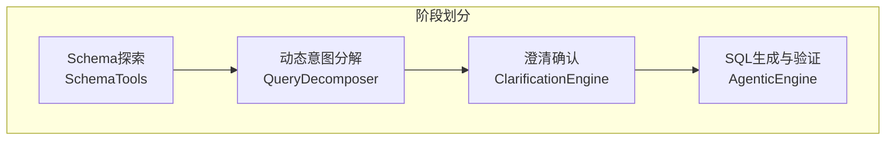
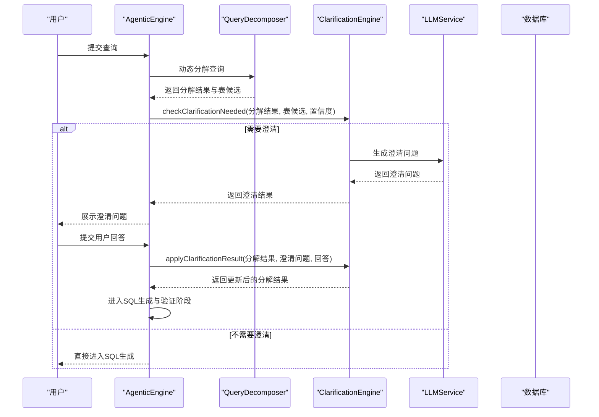
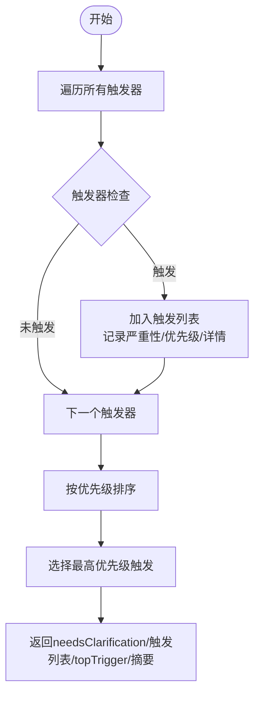
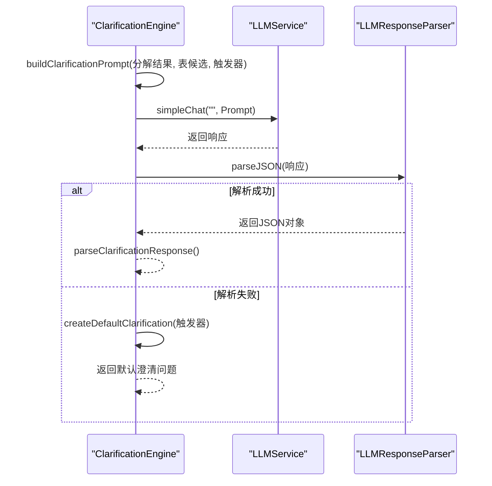
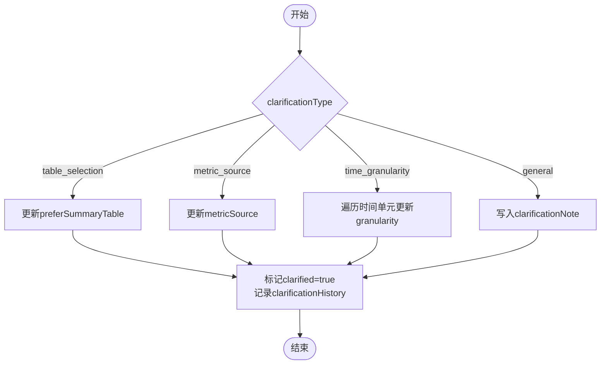
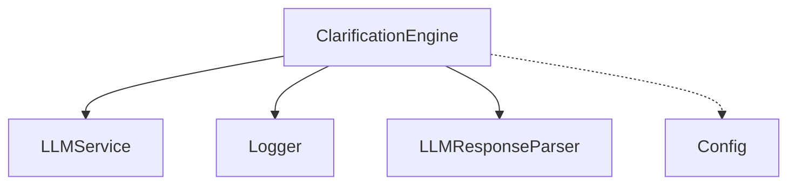

# 澄清确认阶段（Clarification + Confirmation）

<cite>
**本文档引用的文件**
- [clarificationEngine.js](file://backend/src/core/clarificationEngine.js)
- [nl2sqlEngine.js](file://backend/src/core/nl2sqlEngine.js)
- [queryDecomposer.js](file://backend/src/core/queryDecomposer.js)
- [schemaTools.js](file://backend/src/core/schemaTools.js)
- [llmService.js](file://backend/src/core/llmService.js)
- [llmResponseParser.js](file://backend/src/utils/llmResponseParser.js)
- [agenticEngine.js](file://backend/src/core/agenticEngine.js)
- [config.js](file://backend/src/core/config.js)
- [logger.js](file://backend/src/utils/logger.js)
</cite>

## 目录
1. [简介](#简介)
2. [项目结构](#项目结构)
3. [核心组件](#核心组件)
4. [架构概览](#架构概览)
5. [详细组件分析](#详细组件分析)
6. [依赖分析](#依赖分析)
7. [性能考量](#性能考量)
8. [故障排查指南](#故障排查指南)
9. [结论](#结论)

## 简介
本文件聚焦于NL2SQL系统中的澄清确认阶段（Phase 3: Clarification + Confirmation），系统性阐述该阶段的决策机制与实现细节，包括：
- 需求完整性检查：识别未匹配的关键数据单元
- 歧义识别：多表选择、聚合指标来源、时间粒度等歧义场景
- 置信度评估：基于置信度阈值的触发条件
- 澄清触发条件：五类触发场景及优先级排序
- 澄清问题生成：基于LLM的友好问题与选项设计
- 用户回答应用：针对不同类型澄清的参数更新策略
- 状态管理：澄清历史、标记与持久化

本阶段的目标是在生成SQL之前，通过主动澄清消除不确定性，提高最终SQL的准确性与用户满意度。

## 项目结构
澄清确认阶段位于NL2SQL四阶段工作流的第三阶段，紧接在动态意图分解之后，为SQL生成阶段提供高质量的分解结果与表候选。

**图表来源**
- [agenticEngine.js:295-336](file://backend/src/core/agenticEngine.js#L295-L336)
- [queryDecomposer.js:38-70](file://backend/src/core/queryDecomposer.js#L38-L70)
- [clarificationEngine.js:188-232](file://backend/src/core/clarificationEngine.js#L188-L232)

**章节来源**
- [agenticEngine.js:295-336](file://backend/src/core/agenticEngine.js#L295-L336)
- [queryDecomposer.js:38-70](file://backend/src/core/queryDecomposer.js#L38-L70)

## 核心组件
- 澄清引擎（ClarificationEngine）：负责触发条件判定、澄清问题生成与用户回答应用
- 查询分解器（QueryDecomposer）：提供分解结果与表候选，作为澄清触发的输入
- LLM服务（LLMService）：提供文本生成能力，支撑澄清问题的生成与解析
- 日志工具（Logger）：记录澄清过程的关键事件，便于调试与审计
- 配置模块（Config）：提供置信度阈值、功能开关等全局配置

**章节来源**
- [clarificationEngine.js:14-15](file://backend/src/core/clarificationEngine.js#L14-L15)
- [queryDecomposer.js:14-18](file://backend/src/core/queryDecomposer.js#L14-L18)
- [llmService.js:22-24](file://backend/src/core/llmService.js#L22-L24)
- [logger.js:54-98](file://backend/src/utils/logger.js#L54-L98)
- [config.js:16-398](file://backend/src/core/config.js#L16-L398)

## 架构概览
澄清确认阶段在Agentic工作流中的位置如下：

**图表来源**
- [agenticEngine.js:295-336](file://backend/src/core/agenticEngine.js#L295-L336)
- [agenticEngine.js:616-618](file://backend/src/core/agenticEngine.js#L616-L618)
- [clarificationEngine.js:196-232](file://backend/src/core/clarificationEngine.js#L196-L232)
- [clarificationEngine.js:246-272](file://backend/src/core/clarificationEngine.js#L246-L272)
- [clarificationEngine.js:388-426](file://backend/src/core/clarificationEngine.js#L388-L426)

## 详细组件分析

### 澄清触发条件与决策机制
澄清引擎定义了五类触发条件，分别对应不同的不确定性来源，并按优先级排序，最终只返回最高优先级的触发，避免一次性提出过多问题。

- 未覆盖数据单元（UNCOVERED_DATA_UNIT）
  - 触发条件：分解结果中的数据单元无法匹配到任何候选表
  - 严重性：HIGH
  - 优先级：1
  - 详情：记录未匹配的数据单元集合

- 表选择歧义（TABLE_AMBIGUITY）
  - 触发条件：同一数据类型映射到多个候选表
  - 严重性：MEDIUM
  - 优先级：2
  - 详情：记录类型到表列表的映射

- 聚合指标来源不明确（AGGREGATION_SOURCE_UNCERTAIN）
  - 触发条件：同一指标同时存在原始表与汇总表
  - 严重性：LOW
  - 优先级：3
  - 详情：记录指标名称列表

- 时间粒度不明确（TIME_GRANULARITY_UNCERTAIN）
  - 触发条件：时间单元的时间范围缺少粒度信息
  - 严重性：LOW
  - 优先级：4
  - 详情：记录时间单元与时间范围

- 置信度过低（LOW_CONFIDENCE）
  - 触发条件：置信度低于阈值（默认0.6）
  - 严重性：根据置信度分级（<0.4为HIGH，否则MEDIUM）
  - 优先级：1
  - 详情：记录当前置信度与阈值

触发判定流程如下：

**图表来源**
- [clarificationEngine.js:196-232](file://backend/src/core/clarificationEngine.js#L196-L232)

**章节来源**
- [clarificationEngine.js:26-182](file://backend/src/core/clarificationEngine.js#L26-L182)
- [clarificationEngine.js:196-232](file://backend/src/core/clarificationEngine.js#L196-L232)

### 澄清问题生成
澄清问题生成采用两阶段策略：
1. 构建Prompt：整合原始查询、分解结果、表候选与触发原因
2. LLM生成：调用LLM生成JSON格式的澄清问题，包含问题文本、选项、默认推荐、类型与解释
3. 解析与回退：解析失败时回退到默认模板

生成流程如下：

**图表来源**
- [clarificationEngine.js:246-272](file://backend/src/core/clarificationEngine.js#L246-L272)
- [clarificationEngine.js:277-312](file://backend/src/core/clarificationEngine.js#L277-L312)
- [clarificationEngine.js:317-328](file://backend/src/core/clarificationEngine.js#L317-L328)
- [clarificationEngine.js:333-374](file://backend/src/core/clarificationEngine.js#L333-L374)
- [llmService.js:318-356](file://backend/src/core/llmService.js#L318-L356)
- [llmResponseParser.js:24-59](file://backend/src/utils/llmResponseParser.js#L24-L59)

**章节来源**
- [clarificationEngine.js:246-272](file://backend/src/core/clarificationEngine.js#L246-L272)
- [clarificationEngine.js:277-312](file://backend/src/core/clarificationEngine.js#L277-L312)
- [clarificationEngine.js:317-328](file://backend/src/core/clarificationEngine.js#L317-L328)
- [clarificationEngine.js:333-374](file://backend/src/core/clarificationEngine.js#L333-L374)
- [llmService.js:318-356](file://backend/src/core/llmService.js#L318-L356)
- [llmResponseParser.js:24-59](file://backend/src/utils/llmResponseParser.js#L24-L59)

### 用户回答应用与状态管理
用户回答应用根据澄清类型进行差异化处理，并维护澄清历史与状态标记：

- 表选择澄清（table_selection）
  - 用户偏好“详细数据”或“汇总数据”时，更新preferSummaryTable
- 指标来源澄清（metric_source）
  - 用户偏好“实时计算”或“预汇总数据”时，更新metricSource
- 时间粒度澄清（time_granularity）
  - 遍历分解结果中的时间单元，更新其granularity
- 一般性澄清（general）
  - 将用户回答写入clarificationNote

应用流程如下：

**图表来源**
- [clarificationEngine.js:388-426](file://backend/src/core/clarificationEngine.js#L388-L426)
- [clarificationEngine.js:431-471](file://backend/src/core/clarificationEngine.js#L431-L471)

**章节来源**
- [clarificationEngine.js:388-426](file://backend/src/core/clarificationEngine.js#L388-L426)
- [clarificationEngine.js:431-471](file://backend/src/core/clarificationEngine.js#L431-L471)

### 置信度阈值与澄清策略
- 置信度阈值：默认0.6，低于阈值触发LOW_CONFIDENCE
- 严重性分级：置信度<0.4为HIGH，否则为MEDIUM
- 优先级：LOW_CONFIDENCE优先级为1，与其他高优先级触发器并列
- 优化建议：
  - 根据业务场景调整阈值（如金融类查询可提高阈值）
  - 结合历史成功率动态调整阈值
  - 引入多模态置信度（分解质量、表候选质量、LLM稳定性）

**章节来源**
- [clarificationEngine.js:165-182](file://backend/src/core/clarificationEngine.js#L165-L182)
- [config.js:16-398](file://backend/src/core/config.js#L16-L398)

### 澄清问题格式化与默认模板
- JSON格式要求：question、options、defaultOption、clarificationType、explanation
- Prompt构建：包含原始查询、数据需求、候选表、触发原因与详细信息
- 默认模板：针对不同触发器提供默认问题、选项与默认推荐，确保在LLM解析失败时仍能提供可用澄清

**章节来源**
- [clarificationEngine.js:277-312](file://backend/src/core/clarificationEngine.js#L277-L312)
- [clarificationEngine.js:333-374](file://backend/src/core/clarificationEngine.js#L333-L374)

### 与工作流的集成
- AgenticEngine在澄清阶段调用ClarificationEngine的checkClarificationNeeded与generateClarification
- 若需要澄清，返回澄清问题给前端；用户回答后，AgenticEngine调用applyClarificationResult更新分解结果
- 该阶段结束后进入SQL生成与验证阶段

**章节来源**
- [agenticEngine.js:295-336](file://backend/src/core/agenticEngine.js#L295-L336)
- [agenticEngine.js:616-618](file://backend/src/core/agenticEngine.js#L616-L618)

## 依赖分析
澄清引擎的依赖关系如下：

**图表来源**
- [clarificationEngine.js:14-15](file://backend/src/core/clarificationEngine.js#L14-L15)
- [llmService.js:22-24](file://backend/src/core/llmService.js#L22-L24)
- [logger.js:54-98](file://backend/src/utils/logger.js#L54-L98)
- [llmResponseParser.js:9-10](file://backend/src/utils/llmResponseParser.js#L9-L10)
- [config.js:16-398](file://backend/src/core/config.js#L16-L398)

**章节来源**
- [clarificationEngine.js:14-15](file://backend/src/core/clarificationEngine.js#L14-L15)
- [llmService.js:22-24](file://backend/src/core/llmService.js#L22-L24)
- [logger.js:54-98](file://backend/src/utils/logger.js#L54-L98)
- [llmResponseParser.js:9-10](file://backend/src/utils/llmResponseParser.js#L9-L10)
- [config.js:16-398](file://backend/src/core/config.js#L16-L398)

## 性能考量
- LLM调用成本：澄清问题生成涉及一次LLM调用，建议在触发条件明确且置信度较低时才生成问题
- Prompt长度控制：Prompt包含分解结果与表候选，建议限制表候选数量（如前5个），避免Token超限
- 错误回退：解析失败时使用默认模板，保证系统可用性
- 日志开销：调试与追踪日志在开发环境启用，生产环境建议降低日志级别

[本节为通用指导，不直接分析具体文件]

## 故障排查指南
- LLM解析失败
  - 现象：生成的澄清问题无法解析为JSON
  - 处理：ClarificationEngine回退到默认模板；检查LLMResponseParser的解析策略
  - 参考：[clarificationEngine.js:266-271](file://backend/src/core/clarificationEngine.js#L266-L271)、[clarificationEngine.js:317-328](file://backend/src/core/clarificationEngine.js#L317-L328)、[llmResponseParser.js:24-59](file://backend/src/utils/llmResponseParser.js#L24-L59)
- 置信度过低频繁触发
  - 现象：LOW_CONFIDENCE频繁触发，影响用户体验
  - 处理：调整置信度阈值；结合历史成功率动态调整；优化分解质量
  - 参考：[clarificationEngine.js:165-182](file://backend/src/core/clarificationEngine.js#L165-L182)、[config.js:16-398](file://backend/src/core/config.js#L16-L398)
- 澄清问题过多
  - 现象：同时出现多个触发器，系统返回多个澄清问题
  - 处理：触发器按优先级排序，仅返回最高优先级触发；确保优先级设置合理
  - 参考：[clarificationEngine.js:215-231](file://backend/src/core/clarificationEngine.js#L215-L231)
- 用户回答应用异常
  - 现象：用户回答未正确应用到分解结果
  - 处理：检查clarificationType与apply分支；核对分解结果字段（preferSummaryTable、metricSource、timeRange.granularity）
  - 参考：[clarificationEngine.js:388-426](file://backend/src/core/clarificationEngine.js#L388-L426)、[clarificationEngine.js:431-471](file://backend/src/core/clarificationEngine.js#L431-L471)

**章节来源**
- [clarificationEngine.js:266-271](file://backend/src/core/clarificationEngine.js#L266-L271)
- [clarificationEngine.js:317-328](file://backend/src/core/clarificationEngine.js#L317-L328)
- [llmResponseParser.js:24-59](file://backend/src/utils/llmResponseParser.js#L24-L59)
- [clarificationEngine.js:165-182](file://backend/src/core/clarificationEngine.js#L165-L182)
- [config.js:16-398](file://backend/src/core/config.js#L16-L398)
- [clarificationEngine.js:215-231](file://backend/src/core/clarificationEngine.js#L215-L231)
- [clarificationEngine.js:388-426](file://backend/src/core/clarificationEngine.js#L388-L426)
- [clarificationEngine.js:431-471](file://backend/src/core/clarificationEngine.js#L431-L471)

## 结论
澄清确认阶段通过明确的触发条件、合理的置信度阈值与友好的问题生成，显著提升了NL2SQL系统的鲁棒性与用户体验。其核心在于：
- 精准识别不确定性来源（无匹配表、歧义、来源不明确、粒度缺失、置信度低）
- 有序触发与问题生成（优先级排序、默认模板回退）
- 精准应用用户回答（类型化更新、状态管理）
- 与工作流无缝集成（AgenticEngine协调）

建议持续优化置信度阈值、丰富默认模板、增强错误回退策略，并结合业务场景动态调整触发优先级，以进一步提升系统稳定性与用户满意度。