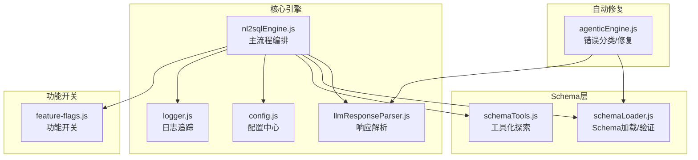
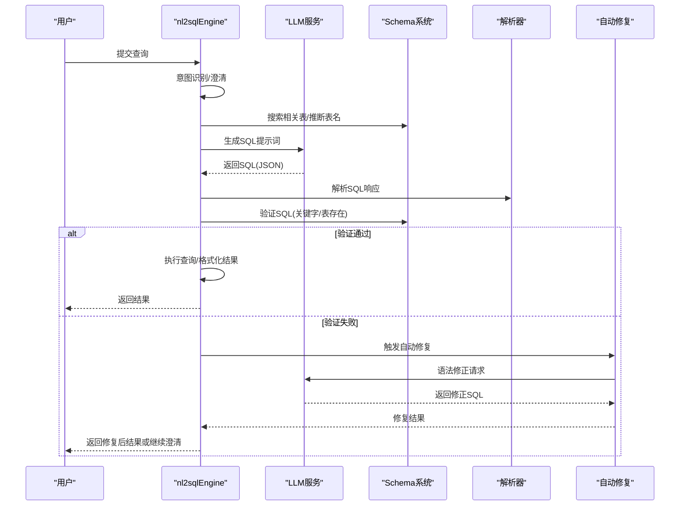
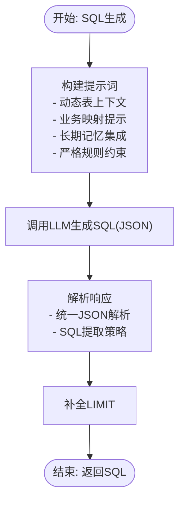
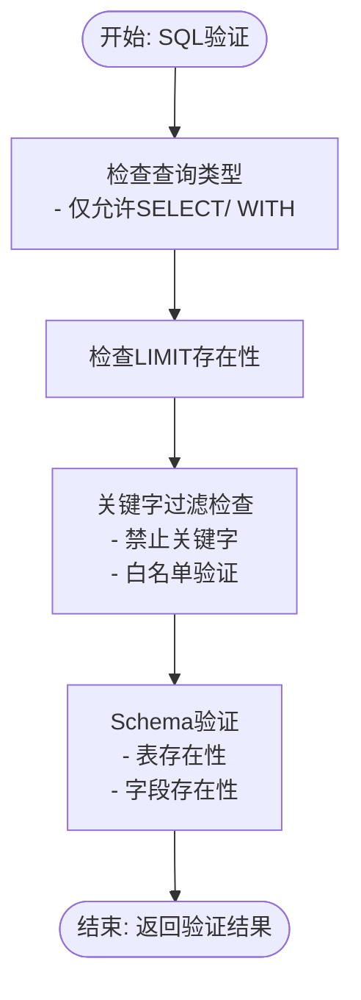
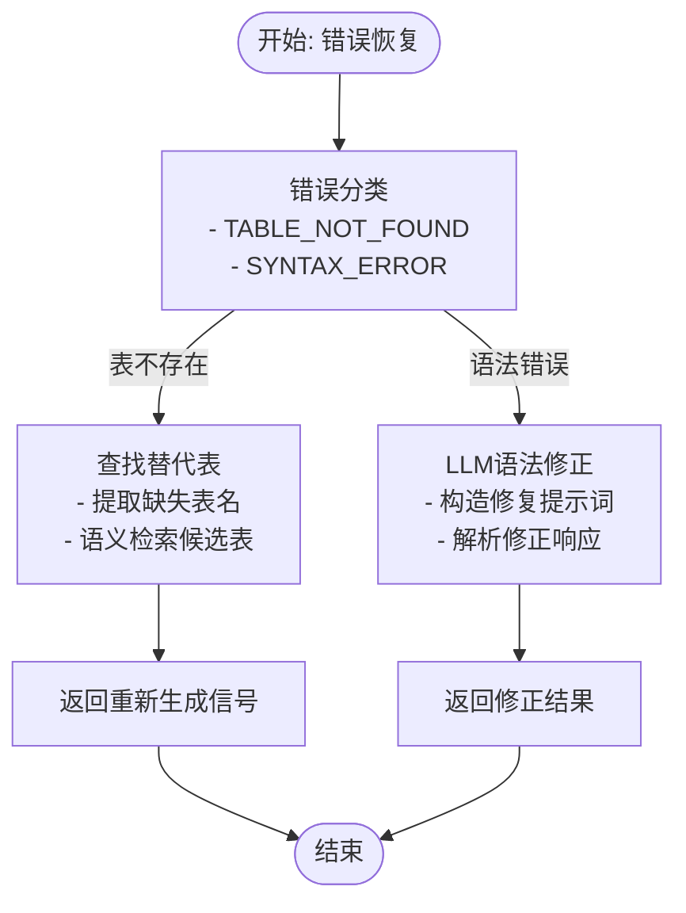
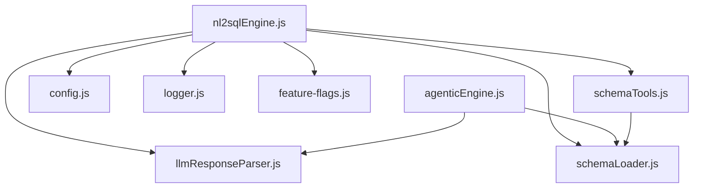

# 生成验证恢复阶段（Generation + Verification + Recovery）

<cite>
**本文档引用的文件**
- [nl2sqlEngine.js](file://backend/src/core/nl2sqlEngine.js)
- [llmResponseParser.js](file://backend/src/utils/llmResponseParser.js)
- [schemaLoader.js](file://backend/src/core/schemaLoader.js)
- [schemaTools.js](file://backend/src/core/schemaTools.js)
- [config.js](file://backend/src/core/config.js)
- [feature-flags.js](file://backend/config/feature-flags.js)
- [logger.js](file://backend/src/utils/logger.js)
- [agenticEngine.js](file://backend/src/core/agenticEngine.js)
</cite>

## 目录
1. [简介](#简介)
2. [项目结构](#项目结构)
3. [核心组件](#核心组件)
4. [架构概览](#架构概览)
5. [详细组件分析](#详细组件分析)
6. [依赖关系分析](#依赖关系分析)
7. [性能考量](#性能考量)
8. [故障排除指南](#故障排除指南)
9. [结论](#结论)

## 简介
本技术文档聚焦于NL2SQL系统中"生成验证恢复"阶段的完整实现，涵盖SQL生成、SQL验证与错误恢复三大核心子阶段。文档详细阐述了提示词工程、响应解析机制、表结构选择策略，以及多层次SQL验证体系与自动修复策略。通过对代码级实现的深入分析，帮助开发者与运维人员准确理解各子阶段的工作原理与优化要点。

## 项目结构
NL2SQL后端采用模块化设计，核心逻辑集中在`backend/src/core`目录，工具与配置分别位于`utils`与`config`目录。生成验证恢复阶段主要涉及以下模块：
- 核心引擎：`nl2sqlEngine.js`（主流程编排）
- LLM响应解析：`llmResponseParser.js`（统一JSON/SQL解析）
- Schema管理：`schemaLoader.js`（Schema加载与验证）、`schemaTools.js`（工具化Schema探索）
- 配置中心：`config.js`（安全、性能、功能开关）
- 日志系统：`logger.js`（统一日志与追踪）
- 自动修复：`agenticEngine.js`（错误分类与自动修复）

**图表来源**
- [nl2sqlEngine.js:1558-1951](file://backend/src/core/nl2sqlEngine.js#L1558-L1951)
- [llmResponseParser.js:1-146](file://backend/src/utils/llmResponseParser.js#L1-L146)
- [schemaLoader.js:1-200](file://backend/src/core/schemaLoader.js#L1-L200)
- [schemaTools.js:1-125](file://backend/src/core/schemaTools.js#L1-L125)
- [config.js:16-398](file://backend/src/core/config.js#L16-L398)
- [feature-flags.js:16-96](file://backend/config/feature-flags.js#L16-L96)
- [agenticEngine.js:515-612](file://backend/src/core/agenticEngine.js#L515-L612)

**章节来源**
- [nl2sqlEngine.js:1558-1951](file://backend/src/core/nl2sqlEngine.js#L1558-L1951)
- [llmResponseParser.js:1-146](file://backend/src/utils/llmResponseParser.js#L1-L146)
- [schemaLoader.js:1-200](file://backend/src/core/schemaLoader.js#L1-L200)
- [schemaTools.js:1-125](file://backend/src/core/schemaTools.js#L1-L125)
- [config.js:16-398](file://backend/src/core/config.js#L16-L398)
- [feature-flags.js:16-96](file://backend/config/feature-flags.js#L16-L96)
- [logger.js:1-120](file://backend/src/utils/logger.js#L1-L120)

## 核心组件
本阶段的核心组件围绕"生成-验证-恢复"闭环展开，关键职责如下：
- SQL生成：基于意图与Schema生成标准SQL，包含提示词工程、表选择策略与响应解析。
- SQL验证：多层次安全检查，包括禁止关键字过滤、表存在性验证与查询合法性检查。
- 错误恢复：错误分类、表不存在处理、语法错误修正与LLM自动修复策略。

**章节来源**
- [nl2sqlEngine.js:1558-1951](file://backend/src/core/nl2sqlEngine.js#L1558-L1951)
- [schemaLoader.js:712-760](file://backend/src/core/schemaLoader.js#L712-L760)
- [agenticEngine.js:515-612](file://backend/src/core/agenticEngine.js#L515-L612)

## 架构概览
生成验证恢复阶段的系统架构以nl2sqlEngine为核心，串联LLM、Schema系统与自动修复模块，形成闭环控制流。

**图表来源**
- [nl2sqlEngine.js:2502-2529](file://backend/src/core/nl2sqlEngine.js#L2502-L2529)
- [agenticEngine.js:515-612](file://backend/src/core/agenticEngine.js#L515-L612)
- [llmResponseParser.js:119-143](file://backend/src/utils/llmResponseParser.js#L119-L143)

## 详细组件分析

### SQL生成阶段
SQL生成阶段通过精心设计的提示词工程与表结构选择策略，确保生成的SQL既符合用户意图又满足Schema约束。

- 提示词工程
  - 动态表上下文：基于查询语义与上下文（game_id、datasource）动态检索相关表，限制返回数量以降低Token消耗。
  - 业务映射提示：根据表名推断业务含义，生成Schema映射提示，帮助LLM理解业务术语与字段对应关系。
  - 长期记忆集成：加载用户学习的字段别名与历史偏好，确保生成SQL遵循用户习惯。
  - 严格规则约束：明确禁止猜测、强制使用实际表名与字段名、限制查询类型与添加LIMIT等。

- 响应解析机制
  - 统一JSON解析：支持直接JSON、代码块与最外层花括号三种策略，提升鲁棒性。
  - SQL提取策略：优先从JSON提取sql字段，其次提取代码块，最后正则匹配SELECT语句。

- 表结构选择策略
  - 多源融合：结合语义检索、业务关键词推断与语义层推荐，合并去重后限制最大表数量。
  - 精简Schema输出：使用紧凑版Schema输出，仅包含关键字段信息，减少Prompt体积。
  - 上下文感知：根据game_id与datasource增强查询，提升表匹配准确性。

**图表来源**
- [nl2sqlEngine.js:1558-1951](file://backend/src/core/nl2sqlEngine.js#L1558-L1951)
- [llmResponseParser.js:24-59](file://backend/src/utils/llmResponseParser.js#L24-L59)
- [llmResponseParser.js:119-143](file://backend/src/utils/llmResponseParser.js#L119-L143)

**章节来源**
- [nl2sqlEngine.js:1558-1951](file://backend/src/core/nl2sqlEngine.js#L1558-L1951)
- [llmResponseParser.js:1-146](file://backend/src/utils/llmResponseParser.js#L1-L146)

### SQL验证阶段
SQL验证阶段实施多层次检查体系，确保生成的SQL符合安全与规范要求。

- 基本语法检查
  - 关键字过滤：禁止UPDATE/DELETE/INSERT/ALTER/TRUNCATE/CREATE/GRANT/REVOKE/EXEC/EXECUTE等危险操作。
  - 查询类型限制：仅允许SELECT或WITH（CTE）查询。
  - LIMIT约束：强制包含LIMIT限制，防止大查询导致性能问题。

- 安全关键字过滤
  - 禁止关键字列表：通过配置中心集中管理，支持灵活扩展。
  - 白名单机制：可配置允许访问的数据表白名单，增强访问控制。

- 表存在性验证
  - Schema验证：委托schemaLoader.validateSQL进行表名与字段存在性检查。
  - 上下文增强：结合查询中的表名与上下文信息，提升验证准确性。

**图表来源**
- [nl2sqlEngine.js:1953-1997](file://backend/src/core/nl2sqlEngine.js#L1953-L1997)
- [schemaLoader.js:712-760](file://backend/src/core/schemaLoader.js#L712-L760)
- [config.js:140-170](file://backend/src/core/config.js#L140-L170)

**章节来源**
- [nl2sqlEngine.js:1953-1997](file://backend/src/core/nl2sqlEngine.js#L1953-L1997)
- [schemaLoader.js:712-760](file://backend/src/core/schemaLoader.js#L712-L760)
- [config.js:140-170](file://backend/src/core/config.js#L140-L170)

### 错误恢复机制
错误恢复机制通过错误分类、替代表查找与LLM自动修复，实现闭环自愈能力。

- 错误分类
  - 表不存在错误：通过正则匹配识别"Table ... doesn't exist"或"Unknown table"等错误信息。
  - 语法错误：识别"Syntax error"或"Parse error"等语法问题。

- 表不存在处理
  - 替代表查找：从错误信息中提取缺失表名，调用schemaLoader.searchRelevantTables进行语义检索，返回候选表列表。
  - 用户提示：返回需要重新生成SQL的信号与建议表清单。

- 语法错误修正
  - LLM自动修复：构造修复提示词，包含原始错误信息与查询需求，请求LLM生成修正后的SQL。
  - 响应解析：使用统一解析器解析LLM返回的JSON，提取修正后的SQL与解释说明。

**图表来源**
- [agenticEngine.js:515-612](file://backend/src/core/agenticEngine.js#L515-L612)
- [llmResponseParser.js:119-143](file://backend/src/utils/llmResponseParser.js#L119-L143)

**章节来源**
- [agenticEngine.js:515-612](file://backend/src/core/agenticEngine.js#L515-L612)
- [llmResponseParser.js:1-146](file://backend/src/utils/llmResponseParser.js#L1-L146)

## 依赖关系分析
生成验证恢复阶段的依赖关系体现了清晰的分层架构与模块化设计。

**图表来源**
- [nl2sqlEngine.js:15-58](file://backend/src/core/nl2sqlEngine.js#L15-L58)
- [agenticEngine.js:15-27](file://backend/src/core/agenticEngine.js#L15-L27)
- [schemaTools.js:17-20](file://backend/src/core/schemaTools.js#L17-L20)

**章节来源**
- [nl2sqlEngine.js:15-58](file://backend/src/core/nl2sqlEngine.js#L15-L58)
- [agenticEngine.js:15-27](file://backend/src/core/agenticEngine.js#L15-L27)
- [schemaTools.js:17-20](file://backend/src/core/schemaTools.js#L17-L20)

## 性能考量
- Token预算管理：通过上下文预算检查与历史压缩，避免Prompt过大导致性能下降。
- Schema缓存与向量化：Schema数据结构缓存与向量化存储，显著提升表检索效率。
- 查询限制：强制LIMIT与最大行数限制，防止大查询造成系统压力。
- 功能开关：通过功能开关控制新特性启用，支持渐进式部署与回滚。

**章节来源**
- [nl2sqlEngine.js:2214-2257](file://backend/src/core/nl2sqlEngine.js#L2214-L2257)
- [schemaLoader.js:200-285](file://backend/src/core/schemaLoader.js#L200-L285)
- [config.js:140-170](file://backend/src/core/config.js#L140-L170)
- [feature-flags.js:16-96](file://backend/config/feature-flags.js#L16-L96)

## 故障排除指南
- SQL验证失败
  - 检查是否包含禁止关键字或非SELECT查询类型。
  - 确认SQL中是否包含LIMIT限制。
  - 验证表名与字段名是否存在于Schema中。

- 表不存在错误
  - 使用schemaLoader.searchRelevantTables查找替代表。
  - 检查查询中的表名是否正确，考虑上下文（game_id、datasource）影响。

- 语法错误修正
  - 确认错误信息是否包含在提示词中。
  - 检查LLM服务可用性与响应解析逻辑。

- 日志追踪
  - 使用logger.startTrace与logger.endTrace进行流程追踪。
  - 关注TRACE/DEBUG/INFO/WARN/ERROR各级别日志，定位问题根因。

**章节来源**
- [nl2sqlEngine.js:2502-2529](file://backend/src/core/nl2sqlEngine.js#L2502-L2529)
- [agenticEngine.js:515-612](file://backend/src/core/agenticEngine.js#L515-L612)
- [logger.js:270-448](file://backend/src/utils/logger.js#L270-L448)

## 结论
生成验证恢复阶段通过精心设计的提示词工程、严格的验证体系与智能的自动修复机制，实现了从自然语言到安全可靠SQL的高效转换。模块化架构与功能开关设计确保了系统的可扩展性与稳定性，为复杂业务场景下的NL2SQL应用提供了坚实的技术支撑。