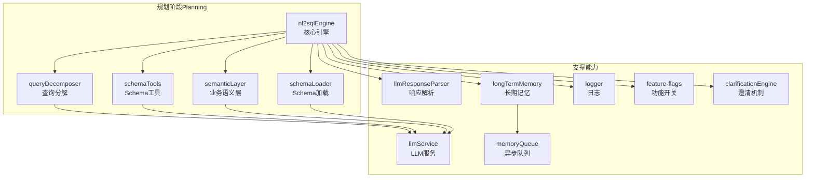
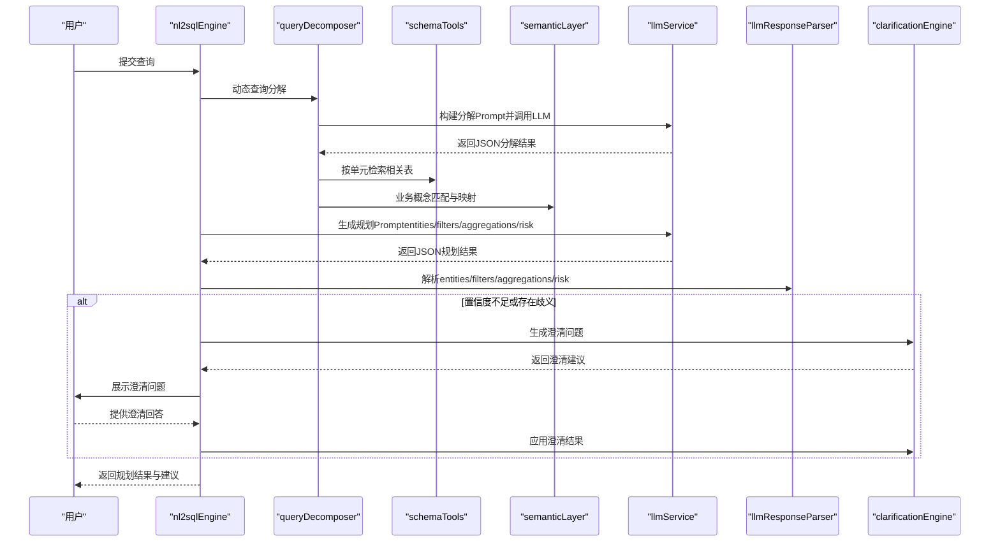
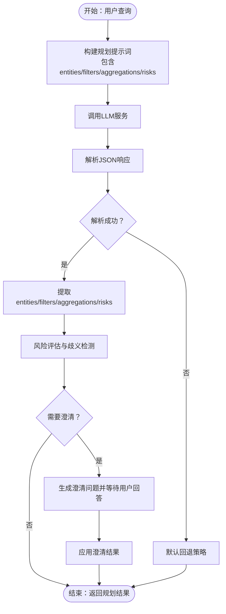
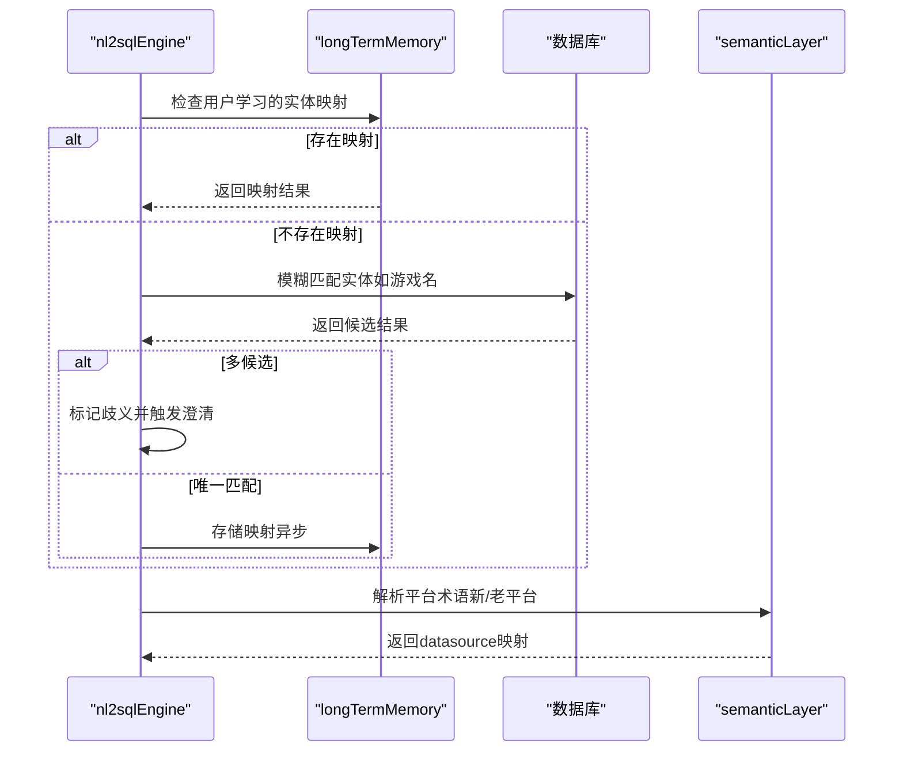
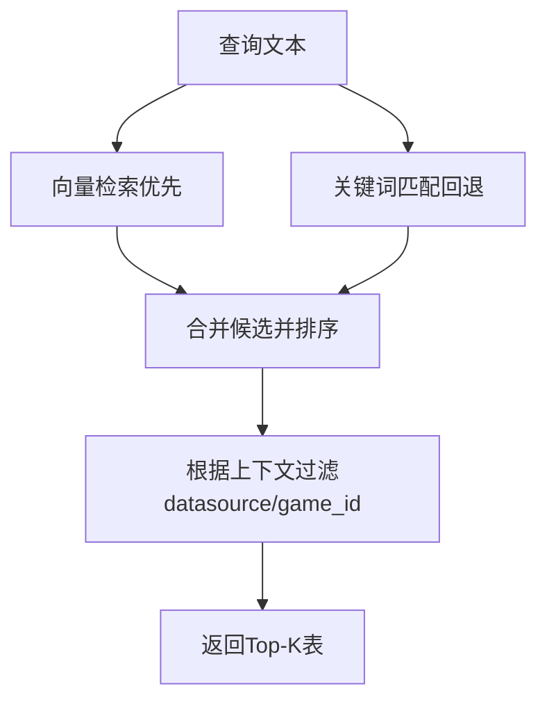
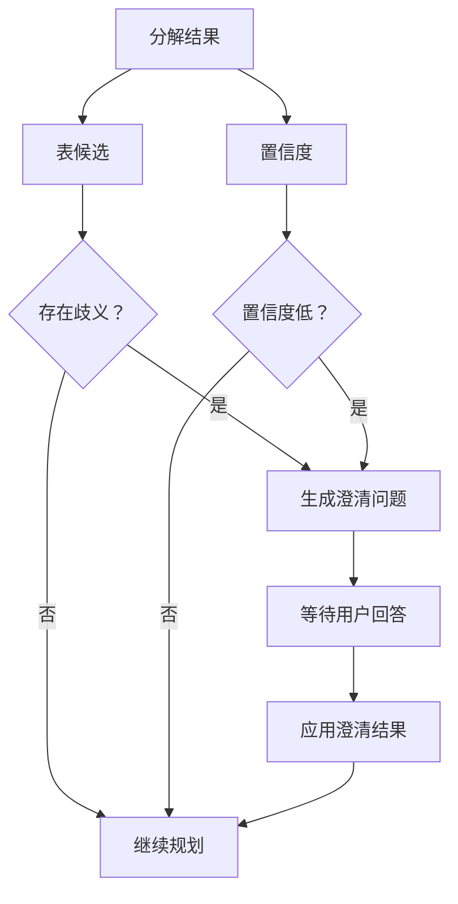
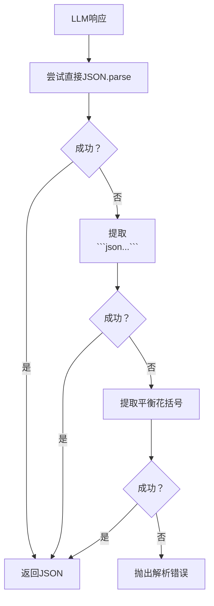
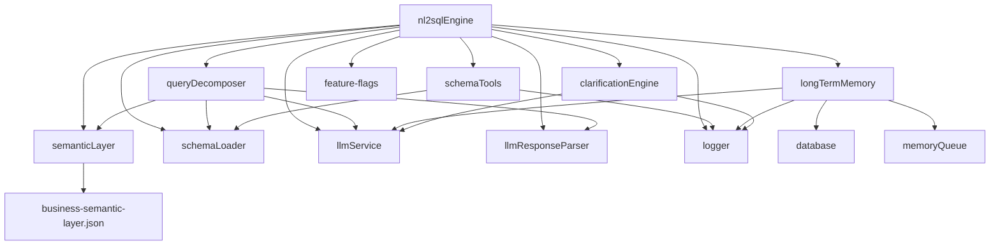

# 规划阶段（Planning）

<cite>
**本文引用的文件**
- [nl2sqlEngine.js](file://backend/src/core/nl2sqlEngine.js)
- [llmResponseParser.js](file://backend/src/utils/llmResponseParser.js)
- [schemaTools.js](file://backend/src/core/schemaTools.js)
- [semanticLayer.js](file://backend/src/core/semanticLayer.js)
- [queryDecomposer.js](file://backend/src/core/queryDecomposer.js)
- [llmService.js](file://backend/src/core/llmService.js)
- [longTermMemory.js](file://backend/src/memory/longTermMemory.js)
- [logger.js](file://backend/src/utils/logger.js)
- [business-semantic-layer.json](file://backend/config/business-semantic-layer.json)
- [feature-flags.js](file://backend/config/feature-flags.js)
- [schemaLoader.js](file://backend/src/core/schemaLoader.js)
- [clarificationEngine.js](file://backend/src/core/clarificationEngine.js)
- [memoryQueue.js](file://backend/src/memory/memoryQueue.js)
</cite>

## 目录
1. [简介](#简介)
2. [项目结构](#项目结构)
3. [核心组件](#核心组件)
4. [架构总览](#架构总览)
5. [详细组件分析](#详细组件分析)
6. [依赖分析](#依赖分析)
7. [性能考量](#性能考量)
8. [故障排查指南](#故障排查指南)
9. [结论](#结论)
10. [附录](#附录)

## 简介
本技术文档聚焦于NL2SQL系统“规划阶段（Planning）”的设计与实现，围绕以下目标展开：
- 查询需求分析：从用户查询中抽取entities、filters、aggregations、risks等关键信息。
- 数据实体识别：将自然语言中的实体映射到数据库字段或表。
- 筛选条件提取：识别并规范化查询中的过滤条件。
- 聚合计算识别：识别聚合指标、计算口径与来源表。
- 风险评估：识别歧义、不确定性与潜在错误，驱动澄清机制。
- 提示词工程设计：为LLM提供结构化、可解析的提示词，保证输出稳定性。
- JSON响应解析机制：统一从LLM响应中提取JSON与SQL。
- 默认回退策略：在LLM失败或解析失败时的稳健处理。
- 状态管理、日志记录与性能优化：贯穿规划阶段的可观测性与效率保障。

## 项目结构
规划阶段位于后端核心模块中，主要涉及以下文件：
- 核心引擎与流程编排：nl2sqlEngine.js
- LLM服务与提示词：llmService.js、queryDecomposer.js
- Schema与语义层：schemaLoader.js、schemaTools.js、semanticLayer.js、business-semantic-layer.json
- 响应解析与日志：llmResponseParser.js、logger.js
- 长期记忆与偏好学习：longTermMemory.js、memoryQueue.js
- 功能开关与配置：feature-flags.js
- 澄清机制：clarificationEngine.js



图表来源
- [nl2sqlEngine.js:1-2734](file://backend/src/core/nl2sqlEngine.js#L1-L2734)
- [queryDecomposer.js:1-402](file://backend/src/core/queryDecomposer.js#L1-L402)
- [schemaTools.js:1-632](file://backend/src/core/schemaTools.js#L1-L632)
- [semanticLayer.js:1-532](file://backend/src/core/semanticLayer.js#L1-L532)
- [schemaLoader.js:1-1235](file://backend/src/core/schemaLoader.js#L1-L1235)
- [llmService.js:1-477](file://backend/src/core/llmService.js#L1-L477)
- [llmResponseParser.js:1-146](file://backend/src/utils/llmResponseParser.js#L1-L146)
- [longTermMemory.js:1-1143](file://backend/src/memory/longTermMemory.js#L1-L1143)
- [memoryQueue.js:1-217](file://backend/src/memory/memoryQueue.js#L1-L217)
- [logger.js:1-482](file://backend/src/utils/logger.js#L1-L482)
- [feature-flags.js:1-249](file://backend/config/feature-flags.js#L1-L249)
- [clarificationEngine.js:1-489](file://backend/src/core/clarificationEngine.js#L1-L489)

章节来源
- [nl2sqlEngine.js:1-2734](file://backend/src/core/nl2sqlEngine.js#L1-L2734)
- [queryDecomposer.js:1-402](file://backend/src/core/queryDecomposer.js#L1-L402)
- [schemaTools.js:1-632](file://backend/src/core/schemaTools.js#L1-L632)
- [semanticLayer.js:1-532](file://backend/src/core/semanticLayer.js#L1-L532)
- [schemaLoader.js:1-1235](file://backend/src/core/schemaLoader.js#L1-L1235)
- [llmService.js:1-477](file://backend/src/core/llmService.js#L1-L477)
- [llmResponseParser.js:1-146](file://backend/src/utils/llmResponseParser.js#L1-L146)
- [longTermMemory.js:1-1143](file://backend/src/memory/longTermMemory.js#L1-L1143)
- [memoryQueue.js:1-217](file://backend/src/memory/memoryQueue.js#L1-L217)
- [logger.js:1-482](file://backend/src/utils/logger.js#L1-L482)
- [feature-flags.js:1-249](file://backend/config/feature-flags.js#L1-L249)
- [clarificationEngine.js:1-489](file://backend/src/core/clarificationEngine.js#L1-L489)

## 核心组件
- 规划引擎（nl2sqlEngine）：负责规划阶段的整体编排，包括意图识别、实体解析、平台术语解析、表检索、风险评估与默认回退。
- 查询分解器（queryDecomposer）：将复杂查询动态拆解为数据需求单元（Data Units），并为每个单元检索相关表。
- Schema工具（schemaTools）：提供LLM可调用的Schema探索工具（search_tables、describe_table、search_knowledge、peek_table），支持按需索取。
- 业务语义层（semanticLayer）：建立业务概念到物理表/字段的映射，解决“老平台”、“累计充值”等语义歧义。
- Schema加载器（schemaLoader）：加载与缓存Schema元数据，支持向量化检索与智能匹配。
- LLM服务（llmService）：封装LLM调用、重试与错误处理，支持流式与非流式响应。
- 响应解析器（llmResponseParser）：统一从LLM响应中提取JSON与SQL，提供三段式解析策略。
- 长期记忆（longTermMemory）：从用户查询中提取偏好与映射，异步存储到数据库。
- 澄清引擎（clarificationEngine）：在置信度不足或存在歧义时生成澄清问题并应用用户回答。
- 日志与配置：logger提供结构化日志；feature-flags提供功能开关与阶段控制。

章节来源
- [nl2sqlEngine.js:1-2734](file://backend/src/core/nl2sqlEngine.js#L1-L2734)
- [queryDecomposer.js:1-402](file://backend/src/core/queryDecomposer.js#L1-L402)
- [schemaTools.js:1-632](file://backend/src/core/schemaTools.js#L1-L632)
- [semanticLayer.js:1-532](file://backend/src/core/semanticLayer.js#L1-L532)
- [schemaLoader.js:1-1235](file://backend/src/core/schemaLoader.js#L1-L1235)
- [llmService.js:1-477](file://backend/src/core/llmService.js#L1-L477)
- [llmResponseParser.js:1-146](file://backend/src/utils/llmResponseParser.js#L1-L146)
- [longTermMemory.js:1-1143](file://backend/src/memory/longTermMemory.js#L1-L1143)
- [clarificationEngine.js:1-489](file://backend/src/core/clarificationEngine.js#L1-L489)
- [logger.js:1-482](file://backend/src/utils/logger.js#L1-L482)
- [feature-flags.js:1-249](file://backend/config/feature-flags.js#L1-L249)

## 架构总览
规划阶段采用“提示词工程 + LLM解析 + Schema检索 + 语义层映射”的闭环设计：
- 用户查询进入规划阶段后，先通过查询分解器将复杂查询拆解为数据需求单元。
- 针对每个单元，结合Schema工具与语义层进行表检索与字段映射。
- 使用LLM服务生成结构化JSON响应，通过响应解析器提取entities、filters、aggregations、risks等字段。
- 若出现歧义或置信度不足，触发澄清机制，引导用户提供更明确的信息。
- 将有价值的用户偏好与映射存入长期记忆，形成持续学习闭环。



图表来源
- [nl2sqlEngine.js:1-2734](file://backend/src/core/nl2sqlEngine.js#L1-L2734)
- [queryDecomposer.js:1-402](file://backend/src/core/queryDecomposer.js#L1-L402)
- [schemaTools.js:1-632](file://backend/src/core/schemaTools.js#L1-L632)
- [semanticLayer.js:1-532](file://backend/src/core/semanticLayer.js#L1-L532)
- [llmService.js:1-477](file://backend/src/core/llmService.js#L1-L477)
- [llmResponseParser.js:1-146](file://backend/src/utils/llmResponseParser.js#L1-L146)
- [clarificationEngine.js:1-489](file://backend/src/core/clarificationEngine.js#L1-L489)

## 详细组件分析

### 查询需求分析与提示词工程
- 动态查询分解：queryDecomposer将复杂查询拆解为数据需求单元，每个单元包含类型、描述、关键词、筛选条件、时间范围、指标、行为模式与输出字段等信息。分解Prompt包含业务关键词参考与JSON输出格式约束，确保LLM输出可解析。
- 规划阶段提示词：nl2sqlEngine在规划阶段生成包含entities、filters、aggregations、risks等字段的提示词，要求LLM以JSON格式输出，便于后续解析与回退。



图表来源
- [queryDecomposer.js:79-143](file://backend/src/core/queryDecomposer.js#L79-L143)
- [llmService.js:222-308](file://backend/src/core/llmService.js#L222-L308)
- [llmResponseParser.js:24-59](file://backend/src/utils/llmResponseParser.js#L24-L59)
- [clarificationEngine.js:196-232](file://backend/src/core/clarificationEngine.js#L196-L232)

章节来源
- [queryDecomposer.js:1-402](file://backend/src/core/queryDecomposer.js#L1-L402)
- [llmService.js:1-477](file://backend/src/core/llmService.js#L1-L477)
- [llmResponseParser.js:1-146](file://backend/src/utils/llmResponseParser.js#L1-L146)
- [clarificationEngine.js:1-489](file://backend/src/core/clarificationEngine.js#L1-L489)

### 数据实体识别与平台术语解析
- 实体解析：nl2sqlEngine提供resolveEntitiesInIntent与resolvePlatformInIntent，分别处理游戏/渠道等实体与平台术语（新平台/老平台）的映射。支持长期记忆学习与数据库回退匹配。
- 平台术语映射：通过semanticLayer与business-semantic-layer.json中的datasource_mappings，将“老平台/新平台”映射到具体数据源标识。
- 长期记忆学习：longTermMemory在用户明确表达映射关系时（如“青木是game_id=30”），学习并存储为field_alias，后续直接复用。



图表来源
- [nl2sqlEngine.js:450-750](file://backend/src/core/nl2sqlEngine.js#L450-L750)
- [longTermMemory.js:470-582](file://backend/src/memory/longTermMemory.js#L470-L582)
- [semanticLayer.js:367-386](file://backend/src/core/semanticLayer.js#L367-L386)
- [business-semantic-layer.json:1-189](file://backend/config/business-semantic-layer.json#L1-L189)

章节来源
- [nl2sqlEngine.js:1-2734](file://backend/src/core/nl2sqlEngine.js#L1-L2734)
- [longTermMemory.js:1-1143](file://backend/src/memory/longTermMemory.js#L1-L1143)
- [semanticLayer.js:1-532](file://backend/src/core/semanticLayer.js#L1-L532)
- [business-semantic-layer.json:1-189](file://backend/config/business-semantic-layer.json#L1-L189)

### 筛选条件提取与表检索
- 表检索策略：schemaLoader.searchRelevantTables支持向量检索与关键词匹配双通道，优先使用向量检索，失败时回退到关键词匹配。支持根据game_id与datasource上下文智能过滤与排序。
- Schema工具：schemaTools提供search_tables、describe_table、search_knowledge、peek_table四个工具，LLM可通过工具调用按需探索Schema，避免一次性灌输大量Schema信息。
- 表候选合并：queryDecomposer.mergeTableCandidates基于覆盖率与频率计算综合得分，优先推荐能覆盖多个数据单元的表，便于后续SQL生成。



图表来源
- [schemaLoader.js:571-710](file://backend/src/core/schemaLoader.js#L571-L710)
- [schemaTools.js:225-393](file://backend/src/core/schemaTools.js#L225-L393)
- [queryDecomposer.js:348-382](file://backend/src/core/queryDecomposer.js#L348-L382)

章节来源
- [schemaLoader.js:1-1235](file://backend/src/core/schemaLoader.js#L1-L1235)
- [schemaTools.js:1-632](file://backend/src/core/schemaTools.js#L1-L632)
- [queryDecomposer.js:1-402](file://backend/src/core/queryDecomposer.js#L1-L402)

### 聚合计算识别与风险评估
- 聚合识别：semanticLayer与business-semantic-layer.json提供“累计充值”等聚合概念的映射，包括主表、聚合函数与字段。queryDecomposer在分解阶段也识别指标单元与聚合需求。
- 风险评估：clarificationEngine.checkClarificationNeeded根据多种触发条件（无匹配表、表歧义、聚合来源不确定、时间粒度不明确、低置信度）评估是否需要澄清。
- 默认回退：llmResponseParser提供三段式解析策略（直接解析、代码块提取、花括号提取），并在失败时抛出错误，由上层规划引擎进行兜底处理。



图表来源
- [clarificationEngine.js:196-232](file://backend/src/core/clarificationEngine.js#L196-L232)
- [queryDecomposer.js:348-382](file://backend/src/core/queryDecomposer.js#L348-L382)
- [llmResponseParser.js:24-59](file://backend/src/utils/llmResponseParser.js#L24-L59)

章节来源
- [clarificationEngine.js:1-489](file://backend/src/core/clarificationEngine.js#L1-L489)
- [queryDecomposer.js:1-402](file://backend/src/core/queryDecomposer.js#L1-L402)
- [llmResponseParser.js:1-146](file://backend/src/utils/llmResponseParser.js#L1-L146)

### JSON响应解析机制与默认回退策略
- 解析策略：llmResponseParser.parseJSON提供三段式解析，优先尝试直接JSON.parse，其次提取```json...```代码块，最后使用平衡花括号算法提取最外层JSON对象。
- SQL提取：llmResponseParser.extractSQL优先从JSON中提取sql字段，其次提取```sql...```代码块，最后通过正则匹配SELECT语句。
- 回退策略：当LLM响应不符合预期或解析失败时，规划引擎采用默认回退（如使用高频核心表、硬编码映射、默认澄清选项等），确保系统稳定运行。



图表来源
- [llmResponseParser.js:24-106](file://backend/src/utils/llmResponseParser.js#L24-L106)

章节来源
- [llmResponseParser.js:1-146](file://backend/src/utils/llmResponseParser.js#L1-L146)

### 状态管理、日志记录与性能优化
- 状态管理：feature-flags.js提供功能开关，控制各Phase的启用状态，支持渐进式上线与快速回滚。
- 日志记录：logger.js提供TRACE/DEBUG/INFO/WARN/ERROR五级日志，支持控制台与文件输出、结构化元数据、追踪上下文（trace）与僵尸条目清理。
- 性能优化：
  - 向量检索：schemaLoader.vectorizeSchema采用表级向量与智能搜索，减少字段级向量开销。
  - 异步存储：longTermMemory.memoryQueue批量异步存储，避免阻塞主流程。
  - 缓存与回退：schemaLoader缓存Schema与向量，失败时回退到关键词匹配；nl2sqlEngine回退到高频核心表。

章节来源
- [feature-flags.js:1-249](file://backend/config/feature-flags.js#L1-L249)
- [logger.js:1-482](file://backend/src/utils/logger.js#L1-L482)
- [schemaLoader.js:210-285](file://backend/src/core/schemaLoader.js#L210-L285)
- [memoryQueue.js:1-217](file://backend/src/memory/memoryQueue.js#L1-L217)

## 依赖分析
规划阶段的组件耦合关系如下：
- nl2sqlEngine依赖queryDecomposer、schemaTools、semanticLayer、schemaLoader、llmService、llmResponseParser、longTermMemory、clarificationEngine、logger、feature-flags。
- queryDecomposer依赖llmService、schemaLoader、semanticLayer、llmResponseParser。
- schemaTools依赖schemaLoader、logger、config。
- semanticLayer依赖business-semantic-layer.json与config。
- longTermMemory依赖database、llmService、memoryQueue、logger、config。
- clarificationEngine依赖llmService、logger。



图表来源
- [nl2sqlEngine.js:1-2734](file://backend/src/core/nl2sqlEngine.js#L1-L2734)
- [queryDecomposer.js:1-402](file://backend/src/core/queryDecomposer.js#L1-L402)
- [schemaTools.js:1-632](file://backend/src/core/schemaTools.js#L1-L632)
- [semanticLayer.js:1-532](file://backend/src/core/semanticLayer.js#L1-L532)
- [schemaLoader.js:1-1235](file://backend/src/core/schemaLoader.js#L1-L1235)
- [llmService.js:1-477](file://backend/src/core/llmService.js#L1-L477)
- [llmResponseParser.js:1-146](file://backend/src/utils/llmResponseParser.js#L1-L146)
- [longTermMemory.js:1-1143](file://backend/src/memory/longTermMemory.js#L1-L1143)
- [memoryQueue.js:1-217](file://backend/src/memory/memoryQueue.js#L1-L217)
- [logger.js:1-482](file://backend/src/utils/logger.js#L1-L482)
- [feature-flags.js:1-249](file://backend/config/feature-flags.js#L1-L249)
- [business-semantic-layer.json:1-189](file://backend/config/business-semantic-layer.json#L1-L189)

章节来源
- [nl2sqlEngine.js:1-2734](file://backend/src/core/nl2sqlEngine.js#L1-L2734)
- [queryDecomposer.js:1-402](file://backend/src/core/queryDecomposer.js#L1-L402)
- [schemaTools.js:1-632](file://backend/src/core/schemaTools.js#L1-L632)
- [semanticLayer.js:1-532](file://backend/src/core/semanticLayer.js#L1-L532)
- [schemaLoader.js:1-1235](file://backend/src/core/schemaLoader.js#L1-L1235)
- [llmService.js:1-477](file://backend/src/core/llmService.js#L1-L477)
- [llmResponseParser.js:1-146](file://backend/src/utils/llmResponseParser.js#L1-L146)
- [longTermMemory.js:1-1143](file://backend/src/memory/longTermMemory.js#L1-L1143)
- [memoryQueue.js:1-217](file://backend/src/memory/memoryQueue.js#L1-L217)
- [logger.js:1-482](file://backend/src/utils/logger.js#L1-L482)
- [feature-flags.js:1-249](file://backend/config/feature-flags.js#L1-L249)
- [business-semantic-layer.json:1-189](file://backend/config/business-semantic-layer.json#L1-L189)

## 性能考量
- 向量检索与缓存：schemaLoader对Schema进行表级向量化，支持增量更新与缓存，显著降低检索成本。
- 异步存储：memoryQueue批量异步存储用户偏好，避免阻塞主流程，提升吞吐。
- 回退策略：在LLM失败或解析失败时，采用高频核心表、硬编码映射与默认澄清选项，确保系统可用性。
- 功能开关：feature-flags允许渐进式启用新功能，便于性能对比与快速回滚。

## 故障排查指南
- LLM响应解析失败：检查llmResponseParser的三段式解析策略是否命中，必要时调整提示词格式或增加JSON包裹。
- 表检索不准确：确认schemaLoader的向量存储是否初始化，关键词匹配是否合理，必要时回退到高频核心表。
- 实体解析歧义：检查longTermMemory的学习记录与数据库模糊匹配逻辑，必要时触发clarificationEngine生成澄清问题。
- 日志追踪：使用logger.startTrace与logger.endTrace记录规划阶段关键步骤，定位性能瓶颈与错误位置。

章节来源
- [llmResponseParser.js:1-146](file://backend/src/utils/llmResponseParser.js#L1-L146)
- [schemaLoader.js:1-1235](file://backend/src/core/schemaLoader.js#L1-L1235)
- [longTermMemory.js:1-1143](file://backend/src/memory/longTermMemory.js#L1-L1143)
- [clarificationEngine.js:1-489](file://backend/src/core/clarificationEngine.js#L1-L489)
- [logger.js:1-482](file://backend/src/utils/logger.js#L1-L482)

## 结论
规划阶段通过“提示词工程 + LLM解析 + Schema检索 + 语义层映射 + 澄清机制”的闭环设计，实现了对用户查询的深度理解与稳健规划。其关键优势在于：
- 结构化的提示词与统一的JSON解析，确保输出稳定性；
- 智能的表检索与实体解析，兼顾准确性与性能；
- 完善的风险评估与默认回退策略，提升系统鲁棒性；
- 长期记忆与异步存储，形成持续学习闭环。

## 附录
- 业务语义层配置：business-semantic-layer.json定义了平台、充值、注册、登录、聊天、创角等业务概念的映射与优先级，为规划阶段提供权威语义参考。
- 功能开关：feature-flags.js支持按Phase启用/禁用功能，便于灰度发布与性能对比。

章节来源
- [business-semantic-layer.json:1-189](file://backend/config/business-semantic-layer.json#L1-L189)
- [feature-flags.js:1-249](file://backend/config/feature-flags.js#L1-L249)