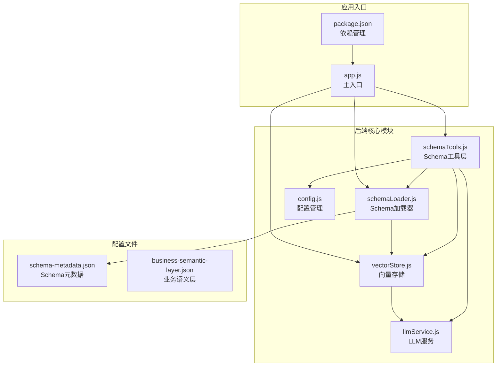
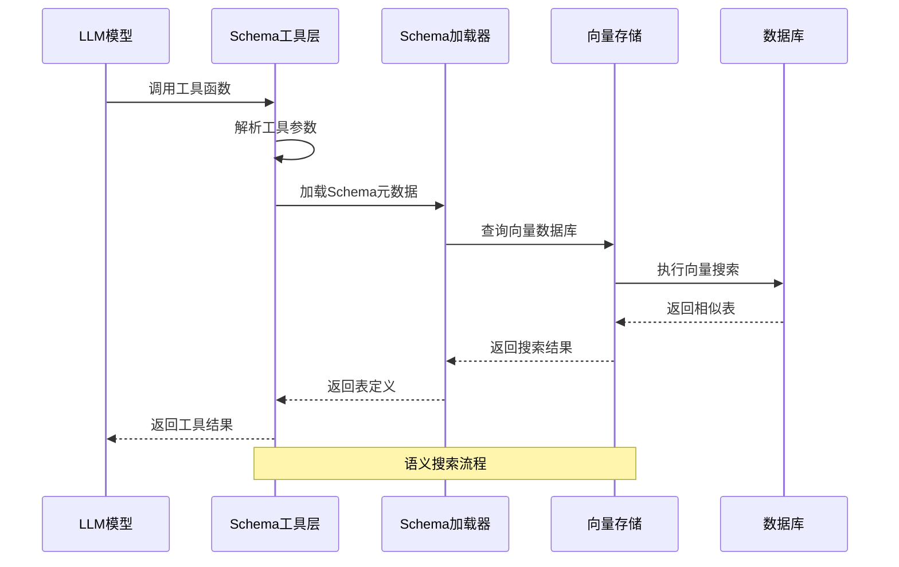
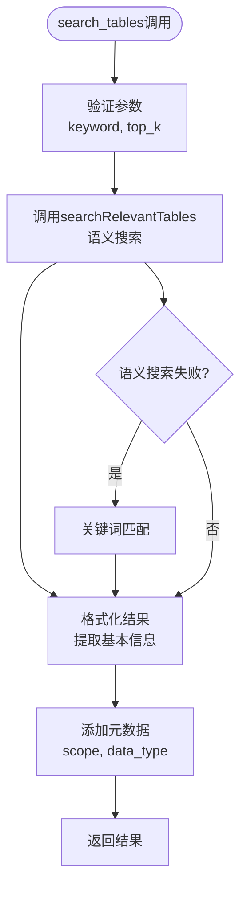
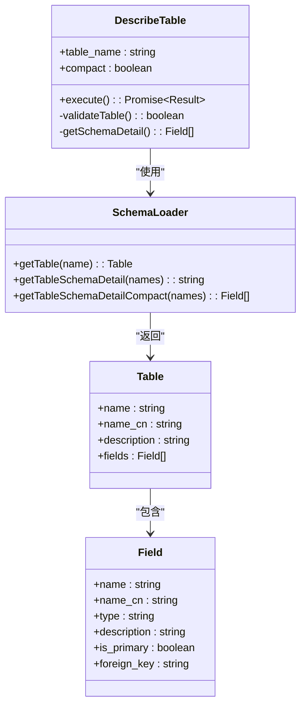
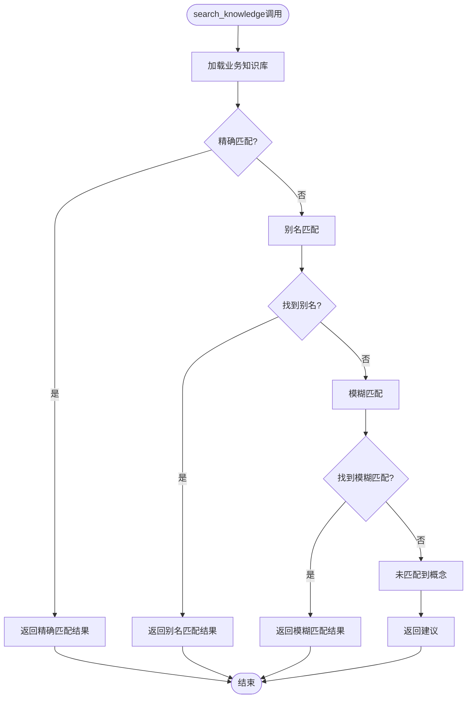
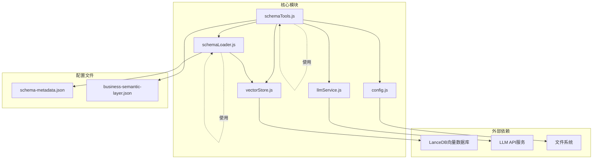

# Schema探索工具集

<cite>
**本文档引用的文件**
- [schemaTools.js](file://backend/src/core/schemaTools.js)
- [schemaLoader.js](file://backend/src/core/schemaLoader.js)
- [vectorStore.js](file://backend/src/memory/vectorStore.js)
- [llmService.js](file://backend/src/core/llmService.js)
- [config.js](file://backend/src/core/config.js)
- [schema-metadata.json](file://backend/config/schema-metadata.json)
- [business-semantic-layer.json](file://backend/config/business-semantic-layer.json)
- [app.js](file://backend/src/app.js)
- [package.json](file://backend/package.json)
</cite>

## 目录
1. [简介](#简介)
2. [项目结构](#项目结构)
3. [核心组件](#核心组件)
4. [架构概览](#架构概览)
5. [详细组件分析](#详细组件分析)
6. [依赖关系分析](#依赖关系分析)
7. [性能考虑](#性能考虑)
8. [故障排除指南](#故障排除指南)
9. [结论](#结论)

## 简介

Schema探索工具集是NL2SQL项目中的核心Schema发现和理解模块，采用"按需索取"的设计理念，通过四个核心工具为LLM提供精确的Schema信息。该工具集实现了从Schema元数据加载、语义搜索、业务概念映射到表结构预览的完整探索流程。

该工具集的主要特点包括：
- **按需索取**：仅在LLM需要时才加载和返回Schema信息
- **多层缓存**：Level 1索引缓存和Schema元数据缓存双重保护
- **语义搜索**：基于向量数据库的智能表搜索
- **业务语义层**：将业务概念映射到物理表结构
- **安全预览**：表结构预览功能确保数据安全

## 项目结构

NL2SQL项目的Schema探索工具集位于后端核心模块中，采用模块化设计：



**图表来源**
- [schemaTools.js:1-632](file://backend/src/core/schemaTools.js#L1-L632)
- [schemaLoader.js:1-800](file://backend/src/core/schemaLoader.js#L1-L800)
- [vectorStore.js:1-800](file://backend/src/memory/vectorStore.js#L1-L800)

**章节来源**
- [app.js:1-266](file://backend/src/app.js#L1-L266)
- [package.json:1-28](file://backend/package.json#L1-L28)

## 核心组件

Schema探索工具集由四个核心组件构成，每个组件都有明确的职责和接口：

### 1. 工具定义层
提供标准化的工具接口定义，支持OpenAI Function Calling格式，确保LLM能够正确理解和调用各种Schema探索工具。

### 2. Level 1索引管理
实现极简版Schema索引，仅包含表名、业务注释等基本信息，用于初步筛选和快速搜索。

### 3. 业务知识库
维护业务概念到物理表的映射关系，支持精确匹配、别名匹配和模糊匹配三种匹配策略。

### 4. 工具执行器
实现具体的Schema探索逻辑，包括表搜索、表描述、概念查询和表预览等功能。

**章节来源**
- [schemaTools.js:36-124](file://backend/src/core/schemaTools.js#L36-L124)
- [schemaTools.js:136-173](file://backend/src/core/schemaTools.js#L136-L173)
- [schemaTools.js:405-542](file://backend/src/core/schemaTools.js#L405-L542)

## 架构概览

Schema探索工具集采用分层架构设计，实现了从数据加载到工具执行的完整流程：



**图表来源**
- [schemaTools.js:565-577](file://backend/src/core/schemaTools.js#L565-L577)
- [schemaLoader.js:571-653](file://backend/src/core/schemaLoader.js#L571-L653)
- [vectorStore.js:452-576](file://backend/src/memory/vectorStore.js#L452-L576)

该架构的核心优势：
- **解耦设计**：各组件职责明确，便于独立维护和扩展
- **缓存优化**：多层缓存机制减少重复计算和数据库访问
- **向量化搜索**：利用语义相似度提升搜索准确性和效率
- **安全隔离**：表预览功能确保数据安全，防止敏感信息泄露

## 详细组件分析

### search_tables（表搜索）工具

search_tables工具提供基于关键词的表搜索功能，支持语义搜索和关键词匹配两种模式：

#### 参数定义
- `keyword` (必需): 搜索关键词，支持中文业务术语和表名片段
- `top_k` (可选): 返回结果数量，默认5个

#### 返回格式
```json
{
  "success": true,
  "count": 3,
  "tables": [
    {
      "name": "tzpingtai_tz_sdk_log_pf_reg",
      "name_cn": "平台注册表",
      "description": "平台注册表，记录用户在平台的注册行为",
      "scope": "platform",
      "data_type": "raw_log"
    }
  ]
}
```

#### 内部逻辑
1. **参数验证**：检查keyword参数并设置默认值
2. **语义搜索**：调用schemaLoader.searchRelevantTables进行智能搜索
3. **结果格式化**：提取表的基本信息并添加域标签和数据类型
4. **性能优化**：使用Level 1索引进行初步筛选



**图表来源**
- [schemaTools.js:225-256](file://backend/src/core/schemaTools.js#L225-L256)
- [schemaLoader.js:571-710](file://backend/src/core/schemaLoader.js#L571-L710)

**章节来源**
- [schemaTools.js:225-256](file://backend/src/core/schemaTools.js#L225-L256)
- [schemaLoader.js:571-653](file://backend/src/core/schemaLoader.js#L571-L653)

### describe_table（表描述）工具

describe_table工具提供详细的表结构信息，支持紧凑版和完整版两种输出格式：

#### 参数定义
- `table_name` (必需): 表名（英文）
- `compact` (可选): 是否返回精简版，默认true

#### 返回格式
```json
{
  "success": true,
  "table_name": "tzpingtai_tz_sdk_log_pf_reg",
  "name_cn": "平台注册表",
  "description": "平台注册表，记录用户在平台的注册行为",
  "field_count": 25,
  "schema_detail": {
    "fields": [
      {
        "name": "sf_id",
        "name_cn": "唯一ID",
        "type": "BIGINT",
        "description": "雪花ID，全局唯一",
        "is_primary": true,
        "foreign_key": null
      }
    ]
  }
}
```

#### 内部逻辑
1. **表验证**：检查表是否存在
2. **结构获取**：根据compact参数选择不同的输出格式
3. **字段详情**：返回字段的详细信息包括类型、描述、主键等
4. **安全控制**：仅返回结构信息，不包含实际数据



**图表来源**
- [schemaTools.js:266-306](file://backend/src/core/schemaTools.js#L266-L306)
- [schemaLoader.js:790-800](file://backend/src/core/schemaLoader.js#L790-L800)

**章节来源**
- [schemaTools.js:266-306](file://backend/src/core/schemaTools.js#L266-L306)
- [schemaLoader.js:441-473](file://backend/src/core/schemaLoader.js#L441-L473)

### search_knowledge（概念查询）工具

search_knowledge工具查询业务概念的定义和映射关系，支持多种匹配策略：

#### 参数定义
- `concept` (必需): 业务概念名称，如"老平台"、"累计充值"等

#### 返回格式
```json
{
  "success": true,
  "concept": "老平台",
  "matched": true,
  "match_type": "exact",
  "description": "指平台标识为 old 的数据，对应 new_tzpingtaiold 数据库",
  "mappings": {
    "datasource": "new_tzpingtaiold",
    "platform_field": "platform_type",
    "platform_value": ["1", "2", "old"]
  }
}
```

#### 匹配策略
1. **精确匹配**：完全匹配业务概念名称
2. **别名匹配**：匹配概念的别名列表
3. **模糊匹配**：部分匹配和包含匹配
4. **未匹配**：返回建议使用search_tables工具



**图表来源**
- [schemaTools.js:315-337](file://backend/src/core/schemaTools.js#L315-L337)
- [schemaTools.js:490-542](file://backend/src/core/schemaTools.js#L490-L542)

**章节来源**
- [schemaTools.js:315-337](file://backend/src/core/schemaTools.js#L315-L337)
- [schemaTools.js:405-481](file://backend/src/core/schemaTools.js#L405-L481)

### peek_table（表预览）工具

peek_table工具提供表结构预览功能，确保数据安全的同时提供足够的信息：

#### 参数定义
- `table_name` (必需): 表名（英文）
- `limit` (可选): 返回行数，默认3，最大10

#### 返回格式
```json
{
  "success": true,
  "table_name": "tzpingtai_tz_sdk_log_pf_reg",
  "name_cn": "平台注册表",
  "field_count": 25,
  "sample_fields": [
    {
      "name": "sf_id",
      "type": "BIGINT",
      "name_cn": "唯一ID",
      "description": "雪花ID，全局唯一",
      "is_primary": true,
      "foreign_key": null
    }
  ],
  "note": "出于安全考虑，仅返回表结构预览，不返回实际数据"
}
```

#### 安全考虑
- **数据脱敏**：仅返回字段结构信息
- **行数限制**：默认最多返回10行
- **字段限制**：默认最多返回10个字段

**章节来源**
- [schemaTools.js:348-393](file://backend/src/core/schemaTools.js#L348-L393)

## 依赖关系分析

Schema探索工具集的依赖关系体现了清晰的分层架构：



**图表来源**
- [schemaTools.js:17-26](file://backend/src/core/schemaTools.js#L17-L26)
- [schemaLoader.js:15-26](file://backend/src/core/schemaLoader.js#L15-L26)
- [vectorStore.js:14-23](file://backend/src/memory/vectorStore.js#L14-L23)

### 关键依赖说明

1. **向量数据库依赖**：LanceDB提供语义搜索能力
2. **LLM服务依赖**：OpenAI兼容的API提供Embedding和聊天功能
3. **文件系统依赖**：配置文件和Schema元数据存储
4. **配置管理依赖**：统一的配置管理和环境变量支持

**章节来源**
- [schemaTools.js:17-26](file://backend/src/core/schemaTools.js#L17-L26)
- [schemaLoader.js:15-26](file://backend/src/core/schemaLoader.js#L15-L26)
- [vectorStore.js:14-23](file://backend/src/memory/vectorStore.js#L14-L23)

## 性能考虑

Schema探索工具集在设计时充分考虑了性能优化：

### 缓存策略
1. **Level 1索引缓存**：缓存表名和业务注释，1小时过期
2. **Schema元数据缓存**：缓存完整的Schema定义
3. **向量存储缓存**：缓存表级向量表示，支持增量更新

### 查询优化
1. **智能搜索**：结合语义搜索和关键词匹配
2. **域过滤**：根据查询意图过滤表类型
3. **结果重排序**：基于查询意图和表特征重新排序

### 内存管理
1. **懒加载**：仅在需要时加载Schema信息
2. **连接池**：数据库连接池管理
3. **资源清理**：优雅关闭时清理所有资源

## 故障排除指南

### 常见问题及解决方案

#### 1. 向量数据库初始化失败
**症状**：语义搜索功能不可用
**原因**：LanceDB连接失败或权限不足
**解决**：检查VECTOR_DB_PATH配置和目录权限

#### 2. LLM API调用失败
**症状**：Embedding或聊天功能异常
**原因**：API密钥错误或网络连接问题
**解决**：验证LLM_API_KEY和LLM_API_BASE配置

#### 3. Schema加载失败
**症状**：表搜索返回空结果
**原因**：schema-metadata.json文件损坏
**解决**：检查JSON格式和文件完整性

#### 4. 工具调用参数错误
**症状**：工具返回错误信息
**原因**：参数类型或格式不正确
**解决**：参考工具定义中的参数说明

**章节来源**
- [schemaTools.js:248-255](file://backend/src/core/schemaTools.js#L248-L255)
- [schemaTools.js:298-305](file://backend/src/core/schemaTools.js#L298-L305)
- [schemaTools.js:336-341](file://backend/src/core/schemaTools.js#L336-L341)

## 结论

Schema探索工具集通过精心设计的架构和优化策略，为NL2SQL项目提供了强大而灵活的Schema发现能力。该工具集的核心优势包括：

1. **智能化搜索**：结合语义搜索和关键词匹配，提供准确的表发现
2. **安全设计**：通过表预览功能确保数据安全
3. **高性能架构**：多层缓存和优化策略确保快速响应
4. **扩展性强**：模块化设计便于功能扩展和维护

该工具集不仅满足了当前的Schema探索需求，还为未来的功能扩展奠定了坚实的基础。通过合理的架构设计和性能优化，它能够有效支持大规模的Schema管理和查询场景。