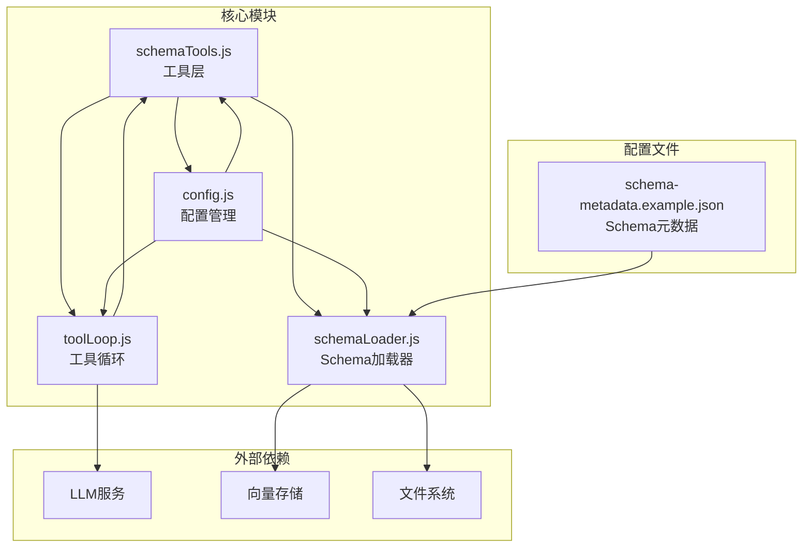
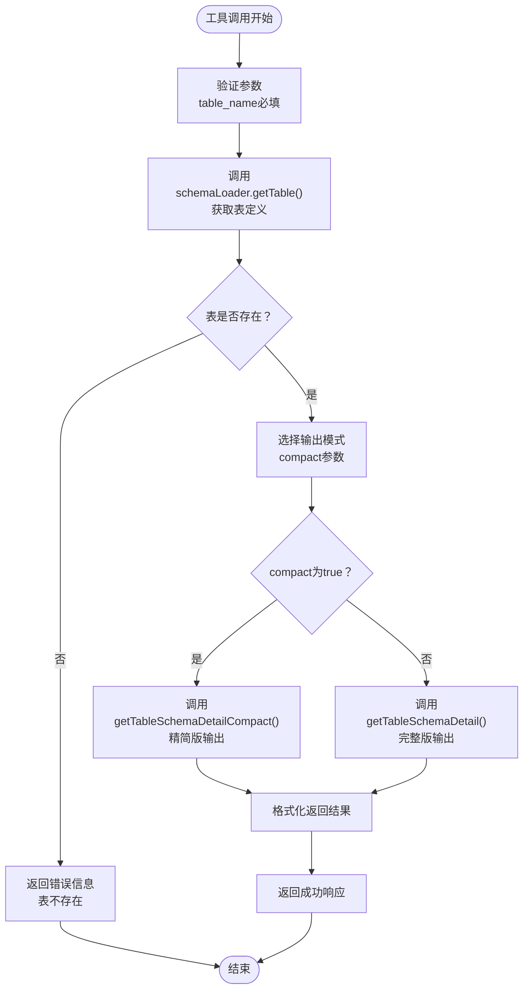
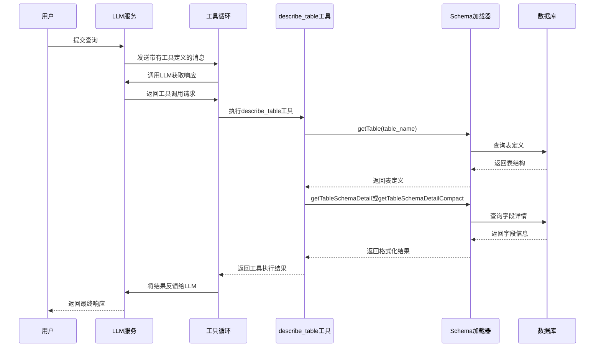
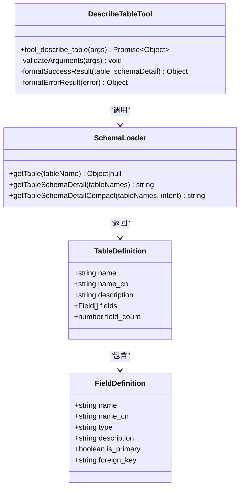
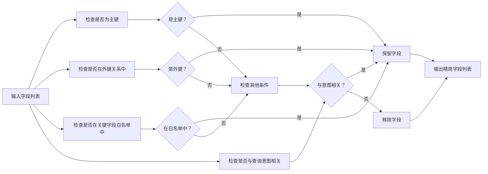
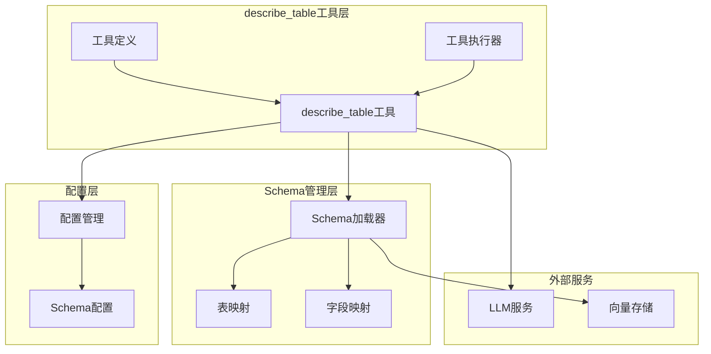

# describe_table表描述工具

<cite>
**本文档引用的文件**
- [schemaTools.js](file://backend/src/core/schemaTools.js)
- [schemaLoader.js](file://backend/src/core/schemaLoader.js)
- [toolLoop.js](file://backend/src/core/toolLoop.js)
- [config.js](file://backend/src/core/config.js)
- [schema-metadata.example.json](file://backend/config/schema-metadata.example.json)
</cite>

## 目录
1. [简介](#简介)
2. [项目结构](#项目结构)
3. [核心组件](#核心组件)
4. [架构概览](#架构概览)
5. [详细组件分析](#详细组件分析)
6. [依赖关系分析](#依赖关系分析)
7. [性能考量](#性能考量)
8. [故障排除指南](#故障排除指南)
9. [结论](#结论)

## 简介

describe_table表描述工具是NL2SQL项目中的核心Schema探索工具之一，专门用于获取指定数据库表的详细字段信息。该工具实现了"按需索取"的Schema发现机制，通过LLM可调用的函数形式，为用户提供精确的表结构信息，支持精简模式和完整模式两种输出格式。

该工具的主要功能包括：
- 获取指定表的完整字段信息
- 支持精简模式（仅关键字段）和完整模式（全部字段）
- 集成表存在性验证
- 提供字段信息格式化和错误处理
- 与schemaLoader模块深度集成

## 项目结构

NL2SQL项目采用模块化架构设计，describe_table工具位于核心模块中，与Schema管理和LLM交互紧密集成：

**图表来源**
- [schemaTools.js:1-632](file://backend/src/core/schemaTools.js#L1-L632)
- [schemaLoader.js:1-1235](file://backend/src/core/schemaLoader.js#L1-L1235)
- [toolLoop.js:1-521](file://backend/src/core/toolLoop.js#L1-L521)

**章节来源**
- [schemaTools.js:1-632](file://backend/src/core/schemaTools.js#L1-L632)
- [schemaLoader.js:1-1235](file://backend/src/core/schemaLoader.js#L1-L1235)

## 核心组件

### 工具定义与参数

describe_table工具在TOOL_DEFINITIONS中定义，具有明确的参数规范：

| 参数名 | 类型 | 必填 | 默认值 | 描述 |
|--------|------|------|--------|------|
| table_name | string | 是 | - | 表名（英文） |
| compact | boolean | 否 | true | 是否返回精简版 |

### 工具实现架构

**图表来源**
- [schemaTools.js:266-306](file://backend/src/core/schemaTools.js#L266-L306)
- [schemaLoader.js:838-903](file://backend/src/core/schemaLoader.js#L838-L903)

**章节来源**
- [schemaTools.js:66-83](file://backend/src/core/schemaTools.js#L66-L83)
- [schemaTools.js:266-306](file://backend/src/core/schemaTools.js#L266-L306)

## 架构概览

describe_table工具在整个NL2SQL系统中扮演着Schema探索的关键角色，通过工具循环与LLM进行交互：

**图表来源**
- [toolLoop.js:57-185](file://backend/src/core/toolLoop.js#L57-L185)
- [schemaTools.js:266-306](file://backend/src/core/schemaTools.js#L266-L306)
- [schemaLoader.js:450-452](file://backend/src/core/schemaLoader.js#L450-L452)

## 详细组件分析

### describe_table工具实现

#### 核心功能实现

describe_table工具的核心实现位于schemaTools.js的tool_describe_table函数中，该函数负责：

1. **参数验证**：确保table_name参数存在
2. **表存在性检查**：通过schemaLoader.getTable()验证表是否存在
3. **模式选择**：根据compact参数选择输出格式
4. **结果格式化**：组织返回的表信息

#### 精简模式与完整模式对比

**图表来源**
- [schemaTools.js:266-306](file://backend/src/core/schemaTools.js#L266-L306)
- [schemaLoader.js:450-452](file://backend/src/core/schemaLoader.js#L450-L452)
- [schemaLoader.js:838-903](file://backend/src/core/schemaLoader.js#L838-L903)

#### 精简模式字段过滤逻辑

精简模式通过关键字段白名单和意图相关性过滤实现：

**图表来源**
- [schemaLoader.js:838-903](file://backend/src/core/schemaLoader.js#L838-L903)

**章节来源**
- [schemaTools.js:266-306](file://backend/src/core/schemaTools.js#L266-L306)
- [schemaLoader.js:838-903](file://backend/src/core/schemaLoader.js#L838-L903)

### 返回格式规范

describe_table工具返回标准化的JSON格式，包含以下结构：

#### 成功响应格式

| 字段名 | 类型 | 描述 |
|--------|------|------|
| success | boolean | 操作是否成功 |
| table_name | string | 表名（英文） |
| name_cn | string | 表的中文名称 |
| description | string | 表的描述信息 |
| field_count | number | 字段总数 |
| schema_detail | string | 格式化的Schema详情 |

#### 错误响应格式

| 字段名 | 类型 | 描述 |
|--------|------|------|
| success | boolean | 操作失败 |
| error | string | 错误信息 |
| table | null | 表信息为null |

**章节来源**
- [schemaTools.js:290-297](file://backend/src/core/schemaTools.js#L290-L297)
- [schemaTools.js:274-280](file://backend/src/core/schemaTools.js#L274-L280)

### 使用场景

describe_table工具适用于以下典型场景：

1. **表结构确认**：确定要使用某表后获取完整结构
2. **字段存在性验证**：验证特定字段是否存在
3. **Schema探索**：在不确定表结构时获取详细信息
4. **业务理解**：通过字段描述理解业务含义

**章节来源**
- [schemaTools.js:67-67](file://backend/src/core/schemaTools.js#L67-L67)

## 依赖关系分析

### 内部依赖关系

**图表来源**
- [schemaTools.js:17-19](file://backend/src/core/schemaTools.js#L17-L19)
- [schemaLoader.js:36-51](file://backend/src/core/schemaLoader.js#L36-L51)
- [config.js:240-250](file://backend/src/core/config.js#L240-L250)

### 外部依赖关系

describe_table工具依赖以下外部组件：

1. **LLM服务**：用于工具循环和意图识别
2. **向量存储**：用于Schema向量化和语义搜索
3. **文件系统**：用于Schema配置文件读取
4. **数据库连接**：用于Schema数据查询

**章节来源**
- [schemaTools.js:17-19](file://backend/src/core/schemaTools.js#L17-L19)
- [schemaLoader.js:16-26](file://backend/src/core/schemaLoader.js#L16-L26)

## 性能考量

### 缓存策略

describe_table工具采用多层缓存策略：

1. **Schema缓存**：schemaLoader模块维护Schema数据缓存
2. **索引缓存**：Level 1索引缓存，默认1小时过期
3. **向量缓存**：Schema向量存储缓存

### 性能优化措施

1. **延迟加载**：仅在需要时加载Schema数据
2. **增量更新**：向量化采用增量更新模式
3. **查询优化**：使用Map数据结构实现O(1)查找

**章节来源**
- [schemaLoader.js:949-959](file://backend/src/core/schemaLoader.js#L949-L959)
- [schemaTools.js:154-173](file://backend/src/core/schemaTools.js#L154-L173)

## 故障排除指南

### 常见错误及解决方案

| 错误类型 | 错误信息 | 可能原因 | 解决方案 |
|----------|----------|----------|----------|
| 表不存在 | `表 "${table_name}" 不存在` | 表名拼写错误或表不存在 | 检查表名是否正确，使用search_tables工具验证 |
| 参数缺失 | `缺少必需的参数` | 未提供table_name参数 | 确保调用时提供table_name参数 |
| LLM错误 | `LLM服务不可用` | LLM API配置错误 | 检查LLM配置和网络连接 |
| 缓存过期 | `Schema缓存过期` | 缓存时间已过期 | 调用reload()重新加载Schema |

### 调试技巧

1. **启用详细日志**：设置LOG_LEVEL=debug查看详细执行过程
2. **检查配置**：验证SCHEMA_CONFIG_PATH指向正确的配置文件
3. **验证权限**：确保LLM API密钥配置正确

**章节来源**
- [schemaTools.js:298-305](file://backend/src/core/schemaTools.js#L298-L305)
- [schemaLoader.js:82-86](file://backend/src/core/schemaLoader.js#L82-L86)

## 结论

describe_table表描述工具作为NL2SQL项目的核心Schema探索工具，通过精心设计的架构实现了高效、准确的表结构信息获取。该工具的主要优势包括：

1. **灵活的输出模式**：支持精简模式和完整模式，适应不同使用场景
2. **强大的错误处理**：完善的错误检测和处理机制
3. **高效的性能表现**：多层缓存和优化的查询策略
4. **良好的集成性**：与LLM工具循环无缝集成

该工具为NL2SQL系统的Schema探索提供了坚实的基础，通过"按需索取"的方式避免了传统一次性加载Schema带来的性能问题，为大规模数据库的Schema管理提供了有效的解决方案。