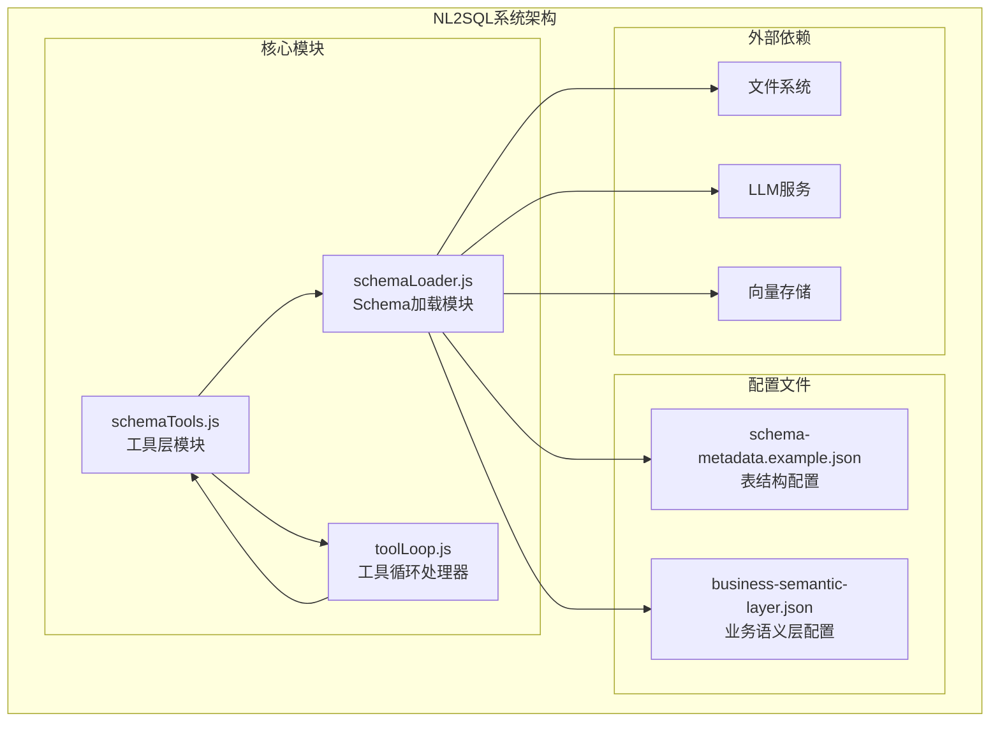
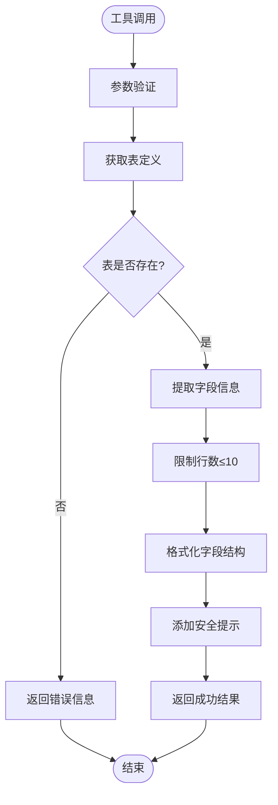
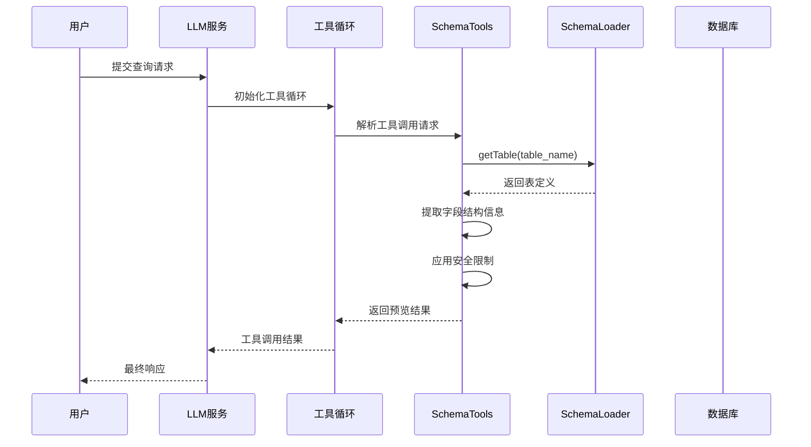
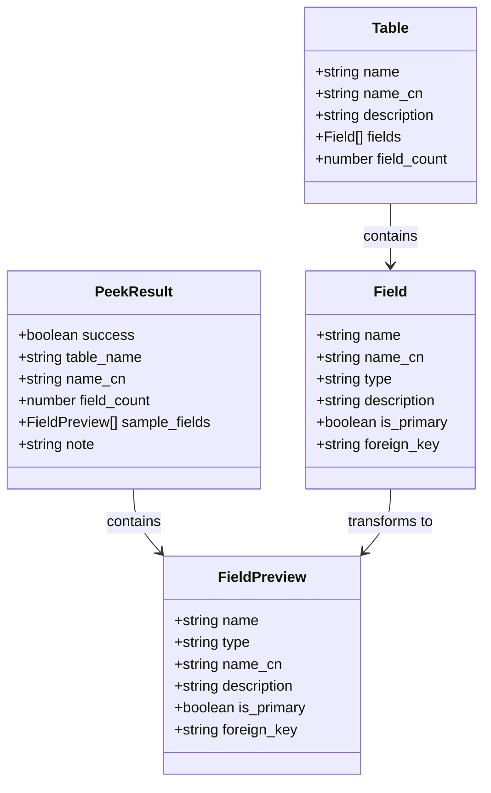
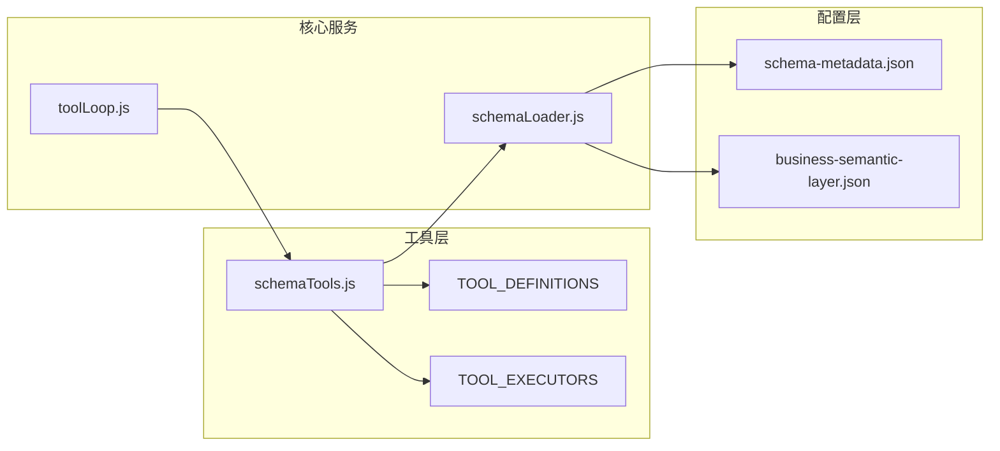

# peek_table表预览工具

<cite>
**本文档引用的文件**
- [schemaTools.js](file://backend/src/core/schemaTools.js)
- [schemaLoader.js](file://backend/src/core/schemaLoader.js)
- [schema-metadata.example.json](file://backend/config/schema-metadata.example.json)
- [business-semantic-layer.json](file://backend/config/business-semantic-layer.json)
- [toolLoop.js](file://backend/src/core/toolLoop.js)
</cite>

## 目录
1. [简介](#简介)
2. [项目结构](#项目结构)
3. [核心组件](#核心组件)
4. [架构概览](#架构概览)
5. [详细组件分析](#详细组件分析)
6. [依赖关系分析](#依赖关系分析)
7. [性能考虑](#性能考虑)
8. [故障排除指南](#故障排除指南)
9. [结论](#结论)

## 简介

peek_table表预览工具是NL2SQL系统中的一个重要组件，专门用于查看数据库表的结构信息而无需执行实际的查询操作。该工具的核心设计理念是"按需索取"而非"一次性灌输"，通过限制返回的数据量和字段信息来确保安全性。

该工具的主要功能包括：
- 查看数据库表的前N行样例数据（仅返回结构信息）
- 限制最大行数（默认3行，最多10行）
- 返回字段结构预览而非实际数据内容
- 提供安全提示信息防止敏感数据泄露

## 项目结构

NL2SQL系统的整体架构采用模块化设计，schemaTools.js作为核心工具层，通过与schemaLoader.js的紧密集成，实现了灵活的Schema探索功能。

**图表来源**
- [schemaTools.js:1-632](file://backend/src/core/schemaTools.js#L1-L632)
- [schemaLoader.js:1-1235](file://backend/src/core/schemaLoader.js#L1-L1235)

**章节来源**
- [schemaTools.js:1-632](file://backend/src/core/schemaTools.js#L1-L632)
- [schemaLoader.js:1-1235](file://backend/src/core/schemaLoader.js#L1-L1235)

## 核心组件

### 工具定义与参数

peek_table工具在TOOL_DEFINITIONS中定义，具有明确的参数规范：

| 参数名 | 类型 | 必填 | 默认值 | 描述 |
|--------|------|------|--------|------|
| table_name | string | 是 | - | 表名（英文） |
| limit | integer | 否 | 3 | 返回行数，默认3，最大10 |

### 返回格式设计

工具返回标准化的JSON格式，包含以下关键字段：

**图表来源**
- [schemaTools.js:348-393](file://backend/src/core/schemaTools.js#L348-L393)

**章节来源**
- [schemaTools.js:105-123](file://backend/src/core/schemaTools.js#L105-L123)
- [schemaTools.js:348-393](file://backend/src/core/schemaTools.js#L348-L393)

## 架构概览

peek_table工具在整个NL2SQL系统中的位置和作用：

**图表来源**
- [toolLoop.js:87-152](file://backend/src/core/toolLoop.js#L87-L152)
- [schemaTools.js:565-577](file://backend/src/core/schemaTools.js#L565-L577)
- [schemaLoader.js:450-452](file://backend/src/core/schemaLoader.js#L450-L452)

## 详细组件分析

### 安全设计理念

peek_table工具采用了多层次的安全保护机制：

#### 1. 数据最小化原则
- 仅返回字段结构信息，不包含任何实际数据内容
- 限制最大返回行数为10行
- 截断字段描述信息，防止敏感信息泄露

#### 2. 访问控制
- 通过schemaLoader的getTable方法进行表存在性验证
- 返回统一的成功/失败状态码
- 错误信息不暴露底层数据库细节

#### 3. 日志监控
- 记录工具调用的详细日志
- 包含参数信息但不包含敏感数据
- 支持审计和问题排查

### 字段结构信息提取逻辑

**图表来源**
- [schemaTools.js:368-375](file://backend/src/core/schemaTools.js#L368-L375)
- [schema-metadata.example.json:4-232](file://backend/config/schema-metadata.example.json#L4-L232)

### 与schemaLoader的集成方式

peek_table工具通过以下方式与schemaLoader集成：

1. **表定义获取**：使用`schemaLoader.getTable(table_name)`获取表的完整定义
2. **字段信息提取**：从表定义中提取字段结构信息
3. **数据验证**：确保表存在且字段定义完整
4. **格式转换**：将内部字段定义转换为对外的预览格式

### 性能优化策略

#### 1. 缓存机制
- Level 1索引缓存（schemaTools.js第29行）
- 缓存时间戳管理（schemaTools.js第30行）
- 配置化的缓存过期时间（schemaTools.js第156行）

#### 2. 数据截断优化
- 字段描述截断至50字符（schemaTools.js第372行）
- 最多返回10个字段（schemaTools.js第368行）
- 限制字段数量避免内存溢出

#### 3. 异步处理
- 所有工具调用均为异步操作
- 支持并发工具调用
- 超时控制机制（toolLoop.js第35行）

**章节来源**
- [schemaTools.js:29-30](file://backend/src/core/schemaTools.js#L29-L30)
- [schemaTools.js:156](file://backend/src/core/schemaTools.js#L156)
- [schemaTools.js:368-375](file://backend/src/core/schemaTools.js#L368-L375)
- [toolLoop.js:35](file://backend/src/core/toolLoop.js#L35)

## 依赖关系分析

### 内部依赖关系

**图表来源**
- [schemaTools.js:17](file://backend/src/core/schemaTools.js#L17)
- [schemaLoader.js:15-26](file://backend/src/core/schemaLoader.js#L15-L26)

### 外部依赖关系

| 依赖模块 | 用途 | 版本要求 |
|----------|------|----------|
| fs | 文件系统操作 | Node.js内置 |
| path | 路径处理 | Node.js内置 |
| config | 配置管理 | 本地配置模块 |
| logger | 日志记录 | 本地日志模块 |
| llmService | LLM服务接口 | 本地服务模块 |
| vectorStore | 向量存储 | 本地存储模块 |

**章节来源**
- [schemaTools.js:17-19](file://backend/src/core/schemaTools.js#L17-L19)
- [schemaLoader.js:15-26](file://backend/src/core/schemaLoader.js#L15-L26)

## 性能考虑

### 时间复杂度分析

- **表查找**：O(1) - 使用Map数据结构进行快速查找
- **字段提取**：O(n) - n为字段数量，最多截断到10个字段
- **字符串处理**：O(m) - m为描述文本长度，最多截断到50字符

### 空间复杂度分析

- **缓存存储**：O(t) - t为表数量
- **结果集**：O(f) - f为返回的字段数量（最多10个）
- **临时变量**：O(1) - 常量级别的额外空间

### 性能优化建议

1. **合理设置limit参数**：根据实际需求调整返回行数
2. **利用缓存机制**：避免重复的Schema加载操作
3. **批量工具调用**：在一次对话中尽可能多地使用工具
4. **监控资源使用**：关注内存和CPU使用情况

## 故障排除指南

### 常见问题及解决方案

#### 1. 表不存在错误
**症状**：返回`表 "<table_name>" 不存在`错误
**原因**：表名拼写错误或表不存在
**解决方法**：
- 使用`search_tables`工具查找正确的表名
- 检查表名大小写和特殊字符
- 验证数据库连接配置

#### 2. 权限不足
**症状**：工具调用失败但无详细错误信息
**原因**：用户权限不足或数据库访问受限
**解决方法**：
- 检查数据库用户权限
- 验证连接字符串配置
- 确认网络访问权限

#### 3. 性能问题
**症状**：工具响应缓慢
**原因**：Schema数据量过大或缓存失效
**解决方法**：
- 检查缓存配置和过期时间
- 优化表结构定义
- 考虑分页查询策略

### 调试技巧

1. **启用详细日志**：检查工具调用日志和错误堆栈
2. **参数验证**：确认传入参数的类型和格式
3. **Schema验证**：使用`describe_table`验证表结构完整性
4. **性能监控**：监控工具调用时间和资源使用情况

**章节来源**
- [schemaTools.js:359-364](file://backend/src/core/schemaTools.js#L359-L364)
- [schemaTools.js:386-392](file://backend/src/core/schemaTools.js#L386-L392)

## 结论

peek_table表预览工具作为NL2SQL系统的重要组成部分，通过精心设计的安全机制和高效的实现方式，为用户提供了一个既实用又安全的表结构探索工具。其核心价值体现在：

### 主要优势

1. **安全性优先**：严格限制数据暴露，确保敏感信息不被泄露
2. **性能优化**：采用多种优化策略，确保快速响应
3. **易用性强**：简洁的API设计和清晰的错误处理
4. **可扩展性好**：模块化设计便于功能扩展和维护

### 设计亮点

- **最小权限原则**：仅返回必要的结构信息
- **智能限制**：自动限制返回数据量和字段数量
- **统一接口**：与其他工具保持一致的调用方式
- **完整监控**：全面的日志记录和错误处理

该工具为NL2SQL系统的Schema探索提供了坚实的基础，是实现"按需索取"架构理念的典型代表。通过持续的优化和改进，它将继续为用户提供更好的数据探索体验。