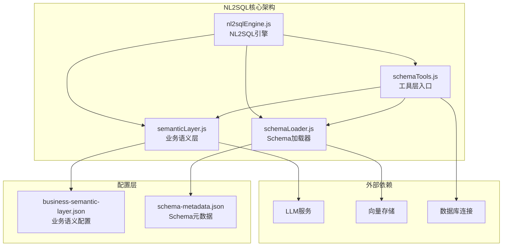
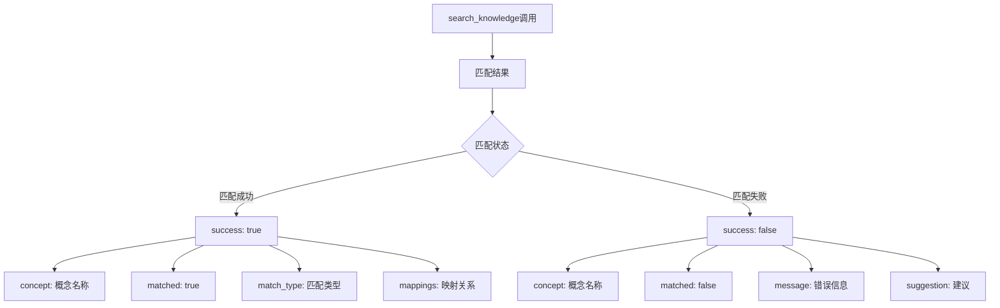
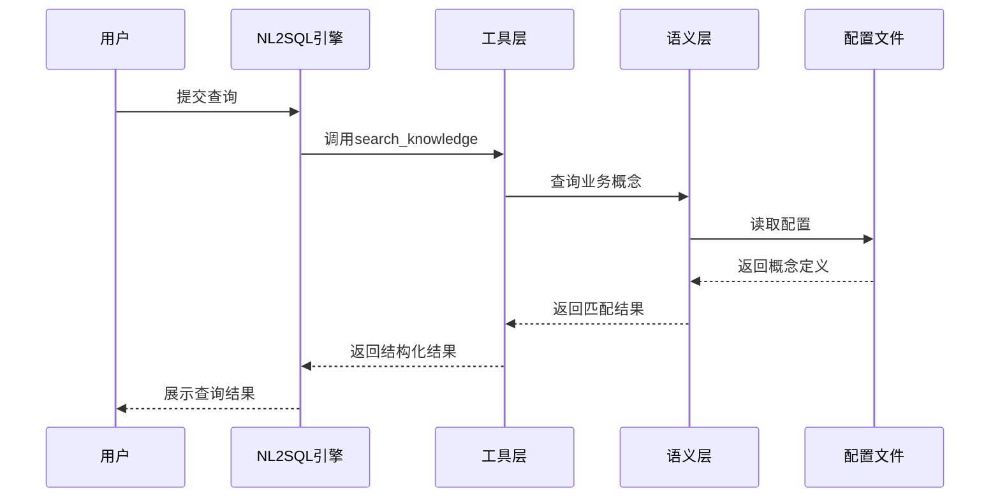
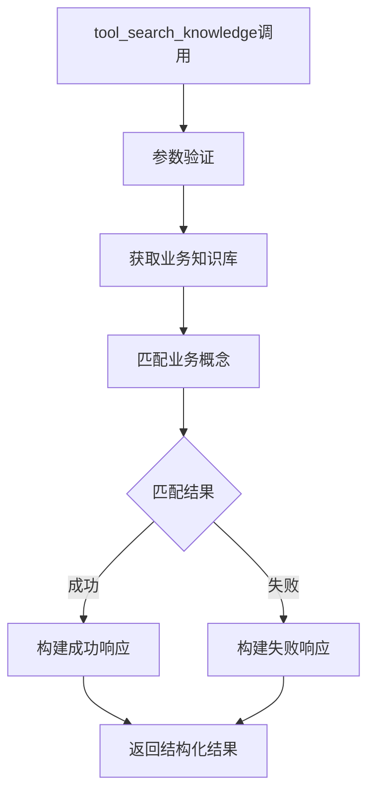
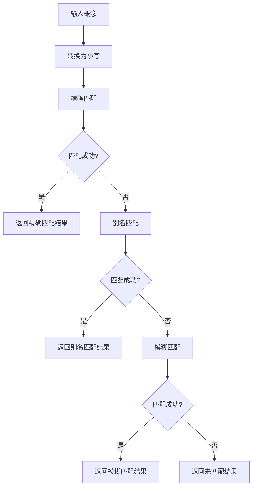
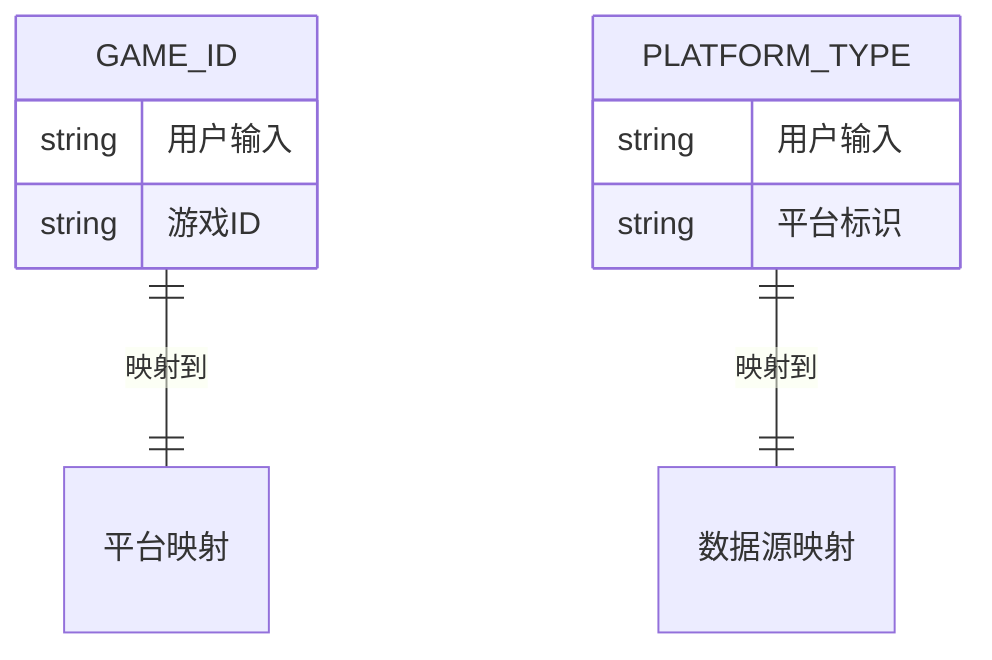
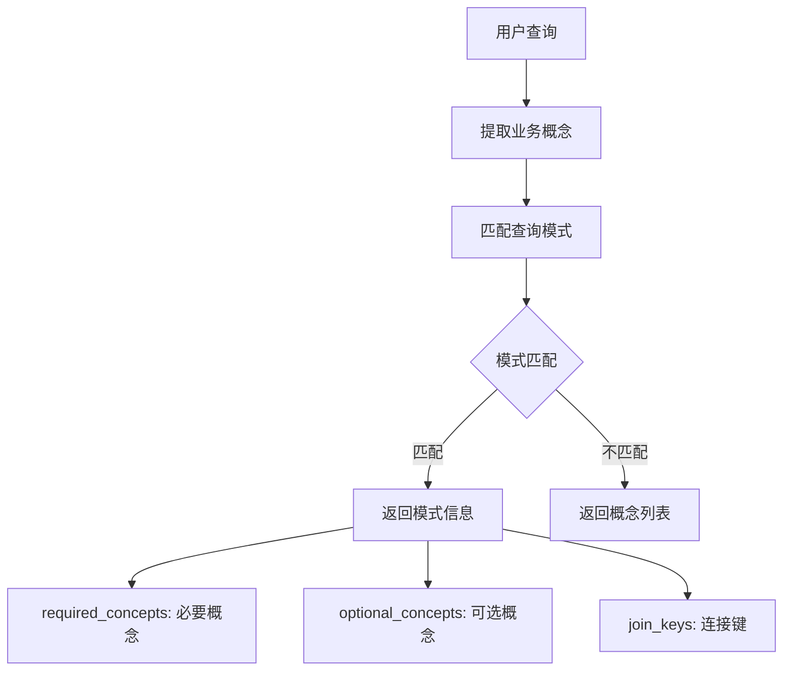
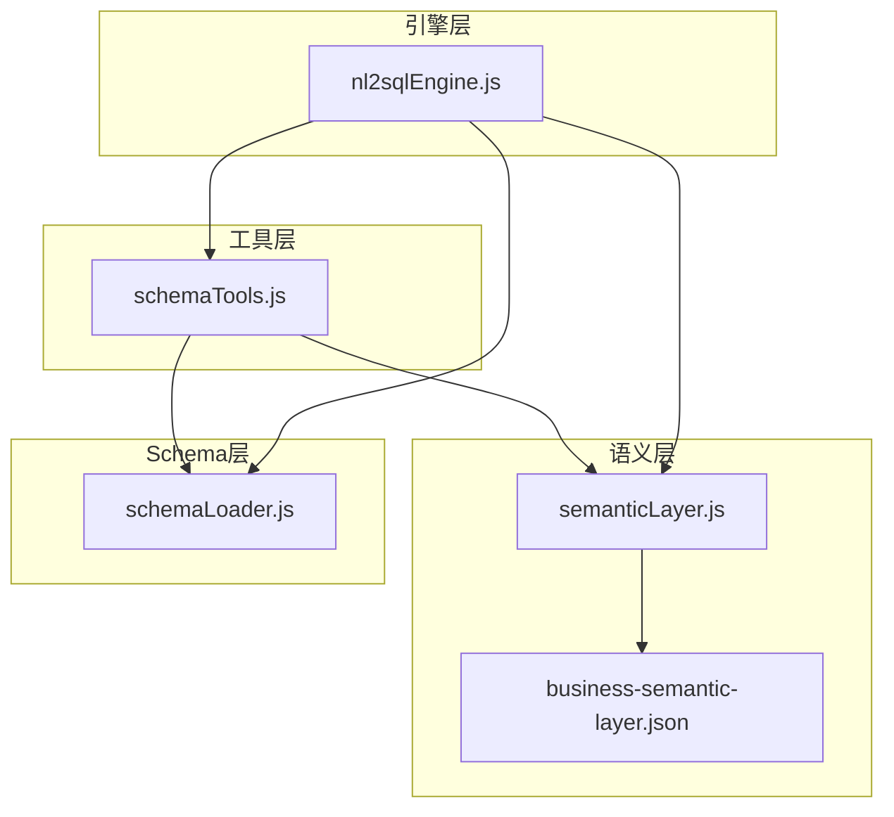

# search_knowledge概念查询工具

<cite>
**本文档引用的文件**
- [schemaTools.js](file://backend/src/core/schemaTools.js)
- [semanticLayer.js](file://backend/src/core/semanticLayer.js)
- [business-semantic-layer.json](file://backend/config/business-semantic-layer.json)
- [nl2sqlEngine.js](file://backend/src/core/nl2sqlEngine.js)
- [schemaLoader.js](file://backend/src/core/schemaLoader.js)
</cite>

## 目录
1. [简介](#简介)
2. [项目结构](#项目结构)
3. [核心组件](#核心组件)
4. [架构概览](#架构概览)
5. [详细组件分析](#详细组件分析)
6. [依赖关系分析](#依赖关系分析)
7. [性能考虑](#性能考虑)
8. [故障排除指南](#故障排除指南)
9. [结论](#结论)

## 简介

search_knowledge概念查询工具是NL2SQL系统中的核心业务知识库查询组件，专门用于查询业务概念的定义和映射关系。该工具能够将自然语言查询中的业务术语转换为系统可理解的结构化映射，为SQL生成提供准确的业务语义支撑。

该工具的核心功能包括：
- **业务概念定义查询**：查询预定义业务概念的详细定义和属性
- **映射关系解析**：获取业务概念到物理表、字段、数据源的映射关系
- **多级匹配策略**：支持精确匹配、别名匹配、模糊匹配三种匹配方式
- **实时概念发现**：基于业务语义层配置动态发现和解析业务概念

## 项目结构

NL2SQL项目采用模块化架构设计，search_knowledge工具位于核心引擎模块中，与业务语义层、Schema加载器等组件协同工作。

**图表来源**
- [schemaTools.js:1-632](file://backend/src/core/schemaTools.js#L1-L632)
- [semanticLayer.js:1-532](file://backend/src/core/semanticLayer.js#L1-L532)
- [business-semantic-layer.json:1-189](file://backend/config/business-semantic-layer.json#L1-L189)

**章节来源**
- [schemaTools.js:1-632](file://backend/src/core/schemaTools.js#L1-L632)
- [semanticLayer.js:1-532](file://backend/src/core/semanticLayer.js#L1-L532)

## 核心组件

### 工具定义与参数

search_knowledge工具采用OpenAI Function Calling格式定义，具有以下参数结构：

| 参数名 | 类型 | 必填 | 描述 | 示例 |
|--------|------|------|------|------|
| concept | string | 是 | 业务概念名称 | "老平台"、"累计充值"、"新用户" |
| tool_name | string | 否 | 工具名称（系统自动生成） | "search_knowledge" |

### 返回格式规范

工具返回统一的结构化结果，包含以下关键字段：

**图表来源**
- [schemaTools.js:315-337](file://backend/src/core/schemaTools.js#L315-L337)

### 匹配策略说明

工具实现了三级匹配策略，按优先级处理业务概念查询：

1. **精确匹配**（1.0分）：概念名称完全一致
2. **别名匹配**（0.9分）：匹配预定义的别名列表
3. **模糊匹配**（0.7分）：基于关键词重叠的模糊匹配

**章节来源**
- [schemaTools.js:489-542](file://backend/src/core/schemaTools.js#L489-L542)

## 架构概览

search_knowledge工具在整个NL2SQL系统中的位置和作用如下：

**图表来源**
- [nl2sqlEngine.js:1599-1633](file://backend/src/core/nl2sqlEngine.js#L1599-L1633)
- [schemaTools.js:315-337](file://backend/src/core/schemaTools.js#L315-L337)

## 详细组件分析

### 工具实现分析

#### 核心执行流程

**图表来源**
- [schemaTools.js:315-337](file://backend/src/core/schemaTools.js#L315-L337)

#### 匹配算法实现

工具采用多级匹配算法，确保不同输入形式都能得到准确的结果：

**图表来源**
- [schemaTools.js:490-542](file://backend/src/core/schemaTools.js#L490-L542)

### 业务知识库实现

#### 预定义概念集合

系统内置了丰富的业务概念定义，涵盖主要的业务场景：

| 概念类别 | 概念名称 | 主要别名 | 关键映射 |
|----------|----------|----------|----------|
| 平台标识 | 老平台 | 旧平台、老版本 | datasource: new_tzpingtaiold |
| 平台标识 | 新平台 | tzpingtai、新系统 | datasource: new_tzpingtai |
| 充值行为 | 累计充值 | 累计付费、总充值 | primary_table: order表 |
| 充值行为 | 充值 | 付费、订单 | key_fields: 订单相关字段 |
| 注册行为 | 注册 | 新增、首入 | primary_table: reg表 |
| 登录行为 | 登录 | 活跃、在线 | platform_table: login表 |
| 聊天行为 | 聊天 | 发言、消息 | primary_table: chat表 |
| 角色行为 | 创角 | 创建角色 | primary_table: role表 |

#### 字段值映射机制

系统支持字段值的智能映射，特别是游戏ID和平台类型的转换：

**图表来源**
- [business-semantic-layer.json:150-187](file://backend/config/business-semantic-layer.json#L150-L187)

**章节来源**
- [business-semantic-layer.json:5-121](file://backend/config/business-semantic-layer.json#L5-L121)
- [business-semantic-layer.json:150-187](file://backend/config/business-semantic-layer.json#L150-L187)

### 查询模式匹配

系统还支持基于查询模式的概念匹配，用于复杂查询场景：

**图表来源**
- [semanticLayer.js:476-509](file://backend/src/core/semanticLayer.js#L476-L509)

**章节来源**
- [semanticLayer.js:476-509](file://backend/src/core/semanticLayer.js#L476-L509)

## 依赖关系分析

### 内部依赖关系

**图表来源**
- [schemaTools.js:17-20](file://backend/src/core/schemaTools.js#L17-L20)
- [semanticLayer.js:14-17](file://backend/src/core/semanticLayer.js#L14-L17)
- [nl2sqlEngine.js:38-45](file://backend/src/core/nl2sqlEngine.js#L38-L45)

### 外部依赖关系

工具依赖以下外部组件：
- **LLM服务**：用于向量化和语义理解
- **向量存储**：存储Schema向量表示
- **数据库连接**：用于实体解析和数据查询
- **配置管理**：业务语义层配置文件

**章节来源**
- [schemaTools.js:17-20](file://backend/src/core/schemaTools.js#L17-L20)
- [semanticLayer.js:14-17](file://backend/src/core/semanticLayer.js#L14-L17)

## 性能考虑

### 缓存策略

系统实现了多层次的缓存机制：
- **Level 1索引缓存**：缓存表名和业务注释，支持热更新
- **配置文件缓存**：业务语义层配置文件缓存
- **向量存储缓存**：Schema向量的持久化存储

### 性能优化措施

1. **延迟加载**：业务知识库按需加载，减少启动时间
2. **智能匹配**：先进行精确匹配，失败后再进行模糊匹配
3. **结果排序**：按匹配分数排序，优先返回最相关的结果
4. **向量检索**：利用向量存储实现高效的语义匹配

## 故障排除指南

### 常见问题及解决方案

#### 1. 概念未匹配问题

**症状**：返回"未找到概念"的错误信息

**可能原因**：
- 概念名称不在预定义列表中
- 输入格式不正确
- 配置文件加载失败

**解决方案**：
- 检查概念名称是否正确
- 确认配置文件格式
- 验证业务语义层配置

#### 2. 匹配分数异常

**症状**：返回的匹配分数不符合预期

**可能原因**：
- 匹配策略配置错误
- 概念定义不完整
- 输入文本包含特殊字符

**解决方案**：
- 检查匹配策略配置
- 完善概念定义
- 清理输入文本

#### 3. 性能问题

**症状**：查询响应时间过长

**可能原因**：
- 缓存未生效
- 向量存储未初始化
- 配置文件过大

**解决方案**：
- 检查缓存配置
- 初始化向量存储
- 优化配置文件结构

**章节来源**
- [schemaTools.js:534-542](file://backend/src/core/schemaTools.js#L534-L542)

## 结论

search_knowledge概念查询工具作为NL2SQL系统的核心组件，通过精心设计的多级匹配策略和丰富的业务知识库，为自然语言到SQL的转换提供了强大的语义支撑。该工具不仅支持基本的概念查询功能，还能处理复杂的业务场景，为用户提供准确、可靠的业务语义解析服务。

工具的主要优势包括：
- **全面的概念覆盖**：涵盖平台标识、充值行为、注册行为等核心业务场景
- **灵活的匹配策略**：支持精确、别名、模糊三种匹配方式
- **高性能的实现**：通过缓存和向量检索优化查询性能
- **易于扩展**：支持动态配置和热更新机制

未来的发展方向包括：
- 扩展更多的业务概念定义
- 优化匹配算法的准确性
- 增强多语言支持能力
- 提升系统的可维护性和可扩展性