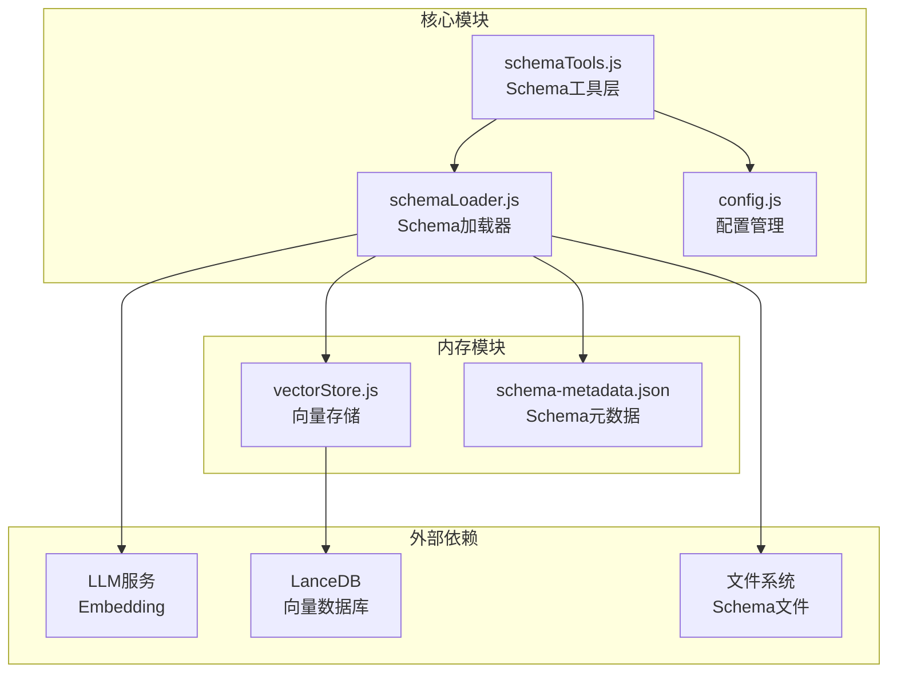
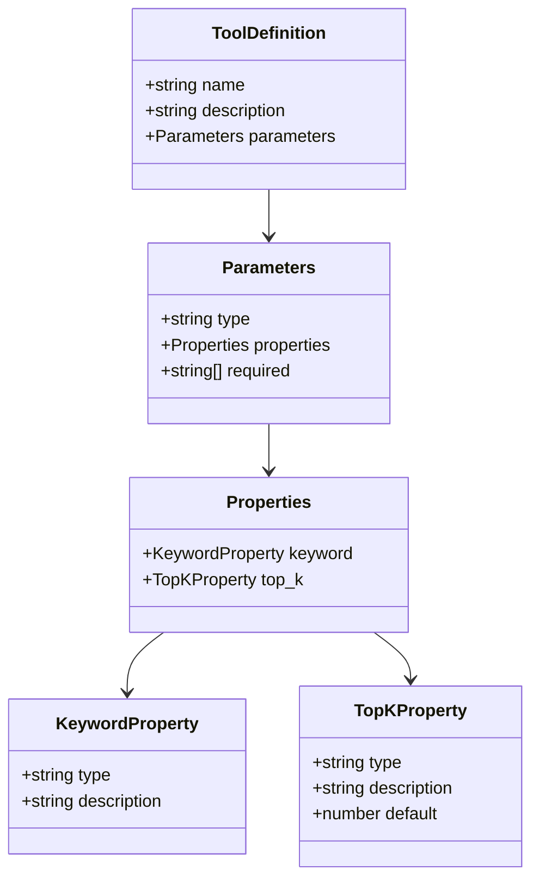
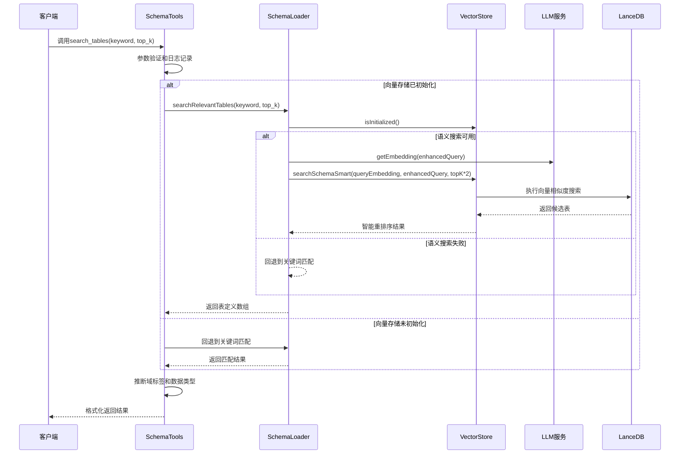
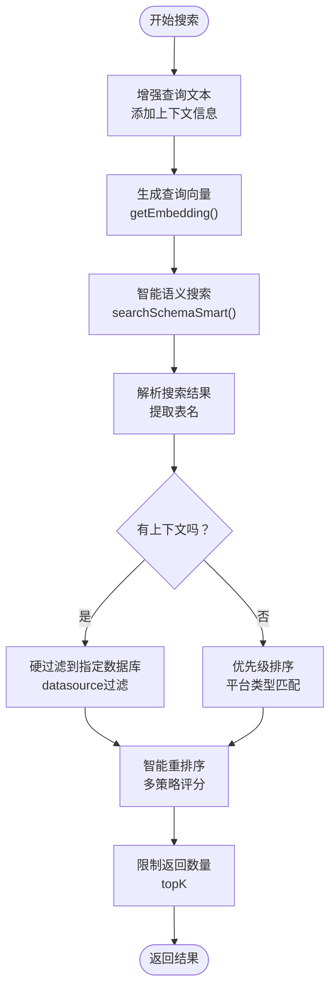
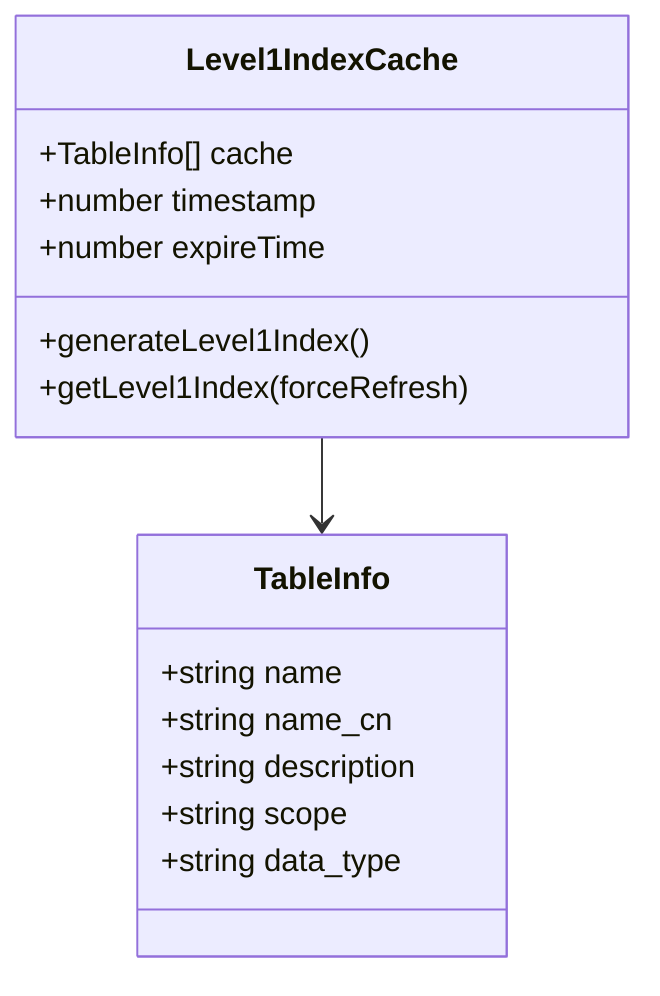
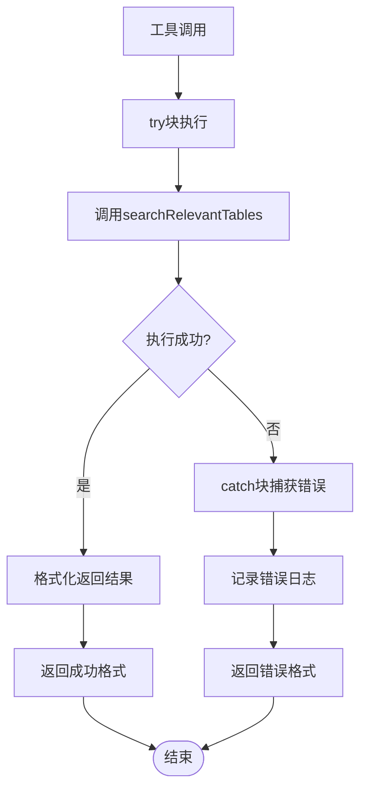
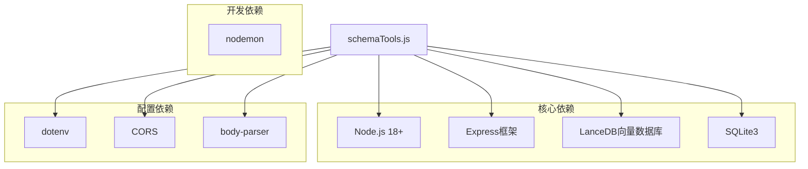
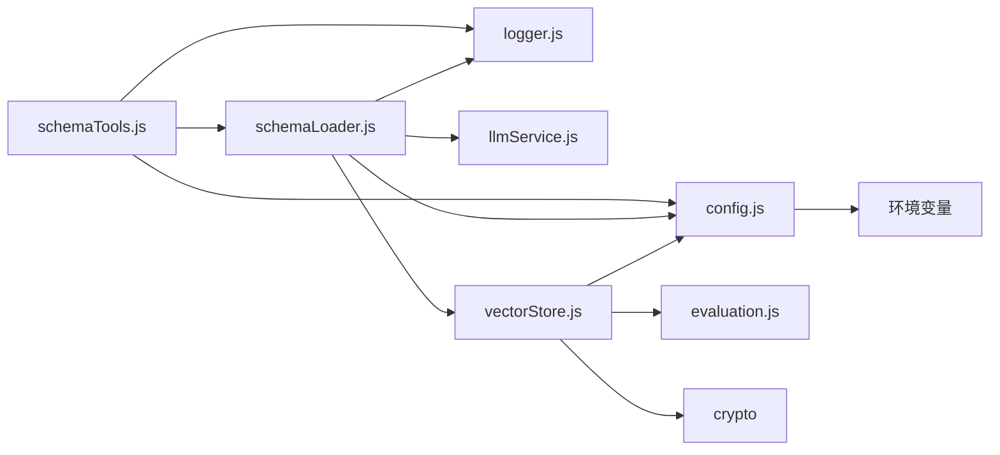
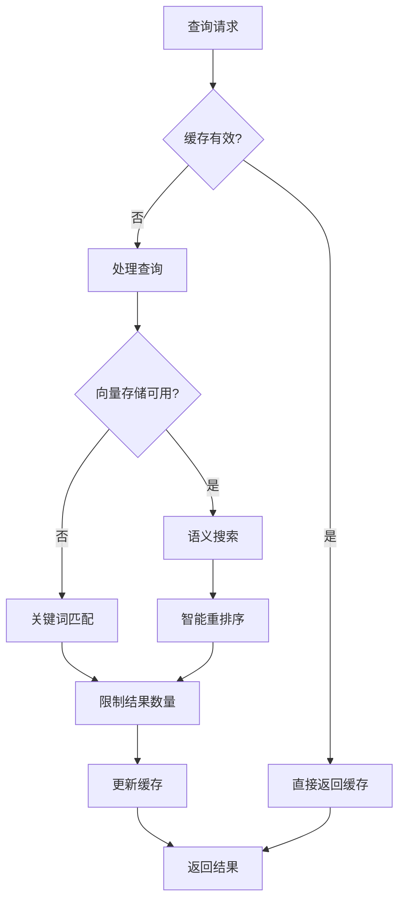

# search_tables表搜索工具

<cite>
**本文档引用的文件**
- [schemaTools.js](file://backend/src/core/schemaTools.js)
- [schemaLoader.js](file://backend/src/core/schemaLoader.js)
- [vectorStore.js](file://backend/src/memory/vectorStore.js)
- [config.js](file://backend/src/core/config.js)
- [schema-metadata.json](file://backend/config/schema-metadata.json)
- [package.json](file://backend/package.json)
</cite>

## 目录
1. [简介](#简介)
2. [项目结构](#项目结构)
3. [核心组件](#核心组件)
4. [架构概览](#架构概览)
5. [详细组件分析](#详细组件分析)
6. [依赖分析](#依赖分析)
7. [性能考虑](#性能考虑)
8. [故障排除指南](#故障排除指南)
9. [结论](#结论)
10. [附录](#附录)

## 简介

search_tables表搜索工具是NL2SQL项目中的核心Schema发现工具，专门用于根据关键词搜索相关的数据库表。该工具实现了"按需索取"的Schema探索机制，通过语义搜索结合业务规则推理，为自然语言到SQL的转换提供精准的表级信息。

该工具的主要特点包括：
- **语义搜索能力**：基于向量数据库实现表级语义匹配
- **业务规则推理**：自动推断表的域标签和数据类型
- **缓存优化**：实现Level 1索引缓存机制
- **错误处理**：完善的异常捕获和回退机制
- **LLM集成**：与OpenAI Function Calling格式无缝对接

## 项目结构

NL2SQL项目的后端采用模块化设计，search_tables工具位于核心Schema工具层中：



**图表来源**
- [schemaTools.js:1-632](file://backend/src/core/schemaTools.js#L1-L632)
- [schemaLoader.js:1-800](file://backend/src/core/schemaLoader.js#L1-L800)
- [vectorStore.js:1-200](file://backend/src/memory/vectorStore.js#L1-L200)

**章节来源**
- [schemaTools.js:1-632](file://backend/src/core/schemaTools.js#L1-L632)
- [schemaLoader.js:1-800](file://backend/src/core/schemaLoader.js#L1-L800)
- [config.js:1-398](file://backend/src/core/config.js#L1-L398)

## 核心组件

### 工具定义与参数

search_tables工具遵循OpenAI Function Calling规范，定义了完整的工具接口：



**图表来源**
- [schemaTools.js:40-62](file://backend/src/core/schemaTools.js#L40-L62)

工具参数定义：
- **keyword** (必需): 搜索关键词，支持中文业务术语和表名片段
- **top_k** (可选，默认5): 返回结果数量，控制搜索范围

### 返回格式规范

工具返回标准化的结果格式：

| 字段名 | 类型 | 描述 | 示例 |
|--------|------|------|------|
| success | boolean | 操作是否成功 | true/false |
| count | number | 返回表的数量 | 3 |
| tables | array | 表信息数组 | [] |
| error | string | 错误信息（失败时） | "查询失败" |

每个表条目包含：
- **name**: 英文表名
- **name_cn**: 中文表名（可选）
- **description**: 表描述（截取前100字符）
- **scope**: 域标签（platform/game/report/unknown）
- **data_type**: 数据类型（raw_log/dimension_table/aggregated_report）

**章节来源**
- [schemaTools.js:225-256](file://backend/src/core/schemaTools.js#L225-L256)

## 架构概览

search_tables工具的完整工作流程如下：



**图表来源**
- [schemaTools.js:225-256](file://backend/src/core/schemaTools.js#L225-L256)
- [schemaLoader.js:571-653](file://backend/src/core/schemaLoader.js#L571-L653)
- [vectorStore.js:577-576](file://backend/src/memory/vectorStore.js#L577-L576)

## 详细组件分析

### 语义搜索实现机制

#### 向量数据库集成

search_tables工具的核心在于其语义搜索能力，通过以下步骤实现：

1. **查询增强**：根据上下文信息（game_id、datasource）增强查询文本
2. **向量生成**：使用LLM服务生成查询文本的Embedding向量
3. **智能搜索**：通过VectorStore的searchSchemaSmart方法执行语义搜索
4. **结果重排序**：基于多策略优先级评分系统重新排序



**图表来源**
- [schemaLoader.js:571-653](file://backend/src/core/schemaLoader.js#L571-L653)
- [vectorStore.js:486-576](file://backend/src/memory/vectorStore.js#L486-L576)

#### 智能重排序策略

VectorStore实现了复杂的重排序算法，综合考虑多个因素：

| 优先级策略 | 权重 | 说明 | 实现位置 |
|------------|------|------|----------|
| 明确提及的游戏表 | +30 | 直接匹配到具体游戏的表 | 508-516 |
| 平台类型匹配 | +25 | 与推断平台类型一致的表 | 621-641 |
| 核心平台表优先 | +20 | 不含'.'的表（跨库通用） | 613-619 |
| 报表表降级 | -20 | report/dwd表优先级降低 | 537 |
| 向量距离 | 0-20 | 基于相似度的距离评分 | 540-542 |

**章节来源**
- [schemaLoader.js:571-653](file://backend/src/core/schemaLoader.js#L571-L653)
- [vectorStore.js:486-576](file://backend/src/memory/vectorStore.js#L486-L576)

### 推断表域标签和数据类型

#### 域标签推断（Scope Inferencing）

工具通过表名模式匹配推断表的业务域：

```mermaid
flowchart TD
TableName[表名] --> CheckPlatform{"包含'tzpingtai'或'pf_'?"}
CheckPlatform --> |是| Platform[域: platform]
CheckPlatform --> |否| CheckNewTZ{"以'new_tz'开头?"}
CheckNewTZ --> |是| ExtractGame["提取游戏名<br/>new_tz{game} -> game_{game}"]
CheckNewTZ --> |否| CheckReport{"包含'report'或'dwd_'?"}
ExtractGame --> Game[域: game_{game}]
CheckReport --> |是| Report[域: report]
CheckReport --> |否| Unknown[域: unknown]
```

**图表来源**
- [schemaTools.js:181-195](file://backend/src/core/schemaTools.js#L181-L195)
- [schemaLoader.js:305-317](file://backend/src/core/schemaLoader.js#L305-L317)

#### 数据类型推断（Data Type Inferencing）

基于表名特征推断数据源类型：

| 数据类型 | 特征匹配 | 示例表名 |
|----------|----------|----------|
| aggregated_report | 包含'report'、'dwd_'、'analysis' | tzpingtai_tz_sdk_log_pf_order |
| dimension_table | 包含'dim_'、'dict' | dim_user_info |
| raw_log | 默认类型 | tzpingtai_tz_sdk_log_pf_reg |

**章节来源**
- [schemaTools.js:203-211](file://backend/src/core/schemaTools.js#L203-L211)
- [schemaLoader.js:319-325](file://backend/src/core/schemaLoader.js#L319-L325)

### 缓存机制

#### Level 1索引缓存

为了提高性能，工具实现了两级缓存机制：



**图表来源**
- [schemaTools.js:25-30](file://backend/src/core/schemaTools.js#L25-L30)
- [schemaTools.js:136-173](file://backend/src/core/schemaTools.js#L136-L173)

缓存特性：
- **默认过期时间**：1小时（可配置）
- **智能刷新**：支持强制刷新和自动过期检测
- **轻量级**：仅包含表名、中文描述、域标签、数据类型

**章节来源**
- [schemaTools.js:136-173](file://backend/src/core/schemaTools.js#L136-L173)
- [config.js:240-250](file://backend/src/core/config.js#L240-L250)

### 错误处理策略

#### 多层次错误处理



**图表来源**
- [schemaTools.js:225-256](file://backend/src/core/schemaTools.js#L225-L256)

错误处理策略：
- **语义搜索失败**：自动回退到关键词匹配
- **向量存储异常**：记录错误但不影响整体功能
- **参数验证失败**：返回结构化错误信息
- **缓存过期**：自动刷新缓存

**章节来源**
- [schemaTools.js:225-256](file://backend/src/core/schemaTools.js#L225-L256)
- [schemaLoader.js:645-649](file://backend/src/core/schemaLoader.js#L645-L649)

## 依赖分析

### 外部依赖关系



**图表来源**
- [package.json:10-27](file://backend/package.json#L10-L27)

### 内部模块依赖



**图表来源**
- [schemaTools.js:17-19](file://backend/src/core/schemaTools.js#L17-L19)
- [schemaLoader.js:15-26](file://backend/src/core/schemaLoader.js#L15-L26)

**章节来源**
- [package.json:10-27](file://backend/package.json#L10-L27)
- [schemaTools.js:17-19](file://backend/src/core/schemaTools.js#L17-L19)

## 性能考虑

### 缓存优化策略

1. **Level 1索引缓存**
   - 缓存表名、中文描述、域标签、数据类型
   - 默认1小时过期时间
   - 支持强制刷新机制

2. **向量存储优化**
   - 增量更新机制，避免重复向量化
   - 内容哈希校验，跳过未变更的表
   - 智能搜索重排序，减少无效计算

### 查询性能优化



**图表来源**
- [schemaTools.js:154-173](file://backend/src/core/schemaTools.js#L154-L173)
- [schemaLoader.js:595-653](file://backend/src/core/schemaLoader.js#L595-L653)

### 最佳实践建议

1. **合理设置top_k参数**
   - 默认5个结果通常足够
   - 复杂查询可适当增加到10-15

2. **利用缓存机制**
   - 避免频繁重复查询相同关键词
   - 在批量操作中复用同一实例

3. **优化查询文本**
   - 包含具体的业务术语
   - 结合上下文信息（game_id、datasource）

## 故障排除指南

### 常见问题及解决方案

#### 1. 向量存储初始化失败

**症状**：工具返回关键词匹配结果而非语义搜索

**原因分析**：
- LanceDB路径配置错误
- 向量数据库文件损坏
- LLM服务不可用

**解决步骤**：
1. 检查VECTOR_DB_PATH配置
2. 验证向量数据库文件完整性
3. 确认LLM服务可用性

#### 2. 搜索结果不准确

**症状**：返回的表与预期不符

**排查方法**：
1. 检查关键词是否包含足够的业务信息
2. 验证上下文参数（game_id、datasource）
3. 确认Schema元数据配置正确

#### 3. 性能问题

**症状**：查询响应时间过长

**优化建议**：
1. 检查缓存配置和过期时间
2. 优化关键词选择
3. 调整top_k参数

**章节来源**
- [schemaLoader.js:595-653](file://backend/src/core/schemaLoader.js#L595-L653)
- [config.js:106-109](file://backend/src/core/config.js#L106-L109)

## 结论

search_tables表搜索工具作为NL2SQL项目的核心组件，通过语义搜索、业务规则推理和智能缓存机制，为自然语言到SQL的转换提供了强大的Schema发现能力。其设计充分考虑了性能优化、错误处理和可扩展性，能够适应复杂的业务场景需求。

工具的主要优势包括：
- **智能化搜索**：结合语义向量和关键词匹配
- **业务理解**：自动推断表的域标签和数据类型
- **高性能**：多级缓存和智能重排序
- **稳定性**：完善的错误处理和回退机制

随着业务的发展，该工具还可以进一步扩展：
- 支持更多业务概念的自动识别
- 增强多语言支持
- 优化向量模型和搜索算法

## 附录

### 使用场景示例

1. **业务术语定位表**
   - 输入："累计充值"
   - 输出：tzpingtai_tz_sdk_log_pf_order表及相关指标

2. **表名模糊搜索**
   - 输入："pf_order"
   - 输出：匹配包含"pf_order"的表

3. **跨平台查询**
   - 输入："登录行为"
   - 输出：平台登录表和游戏登录表

### 配置参考

关键配置项：
- `SCHEMA_CONFIG_PATH`: Schema元数据文件路径
- `VECTOR_DB_PATH`: 向量数据库存储路径
- `SCHEMA_CACHE_EXPIRE_TIME`: 缓存过期时间（毫秒）
- `SCHEMA_REVECTORIZE`: 是否强制重新向量化