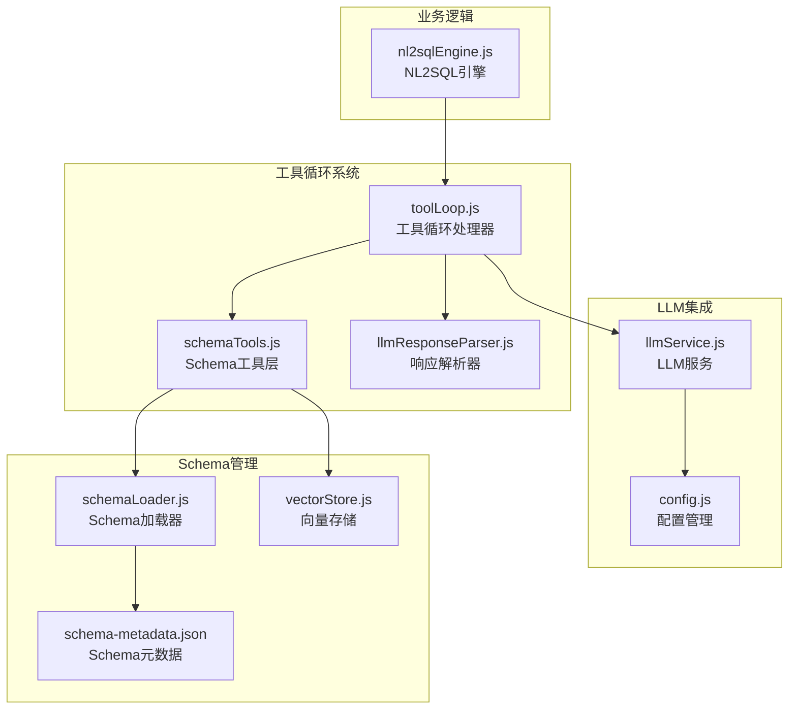
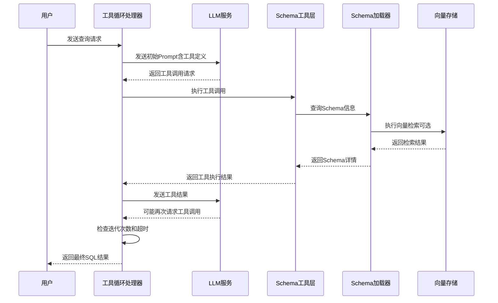
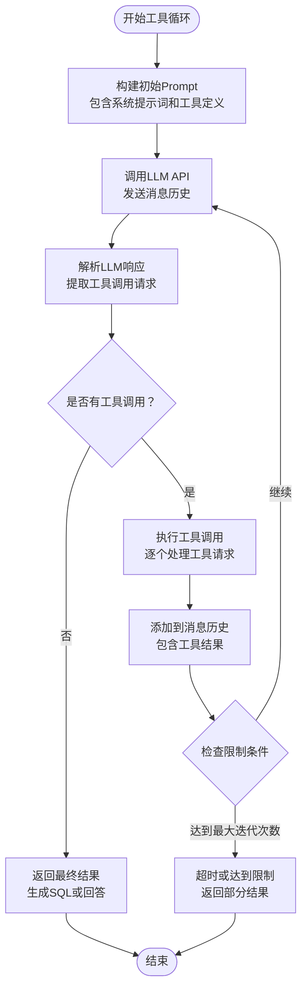
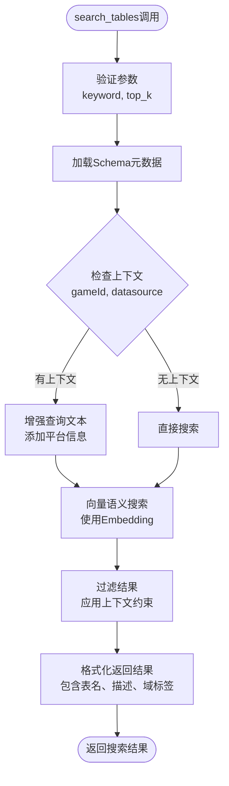
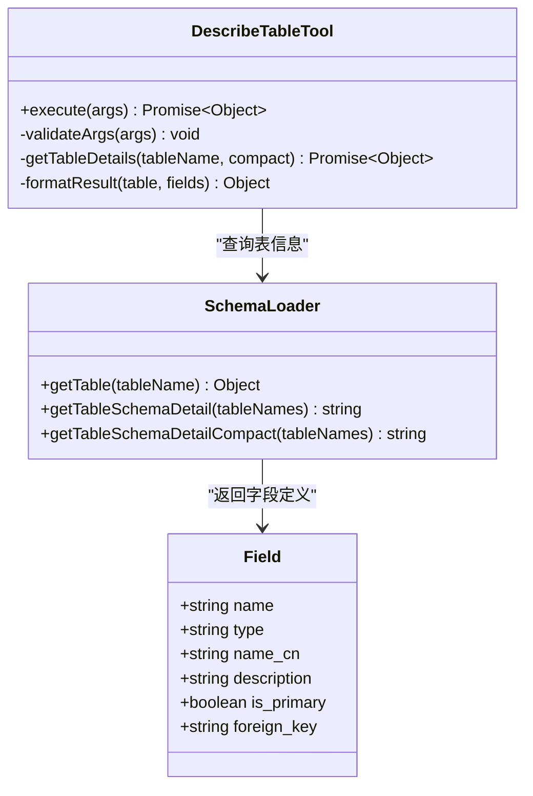
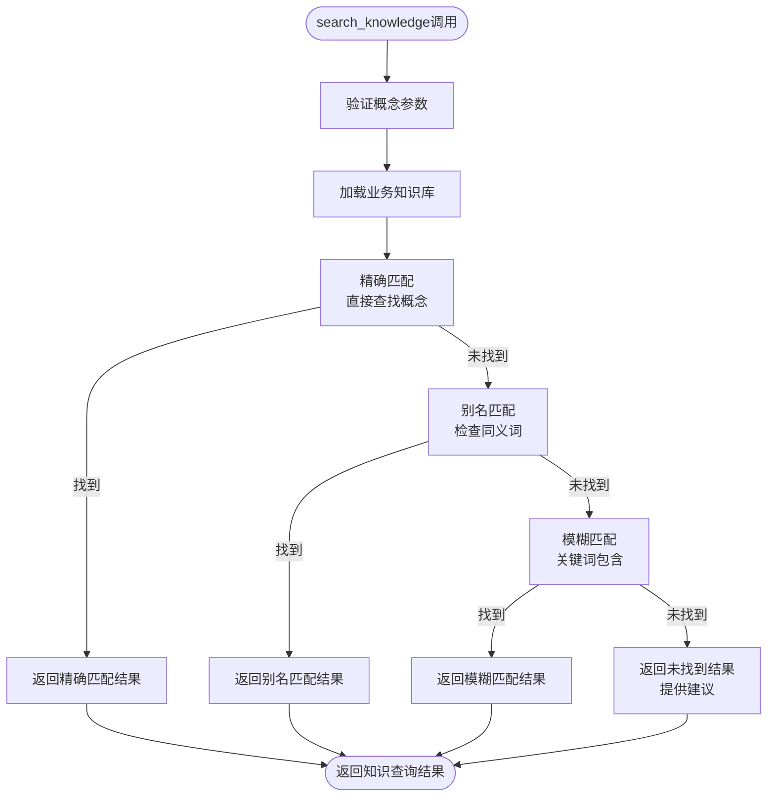
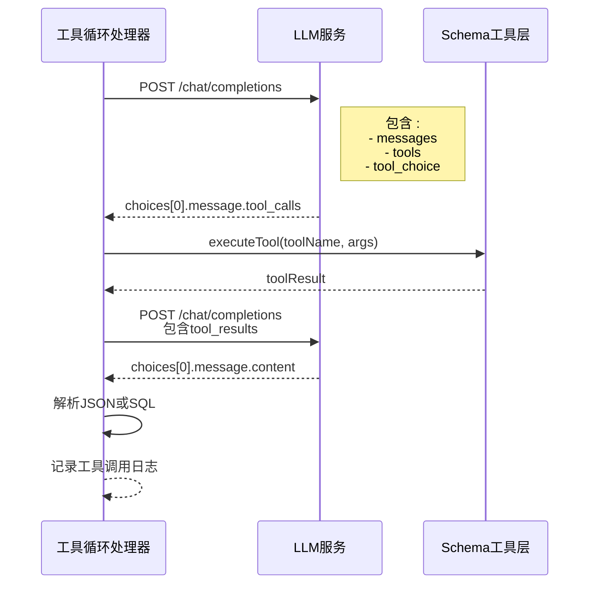
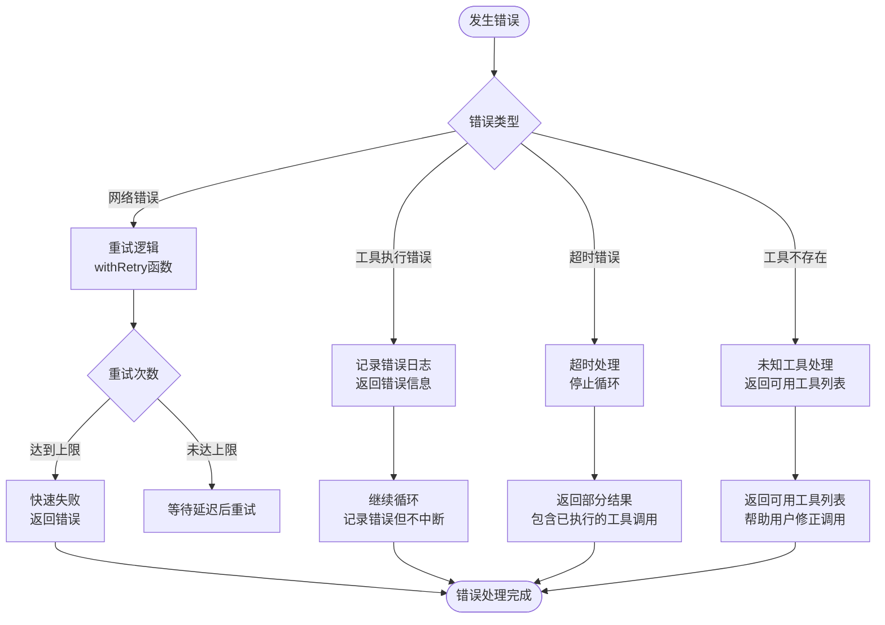
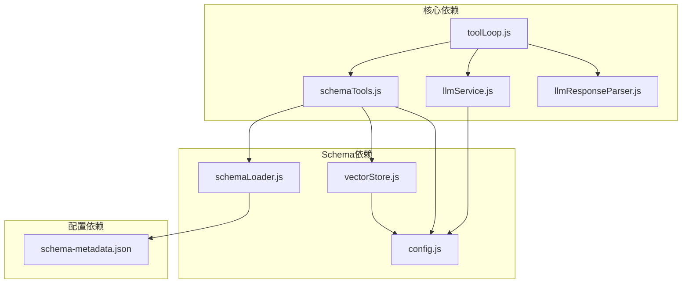

# 工具循环系统

<cite>
**本文档引用的文件**
- [toolLoop.js](file://backend/src/core/toolLoop.js)
- [schemaTools.js](file://backend/src/core/schemaTools.js)
- [schemaLoader.js](file://backend/src/core/schemaLoader.js)
- [llmService.js](file://backend/src/core/llmService.js)
- [nl2sqlEngine.js](file://backend/src/core/nl2sqlEngine.js)
- [llmResponseParser.js](file://backend/src/utils/llmResponseParser.js)
- [vectorStore.js](file://backend/src/memory/vectorStore.js)
- [config.js](file://backend/src/core/config.js)
- [schema-metadata.json](file://backend/config/schema-metadata.json)
</cite>

## 目录
1. [简介](#简介)
2. [项目结构](#项目结构)
3. [核心组件](#核心组件)
4. [架构概览](#架构概览)
5. [详细组件分析](#详细组件分析)
6. [依赖关系分析](#依赖关系分析)
7. [性能考虑](#性能考虑)
8. [故障排除指南](#故障排除指南)
9. [结论](#结论)

## 简介

工具循环系统是NL2SQL项目中的核心智能决策引擎，它实现了基于LLM的工具调用循环机制，能够自动探索数据库Schema并生成准确的SQL查询。该系统采用"按需索取"的Schema探索策略，通过四个核心工具（search_tables、describe_table、search_knowledge、peek_table）实现智能化的Schema发现和数据检索。

系统的主要特点包括：
- **智能工具循环**：通过LLM与工具的交互实现自动化Schema探索
- **分层Schema加载**：Level 1索引提供初步筛选，按需加载详细Schema
- **业务概念理解**：内置业务知识库，支持平台术语映射
- **安全的Schema探索**：工具调用严格控制，避免敏感数据泄露
- **错误恢复机制**：完善的超时控制和错误处理

## 项目结构

NL2SQL项目的后端架构采用模块化设计，工具循环系统位于核心模块中，与LLM服务、Schema加载器、向量存储等组件紧密协作。



**图表来源**
- [toolLoop.js:1-521](file://backend/src/core/toolLoop.js#L1-L521)
- [schemaTools.js:1-632](file://backend/src/core/schemaTools.js#L1-L632)
- [schemaLoader.js:1-1235](file://backend/src/core/schemaLoader.js#L1-L1235)

**章节来源**
- [toolLoop.js:1-521](file://backend/src/core/toolLoop.js#L1-L521)
- [schemaTools.js:1-632](file://backend/src/core/schemaTools.js#L1-L632)
- [schemaLoader.js:1-1235](file://backend/src/core/schemaLoader.js#L1-L1235)

## 核心组件

### 工具循环处理器（ToolLoop）

工具循环处理器是整个系统的中枢，负责协调LLM与Schema工具的交互。它实现了标准的工具调用循环模式：LLM提出工具调用请求，系统执行相应工具，将结果返回给LLM，直到LLM完成Schema探索并生成SQL。

关键特性：
- **最大迭代限制**：防止无限循环，确保系统稳定性
- **超时控制**：60秒超时保护，避免长时间阻塞
- **消息历史管理**：维护完整的对话历史，支持上下文理解
- **工具调用日志**：详细记录每次工具调用的参数和结果

### Schema工具层（SchemaTools）

Schema工具层提供了四个核心工具，每个工具都有明确的职责和安全边界：

1. **search_tables**：根据关键词搜索相关表，支持语义匹配和关键词匹配
2. **describe_table**：获取指定表的详细字段信息，支持精简和完整两种模式
3. **search_knowledge**：查询业务概念的定义和映射关系
4. **peek_table**：查看表的结构预览（安全考虑：不返回实际数据）

### LLM服务集成

LLM服务模块负责与外部LLM API通信，支持多种OpenAI兼容的模型。它提供了：
- **HTTP请求封装**：统一的HTTP POST请求处理
- **重试机制**：自动重试失败的请求
- **流式响应支持**：可选的流式响应处理
- **超时控制**：灵活的超时配置

**章节来源**
- [toolLoop.js:41-185](file://backend/src/core/toolLoop.js#L41-L185)
- [schemaTools.js:36-124](file://backend/src/core/schemaTools.js#L36-L124)
- [llmService.js:222-308](file://backend/src/core/llmService.js#L222-L308)

## 架构概览

工具循环系统采用分层架构设计，每层都有明确的职责和边界：



**图表来源**
- [toolLoop.js:87-152](file://backend/src/core/toolLoop.js#L87-L152)
- [schemaTools.js:565-577](file://backend/src/core/schemaTools.js#L565-L577)
- [schemaLoader.js:571-653](file://backend/src/core/schemaLoader.js#L571-L653)

## 详细组件分析

### 工具循环执行流程

工具循环的执行流程遵循严格的步骤序列，确保Schema探索的准确性和完整性：



**图表来源**
- [toolLoop.js:57-185](file://backend/src/core/toolLoop.js#L57-L185)

### Schema工具集详解

#### search_tables 工具
search_tables工具实现了智能的表搜索功能，结合语义检索和关键词匹配：



**图表来源**
- [schemaTools.js:225-256](file://backend/src/core/schemaTools.js#L225-L256)
- [schemaLoader.js:571-653](file://backend/src/core/schemaLoader.js#L571-L653)

#### describe_table 工具
describe_table工具提供表的详细Schema信息，支持精简和完整两种输出模式：



**图表来源**
- [schemaTools.js:266-306](file://backend/src/core/schemaTools.js#L266-L306)
- [schemaLoader.js:790-903](file://backend/src/core/schemaLoader.js#L790-L903)

#### search_knowledge 工具
search_knowledge工具实现了业务概念的理解和映射：



**图表来源**
- [schemaTools.js:315-337](file://backend/src/core/schemaTools.js#L315-L337)
- [schemaTools.js:490-542](file://backend/src/core/schemaTools.js#L490-L542)

### LLM集成机制

工具循环系统与LLM服务的集成采用了OpenAI Function Calling的标准格式：



**图表来源**
- [toolLoop.js:87-152](file://backend/src/core/toolLoop.js#L87-L152)
- [llmService.js:222-308](file://backend/src/core/llmService.js#L222-L308)

### 错误处理与恢复机制

系统实现了多层次的错误处理和恢复机制：



**图表来源**
- [toolLoop.js:176-184](file://backend/src/core/toolLoop.js#L176-L184)
- [llmService.js:167-195](file://backend/src/core/llmService.js#L167-L195)

**章节来源**
- [toolLoop.js:176-184](file://backend/src/core/toolLoop.js#L176-L184)
- [schemaTools.js:565-577](file://backend/src/core/schemaTools.js#L565-L577)
- [llmService.js:167-195](file://backend/src/core/llmService.js#L167-L195)

## 依赖关系分析

工具循环系统的核心依赖关系如下：



**图表来源**
- [toolLoop.js:16-21](file://backend/src/core/toolLoop.js#L16-L21)
- [schemaTools.js:17-20](file://backend/src/core/schemaTools.js#L17-L20)
- [schemaLoader.js:15-27](file://backend/src/core/schemaLoader.js#L15-L27)

### 外部依赖

系统依赖的关键外部组件：
- **LLM API**：支持OpenAI兼容的模型，如GPT-4、DeepSeek等
- **LanceDB**：向量数据库，用于Schema向量存储和语义检索
- **SQLite**：本地数据库，存储会话历史和配置
- **Express**：Web框架，提供REST API接口

**章节来源**
- [toolLoop.js:16-21](file://backend/src/core/toolLoop.js#L16-L21)
- [schemaTools.js:17-20](file://backend/src/core/schemaTools.js#L17-L20)
- [schemaLoader.js:15-27](file://backend/src/core/schemaLoader.js#L15-L27)

## 性能考虑

工具循环系统在设计时充分考虑了性能优化：

### 缓存策略
- **Level 1索引缓存**：Schema元数据的极简版索引，支持1小时缓存
- **向量存储缓存**：LanceDB向量数据库，支持增量更新
- **工具调用缓存**：记录工具调用历史，避免重复查询

### 优化技术
- **按需加载**：只有在LLM请求时才加载详细Schema信息
- **向量检索**：使用Embedding实现语义相似度搜索
- **智能过滤**：根据查询上下文过滤搜索结果
- **Token预算**：控制消息长度，避免超出模型限制

### 性能监控
系统提供了详细的性能指标：
- **执行时间统计**：记录每次工具调用的耗时
- **迭代次数统计**：监控工具循环的效率
- **错误率统计**：跟踪系统稳定性
- **资源使用统计**：监控内存和CPU使用情况

## 故障排除指南

### 常见问题及解决方案

#### LLM API连接问题
**症状**：工具循环无法连接到LLM服务
**原因**：
- API密钥配置错误
- 网络连接问题
- API端点配置错误

**解决方案**：
1. 检查环境变量配置
2. 验证API密钥有效性
3. 确认网络连接状态
4. 测试API端点可达性

#### Schema加载失败
**症状**：Schema元数据无法加载
**原因**：
- 配置文件路径错误
- JSON格式不正确
- 文件权限问题

**解决方案**：
1. 检查schema-metadata.json路径
2. 验证JSON格式合法性
3. 确认文件读取权限
4. 查看详细错误日志

#### 工具调用超时
**症状**：工具执行超时
**原因**：
- 数据库查询过慢
- 网络延迟过高
- 工具实现效率低

**解决方案**：
1. 优化数据库查询
2. 检查网络连接质量
3. 实施工具执行优化
4. 调整超时配置

### 调试技巧

#### 启用详细日志
```javascript
// 在config.js中设置日志级别
log: {
  level: 'debug', // 从'info'改为'debug'
  console: true,
  fileOutput: true
}
```

#### 工具调用追踪
系统会记录详细的工具调用历史：
- 工具名称和参数
- 执行时间和结果
- 错误信息和堆栈跟踪

#### 性能分析
使用性能监控工具分析：
- 工具执行时间分布
- LLM调用频率和响应时间
- 内存使用峰值
- 数据库查询性能

**章节来源**
- [toolLoop.js:176-184](file://backend/src/core/toolLoop.js#L176-L184)
- [config.js:366-388](file://backend/src/core/config.js#L366-L388)

## 结论

工具循环系统通过智能化的Schema探索机制，实现了从自然语言到SQL的高效转换。系统的核心优势包括：

1. **智能决策能力**：通过LLM与工具的交互，实现自动化的Schema发现
2. **安全性保障**：严格的工具调用控制，避免敏感数据泄露
3. **扩展性设计**：模块化架构，易于添加新的工具和功能
4. **性能优化**：多层缓存和按需加载策略，确保系统响应速度
5. **错误恢复**：完善的错误处理和超时控制机制

该系统为NL2SQL项目提供了强大的Schema探索能力，能够处理复杂的业务查询场景，为用户提供准确的SQL生成服务。通过持续的优化和扩展，工具循环系统将继续提升智能化水平和用户体验。