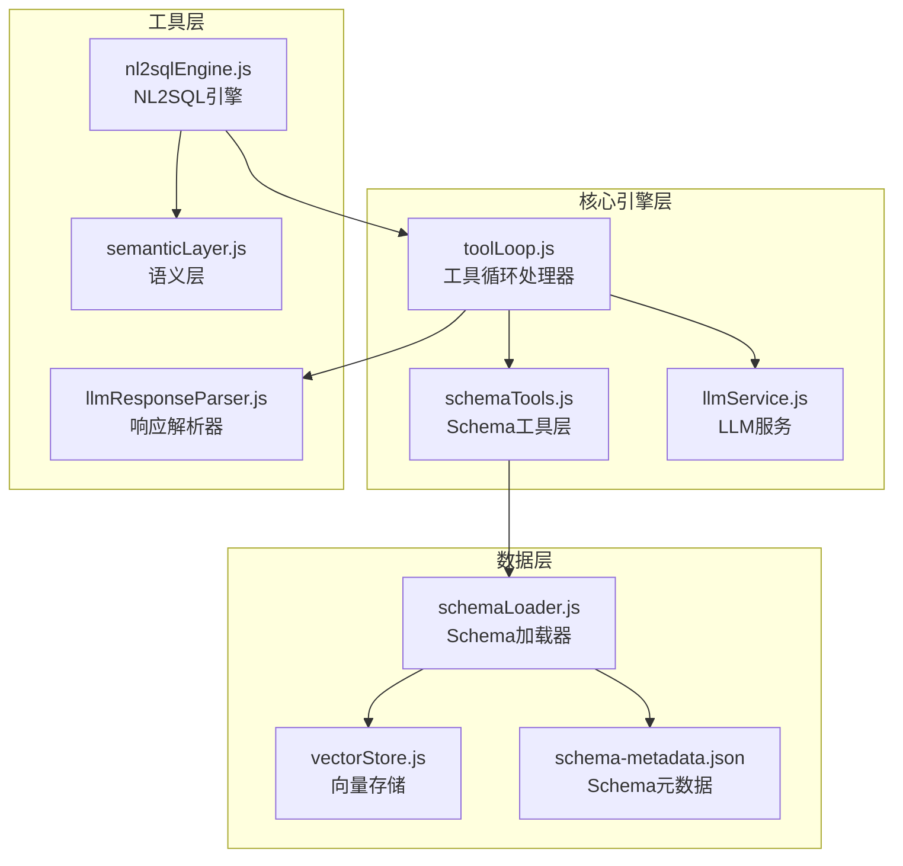
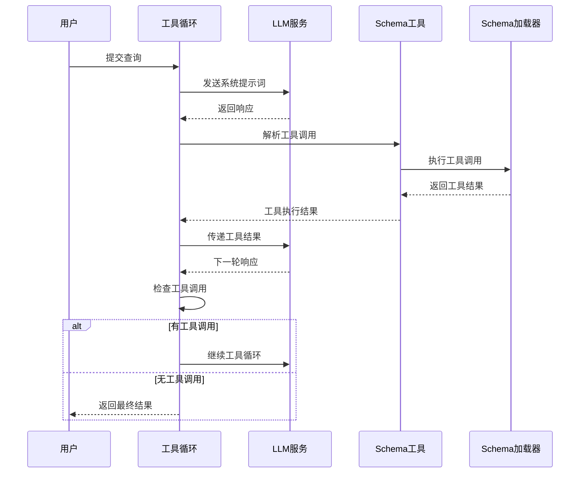
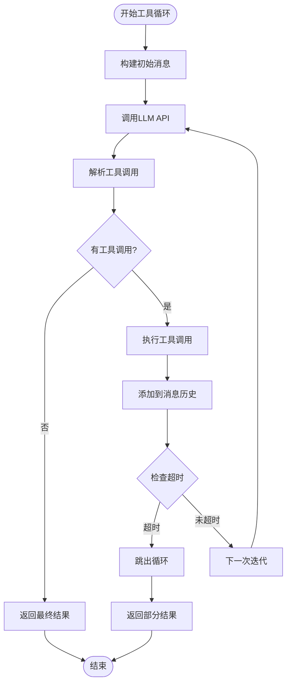
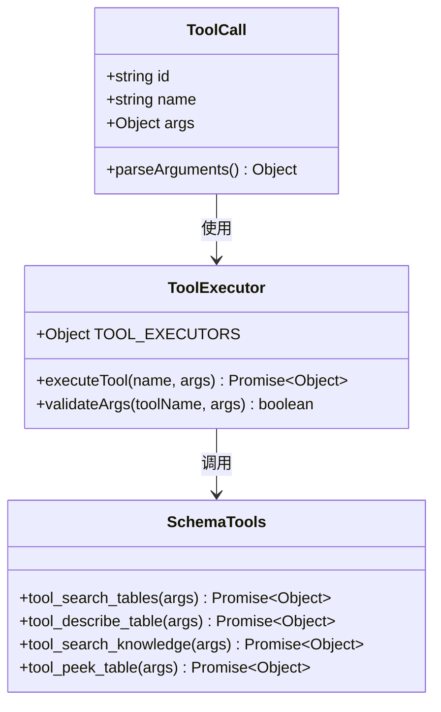
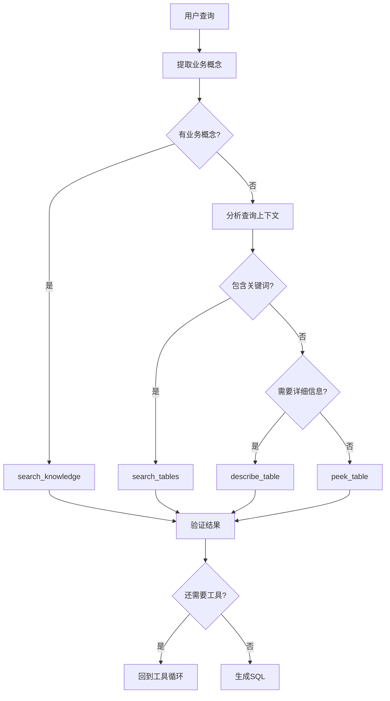
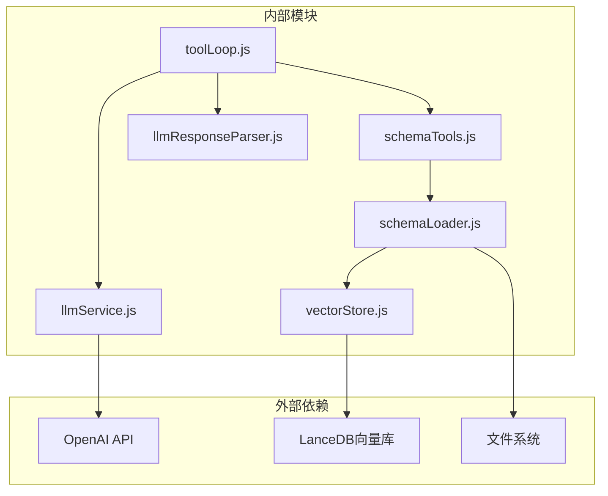

# 工具选择策略

<cite>
**本文档引用的文件**
- [toolLoop.js](file://backend/src/core/toolLoop.js)
- [schemaTools.js](file://backend/src/core/schemaTools.js)
- [llmResponseParser.js](file://backend/src/utils/llmResponseParser.js)
- [schemaLoader.js](file://backend/src/core/schemaLoader.js)
- [llmService.js](file://backend/src/core/llmService.js)
- [vectorStore.js](file://backend/src/memory/vectorStore.js)
- [nl2sqlEngine.js](file://backend/src/core/nl2sqlEngine.js)
- [semanticLayer.js](file://backend/src/core/semanticLayer.js)
- [feature-flags.js](file://backend/config/feature-flags.js)
- [schema-metadata.json](file://backend/config/schema-metadata.json)
</cite>

## 目录
1. [简介](#简介)
2. [项目结构](#项目结构)
3. [核心组件](#核心组件)
4. [架构概览](#架构概览)
5. [详细组件分析](#详细组件分析)
6. [依赖分析](#依赖分析)
7. [性能考虑](#性能考虑)
8. [故障排除指南](#故障排除指南)
9. [结论](#结论)

## 简介

本文档深入分析NL2SQL项目中的工具选择策略，详细解释LLM如何在工具循环中根据上下文和查询需求智能选择合适的工具。该系统实现了"按需索取"的Schema探索机制，通过四个核心工具实现智能化的数据库Schema发现和SQL生成。

系统采用工具增强的Schema探索策略，通过工具循环实现LLM与数据库Schema的交互式探索，确保只在需要时才获取详细的Schema信息，从而优化Token使用和响应时间。

## 项目结构

NL2SQL项目采用模块化架构，工具选择策略分布在多个核心模块中：

**图表来源**
- [toolLoop.js:1-521](file://backend/src/core/toolLoop.js#L1-L521)
- [schemaTools.js:1-632](file://backend/src/core/schemaTools.js#L1-L632)
- [schemaLoader.js:1-800](file://backend/src/core/schemaLoader.js#L1-L800)

**章节来源**
- [toolLoop.js:1-521](file://backend/src/core/toolLoop.js#L1-L521)
- [schemaTools.js:1-632](file://backend/src/core/schemaTools.js#L1-L632)

## 核心组件

### 工具循环处理器 (Tool Loop)

工具循环处理器是整个工具选择策略的核心，负责协调LLM与Schema工具的交互。其主要职责包括：

- **初始化消息构建**：构建包含系统提示词和对话历史的消息数组
- **工具调用解析**：从LLM响应中提取工具调用请求
- **工具执行管理**：协调工具执行并收集结果
- **循环控制**：管理工具循环的迭代次数和超时

### Schema工具层 (Schema Tools)

Schema工具层提供四个核心工具，每个工具都有明确的触发条件和使用场景：

1. **search_tables**：关键词搜索相关表
2. **describe_table**：获取表的详细字段信息  
3. **search_knowledge**：查询业务概念映射
4. **peek_table**：查看表结构预览

### LLM响应解析器

统一的响应解析器提供标准化的JSON和SQL提取功能，支持多种解析策略：

- 直接JSON解析
- 代码块提取
- 平衡花括号提取

**章节来源**
- [toolLoop.js:41-185](file://backend/src/core/toolLoop.js#L41-L185)
- [schemaTools.js:36-124](file://backend/src/core/schemaTools.js#L36-L124)
- [llmResponseParser.js:1-146](file://backend/src/utils/llmResponseParser.js#L1-L146)

## 架构概览

工具选择策略采用分层架构设计，通过工具循环实现LLM与数据库Schema的智能交互：

**图表来源**
- [toolLoop.js:73-185](file://backend/src/core/toolLoop.js#L73-L185)
- [schemaTools.js:585-602](file://backend/src/core/schemaTools.js#L585-L602)

## 详细组件分析

### 工具循环执行流程

工具循环采用迭代机制，每次迭代都包含完整的工具调用生命周期：

**图表来源**
- [toolLoop.js:80-185](file://backend/src/core/toolLoop.js#L80-L185)

### 四种核心工具详解

#### 1. search_tables 工具

**触发条件**：
- 用户查询包含业务术语或关键词
- 需要初步了解数据库中可能相关的表
- 确定表名时的首选工具

**使用场景**：
- 不确定具体表名时的表搜索
- 根据业务概念定位相关表
- 获取表的初步信息和相关性评分

**参数验证**：
- `keyword`：必需参数，关键词搜索
- `top_k`：可选参数，默认5个结果

**实现特点**：
- 使用语义搜索算法
- 结合Level 1索引进行初步筛选
- 返回表的名称、中文描述和相关性信息

#### 2. describe_table 工具

**触发条件**：
- 已经确定目标表，需要详细Schema信息
- 验证字段是否存在或确认字段类型
- 生成SQL时需要精确的字段信息

**使用场景**：
- 确定要使用某表后获取完整结构
- 验证字段是否存在
- 获取字段的详细描述和约束信息

**参数验证**：
- `table_name`：必需参数，目标表名
- `compact`：可选参数，默认true，控制输出格式

**实现特点**：
- 支持紧凑和完整两种输出格式
- 返回字段的详细信息包括类型、描述、主键等
- 包含表的基本元数据信息

#### 3. search_knowledge 工具

**触发条件**：
- 查询中包含业务术语（如"老平台"、"累计充值"）
- 需要理解业务概念与数据库表的映射关系
- 获取数据源的业务含义

**使用场景**：
- 理解业务术语的含义
- 获取业务概念到数据库标识的映射
- 解决平台术语（新平台/老平台）的识别问题

**参数验证**：
- `concept`：必需参数，业务概念名称

**实现特点**：
- 支持精确匹配、别名匹配和模糊匹配
- 返回业务概念的详细定义和映射关系
- 包含建议的表名和字段信息

#### 4. peek_table 工具

**触发条件**：
- 需要验证表是否有数据
- 了解数据格式和结构
- 确认表的可用性

**使用场景**：
- 验证表是否有数据
- 了解数据格式
- 确认表的结构信息

**参数验证**：
- `table_name`：必需参数，目标表名
- `limit`：可选参数，默认3行，最大10行

**实现特点**：
- 仅返回结构信息，不返回实际数据（安全考虑）
- 限制最大返回行数防止过度数据泄露
- 返回字段的基本信息包括名称、类型、描述等

**章节来源**
- [schemaTools.js:225-393](file://backend/src/core/schemaTools.js#L225-L393)
- [schemaTools.js:405-542](file://backend/src/core/schemaTools.js#L405-L542)

### 工具调用解析机制

工具调用解析采用标准化的OpenAI函数调用格式：

**图表来源**
- [schemaTools.js:565-577](file://backend/src/core/schemaTools.js#L565-L577)
- [schemaTools.js:585-602](file://backend/src/core/schemaTools.js#L585-L602)

**章节来源**
- [schemaTools.js:548-577](file://backend/src/core/schemaTools.js#L548-L577)
- [schemaTools.js:585-602](file://backend/src/core/schemaTools.js#L585-L602)

### 决策逻辑和触发条件

工具选择策略基于以下决策逻辑：

**图表来源**
- [toolLoop.js:232-293](file://backend/src/core/toolLoop.js#L232-L293)
- [schemaTools.js:405-542](file://backend/src/core/schemaTools.js#L405-L542)

**章节来源**
- [toolLoop.js:232-293](file://backend/src/core/toolLoop.js#L232-L293)
- [semanticLayer.js:134-167](file://backend/src/core/semanticLayer.js#L134-L167)

## 依赖分析

工具选择策略涉及多个模块间的复杂依赖关系：

**图表来源**
- [toolLoop.js:16-21](file://backend/src/core/toolLoop.js#L16-L21)
- [schemaLoader.js:15-27](file://backend/src/core/schemaLoader.js#L15-L27)

### 关键依赖关系

1. **LLM服务依赖**：通过llmService.js与外部LLM API通信
2. **Schema加载依赖**：通过schemaLoader.js管理数据库Schema信息
3. **向量存储依赖**：通过vectorStore.js实现语义搜索功能
4. **响应解析依赖**：通过llmResponseParser.js标准化LLM响应处理

**章节来源**
- [llmService.js:1-477](file://backend/src/core/llmService.js#L1-L477)
- [schemaLoader.js:1-800](file://backend/src/core/schemaLoader.js#L1-L800)
- [vectorStore.js:1-948](file://backend/src/memory/vectorStore.js#L1-L948)

## 性能考虑

工具选择策略在设计时充分考虑了性能优化：

### Token使用优化
- 采用"按需索取"策略，只在需要时获取详细Schema信息
- Level 1索引提供快速的初步筛选
- 工具调用限制在5次迭代内，防止无限循环

### 缓存机制
- Schema工具层实现Level 1索引缓存
- 缓存过期时间可配置，默认1小时
- 支持强制刷新机制

### 搜索优化
- 向量存储支持智能搜索，结合查询意图进行重排序
- 支持元数据过滤，提高搜索精度
- 提供回退机制，确保在向量存储不可用时仍能正常工作

**章节来源**
- [toolLoop.js:30-36](file://backend/src/core/toolLoop.js#L30-L36)
- [schemaTools.js:154-173](file://backend/src/core/schemaTools.js#L154-L173)
- [vectorStore.js:452-576](file://backend/src/memory/vectorStore.js#L452-L576)

## 故障排除指南

### 常见问题和解决方案

#### 工具调用失败
**症状**：工具执行返回错误信息
**原因**：
- 表名不存在
- 参数格式不正确
- 权限不足

**解决方案**：
- 检查表名是否正确
- 验证参数类型和格式
- 确认数据库权限

#### LLM响应解析失败
**症状**：无法从LLM响应中提取JSON
**原因**：
- LLM输出格式不符合预期
- 响应包含特殊字符

**解决方案**：
- 检查系统提示词的格式要求
- 确保输出格式的一致性
- 使用响应解析器的多种解析策略

#### 工具循环超时
**症状**：工具循环超过60秒仍未完成
**原因**：
- 查询过于复杂
- 数据库响应缓慢
- 工具调用过多

**解决方案**：
- 简化查询语句
- 检查数据库性能
- 优化工具调用策略

**章节来源**
- [toolLoop.js:176-184](file://backend/src/core/toolLoop.js#L176-L184)
- [llmResponseParser.js:24-59](file://backend/src/utils/llmResponseParser.js#L24-L59)

## 结论

NL2SQL项目的工具选择策略通过精心设计的工具循环机制，实现了LLM与数据库Schema的智能交互。该策略的核心优势包括：

1. **智能化工具选择**：基于查询上下文和业务概念自动选择最适合的工具
2. **按需索取机制**：避免一次性传输大量Schema信息，优化Token使用
3. **强大的错误处理**：完善的错误检测和恢复机制
4. **性能优化设计**：多层缓存和搜索优化确保系统响应速度

通过四个核心工具的协同工作，系统能够高效地完成从自然语言查询到SQL语句的转换，为用户提供准确可靠的查询服务。工具选择策略的设计体现了现代AI系统中"工具增强"理念的最佳实践，为类似项目提供了有价值的参考。