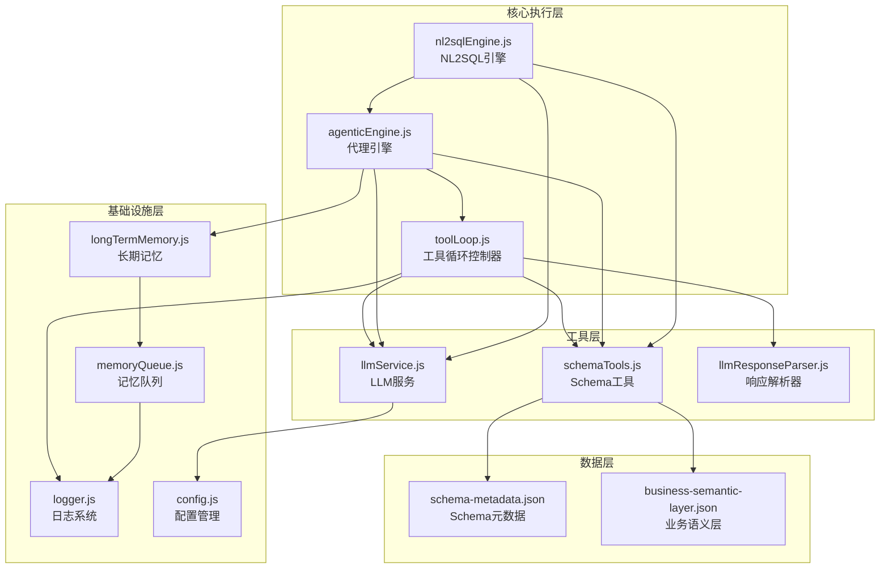
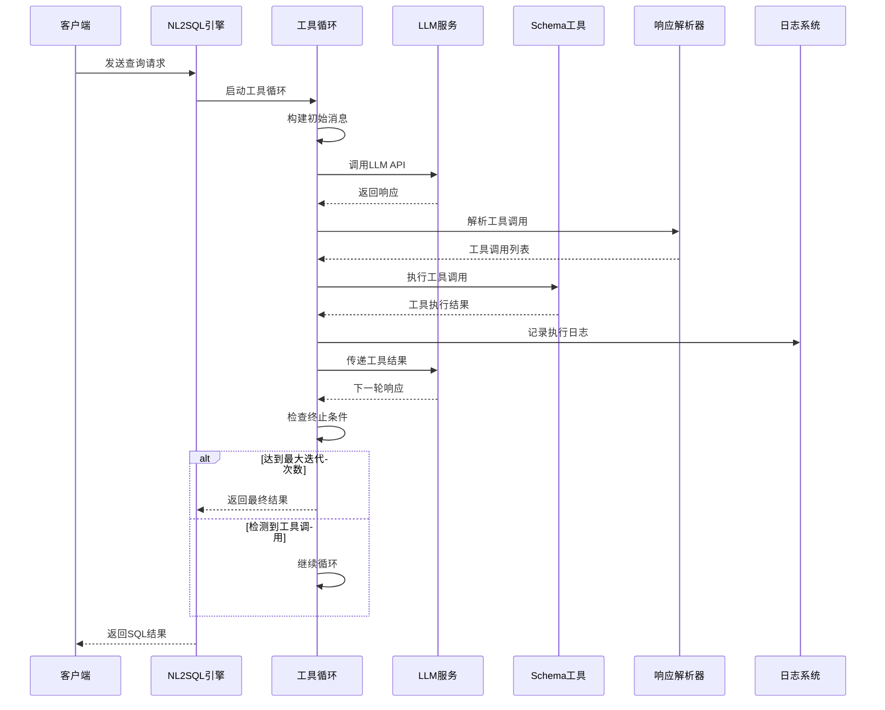
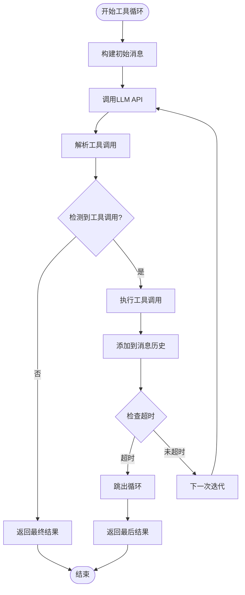
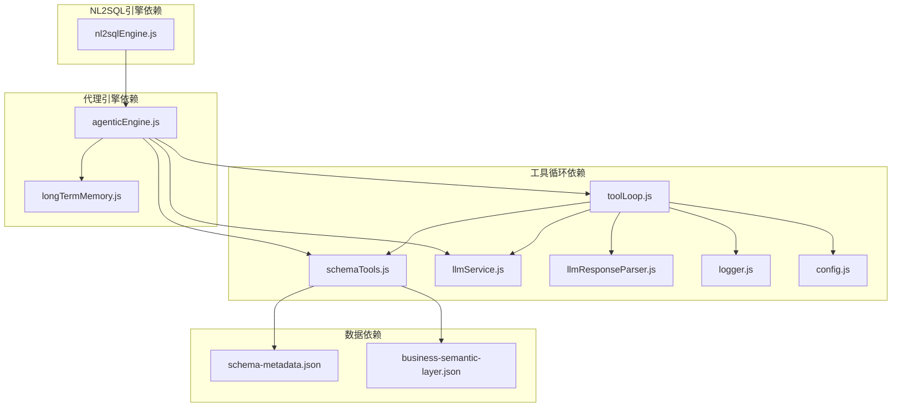

# 执行流程控制

<cite>
**本文档引用的文件**
- [toolLoop.js](file://backend/src/core/toolLoop.js)
- [agenticEngine.js](file://backend/src/core/agenticEngine.js)
- [nl2sqlEngine.js](file://backend/src/core/nl2sqlEngine.js)
- [schemaTools.js](file://backend/src/core/schemaTools.js)
- [llmService.js](file://backend/src/core/llmService.js)
- [llmResponseParser.js](file://backend/src/utils/llmResponseParser.js)
- [logger.js](file://backend/src/utils/logger.js)
- [memoryQueue.js](file://backend/src/memory/memoryQueue.js)
- [longTermMemory.js](file://backend/src/memory/longTermMemory.js)
- [config.js](file://backend/src/core/config.js)
- [schema-metadata.json](file://backend/config/schema-metadata.json)
- [business-semantic-layer.json](file://backend/config/business-semantic-layer.json)
</cite>

## 目录
1. [简介](#简介)
2. [项目结构](#项目结构)
3. [核心组件](#核心组件)
4. [架构概览](#架构概览)
5. [详细组件分析](#详细组件分析)
6. [依赖分析](#依赖分析)
7. [性能考虑](#性能考虑)
8. [故障排查指南](#故障排查指南)
9. [结论](#结论)

## 简介
本技术文档深入解析NL2SQL系统的执行流程控制机制，重点阐述工具循环（Tool Loop）的核心执行机制，包括循环控制逻辑、迭代限制和超时处理。文档详细描述消息构建、LLM调用、工具执行和结果处理的完整流程，说明循环终止条件、错误恢复机制和异常处理策略。同时提供具体的代码示例路径，展示执行流程的实现细节，包括消息队列管理、工具调用日志记录和性能监控。文档包含流程图和状态转换图，帮助开发者理解工具循环的控制流和数据流。

## 项目结构
NL2SQL项目采用模块化架构设计，核心执行流程由多个相互协作的模块组成：



**图表来源**
- [toolLoop.js:1-521](file://backend/src/core/toolLoop.js#L1-L521)
- [agenticEngine.js:1-651](file://backend/src/core/agenticEngine.js#L1-L651)
- [nl2sqlEngine.js:1-800](file://backend/src/core/nl2sqlEngine.js#L1-L800)

**章节来源**
- [toolLoop.js:1-521](file://backend/src/core/toolLoop.js#L1-L521)
- [agenticEngine.js:1-651](file://backend/src/core/agenticEngine.js#L1-L651)
- [nl2sqlEngine.js:1-800](file://backend/src/core/nl2sqlEngine.js#L1-L800)

## 核心组件
NL2SQL系统的核心执行组件包括：

### 工具循环控制器（Tool Loop Controller）
负责管理LLM工具调用的完整生命周期，包括消息构建、工具调用解析、执行和结果处理。

### 代理引擎（Agentic Engine）
实现四阶段代理工作流，整合前三个阶段并提供Plan → Act → Observe循环。

### NL2SQL引擎
提供完整的自然语言到SQL转换能力，包括意图识别、澄清机制、SQL生成、验证和结果格式化。

### Schema工具层
提供LLM可调用的Schema探索工具，实现按需索取而非一次性灌输。

**章节来源**
- [toolLoop.js:41-185](file://backend/src/core/toolLoop.js#L41-L185)
- [agenticEngine.js:52-178](file://backend/src/core/agenticEngine.js#L52-L178)
- [nl2sqlEngine.js:16-35](file://backend/src/core/nl2sqlEngine.js#L16-L35)

## 架构概览
NL2SQL系统的执行架构采用分层设计，确保各组件职责清晰、耦合度低：



**图表来源**
- [toolLoop.js:57-185](file://backend/src/core/toolLoop.js#L57-L185)
- [llmService.js:222-308](file://backend/src/core/llmService.js#L222-L308)
- [schemaTools.js:585-602](file://backend/src/core/schemaTools.js#L585-L602)

## 详细组件分析

### 工具循环执行机制

#### 核心执行流程
工具循环的核心执行流程遵循"消息构建 → LLM调用 → 工具解析 → 工具执行 → 结果返回"的闭环：



**图表来源**
- [toolLoop.js:80-185](file://backend/src/core/toolLoop.js#L80-L185)

#### 循环控制逻辑
工具循环实现了严格的控制机制：

**迭代限制控制**
- 最大迭代次数：5次（防止无限循环）
- 迭代计数器：每次循环递增
- 达到限制时返回最后结果

**超时处理机制**
- 超时时间：60秒
- 超时检测：每次循环检查当前时间与开始时间差
- 超时后立即跳出循环

**终止条件判定**
- LLM响应中无工具调用请求
- 达到最大迭代次数
- 发生超时
- 捕获到异常

**章节来源**
- [toolLoop.js:26-36](file://backend/src/core/toolLoop.js#L26-L36)
- [toolLoop.js:77-185](file://backend/src/core/toolLoop.js#L77-L185)

#### 消息构建与管理
工具循环的消息管理采用历史记录机制：

**消息构建策略**
- 系统提示词：包含工具定义和工作流程说明
- 对话历史：最近5轮对话内容
- 当前查询：用户最新输入

**消息历史维护**
- 工具调用结果：以tool角色添加到历史
- 助手响应：以assistant角色添加到历史
- 消息格式：统一的role-content结构

**章节来源**
- [toolLoop.js:195-224](file://backend/src/core/toolLoop.js#L195-L224)
- [toolLoop.js:120-152](file://backend/src/core/toolLoop.js#L120-L152)

#### 工具调用解析与执行
工具调用解析采用OpenAI函数调用格式：

**工具定义结构**
```javascript
const TOOL_DEFINITIONS = [
  {
    type: 'function',
    function: {
      name: 'search_tables',
      description: '根据关键词搜索相关表',
      parameters: {
        type: 'object',
        properties: {
          keyword: { type: 'string' },
          top_k: { type: 'integer' }
        }
      }
    }
  }
  // ... 其他工具定义
];
```

**工具执行流程**
1. 解析LLM响应中的工具调用
2. 根据工具名称路由到对应执行器
3. 执行工具并返回结果
4. 将结果格式化为消息历史

**章节来源**
- [schemaTools.js:40-124](file://backend/src/core/schemaTools.js#L40-L124)
- [schemaTools.js:565-577](file://backend/src/core/schemaTools.js#L565-L577)
- [schemaTools.js:585-602](file://backend/src/core/schemaTools.js#L585-L602)

### LLM服务集成

#### HTTP请求封装
LLM服务提供了完整的HTTP请求封装：

**请求配置**
- 超时控制：默认60秒
- 重试机制：最多3次重试
- 错误处理：详细的错误信息记录

**流式响应支持**
- 支持流式和非流式响应
- 流式响应处理回调函数
- 数据块接收和拼接

**章节来源**
- [llmService.js:41-152](file://backend/src/core/llmService.js#L41-L152)
- [llmService.js:222-308](file://backend/src/core/llmService.js#L222-L308)

#### 重试机制
LLM服务实现了智能重试机制：

**重试策略**
- 指数退避：每次重试间隔递增
- 最大重试次数：3次
- 错误分类：区分网络错误和API错误

**重试触发条件**
- 请求超时
- HTTP状态码非2xx
- JSON解析失败

**章节来源**
- [llmService.js:167-195](file://backend/src/core/llmService.js#L167-L195)

### 响应解析器

#### JSON解析策略
统一的响应解析器提供了多种解析策略：

**解析顺序**
1. 直接JSON.parse
2. 提取```json代码块
3. 提取最外层花括号内容

**SQL提取策略**
1. 从JSON对象提取sql字段
2. 提取```sql代码块
3. 正则匹配SELECT语句

**章节来源**
- [llmResponseParser.js:24-59](file://backend/src/utils/llmResponseParser.js#L24-L59)
- [llmResponseParser.js:119-143](file://backend/src/utils/llmResponseParser.js#L119-L143)

### 日志记录系统

#### 多级别日志支持
日志系统提供了完整的执行追踪能力：

**日志级别**
- TRACE：最详细级别，用于深度调试
- DEBUG：详细调试信息
- INFO：一般信息
- WARN：警告信息
- ERROR：错误信息

**追踪功能**
- 追踪上下文管理
- 自动清理僵尸追踪条目
- 执行步骤记录

**章节来源**
- [logger.js:33-44](file://backend/src/utils/logger.js#L33-L44)
- [logger.js:352-448](file://backend/src/utils/logger.js#L352-L448)

### 记忆队列管理

#### 异步存储优化
记忆队列实现了高效的异步存储机制：

**队列特性**
- 批量处理：每次处理5个操作
- 间隔控制：100毫秒处理间隔
- 并行执行：Promise.allSettled并行处理

**队列状态监控**
- 队列大小统计
- 处理状态跟踪
- 错误计数统计

**章节来源**
- [memoryQueue.js:46-118](file://backend/src/memory/memoryQueue.js#L46-L118)
- [memoryQueue.js:160-202](file://backend/src/memory/memoryQueue.js#L160-L202)

## 依赖分析

### 组件间依赖关系



**图表来源**
- [toolLoop.js:16-21](file://backend/src/core/toolLoop.js#L16-L21)
- [agenticEngine.js:20-29](file://backend/src/core/agenticEngine.js#L20-L29)
- [nl2sqlEngine.js:16-34](file://backend/src/core/nl2sqlEngine.js#L16-L34)

### 关键依赖链

**工具循环关键路径**
1. toolLoop.js → schemaTools.js（工具定义和执行）
2. toolLoop.js → llmService.js（LLM调用）
3. toolLoop.js → llmResponseParser.js（响应解析）
4. toolLoop.js → logger.js（日志记录）

**代理引擎关键路径**
1. agenticEngine.js → toolLoop.js（工具循环）
2. agenticEngine.js → longTermMemory.js（长期记忆）
3. agenticEngine.js → llmService.js（LLM调用）

**章节来源**
- [toolLoop.js:16-21](file://backend/src/core/toolLoop.js#L16-L21)
- [agenticEngine.js:20-29](file://backend/src/core/agenticEngine.js#L20-L29)

## 性能考虑

### 执行性能优化

**内存管理**
- Level 1索引缓存：默认1小时过期
- Schema元数据缓存：减少重复加载
- 工具调用结果缓存：避免重复执行

**并发控制**
- 工具调用并行执行
- 记忆存储异步处理
- LLM请求重试机制

**资源限制**
- 最大迭代次数：5次
- 超时时间：60秒
- 最大重试次数：3次

### 监控指标

**性能监控点**
- LLM调用耗时
- 工具执行耗时
- 记忆存储耗时
- 整体处理时间

**日志监控**
- 详细执行步骤记录
- 错误发生位置追踪
- 性能瓶颈识别

## 故障排查指南

### 常见问题诊断

**工具循环超时**
- 检查LLM响应时间
- 验证工具执行效率
- 调整超时配置

**工具调用失败**
- 检查工具定义完整性
- 验证工具参数格式
- 确认Schema工具可用性

**LLM API错误**
- 验证API密钥有效性
- 检查网络连接状态
- 确认API服务可用性

### 调试技巧

**日志分析**
- 启用TRACE级别日志
- 关注工具循环关键节点
- 分析执行时间分布

**性能分析**
- 监控各组件执行时间
- 识别性能瓶颈
- 优化关键路径

**章节来源**
- [toolLoop.js:176-184](file://backend/src/core/toolLoop.js#L176-L184)
- [llmService.js:136-151](file://backend/src/core/llmService.js#L136-L151)
- [logger.js:276-322](file://backend/src/utils/logger.js#L276-L322)

## 结论
NL2SQL系统的执行流程控制机制展现了现代AI应用的工程化实践。通过精心设计的工具循环、完善的错误处理和全面的性能监控，系统实现了可靠的自然语言到SQL转换能力。关键特性包括：

1. **稳健的循环控制**：通过迭代限制和超时机制确保系统稳定性
2. **灵活的消息管理**：支持动态消息历史维护和上下文管理
3. **强大的工具集成**：提供完整的Schema探索工具集
4. **完善的错误处理**：多层次的异常捕获和恢复机制
5. **全面的性能监控**：详细的日志记录和性能指标追踪

这些设计使得NL2SQL系统能够在复杂的企业环境中稳定运行，为用户提供高质量的自然语言查询服务。