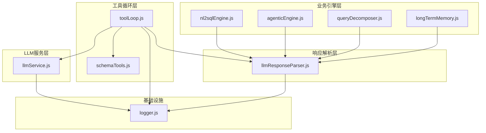
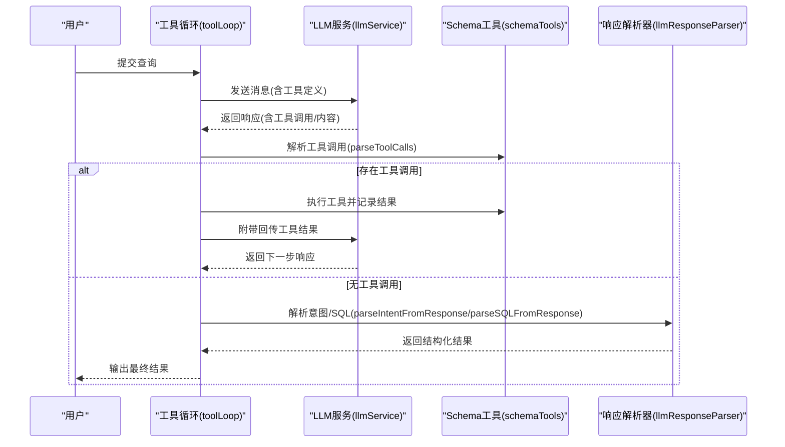
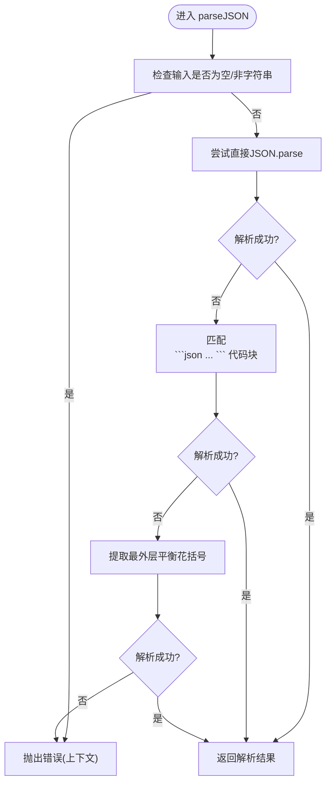
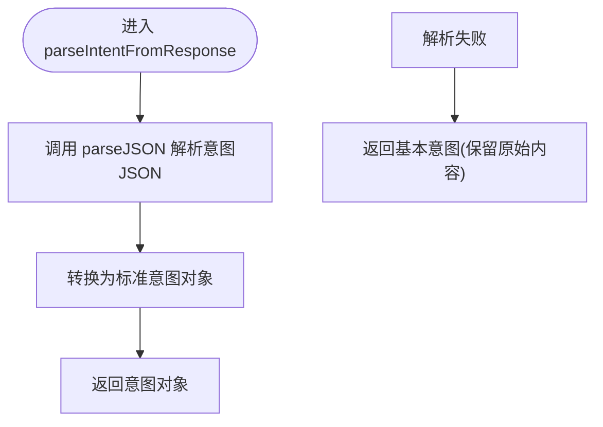
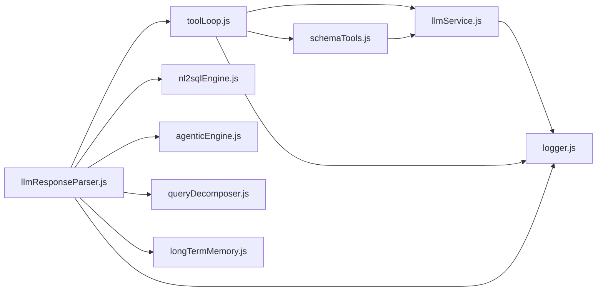

# 结果处理机制

<cite>
**本文档引用的文件**
- [llmResponseParser.js](file://backend/src/utils/llmResponseParser.js)
- [toolLoop.js](file://backend/src/core/toolLoop.js)
- [nl2sqlEngine.js](file://backend/src/core/nl2sqlEngine.js)
- [agenticEngine.js](file://backend/src/core/agenticEngine.js)
- [queryDecomposer.js](file://backend/src/core/queryDecomposer.js)
- [longTermMemory.js](file://backend/src/memory/longTermMemory.js)
- [llmService.js](file://backend/src/core/llmService.js)
- [schemaTools.js](file://backend/src/core/schemaTools.js)
- [logger.js](file://backend/src/utils/logger.js)
</cite>

## 目录
1. [简介](#简介)
2. [项目结构](#项目结构)
3. [核心组件](#核心组件)
4. [架构概览](#架构概览)
5. [详细组件分析](#详细组件分析)
6. [依赖关系分析](#依赖关系分析)
7. [性能考量](#性能考量)
8. [故障排查指南](#故障排查指南)
9. [结论](#结论)

## 简介
本文件聚焦于NL2SQL系统中“结果处理机制”的技术实现，深入解释工具循环中LLM响应的解析与处理流程，涵盖：
- JSON格式解析策略与容错机制
- SQL提取算法与多种提取策略
- 意图识别与SQL生成中的响应结构化处理
- 错误恢复与格式验证机制
- 不同类型响应（成功、部分、错误）的处理策略
- 具体代码示例路径与解析流程图

目标是帮助开发者全面理解从LLM响应到结构化结果的完整链路，并提供可操作的排障与优化建议。

## 项目结构
NL2SQL后端采用模块化设计，结果处理相关的核心模块分布如下：
- 工具循环与意图/SQL解析：toolLoop.js
- LLM服务与HTTP请求封装：llmService.js
- 统一响应解析器：llmResponseParser.js
- 多种引擎中的响应处理：nl2sqlEngine.js、agenticEngine.js、queryDecomposer.js、longTermMemory.js
- Schema工具与工具调用解析：schemaTools.js
- 日志系统：logger.js



图表来源
- [toolLoop.js:1-521](file://backend/src/core/toolLoop.js#L1-L521)
- [schemaTools.js:1-632](file://backend/src/core/schemaTools.js#L1-L632)
- [llmService.js:1-477](file://backend/src/core/llmService.js#L1-L477)
- [llmResponseParser.js:1-146](file://backend/src/utils/llmResponseParser.js#L1-L146)
- [nl2sqlEngine.js:1-800](file://backend/src/core/nl2sqlEngine.js#L1-L800)
- [agenticEngine.js:400-599](file://backend/src/core/agenticEngine.js#L400-L599)
- [queryDecomposer.js:150-349](file://backend/src/core/queryDecomposer.js#L150-L349)
- [longTermMemory.js:190-389](file://backend/src/memory/longTermMemory.js#L190-L389)
- [logger.js:1-482](file://backend/src/utils/logger.js#L1-L482)

章节来源
- [toolLoop.js:1-521](file://backend/src/core/toolLoop.js#L1-L521)
- [llmService.js:1-477](file://backend/src/core/llmService.js#L1-L477)
- [llmResponseParser.js:1-146](file://backend/src/utils/llmResponseParser.js#L1-L146)

## 核心组件
- 统一响应解析器（llmResponseParser.js）
  - 提供parseJSON与extractSQL两个核心能力，统一各模块的响应解析策略
  - parseJSON支持三种策略：直接解析、代码块提取、花括号平衡提取
  - extractSQL支持从JSON、代码块、正则三类来源提取SQL
- 工具循环（toolLoop.js）
  - 在工具调用循环中解析LLM响应，支持意图识别与SQL生成
  - 提供parseIntentFromResponse与parseSQLFromResponse两类解析入口
- 多引擎响应处理
  - nl2sqlEngine.js：传统NL2SQL流程中的JSON解析
  - agenticEngine.js：智能代理流程中的SQL解析与验证
  - queryDecomposer.js：查询分解中的JSON解析与兜底
  - longTermMemory.js：长期记忆中的JSON解析
- LLM服务（llmService.js）
  - 封装HTTP请求、重试机制与错误处理，保障响应稳定性
- Schema工具（schemaTools.js）
  - 解析LLM的工具调用请求，驱动工具循环

章节来源
- [llmResponseParser.js:1-146](file://backend/src/utils/llmResponseParser.js#L1-L146)
- [toolLoop.js:350-516](file://backend/src/core/toolLoop.js#L350-L516)
- [nl2sqlEngine.js:2708-2709](file://backend/src/core/nl2sqlEngine.js#L2708-L2709)
- [agenticEngine.js:405-433](file://backend/src/core/agenticEngine.js#L405-L433)
- [queryDecomposer.js:152-171](file://backend/src/core/queryDecomposer.js#L152-L171)
- [longTermMemory.js:195-196](file://backend/src/memory/longTermMemory.js#L195-L196)
- [llmService.js:222-308](file://backend/src/core/llmService.js#L222-L308)
- [schemaTools.js:585-602](file://backend/src/core/schemaTools.js#L585-L602)

## 架构概览
工具循环中的结果处理遵循“工具调用→LLM响应→解析→执行工具→反馈→再次LLM”的迭代流程。解析器在每个阶段提供统一的JSON/SQL提取能力，确保不同来源的响应都能被稳定处理。



图表来源
- [toolLoop.js:86-184](file://backend/src/core/toolLoop.js#L86-L184)
- [schemaTools.js:585-602](file://backend/src/core/schemaTools.js#L585-L602)
- [llmService.js:222-308](file://backend/src/core/llmService.js#L222-L308)
- [llmResponseParser.js:24-143](file://backend/src/utils/llmResponseParser.js#L24-L143)

## 详细组件分析

### 统一响应解析器（llmResponseParser.js）
- parseJSON策略
  - 直接JSON.parse：优先尝试原生字符串解析
  - 代码块提取：匹配```json ... ```并解析内部JSON
  - 花括号平衡提取：从首个{开始，使用深度计数法提取最外层JSON对象
  - 容错与错误：若三种策略均失败，抛出带上下文的错误，便于定位问题
- extractSQL策略
  - 优先从JSON对象的sql字段提取
  - 其次从```sql ... ```代码块提取
  - 最后通过正则匹配SELECT语句（支持多行与结尾分隔）
  - 若均失败，返回空字符串，便于上层做兜底处理



图表来源
- [llmResponseParser.js:24-59](file://backend/src/utils/llmResponseParser.js#L24-L59)

章节来源
- [llmResponseParser.js:11-146](file://backend/src/utils/llmResponseParser.js#L11-L146)

### 工具循环中的响应解析（toolLoop.js）
- 意图解析（parseIntentFromResponse）
  - 使用解析器解析JSON，转换为标准意图对象（包含tables、sql、explanation、confidence等）
  - 若解析失败，降级为基本意图（保留原始内容与默认置信度）
- SQL解析（parseSQLFromResponse）
  - 优先解析JSON对象中的sql与explanation
  - 解析失败时，直接提取SQL（extractSQL）
  - 若仍失败，返回解释性内容作为说明



图表来源
- [toolLoop.js:352-382](file://backend/src/core/toolLoop.js#L352-L382)

章节来源
- [toolLoop.js:350-516](file://backend/src/core/toolLoop.js#L350-L516)

### 多引擎中的响应处理
- nl2sqlEngine.js
  - parseJSONResponse：统一调用解析器，保证各阶段JSON解析一致性
- agenticEngine.js
  - parseSQLResponse：先尝试JSON解析，失败时直接提取SQL；失败则返回错误
  - verificationPhase：对SQL进行基本语法与安全检查，汇总错误
  - recoveryPhase：根据错误类型进行恢复（如表不存在、语法错误）
- queryDecomposer.js
  - parseDecomposition：解析查询分解JSON，失败时创建基础分解
  - validateDecomposition：确保必要字段存在并规范化
- longTermMemory.js
  - parseJSONResponse：统一解析LLM返回的JSON，支持长期记忆偏好提取

章节来源
- [nl2sqlEngine.js:2708-2709](file://backend/src/core/nl2sqlEngine.js#L2708-L2709)
- [agenticEngine.js:405-599](file://backend/src/core/agenticEngine.js#L405-L599)
- [queryDecomposer.js:152-198](file://backend/src/core/queryDecomposer.js#L152-L198)
- [longTermMemory.js:195-196](file://backend/src/memory/longTermMemory.js#L195-L196)

### LLM服务与工具调用解析（llmService.js, schemaTools.js）
- llmService.js
  - chat：封装HTTP请求、重试机制与超时处理，记录详细日志
  - withRetry：指数退避重试，避免瞬时故障导致失败
- schemaTools.js
  - parseToolCalls：解析LLM响应中的工具调用，提取函数名与参数
  - executeTool：根据工具名调度执行器，返回结构化结果

章节来源
- [llmService.js:222-308](file://backend/src/core/llmService.js#L222-L308)
- [schemaTools.js:585-602](file://backend/src/core/schemaTools.js#L585-L602)

## 依赖关系分析
- 解析器依赖
  - llmResponseParser被toolLoop、nl2sqlEngine、agenticEngine、queryDecomposer、longTermMemory广泛复用
  - 通过统一接口降低各模块的解析复杂度与重复实现
- 工具循环依赖
  - toolLoop依赖schemaTools解析工具调用，依赖llmService发起请求
  - 通过日志模块记录关键步骤，便于排障
- LLM服务依赖
  - llmService封装HTTP与重试，向上提供稳定的服务接口



图表来源
- [llmResponseParser.js:1-146](file://backend/src/utils/llmResponseParser.js#L1-L146)
- [toolLoop.js:1-521](file://backend/src/core/toolLoop.js#L1-L521)
- [schemaTools.js:1-632](file://backend/src/core/schemaTools.js#L1-L632)
- [llmService.js:1-477](file://backend/src/core/llmService.js#L1-L477)
- [logger.js:1-482](file://backend/src/utils/logger.js#L1-L482)

章节来源
- [llmResponseParser.js:1-146](file://backend/src/utils/llmResponseParser.js#L1-L146)
- [toolLoop.js:1-521](file://backend/src/core/toolLoop.js#L1-L521)
- [schemaTools.js:1-632](file://backend/src/core/schemaTools.js#L1-L632)
- [llmService.js:1-477](file://backend/src/core/llmService.js#L1-L477)
- [logger.js:1-482](file://backend/src/utils/logger.js#L1-L482)

## 性能考量
- 解析策略的渐进式设计
  - parseJSON优先尝试直接解析，避免不必要的正则匹配
  - extractBalancedJSON通过深度计数法处理嵌套花括号，避免正则陷阱
- 工具循环的超时与迭代限制
  - MAX_TOOL_ITERATIONS与TOOL_LOOP_TIMEOUT防止无限循环与长时间占用
- LLM服务的重试与超时
  - withRetry与超时控制降低外部API波动的影响
- 日志开销控制
  - TRACE/DEBUG/INFO/WARN/ERROR分级，避免过度日志影响性能

## 故障排查指南
- JSON解析失败
  - 检查响应是否包含```json代码块或最外层花括号
  - 使用上下文错误信息定位调用方（如ToolLoop:Intent、ToolLoop:SQL等）
  - 参考路径：[llmResponseParser.js](file://backend/src/utils/llmResponseParser.js#L24-L59)
- SQL提取失败
  - 确认LLM是否返回了JSON对象或```sql代码块
  - 若仅返回自然语言，extractSQL会尝试正则匹配SELECT
  - 参考路径：[llmResponseParser.js:119-143](file://backend/src/utils/llmResponseParser.js#L119-L143)
- 工具循环卡住或超时
  - 检查工具调用解析是否正确（parseToolCalls）
  - 确认工具执行结果是否正确返回JSON字符串
  - 参考路径：[toolLoop.js:86-184](file://backend/src/core/toolLoop.js#L86-L184)，[schemaTools.js:585-602](file://backend/src/core/schemaTools.js#L585-L602)
- LLM请求失败
  - 查看withRetry重试日志与超时信息
  - 检查API密钥、端点与网络连通性
  - 参考路径：[llmService.js:278-308](file://backend/src/core/llmService.js#L278-L308)
- 验证阶段失败
  - agenticEngine的verificationPhase会检查基本语法、安全关键字与表存在性
  - 参考路径：[agenticEngine.js:438-495](file://backend/src/core/agenticEngine.js#L438-L495)

章节来源
- [llmResponseParser.js:24-143](file://backend/src/utils/llmResponseParser.js#L24-L143)
- [toolLoop.js:86-184](file://backend/src/core/toolLoop.js#L86-L184)
- [schemaTools.js:585-602](file://backend/src/core/schemaTools.js#L585-L602)
- [llmService.js:278-308](file://backend/src/core/llmService.js#L278-L308)
- [agenticEngine.js:438-495](file://backend/src/core/agenticEngine.js#L438-L495)

## 结论
NL2SQL系统通过统一的响应解析器与工具循环机制，实现了对LLM响应的稳健处理。解析器的多策略设计与各引擎的兜底逻辑共同构成了高鲁棒性的结果处理体系。结合日志与重试机制，系统能够在复杂场景下保持稳定运行，并为后续的SQL验证与恢复提供可靠基础。