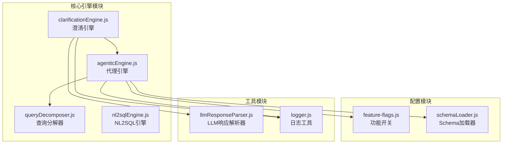
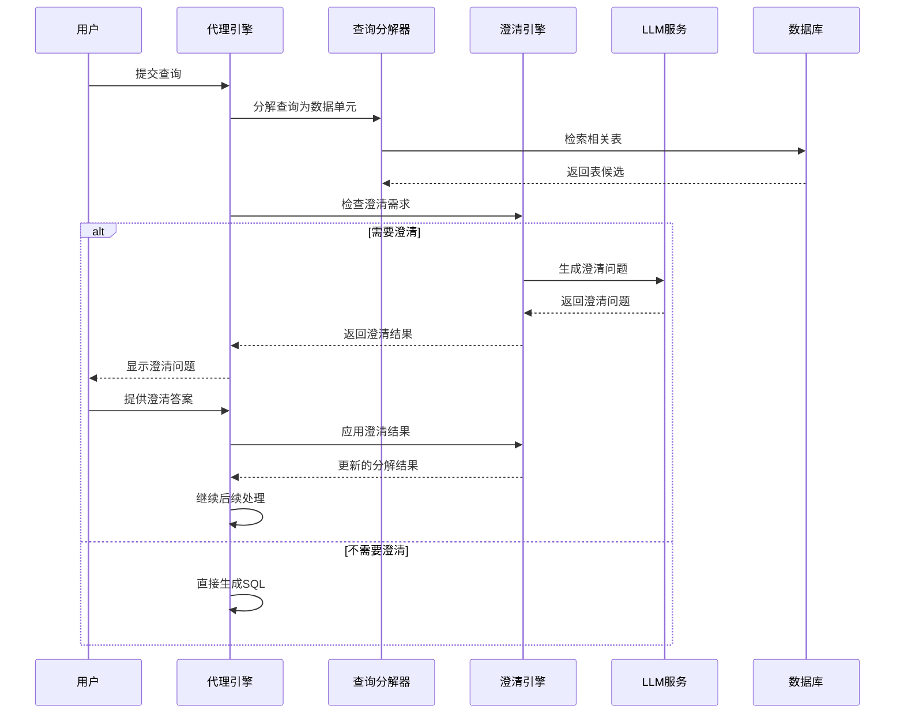
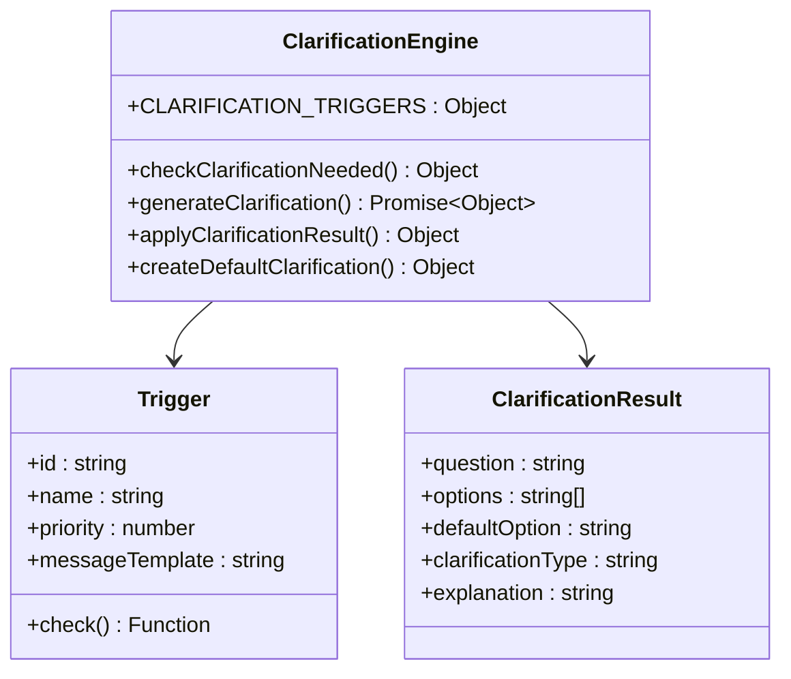
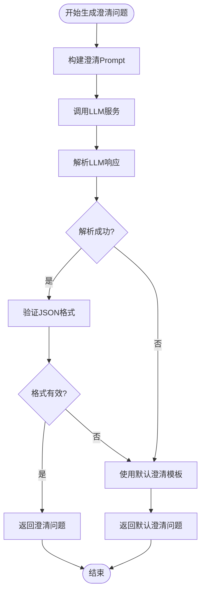
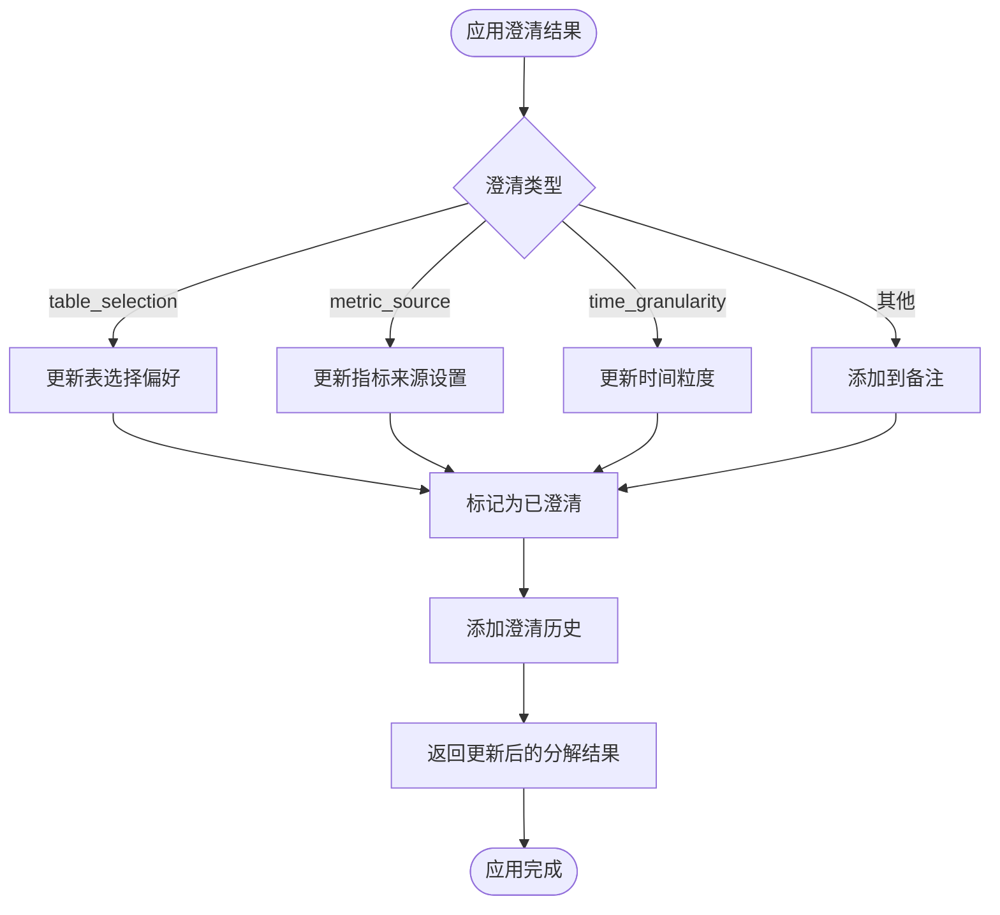
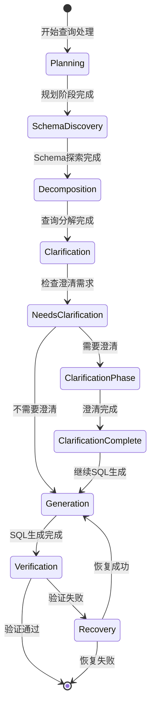
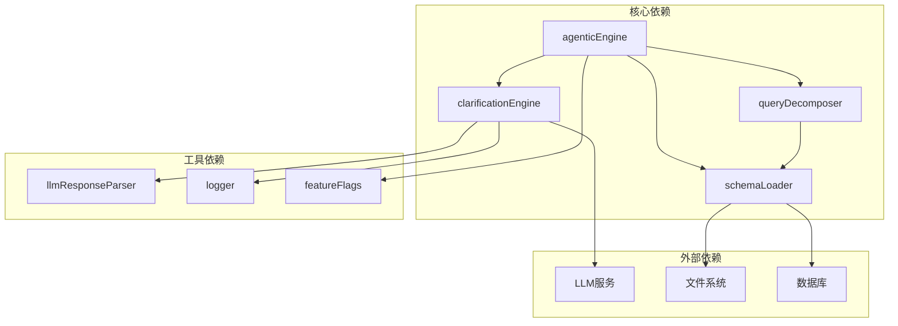

# 澄清机制

<cite>
**本文档引用的文件**
- [clarificationEngine.js](file://backend/src/core/clarificationEngine.js)
- [agenticEngine.js](file://backend/src/core/agenticEngine.js)
- [nl2sqlEngine.js](file://backend/src/core/nl2sqlEngine.js)
- [queryDecomposer.js](file://backend/src/core/queryDecomposer.js)
- [schemaLoader.js](file://backend/src/core/schemaLoader.js)
- [feature-flags.js](file://backend/config/feature-flags.js)
- [llmResponseParser.js](file://backend/src/utils/llmResponseParser.js)
- [logger.js](file://backend/src/utils/logger.js)
- [routes.js](file://backend/src/core/routes.js)
- [app.js](file://backend/src/app.js)
</cite>

## 目录
1. [简介](#简介)
2. [项目结构](#项目结构)
3. [核心组件](#核心组件)
4. [架构概览](#架构概览)
5. [详细组件分析](#详细组件分析)
6. [依赖关系分析](#依赖关系分析)
7. [性能考虑](#性能考虑)
8. [故障排除指南](#故障排除指南)
9. [结论](#结论)

## 简介

澄清机制是NL2SQL系统中的智能交互设计，旨在在查询理解不充分时主动识别并解决歧义、缺失信息和潜在风险。该机制通过四个核心触发条件来检测澄清需求：数据单元无匹配表、表选择歧义、聚合指标来源不明确、时间粒度不明确以及置信度过低。

澄清机制采用"检测-生成-应用"的三步流程，结合LLM服务生成友好的澄清问题，并通过用户反馈来更新查询分解结果。这种智能化的交互设计显著提升了SQL生成的质量和准确性。

## 项目结构

NL2SQL项目的澄清机制主要分布在以下核心模块中：



**图表来源**
- [clarificationEngine.js:1-489](file://backend/src/core/clarificationEngine.js#L1-L489)
- [agenticEngine.js:1-651](file://backend/src/core/agenticEngine.js#L1-L651)
- [feature-flags.js:1-249](file://backend/config/feature-flags.js#L1-L249)

**章节来源**
- [clarificationEngine.js:1-489](file://backend/src/core/clarificationEngine.js#L1-L489)
- [agenticEngine.js:1-651](file://backend/src/core/agenticEngine.js#L1-L651)
- [feature-flags.js:1-249](file://backend/config/feature-flags.js#L1-L249)

## 核心组件

### 澄清触发器配置

澄清机制定义了五种核心触发条件，每种都有特定的检测逻辑和严重程度：

| 触发器ID | 触发条件 | 严重程度 | 优先级 |
|---------|----------|----------|--------|
| uncovered_data_unit | 关键数据单元无匹配表 | HIGH | 1 |
| table_ambiguity | 同类型数据匹配到多个表 | MEDIUM | 2 |
| aggregation_source_uncertain | 聚合指标来源不明确 | LOW | 3 |
| time_granularity_uncertain | 时间粒度不明确 | LOW | 4 |
| low_confidence | 置信度过低 | 根据阈值动态 | 1 |

### 核心功能模块

澄清引擎提供了三个核心功能：
1. **checkClarificationNeeded()** - 检查是否需要澄清
2. **generateClarification()** - 生成澄清问题
3. **applyClarificationResult()** - 应用澄清结果

**章节来源**
- [clarificationEngine.js:26-182](file://backend/src/core/clarificationEngine.js#L26-L182)
- [clarificationEngine.js:196-232](file://backend/src/core/clarificationEngine.js#L196-L232)

## 架构概览

澄清机制在整个NL2SQL系统中扮演着关键的协调角色，位于查询处理流程的第三阶段：



**图表来源**
- [agenticEngine.js:301-336](file://backend/src/core/agenticEngine.js#L301-L336)
- [clarificationEngine.js:246-272](file://backend/src/core/clarificationEngine.js#L246-L272)

**章节来源**
- [agenticEngine.js:52-178](file://backend/src/core/agenticEngine.js#L52-L178)
- [nl2sqlEngine.js:1-800](file://backend/src/core/nl2sqlEngine.js#L1-L800)

## 详细组件分析

### 澄清引擎核心实现

澄清引擎采用模块化设计，每个触发器都是独立的检查函数，具有相同的接口规范：



**图表来源**
- [clarificationEngine.js:26-182](file://backend/src/core/clarificationEngine.js#L26-L182)
- [clarificationEngine.js:477-488](file://backend/src/core/clarificationEngine.js#L477-L488)

#### 触发器检测逻辑

每个触发器都实现了特定的检测算法：

**数据单元无匹配表检测**
```javascript
// 检查分解结果中的数据单元是否都能匹配到表
const uncoveredUnits = decomposition.dataUnits.filter(unit => {
    const hasMatchingTable = tableCandidates.some(t => 
        t.units && t.units.includes(unit.id)
    );
    return !hasMatchingTable;
});
```

**表选择歧义检测**
```javascript
// 按数据类型分组，检查同一类型是否匹配多个表
const typeToTables = new Map();
for (const candidate of tableCandidates) {
    for (const unitId of (candidate.units || [])) {
        const unit = decomposition.dataUnits.find(u => u.id === unitId);
        if (unit) {
            const type = unit.type;
            if (!typeToTables.has(type)) {
                typeToTables.set(type, []);
            }
            typeToTables.get(type).push(candidate.table?.name || candidate.tableName);
        }
    }
}
```

**章节来源**
- [clarificationEngine.js:31-55](file://backend/src/core/clarificationEngine.js#L31-L55)
- [clarificationEngine.js:61-94](file://backend/src/core/clarificationEngine.js#L61-L94)

### 澄清问题生成流程

澄清问题生成采用LLM驱动的方法，通过精心设计的Prompt来确保问题的友好性和针对性：



**图表来源**
- [clarificationEngine.js:277-312](file://backend/src/core/clarificationEngine.js#L277-L312)
- [clarificationEngine.js:317-328](file://backend/src/core/clarificationEngine.js#L317-L328)

**章节来源**
- [clarificationEngine.js:246-272](file://backend/src/core/clarificationEngine.js#L246-L272)
- [llmResponseParser.js:24-59](file://backend/src/utils/llmResponseParser.js#L24-L59)

### 澄清结果应用机制

澄清结果的应用采用类型化处理策略，针对不同类型的问题采取相应的更新策略：



**图表来源**
- [clarificationEngine.js:388-426](file://backend/src/core/clarificationEngine.js#L388-L426)
- [clarificationEngine.js:428-471](file://backend/src/core/clarificationEngine.js#L428-L471)

**章节来源**
- [clarificationEngine.js:388-471](file://backend/src/core/clarificationEngine.js#L388-L471)

### 代理引擎集成

代理引擎将澄清机制无缝集成到四阶段工作流中：



**图表来源**
- [agenticEngine.js:68-178](file://backend/src/core/agenticEngine.js#L68-L178)

**章节来源**
- [agenticEngine.js:298-336](file://backend/src/core/agenticEngine.js#L298-L336)

## 依赖关系分析

澄清机制的依赖关系体现了清晰的分层架构：



**图表来源**
- [clarificationEngine.js:14-16](file://backend/src/core/clarificationEngine.js#L14-L16)
- [agenticEngine.js:20-29](file://backend/src/core/agenticEngine.js#L20-L29)

**章节来源**
- [clarificationEngine.js:1-489](file://backend/src/core/clarificationEngine.js#L1-L489)
- [agenticEngine.js:1-651](file://backend/src/core/agenticEngine.js#L1-L651)

## 性能考虑

澄清机制在设计时充分考虑了性能优化：

### 缓存策略
- **触发器结果缓存**：避免重复计算相同的触发条件
- **LLM调用优化**：通过Prompt模板减少重复内容
- **日志级别控制**：通过配置控制日志输出量

### 内存管理
- **触发器优先级排序**：只处理最高优先级的触发条件
- **JSON响应解析**：使用高效的解析策略
- **错误处理降级**：解析失败时使用默认模板

### 并发处理
- **异步LLM调用**：避免阻塞主线程
- **Promise链式调用**：确保异步操作的正确顺序
- **超时控制**：防止LLM调用长时间阻塞

## 故障排除指南

### 常见问题及解决方案

**澄清问题生成失败**
- 检查LLM服务连接状态
- 验证Prompt构建逻辑
- 查看日志中的错误信息

**触发器检测不准确**
- 检查数据单元与表候选的匹配逻辑
- 验证优先级排序算法
- 确认严重程度判断标准

**澄清结果应用错误**
- 检查澄清类型识别
- 验证数据更新逻辑
- 确认历史记录添加

**章节来源**
- [clarificationEngine.js:266-271](file://backend/src/core/clarificationEngine.js#L266-L271)
- [logger.js:312-322](file://backend/src/utils/logger.js#L312-L322)

## 结论

NL2SQL系统的澄清机制通过智能化的触发检测、友好的问题生成和精确的结果应用，显著提升了自然语言查询到SQL转换的准确性和用户体验。该机制的设计体现了以下特点：

1. **多层次检测**：从数据匹配到语义理解的全方位检测
2. **智能优先级**：根据严重程度和影响范围合理安排澄清顺序
3. **友好交互**：通过LLM生成易于理解的澄清问题
4. **精确应用**：针对不同类型的问题采取相应的更新策略
5. **可扩展性**：模块化设计支持新触发器的添加和现有触发器的优化

澄清机制的成功实施为NL2SQL系统提供了强大的纠错能力和智能化交互体验，是实现高质量SQL生成的重要保障。