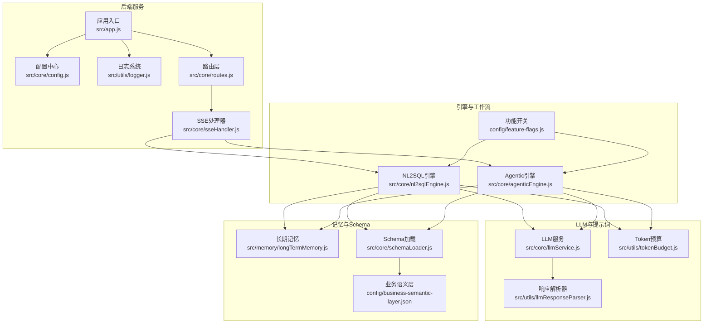
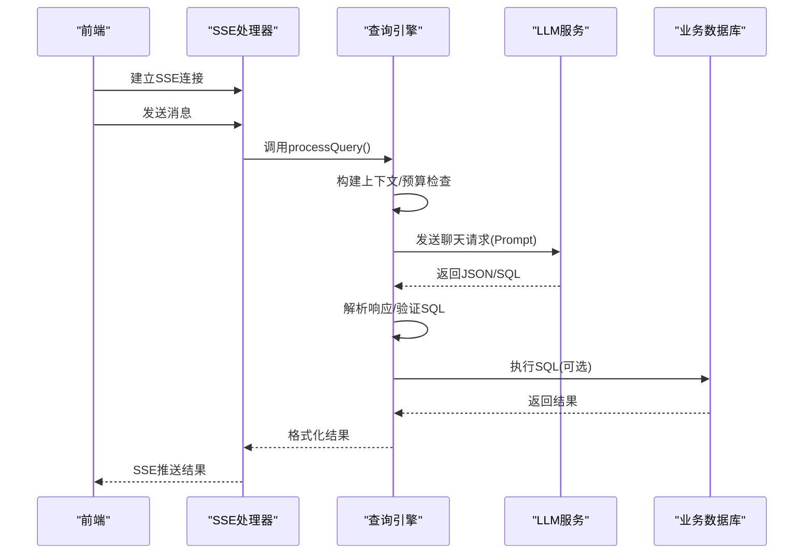
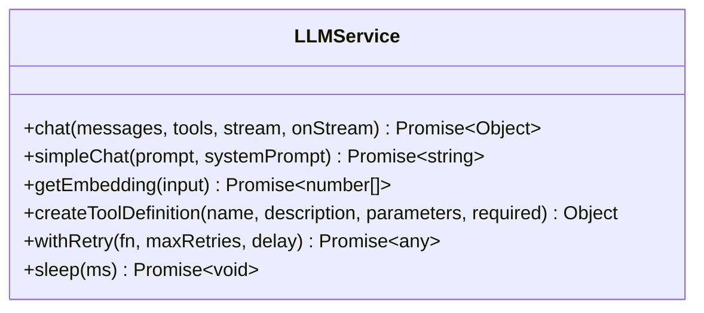
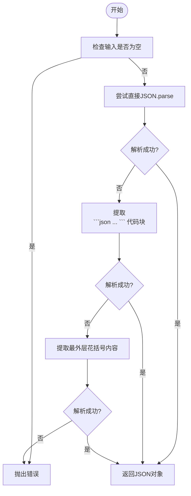
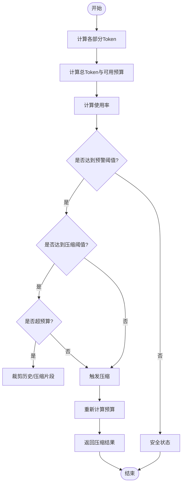
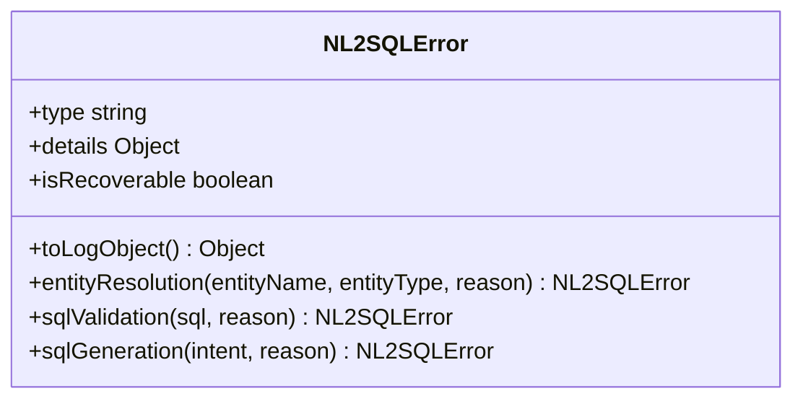
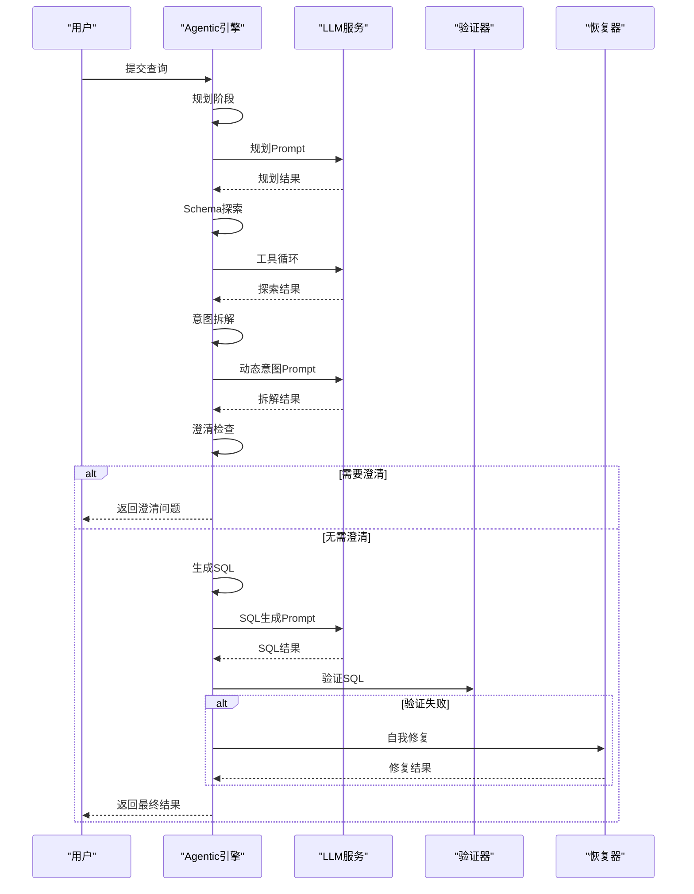
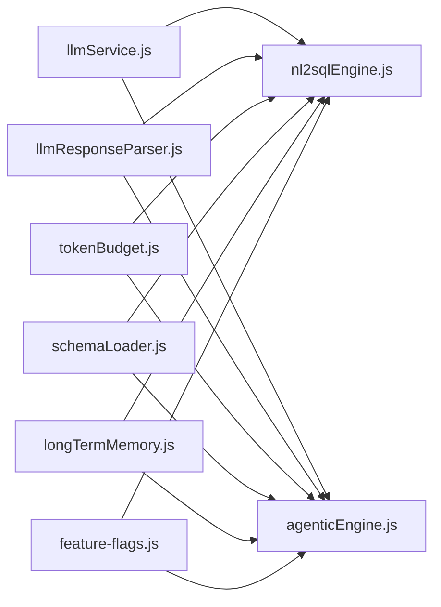

# LLM大语言模型服务

<cite>
**本文档引用的文件**
- [backend/src/core/llmService.js](file://backend/src/core/llmService.js)
- [backend/src/utils/llmResponseParser.js](file://backend/src/utils/llmResponseParser.js)
- [backend/src/utils/tokenBudget.js](file://backend/src/utils/tokenBudget.js)
- [backend/src/core/nl2sqlEngine.js](file://backend/src/core/nl2sqlEngine.js)
- [backend/src/core/agenticEngine.js](file://backend/src/core/agenticEngine.js)
- [backend/src/core/config.js](file://backend/src/core/config.js)
- [backend/src/utils/logger.js](file://backend/src/utils/logger.js)
- [backend/src/memory/longTermMemory.js](file://backend/src/memory/longTermMemory.js)
- [backend/src/core/schemaLoader.js](file://backend/src/core/schemaLoader.js)
- [backend/package.json](file://backend/package.json)
- [backend/config/feature-flags.js](file://backend/config/feature-flags.js)
- [backend/config/business-semantic-layer.json](file://backend/config/business-semantic-layer.json)
- [backend/src/app.js](file://backend/src/app.js)
- [CLAUDE.md](file://CLAUDE.md)
- [docs/后端架构审查与优化方案.md](file://docs/后端架构审查与优化方案.md)
</cite>

## 目录
1. [简介](#简介)
2. [项目结构](#项目结构)
3. [核心组件](#核心组件)
4. [架构总览](#架构总览)
5. [详细组件分析](#详细组件分析)
6. [依赖关系分析](#依赖关系分析)
7. [性能考量](#性能考量)
8. [故障排查指南](#故障排查指南)
9. [结论](#结论)
10. [附录](#附录)

## 简介
本项目是一个基于大语言模型（LLM）的自然语言到SQL（NL2SQL）服务，后端采用Node.js + Express，提供从自然语言查询到结构化SQL执行与结果格式化的完整链路。系统围绕LLM服务封装、提示词工程、Token预算管理、响应解析器、功能开关控制与多阶段Agentic工作流展开，旨在帮助非技术人员通过自然语言查询业务数据库。

## 项目结构
后端采用模块化分层组织，核心模块包括：
- LLM服务封装：统一HTTP客户端、重试机制、流式响应支持
- 提示词工程：结构化Prompt构建、工具调用、上下文压缩
- Token预算管理：上下文估算、阈值控制、自动压缩
- 响应解析器：统一JSON/SQL提取策略
- 引擎与工作流：传统NL2SQL引擎与四阶段Agentic引擎
- 配置与日志：集中配置、结构化日志、功能开关
- 记忆系统：短期/长期记忆、向量检索、偏好学习
- Schema管理：元数据加载、向量化、智能检索

**图表来源**
- [backend/src/app.js:97-194](file://backend/src/app.js#L97-L194)
- [backend/src/core/llmService.js:1-477](file://backend/src/core/llmService.js#L1-L477)
- [backend/src/utils/llmResponseParser.js:1-146](file://backend/src/utils/llmResponseParser.js#L1-L146)
- [backend/src/utils/tokenBudget.js:1-435](file://backend/src/utils/tokenBudget.js#L1-L435)
- [backend/src/core/nl2sqlEngine.js:1-800](file://backend/src/core/nl2sqlEngine.js#L1-L800)
- [backend/src/core/agenticEngine.js:1-651](file://backend/src/core/agenticEngine.js#L1-L651)
- [backend/src/core/schemaLoader.js:1-800](file://backend/src/core/schemaLoader.js#L1-L800)
- [backend/config/feature-flags.js:1-249](file://backend/config/feature-flags.js#L1-L249)
- [backend/config/business-semantic-layer.json:1-189](file://backend/config/business-semantic-layer.json#L1-L189)

**章节来源**
- [CLAUDE.md:41-58](file://CLAUDE.md#L41-L58)
- [backend/src/app.js:97-194](file://backend/src/app.js#L97-L194)

## 核心组件
- LLM服务封装：提供HTTP POST封装、重试机制、流式响应、日志记录与错误处理，统一接入任意兼容OpenAI API格式的LLM服务。
- 提示词工程：通过结构化Prompt、工具定义、上下文构建与输出格式化，确保LLM生成稳定的JSON/SQL。
- Token预算管理：估算上下文Token、阈值预警、自动压缩与裁剪，防止上下文溢出。
- 响应解析器：统一从LLM响应中提取JSON与SQL，支持多种策略与错误处理。
- 引擎与工作流：传统NL2SQL引擎与Agentic引擎，支持澄清、验证、自我修复与多阶段推理。
- 配置与日志：集中配置、结构化日志、功能开关，便于运维与灰度发布。
- 记忆系统：长期记忆提炼、字段别名学习、向量检索与摘要压缩。
- Schema管理：元数据加载、向量化、智能检索与业务语义映射。

**章节来源**
- [backend/src/core/llmService.js:1-477](file://backend/src/core/llmService.js#L1-L477)
- [backend/src/utils/llmResponseParser.js:1-146](file://backend/src/utils/llmResponseParser.js#L1-L146)
- [backend/src/utils/tokenBudget.js:1-435](file://backend/src/utils/tokenBudget.js#L1-L435)
- [backend/src/core/nl2sqlEngine.js:1-800](file://backend/src/core/nl2sqlEngine.js#L1-L800)
- [backend/src/core/agenticEngine.js:1-651](file://backend/src/core/agenticEngine.js#L1-L651)
- [backend/src/core/config.js:1-398](file://backend/src/core/config.js#L1-L398)
- [backend/src/utils/logger.js:1-482](file://backend/src/utils/logger.js#L1-L482)
- [backend/src/memory/longTermMemory.js:1-800](file://backend/src/memory/longTermMemory.js#L1-L800)
- [backend/src/core/schemaLoader.js:1-800](file://backend/src/core/schemaLoader.js#L1-L800)

## 架构总览
系统采用“SSE长连接 + 引擎编排”的交互模式，前端通过SSE建立连接，后端根据功能开关选择传统NL2SQL引擎或Agentic引擎执行查询，全程记录日志并进行Token预算控制与响应解析。

**图表来源**
- [CLAUDE.md:133-139](file://CLAUDE.md#L133-L139)
- [backend/src/core/agenticEngine.js:68-178](file://backend/src/core/agenticEngine.js#L68-L178)
- [backend/src/core/nl2sqlEngine.js:1-800](file://backend/src/core/nl2sqlEngine.js#L1-L800)

## 详细组件分析

### LLM服务模块
- HTTP封装：支持HTTPS/HTTP、超时控制、流式响应、错误处理与JSON解析。
- 重试机制：带指数退避的自动重试，支持最大重试次数与延迟。
- 聊天接口：支持普通与流式响应，自动注入模型、温度、最大生成Token等参数。
- Embedding接口：支持批量输入与维度指定，统一错误处理。
- 工具定义：辅助构造LLM可调用的工具定义对象。

**图表来源**
- [backend/src/core/llmService.js:41-477](file://backend/src/core/llmService.js#L41-L477)

**章节来源**
- [backend/src/core/llmService.js:1-477](file://backend/src/core/llmService.js#L1-L477)

### 响应解析器
- 统一JSON解析：支持直接解析、代码块提取、花括号非贪婪匹配三种策略。
- SQL提取：优先从JSON提取，其次代码块，最后正则匹配SELECT语句。
- 错误处理：提供上下文信息与预览，便于定位解析失败原因。

**图表来源**
- [backend/src/utils/llmResponseParser.js:24-143](file://backend/src/utils/llmResponseParser.js#L24-L143)

**章节来源**
- [backend/src/utils/llmResponseParser.js:1-146](file://backend/src/utils/llmResponseParser.js#L1-L146)

### Token预算管理
- 估算策略：基于字符数的经验比率估算Token，支持批量与对象估算。
- 预算计算：分解系统提示、历史、检索片段，计算可用预算与使用率。
- 压缩策略：裁剪历史对话、压缩检索片段、阈值预警与自动触发压缩。
- 快捷检查：提供安全检查与状态摘要。

**图表来源**
- [backend/src/utils/tokenBudget.js:115-372](file://backend/src/utils/tokenBudget.js#L115-L372)

**章节来源**
- [backend/src/utils/tokenBudget.js:1-435](file://backend/src/utils/tokenBudget.js#L1-L435)

### NL2SQL引擎
- 意图识别：提取实体、平台、维度、指标、时间范围，支持澄清与确认。
- 实体解析：结合长期记忆与数据库模糊匹配，处理歧义与别名学习。
- SQL生成：基于Schema与上下文构建Prompt，调用LLM生成SQL并验证。
- 执行与格式化：可选执行SQL并格式化结果，支持Dry Run模式。
- 错误处理：统一错误类型与日志对象，便于追踪与恢复。

**图表来源**
- [backend/src/core/nl2sqlEngine.js:227-297](file://backend/src/core/nl2sqlEngine.js#L227-L297)

**章节来源**
- [backend/src/core/nl2sqlEngine.js:1-800](file://backend/src/core/nl2sqlEngine.js#L1-L800)

### Agentic引擎
- 四阶段工作流：规划、Schema探索、意图拆解、生成验证与恢复。
- 工具循环：支持多轮工具调用，增强Schema探索能力。
- 自我修复：针对SQL执行失败进行分类与修复，支持表不存在与语法错误。
- 进度回调：支持阶段进度通知，便于前端SSE展示。

**图表来源**
- [backend/src/core/agenticEngine.js:68-178](file://backend/src/core/agenticEngine.js#L68-L178)

**章节来源**
- [backend/src/core/agenticEngine.js:1-651](file://backend/src/core/agenticEngine.js#L1-L651)

### 配置与日志
- 配置中心：集中管理LLM API、Embedding、数据库、安全、会话、日志、自修复、Schema、上下文管理等配置。
- 日志系统：结构化日志、文件轮转、级别控制、追踪上下文（Trace）。
- 功能开关：Phase 1-4的功能开关，支持渐进式启用与快速回滚。

**章节来源**
- [backend/src/core/config.js:1-398](file://backend/src/core/config.js#L1-L398)
- [backend/src/utils/logger.js:1-482](file://backend/src/utils/logger.js#L1-L482)
- [backend/config/feature-flags.js:1-249](file://backend/config/feature-flags.js#L1-L249)

### 记忆系统与Schema
- 长期记忆：基于LLM与逻辑判断提炼用户偏好，存储字段别名、查询模式、指标/维度偏好。
- Schema管理：加载元数据、向量化、智能检索、业务语义映射与平台/游戏识别。
- 向量存储：LanceDB封装，支持Schema与查询历史向量的增删改查与智能搜索。

**章节来源**
- [backend/src/memory/longTermMemory.js:1-800](file://backend/src/memory/longTermMemory.js#L1-L800)
- [backend/src/core/schemaLoader.js:1-800](file://backend/src/core/schemaLoader.js#L1-L800)
- [backend/config/business-semantic-layer.json:1-189](file://backend/config/business-semantic-layer.json#L1-L189)

## 依赖关系分析
- 模块耦合：LLM服务被NL2SQL与Agentic引擎共同依赖；响应解析器被多处调用，建议统一引用。
- 外部依赖：Express、CORS、Body Parser、SQLite3、LanceDB、dotenv、node-cron等。
- 功能开关：通过feature-flags控制Phase 1-4功能，避免全局侵入式改动。

**图表来源**
- [backend/src/core/llmService.js:1-477](file://backend/src/core/llmService.js#L1-L477)
- [backend/src/utils/llmResponseParser.js:1-146](file://backend/src/utils/llmResponseParser.js#L1-L146)
- [backend/src/utils/tokenBudget.js:1-435](file://backend/src/utils/tokenBudget.js#L1-L435)
- [backend/src/core/nl2sqlEngine.js:1-800](file://backend/src/core/nl2sqlEngine.js#L1-L800)
- [backend/src/core/agenticEngine.js:1-651](file://backend/src/core/agenticEngine.js#L1-L651)
- [backend/src/core/schemaLoader.js:1-800](file://backend/src/core/schemaLoader.js#L1-L800)
- [backend/src/memory/longTermMemory.js:1-800](file://backend/src/memory/longTermMemory.js#L1-L800)
- [backend/config/feature-flags.js:1-249](file://backend/config/feature-flags.js#L1-L249)

**章节来源**
- [backend/package.json:10-27](file://backend/package.json#L10-L27)

## 性能考量
- Token预算：通过估算与阈值控制，避免上下文溢出；建议结合中文字符特性优化估算比率。
- LLM调用：合理设置温度、最大生成Token与重试策略；对频繁调用进行限流与缓存。
- 向量检索：优化表征文本与关键词，提升检索精度；按域加权排序，减少无关表干扰。
- 数据库执行：白名单与语法检查，限制高风险操作；设置查询超时与行数限制。
- 日志与追踪：结构化日志与Trace上下文，便于性能分析与问题定位。

[本节为通用指导，无需特定文件引用]

## 故障排查指南
- LLM调用失败：检查API密钥、基础URL、超时与重试配置；查看日志中的错误码与响应详情。
- 响应解析失败：确认LLM输出格式，检查是否包含代码块或非标准JSON；参考解析器策略进行修复。
- 上下文溢出：启用Token预算检查，触发压缩与裁剪；优化Prompt长度与历史保留策略。
- SQL执行失败：检查白名单与禁止关键字；验证表存在性与字段合法性；启用自我修复机制。
- 记忆与检索异常：检查向量索引是否重建；核对Schema元数据质量与描述完整性。

**章节来源**
- [backend/src/utils/logger.js:312-322](file://backend/src/utils/logger.js#L312-L322)
- [backend/src/utils/llmResponseParser.js:24-59](file://backend/src/utils/llmResponseParser.js#L24-L59)
- [backend/src/utils/tokenBudget.js:183-214](file://backend/src/utils/tokenBudget.js#L183-L214)

## 结论
本项目通过模块化的LLM服务封装、完善的提示词工程、严格的Token预算管理与统一的响应解析器，构建了稳定高效的NL2SQL服务。配合Agentic工作流与记忆系统，能够处理复杂查询并持续优化用户体验。建议在生产环境中启用功能开关、严格配置校验与日志追踪，并持续优化Schema元数据与向量表征质量。

[本节为总结性内容，无需特定文件引用]

## 附录

### 配置示例与最佳实践
- 环境变量：LLM_API_BASE、LLM_API_KEY、LLM_MODEL、EMBEDDING_MODEL、SR_DATABASE_URL等。
- 功能开关：FF_AGENTIC_ENGINE、FF_AUTO_RECOVERY、FF_TOOL_LOOP_MODE等，按Phase启用。
- 日志级别：开发环境建议DEBUG/TRACE，生产环境INFO/WARN。
- Token预算：根据模型上下文窗口调整阈值与压缩策略，中文场景建议提高估算比率。

**章节来源**
- [CLAUDE.md:27-40](file://CLAUDE.md#L27-L40)
- [backend/src/core/config.js:55-87](file://backend/src/core/config.js#L55-L87)
- [backend/config/feature-flags.js:16-96](file://backend/config/feature-flags.js#L16-L96)
- [backend/src/utils/logger.js:29-44](file://backend/src/utils/logger.js#L29-L44)

### API端点概览
- 健康检查：GET /api/health
- Schema：GET /api/schema
- SSE流：GET /api/sse/stream?session_id=xxx
- 发送消息：POST /api/sse/message
- 会话管理：GET/POST /api/sessions
- 历史与记忆：GET /api/history, GET/DELETE /api/memory
- 评估统计：GET /api/evaluation

**章节来源**
- [CLAUDE.md:141-153](file://CLAUDE.md#L141-L153)