# LLM模型集成架构

<cite>
**本文档引用的文件**
- [llmService.js](file://backend/src/core/llmService.js)
- [config.js](file://backend/src/core/config.js)
- [app.js](file://backend/src/app.js)
- [routes.js](file://backend/src/core/routes.js)
- [logger.js](file://backend/src/utils/logger.js)
- [llmResponseParser.js](file://backend/src/utils/llmResponseParser.js)
- [schema-metadata.json](file://backend/config/schema-metadata.json)
- [feature-flags.js](file://backend/config/feature-flags.js)
- [package.json](file://backend/package.json)
</cite>

## 目录
1. [简介](#简介)
2. [项目结构](#项目结构)
3. [核心组件](#核心组件)
4. [架构概览](#架构概览)
5. [详细组件分析](#详细组件分析)
6. [依赖关系分析](#依赖关系分析)
7. [性能考虑](#性能考虑)
8. [故障排查指南](#故障排查指南)
9. [结论](#结论)
10. [附录](#附录)

## 简介
本项目是一个基于自然语言到SQL转换的智能查询服务，集成了LLM（大语言模型）能力来实现复杂的查询意图理解和SQL生成。LLM模型集成架构采用模块化设计，通过统一的LLM服务层封装底层API通信，提供聊天对话、Embedding向量生成、工具调用等功能，支持多种LLM提供商（如OpenAI、DeepSeek、Azure OpenAI等）。

## 项目结构
项目采用前后端分离的架构，后端使用Node.js + Express框架，核心业务逻辑集中在`backend/src/core`目录下，LLM集成主要位于`llmService.js`文件中。

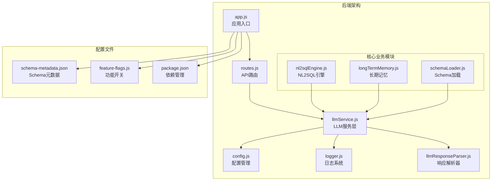

**图表来源**
- [app.js:1-266](file://backend/src/app.js#L1-L266)
- [routes.js:1-1037](file://backend/src/core/routes.js#L1-L1037)
- [llmService.js:1-477](file://backend/src/core/llmService.js#L1-L477)

**章节来源**
- [app.js:1-266](file://backend/src/app.js#L1-L266)
- [package.json:1-28](file://backend/package.json#L1-L28)

## 核心组件
LLM模型集成架构由以下几个核心组件构成：

### 1. LLM服务层（llmService.js）
负责与LLM API的底层通信，提供统一的接口封装：
- HTTP请求封装：支持JSON数据传输和流式响应
- 重试机制：自动处理网络异常和临时故障
- 错误处理：完善的错误捕获和日志记录
- 配置管理：从环境变量读取LLM相关配置

### 2. 配置管理系统（config.js）
集中管理所有配置项，支持环境变量覆盖：
- LLM API配置：基础URL、API密钥、模型名称、超时设置
- Embedding配置：模型名称、向量维度、超时设置
- 安全配置：数据库连接、白名单、权限控制
- 日志配置：日志级别、输出目标、轮转策略

### 3. 日志系统（logger.js）
提供统一的日志记录功能：
- 多级别日志：trace、debug、info、warn、error
- 结构化日志格式：支持JSON序列化
- 文件轮转：自动管理日志文件大小和数量
- 追踪功能：支持请求级别的日志关联

### 4. 响应解析器（llmResponseParser.js）
标准化LLM响应处理：
- JSON解析：支持直接JSON、代码块、花括号提取
- SQL提取：从响应中提取SQL语句
- 错误处理：详细的解析失败信息

**章节来源**
- [llmService.js:1-477](file://backend/src/core/llmService.js#L1-L477)
- [config.js:1-398](file://backend/src/core/config.js#L1-L398)
- [logger.js:1-482](file://backend/src/utils/logger.js#L1-L482)
- [llmResponseParser.js:1-146](file://backend/src/utils/llmResponseParser.js#L1-L146)

## 架构概览
LLM模型集成架构采用分层设计，确保模块间的松耦合和高内聚。

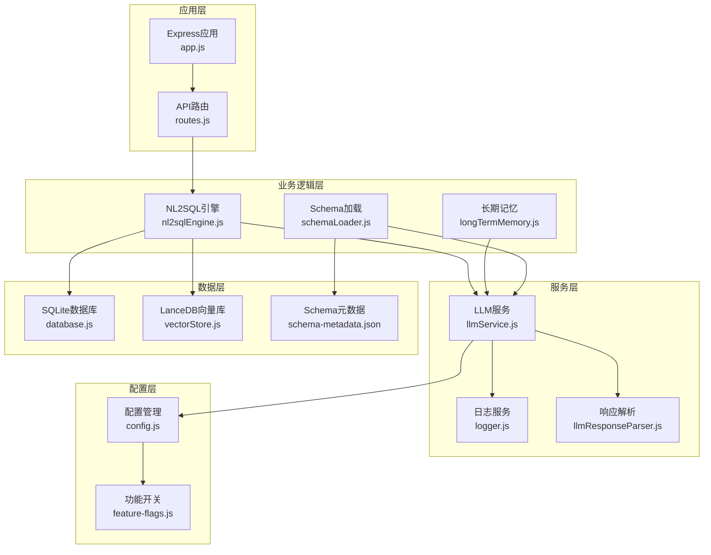

**图表来源**
- [app.js:1-266](file://backend/src/app.js#L1-L266)
- [routes.js:1-1037](file://backend/src/core/routes.js#L1-L1037)
- [llmService.js:1-477](file://backend/src/core/llmService.js#L1-L477)
- [config.js:1-398](file://backend/src/core/config.js#L1-L398)

## 详细组件分析

### LLM服务模块（llmService.js）
LLM服务模块是整个架构的核心，负责与外部LLM API的通信。

#### HTTP请求封装
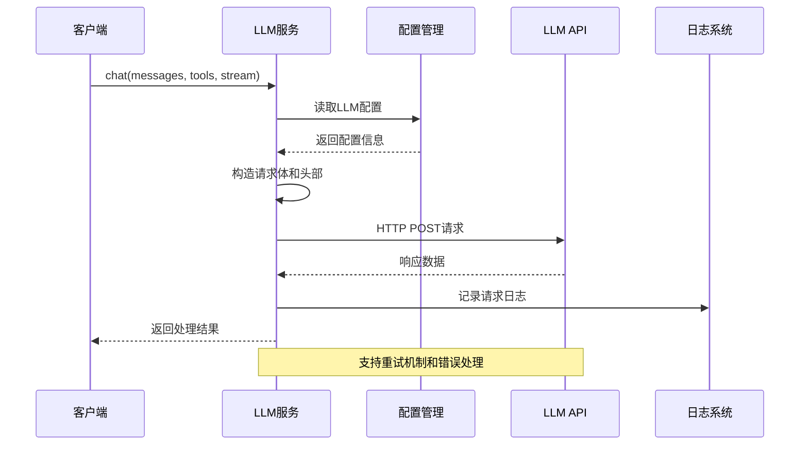

**图表来源**
- [llmService.js:30-152](file://backend/src/core/llmService.js#L30-L152)
- [llmService.js:222-308](file://backend/src/core/llmService.js#L222-L308)

#### 重试机制设计
服务实现了智能重试机制，能够自动处理网络异常和临时故障：

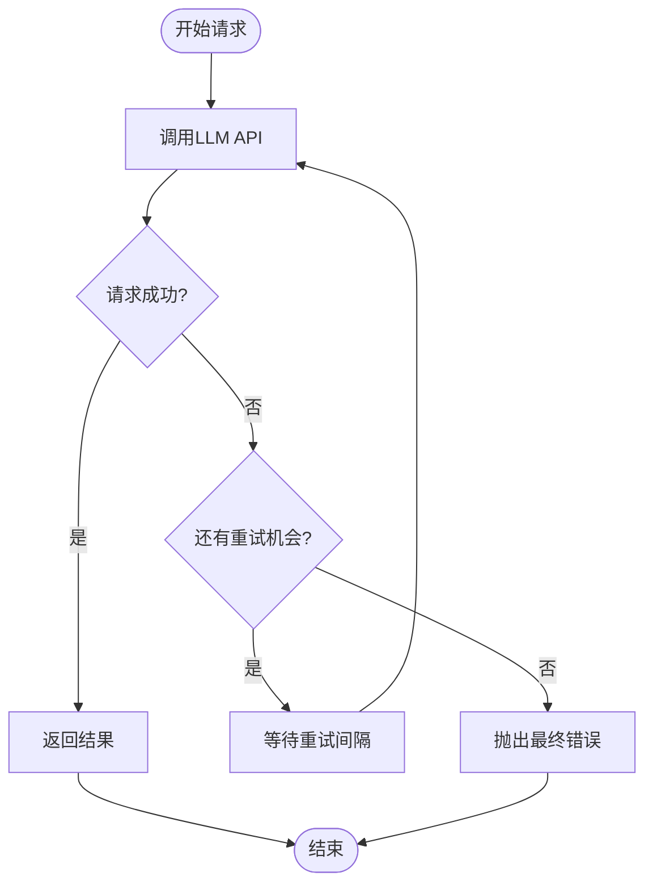

**图表来源**
- [llmService.js:158-195](file://backend/src/core/llmService.js#L158-L195)

#### Embedding向量生成
Embedding功能支持将文本转换为向量，用于语义检索和相似度计算：

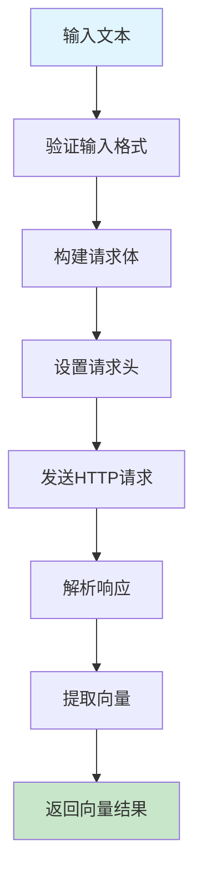

**图表来源**
- [llmService.js:369-424](file://backend/src/core/llmService.js#L369-L424)

**章节来源**
- [llmService.js:1-477](file://backend/src/core/llmService.js#L1-L477)

### 配置管理系统（config.js）
配置管理系统采用集中式管理模式，支持环境变量覆盖和默认值设置。

#### 配置层次结构
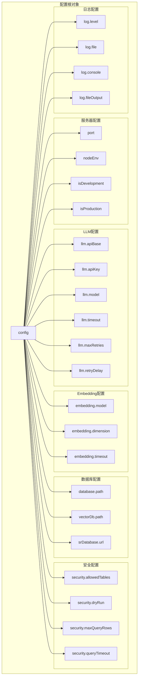

**图表来源**
- [config.js:16-355](file://backend/src/core/config.js#L16-L355)

#### 配置验证机制
配置系统包含完整的验证机制，确保应用启动时的配置完整性：

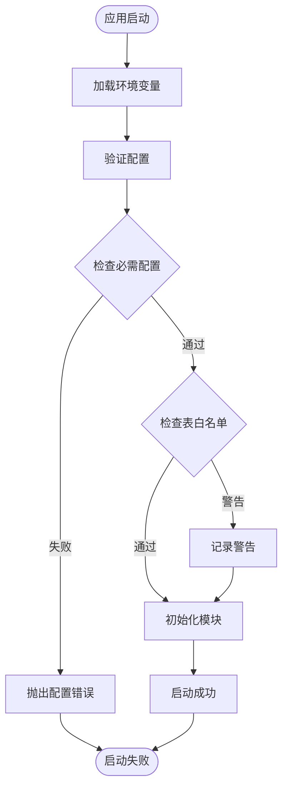

**图表来源**
- [config.js:366-388](file://backend/src/core/config.js#L366-L388)

**章节来源**
- [config.js:1-398](file://backend/src/core/config.js#L1-L398)

### 日志系统（logger.js）
日志系统提供统一的日志记录功能，支持多种输出目标和格式化选项。

#### 日志级别体系
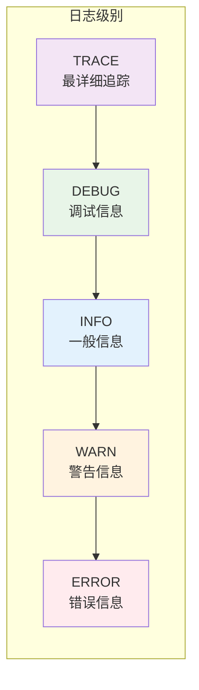

#### 日志文件轮转机制
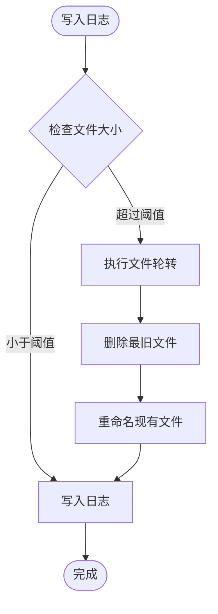

**图表来源**
- [logger.js:147-179](file://backend/src/utils/logger.js#L147-L179)

**章节来源**
- [logger.js:1-482](file://backend/src/utils/logger.js#L1-L482)

### 响应解析器（llmResponseParser.js）
响应解析器提供标准化的LLM响应处理，支持多种解析策略。

#### JSON解析策略
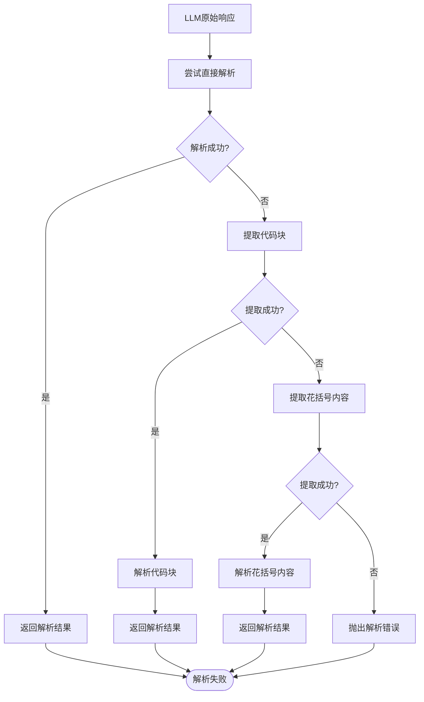

**图表来源**
- [llmResponseParser.js:24-59](file://backend/src/utils/llmResponseParser.js#L24-L59)

**章节来源**
- [llmResponseParser.js:1-146](file://backend/src/utils/llmResponseParser.js#L1-L146)

## 依赖关系分析

### 外部依赖关系
项目使用npm包管理器管理依赖，主要依赖包括：

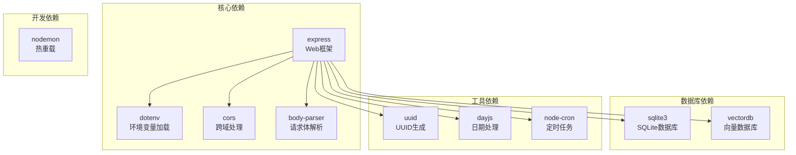

**图表来源**
- [package.json:10-27](file://backend/package.json#L10-L27)

### 内部模块依赖
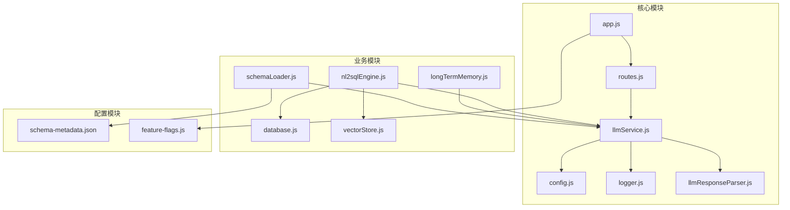

**图表来源**
- [app.js:39-50](file://backend/src/app.js#L39-L50)
- [routes.js:16-36](file://backend/src/core/routes.js#L16-L36)

**章节来源**
- [package.json:1-28](file://backend/package.json#L1-L28)

## 性能考虑
LLM模型集成架构在设计时充分考虑了性能优化：

### 1. 连接池管理
- SQLite数据库使用连接池配置，支持并发连接
- LanceDB向量数据库优化查询性能
- 数据库连接超时和空闲超时设置

### 2. 缓存策略
- Schema元数据缓存机制
- 长期记忆分级存储策略
- Token预算管理和对话摘要

### 3. 超时控制
- LLM API请求超时设置（默认60秒）
- Embedding请求超时设置（默认60秒）
- 数据库查询超时控制

### 4. 错误处理
- 自动重试机制（最多3次）
- 超时检测和处理
- 响应解析失败的降级处理

## 故障排查指南

### 常见配置问题
1. **LLM API密钥错误**
   - 检查环境变量`LLM_API_KEY`设置
   - 验证API密钥的有效性
   - 确认API密钥具有相应权限

2. **API基础URL配置错误**
   - 确认`LLM_API_BASE`以`/v1`结尾
   - 验证API服务的可用性
   - 检查网络连接和防火墙设置

3. **模型名称配置错误**
   - 确认`LLM_MODEL`在API服务中有效
   - 检查模型的可用性和配额
   - 验证模型参数设置

### 日志分析
使用日志系统进行问题诊断：
- 查看`app.log`文件中的错误信息
- 检查LLM API调用日志
- 分析响应解析错误

### 性能监控
- 监控LLM API响应时间
- 检查Embedding向量生成性能
- 分析数据库查询性能

**章节来源**
- [config.js:366-388](file://backend/src/core/config.js#L366-L388)
- [logger.js:312-322](file://backend/src/utils/logger.js#L312-L322)

## 结论
LLM模型集成架构通过模块化设计实现了高度的可扩展性和可维护性。核心优势包括：

1. **统一的LLM服务抽象**：通过llmService.js提供一致的API接口
2. **灵活的配置管理**：支持环境变量覆盖和动态配置
3. **完善的错误处理**：自动重试和降级机制
4. **强大的日志系统**：支持多级别日志和追踪功能
5. **标准化的响应解析**：统一处理各种LLM响应格式

该架构支持多种LLM提供商，包括OpenAI、DeepSeek、Azure OpenAI等，为开发者提供了灵活的集成选择。通过合理的配置和最佳实践，可以实现高性能、高可靠性的LLM集成解决方案。

## 附录

### 配置环境变量参考
- `LLM_API_BASE`: LLM API基础URL（默认：https://api.openai.com/v1）
- `LLM_API_KEY`: LLM API密钥
- `LLM_MODEL`: 默认使用的模型名称（默认：gpt-4）
- `EMBEDDING_MODEL`: Embedding模型名称（默认：text-embedding-3-small）
- `NODE_ENV`: 运行环境（development/production）

### API端点配置
- `/api/health`: 健康检查接口
- `/api/schema`: Schema查询接口
- `/api/sessions`: 会话管理接口
- `/api/queries/history`: 查询历史接口

### 最佳实践建议
1. **配置管理**：使用环境变量管理敏感信息
2. **错误处理**：实现适当的重试和降级策略
3. **日志记录**：启用详细的日志记录以便调试
4. **性能监控**：监控API响应时间和错误率
5. **安全考虑**：实施适当的访问控制和数据保护