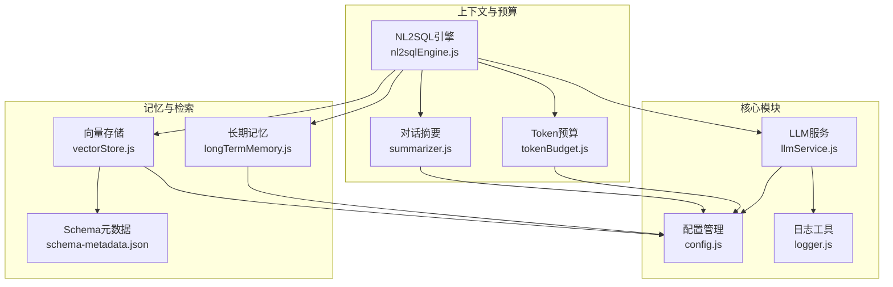
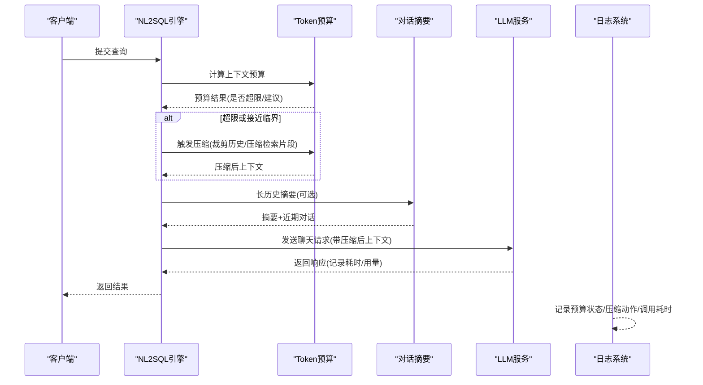
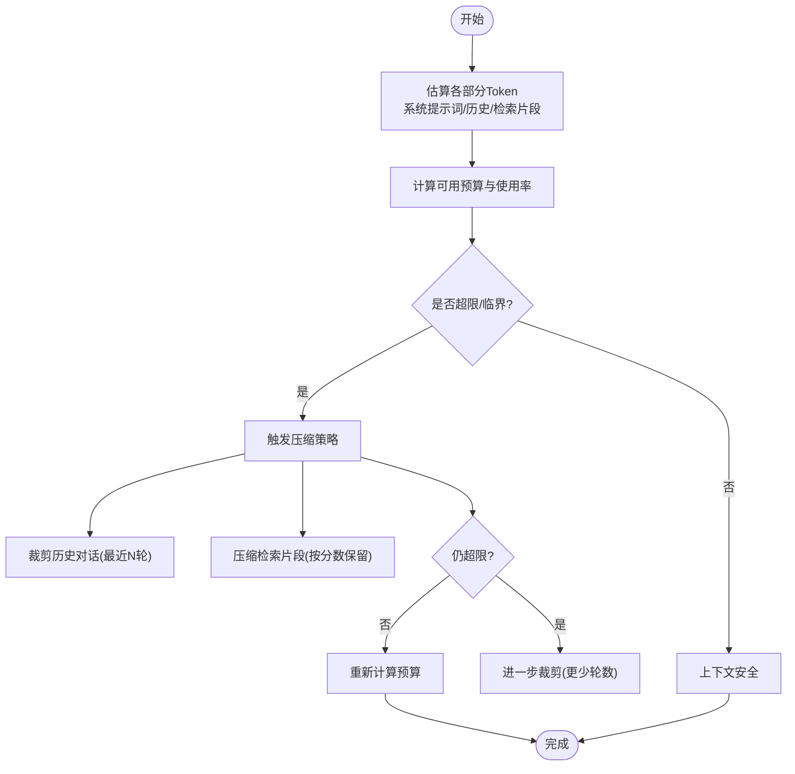
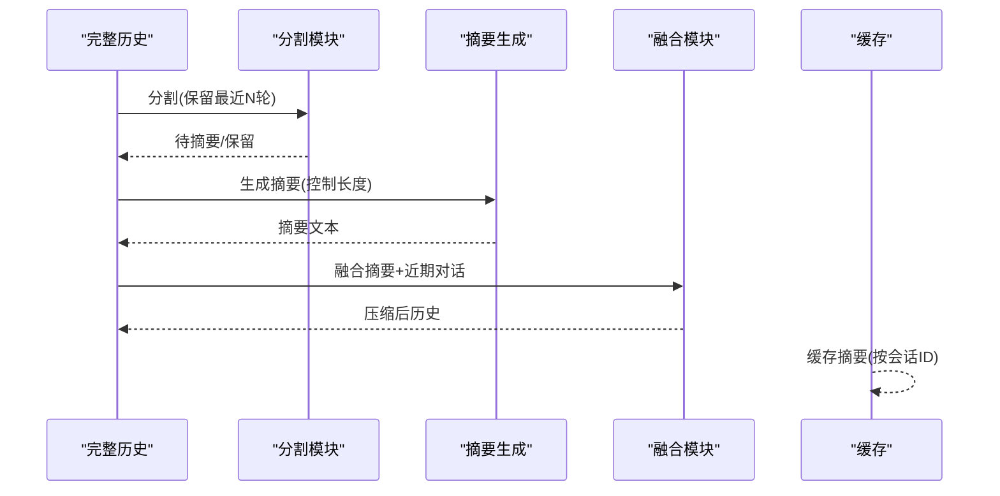
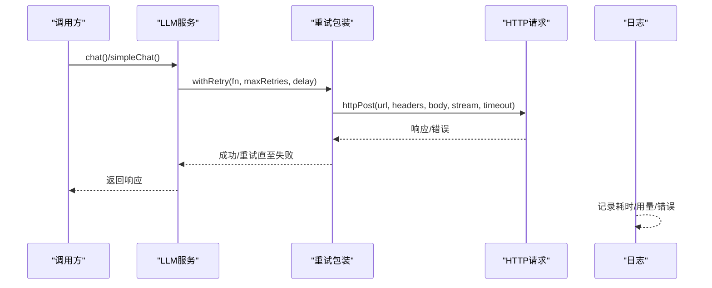
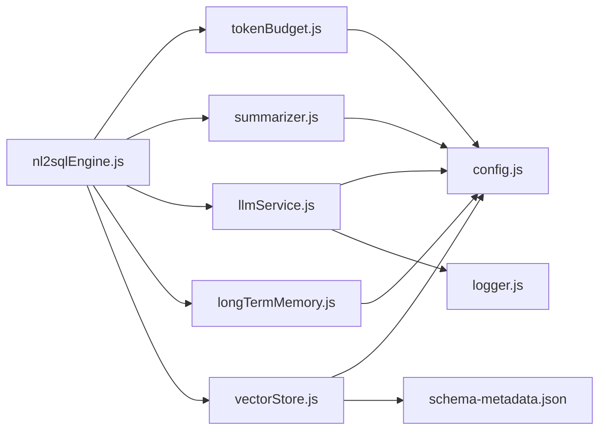

# Token预算与成本控制

<cite>
**本文档引用的文件**
- [tokenBudget.js](file://backend/src/utils/tokenBudget.js)
- [llmService.js](file://backend/src/core/llmService.js)
- [nl2sqlEngine.js](file://backend/src/core/nl2sqlEngine.js)
- [config.js](file://backend/src/core/config.js)
- [logger.js](file://backend/src/utils/logger.js)
- [summarizer.js](file://backend/src/memory/summarizer.js)
- [longTermMemory.js](file://backend/src/memory/longTermMemory.js)
- [vectorStore.js](file://backend/src/memory/vectorStore.js)
- [schema-metadata.json](file://backend/config/schema-metadata.json)
- [package.json](file://backend/package.json)
</cite>

## 目录
1. [简介](#简介)
2. [项目结构](#项目结构)
3. [核心组件](#核心组件)
4. [架构概览](#架构概览)
5. [详细组件分析](#详细组件分析)
6. [依赖关系分析](#依赖关系分析)
7. [性能考量](#性能考量)
8. [故障排查指南](#故障排查指南)
9. [结论](#结论)

## 简介
本文件面向NL2SQL系统的Token预算与成本控制，系统性阐述Token计算原理、上下文长度估算、预算管理机制、监控与控制策略，以及成本优化建议。目标是帮助开发者在保证质量的前提下，有效控制LLM使用成本，避免上下文溢出，提升系统稳定性与经济性。

## 项目结构
NL2SQL后端采用模块化设计，围绕LLM服务、上下文管理、记忆系统与向量检索构建。Token预算与成本控制贯穿于对话历史管理、上下文压缩、摘要生成与API调用监控等环节。

**图表来源**
- [llmService.js:1-477](file://backend/src/core/llmService.js#L1-L477)
- [tokenBudget.js:1-435](file://backend/src/utils/tokenBudget.js#L1-L435)
- [summarizer.js:1-530](file://backend/src/memory/summarizer.js#L1-L530)
- [nl2sqlEngine.js:1-800](file://backend/src/core/nl2sqlEngine.js#L1-L800)
- [config.js:1-398](file://backend/src/core/config.js#L1-L398)
- [logger.js:1-482](file://backend/src/utils/logger.js#L1-L482)
- [longTermMemory.js:1-1143](file://backend/src/memory/longTermMemory.js#L1-L1143)
- [vectorStore.js:1-948](file://backend/src/memory/vectorStore.js#L1-L948)
- [schema-metadata.json:1-800](file://backend/config/schema-metadata.json#L1-L800)

**章节来源**
- [package.json:1-28](file://backend/package.json#L1-L28)

## 核心组件
- Token预算管理：提供Token估算、上下文预算计算、自动压缩与建议生成，防止上下文超限。
- 对话摘要：对长对话历史进行摘要压缩，平衡上下文长度与信息完整性。
- LLM服务：封装HTTP请求、重试机制、流式响应与日志记录，支撑成本控制与稳定性。
- 配置中心：集中管理LLM模型、超时、重试、Token预算阈值、摘要策略等关键参数。
- 日志系统：统一日志输出与追踪，便于成本监控与问题定位。

**章节来源**
- [tokenBudget.js:1-435](file://backend/src/utils/tokenBudget.js#L1-L435)
- [summarizer.js:1-530](file://backend/src/memory/summarizer.js#L1-L530)
- [llmService.js:1-477](file://backend/src/core/llmService.js#L1-L477)
- [config.js:1-398](file://backend/src/core/config.js#L1-L398)
- [logger.js:1-482](file://backend/src/utils/logger.js#L1-L482)

## 架构概览
Token预算与成本控制在NL2SQL系统中的作用链路如下：
- NL2SQL引擎收集上下文（系统提示词、历史对话、检索片段），调用Token预算模块进行估算与压缩。
- 对话摘要模块在历史过长时生成摘要，减少Token占用。
- LLM服务负责实际API调用，记录耗时与响应，配合配置中心的超时与重试策略。
- 配置中心提供预算阈值、摘要参数、日志级别等，统一治理成本控制策略。

**图表来源**
- [nl2sqlEngine.js:1-800](file://backend/src/core/nl2sqlEngine.js#L1-L800)
- [tokenBudget.js:105-181](file://backend/src/utils/tokenBudget.js#L105-L181)
- [summarizer.js:264-331](file://backend/src/memory/summarizer.js#L264-L331)
- [llmService.js:222-308](file://backend/src/core/llmService.js#L222-L308)
- [logger.js:246-322](file://backend/src/utils/logger.js#L246-L322)

## 详细组件分析

### Token预算管理模块
- Token估算：基于字符数的经验比率估算Token数量，支持批量与对象序列化估算。
- 上下文预算：分别估算系统提示词、历史对话、检索片段的Token，计算可用预算与使用率，给出警告/临界/超限状态与优化建议。
- 自动压缩：根据预算状态，优先裁剪历史对话、压缩检索片段，必要时进一步激进裁剪，直至满足预算。
- 快捷检查：提供上下文安全检查与状态摘要，便于快速判断。

**图表来源**
- [tokenBudget.js:115-181](file://backend/src/utils/tokenBudget.js#L115-L181)
- [tokenBudget.js:315-372](file://backend/src/utils/tokenBudget.js#L315-L372)

**章节来源**
- [tokenBudget.js:1-435](file://backend/src/utils/tokenBudget.js#L1-L435)

### 对话摘要模块
- 历史分割：将长历史分为待摘要部分与近期保留部分，避免丢失关键上下文。
- 摘要生成：调用LLM生成简洁摘要，控制长度在阈值内。
- 增量更新：将新增对话与现有摘要融合，减少重复生成。
- 智能压缩：结合会话ID与缓存，避免频繁生成摘要，提高效率。

**图表来源**
- [summarizer.js:58-95](file://backend/src/memory/summarizer.js#L58-L95)
- [summarizer.js:109-185](file://backend/src/memory/summarizer.js#L109-L185)
- [summarizer.js:264-331](file://backend/src/memory/summarizer.js#L264-L331)
- [summarizer.js:450-504](file://backend/src/memory/summarizer.js#L450-L504)

**章节来源**
- [summarizer.js:1-530](file://backend/src/memory/summarizer.js#L1-L530)

### LLM服务与成本控制
- HTTP请求封装：统一POST请求、超时处理、响应解析与错误日志。
- 重试机制：指数退避重试，避免瞬时故障导致的成本浪费。
- 调用记录：记录请求耗时、响应长度、Token用量，便于成本统计与优化。

**图表来源**
- [llmService.js:41-152](file://backend/src/core/llmService.js#L41-L152)
- [llmService.js:167-195](file://backend/src/core/llmService.js#L167-L195)
- [llmService.js:222-308](file://backend/src/core/llmService.js#L222-L308)
- [logger.js:246-322](file://backend/src/utils/logger.js#L246-L322)

**章节来源**
- [llmService.js:1-477](file://backend/src/core/llmService.js#L1-L477)
- [logger.js:1-482](file://backend/src/utils/logger.js#L1-L482)

### 配置中心与成本参数
- LLM与Embedding：模型、超时、重试、维度等。
- Token预算：最大上下文Token、预留输出Token、警告/压缩阈值。
- 摘要策略：触发轮数、保留轮数、最大摘要Token、更新间隔。
- 日志级别：统一日志输出与追踪能力，便于成本监控。

**章节来源**
- [config.js:60-87](file://backend/src/core/config.js#L60-L87)
- [config.js:310-333](file://backend/src/core/config.js#L310-L333)
- [config.js:195-213](file://backend/src/core/config.js#L195-L213)

## 依赖关系分析
- NL2SQL引擎依赖Token预算与摘要模块，确保上下文长度可控。
- LLM服务依赖配置中心与日志系统，保障稳定性与可观测性。
- 向量存储与Schema元数据为检索提供高质量片段，间接影响Token预算与成本。
- 长期记忆通过用户偏好学习，减少澄清与重复查询，降低Token与API调用成本。

**图表来源**
- [nl2sqlEngine.js:1-800](file://backend/src/core/nl2sqlEngine.js#L1-L800)
- [tokenBudget.js:1-435](file://backend/src/utils/tokenBudget.js#L1-L435)
- [summarizer.js:1-530](file://backend/src/memory/summarizer.js#L1-L530)
- [llmService.js:1-477](file://backend/src/core/llmService.js#L1-L477)
- [longTermMemory.js:1-1143](file://backend/src/memory/longTermMemory.js#L1-L1143)
- [vectorStore.js:1-948](file://backend/src/memory/vectorStore.js#L1-L948)
- [config.js:1-398](file://backend/src/core/config.js#L1-L398)
- [logger.js:1-482](file://backend/src/utils/logger.js#L1-L482)
- [schema-metadata.json:1-800](file://backend/config/schema-metadata.json#L1-L800)

**章节来源**
- [nl2sqlEngine.js:1-800](file://backend/src/core/nl2sqlEngine.js#L1-L800)
- [tokenBudget.js:1-435](file://backend/src/utils/tokenBudget.js#L1-L435)
- [summarizer.js:1-530](file://backend/src/memory/summarizer.js#L1-L530)
- [llmService.js:1-477](file://backend/src/core/llmService.js#L1-L477)
- [longTermMemory.js:1-1143](file://backend/src/memory/longTermMemory.js#L1-L1143)
- [vectorStore.js:1-948](file://backend/src/memory/vectorStore.js#L1-L948)
- [config.js:1-398](file://backend/src/core/config.js#L1-L398)
- [logger.js:1-482](file://backend/src/utils/logger.js#L1-L482)
- [schema-metadata.json:1-800](file://backend/config/schema-metadata.json#L1-L800)

## 性能考量
- Token估算的准确性：当前采用字符数经验比率估算，适合快速预算检查；对于复杂结构化数据，建议在关键路径使用更精确的Tokenizer（如tiktoken）以减少超限风险。
- 压缩策略的时机：在历史轮数或Token数达到阈值时触发压缩，避免频繁压缩带来的LLM调用开销。
- 摘要缓存：按会话ID缓存摘要，减少重复生成，提高吞吐。
- 重试与超时：合理设置重试次数与超时，避免长时间等待导致的资源占用与成本上升。
- 向量检索质量：高质量的检索片段能显著减少上下文长度，从而降低Token与API成本。

[本节为通用指导，无需特定文件引用]

## 故障排查指南
- 上下文超限：检查预算计算结果与建议，优先裁剪历史对话与压缩检索片段。
- 摘要失败：关注摘要生成错误日志，必要时回退到原始历史。
- LLM调用失败：查看重试日志与错误信息，确认API密钥、超时与网络状况。
- 日志级别：在调试阶段提升日志级别，定位问题；生产环境保持合理级别以降低成本。

**章节来源**
- [tokenBudget.js:190-214](file://backend/src/utils/tokenBudget.js#L190-L214)
- [summarizer.js:177-184](file://backend/src/memory/summarizer.js#L177-L184)
- [llmService.js:135-151](file://backend/src/core/llmService.js#L135-L151)
- [logger.js:276-322](file://backend/src/utils/logger.js#L276-L322)

## 结论
通过将Token预算管理、对话摘要与LLM服务有机结合，并借助配置中心统一治理成本参数，NL2SQL系统能够在保证查询质量的同时，有效控制LLM使用成本。建议在生产环境中：
- 使用更精确的Tokenizer进行Token估算；
- 合理设置预算阈值与摘要策略；
- 启用摘要缓存与智能压缩；
- 监控调用耗时与错误，持续优化重试与超时参数；
- 利用长期记忆与向量检索提升检索质量，减少上下文长度。

[本节为总结，无需特定文件引用]