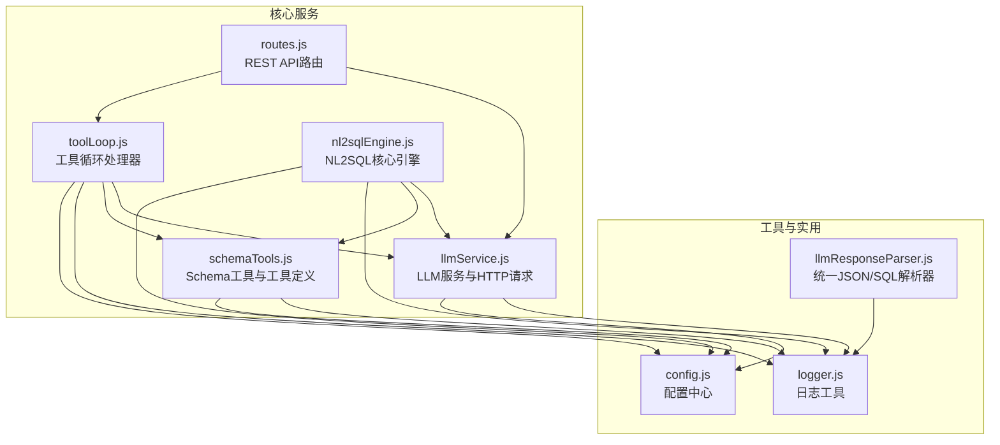
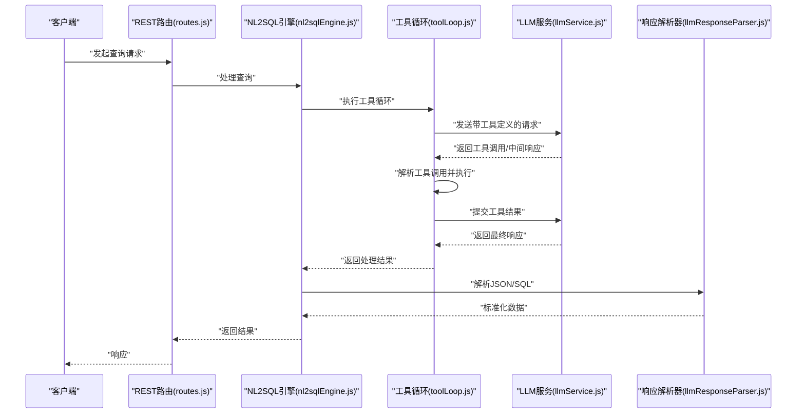
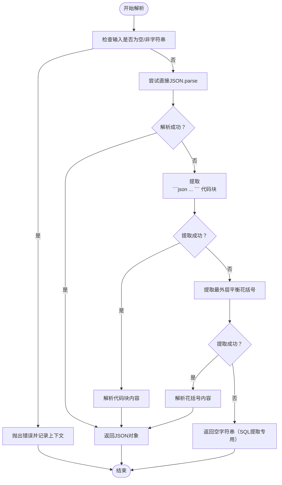
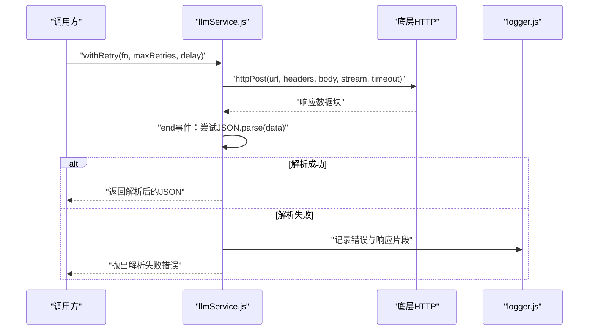
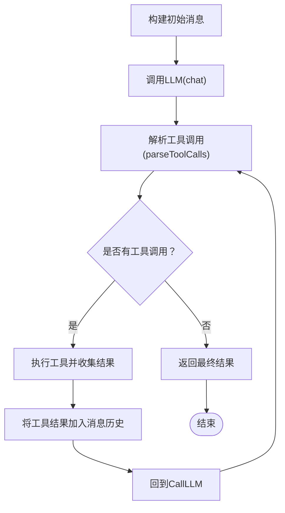
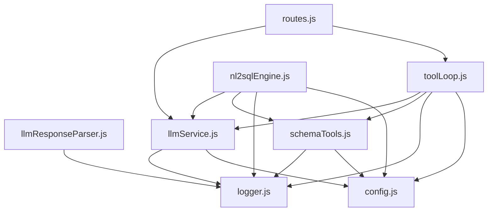

# 响应解析与处理

<cite>
**本文档引用的文件**
- [llmResponseParser.js](file://backend/src/utils/llmResponseParser.js)
- [llmService.js](file://backend/src/core/llmService.js)
- [toolLoop.js](file://backend/src/core/toolLoop.js)
- [schemaTools.js](file://backend/src/core/schemaTools.js)
- [nl2sqlEngine.js](file://backend/src/core/nl2sqlEngine.js)
- [logger.js](file://backend/src/utils/logger.js)
- [config.js](file://backend/src/core/config.js)
- [routes.js](file://backend/src/core/routes.js)
- [package.json](file://backend/package.json)
</cite>

## 目录
1. [简介](#简介)
2. [项目结构](#项目结构)
3. [核心组件](#核心组件)
4. [架构概览](#架构概览)
5. [详细组件分析](#详细组件分析)
6. [依赖分析](#依赖分析)
7. [性能考虑](#性能考虑)
8. [故障排查指南](#故障排查指南)
9. [结论](#结论)

## 简介
本文件聚焦于NL2SQL项目中的响应解析与处理机制，涵盖LLM响应的多种格式（标准JSON、代码块包裹的JSON/SQL、纯文本SQL）、流式响应处理、工具调用响应解析、错误处理与异常恢复、以及缓存与性能优化策略。目标是帮助开发者构建健壮、可扩展的响应处理系统。

## 项目结构
后端采用模块化设计，响应处理相关的关键模块分布如下：
- 工具与实用模块：统一响应解析器、日志、配置
- 核心服务模块：LLM服务、工具循环、Schema工具、NL2SQL引擎
- 路由与接口：REST API路由，暴露健康检查、Schema查询、会话管理等接口



图表来源
- [llmResponseParser.js:1-146](file://backend/src/utils/llmResponseParser.js#L1-L146)
- [llmService.js:1-477](file://backend/src/core/llmService.js#L1-L477)
- [toolLoop.js:1-521](file://backend/src/core/toolLoop.js#L1-L521)
- [schemaTools.js:1-632](file://backend/src/core/schemaTools.js#L1-L632)
- [nl2sqlEngine.js:1-800](file://backend/src/core/nl2sqlEngine.js#L1-L800)
- [logger.js:1-482](file://backend/src/utils/logger.js#L1-L482)
- [config.js:1-398](file://backend/src/core/config.js#L1-L398)
- [routes.js:1-800](file://backend/src/core/routes.js#L1-L800)

章节来源
- [package.json:1-28](file://backend/package.json#L1-L28)

## 核心组件
- 统一响应解析器：提供从LLM文本响应中提取JSON与SQL的标准化方法，支持多种策略与错误处理。
- LLM服务：封装HTTP请求、重试机制、超时控制、错误日志与响应解析。
- 工具循环处理器：处理工具调用循环，解析LLM的工具调用请求并执行工具。
- Schema工具：定义工具清单、执行工具、解析工具调用与业务知识匹配。
- NL2SQL引擎：整合意图识别、实体解析、SQL生成与验证，贯穿响应解析链路。
- 日志与配置：统一日志输出、结构化追踪、配置管理与环境变量。

章节来源
- [llmResponseParser.js:11-146](file://backend/src/utils/llmResponseParser.js#L11-L146)
- [llmService.js:30-477](file://backend/src/core/llmService.js#L30-L477)
- [toolLoop.js:41-185](file://backend/src/core/toolLoop.js#L41-L185)
- [schemaTools.js:40-632](file://backend/src/core/schemaTools.js#L40-L632)
- [nl2sqlEngine.js:223-298](file://backend/src/core/nl2sqlEngine.js#L223-L298)
- [logger.js:54-482](file://backend/src/utils/logger.js#L54-L482)
- [config.js:16-398](file://backend/src/core/config.js#L16-L398)

## 架构概览
响应解析与处理的整体流程如下：
- HTTP请求进入REST路由，调用LLM服务获取响应。
- LLM服务进行HTTP请求、重试与响应解析，记录日志。
- 工具循环处理器解析工具调用，执行Schema工具，再回到LLM服务获取最终响应。
- 统一响应解析器从LLM响应中提取JSON与SQL，处理不完整/截断/格式错误等异常。
- 日志与配置贯穿全流程，提供追踪与性能控制。



图表来源
- [routes.js:1-800](file://backend/src/core/routes.js#L1-L800)
- [nl2sqlEngine.js:1-800](file://backend/src/core/nl2sqlEngine.js#L1-L800)
- [toolLoop.js:1-521](file://backend/src/core/toolLoop.js#L1-L521)
- [llmService.js:222-308](file://backend/src/core/llmService.js#L222-L308)
- [llmResponseParser.js:24-143](file://backend/src/utils/llmResponseParser.js#L24-L143)

## 详细组件分析

### 统一响应解析器（JSON/SQL提取）
- JSON解析策略：
  1) 直接JSON.parse
  2) 提取代码块中的JSON（```json ... ```）
  3) 提取最外层平衡花括号内容（函数式匹配，避免贪婪）
- SQL提取策略：
  1) 从JSON对象的sql字段提取
  2) 提取代码块中的SQL（```sql ... ```）
  3) 正则匹配SELECT语句直至双换行/代码块/结尾
- 错误处理：当三种策略均失败时，抛出错误并附带响应预览，便于定位问题。



图表来源
- [llmResponseParser.js:24-106](file://backend/src/utils/llmResponseParser.js#L24-L106)
- [llmResponseParser.js:119-143](file://backend/src/utils/llmResponseParser.js#L119-L143)

章节来源
- [llmResponseParser.js:11-146](file://backend/src/utils/llmResponseParser.js#L11-L146)

### LLM服务与HTTP请求处理
- HTTP POST封装：支持JSON数据、流式响应、超时控制与错误处理。
- 响应解析与异常恢复：
  - JSON解析失败时记录原始响应片段、包含“truncated”标记的提示、多JSON对象迹象等。
  - 监听响应被异常终止（代理截断）。
  - 超时与请求错误处理。
- 重试机制：带指数退避的重试包装器，支持最大重试次数与延迟。
- 调用日志：记录请求详情、耗时、响应长度、Token用量与结束原因。



图表来源
- [llmService.js:41-152](file://backend/src/core/llmService.js#L41-L152)
- [llmService.js:167-195](file://backend/src/core/llmService.js#L167-L195)
- [llmService.js:278-308](file://backend/src/core/llmService.js#L278-L308)
- [logger.js:276-322](file://backend/src/utils/logger.js#L276-L322)

章节来源
- [llmService.js:30-477](file://backend/src/core/llmService.js#L30-L477)
- [logger.js:54-482](file://backend/src/utils/logger.js#L54-L482)

### 工具循环处理器与工具调用解析
- 工具循环：构建初始消息，调用LLM，解析工具调用，执行工具并将结果回传LLM，直至无工具调用或达到最大迭代次数。
- 工具调用解析：从LLM响应中提取tool_calls，解析函数名与参数。
- 结果解析：在意图识别与SQL生成阶段分别使用统一解析器提取JSON/SQL。



图表来源
- [toolLoop.js:57-185](file://backend/src/core/toolLoop.js#L57-L185)
- [schemaTools.js:585-602](file://backend/src/core/schemaTools.js#L585-L602)

章节来源
- [toolLoop.js:41-521](file://backend/src/core/toolLoop.js#L41-L521)
- [schemaTools.js:548-632](file://backend/src/core/schemaTools.js#L548-L632)

### NL2SQL引擎中的响应处理
- 统一错误类：结构化错误信息，便于日志记录与前端展示。
- 实体解析与平台术语解析：结合长期记忆与硬编码映射，提升意图识别准确性。
- 关键路径：工具循环返回后，分别在意图识别与SQL生成阶段调用统一解析器提取JSON/SQL。

章节来源
- [nl2sqlEngine.js:223-298](file://backend/src/core/nl2sqlEngine.js#L223-L298)
- [nl2sqlEngine.js:311-441](file://backend/src/core/nl2sqlEngine.js#L311-L441)

### 日志与追踪
- 多级别日志：trace、debug、info、warn、error，支持控制台与文件输出、自动轮转。
- 执行追踪：startTrace/traceStep/endTrace，记录步骤耗时与上下文，便于深度调试。

章节来源
- [logger.js:54-482](file://backend/src/utils/logger.js#L54-L482)

### 配置与环境
- 配置集中管理：LLM API、Embedding、数据库、安全、会话、日志、Schema缓存、长期记忆、上下文管理等。
- 环境变量：通过process.env读取，提供默认值与校验。

章节来源
- [config.js:16-398](file://backend/src/core/config.js#L16-L398)

## 依赖分析
- 模块耦合：
  - llmResponseParser被toolLoop与longTermMemory复用，降低重复实现。
  - llmService被routes、toolLoop、nl2sqlEngine广泛依赖。
  - schemaTools提供工具定义与执行，被toolLoop直接调用。
- 外部依赖：
  - Node.js内置模块（https/http/url/fs/path/events）。
  - 第三方库（express、sqlite3、vectordb、uuid、dayjs、node-cron等）。



图表来源
- [llmResponseParser.js:1-146](file://backend/src/utils/llmResponseParser.js#L1-L146)
- [llmService.js:1-477](file://backend/src/core/llmService.js#L1-L477)
- [schemaTools.js:1-632](file://backend/src/core/schemaTools.js#L1-L632)
- [toolLoop.js:1-521](file://backend/src/core/toolLoop.js#L1-L521)
- [nl2sqlEngine.js:1-800](file://backend/src/core/nl2sqlEngine.js#L1-L800)
- [routes.js:1-800](file://backend/src/core/routes.js#L1-L800)
- [logger.js:1-482](file://backend/src/utils/logger.js#L1-L482)
- [config.js:1-398](file://backend/src/core/config.js#L1-L398)

## 性能考虑
- 缓存策略：
  - Schema Level 1索引缓存：带过期时间，减少频繁生成开销。
  - 日志文件轮转：控制单文件大小与保留数量，避免磁盘膨胀。
- 超时与重试：
  - LLM请求超时与重试配置，避免长时间阻塞。
  - Embedding请求独立超时配置，适应向量化耗时。
- 内存管理：
  - 日志追踪上下文容量限制与超时清理，防止内存泄漏。
  - 长期记忆阈值与分级保留策略，控制存储规模。
- I/O优化：
  - SSE连接管理与广播，避免重复序列化。
  - 路由中间件统一请求日志，减少重复I/O。

章节来源
- [schemaTools.js:154-173](file://backend/src/core/schemaTools.js#L154-L173)
- [logger.js:85-98](file://backend/src/utils/logger.js#L85-L98)
- [config.js:68-74](file://backend/src/core/config.js#L68-L74)
- [config.js:85-87](file://backend/src/core/config.js#L85-L87)
- [logger.js:331-343](file://backend/src/utils/logger.js#L331-L343)
- [config.js:259-293](file://backend/src/core/config.js#L259-L293)

## 故障排查指南
- JSON解析失败：
  - 现象：响应包含“truncated”标记、多JSON对象、或解析异常。
  - 处理：检查API服务器响应大小限制、确认是否为流式响应格式、查看响应前后片段定位问题。
- SQL提取失败：
  - 现象：LLM未按约定格式输出JSON/SQL代码块。
  - 处理：回退到正则匹配SELECT语句，或调整提示词约束输出格式。
- 工具调用解析异常：
  - 现象：tool_calls字段缺失或格式不正确。
  - 处理：检查LLM模型与工具定义一致性，确保tools参数正确传递。
- SSE连接问题：
  - 现象：连接未建立、连接关闭、错误日志。
  - 处理：检查会话ID有效性、Nginx缓冲设置、连接清理逻辑。
- 长期记忆解析失败：
  - 现象：LLM返回非JSON或结构不符合预期。
  - 处理：使用统一解析器的容错分支，记录原始响应并降级处理。

章节来源
- [llmService.js:92-131](file://backend/src/core/llmService.js#L92-L131)
- [llmResponseParser.js:24-59](file://backend/src/utils/llmResponseParser.js#L24-L59)
- [schemaTools.js:585-602](file://backend/src/core/schemaTools.js#L585-L602)
- [toolLoop.js:352-382](file://backend/src/core/toolLoop.js#L352-L382)
- [nl2sqlEngine.js:223-298](file://backend/src/core/nl2sqlEngine.js#L223-L298)

## 结论
本项目通过统一响应解析器、完善的LLM服务封装、严谨的工具循环与工具调用解析、以及全面的日志与配置体系，实现了对LLM响应的稳健处理。针对不完整响应、截断响应与格式错误等异常，提供了多层次的容错与恢复策略。配合缓存、超时与重试机制，整体具备良好的性能与可维护性。建议在生产环境中持续关注日志追踪、配置校验与工具定义一致性，以进一步提升稳定性与可观察性。