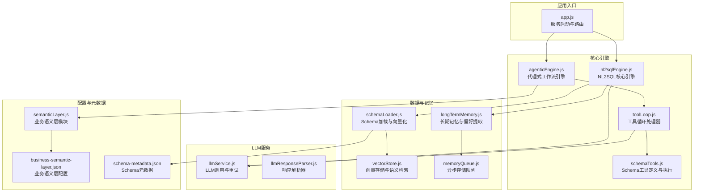
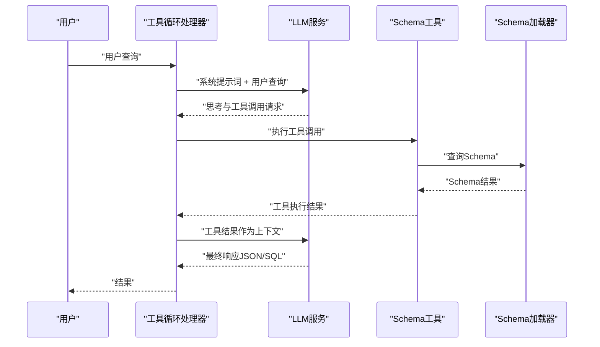
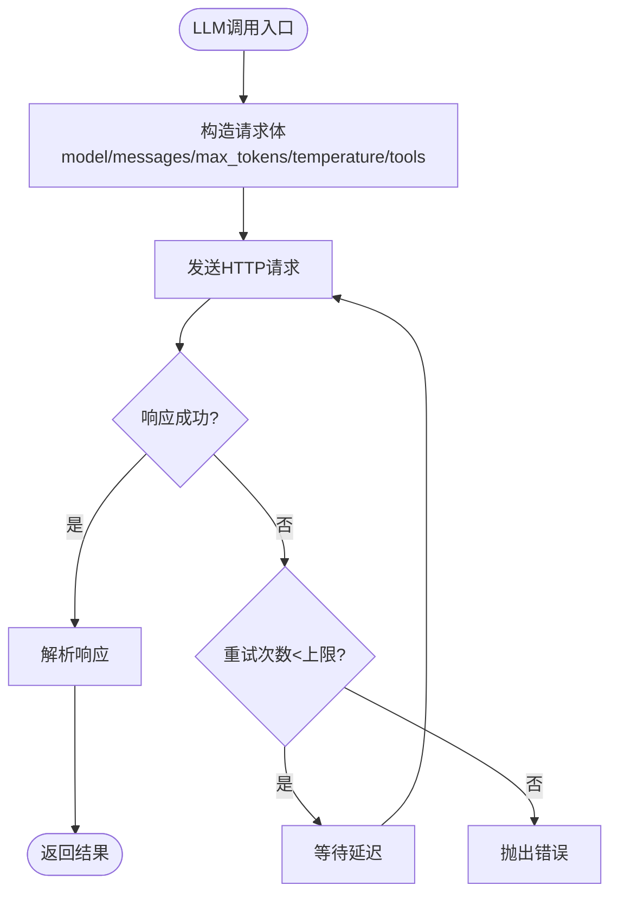
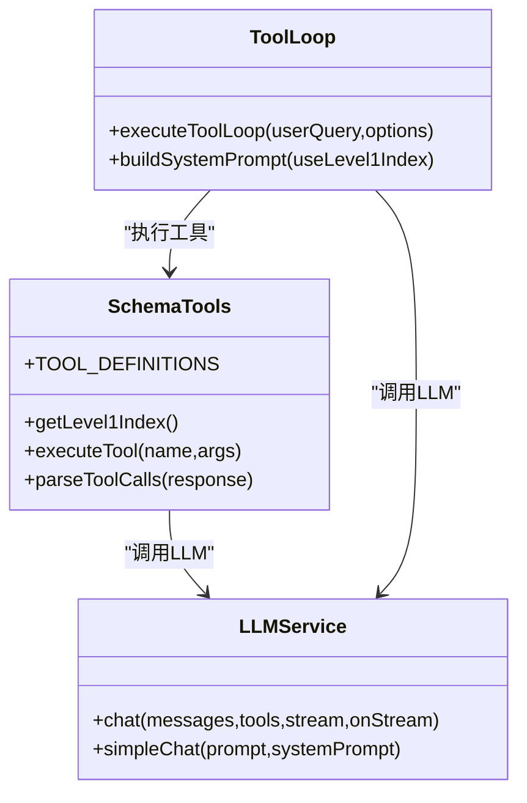
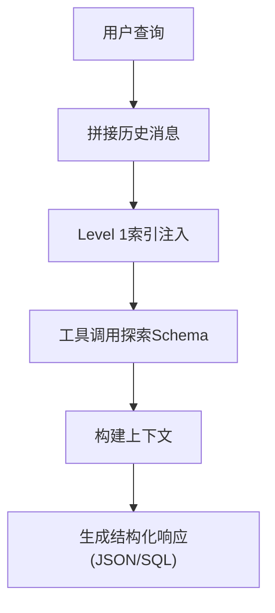
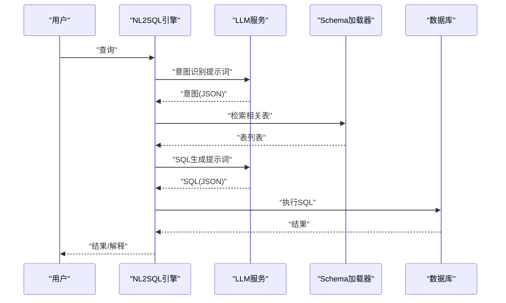
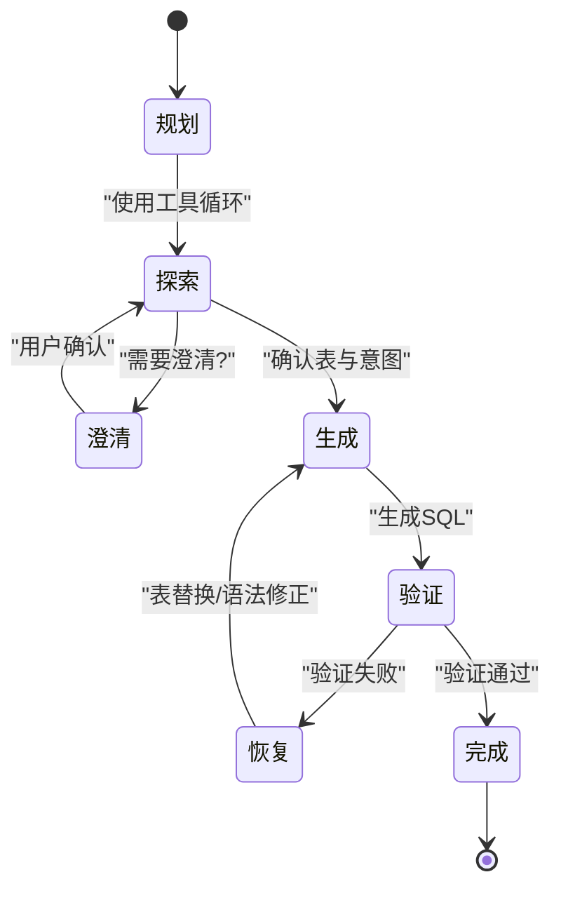
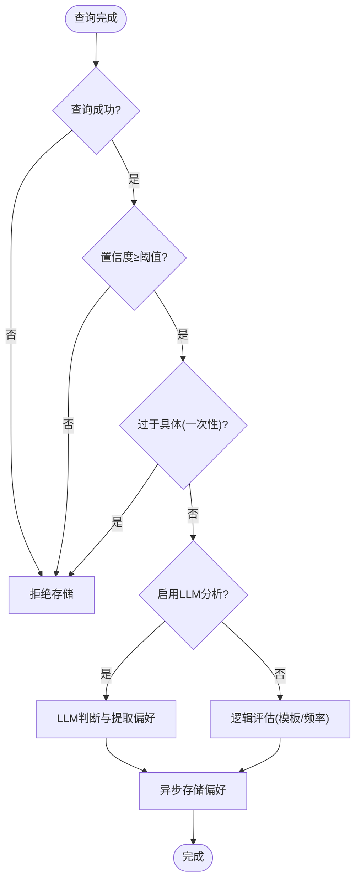
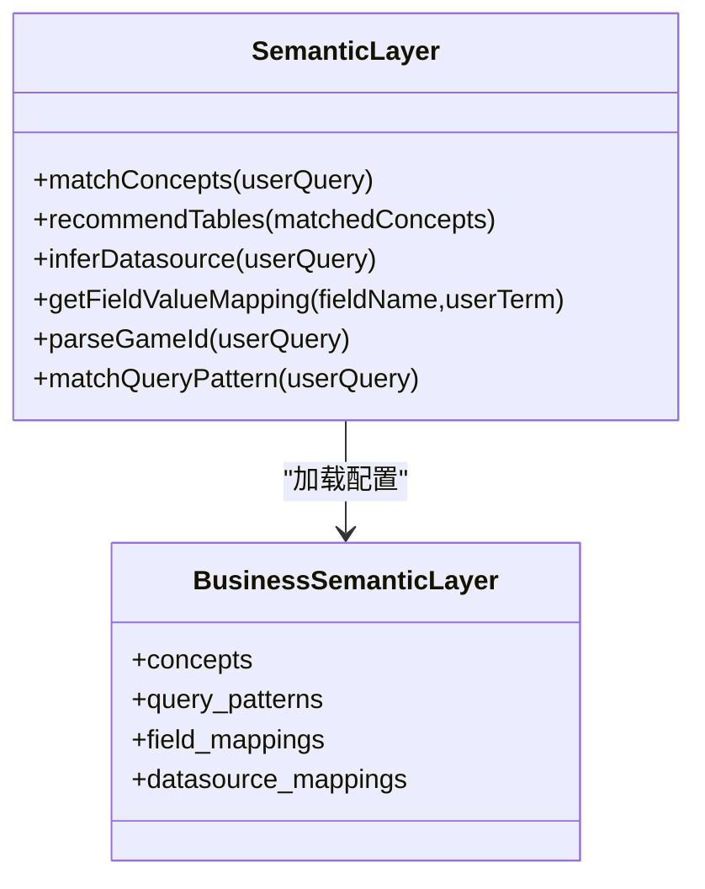
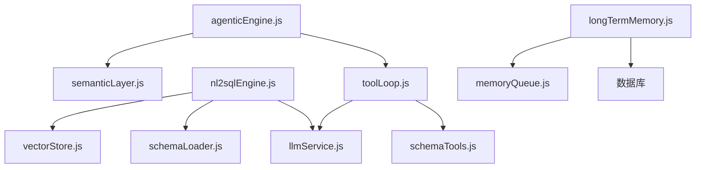

# 提示词工程与优化

<cite>
**本文档引用的文件**
- [app.js](file://backend/src/app.js)
- [nl2sqlEngine.js](file://backend/src/core/nl2sqlEngine.js)
- [llmService.js](file://backend/src/core/llmService.js)
- [schemaTools.js](file://backend/src/core/schemaTools.js)
- [vectorStore.js](file://backend/src/memory/vectorStore.js)
- [schemaLoader.js](file://backend/src/core/schemaLoader.js)
- [longTermMemory.js](file://backend/src/memory/longTermMemory.js)
- [llmResponseParser.js](file://backend/src/utils/llmResponseParser.js)
- [business-semantic-layer.json](file://backend/config/business-semantic-layer.json)
- [schema-metadata.json](file://backend/config/schema-metadata.json)
- [semanticLayer.js](file://backend/src/core/semanticLayer.js)
- [agenticEngine.js](file://backend/src/core/agenticEngine.js)
- [toolLoop.js](file://backend/src/core/toolLoop.js)
- [memoryQueue.js](file://backend/src/memory/memoryQueue.js)
</cite>

## 目录
1. [简介](#简介)
2. [项目结构](#项目结构)
3. [核心组件](#核心组件)
4. [架构总览](#架构总览)
5. [详细组件分析](#详细组件分析)
6. [依赖关系分析](#依赖关系分析)
7. [性能考量](#性能考量)
8. [故障排查指南](#故障排查指南)
9. [结论](#结论)
10. [附录](#附录)

## 简介
本文件面向提示词工程与优化，系统梳理NL2SQL项目中的提示词设计原则、上下文构建技术、参数调优策略、模板设计与多轮对话管理、错误恢复机制等关键技术点。文档结合代码实现，提供可操作的提示词设计方法与优化案例，帮助开发者提升与LLM的交互效果。

## 项目结构
NL2SQL后端采用模块化架构，围绕“意图识别—Schema探索—澄清确认—SQL生成—验证与恢复”的工作流组织核心模块。关键模块包括：
- LLM服务层：统一LLM调用、重试与参数配置
- Schema工具层：LLM可调用的Schema探索工具
- 引擎层：NL2SQL核心引擎、代理式工作流引擎
- 记忆与向量：长期记忆、向量检索与语义搜索
- 配置与元数据：业务语义层、Schema元数据

**图表来源**
- [app.js:1-266](file://backend/src/app.js#L1-L266)
- [nl2sqlEngine.js:1-800](file://backend/src/core/nl2sqlEngine.js#L1-L800)
- [agenticEngine.js:1-651](file://backend/src/core/agenticEngine.js#L1-L651)
- [toolLoop.js:1-521](file://backend/src/core/toolLoop.js#L1-L521)
- [schemaTools.js:1-632](file://backend/src/core/schemaTools.js#L1-L632)
- [llmService.js:1-477](file://backend/src/core/llmService.js#L1-L477)
- [llmResponseParser.js:1-146](file://backend/src/utils/llmResponseParser.js#L1-L146)
- [schemaLoader.js:1-800](file://backend/src/core/schemaLoader.js#L1-L800)
- [vectorStore.js:1-800](file://backend/src/memory/vectorStore.js#L1-L800)
- [longTermMemory.js:1-800](file://backend/src/memory/longTermMemory.js#L1-L800)
- [memoryQueue.js:1-217](file://backend/src/memory/memoryQueue.js#L1-L217)
- [business-semantic-layer.json:1-189](file://backend/config/business-semantic-layer.json#L1-L189)
- [schema-metadata.json:1-800](file://backend/config/schema-metadata.json#L1-L800)
- [semanticLayer.js:1-532](file://backend/src/core/semanticLayer.js#L1-L532)

**章节来源**
- [app.js:1-266](file://backend/src/app.js#L1-L266)

## 核心组件
- LLM服务层：封装HTTP请求、重试机制、参数配置（温度、最大token、工具调用等），提供chat/simpleChat/getEmbedding等能力。
- Schema工具层：定义search_tables/describe_table/search_knowledge/peek_table四个工具，支持LLM按需探索Schema。
- 引擎层：NL2SQL核心引擎负责意图识别、实体解析、表推断、SQL生成与验证；代理式工作流引擎实现Plan→Act→Observe循环与错误恢复。
- 记忆与向量：长期记忆抽取用户偏好，异步存储；向量存储支持Schema与查询历史的语义检索。
- 配置与元数据：业务语义层将业务概念映射到物理表/字段；Schema元数据提供表结构与字段信息。

**章节来源**
- [llmService.js:1-477](file://backend/src/core/llmService.js#L1-L477)
- [schemaTools.js:1-632](file://backend/src/core/schemaTools.js#L1-L632)
- [nl2sqlEngine.js:1-800](file://backend/src/core/nl2sqlEngine.js#L1-L800)
- [agenticEngine.js:1-651](file://backend/src/core/agenticEngine.js#L1-L651)
- [longTermMemory.js:1-800](file://backend/src/memory/longTermMemory.js#L1-L800)
- [vectorStore.js:1-800](file://backend/src/memory/vectorStore.js#L1-L800)
- [business-semantic-layer.json:1-189](file://backend/config/business-semantic-layer.json#L1-L189)
- [schema-metadata.json:1-800](file://backend/config/schema-metadata.json#L1-L800)
- [semanticLayer.js:1-532](file://backend/src/core/semanticLayer.js#L1-L532)

## 架构总览
NL2SQL采用“工具增强+代理式工作流”的提示词工程范式：
- 工具增强：通过Schema工具定义，引导LLM逐步探索Schema，避免一次性灌输造成上下文浪费与噪声。
- 代理式工作流：将复杂查询分解为Plan→Act→Observe循环，每一步都有清晰的提示词与反馈，支持自我修正与错误恢复。

**图表来源**
- [toolLoop.js:57-185](file://backend/src/core/toolLoop.js#L57-L185)
- [schemaTools.js:547-602](file://backend/src/core/schemaTools.js#L547-L602)
- [schemaLoader.js:571-653](file://backend/src/core/schemaLoader.js#L571-L653)
- [llmService.js:222-308](file://backend/src/core/llmService.js#L222-L308)

## 详细组件分析

### LLM服务与参数调优
- 温度参数：默认0.1，强调确定性与一致性，适合NL2SQL的结构化输出场景。
- 最大token：默认4096，兼顾上下文长度与生成长度。
- 工具调用：通过TOOL_DEFINITIONS定义工具，强制模型按需调用，减少无关信息。
- 重试机制：withRetry提供最大重试次数与延迟配置，提升稳定性。

**图表来源**
- [llmService.js:222-308](file://backend/src/core/llmService.js#L222-L308)
- [llmService.js:167-195](file://backend/src/core/llmService.js#L167-L195)

**章节来源**
- [llmService.js:1-477](file://backend/src/core/llmService.js#L1-L477)

### Schema工具与提示词设计
- 工具定义：search_tables/describe_table/search_knowledge/peek_table，分别用于表搜索、表详情、业务概念映射、表结构预览。
- 系统提示词：引导LLM按流程使用工具，明确输出格式（JSON含selected_tables/sql/explanation）。
- Level 1索引：在系统提示词中注入可用表清单，降低LLM“臆造”表名的概率。

**图表来源**
- [schemaTools.js:40-124](file://backend/src/core/schemaTools.js#L40-L124)
- [toolLoop.js:57-185](file://backend/src/core/toolLoop.js#L57-L185)
- [llmService.js:222-308](file://backend/src/core/llmService.js#L222-L308)

**章节来源**
- [schemaTools.js:1-632](file://backend/src/core/schemaTools.js#L1-L632)
- [toolLoop.js:1-521](file://backend/src/core/toolLoop.js#L1-L521)

### 上下文构建技术
- 历史消息管理：工具循环支持将最近N轮历史注入系统提示词，增强上下文连贯性。
- Schema信息注入：Level 1索引与工具调用结果作为上下文，减少LLM对Schema的假设。
- 业务规则说明：业务语义层配置提供概念映射与查询模式，指导LLM理解业务约束。

**图表来源**
- [toolLoop.js:195-224](file://backend/src/core/toolLoop.js#L195-L224)
- [toolLoop.js:232-293](file://backend/src/core/toolLoop.js#L232-L293)
- [schemaTools.js:136-173](file://backend/src/core/schemaTools.js#L136-L173)

**章节来源**
- [toolLoop.js:1-521](file://backend/src/core/toolLoop.js#L1-L521)
- [schemaTools.js:1-632](file://backend/src/core/schemaTools.js#L1-L632)

### NL2SQL核心引擎与提示词模板
- 意图识别：从用户查询中抽取消费者意图（维度、指标、筛选器、时间范围），并进行实体解析与平台解析。
- 表推断：结合向量检索与关键词匹配，动态推断相关表，减少上下文冗余。
- SQL生成：基于意图与Schema详情生成SQL，统一使用JSON模板输出，便于解析与校验。
- 错误恢复：对验证失败的SQL进行分类与恢复，支持表名替换与语法修正。

**图表来源**
- [nl2sqlEngine.js:1-800](file://backend/src/core/nl2sqlEngine.js#L1-L800)
- [llmService.js:222-308](file://backend/src/core/llmService.js#L222-L308)
- [schemaLoader.js:571-653](file://backend/src/core/schemaLoader.js#L571-L653)

**章节来源**
- [nl2sqlEngine.js:1-800](file://backend/src/core/nl2sqlEngine.js#L1-L800)
- [schemaLoader.js:1-800](file://backend/src/core/schemaLoader.js#L1-L800)

### 代理式工作流与错误恢复
- Plan→Act→Observe循环：先规划查询策略，再通过工具探索Schema，确认后生成SQL，最后验证与恢复。
- 错误分类与恢复：针对表不存在与语法错误分别处理，支持替代表与语法修正。
- 多轮澄清：在需要时生成澄清问题，等待用户确认后再继续。

**图表来源**
- [agenticEngine.js:68-178](file://backend/src/core/agenticEngine.js#L68-L178)
- [agenticEngine.js:516-611](file://backend/src/core/agenticEngine.js#L516-L611)

**章节来源**
- [agenticEngine.js:1-651](file://backend/src/core/agenticEngine.js#L1-L651)

### 长期记忆与提示词优化
- LLM智能分析：通过系统提示词引导LLM判断用户查询是否包含“知识增量”，提取字段别名、分析习惯、过滤逻辑等偏好。
- 逻辑判断与阈值：置信度阈值、模式频率阈值、模板复杂度阈值共同决定是否存储。
- 异步存储：通过队列批量异步写入，避免阻塞主流程。

**图表来源**
- [longTermMemory.js:299-461](file://backend/src/memory/longTermMemory.js#L299-L461)
- [memoryQueue.js:46-118](file://backend/src/memory/memoryQueue.js#L46-L118)

**章节来源**
- [longTermMemory.js:1-800](file://backend/src/memory/longTermMemory.js#L1-L800)
- [memoryQueue.js:1-217](file://backend/src/memory/memoryQueue.js#L1-L217)

### 业务语义层与提示词注入
- 概念匹配：将“老平台/新平台/累计充值”等业务术语映射到物理表/字段，提升LLM对业务的理解。
- 查询模式：定义典型查询模式（如“玩家筛选+行为分析”），指导LLM生成符合业务习惯的SQL。
- 字段值映射：将用户术语映射到具体字段值（如游戏ID、平台类型），减少歧义。

**图表来源**
- [semanticLayer.js:134-386](file://backend/src/core/semanticLayer.js#L134-L386)
- [business-semantic-layer.json:1-189](file://backend/config/business-semantic-layer.json#L1-L189)

**章节来源**
- [semanticLayer.js:1-532](file://backend/src/core/semanticLayer.js#L1-L532)
- [business-semantic-layer.json:1-189](file://backend/config/business-semantic-layer.json#L1-L189)

## 依赖关系分析
- 模块耦合：工具循环依赖Schema工具与LLM服务；NL2SQL引擎依赖LLM服务、Schema加载器与向量存储；长期记忆依赖数据库与队列。
- 外部依赖：LLM API、LanceDB向量数据库、SQLite数据库。
- 循环依赖：代码中未发现直接循环依赖，模块间通过接口与回调解耦。

**图表来源**
- [toolLoop.js:1-521](file://backend/src/core/toolLoop.js#L1-L521)
- [schemaTools.js:1-632](file://backend/src/core/schemaTools.js#L1-L632)
- [llmService.js:1-477](file://backend/src/core/llmService.js#L1-L477)
- [nl2sqlEngine.js:1-800](file://backend/src/core/nl2sqlEngine.js#L1-L800)
- [schemaLoader.js:1-800](file://backend/src/core/schemaLoader.js#L1-L800)
- [vectorStore.js:1-800](file://backend/src/memory/vectorStore.js#L1-L800)
- [longTermMemory.js:1-800](file://backend/src/memory/longTermMemory.js#L1-L800)
- [memoryQueue.js:1-217](file://backend/src/memory/memoryQueue.js#L1-L217)
- [agenticEngine.js:1-651](file://backend/src/core/agenticEngine.js#L1-L651)
- [semanticLayer.js:1-532](file://backend/src/core/semanticLayer.js#L1-L532)

**章节来源**
- [app.js:1-266](file://backend/src/app.js#L1-L266)

## 性能考量
- 向量检索：表级向量与智能重排序减少无关表干扰，提升检索精度与速度。
- 异步存储：长期记忆通过队列异步写入，降低主流程延迟。
- 工具循环：限制最大迭代次数与超时时间，防止长时间阻塞。
- 参数调优：温度0.1降低随机性，提高一致性；合理设置max_tokens避免截断。

[本节为通用指导，无需特定文件引用]

## 故障排查指南
- LLM调用失败：检查API密钥、超时与重试配置；查看响应解析与错误日志。
- 工具调用异常：确认工具定义与参数；检查工具执行结果与消息历史拼接。
- SQL验证失败：核对表存在性、禁止关键字与基本语法；必要时进行错误恢复。
- 向量数据库未初始化：确认LanceDB路径与权限；检查向量表创建与数据写入。

**章节来源**
- [llmService.js:1-477](file://backend/src/core/llmService.js#L1-L477)
- [toolLoop.js:1-521](file://backend/src/core/toolLoop.js#L1-L521)
- [agenticEngine.js:438-511](file://backend/src/core/agenticEngine.js#L438-L511)
- [vectorStore.js:233-263](file://backend/src/memory/vectorStore.js#L233-L263)

## 结论
NL2SQL项目通过“工具增强+代理式工作流”的提示词工程范式，实现了从自然语言到SQL的稳健转换。系统在上下文构建、Schema探索、意图识别、错误恢复等方面均有完善的提示词设计与工程实践。开发者可参考本文档的模板与策略，在保证准确性的同时提升交互效率与用户体验。

[本节为总结性内容，无需特定文件引用]

## 附录

### 提示词设计原则与模板
- 系统提示词（System Prompt）
  - 明确角色与任务边界，限定输出格式与约束。
  - 示例：工具循环系统提示词包含工具定义、工作流程与输出格式要求。
  - 参考路径：[toolLoop.js:232-293](file://backend/src/core/toolLoop.js#L232-L293)

- 用户提示词（User Prompt）
  - 清晰描述查询需求，提供必要上下文（历史、时间范围、筛选条件）。
  - 参考路径：[toolLoop.js:195-224](file://backend/src/core/toolLoop.js#L195-L224)

- 工具提示词（Tool Prompt）
  - 为每个工具提供明确用途、参数说明与示例，减少LLM误解。
  - 参考路径：[schemaTools.js:40-124](file://backend/src/core/schemaTools.js#L40-L124)

- SQL生成提示词
  - 基于意图分析与Schema详情，要求生成符合语法的SQL并附说明。
  - 参考路径：[toolLoop.js:445-466](file://backend/src/core/toolLoop.js#L445-L466)

### 上下文构建最佳实践
- 历史消息：限制最近N轮，避免上下文过长导致截断。
- Level 1索引：在系统提示词中注入可用表清单，降低LLM臆造风险。
- 业务规则：通过业务语义层配置注入概念映射与查询模式。
- 参考路径：
  - [toolLoop.js:195-224](file://backend/src/core/toolLoop.js#L195-L224)
  - [schemaTools.js:136-173](file://backend/src/core/schemaTools.js#L136-L173)
  - [semanticLayer.js:134-167](file://backend/src/core/semanticLayer.js#L134-L167)

### 参数调优策略
- 温度（temperature）：默认0.1，强调确定性；复杂查询可适度提高至0.3-0.5。
- 最大token（max_tokens）：根据上下文与生成长度综合设置，避免截断。
- 工具调用：启用工具定义，强制模型按需调用，减少噪声。
- 参考路径：
  - [llmService.js:248-266](file://backend/src/core/llmService.js#L248-L266)

### 多轮对话管理与错误恢复
- 多轮对话：通过历史消息拼接与澄清机制，维持上下文一致性。
- 错误恢复：对表不存在与语法错误进行分类处理，支持替代表与语法修正。
- 参考路径：
  - [agenticEngine.js:301-336](file://backend/src/core/agenticEngine.js#L301-L336)
  - [agenticEngine.js:516-611](file://backend/src/core/agenticEngine.js#L516-L611)

### 提示词示例与优化案例
- 示例1：工具循环系统提示词（含Level 1索引与工具定义）
  - 参考路径：[toolLoop.js:232-293](file://backend/src/core/toolLoop.js#L232-L293)
- 示例2：SQL生成提示词（基于意图分析）
  - 参考路径：[toolLoop.js:445-466](file://backend/src/core/toolLoop.js#L445-L466)
- 优化案例：通过业务语义层将“老平台/新平台”映射到具体数据源，减少歧义。
  - 参考路径：
    - [semanticLayer.js:367-386](file://backend/src/core/semanticLayer.js#L367-L386)
    - [business-semantic-layer.json:6-27](file://backend/config/business-semantic-layer.json#L6-L27)