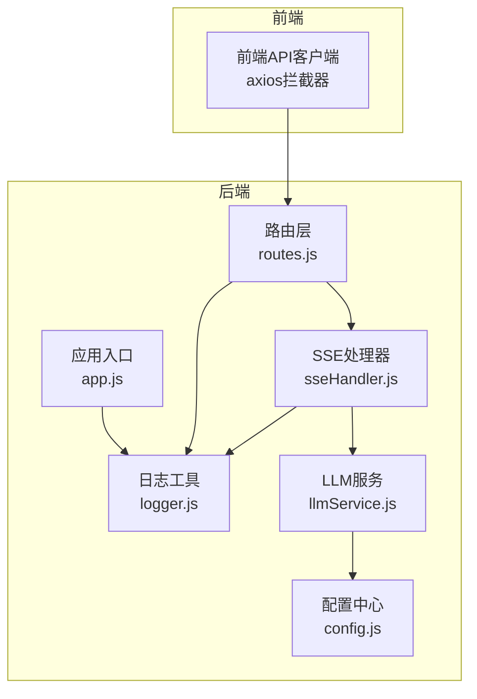
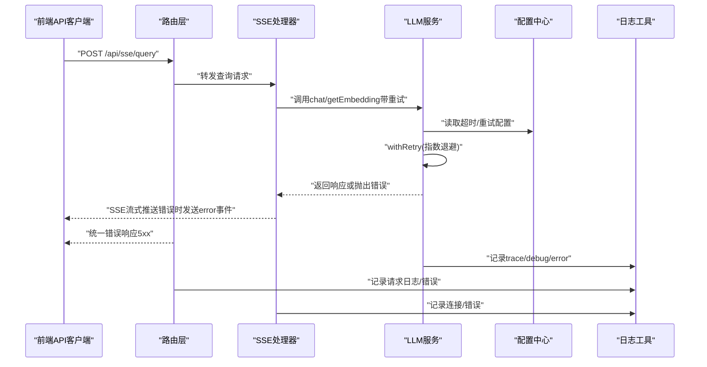
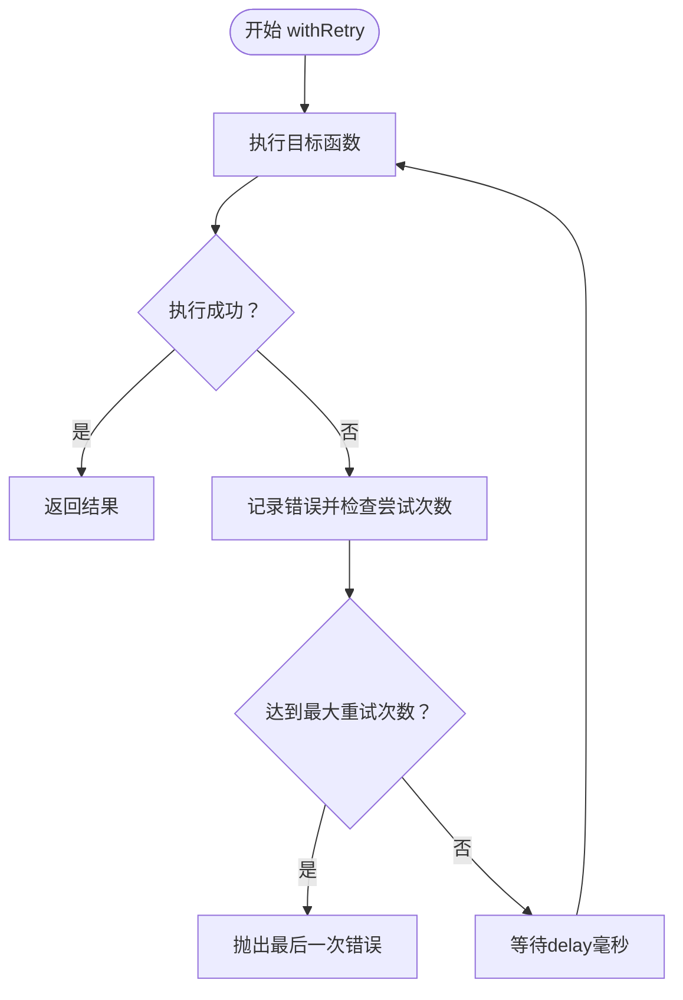
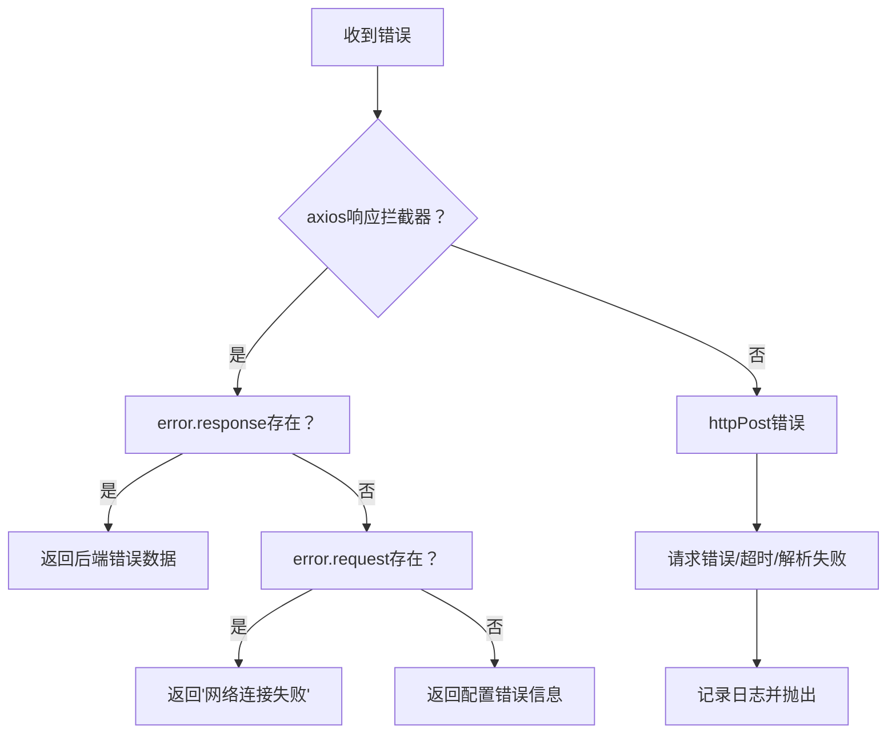
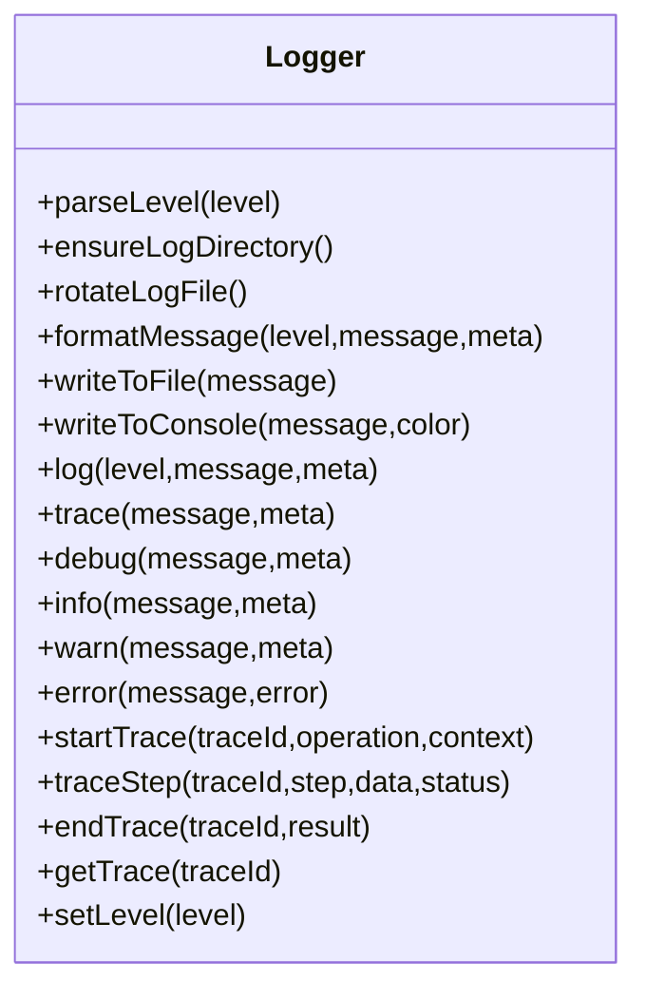
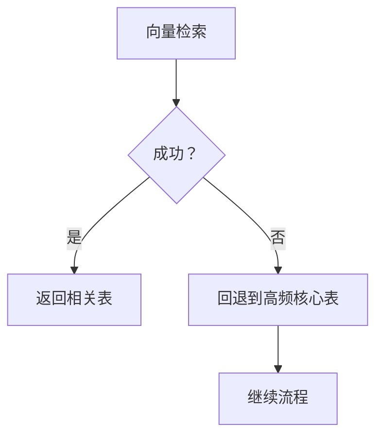
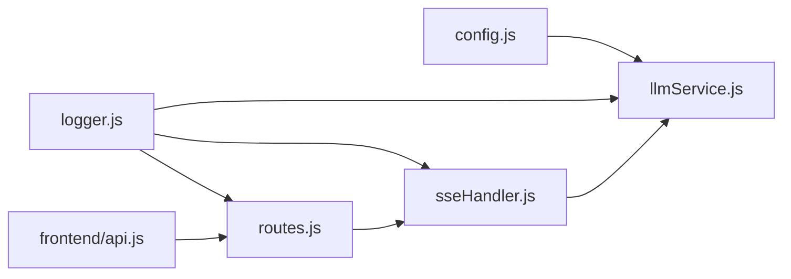

# 重试机制与错误处理

<cite>
**本文引用的文件**
- [backend/src/utils/logger.js](file://backend/src/utils/logger.js)
- [backend/src/app.js](file://backend/src/app.js)
- [backend/src/core/config.js](file://backend/src/core/config.js)
- [backend/src/core/llmService.js](file://backend/src/core/llmService.js)
- [backend/src/core/sseHandler.js](file://backend/src/core/sseHandler.js)
- [backend/src/core/routes.js](file://backend/src/core/routes.js)
- [backend/src/core/nl2sqlEngine.js](file://backend/src/core/nl2sqlEngine.js)
- [frontend/src/utils/api.js](file://frontend/src/utils/api.js)
- [backend/package.json](file://backend/package.json)
</cite>

## 目录
1. [简介](#简介)
2. [项目结构](#项目结构)
3. [核心组件](#核心组件)
4. [架构总览](#架构总览)
5. [详细组件分析](#详细组件分析)
6. [依赖分析](#依赖分析)
7. [性能考虑](#性能考虑)
8. [故障排查指南](#故障排查指南)
9. [结论](#结论)
10. [附录](#附录)

## 简介
本文件聚焦于 NL2SQL 项目的“重试机制与错误处理”主题，系统性阐述以下内容：
- 重试策略设计原理：指数退避、最大重试次数、延迟策略等
- 错误分类与处理机制：网络错误、API错误、超时错误、认证错误等
- 日志记录与监控：错误追踪、性能统计、故障诊断
- 优雅降级策略：回退方案、降级阈值、用户体验保障
- 配置示例与故障排查指南：帮助开发者构建可靠的错误处理系统

## 项目结构
后端采用 Node.js + Express 架构，前端使用 Vue + Axios。错误处理与重试主要分布在以下模块：
- 配置中心：集中管理 LLM API 的超时、重试次数、重试间隔等
- LLM 服务：封装 HTTP 请求、统一重试、错误分类与日志
- SSE 处理器：连接管理、消息广播、错误上报
- 路由层：统一错误响应、健康检查、组件状态上报
- 日志工具：统一日志级别、文件轮转、追踪上下文
- 前端 API 客户端：Axios 拦截器统一处理网络与 API 错误

图表来源
- [backend/src/app.js:1-266](file://backend/src/app.js#L1-L266)
- [backend/src/core/config.js:1-398](file://backend/src/core/config.js#L1-L398)
- [backend/src/utils/logger.js:1-482](file://backend/src/utils/logger.js#L1-L482)
- [backend/src/core/routes.js:1-800](file://backend/src/core/routes.js#L1-L800)
- [backend/src/core/sseHandler.js:1-349](file://backend/src/core/sseHandler.js#L1-L349)
- [backend/src/core/llmService.js:1-477](file://backend/src/core/llmService.js#L1-L477)
- [frontend/src/utils/api.js:1-303](file://frontend/src/utils/api.js#L1-L303)

章节来源
- [backend/src/app.js:1-266](file://backend/src/app.js#L1-L266)
- [backend/src/core/config.js:1-398](file://backend/src/core/config.js#L1-L398)
- [backend/src/utils/logger.js:1-482](file://backend/src/utils/logger.js#L1-L482)
- [backend/src/core/routes.js:1-800](file://backend/src/core/routes.js#L1-L800)
- [backend/src/core/sseHandler.js:1-349](file://backend/src/core/sseHandler.js#L1-L349)
- [backend/src/core/llmService.js:1-477](file://backend/src/core/llmService.js#L1-L477)
- [frontend/src/utils/api.js:1-303](file://frontend/src/utils/api.js#L1-L303)

## 核心组件
- 配置中心（config.js）
  - LLM API 超时、最大重试次数、重试间隔
  - Embedding 超时
  - 日志级别、文件轮转参数
- LLM 服务（llmService.js）
  - HTTP 请求封装（httpPost）、错误分类与日志
  - 重试包装器（withRetry）、睡眠工具（sleep）
  - chat/simpleChat/getEmbedding
- SSE 处理器（sseHandler.js）
  - 连接生命周期管理、错误处理与清理
  - 广播消息、进度回调
- 路由层（routes.js）
  - 健康检查、组件状态上报
  - 统一错误响应与日志记录
- 日志工具（logger.js）
  - 多级别日志、文件轮转、追踪上下文（trace）
- 前端 API 客户端（frontend/api.js）
  - axios 拦截器：网络错误、API 错误、请求错误统一处理

章节来源
- [backend/src/core/config.js:60-87](file://backend/src/core/config.js#L60-L87)
- [backend/src/core/llmService.js:41-152](file://backend/src/core/llmService.js#L41-L152)
- [backend/src/core/llmService.js:167-195](file://backend/src/core/llmService.js#L167-L195)
- [backend/src/core/llmService.js:222-308](file://backend/src/core/llmService.js#L222-L308)
- [backend/src/core/llmService.js:370-424](file://backend/src/core/llmService.js#L370-L424)
- [backend/src/core/sseHandler.js:43-112](file://backend/src/core/sseHandler.js#L43-L112)
- [backend/src/core/sseHandler.js:218-280](file://backend/src/core/sseHandler.js#L218-L280)
- [backend/src/core/routes.js:72-137](file://backend/src/core/routes.js#L72-L137)
- [backend/src/utils/logger.js:29-44](file://backend/src/utils/logger.js#L29-L44)
- [backend/src/utils/logger.js:147-179](file://backend/src/utils/logger.js#L147-L179)
- [backend/src/utils/logger.js:276-322](file://backend/src/utils/logger.js#L276-L322)
- [backend/src/utils/logger.js:352-448](file://backend/src/utils/logger.js#L352-L448)
- [frontend/src/utils/api.js:44-88](file://frontend/src/utils/api.js#L44-L88)

## 架构总览
下图展示从前端到后端的关键错误处理与重试路径：

图表来源
- [backend/src/core/llmService.js:167-195](file://backend/src/core/llmService.js#L167-L195)
- [backend/src/core/llmService.js:222-308](file://backend/src/core/llmService.js#L222-L308)
- [backend/src/core/llmService.js:370-424](file://backend/src/core/llmService.js#L370-L424)
- [backend/src/core/sseHandler.js:218-280](file://backend/src/core/sseHandler.js#L218-L280)
- [backend/src/core/routes.js:72-137](file://backend/src/core/routes.js#L72-L137)
- [backend/src/utils/logger.js:276-322](file://backend/src/utils/logger.js#L276-L322)

## 详细组件分析

### 重试机制设计与实现
- 设计原则
  - 最大重试次数：配置化，避免无限重试导致资源浪费
  - 指数退避：逐步延长重试间隔，缓解上游压力
  - 超时控制：结合 LLM/Embedding 超时，避免请求悬挂
  - 错误分类：区分网络错误、API 错误、解析错误、超时错误
- 关键实现
  - 重试包装器：循环执行、记录最后一次错误、等待指定间隔后重试
  - HTTP 请求封装：统一错误处理、超时处理、响应解析与截断检测
  - LLM/Embedding 调用：在各自函数内调用 withRetry，并传入对应超时

图表来源
- [backend/src/core/llmService.js:167-195](file://backend/src/core/llmService.js#L167-L195)
- [backend/src/core/llmService.js:41-152](file://backend/src/core/llmService.js#L41-L152)

章节来源
- [backend/src/core/llmService.js:167-195](file://backend/src/core/llmService.js#L167-L195)
- [backend/src/core/llmService.js:41-152](file://backend/src/core/llmService.js#L41-L152)
- [backend/src/core/config.js:60-87](file://backend/src/core/config.js#L60-L87)

### 错误分类与处理机制
- 网络错误
  - axios 响应拦截器：请求发送但无响应时统一返回“网络连接失败”
  - LLM httpPost：请求错误事件、超时事件统一转为错误
- API 错误
  - httpPost：非 2xx 状态码时构造错误对象，包含状态码与响应体
  - 路由层：捕获异常并记录错误日志，返回 500 + 错误信息
- 超时错误
  - httpPost：超时事件销毁请求并返回“请求超时”
  - 配置中心：LLM/Embedding 超时可配置，避免长时间挂起
- 认证错误
  - LLM 请求头使用 Bearer Token，若密钥无效将返回 401/403
  - 前端拦截器：统一处理 401/403 场景（可扩展）

图表来源
- [frontend/src/utils/api.js:67-88](file://frontend/src/utils/api.js#L67-L88)
- [backend/src/core/llmService.js:135-146](file://backend/src/core/llmService.js#L135-L146)
- [backend/src/core/llmService.js:103-131](file://backend/src/core/llmService.js#L103-L131)
- [backend/src/core/routes.js:244-249](file://backend/src/core/routes.js#L244-L249)

章节来源
- [frontend/src/utils/api.js:67-88](file://frontend/src/utils/api.js#L67-L88)
- [backend/src/core/llmService.js:135-146](file://backend/src/core/llmService.js#L135-L146)
- [backend/src/core/llmService.js:103-131](file://backend/src/core/llmService.js#L103-L131)
- [backend/src/core/routes.js:244-249](file://backend/src/core/routes.js#L244-L249)

### 日志记录与监控
- 日志级别与输出
  - TRACE/DEBUG/INFO/WARN/ERROR 五级，支持控制台彩色输出与文件输出
  - 文件轮转：超过最大大小自动轮转，保留历史文件数量可配置
- 执行流程追踪
  - startTrace/endTrace：基于 traceId 的会话追踪，记录步骤、状态、耗时
  - traceStep：按状态（start/success/error）选择不同日志级别
- 监控与健康检查
  - 路由层提供 /api/health 与 /api/health/detail，包含数据库、LLM、Schema、SSE 状态
  - SSE 连接数统计：getConnectionCount/getSessionConnectionCount

图表来源
- [backend/src/utils/logger.js:54-467](file://backend/src/utils/logger.js#L54-L467)

章节来源
- [backend/src/utils/logger.js:29-44](file://backend/src/utils/logger.js#L29-L44)
- [backend/src/utils/logger.js:147-179](file://backend/src/utils/logger.js#L147-L179)
- [backend/src/utils/logger.js:276-322](file://backend/src/utils/logger.js#L276-L322)
- [backend/src/utils/logger.js:352-448](file://backend/src/utils/logger.js#L352-L448)
- [backend/src/core/routes.js:72-137](file://backend/src/core/routes.js#L72-L137)
- [backend/src/core/sseHandler.js:291-297](file://backend/src/core/sseHandler.js#L291-L297)

### 优雅降级策略
- 向量检索失败回退
  - NL2SQL 引擎在向量检索失败时回退到高频核心表列表，保证基本可用
- SSE 连接管理
  - 连接关闭与错误清理，避免僵尸连接占用资源
  - 广播错误消息给客户端，提示用户重试或稍后再试
- 健康检查与自修复
  - 路由层健康检查组件状态，异常时返回 503
  - 自修复调度器定期执行健康检查与维护任务（配置项）

图表来源
- [backend/src/core/nl2sqlEngine.js:132-151](file://backend/src/core/nl2sqlEngine.js#L132-L151)

章节来源
- [backend/src/core/nl2sqlEngine.js:132-151](file://backend/src/core/nl2sqlEngine.js#L132-L151)
- [backend/src/core/sseHandler.js:119-153](file://backend/src/core/sseHandler.js#L119-L153)
- [backend/src/core/routes.js:100-137](file://backend/src/core/routes.js#L100-L137)

### 配置示例与最佳实践
- LLM API 重试与超时
  - llm.timeout：请求超时（毫秒）
  - llm.maxRetries：最大重试次数
  - llm.retryDelay：重试间隔（毫秒）
- Embedding 超时
  - embedding.timeout：Embedding 请求超时（毫秒）
- 日志配置
  - log.level：日志级别
  - log.file：日志文件路径
  - log.maxSize/log.maxFiles：文件轮转大小与数量
- 健康检查与慢查询阈值
  - selfRepair.slowQueryThreshold：慢查询阈值（毫秒）

章节来源
- [backend/src/core/config.js:60-87](file://backend/src/core/config.js#L60-L87)
- [backend/src/core/config.js:85-87](file://backend/src/core/config.js#L85-L87)
- [backend/src/core/config.js:195-213](file://backend/src/core/config.js#L195-L213)
- [backend/src/core/config.js:229-231](file://backend/src/core/config.js#L229-L231)

## 依赖分析
- 模块耦合
  - llmService 依赖 config 与 logger，提供 withRetry 与 httpPost
  - sseHandler 依赖 database、nl2sqlEngine、logger，负责连接与消息广播
  - routes 依赖 logger、config、sseHandler、evaluation 等，统一错误处理
  - frontend/api.js 依赖 axios，提供统一错误拦截
- 外部依赖
  - Node.js http/https、EventEmitter
  - Express、Axios、dotenv、uuid、node-cron

图表来源
- [backend/src/core/config.js:1-398](file://backend/src/core/config.js#L1-L398)
- [backend/src/core/llmService.js:1-477](file://backend/src/core/llmService.js#L1-L477)
- [backend/src/core/sseHandler.js:1-349](file://backend/src/core/sseHandler.js#L1-L349)
- [backend/src/core/routes.js:1-800](file://backend/src/core/routes.js#L1-L800)
- [frontend/src/utils/api.js:1-303](file://frontend/src/utils/api.js#L1-L303)

章节来源
- [backend/src/core/config.js:1-398](file://backend/src/core/config.js#L1-L398)
- [backend/src/core/llmService.js:1-477](file://backend/src/core/llmService.js#L1-L477)
- [backend/src/core/sseHandler.js:1-349](file://backend/src/core/sseHandler.js#L1-L349)
- [backend/src/core/routes.js:1-800](file://backend/src/core/routes.js#L1-L800)
- [frontend/src/utils/api.js:1-303](file://frontend/src/utils/api.js#L1-L303)
- [backend/package.json:10-27](file://backend/package.json#L10-L27)

## 性能考虑
- 指数退避与抖动：当前实现为固定 delay，建议引入随机抖动避免“惊群效应”
- 超时与并发：合理设置 llm.timeout 与 embedding.timeout，避免请求堆积
- 日志级别：生产环境建议使用 info/warn/error，避免 trace/debug 过多带来的 I/O 压力
- SSE 连接：及时清理僵尸连接，避免内存泄漏

## 故障排查指南
- 健康检查
  - 访问 /api/health 与 /api/health/detail，确认数据库、LLM、Schema、SSE 状态
- 日志定位
  - 查看日志文件轮转与级别，使用 startTrace/traceStep/endTrace 定位流程
  - 关注 error/warn 级别日志与堆栈信息
- LLM/Embedding 失败
  - 检查 LLM API 密钥与 apiBase 配置
  - 调整 llm.timeout 与 llm.maxRetries
  - 观察 httpPost 的超时与解析失败日志
- SSE 连接问题
  - 检查连接数与活跃时间，确认连接关闭与错误清理逻辑
  - 客户端侧确认 EventSource 支持与网络连通性
- 前端错误
  - axios 拦截器会将网络错误统一为“网络连接失败”，API 错误统一为后端返回的错误数据

章节来源
- [backend/src/core/routes.js:72-137](file://backend/src/core/routes.js#L72-L137)
- [backend/src/utils/logger.js:352-448](file://backend/src/utils/logger.js#L352-L448)
- [backend/src/core/llmService.js:135-146](file://backend/src/core/llmService.js#L135-L146)
- [backend/src/core/sseHandler.js:119-153](file://backend/src/core/sseHandler.js#L119-L153)
- [frontend/src/utils/api.js:67-88](file://frontend/src/utils/api.js#L67-L88)

## 结论
本项目在错误处理与重试方面形成了较为完善的体系：配置驱动的重试策略、统一的错误分类与日志追踪、SSE 连接的优雅管理以及前端拦截器的统一错误处理。建议在生产环境中进一步引入指数退避抖动、细化错误分类与告警、完善健康检查与自修复机制，以持续提升系统的稳定性与可观测性。

## 附录
- 关键配置项参考
  - llm.apiKey、llm.apiBase、llm.model、llm.timeout、llm.maxRetries、llm.retryDelay
  - embedding.model、embedding.dimension、embedding.timeout
  - log.level、log.file、log.maxSize、log.maxFiles
  - selfRepair.slowQueryThreshold

章节来源
- [backend/src/core/config.js:60-87](file://backend/src/core/config.js#L60-L87)
- [backend/src/core/config.js:80-87](file://backend/src/core/config.js#L80-L87)
- [backend/src/core/config.js:195-213](file://backend/src/core/config.js#L195-L213)
- [backend/src/core/config.js:229-231](file://backend/src/core/config.js#L229-L231)