# NL2SQL核心引擎

<cite>
**本文档引用的文件**
- [nl2sqlEngine.js](file://backend/src/core/nl2sqlEngine.js)
- [agenticEngine.js](file://backend/src/core/agenticEngine.js)
- [clarificationEngine.js](file://backend/src/core/clarificationEngine.js)
- [queryDecomposer.js](file://backend/src/core/queryDecomposer.js)
- [selfRepair.js](file://backend/src/core/selfRepair.js)
- [schemaLoader.js](file://backend/src/core/schemaLoader.js)
- [llmService.js](file://backend/src/core/llmService.js)
- [toolLoop.js](file://backend/src/core/toolLoop.js)
- [semanticLayer.js](file://backend/src/core/semanticLayer.js)
- [config.js](file://backend/src/core/config.js)
- [llmResponseParser.js](file://backend/src/utils/llmResponseParser.js)
- [routes.js](file://backend/src/core/routes.js)
- [app.js](file://backend/src/app.js)
- [longTermMemory.js](file://backend/src/memory/longTermMemory.js)
- [context-management.test.js](file://backend/test/context-management.test.js)
- [package.json](file://backend/package.json)
</cite>

## 目录
1. [简介](#简介)
2. [项目结构](#项目结构)
3. [核心组件](#核心组件)
4. [架构概览](#架构概览)
5. [详细组件分析](#详细组件分析)
6. [依赖关系分析](#依赖关系分析)
7. [性能考虑](#性能考虑)
8. [故障排除指南](#故障排除指南)
9. [结论](#结论)
10. [附录](#附录)

## 简介

NL2SQL核心引擎是一个先进的自然语言到SQL转换系统，采用四阶段Agent工作流设计，实现了智能化的意图识别、查询澄清、SQL生成和验证机制。该系统通过集成大型语言模型(Large Language Models)、语义层理解和长期记忆机制，为用户提供高效、准确的数据查询服务。

系统的核心特点包括：
- **四阶段Agent工作流**：从规划到执行的完整自动化流程
- **智能澄清机制**：处理歧义查询，提升用户体验
- **语义层理解**：业务概念到技术实现的映射
- **长期记忆系统**：个性化学习和优化
- **自修复机制**：系统健康监控和自动维护

## 项目结构

后端采用模块化架构，主要分为以下层次：

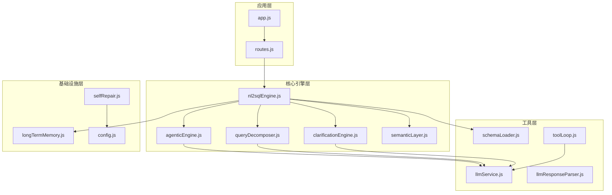

**图表来源**
- [app.js:97-194](file://backend/src/app.js#L97-L194)
- [routes.js:35-81](file://backend/src/core/routes.js#L35-L81)

**章节来源**
- [package.json:1-28](file://backend/package.json#L1-L28)
- [app.js:97-194](file://backend/src/app.js#L97-L194)

## 核心组件

### NL2SQL核心引擎

NL2SQL核心引擎是整个系统的大脑，负责协调各个组件的工作。它实现了以下关键功能：

- **意图识别**：理解用户查询的深层含义
- **实体解析**：将模糊描述映射到具体ID
- **SQL生成**：基于理解生成准确的SQL语句
- **查询澄清**：处理不完整或歧义的查询
- **错误处理**：提供结构化的错误信息

### 四阶段Agent工作流

系统采用创新的四阶段Agent设计：

1. **规划阶段**：制定执行策略和目标
2. **动态意图分解**：将复杂查询拆分为可管理的单元
3. **澄清确认**：处理不确定性因素
4. **生成验证恢复**：执行并验证结果

### 澄清引擎

专门处理查询澄清的智能系统，能够：
- 检测何时需要澄清
- 生成友好的澄清问题
- 应用用户的澄清回答
- 管理多轮对话流程

**章节来源**
- [nl2sqlEngine.js:12-397](file://backend/src/core/nl2sqlEngine.js#L12-L397)
- [agenticEngine.js:49-651](file://backend/src/core/agenticEngine.js#L49-L651)
- [clarificationEngine.js:1-489](file://backend/src/core/clarificationEngine.js#L1-L489)

## 架构概览

系统采用分层架构，每层都有明确的职责分离：

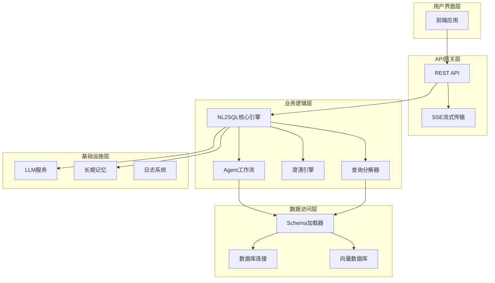

**图表来源**
- [routes.js:140-200](file://backend/src/core/routes.js#L140-L200)
- [app.js:139-194](file://backend/src/app.js#L139-L194)

## 详细组件分析

### NL2SQL核心引擎详解

NL2SQL核心引擎是整个系统的核心，实现了完整的自然语言到SQL转换流程：

#### 核心数据结构

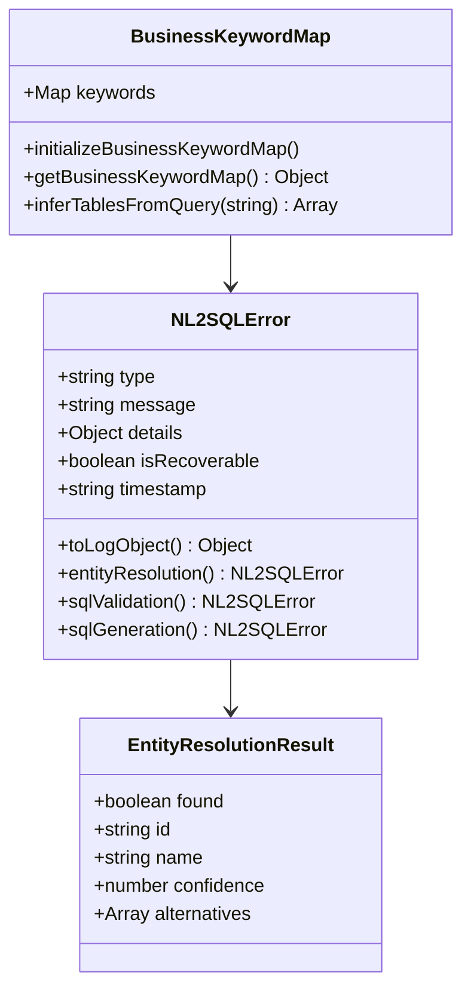

**图表来源**
- [nl2sqlEngine.js:227-297](file://backend/src/core/nl2sqlEngine.js#L227-L297)
- [nl2sqlEngine.js:69-120](file://backend/src/core/nl2sqlEngine.js#L69-L120)

#### 实体解析机制

系统实现了多层次的实体解析策略：

1. **数据库连接检查**：确保数据库可用性
2. **实体类型识别**：区分游戏、渠道等不同类型
3. **模糊匹配**：处理近似匹配场景
4. **歧义处理**：当存在多个候选时请求澄清

#### 实体解析流程

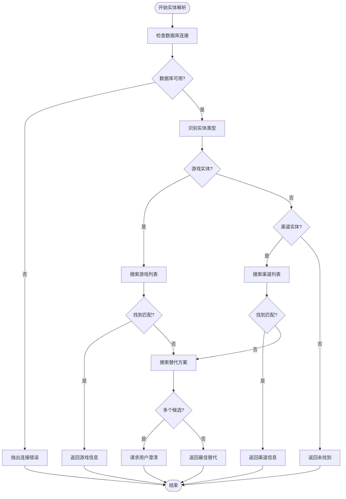

**图表来源**
- [nl2sqlEngine.js:311-365](file://backend/src/core/nl2sqlEngine.js#L311-L365)

**章节来源**
- [nl2sqlEngine.js:303-629](file://backend/src/core/nl2sqlEngine.js#L303-L629)

### 四阶段Agent工作流

Agent工作流是系统的核心执行引擎，实现了完整的自动化查询处理流程：

#### 阶段划分

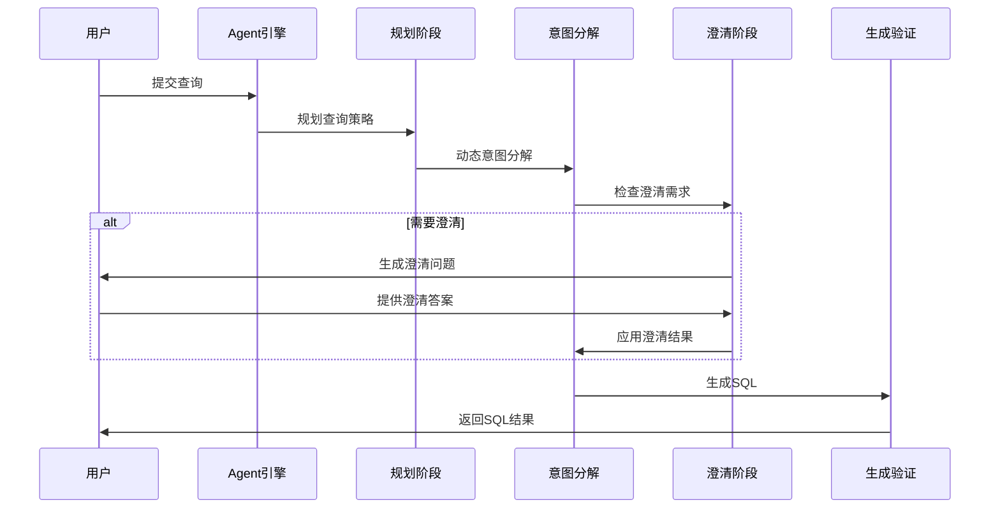

**图表来源**
- [agenticEngine.js:68-178](file://backend/src/core/agenticEngine.js#L68-L178)

#### 阶段详细流程

**阶段1：规划与Schema发现**
- 制定查询执行计划
- 使用工具探索Schema结构
- 生成Level 1索引

**阶段2：动态意图分解**
- 将复杂查询拆分为数据单元
- 识别实体、筛选条件、聚合指标
- 为每个单元独立检索相关表

**阶段3：澄清与确认**
- 检测查询中的不确定性
- 生成友好的澄清问题
- 应用用户的澄清回答

**阶段4：生成、验证与恢复**
- 生成SQL查询语句
- 验证SQL语法和安全性
- 处理错误并尝试恢复

**章节来源**
- [agenticEngine.js:187-618](file://backend/src/core/agenticEngine.js#L187-L618)

### 澄清引擎机制

澄清引擎专门处理查询中的不确定性，确保获得准确的查询意图：

#### 澄清触发条件

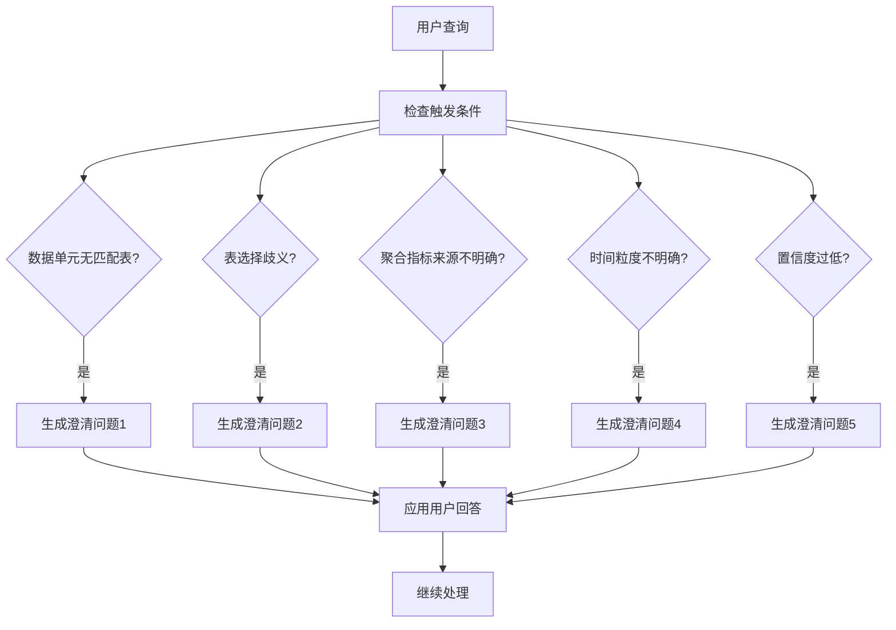

**图表来源**
- [clarificationEngine.js:26-182](file://backend/src/core/clarificationEngine.js#L26-L182)

#### 澄清问题生成

澄清引擎能够根据不同类型的不确定性生成相应的问题：

1. **数据单元无匹配表**：询问具体的数据需求
2. **表选择歧义**：确认数据来源类型
3. **聚合指标来源不明确**：选择实时计算或预汇总数据
4. **时间粒度不明确**：确定统计的时间维度
5. **置信度过低**：请求更多细节信息

**章节来源**
- [clarificationEngine.js:188-489](file://backend/src/core/clarificationEngine.js#L188-L489)

### 查询分解器

查询分解器负责将复杂的自然语言查询拆分为可独立处理的数据需求单元：

#### 分解策略

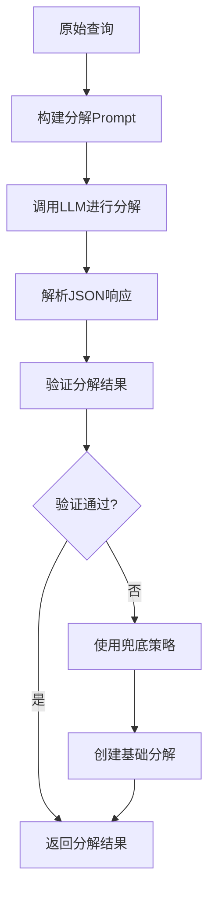

**图表来源**
- [queryDecomposer.js:38-70](file://backend/src/core/queryDecomposer.js#L38-L70)

#### 数据单元类型

查询分解器支持多种数据单元类型：
- **基础属性筛选**：game_id、平台、渠道等维度筛选
- **时间范围筛选**：注册时间、登录时间等时间条件
- **聚合指标筛选**：累计充值、总消费等聚合条件
- **行为序列筛选**：特定日期的行为模式
- **输出字段需求**：需要返回的字段列表

**章节来源**
- [queryDecomposer.js:24-398](file://backend/src/core/queryDecomposer.js#L24-L398)

### 业务语义层

业务语义层提供了业务概念到技术实现的映射能力：

#### 概念匹配机制

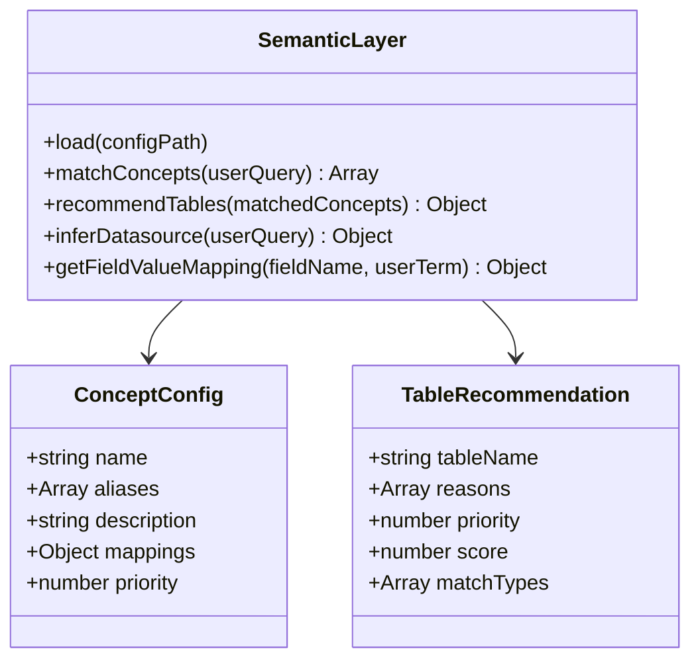

**图表来源**
- [semanticLayer.js:48-122](file://backend/src/core/semanticLayer.js#L48-L122)

#### 数据源映射

系统支持多种数据源映射：
- **老平台** → `new_tzpingtaiold`
- **新平台** → `new_tzpingtai`
- **注册** → `tzpingtai_tz_sdk_log_pf_reg`
- **充值** → `tzpingtai_tz_sdk_log_pf_order`
- **登录** → `tzpingtai_tz_sdk_log_pf_login`

**章节来源**
- [semanticLayer.js:48-532](file://backend/src/core/semanticLayer.js#L48-L532)

### 长期记忆系统

长期记忆系统负责用户偏好和查询模式的学习与存储：

#### 存储策略

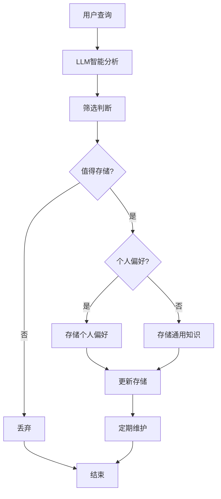

**图表来源**
- [longTermMemory.js:58-190](file://backend/src/memory/longTermMemory.js#L58-L190)

#### 偏好类型

系统识别多种偏好类型：
- **字段别名**：用户为数据库字段起的别名
- **分析习惯**：用户习惯查看的维度组合
- **业务逻辑定义**：用户定义的通用计算口径
- **通用知识**：任何人都会问的通用定义

**章节来源**
- [longTermMemory.js:28-44](file://backend/src/memory/longTermMemory.js#L28-L44)

## 依赖关系分析

系统采用松耦合设计，通过清晰的接口定义实现模块间的交互：

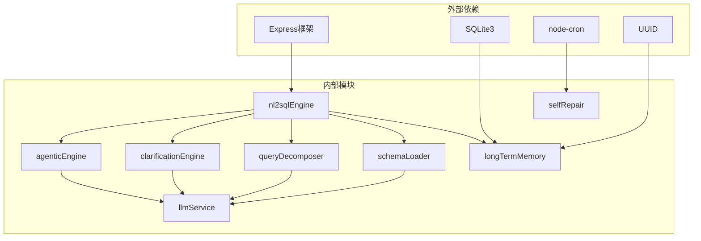

**图表来源**
- [package.json:10-23](file://backend/package.json#L10-L23)

### 核心依赖关系

1. **配置管理**：所有模块共享统一的配置系统
2. **日志系统**：提供统一的日志记录机制
3. **数据库连接**：通过统一的数据库抽象层访问
4. **LLM服务**：所有AI相关功能的统一入口

**章节来源**
- [config.js:16-398](file://backend/src/core/config.js#L16-L398)

## 性能考虑

系统在设计时充分考虑了性能优化：

### Token预算管理

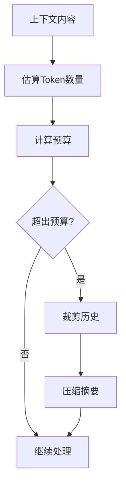

**图表来源**
- [context-management.test.js:70-103](file://backend/test/context-management.test.js#L70-L103)

### 缓存策略

1. **Schema缓存**：避免重复加载元数据
2. **向量缓存**：存储表级向量表示
3. **查询结果缓存**：缓存常用查询结果
4. **配置缓存**：缓存配置文件内容

### 并发处理

系统支持多用户并发查询：
- **连接池管理**：数据库连接池优化
- **队列管理**：查询排队和优先级处理
- **资源隔离**：用户会话隔离

## 故障排除指南

### 常见错误类型

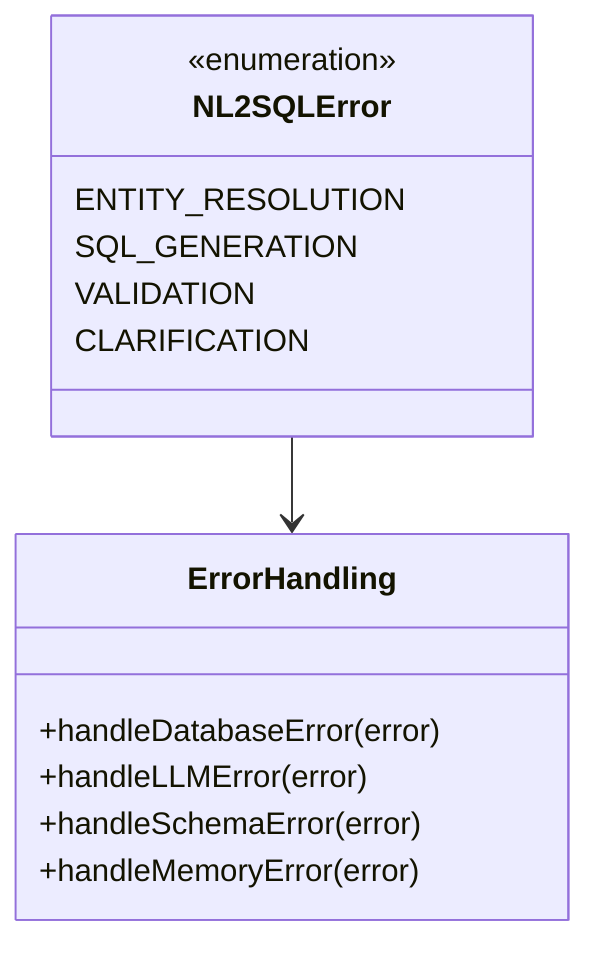

**图表来源**
- [nl2sqlEngine.js:227-297](file://backend/src/core/nl2sqlEngine.js#L227-L297)

### 错误恢复策略

1. **数据库连接失败**：重试连接并记录错误
2. **LLM API调用失败**：指数退避重试
3. **Schema加载失败**：使用缓存数据回退
4. **内存不足**：触发垃圾回收和内存清理

**章节来源**
- [selfRepair.js:169-310](file://backend/src/core/selfRepair.js#L169-L310)

## 结论

NL2SQL核心引擎通过创新的四阶段Agent工作流设计，实现了智能化的自然语言到SQL转换。系统的主要优势包括：

1. **智能化程度高**：通过多阶段处理和澄清机制，能够处理复杂的查询场景
2. **可扩展性强**：模块化设计支持功能扩展和定制
3. **可靠性高**：完善的错误处理和自修复机制
4. **性能优秀**：通过缓存、并发处理等优化技术提升性能

该系统为数据分析和商业智能领域提供了强大的自然语言查询能力，能够显著降低数据查询的技术门槛，提升用户体验。

## 附录

### 使用示例

#### 基本查询处理

```javascript
// 基本查询处理流程
const userQuery = "查询2024年1月的游戏充值情况";
const context = {
    userId: "user123",
    sessionId: "session456",
    history: []
};

try {
    const result = await nl2sqlEngine.processQuery(userQuery, context);
    console.log("SQL生成结果:", result.sql);
} catch (error) {
    console.error("查询处理失败:", error.message);
}
```

#### 澄清处理流程

```javascript
// 澄清处理示例
const clarificationResult = await clarificationEngine.checkClarificationNeeded(
    decomposition,
    tableCandidates,
    0.8
);

if (clarificationResult.needsClarification) {
    const clarification = await clarificationEngine.generateClarification(
        decomposition,
        tableCandidates,
        clarificationResult.topTrigger
    );
    
    // 用户回答澄清问题
    const updatedDecomposition = await clarificationEngine.applyClarificationResult(
        decomposition,
        clarification,
        userAnswer
    );
}
```

### 配置选项

系统支持丰富的配置选项，可通过环境变量进行配置：

- **LLM API配置**：模型选择、超时设置、重试机制
- **数据库配置**：连接池、查询超时、行数限制
- **安全配置**：表白名单、禁止关键字、敏感字段脱敏
- **会话配置**：历史轮数、过期时间、清理间隔
- **日志配置**：日志级别、文件输出、轮转策略

**章节来源**
- [config.js:55-354](file://backend/src/core/config.js#L55-L354)