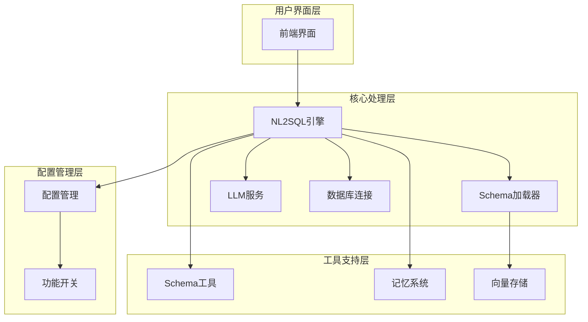
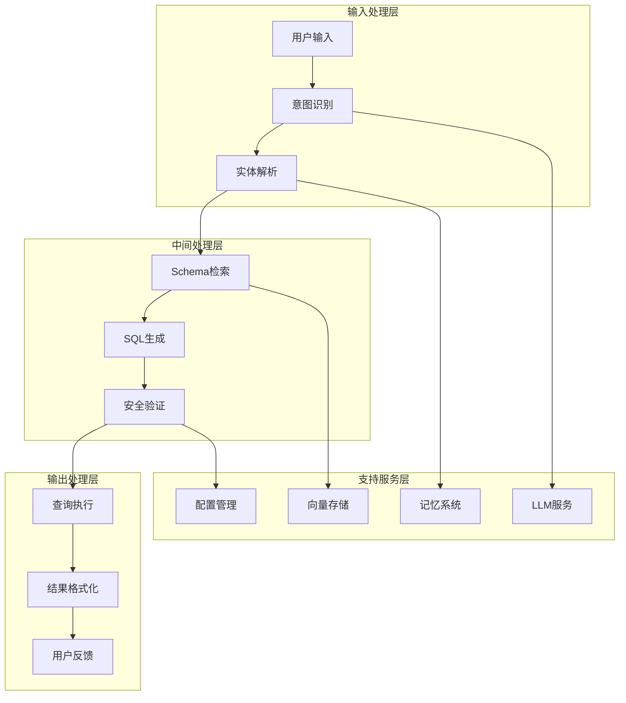
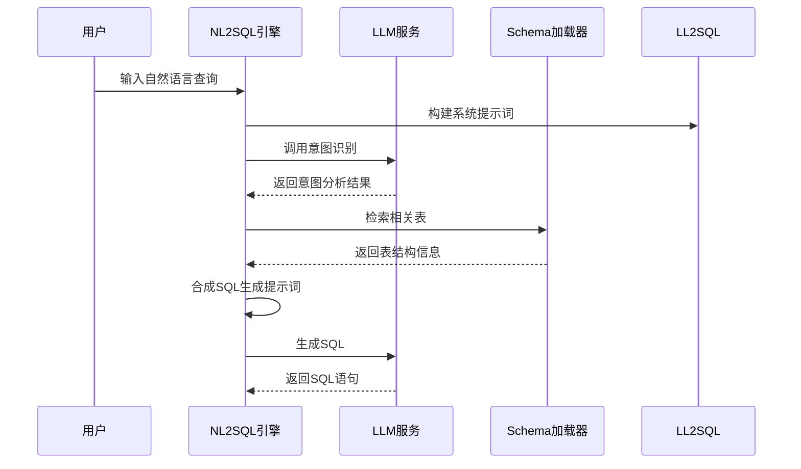
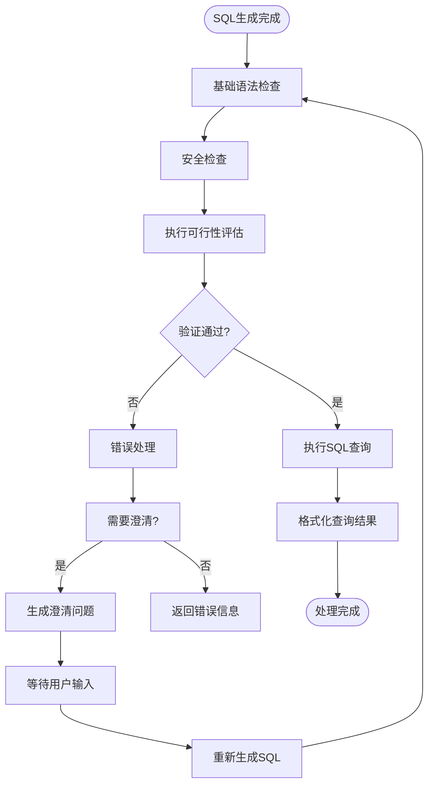
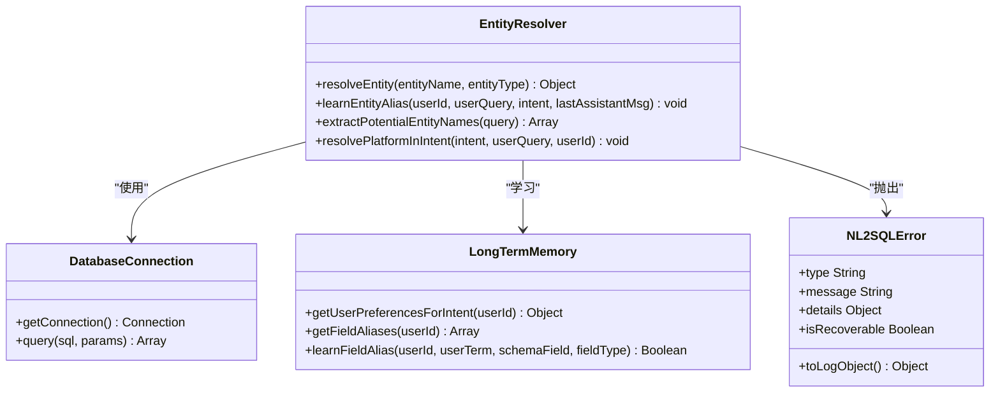
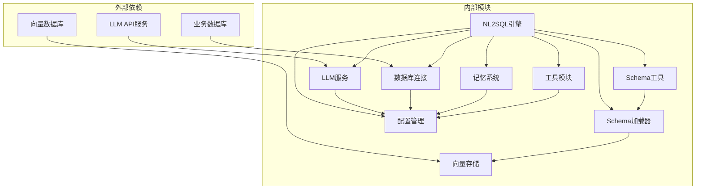

# SQL生成与验证

<cite>
**本文档引用的文件**
- [nl2sqlEngine.js](file://backend/src/core/nl2sqlEngine.js)
- [schemaLoader.js](file://backend/src/core/schemaLoader.js)
- [schemaTools.js](file://backend/src/core/schemaTools.js)
- [config.js](file://backend/src/core/config.js)
- [feature-flags.js](file://backend/config/feature-flags.js)
- [schema-metadata.json](file://backend/config/schema-metadata.json)
- [llmResponseParser.js](file://backend/src/utils/llmResponseParser.js)
- [evaluation.js](file://backend/src/utils/evaluation.js)
- [clarificationEngine.js](file://backend/src/core/clarificationEngine.js)
- [queryDecomposer.js](file://backend/src/core/queryDecomposer.js)
- [selfRepair.js](file://backend/src/core/selfRepair.js)
</cite>

## 目录
1. [简介](#简介)
2. [项目结构](#项目结构)
3. [核心组件](#核心组件)
4. [架构概览](#架构概览)
5. [详细组件分析](#详细组件分析)
6. [依赖关系分析](#依赖关系分析)
7. [性能考量](#性能考量)
8. [故障排除指南](#故障排除指南)
9. [结论](#结论)

## 简介

NL2SQL引擎是一个智能化的自然语言到SQL转换系统，专注于将用户的自然语言查询转换为精确、安全、高效的SQL语句。该系统采用多阶段处理架构，结合机器学习、向量化检索和严格的验证机制，确保生成的SQL既准确又安全。

系统的核心功能包括：
- **意图识别**：理解用户查询的深层含义和业务需求
- **实体解析**：将模糊的用户输入映射到精确的数据库字段
- **SQL生成**：基于意图和Schema信息生成标准SQL语句
- **安全验证**：多层次的安全检查和权限控制
- **执行优化**：智能的查询优化和性能调优

## 项目结构

NL2SQL引擎采用模块化设计，主要分为以下几个核心层次：

**图表来源**
- [nl2sqlEngine.js:1-50](file://backend/src/core/nl2sqlEngine.js#L1-L50)
- [schemaLoader.js:1-50](file://backend/src/core/schemaLoader.js#L1-L50)
- [config.js:1-50](file://backend/src/core/config.js#L1-L50)

**章节来源**
- [nl2sqlEngine.js:1-100](file://backend/src/core/nl2sqlEngine.js#L1-L100)
- [schemaLoader.js:1-100](file://backend/src/core/schemaLoader.js#L1-L100)
- [config.js:1-100](file://backend/src/core/config.js#L1-L100)

## 核心组件

### NL2SQL引擎核心模块

NL2SQL引擎是整个系统的核心，负责协调各个组件完成从自然语言到SQL的完整转换过程。

**主要职责**：
- 意图识别和分析
- 实体解析和映射
- SQL生成和优化
- 安全验证和执行
- 结果格式化和反馈

**关键特性**：
- 支持多轮对话和上下文理解
- 智能的表检索和Schema匹配
- 严格的SQL安全检查
- 可恢复的错误处理机制

### Schema加载器

Schema加载器负责管理和维护数据库的元数据信息，提供智能的表检索和字段匹配功能。

**核心功能**：
- Schema元数据的加载和验证
- 向量化表结构信息
- 智能表检索和匹配
- 字段级别的语义理解

### LLM服务集成

系统集成了强大的语言模型服务，用于处理复杂的自然语言理解和SQL生成任务。

**主要能力**：
- 意图识别和解析
- SQL生成和优化
- 澄清问题生成
- 结果格式化

**章节来源**
- [nl2sqlEngine.js:1556-1951](file://backend/src/core/nl2sqlEngine.js#L1556-L1951)
- [schemaLoader.js:69-131](file://backend/src/core/schemaLoader.js#L69-L131)
- [config.js:60-87](file://backend/src/core/config.js#L60-L87)

## 架构概览

NL2SQL引擎采用分层架构设计，确保系统的可扩展性和可维护性：

**图表来源**
- [nl2sqlEngine.js:886-1221](file://backend/src/core/nl2sqlEngine.js#L886-L1221)
- [schemaLoader.js:571-653](file://backend/src/core/schemaLoader.js#L571-L653)

## 详细组件分析

### SQL生成算法详解

SQL生成是NL2SQL引擎的核心功能，采用多阶段、多策略的方法确保生成的SQL既准确又高效。

#### 1. 意图识别阶段

系统首先通过LLM服务对用户查询进行深入分析，提取关键的业务信息：

**图表来源**
- [nl2sqlEngine.js:886-1221](file://backend/src/core/nl2sqlEngine.js#L886-L1221)
- [nl2sqlEngine.js:1566-1951](file://backend/src/core/nl2sqlEngine.js#L1566-L1951)

#### 2. 实体解析机制

系统实现了智能的实体解析功能，能够将模糊的用户输入映射到精确的数据库字段：

**解析策略**：
- **长期记忆学习**：从用户历史交互中学习实体映射关系
- **数据库模糊匹配**：在实体表中进行智能搜索和匹配
- **歧义处理**：自动识别和处理多义性实体
- **自动学习**：从澄清对话中自动学习新的实体映射

#### 3. SQL生成优化

系统采用多种优化策略确保生成的SQL既准确又高效：

**优化技术**：
- **表选择优化**：基于查询语义智能选择相关表
- **字段映射优化**：自动将业务术语映射到正确的数据库字段
- **查询结构优化**：使用CTE和适当的JOIN策略
- **性能优化**：添加LIMIT限制和适当的索引提示

**章节来源**
- [nl2sqlEngine.js:1556-1951](file://backend/src/core/nl2sqlEngine.js#L1556-L1951)
- [schemaLoader.js:571-653](file://backend/src/core/schemaLoader.js#L571-L653)

### SQL验证机制

NL2SQL引擎实施了多层次的安全验证机制，确保生成的SQL既安全又合规。

#### 1. 语法检查

系统首先进行基本的SQL语法检查：

**检查内容**：
- 语句类型验证（仅允许SELECT查询）
- 语法结构完整性
- 关键字使用规范
- 语句结构合理性

#### 2. 安全性验证

实施严格的安全检查防止恶意SQL注入：

**安全检查**：
- 禁止操作关键字检测
- 表访问权限验证
- 字段访问权限控制
- 参数绑定验证

#### 3. 执行可行性评估

系统评估SQL的执行可行性：

**评估维度**：
- 查询复杂度评估
- 性能影响分析
- 资源消耗预测
- 执行时间估算

**图表来源**
- [nl2sqlEngine.js:1953-1997](file://backend/src/core/nl2sqlEngine.js#L1953-L1997)
- [schemaLoader.js:716-781](file://backend/src/core/schemaLoader.js#L716-L781)

**章节来源**
- [nl2sqlEngine.js:1953-1997](file://backend/src/core/nl2sqlEngine.js#L1953-L1997)
- [schemaLoader.js:716-781](file://backend/src/core/schemaLoader.js#L716-L781)

### 实体解析功能

实体解析是NL2SQL引擎的重要组成部分，负责将用户的自然语言输入映射到精确的数据库实体。

#### 1. 解析策略

系统采用多层解析策略：

**策略层次**：
- **长期记忆解析**：优先使用用户历史学习的映射关系
- **数据库解析**：在实体表中进行智能搜索和匹配
- **业务规则解析**：基于预定义的业务规则进行映射
- **歧义处理**：自动识别和处理多义性实体

#### 2. 学习机制

系统具备强大的学习能力：

**学习类型**：
- **字段别名学习**：学习用户对字段的个性化称呼
- **实体映射学习**：学习游戏名称、渠道名称等实体映射
- **查询模式学习**：学习用户的查询习惯和偏好
- **业务概念学习**：学习业务术语的含义和用法

#### 3. 模糊匹配算法

系统实现了智能的模糊匹配算法：

**匹配技术**：
- **字符串相似度计算**
- **语义向量匹配**
- **业务领域规则**
- **上下文相关性分析**

**图表来源**
- [nl2sqlEngine.js:303-629](file://backend/src/core/nl2sqlEngine.js#L303-L629)

**章节来源**
- [nl2sqlEngine.js:303-629](file://backend/src/core/nl2sqlEngine.js#L303-L629)

### NL2SQLError异常体系

NL2SQL引擎实现了完善的异常处理机制，提供结构化的错误信息和恢复策略。

#### 1. 错误类型分类

**错误类型**：
- **ENTITY_RESOLUTION**：实体解析错误
- **VALIDATION**：SQL验证错误  
- **SQL_GENERATION**：SQL生成错误
- **EXECUTION**：查询执行错误
- **CLARIFICATION**：澄清处理错误

#### 2. 错误处理策略

**处理策略**：
- **可恢复错误**：提供澄清问题和解决方案
- **不可恢复错误**：返回详细的错误信息和建议
- **自动恢复**：在可能的情况下自动尝试修复
- **降级处理**：在错误情况下提供基础功能

#### 3. 恢复机制

系统具备多种恢复机制：

**恢复策略**：
- **澄清对话**：通过问答获取缺失信息
- **默认值应用**：使用合理的默认值继续处理
- **简化查询**：降低查询复杂度
- **备用方案**：提供替代的查询方案

**章节来源**
- [nl2sqlEngine.js:227-297](file://backend/src/core/nl2sqlEngine.js#L227-L297)

## 依赖关系分析

NL2SQL引擎的依赖关系体现了清晰的分层架构：

**图表来源**
- [nl2sqlEngine.js:15-34](file://backend/src/core/nl2sqlEngine.js#L15-L34)
- [schemaLoader.js:15-27](file://backend/src/core/schemaLoader.js#L15-L27)

**章节来源**
- [nl2sqlEngine.js:15-34](file://backend/src/core/nl2sqlEngine.js#L15-L34)
- [schemaLoader.js:15-27](file://backend/src/core/schemaLoader.js#L15-L27)

## 性能考量

NL2SQL引擎在设计时充分考虑了性能优化，采用多种策略确保系统的高效运行。

### 1. 向量化检索优化

系统使用向量数据库进行智能检索：

**优化技术**：
- **表级向量表示**：每个表生成单一向量，减少存储开销
- **智能搜索**：结合查询意图进行重排序
- **增量更新**：只更新变化的表向量
- **缓存机制**：避免重复计算

### 2. Schema缓存策略

系统实现了多级缓存机制：

**缓存层次**：
- **Schema元数据缓存**：缓存完整的Schema信息
- **向量向量缓存**：缓存表向量表示
- **查询结果缓存**：缓存相似查询的结果
- **会话历史缓存**：缓存对话摘要

### 3. Token预算管理

系统实施严格的Token预算控制：

**管理策略**：
- **上下文预算检查**：实时计算上下文Token使用量
- **智能压缩**：当预算不足时自动压缩历史记录
- **优先级排序**：优先保留重要的对话内容
- **动态调整**：根据查询复杂度动态调整预算

### 4. 并发处理优化

系统支持高并发处理：

**优化措施**：
- **异步处理**：使用Promise和async/await处理异步操作
- **连接池管理**：优化数据库连接使用
- **资源回收**：及时释放不再使用的资源
- **错误隔离**：防止单个请求影响整体性能

**章节来源**
- [schemaLoader.js:210-285](file://backend/src/core/schemaLoader.js#L210-L285)
- [nl2sqlEngine.js:2210-2257](file://backend/src/core/nl2sqlEngine.js#L2210-L2257)

## 故障排除指南

### 常见问题及解决方案

#### 1. SQL生成失败

**问题症状**：
- 生成的SQL语法错误
- 查询结果不符合预期
- 性能问题严重

**排查步骤**：
1. 检查意图识别准确性
2. 验证实体解析结果
3. 确认Schema映射正确性
4. 分析查询复杂度

**解决方案**：
- 提供澄清问题获取更多信息
- 简化查询条件
- 调整查询策略
- 检查数据库连接

#### 2. 安全验证失败

**问题症状**：
- SQL被拒绝执行
- 安全检查报错
- 权限不足

**排查步骤**：
1. 检查禁止关键字
2. 验证表访问权限
3. 确认字段访问权限
4. 检查参数绑定

**解决方案**：
- 修改SQL语句避免敏感操作
- 联系管理员获取权限
- 使用安全的查询方式
- 检查配置设置

#### 3. 实体解析错误

**问题症状**：
- 实体映射不准确
- 多义性实体未正确处理
- 学习效果不佳

**排查步骤**：
1. 检查长期记忆数据
2. 验证数据库实体表
3. 分析模糊匹配结果
4. 检查业务规则

**解决方案**：
- 提供澄清问题获取准确信息
- 手动纠正映射关系
- 更新业务规则
- 优化匹配算法

### 调试工具和技巧

#### 1. 日志分析

系统提供了丰富的日志信息：

**日志级别**：
- **TRACE**：详细执行步骤
- **DEBUG**：调试信息
- **INFO**：一般信息
- **WARN**：警告信息
- **ERROR**：错误信息

**分析要点**：
- 关注关键执行路径
- 检查参数传递
- 分析性能瓶颈
- 追踪错误源头

#### 2. 性能监控

系统内置了性能监控功能：

**监控指标**：
- 查询执行时间
- Token使用量
- 内存使用情况
- 数据库连接状态

**优化建议**：
- 分析慢查询日志
- 优化Schema查询
- 调整缓存策略
- 监控资源使用

**章节来源**
- [nl2sqlEngine.js:2138-2399](file://backend/src/core/nl2sqlEngine.js#L2138-L2399)
- [evaluation.js:1-100](file://backend/src/utils/evaluation.js#L1-L100)

## 结论

NL2SQL引擎是一个功能强大、设计精良的自然语言到SQL转换系统。通过采用多阶段处理架构、智能的实体解析机制和严格的安全验证体系，系统能够准确地将用户的自然语言查询转换为精确、安全、高效的SQL语句。

### 主要优势

1. **智能化程度高**：通过LLM服务实现深度的自然语言理解
2. **安全性保障**：多层次的安全检查确保系统安全
3. **可扩展性强**：模块化设计支持功能扩展和定制
4. **性能优化**：多种优化策略确保系统高效运行
5. **用户体验好**：智能的澄清机制和错误处理提升用户体验

### 技术特色

1. **向量化检索**：使用向量数据库实现智能表检索
2. **长期记忆**：学习用户习惯和偏好提升服务质量
3. **多层验证**：从语法到安全的全方位验证机制
4. **异常处理**：完善的错误处理和恢复机制
5. **性能监控**：内置的性能监控和优化工具

### 发展方向

未来的发展重点包括：
- 进一步提升LLM的准确性
- 优化向量化检索算法
- 增强异常处理能力
- 扩展支持更多数据库类型
- 提升系统的可扩展性

NL2SQL引擎为自然语言查询提供了可靠的技术解决方案，为用户提供了便捷、准确、安全的查询体验。