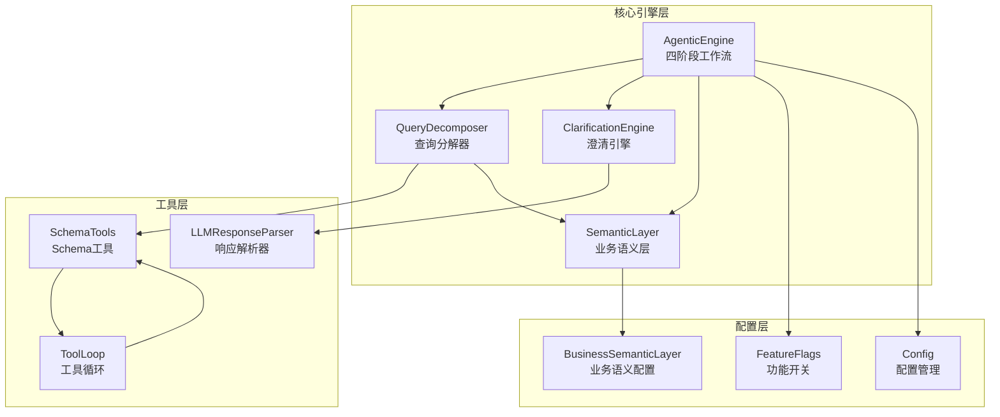
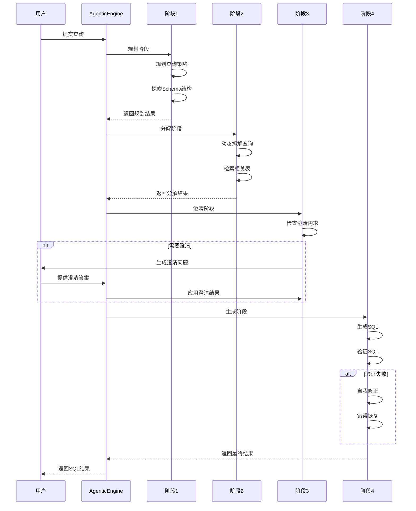
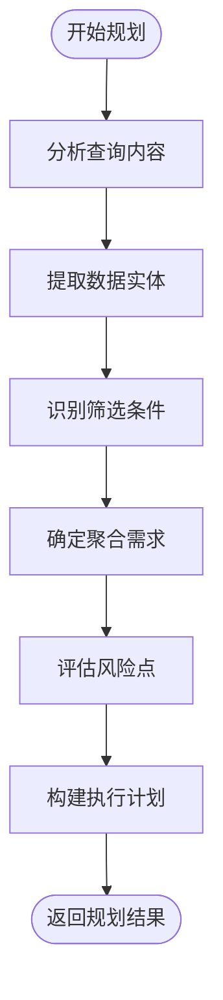
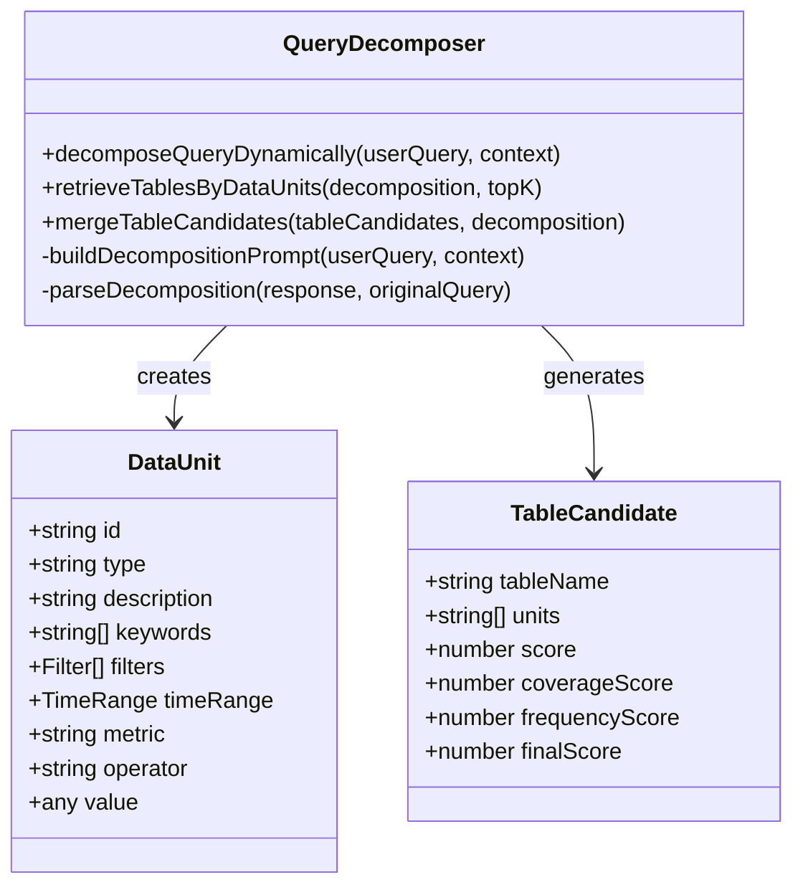
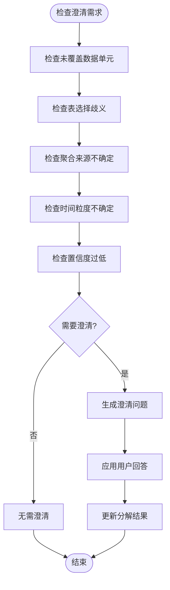
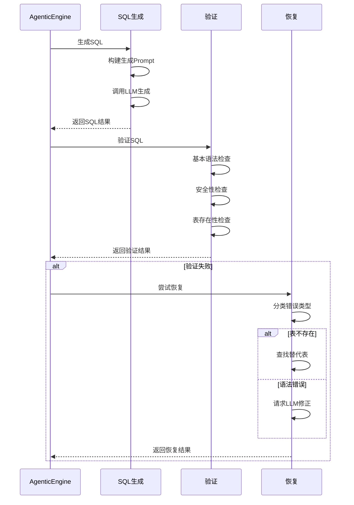
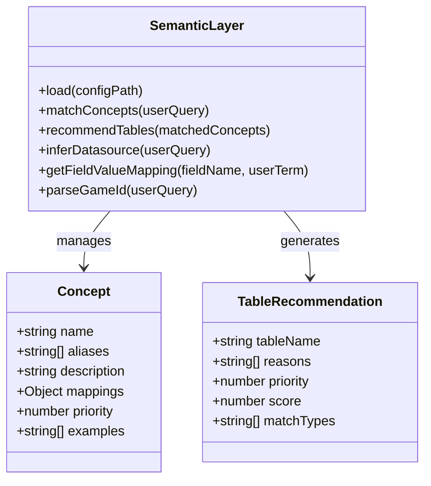
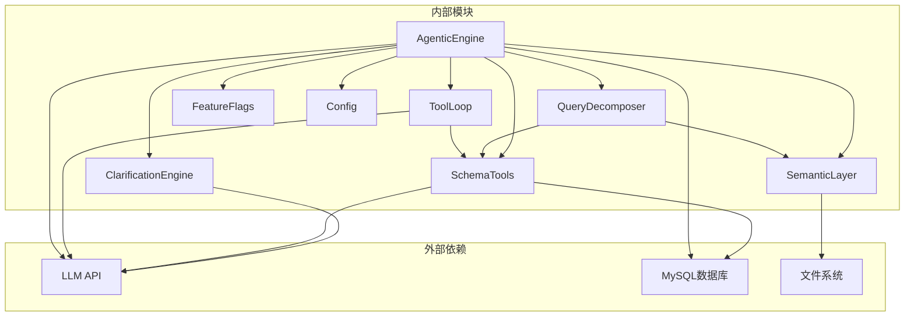
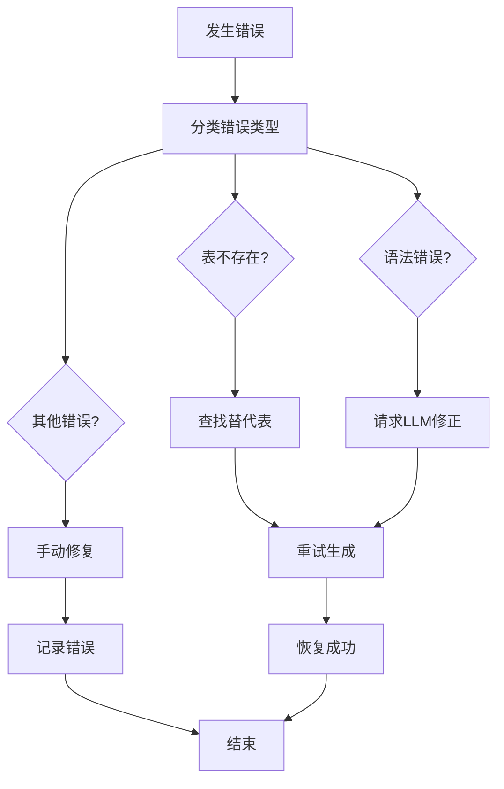

# 四阶段Agent工作流

<cite>
**本文档引用的文件**
- [agenticEngine.js](file://backend/src/core/agenticEngine.js)
- [nl2sqlEngine.js](file://backend/src/core/nl2sqlEngine.js)
- [semanticLayer.js](file://backend/src/core/semanticLayer.js)
- [schemaTools.js](file://backend/src/core/schemaTools.js)
- [toolLoop.js](file://backend/src/core/toolLoop.js)
- [clarificationEngine.js](file://backend/src/core/clarificationEngine.js)
- [queryDecomposer.js](file://backend/src/core/queryDecomposer.js)
- [feature-flags.js](file://backend/config/feature-flags.js)
- [config.js](file://backend/src/core/config.js)
- [business-semantic-layer.json](file://backend/config/business-semantic-layer.json)
- [schema-metadata.json](file://backend/config/schema-metadata.json)
- [llmResponseParser.js](file://backend/src/utils/llmResponseParser.js)
</cite>

## 目录
1. [简介](#简介)
2. [项目结构](#项目结构)
3. [核心组件](#核心组件)
4. [架构概览](#架构概览)
5. [详细组件分析](#详细组件分析)
6. [依赖关系分析](#依赖关系分析)
7. [性能考量](#性能考量)
8. [故障排除指南](#故障排除指南)
9. [结论](#结论)

## 简介

NL2SQL引擎的四阶段Agent工作流是一个智能化的自然语言到SQL转换系统，采用分阶段、可扩展的架构设计。该工作流通过四个独立的阶段实现从自然语言查询到可执行SQL的完整转换过程，每个阶段都有明确的职责分工和协作机制。

该系统的核心设计理念是"按需索取"和"多步推理"，通过工具循环机制让LLM能够主动探索数据库Schema，结合业务语义层实现智能表推荐，通过澄清机制处理不确定性，最终实现高精度的SQL生成和验证。

## 项目结构

NL2SQL引擎采用模块化架构，主要分为以下几个核心模块：

**图表来源**
- [agenticEngine.js:1-651](file://backend/src/core/agenticEngine.js#L1-L651)
- [schemaTools.js:1-632](file://backend/src/core/schemaTools.js#L1-L632)
- [toolLoop.js:1-521](file://backend/src/core/toolLoop.js#L1-L521)

**章节来源**
- [agenticEngine.js:1-651](file://backend/src/core/agenticEngine.js#L1-L651)
- [feature-flags.js:1-249](file://backend/config/feature-flags.js#L1-L249)

## 核心组件

### 四阶段工作流架构

NL2SQL引擎实现了完整的四阶段Agent工作流，每个阶段都有明确的功能定位：

1. **阶段1：规划与Schema探索** - 制定查询策略并探索数据库结构
2. **阶段2：动态意图分解** - 将复杂查询拆解为可独立处理的数据单元
3. **阶段3：澄清与确认** - 处理不确定性，主动询问用户以获得更多信息
4. **阶段4：生成与验证** - 生成SQL并进行安全验证和错误恢复

### Agent引擎核心功能

AgenticEngine作为整个工作流的协调者，负责：

- **阶段编排**：按照预定顺序执行四个阶段
- **状态管理**：维护查询处理过程中的状态信息
- **错误处理**：实现自我修正和错误恢复机制
- **进度监控**：提供详细的处理进度反馈

**章节来源**
- [agenticEngine.js:48-178](file://backend/src/core/agenticEngine.js#L48-L178)

## 架构概览

**图表来源**
- [agenticEngine.js:68-178](file://backend/src/core/agenticEngine.js#L68-L178)

## 详细组件分析

### 阶段1：规划与Schema探索

#### 规划阶段实现

规划阶段负责分析用户查询并制定执行策略：

**图表来源**
- [agenticEngine.js:187-228](file://backend/src/core/agenticEngine.js#L187-L228)

#### Schema探索机制

Schema探索通过工具循环实现，支持多种探索策略：

1. **工具循环模式**：LLM主动调用工具探索Schema
2. **Level 1索引**：使用简化的表索引进行初步筛选
3. **动态工具调用**：根据需要调用search_tables、describe_table等工具

**章节来源**
- [agenticEngine.js:233-262](file://backend/src/core/agenticEngine.js#L233-L262)
- [schemaTools.js:40-124](file://backend/src/core/schemaTools.js#L40-L124)

### 阶段2：动态意图分解

#### 查询分解器设计

查询分解器采用动态拆解策略，将复杂查询拆解为独立的数据需求单元：

**图表来源**
- [queryDecomposer.js:38-70](file://backend/src/core/queryDecomposer.js#L38-L70)
- [queryDecomposer.js:255-298](file://backend/src/core/queryDecomposer.js#L255-L298)

#### 数据单元合并策略

分解器采用多因子评分机制合并表候选：

1. **覆盖率评分**：表覆盖的数据单元比例
2. **频率评分**：表被检索到的次数
3. **综合评分**：加权计算最终得分

**章节来源**
- [queryDecomposer.js:348-382](file://backend/src/core/queryDecomposer.js#L348-L382)

### 阶段3：澄清与确认

#### 澄清引擎触发机制

澄清引擎通过多种触发条件判断是否需要用户澄清：

**图表来源**
- [clarificationEngine.js:196-232](file://backend/src/core/clarificationEngine.js#L196-L232)

#### 澄清问题生成

澄清引擎支持多种问题类型：

1. **表选择问题**：当存在多个可能的数据来源时
2. **指标来源问题**：当实时计算和预汇总数据冲突时
3. **时间粒度问题**：当统计粒度不明确时
4. **通用问题**：当置信度过低时

**章节来源**
- [clarificationEngine.js:246-272](file://backend/src/core/clarificationEngine.js#L246-L272)

### 阶段4：生成与验证

#### SQL生成与验证

阶段4实现完整的SQL生成、验证和恢复机制：

**图表来源**
- [agenticEngine.js:345-495](file://backend/src/core/agenticEngine.js#L345-L495)

#### 错误恢复策略

系统实现多层次的错误恢复机制：

1. **表不存在错误**：自动查找替代表
2. **语法错误**：请求LLM自动修正
3. **配置错误**：提供详细的错误信息和建议

**章节来源**
- [agenticEngine.js:516-611](file://backend/src/core/agenticEngine.js#L516-L611)

### 业务语义层集成

#### 语义层架构

业务语义层提供业务概念到技术实现的映射：

**图表来源**
- [semanticLayer.js:48-73](file://backend/src/core/semanticLayer.js#L48-L73)
- [semanticLayer.js:238-306](file://backend/src/core/semanticLayer.js#L238-L306)

#### 业务概念匹配

语义层支持多种匹配策略：

1. **精确匹配**：完全匹配业务概念名称
2. **别名匹配**：匹配概念的别名
3. **模糊匹配**：基于关键词的模糊匹配

**章节来源**
- [semanticLayer.js:177-214](file://backend/src/core/semanticLayer.js#L177-L214)

## 依赖关系分析

**图表来源**
- [agenticEngine.js:20-29](file://backend/src/core/agenticEngine.js#L20-L29)
- [schemaTools.js:17-19](file://backend/src/core/schemaTools.js#L17-L19)

### 功能开关配置

系统通过功能开关实现渐进式功能启用：

| Phase | 功能开关 | 描述 |
|-------|----------|------|
| Phase 1 | TOOL_AUGMENTED_SCHEMA | 工具化Schema探索 |
| Phase 1 | SCHEMA_LAYERED_LOADING | 分层Schema加载 |
| Phase 1 | TOOL_LOOP_MODE | 工具循环模式 |
| Phase 2 | DYNAMIC_INTENT_DECOMPOSITION | 动态意图拆解 |
| Phase 2 | BUSINESS_SEMANTIC_LAYER | 业务语义层 |
| Phase 3 | CLARIFICATION_ENGINE | 澄清机制 |
| Phase 4 | AGENTIC_ENGINE | 四阶段工作流 |
| Phase 4 | AUTO_RECOVERY | 自动恢复 |

**章节来源**
- [feature-flags.js:16-96](file://backend/config/feature-flags.js#L16-L96)

## 性能考量

### Token预算管理

系统实现了智能的Token预算管理机制：

- **上下文限制**：最大上下文Token数默认102400
- **输出预留**：为模型输出预留8192 Token
- **阈值监控**：80%触发警告，90%触发压缩
- **对话摘要**：超过8轮对话自动进行摘要

### 缓存策略

- **Schema缓存**：默认1小时过期时间
- **Level 1索引缓存**：极简版表索引缓存
- **向量数据库缓存**：LanceDB向量化存储

### 并发控制

- **连接池管理**：MySQL连接池最大10个连接
- **查询超时**：默认30秒查询超时
- **重试机制**：LLM请求最多3次重试

## 故障排除指南

### 常见问题诊断

1. **LLM响应解析失败**
   - 检查响应格式是否包含JSON代码块
   - 验证JSON结构的完整性
   - 查看日志中的响应预览信息

2. **Schema探索失败**
   - 确认数据库连接配置正确
   - 检查表权限设置
   - 验证Schema元数据配置

3. **SQL生成错误**
   - 检查生成Prompt的完整性
   - 验证表结构信息的准确性
   - 确认业务语义映射正确

### 错误恢复机制

系统提供多层次的错误恢复：

**图表来源**
- [agenticEngine.js:541-553](file://backend/src/core/agenticEngine.js#L541-L553)

**章节来源**
- [agenticEngine.js:516-611](file://backend/src/core/agenticEngine.js#L516-L611)

## 结论

NL2SQL引擎的四阶段Agent工作流通过精心设计的架构实现了智能化的自然语言到SQL转换。该系统的主要优势包括：

1. **模块化设计**：清晰的职责分离和模块边界
2. **可扩展性**：通过功能开关实现渐进式功能启用
3. **智能性**：结合业务语义层和工具循环实现智能决策
4. **可靠性**：完善的错误处理和恢复机制
5. **性能优化**：智能缓存、Token管理和并发控制

该工作流为复杂查询场景提供了强大的解决方案，通过四个阶段的协同工作，实现了从自然语言理解到SQL生成的完整自动化流程。系统的设计充分考虑了生产环境的需求，具备良好的可维护性和扩展性。