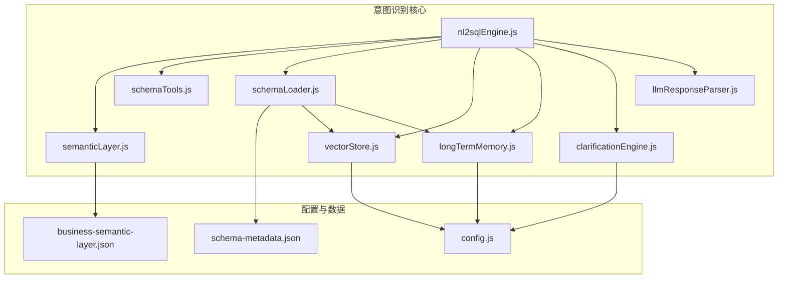
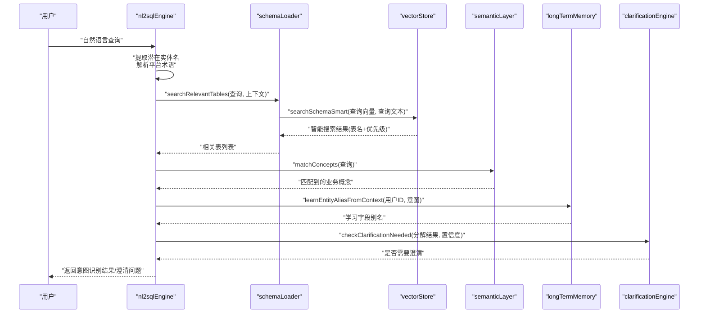
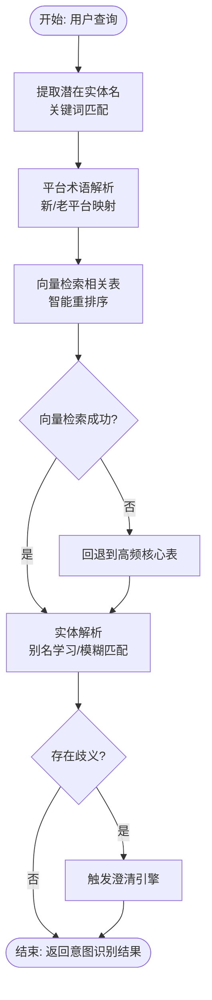
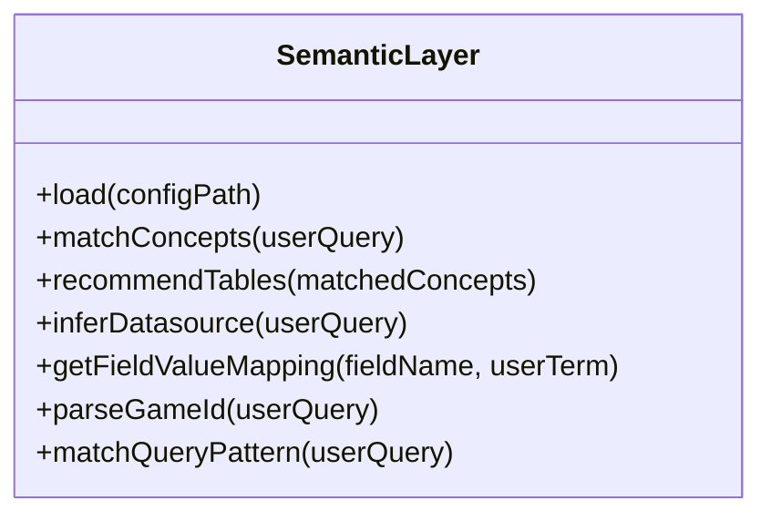
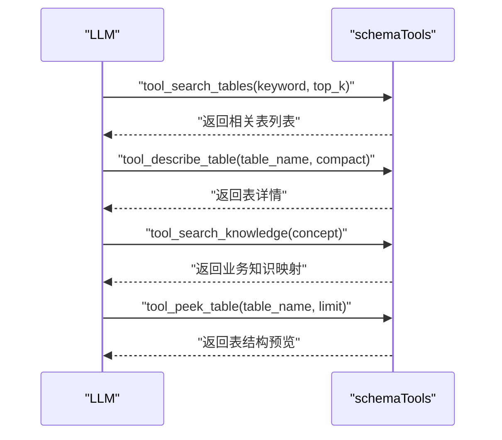
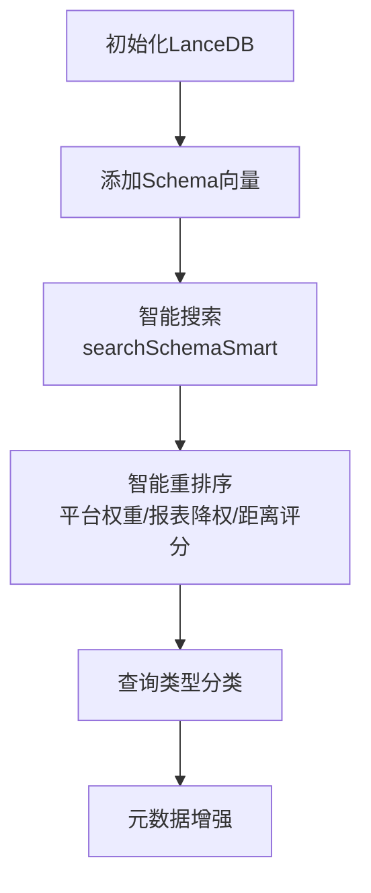
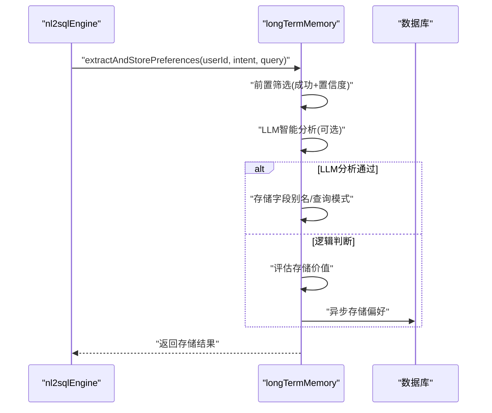
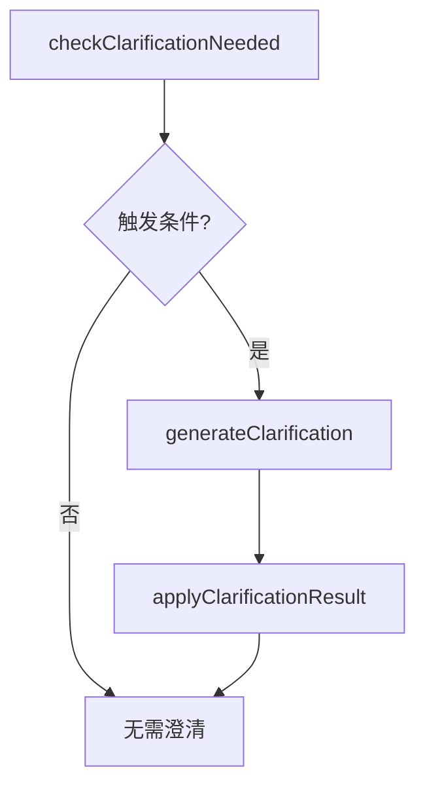
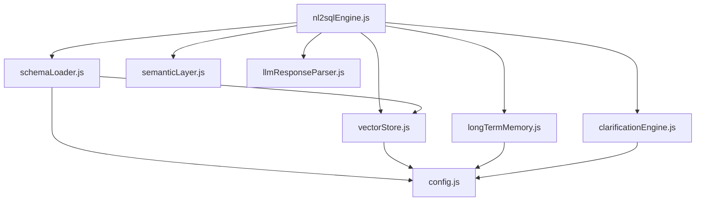

# 意图识别与理解

<cite>
**本文档引用的文件**
- [nl2sqlEngine.js](file://backend/src/core/nl2sqlEngine.js)
- [semanticLayer.js](file://backend/src/core/semanticLayer.js)
- [schemaTools.js](file://backend/src/core/schemaTools.js)
- [schemaLoader.js](file://backend/src/core/schemaLoader.js)
- [vectorStore.js](file://backend/src/memory/vectorStore.js)
- [longTermMemory.js](file://backend/src/memory/longTermMemory.js)
- [clarificationEngine.js](file://backend/src/core/clarificationEngine.js)
- [llmResponseParser.js](file://backend/src/utils/llmResponseParser.js)
- [business-semantic-layer.json](file://backend/config/business-semantic-layer.json)
- [schema-metadata.json](file://backend/config/schema-metadata.json)
- [config.js](file://backend/src/core/config.js)
</cite>

## 目录
1. [简介](#简介)
2. [项目结构](#项目结构)
3. [核心组件](#核心组件)
4. [架构概览](#架构概览)
5. [详细组件分析](#详细组件分析)
6. [依赖关系分析](#依赖关系分析)
7. [性能考量](#性能考量)
8. [故障排查指南](#故障排查指南)
9. [结论](#结论)

## 简介
本技术文档聚焦于NL2SQL引擎的意图识别模块，深入解析自然语言查询的意图解析算法，涵盖语义理解、业务需求识别、查询类型分类等核心功能。文档详细阐述业务关键词映射机制、平台术语解析功能（新老平台识别与数据源映射）、多轮对话上下文管理以及模糊查询处理策略。通过代码级分析与可视化图表，帮助开发者与产品人员全面理解NL2SQL引擎的意图识别能力与优化策略。

## 项目结构
NL2SQL后端采用模块化设计，意图识别模块位于核心层，围绕Schema元数据、向量存储、长期记忆与澄清引擎协同工作。关键目录与文件如下：
- 核心引擎：nl2sqlEngine.js（意图识别、实体解析、平台术语解析、表推荐）
- 业务语义层：semanticLayer.js（业务概念匹配、表推荐、数据源映射）
- Schema工具层：schemaTools.js（LLM可调用的Schema探索工具）
- Schema加载器：schemaLoader.js（Schema元数据加载、向量化、表搜索）
- 向量存储：vectorStore.js（LanceDB向量存储、智能搜索、查询类型分类）
- 长期记忆：longTermMemory.js（用户偏好提取、字段别名学习、LLM智能分析）
- 澄清引擎：clarificationEngine.js（澄清触发条件、问题生成、结果应用）
- LLM响应解析：llmResponseParser.js（统一JSON/SQL解析）
- 配置：config.js、business-semantic-layer.json、schema-metadata.json

**图表来源**
- [nl2sqlEngine.js:1-200](file://backend/src/core/nl2sqlEngine.js#L1-L200)
- [semanticLayer.js:1-120](file://backend/src/core/semanticLayer.js#L1-L120)
- [schemaTools.js:1-120](file://backend/src/core/schemaTools.js#L1-L120)
- [schemaLoader.js:1-120](file://backend/src/core/schemaLoader.js#L1-L120)
- [vectorStore.js:1-120](file://backend/src/memory/vectorStore.js#L1-L120)
- [longTermMemory.js:1-120](file://backend/src/memory/longTermMemory.js#L1-L120)
- [clarificationEngine.js:1-120](file://backend/src/core/clarificationEngine.js#L1-L120)
- [llmResponseParser.js:1-80](file://backend/src/utils/llmResponseParser.js#L1-L80)
- [business-semantic-layer.json:1-60](file://backend/config/business-semantic-layer.json#L1-L60)
- [schema-metadata.json:1-60](file://backend/config/schema-metadata.json#L1-L60)
- [config.js:1-120](file://backend/src/core/config.js#L1-L120)

**章节来源**
- [nl2sqlEngine.js:1-200](file://backend/src/core/nl2sqlEngine.js#L1-L200)
- [semanticLayer.js:1-120](file://backend/src/core/semanticLayer.js#L1-L120)
- [schemaTools.js:1-120](file://backend/src/core/schemaTools.js#L1-L120)
- [schemaLoader.js:1-120](file://backend/src/core/schemaLoader.js#L1-L120)
- [vectorStore.js:1-120](file://backend/src/memory/vectorStore.js#L1-L120)
- [longTermMemory.js:1-120](file://backend/src/memory/longTermMemory.js#L1-L120)
- [clarificationEngine.js:1-120](file://backend/src/core/clarificationEngine.js#L1-L120)
- [llmResponseParser.js:1-80](file://backend/src/utils/llmResponseParser.js#L1-L80)
- [business-semantic-layer.json:1-60](file://backend/config/business-semantic-layer.json#L1-L60)
- [schema-metadata.json:1-60](file://backend/config/schema-metadata.json#L1-L60)
- [config.js:1-120](file://backend/src/core/config.js#L1-L120)

## 核心组件
- 意图识别与实体解析：基于关键词匹配与向量检索推断表，解析游戏名、渠道名等实体，识别平台术语（新/老平台）。
- 业务语义层：将业务概念（注册、充值、登录等）映射到物理表/字段，支持别名识别与模糊匹配。
- Schema工具层：提供LLM可调用的Schema探索工具（搜索表、描述表、查询业务知识、查看表样例）。
- 向量存储与智能搜索：基于LanceDB实现Schema向量存储与语义检索，支持智能重排序与查询意图识别。
- 长期记忆：提取用户偏好（字段别名、查询模式、指标/维度偏好），支持LLM智能分析与异步存储。
- 澄清引擎：检测澄清需求、生成友好问题、应用用户回答，提升意图理解准确性。
- LLM响应解析：统一从LLM响应中提取JSON与SQL，提升稳定性与一致性。

**章节来源**
- [nl2sqlEngine.js:60-177](file://backend/src/core/nl2sqlEngine.js#L60-L177)
- [semanticLayer.js:120-210](file://backend/src/core/semanticLayer.js#L120-L210)
- [schemaTools.js:35-125](file://backend/src/core/schemaTools.js#L35-L125)
- [vectorStore.js:233-576](file://backend/src/memory/vectorStore.js#L233-L576)
- [longTermMemory.js:28-190](file://backend/src/memory/longTermMemory.js#L28-L190)
- [clarificationEngine.js:26-182](file://backend/src/core/clarificationEngine.js#L26-L182)
- [llmResponseParser.js:24-146](file://backend/src/utils/llmResponseParser.js#L24-L146)

## 架构概览
意图识别模块通过“关键词匹配 + 向量检索 + 业务语义层 + 长期记忆”的多层融合实现高精度意图理解。系统在Schema加载时将表级信息向量化，查询时结合用户上下文与历史偏好，动态调整表推荐与实体解析策略。

**图表来源**
- [nl2sqlEngine.js:132-151](file://backend/src/core/nl2sqlEngine.js#L132-L151)
- [schemaLoader.js:571-653](file://backend/src/core/schemaLoader.js#L571-L653)
- [vectorStore.js:452-576](file://backend/src/memory/vectorStore.js#L452-L576)
- [semanticLayer.js:134-167](file://backend/src/core/semanticLayer.js#L134-L167)
- [longTermMemory.js:344-461](file://backend/src/memory/longTermMemory.js#L344-L461)
- [clarificationEngine.js:196-232](file://backend/src/core/clarificationEngine.js#L196-L232)

## 详细组件分析

### 意图识别与实体解析（nl2sqlEngine）
- 业务关键词映射：从schema-metadata.json动态构建关键词到表的映射，支持热更新；通过关键词匹配推断可能表集合。
- 向量检索增强：优先使用向量检索获取相关表，失败时回退到高频核心表；支持智能重排序与查询意图识别。
- 实体解析：解析游戏名、渠道名等实体，优先使用长期记忆中的别名映射，其次数据库模糊匹配；处理歧义场景并触发澄清。
- 平台术语解析：识别“新平台/老平台”术语，映射到数据源标识（new_tzpingtai/new_tzpingtaiold），支持用户自定义映射学习。

**图表来源**
- [nl2sqlEngine.js:104-151](file://backend/src/core/nl2sqlEngine.js#L104-L151)
- [nl2sqlEngine.js:311-629](file://backend/src/core/nl2sqlEngine.js#L311-L629)
- [nl2sqlEngine.js:678-750](file://backend/src/core/nl2sqlEngine.js#L678-L750)

**章节来源**
- [nl2sqlEngine.js:60-177](file://backend/src/core/nl2sqlEngine.js#L60-L177)
- [nl2sqlEngine.js:311-750](file://backend/src/core/nl2sqlEngine.js#L311-L750)

### 业务语义层（semanticLayer）
- 业务概念匹配：支持精确匹配、别名匹配与模糊匹配，返回匹配分数与匹配类型。
- 表推荐：基于匹配到的概念推荐表，支持主表、平台表、游戏表与备选表，按优先级与分数排序。
- 数据源映射：根据概念推断数据源（如新平台/老平台），支持别名映射。
- 字段值映射：针对特定字段（如game_id、platform_type）提供用户术语到值的映射。

**图表来源**
- [semanticLayer.js:515-531](file://backend/src/core/semanticLayer.js#L515-L531)

**章节来源**
- [semanticLayer.js:1-120](file://backend/src/core/semanticLayer.js#L1-L120)
- [semanticLayer.js:120-210](file://backend/src/core/semanticLayer.js#L120-L210)
- [semanticLayer.js:238-331](file://backend/src/core/semanticLayer.js#L238-L331)
- [semanticLayer.js:342-386](file://backend/src/core/semanticLayer.js#L342-L386)
- [semanticLayer.js:399-464](file://backend/src/core/semanticLayer.js#L399-L464)
- [semanticLayer.js:476-509](file://backend/src/core/semanticLayer.js#L476-L509)

### Schema工具层（schemaTools）
- 工具定义：search_tables、describe_table、search_knowledge、peek_table，支持LLM函数调用格式。
- Level 1索引：仅包含表名+业务注释，用于初步筛选，带缓存与过期控制。
- 业务知识库：预定义平台、充值、注册、登录、聊天、创角、首充、留存、等级等概念映射。

**图表来源**
- [schemaTools.js:40-124](file://backend/src/core/schemaTools.js#L40-L124)
- [schemaTools.js:225-393](file://backend/src/core/schemaTools.js#L225-L393)
- [schemaTools.js:405-542](file://backend/src/core/schemaTools.js#L405-L542)

**章节来源**
- [schemaTools.js:1-120](file://backend/src/core/schemaTools.js#L1-L120)
- [schemaTools.js:135-173](file://backend/src/core/schemaTools.js#L135-L173)
- [schemaTools.js:225-393](file://backend/src/core/schemaTools.js#L225-L393)
- [schemaTools.js:405-542](file://backend/src/core/schemaTools.js#L405-L542)

### 向量存储与智能搜索（vectorStore）
- 初始化：连接LanceDB，创建schema_vectors与query_vectors表。
- Schema向量操作：添加、搜索、智能搜索（searchSchemaSmart），支持查询意图识别与重排序。
- 查询类型分类：基于查询文本与意图复杂度，自动分类为定义、对比、趋势、澄清、跟进、新话题等类型。
- 元数据增强：计算查询重要性评分、复杂度、执行信息等，用于长期记忆与评估。

**图表来源**
- [vectorStore.js:233-263](file://backend/src/memory/vectorStore.js#L233-L263)
- [vectorStore.js:338-369](file://backend/src/memory/vectorStore.js#L338-L369)
- [vectorStore.js:452-576](file://backend/src/memory/vectorStore.js#L452-L576)
- [vectorStore.js:93-132](file://backend/src/memory/vectorStore.js#L93-L132)
- [vectorStore.js:141-197](file://backend/src/memory/vectorStore.js#L141-L197)

**章节来源**
- [vectorStore.js:1-120](file://backend/src/memory/vectorStore.js#L1-L120)
- [vectorStore.js:233-576](file://backend/src/memory/vectorStore.js#L233-L576)
- [vectorStore.js:93-197](file://backend/src/memory/vectorStore.js#L93-L197)

### 长期记忆（longTermMemory）
- LLM智能分析：判断查询是否包含“知识增量”，区分个人偏好与通用知识，提取字段别名、分析习惯、过滤逻辑等。
- 存储筛选：基于置信度、维度/指标数量、使用频率等阈值判断是否存储。
- 字段别名学习：支持用户术语到Schema字段/值的映射，处理冲突与重复记录。
- 异步存储：通过内存队列异步存储查询模式、指标偏好、维度偏好。

**图表来源**
- [longTermMemory.js:299-461](file://backend/src/memory/longTermMemory.js#L299-L461)
- [longTermMemory.js:470-582](file://backend/src/memory/longTermMemory.js#L470-L582)

**章节来源**
- [longTermMemory.js:28-190](file://backend/src/memory/longTermMemory.js#L28-L190)
- [longTermMemory.js:299-582](file://backend/src/memory/longTermMemory.js#L299-L582)

### 澄清引擎（clarificationEngine）
- 触发条件：数据单元无匹配表、表选择歧义、聚合指标来源不明确、时间粒度不明确、低置信度等。
- 问题生成：基于查询分解与候选表，生成友好澄清问题，支持默认选项与解释。
- 结果应用：根据用户回答更新分解结果（表偏好、指标来源、时间粒度等）。

**图表来源**
- [clarificationEngine.js:196-232](file://backend/src/core/clarificationEngine.js#L196-L232)
- [clarificationEngine.js:246-272](file://backend/src/core/clarificationEngine.js#L246-L272)
- [clarificationEngine.js:388-426](file://backend/src/core/clarificationEngine.js#L388-L426)

**章节来源**
- [clarificationEngine.js:26-182](file://backend/src/core/clarificationEngine.js#L26-L182)
- [clarificationEngine.js:196-426](file://backend/src/core/clarificationEngine.js#L196-L426)

### LLM响应解析（llmResponseParser）
- JSON解析：支持直接解析、代码块提取、花括号平衡提取三种策略，提升鲁棒性。
- SQL提取：支持从JSON sql字段、代码块、正则匹配中提取SQL。

**章节来源**
- [llmResponseParser.js:24-146](file://backend/src/utils/llmResponseParser.js#L24-L146)

## 依赖关系分析
- 模块耦合：nl2sqlEngine高度依赖schemaLoader与vectorStore进行表推荐，依赖semanticLayer进行业务概念匹配，依赖longTermMemory进行偏好学习，依赖clarificationEngine进行澄清。
- 外部依赖：LanceDB向量数据库、SQLite数据库、LLM服务（OpenAI兼容API）。
- 配置驱动：config.js集中管理LLM、向量维度、数据库连接、安全策略、长期记忆阈值、上下文管理等。

**图表来源**
- [nl2sqlEngine.js:1-58](file://backend/src/core/nl2sqlEngine.js#L1-L58)
- [schemaLoader.js:1-27](file://backend/src/core/schemaLoader.js#L1-L27)
- [vectorStore.js:1-24](file://backend/src/memory/vectorStore.js#L1-L24)
- [longTermMemory.js:1-23](file://backend/src/memory/longTermMemory.js#L1-L23)
- [clarificationEngine.js:1-16](file://backend/src/core/clarificationEngine.js#L1-L16)
- [llmResponseParser.js:1-10](file://backend/src/utils/llmResponseParser.js#L1-L10)
- [config.js:1-120](file://backend/src/core/config.js#L1-L120)

**章节来源**
- [nl2sqlEngine.js:1-58](file://backend/src/core/nl2sqlEngine.js#L1-L58)
- [schemaLoader.js:1-27](file://backend/src/core/schemaLoader.js#L1-L27)
- [vectorStore.js:1-24](file://backend/src/memory/vectorStore.js#L1-L24)
- [longTermMemory.js:1-23](file://backend/src/memory/longTermMemory.js#L1-L23)
- [clarificationEngine.js:1-16](file://backend/src/core/clarificationEngine.js#L1-L16)
- [llmResponseParser.js:1-10](file://backend/src/utils/llmResponseParser.js#L1-L10)
- [config.js:1-120](file://backend/src/core/config.js#L1-L120)

## 性能考量
- 向量检索优化：表级向量（每个表仅一个向量）相比字段级向量显著减少向量数量与存储开销；智能重排序结合平台权重与报表降权，提升检索质量。
- 缓存策略：Schema Level 1索引缓存、配置校验、向量数据库初始化状态检查，避免重复计算与I/O。
- Token预算与上下文管理：通过上下文管理配置控制最大上下文Token数、输出预留、摘要触发轮数等，防止大模型调用超时。
- 异步存储：长期记忆通过内存队列异步存储，避免阻塞主线程。

[本节为通用指导，无需特定文件引用]

## 故障排查指南
- 向量数据库未初始化：检查LanceDB路径与权限，确认初始化日志与warn信息。
- Schema向量缺失：确认SCHEMA_REVECTORIZE配置，或检查向量表是否已存在。
- LLM响应解析失败：检查响应格式，确认是否包含JSON代码块或SQL代码块。
- 长期记忆存储失败：检查用户ID、偏好类型与阈值配置，确认数据库连接与异步队列状态。
- 澄清引擎问题：检查触发条件配置与默认澄清模板，确认LLM生成的JSON格式。

**章节来源**
- [vectorStore.js:258-263](file://backend/src/memory/vectorStore.js#L258-L263)
- [vectorStore.js:770-783](file://backend/src/memory/vectorStore.js#L770-L783)
- [llmResponseParser.js:24-59](file://backend/src/utils/llmResponseParser.js#L24-L59)
- [longTermMemory.js:457-461](file://backend/src/memory/longTermMemory.js#L457-L461)
- [clarificationEngine.js:266-272](file://backend/src/core/clarificationEngine.js#L266-L272)

## 结论
NL2SQL引擎的意图识别模块通过“关键词匹配 + 向量检索 + 业务语义层 + 长期记忆 + 澄清引擎”的多层融合，实现了高精度的自然语言理解与业务需求识别。系统在保证准确性的同时，通过缓存、异步存储、智能重排序等策略优化性能，并提供完善的错误处理与故障排查机制。建议在生产环境中启用长期记忆与向量检索，合理配置阈值与上下文管理参数，持续优化业务语义层配置与Schema元数据，以进一步提升意图识别效果与用户体验。