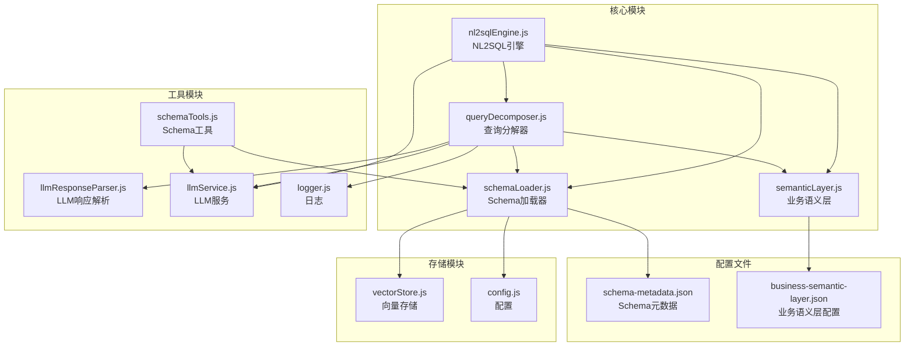
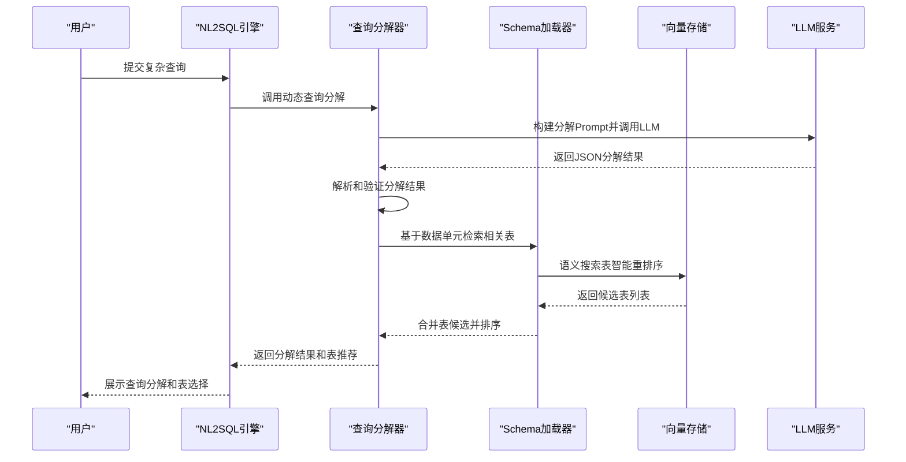
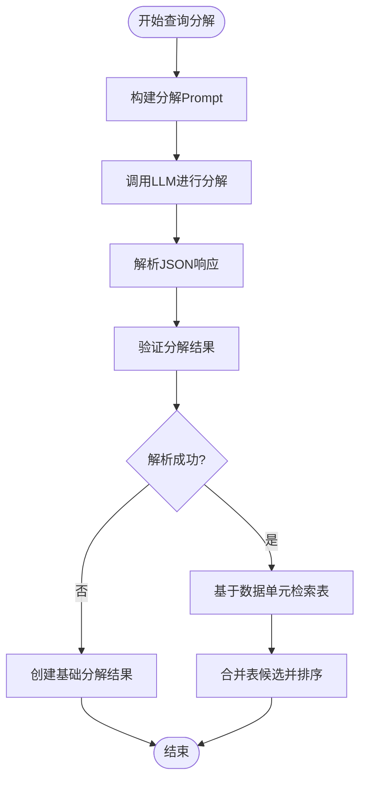
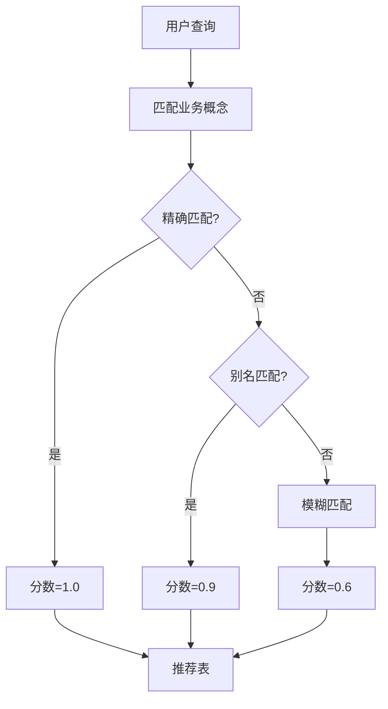
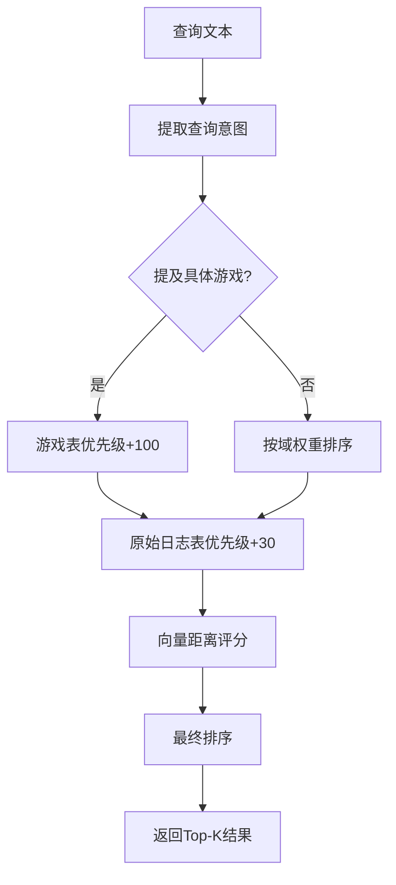
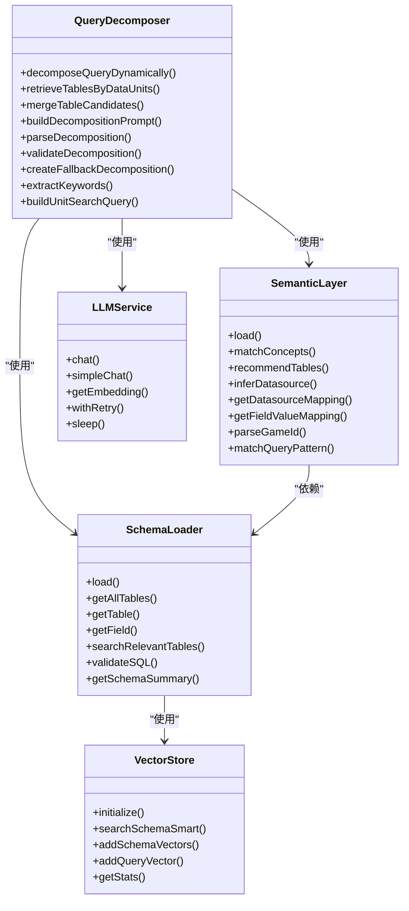
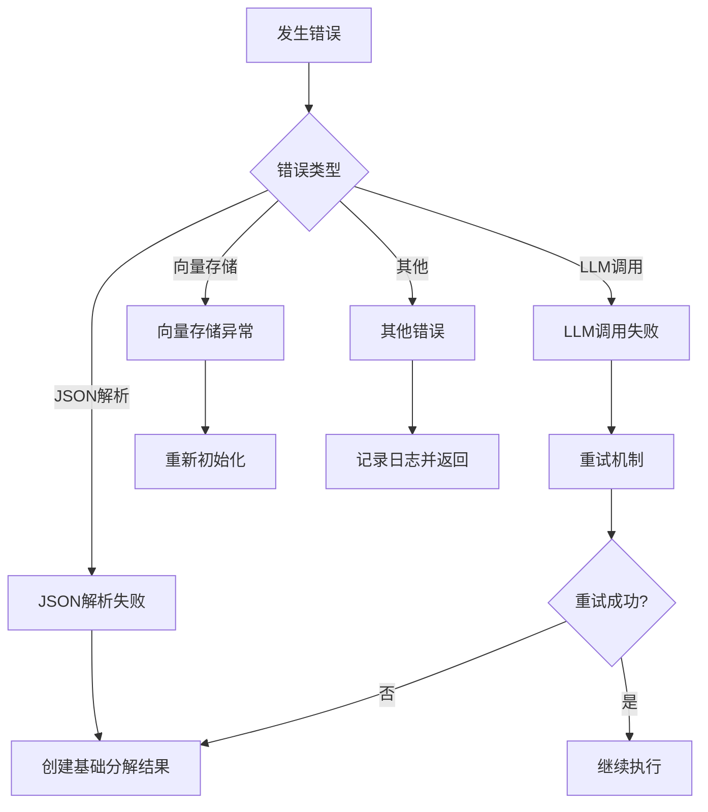

# 查询分解与优化

<cite>
**本文档引用的文件**
- [queryDecomposer.js](file://backend/src/core/queryDecomposer.js)
- [nl2sqlEngine.js](file://backend/src/core/nl2sqlEngine.js)
- [schemaTools.js](file://backend/src/core/schemaTools.js)
- [schemaLoader.js](file://backend/src/core/schemaLoader.js)
- [semanticLayer.js](file://backend/src/core/semanticLayer.js)
- [llmResponseParser.js](file://backend/src/utils/llmResponseParser.js)
- [llmService.js](file://backend/src/core/llmService.js)
- [vectorStore.js](file://backend/src/memory/vectorStore.js)
- [config.js](file://backend/src/core/config.js)
- [logger.js](file://backend/src/utils/logger.js)
- [schema-metadata.json](file://backend/config/schema-metadata.json)
- [business-semantic-layer.json](file://backend/config/business-semantic-layer.json)
</cite>

## 目录
1. [简介](#简介)
2. [项目结构](#项目结构)
3. [核心组件](#核心组件)
4. [架构概览](#架构概览)
5. [详细组件分析](#详细组件分析)
6. [依赖关系分析](#依赖关系分析)
7. [性能考量](#性能考量)
8. [故障排查指南](#故障排查指南)
9. [结论](#结论)

## 简介
本技术文档聚焦于NL2SQL引擎的查询分解模块，系统阐述复杂查询的分解算法、动态表推断机制、查询优化策略以及性能优化技巧。文档基于实际代码实现，提供代码级架构图、流程图和使用模式，帮助开发者深入理解查询分解的实现细节，并指导如何在生产环境中进行优化和扩展。

## 项目结构
NL2SQL引擎采用模块化设计，查询分解模块位于后端核心目录，与Schema加载、语义层、LLM服务、向量存储等模块协同工作。关键文件组织如下：
- 核心模块：queryDecomposer.js（查询分解）、schemaLoader.js（Schema加载）、semanticLayer.js（业务语义层）
- 工具模块：schemaTools.js（Schema工具）、llmResponseParser.js（LLM响应解析）、llmService.js（LLM服务）
- 存储模块：vectorStore.js（向量存储）、logger.js（日志）
- 配置模块：config.js（全局配置）、schema-metadata.json（Schema元数据）、business-semantic-layer.json（业务语义层配置）

**图表来源**
- [queryDecomposer.js:1-402](file://backend/src/core/queryDecomposer.js#L1-L402)
- [schemaLoader.js:1-800](file://backend/src/core/schemaLoader.js#L1-L800)
- [semanticLayer.js:1-532](file://backend/src/core/semanticLayer.js#L1-L532)
- [nl2sqlEngine.js:1-800](file://backend/src/core/nl2sqlEngine.js#L1-L800)

**章节来源**
- [queryDecomposer.js:1-402](file://backend/src/core/queryDecomposer.js#L1-L402)
- [schemaLoader.js:1-800](file://backend/src/core/schemaLoader.js#L1-L800)
- [semanticLayer.js:1-532](file://backend/src/core/semanticLayer.js#L1-L532)
- [nl2sqlEngine.js:1-800](file://backend/src/core/nl2sqlEngine.js#L1-L800)

## 核心组件
查询分解模块围绕以下核心组件展开：
- 动态查询分解器：将复杂查询拆解为数据需求单元，支持多种单元类型（基础属性筛选、时间范围筛选、聚合指标筛选、行为序列筛选、输出字段需求）
- 基于分解的表检索：为每个数据单元独立检索相关表，支持Top-K候选合并策略
- 业务语义层：建立业务概念到物理表/字段的映射，解决平台、充值、注册等业务语义识别问题
- Schema工具层：提供按需索取的Schema探索工具，支持搜索表、描述表、查询业务知识、查看表样例
- 向量存储与语义检索：基于LanceDB实现Schema向量存储和智能搜索，支持查询意图识别和重排序

**章节来源**
- [queryDecomposer.js:24-70](file://backend/src/core/queryDecomposer.js#L24-L70)
- [semanticLayer.js:1-532](file://backend/src/core/semanticLayer.js#L1-L532)
- [schemaTools.js:1-632](file://backend/src/core/schemaTools.js#L1-L632)
- [vectorStore.js:1-800](file://backend/src/memory/vectorStore.js#L1-L800)

## 架构概览
查询分解模块采用分层架构，从意图识别到表检索再到最终SQL生成形成完整的处理链路。模块间通过清晰的接口耦合，既保证了功能的独立性，又实现了高效的协作。

**图表来源**
- [nl2sqlEngine.js:1-800](file://backend/src/core/nl2sqlEngine.js#L1-L800)
- [queryDecomposer.js:38-70](file://backend/src/core/queryDecomposer.js#L38-L70)
- [schemaLoader.js:571-653](file://backend/src/core/schemaLoader.js#L571-L653)
- [vectorStore.js:452-576](file://backend/src/memory/vectorStore.js#L452-L576)

## 详细组件分析

### 查询分解器（QueryDecomposer）
查询分解器是模块的核心，负责将复杂查询动态拆解为可独立检索的数据需求单元。

#### 核心算法流程

**图表来源**
- [queryDecomposer.js:38-70](file://backend/src/core/queryDecomposer.js#L38-L70)
- [queryDecomposer.js:152-171](file://backend/src/core/queryDecomposer.js#L152-L171)
- [queryDecomposer.js:255-298](file://backend/src/core/queryDecomposer.js#L255-L298)
- [queryDecomposer.js:348-382](file://backend/src/core/queryDecomposer.js#L348-L382)

#### 数据单元类型
查询分解器支持多种数据单元类型：
- 基础属性筛选：game_id、平台、渠道等维度筛选
- 时间范围筛选：注册时间、登录时间等时间条件
- 聚合指标筛选：累计充值、总消费等聚合条件
- 行为序列筛选：特定日期的行为模式（如"3月1日登录但3月2-3日未登录"）
- 输出字段需求：需要返回的字段列表

#### 表候选合并策略
采用多因子评分机制：
- 覆盖率分数：覆盖的数据单元比例（权重0.6）
- 频率分数：被检索到的次数（权重0.4）
- 综合分数：加权求和，优先推荐覆盖多且置信度高的表

**章节来源**
- [queryDecomposer.js:24-70](file://backend/src/core/queryDecomposer.js#L24-L70)
- [queryDecomposer.js:145-171](file://backend/src/core/queryDecomposer.js#L145-L171)
- [queryDecomposer.js:348-382](file://backend/src/core/queryDecomposer.js#L348-L382)

### 业务语义层（SemanticLayer）
业务语义层提供业务概念到物理表/字段的映射，解决平台、充值、注册等业务语义识别问题。

#### 概念匹配机制

**图表来源**
- [semanticLayer.js:134-167](file://backend/src/core/semanticLayer.js#L134-L167)
- [semanticLayer.js:177-214](file://backend/src/core/semanticLayer.js#L177-L214)

#### 表推荐算法
基于匹配到的概念推荐表：
- 主表优先级：primary_table（优先级1）
- 平台表优先级：platform_table（优先级1）
- 游戏表优先级：game_table（优先级1）
- 备选表优先级：fallback_table（优先级2，降权处理）

**章节来源**
- [semanticLayer.js:1-532](file://backend/src/core/semanticLayer.js#L1-L532)
- [business-semantic-layer.json:1-189](file://backend/config/business-semantic-layer.json#L1-L189)

### Schema工具层（SchemaTools）
Schema工具层提供LLM可调用的Schema探索工具，实现"按需索取"而非"一次性灌输"。

#### 工具定义
支持四种核心工具：
- search_tables：根据关键词搜索相关表
- describe_table：获取指定表的详细字段信息
- search_knowledge：查询业务概念的定义和映射
- peek_table：查看表的前N行样例数据

#### Level 1索引缓存
仅包含表名+业务注释，用于初步筛选，支持缓存机制：
- 缓存时间戳管理
- 默认缓存过期时间为1小时
- 支持强制刷新机制

**章节来源**
- [schemaTools.js:1-632](file://backend/src/core/schemaTools.js#L1-L632)

### 向量存储与语义检索
基于LanceDB实现Schema向量存储和智能搜索，支持查询意图识别和重排序。

#### 智能搜索算法

**图表来源**
- [vectorStore.js:452-576](file://backend/src/memory/vectorStore.js#L452-L576)
- [vectorStore.js:586-605](file://backend/src/memory/vectorStore.js#L586-L605)

#### 查询类型分类
- DATA_QUERY：数据查询（默认）
- DEFINITION：定义/解释查询
- COMPARISON：对比查询
- TREND：趋势查询
- CLARIFICATION：澄清回复
- FOLLOW_UP：跟进查询
- NEW_TOPIC：新话题

**章节来源**
- [vectorStore.js:1-800](file://backend/src/memory/vectorStore.js#L1-L800)

## 依赖关系分析

**图表来源**
- [queryDecomposer.js:1-402](file://backend/src/core/queryDecomposer.js#L1-L402)
- [schemaLoader.js:1-800](file://backend/src/core/schemaLoader.js#L1-L800)
- [semanticLayer.js:1-532](file://backend/src/core/semanticLayer.js#L1-L532)
- [llmService.js:1-477](file://backend/src/core/llmService.js#L1-L477)
- [vectorStore.js:1-800](file://backend/src/memory/vectorStore.js#L1-L800)

### 模块耦合与内聚
- 高内聚：各模块职责明确，查询分解器专注于查询拆解，语义层专注于业务概念映射
- 低耦合：通过清晰的接口定义，模块间依赖关系简单明了
- 可扩展性：配置驱动的设计使得新功能易于添加，如新的表候选策略或业务概念

**章节来源**
- [queryDecomposer.js:1-402](file://backend/src/core/queryDecomposer.js#L1-L402)
- [schemaLoader.js:1-800](file://backend/src/core/schemaLoader.js#L1-L800)
- [semanticLayer.js:1-532](file://backend/src/core/semanticLayer.js#L1-L532)

## 性能考量

### 查询分解性能优化
1. **LLM调用优化**
   - 使用温度参数0.1降低随机性，提高响应稳定性
   - 最大生成token数限制为4096，平衡精度与性能
   - 支持重试机制，最大重试3次，间隔1秒

2. **表检索优化**
   - 采用Map数据结构存储表候选，O(1)查找复杂度
   - Top-K候选合并策略，避免过度扫描所有表
   - 缓存机制：Level 1索引缓存默认1小时过期

3. **向量检索优化**
   - 智能搜索算法：根据查询意图调整权重
   - 分层平台权重：核心平台表优先级最高
   - 距离评分归一化：向量距离越小评分越高

### 内存管理
- 日志轮转：单文件最大10MB，最多保留5个历史文件
- 追踪上下文清理：10分钟超时自动清理僵尸追踪条目
- 向量存储：支持增量更新，避免全量重建

### 并发处理
- 异步I/O：所有外部服务调用均为异步
- 连接池：数据库连接池配置支持并发访问
- 超时控制：LLM请求超时60秒，Embedding超时60秒

**章节来源**
- [llmService.js:1-477](file://backend/src/core/llmService.js#L1-L477)
- [config.js:1-398](file://backend/src/core/config.js#L1-L398)
- [logger.js:1-482](file://backend/src/utils/logger.js#L1-L482)

## 故障排查指南

### 常见问题诊断
1. **LLM响应解析失败**
   - 检查JSON格式是否符合预期
   - 确认LLM API密钥配置正确
   - 查看重试日志，确认网络连接状态

2. **表检索结果不准确**
   - 验证Schema元数据配置完整性
   - 检查向量存储是否初始化成功
   - 确认业务语义层配置正确

3. **性能问题**
   - 监控日志级别设置为DEBUG或TRACE
   - 检查缓存是否生效
   - 分析向量检索耗时

### 错误处理机制

**图表来源**
- [queryDecomposer.js:64-69](file://backend/src/core/queryDecomposer.js#L64-L69)
- [llmService.js:167-195](file://backend/src/core/llmService.js#L167-L195)
- [vectorStore.js:233-263](file://backend/src/memory/vectorStore.js#L233-L263)

### 调试工具
- Trace追踪：支持开始、步骤记录、结束追踪
- 日志级别：TRACE（最详细）→ DEBUG → INFO → WARN → ERROR
- 性能监控：记录请求耗时、向量检索统计

**章节来源**
- [logger.js:1-482](file://backend/src/utils/logger.js#L1-L482)
- [queryDecomposer.js:64-69](file://backend/src/core/queryDecomposer.js#L64-L69)

## 结论
NL2SQL引擎的查询分解模块通过动态查询分解、智能表推断和语义检索等核心技术，实现了复杂查询的高效处理。模块采用分层架构设计，具有良好的可扩展性和性能表现。通过合理的错误处理机制和调试工具，能够有效支撑生产环境的稳定运行。未来可在以下方面进一步优化：
- 增强查询意图识别的准确性
- 优化向量检索算法，提高召回率
- 扩展业务语义层的覆盖范围
- 加强缓存策略，提升响应速度