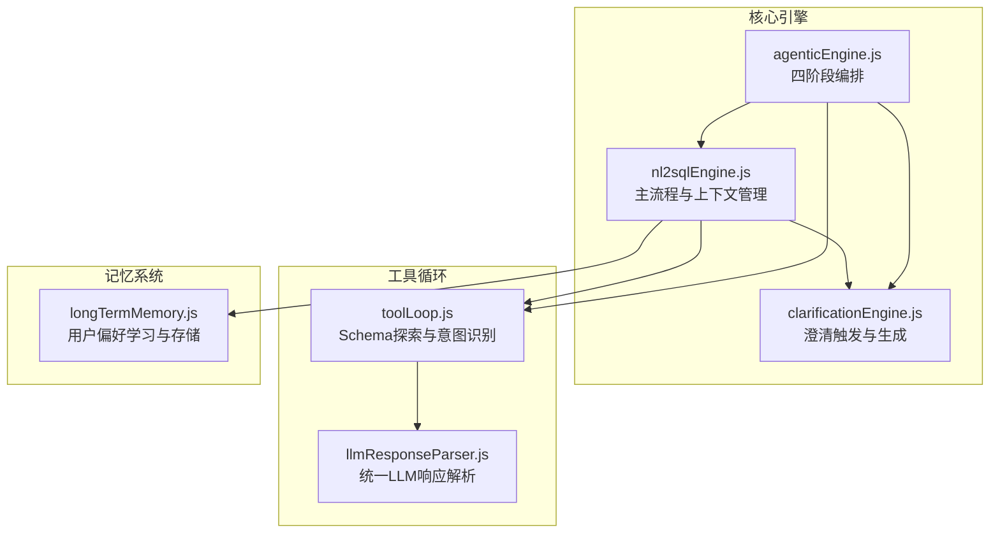
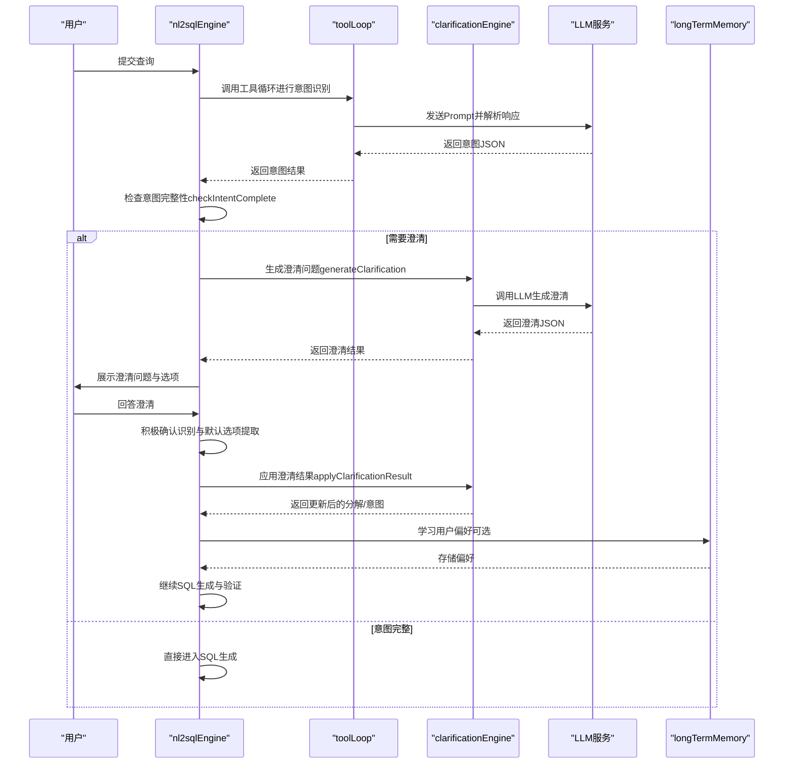
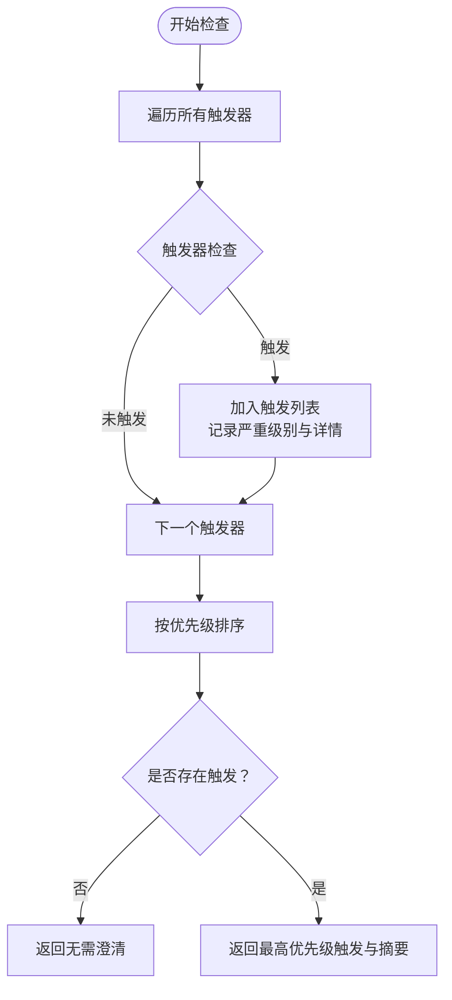
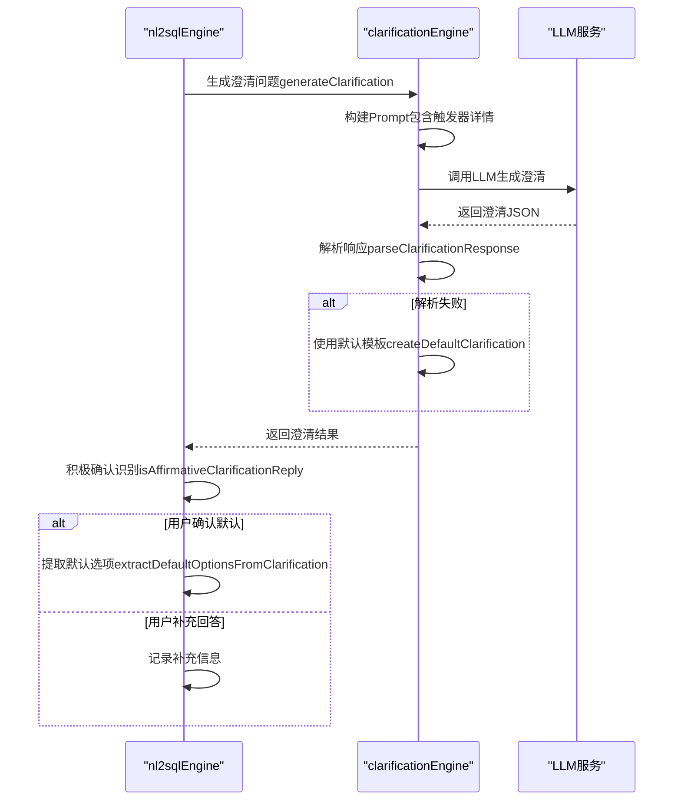
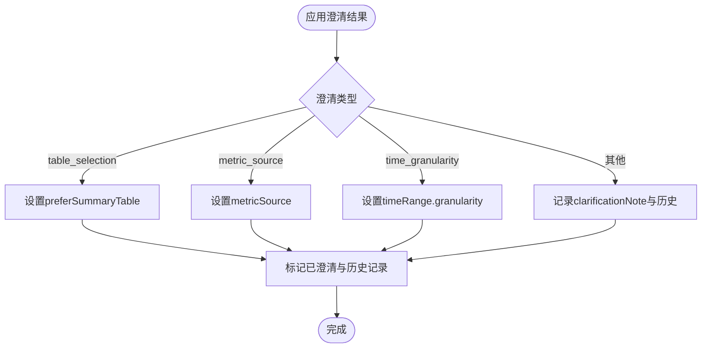
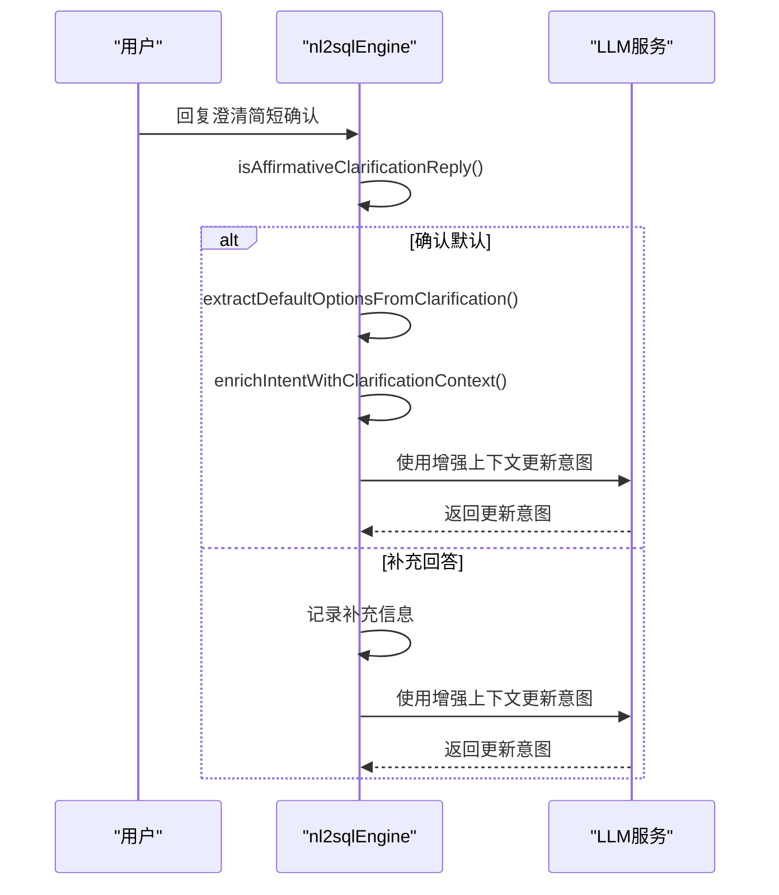
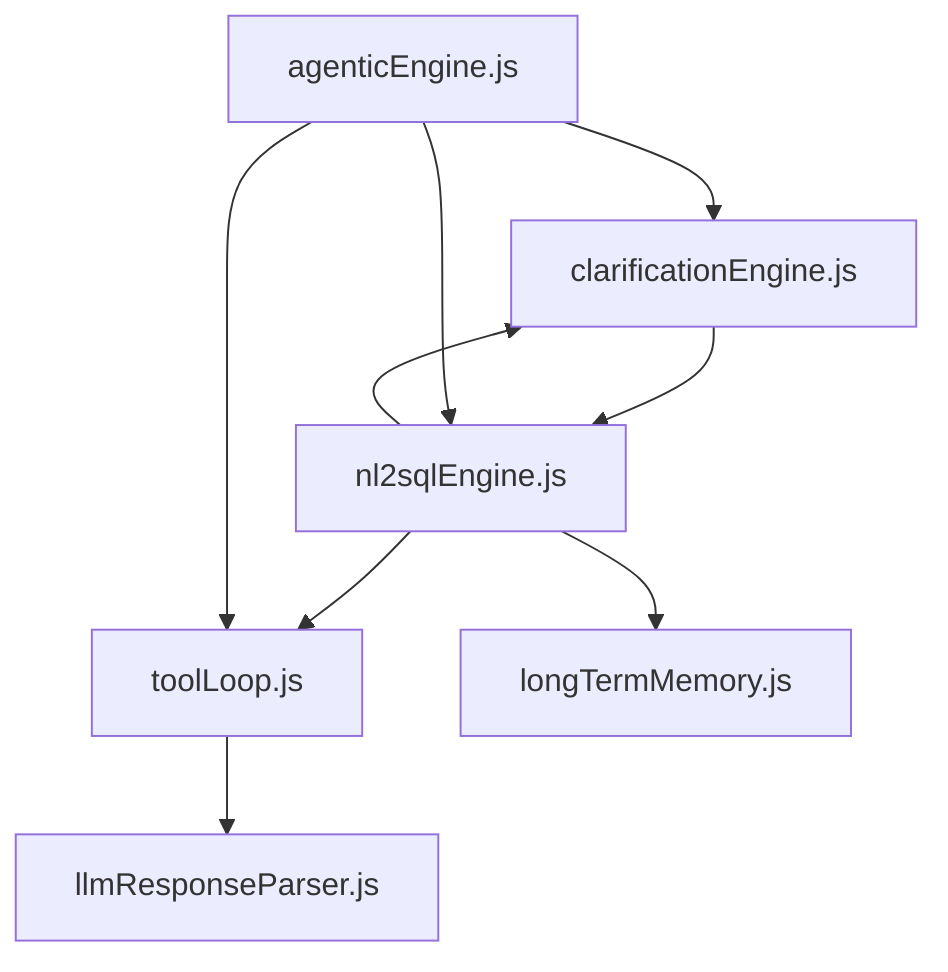

# 查询澄清与多轮对话

<cite>
**本文档引用的文件**
- [clarificationEngine.js](file://backend/src/core/clarificationEngine.js)
- [nl2sqlEngine.js](file://backend/src/core/nl2sqlEngine.js)
- [agenticEngine.js](file://backend/src/core/agenticEngine.js)
- [toolLoop.js](file://backend/src/core/toolLoop.js)
- [llmResponseParser.js](file://backend/src/utils/llmResponseParser.js)
- [longTermMemory.js](file://backend/src/memory/longTermMemory.js)
- [context-management.test.js](file://backend/test/context-management.test.js)
</cite>

## 目录
1. [简介](#简介)
2. [项目结构](#项目结构)
3. [核心组件](#核心组件)
4. [架构概览](#架构概览)
5. [详细组件分析](#详细组件分析)
6. [依赖关系分析](#依赖关系分析)
7. [性能考量](#性能考量)
8. [故障排查指南](#故障排查指南)
9. [结论](#结论)

## 简介
本技术文档聚焦于NL2SQL引擎的查询澄清机制，系统性阐述多轮对话处理算法，包括上下文管理、用户意图修正、信息收集策略等核心功能。文档详细说明澄清触发条件判断、默认选项提取机制、积极确认回复识别与歧义处理策略，并提供代码示例路径与用户体验优化建议，帮助开发者深入理解并扩展该机制。

## 项目结构
NL2SQL系统采用分阶段工作流，澄清机制位于第三阶段（Phase 3），与工具循环（Phase 1）、意图分解（Phase 2）、生成验证（Phase 4）协同工作。关键模块分布如下：
- 核心引擎：clarificationEngine.js（澄清触发与生成）、nl2sqlEngine.js（主流程与上下文管理）、agenticEngine.js（四阶段编排）
- 工具循环：toolLoop.js（Schema探索与意图识别）
- 工具循环：llmResponseParser.js（统一LLM响应解析）
- 长期记忆：longTermMemory.js（用户偏好学习与存储）

图表来源
- [clarificationEngine.js:1-489](file://backend/src/core/clarificationEngine.js#L1-L489)
- [nl2sqlEngine.js:1-2734](file://backend/src/core/nl2sqlEngine.js#L1-L2734)
- [agenticEngine.js:1-651](file://backend/src/core/agenticEngine.js#L1-L651)
- [toolLoop.js:1-521](file://backend/src/core/toolLoop.js#L1-L521)
- [llmResponseParser.js:1-146](file://backend/src/utils/llmResponseParser.js#L1-L146)
- [longTermMemory.js:1-1143](file://backend/src/memory/longTermMemory.js#L1-L1143)

章节来源
- [nl2sqlEngine.js:872-1221](file://backend/src/core/nl2sqlEngine.js#L872-L1221)
- [agenticEngine.js:1-651](file://backend/src/core/agenticEngine.js#L1-L651)

## 核心组件
- 澄清触发器（CLARIFICATION_TRIGGERS）：定义五种触发场景（无匹配表、表选择歧义、聚合指标来源不确定、时间粒度不明确、置信度过低），每种场景包含检查函数、严重级别、优先级与消息模板。
- 澄清生成器：基于触发器构建Prompt，调用LLM生成澄清问题，解析响应并提供默认回退方案。
- 澄清应用器：根据澄清类型（表选择、指标来源、时间粒度）更新分解结果，或记录一般性澄清。
- 上下文管理：积极确认回复识别（isAffirmativeClarificationReply）、默认选项提取（extractDefaultOptionsFromClarification）、历史澄清上下文增强（enrichIntentWithClarificationContext）。
- 集成点：与工具循环（意图识别）、语义层（概念匹配）、长期记忆（偏好学习）协作。

章节来源
- [clarificationEngine.js:26-182](file://backend/src/core/clarificationEngine.js#L26-L182)
- [clarificationEngine.js:196-232](file://backend/src/core/clarificationEngine.js#L196-L232)
- [clarificationEngine.js:246-272](file://backend/src/core/clarificationEngine.js#L246-L272)
- [clarificationEngine.js:388-426](file://backend/src/core/clarificationEngine.js#L388-L426)
- [nl2sqlEngine.js:767-785](file://backend/src/core/nl2sqlEngine.js#L767-L785)
- [nl2sqlEngine.js:794-830](file://backend/src/core/nl2sqlEngine.js#L794-L830)
- [nl2sqlEngine.js:832-871](file://backend/src/core/nl2sqlEngine.js#L832-L871)

## 架构概览
澄清机制在NL2SQL工作流中的位置与交互如下：

图表来源
- [nl2sqlEngine.js:1392-1482](file://backend/src/core/nl2sqlEngine.js#L1392-L1482)
- [nl2sqlEngine.js:1492-1552](file://backend/src/core/nl2sqlEngine.js#L1492-L1552)
- [toolLoop.js:307-344](file://backend/src/core/toolLoop.js#L307-L344)
- [clarificationEngine.js:246-272](file://backend/src/core/clarificationEngine.js#L246-L272)
- [longTermMemory.js:299-461](file://backend/src/memory/longTermMemory.js#L299-L461)

## 详细组件分析

### 澄清触发条件判断
澄清触发器定义五类触发场景，分别针对不同层面的信息缺失与歧义：
- 无匹配表（UNCOVERED_DATA_UNIT）：数据单元无法匹配到任何候选表，触发高优先级澄清。
- 表选择歧义（TABLE_AMBIGUITY）：同类型数据单元匹配到多个表，触发中优先级澄清。
- 聚合指标来源不确定（AGGREGATION_SOURCE_UNCERTAIN）：同时存在原始表与汇总表，触发低优先级澄清。
- 时间粒度不明确（TIME_GRANULARITY_UNCERTAIN）：时间单元缺少粒度信息，触发低优先级澄清。
- 置信度过低（LOW_CONFIDENCE）：整体置信度低于阈值，触发中/高优先级澄清。

触发器检查函数接收分解结果、候选表列表与置信度，返回触发状态、严重级别与详细信息。检查完成后按优先级排序，仅返回最高优先级触发，避免一次性提出过多问题。

图表来源
- [clarificationEngine.js:196-232](file://backend/src/core/clarificationEngine.js#L196-L232)
- [clarificationEngine.js:26-182](file://backend/src/core/clarificationEngine.js#L26-L182)

章节来源
- [clarificationEngine.js:26-182](file://backend/src/core/clarificationEngine.js#L26-L182)
- [clarificationEngine.js:196-232](file://backend/src/core/clarificationEngine.js#L196-L232)

### 澄清问题生成与默认选项提取
澄清问题生成器基于触发器构建Prompt，调用LLM生成结构化澄清问题，包含问题文本、选项列表、默认推荐、澄清类型与解释。若LLM响应解析失败，回退到默认模板。

默认选项提取机制支持两种来源：
- 结构化元数据：优先使用消息对象metadata中的defaultOptions数组，提取label或value。
- 文本解析：回退到从澄清文本中解析“（默认）”标记的选项，兼容历史数据。

图表来源
- [clarificationEngine.js:246-272](file://backend/src/core/clarificationEngine.js#L246-L272)
- [clarificationEngine.js:317-328](file://backend/src/core/clarificationEngine.js#L317-L328)
- [clarificationEngine.js:333-374](file://backend/src/core/clarificationEngine.js#L333-L374)
- [nl2sqlEngine.js:767-785](file://backend/src/core/nl2sqlEngine.js#L767-L785)
- [nl2sqlEngine.js:794-830](file://backend/src/core/nl2sqlEngine.js#L794-L830)

章节来源
- [clarificationEngine.js:246-374](file://backend/src/core/clarificationEngine.js#L246-L374)
- [nl2sqlEngine.js:767-830](file://backend/src/core/nl2sqlEngine.js#L767-L830)

### 应用澄清结果与歧义处理
应用澄清结果根据澄清类型更新分解/意图：
- 表选择澄清：设置preferSummaryTable偏好，影响后续表选择策略。
- 指标来源澄清：设置metricSource（实时/汇总/自动），指导聚合指标计算来源。
- 时间粒度澄清：为所有时间单元设置granularity（天/周/月/自动）。
- 一般性澄清：记录用户补充信息到clarificationNote与clarificationHistory。

歧义处理策略：
- 实体解析歧义：当数据库模糊匹配出现多个候选时，标记clarification_needed并提供候选选项，等待用户确认。
- 上下文融合：通过enrichIntentWithClarificationContext将上一轮澄清问题与用户确认的默认选项融入当前意图，避免重复澄清。

图表来源
- [clarificationEngine.js:388-471](file://backend/src/core/clarificationEngine.js#L388-L471)
- [nl2sqlEngine.js:832-871](file://backend/src/core/nl2sqlEngine.js#L832-L871)

章节来源
- [clarificationEngine.js:388-471](file://backend/src/core/clarificationEngine.js#L388-L471)
- [nl2sqlEngine.js:832-871](file://backend/src/core/nl2sqlEngine.js#L832-L871)

### 多轮对话与上下文管理
多轮对话的关键在于：
- 历史摘要与裁剪：通过token预算与摘要机制控制上下文长度，避免超出LLM上下文限制。
- 积极确认识别：isAffirmativeClarificationReply支持中文口语化确认（如“是”、“确认了”、“按默认”），提升用户体验。
- 默认选项提取：从澄清消息的metadata或文本中提取默认选项，实现“一键确认”。
- 上下文增强：enrichIntentWithClarificationContext将上一轮澄清问题与用户确认的默认选项注入当前意图，确保LLM在更新意图时能正确理解用户状态。

图表来源
- [nl2sqlEngine.js:767-785](file://backend/src/core/nl2sqlEngine.js#L767-L785)
- [nl2sqlEngine.js:794-830](file://backend/src/core/nl2sqlEngine.js#L794-L830)
- [nl2sqlEngine.js:832-871](file://backend/src/core/nl2sqlEngine.js#L832-L871)
- [context-management.test.js:139-180](file://backend/test/context-management.test.js#L139-L180)

章节来源
- [nl2sqlEngine.js:767-871](file://backend/src/core/nl2sqlEngine.js#L767-L871)
- [context-management.test.js:139-180](file://backend/test/context-management.test.js#L139-L180)

### 与工具循环与语义层的集成
- 工具循环（toolLoop）：在意图识别阶段使用工具循环探索Schema，提高表与字段识别准确性，间接降低澄清触发概率。
- 语义层（semanticLayer）：匹配业务概念并推荐表，提升查询理解质量，减少歧义与澄清需求。
- 长期记忆（longTermMemory）：学习用户偏好（字段别名、指标/维度习惯、过滤逻辑等），在后续查询中自动应用，减少澄清次数。

章节来源
- [toolLoop.js:307-344](file://backend/src/core/toolLoop.js#L307-L344)
- [longTermMemory.js:299-461](file://backend/src/memory/longTermMemory.js#L299-L461)
- [nl2sqlEngine.js:1584-1600](file://backend/src/core/nl2sqlEngine.js#L1584-L1600)

## 依赖关系分析
澄清机制的依赖关系如下：
- clarificationEngine依赖llmService进行LLM调用，依赖logger进行日志记录。
- nl2sqlEngine依赖clarificationEngine进行澄清生成与应用，依赖llmResponseParser进行统一响应解析，依赖longTermMemory进行偏好学习。
- agenticEngine作为顶层编排，协调clarificationEngine与toolLoop等模块。
- toolLoop依赖schemaTools与schemaLoader进行Schema探索，依赖llmService与llmResponseParser。

图表来源
- [clarificationEngine.js:14-15](file://backend/src/core/clarificationEngine.js#L14-L15)
- [nl2sqlEngine.js:17-31](file://backend/src/core/nl2sqlEngine.js#L17-L31)
- [agenticEngine.js:20-29](file://backend/src/core/agenticEngine.js#L20-L29)
- [toolLoop.js:16-20](file://backend/src/core/toolLoop.js#L16-L20)
- [llmResponseParser.js:9](file://backend/src/utils/llmResponseParser.js#L9)
- [longTermMemory.js:17-22](file://backend/src/memory/longTermMemory.js#L17-L22)

章节来源
- [clarificationEngine.js:14-15](file://backend/src/core/clarificationEngine.js#L14-L15)
- [nl2sqlEngine.js:17-31](file://backend/src/core/nl2sqlEngine.js#L17-L31)
- [agenticEngine.js:20-29](file://backend/src/core/agenticEngine.js#L20-L29)
- [toolLoop.js:16-20](file://backend/src/core/toolLoop.js#L16-L20)
- [llmResponseParser.js:9](file://backend/src/utils/llmResponseParser.js#L9)
- [longTermMemory.js:17-22](file://backend/src/memory/longTermMemory.js#L17-L22)

## 性能考量
- Prompt优化：澄清Prompt包含触发器详情与候选表摘要，建议控制候选数量（如最多5个表）以减少Token消耗。
- LLM调用成本：澄清生成与意图更新均需调用LLM，建议在触发器检查阶段尽早短路，避免不必要的LLM调用。
- 上下文长度控制：通过token预算与摘要机制限制历史长度，防止上下文溢出导致性能下降。
- 默认选项与积极确认：通过默认选项与积极确认识别减少重复澄清，提升用户效率。

## 故障排查指南
- 澄清问题生成失败：检查LLM响应解析（parseClarificationResponse），若失败则回退到默认模板（createDefaultClarification）。
- 默认选项提取异常：确认消息对象metadata中defaultOptions结构，若不存在则回退到文本解析（extractDefaultOptionsFromClarification）。
- 上下文识别错误：核对isAffirmativeClarificationReply的匹配规则，确保支持常见的中文口语化确认表达。
- 实体解析歧义：检查数据库模糊匹配逻辑，确保在多候选情况下正确标记clarification_needed并提供选项。

章节来源
- [clarificationEngine.js:266-271](file://backend/src/core/clarificationEngine.js#L266-L271)
- [clarificationEngine.js:317-328](file://backend/src/core/clarificationEngine.js#L317-L328)
- [nl2sqlEngine.js:767-785](file://backend/src/core/nl2sqlEngine.js#L767-L785)
- [nl2sqlEngine.js:794-830](file://backend/src/core/nl2sqlEngine.js#L794-L830)

## 结论
NL2SQL的查询澄清机制通过五类触发器精准识别信息缺失与歧义，结合LLM生成结构化澄清问题与默认选项，配合积极确认识别与上下文增强，实现了高效、友好的多轮对话体验。与工具循环、语义层和长期记忆的深度集成进一步提升了系统的智能化水平与用户满意度。未来可在默认选项的语义理解与历史澄清的跨轮一致性方面持续优化，以进一步降低澄清频率并提升准确性。